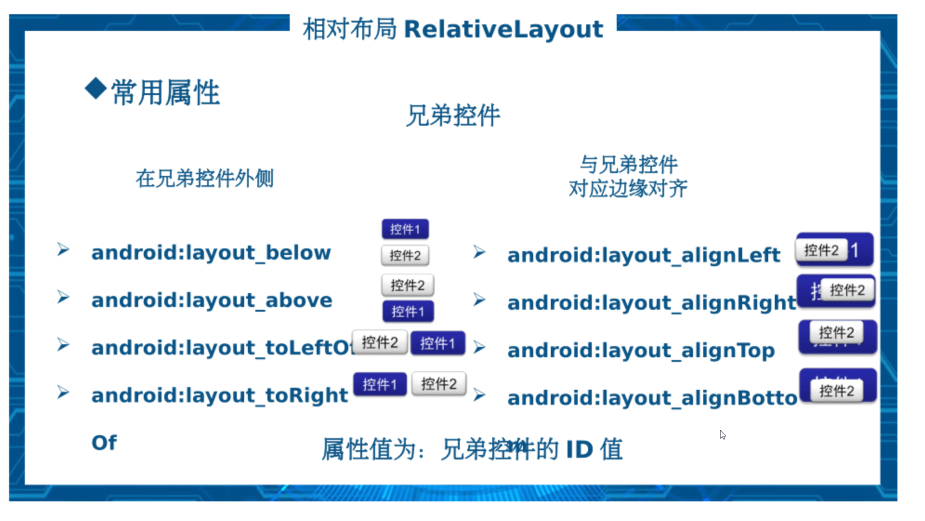
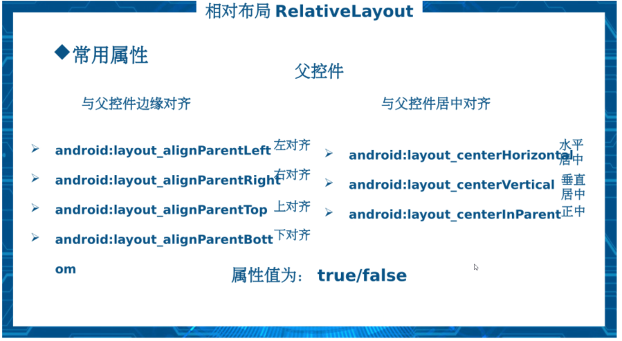
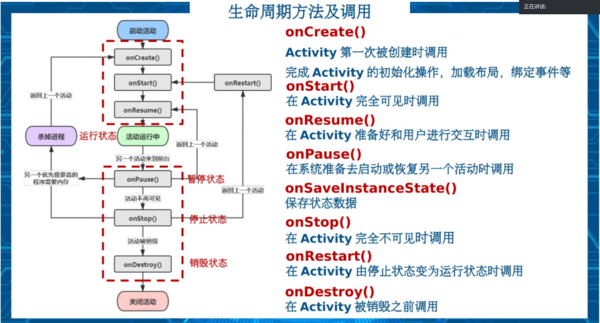

## 1. 相对布局





## 下拉选项spinner

```java
package com.example.myapplication;
import android.os.Bundle;
import android.view.View;
import android.widget.AdapterView;
import android.widget.ArrayAdapter;
import android.widget.Spinner;
import android.widget.Toast;

import androidx.annotation.Nullable;
import androidx.appcompat.app.AppCompatActivity;

public class MainActivitySpinner extends AppCompatActivity{
    Spinner spinner;
    String[] major;

    @Override
    protected void onCreate(@Nullable Bundle savedInstanceState) {
        super.onCreate(savedInstanceState);
        setContentView(R.layout.active_spinner);
        spinner = findViewById(R.id.spinner);

        //准备数据
        major = new String[]{"软件技术", "通信技术", "计算机应用技术", "大数据技术"};
        /**
         * 创建适配器
         * @Param context:上下文对象 MainActivity对象
         * @Param :布局
         */
        ArrayAdapter adapter = new ArrayAdapter(MainActivitySpinner.this, android.R.layout.simple_expandable_list_item_1,major);
        //设置到Spinner
        spinner.setAdapter(adapter);

        // Spinner的事件处理
        spinner.setOnItemSelectedListener(new AdapterView.OnItemSelectedListener() {
            //参数position是选项的位置，与数组中的位置是一致的
            @Override
            public void onItemSelected(AdapterView<?> parent, View view, int position, long id) {
                Toast.makeText(MainActivitySpinner.this, "你选中的是"+ major[position], Toast.LENGTH_LONG).show();
            }

            @Override
            public void onNothingSelected(AdapterView<?> parent) {
            }
        });
    }
}
```

## 3. 跳转页面

### 3.1 startActivityForResult跳转页面

第一个页面

```java
Intent intent1=new Intent();
intent1.setAction("android.intent.action.MessageStatus");
intent1.putExtra("text1", text1);
//TODO Ⅰ startActivityForResult跳转页面
//TODO Ⅰ.1 startActivityForResult跳转页面
/**
  * @Parent Intent intent
  * @Parent RequestCode 请求码 用于区分到底是哪一个页面带回的请求数据
*/
startActivityForResult(intent1,1);//跳转到页面
```

第二个页面
```java
 @Override
    public void onClick(View view) {
        Intent intent1 = new Intent();
        Bundle bundle = new Bundle();
        switch (view.getId()) {
            case R.id.tv_status1:
                bundle.putInt("image", R.drawable.freetime);
                bundle.putString("text", "空闲中");
                break;
            case R.id.tv_status2:
                bundle.putInt("image", R.drawable.ic_fishing);
                bundle.putString("text", "摸鱼中");
                break;
        }
        intent1.putExtras(bundle);
        //TODO Ⅰ.2 setResult回去上一个页面，返回数据
        /**
         * @Param ResultCode: 结果码
         * @Param Intent: 带数据回去
         */
        setResult(RESULT_OK, intent1);//回去上一个页面
        finish();//让当前页面关闭，此页面出栈进入销毁状态
    }
```

## 4. 生命周期方法及调用



