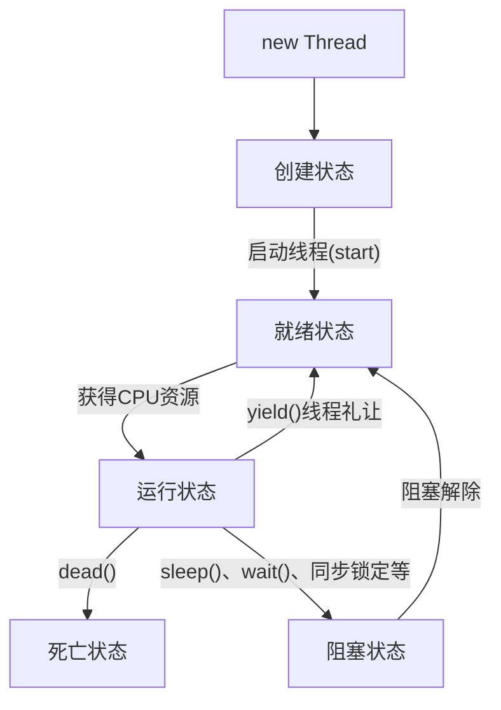
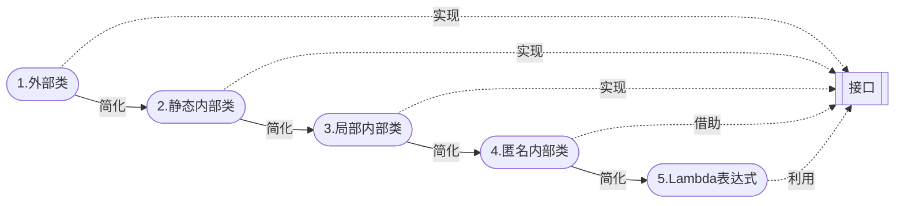

[多线程01：概述_哔哩哔哩_bilibili](https://www.bilibili.com/video/BV1V4411p7EF?p=1&vd_source=796ed40051b301bfa3a84ba357f4828c)的自学笔记

>1. [多线程](##一. 多线程)
>2. [Lambda表达式](##二. Lambda表达式)
>3. [静态代理模式](##三.  静态代理模式)
>
>

## 一. 多线程

多线程是[静态代理](##三. 静态代理模式)模式

- 线程就是独立的执行路径

- 在程序运行时，即使没有自己创建线程，后台也会有多个线程，如主线程，gc线程

- main()称之为主线程，为系统的入口，用于执行整个程序

- 在一个进程中，如果开辟了多个线程，线程的运行由**调度器(cpu)安排调度**，调度器是与操作系统紧密相关的，先后顺序是不能人为的干预的

- 对同一份资源操作时，会存在资源抢夺的问题，需要加入**并发控制**

- 线程会带来额外的开销，如cpu调度时间，并发控制开销

- 每个线程在自己的工作内存交互，内存控制不当会造成数据不一致

  > 当发生并发时，如买票，多个人同时买，他们都发现售票处还有一张票，就把一张票拷贝的自己的内存区域，然后进行购买，结果是每人买了一张票，购买时售票处票数`--`，售票处还有负数张票）

### 1. 线程的三种实现方式

> 1. [继承Thread类(重点)](####1.1 继承Thread类(重点))
>    - 不建议使用，OOP单继承局限性
>      - 单继承：java只能继承一个，不能继承多个，只能有一个父类
> 2. [实现Runnable接口(重点)](####1.2 实现Runnable接口(重点))
>    - 推荐使用，避免单继承局限性，灵活方便，方便同一个对象被多个线程使用
> 3. [实现Callable接口(了解)](####1.3 实现Callable接口(了解))

注：

>1和2两种方式本质时一样的：
>
>1. 源码中Thread类实现了Runnable接口
>   - 继承Thread类便等同于实现了Runnable接口，它就是一个线程类了
>2. Thread类中有start()sleep()等方法
>   - 继承Thread类就有了start()等方法
>   - 实现Runnable接口这个方式没有这些方法，需要用Thread代理使用这些方法
>     - Thread代理就是用Thread带参构造方法将Runnable接口实现类对象作为参数创建Thread对象，调用start()等方法

#### 1.1 继承Thread类(重点)

1. 自定义线程类继承`extends Thread`

   ```java
   public class TestThread1 extends Thread{}
   ```

2. 重写`run()`方法，编写线程执行体
   ```java
   @Override
       public void run(){}
   ```
   
3. *创建自定义线程类对象，调用start()方法启动线程*(与实现[Runnable接口](###2. 实现Runnable接口)有区别)
   
   ```java
   TestThread1 testThread1 = new TestThread1();
   testThread1.start();
   ```

##### 1.1.1 演示

```java
// 创建线程方式1：继承Thread类
public class TestThread1 extends Thread{
    @Override
    public void run() {
        //run方法线程体
        for (int i = 0; i < 2000; i++) {
            System.out.println("我在看代码--" + i);
        }
    }

    public static void main(String[] args) {
        //main线程，主线程
        //创建一个线程对象
        TestThread1 testThread1 = new TestThread1();
        //调用start()方法开启线程
        testThread1.start();//线程不一定立即执行CPU安排调度

        for (int i = 0; i < 2000; i++) {
            System.out.println("我在学习多线程--" + i);
        }
    }
}
```

##### 1.1.2 案例 

###### 1.1.2.1 Thread实现多线程同步下载图片

> 首先需要jar包([Commons IO – Download Apache Commons IO](https://commons.apache.org/proper/commons-io/download_io.cgi))用于下载网络图片

```java
import org.apache.commons.io.FileUtils;

import java.io.File;
import java.io.IOException;
import java.net.URL;
// 练习
//  Thread实现多线程同步下载图片
//  首先需要引入jar包
public class TestThread2 extends Thread{
    private String url;//网络图片地址
    private String name;//保存的文件名

    public TestThread2(String url, String name) {
        this.url = url;
        this.name = name;
    }
    @Override
    public void run() {
        WebDownloader webDownloader = new WebDownloader();
        webDownloader.downloader(url, name);
        System.out.println("现在的文件名为：" + name);
    }

    public static void main(String[] args) {
        TestThread2 t1 = new TestThread2("https://img-home.csdnimg.cn/images/20230213094345.jpg", "1.jpg");
        TestThread2 t2 = new TestThread2("https://img-home.csdnimg.cn/images/20230213094345.jpg", "2.jpg");
        TestThread2 t3 = new TestThread2("https://img-home.csdnimg.cn/images/20230213094345.jpg", "3.jpg");
        t1.start();
        t2.start();
        t3.start();
    }
}

class WebDownloader {
    //下载方法
    public void downloader(String url, String name) {
        try {
            FileUtils.copyURLToFile(new URL(url), new File(name));//把一个网络url变为图片下载为name
        } catch (IOException e) {
            e.printStackTrace();
            System.out.println("IO异常,download方法出现问题");
        }
    }
}
```

#### 1.2 实现Runnable接口(重点)

1. 定义类，实现Runnable接口
   ```java
   public class TestThread3 implements Runnable{}
   ```
   
2. 实现run()方法，编写线程执行体
   ```java
   @Override
       public void run() {}
   ```
   
3. 创建Runnable接口的实现类对象
   ```java
   TestThread3 testThread3 = new TestThread3();
   ```
   
4. *创建线程对象，调用线程对象调用start()方法启动线程*, <u>代理</u>   (与[继承Thread类](###1. 继承Thread类)有区别)

   ```java
   Thread thread = new Thread(testThread3);//代理
   thread.start();
   ```
   
   

##### 1.2.1 演示

```java
public class TestThread3 implements Runnable{
    @Override
    public void run() {
        //run方法线程体
        for (int i = 0; i < 2000; i++) {
            System.out.println("我在看代码--" + i);
        }
    }

    public static void main(String[] args) {
        //main线程，主线程
        //创建一个Runnable接口的实现类(一份资源)
        TestThread3 testThread3 = new TestThread3();
        
/*
        //创建线程对象，通过线程对象来开启线程，(多次代理)
        Thread thread1 = new Thread(testThread3);//参数: runnable接口的实现类
        Thread thread2 = new Thread(testThread3);
        //调用start()方法开启线程
        thread.start();
        thread.start();
*/
        
        //创建线程对象，通过线程对象来开启线程，(多次代理)
        new Thread(testThread3).start();//同上两行代码
        new Thread(testThread3).start();

        for (int i = 0; i < 2000; i++) {
            System.out.println("我在学习多线程--" + i);
        }
    }
}
```

##### 1.2.2 案例(多个线程同时操作一同个对象)

###### 1.2.2.1 买火车票

```java
//多个线程同时操作一个对象
//买火车票

//发现问题 多个资源操作同一个资源的情况下，线程不安全，数据紊乱
//	有时抢到同一张票，又有时抢到0或-1张票
public class TestThread4 implements Runnable{

    //票数
    int tickNumbers = 10;

    @Override
    public void run() {
        while (true) {
            if (tickNumbers <= 0) {
                break;
            }
            //模拟延时
            try {
                Thread.sleep(1000);
            } catch (InterruptedException e) {
                throw new RuntimeException(e);
            }
            System.out.println(Thread.currentThread().getName() + "拿到了第" + tickNumbers-- + "张票");
        }
    }

    public static void main(String[] args) {
        TestThread4 ticket = new TestThread4();

        new Thread(ticket, "小明").start();
        new Thread(ticket, "老师").start();
        new Thread(ticket, "黄牛党").start();
    }
}
```

###### 2.2.2 龟兔赛跑

```java
//模拟龟兔赛跑
public class Race implements Runnable {
    //胜利者
    private static String winner;

    @Override
    public void run() {
        for (int i = 0; i <= 1000; i++) {

            //模拟兔子休息 且每50步休息一次
            if (Thread.currentThread().getName().equals("兔子") && i%50 == 0) {
                try {
                    Thread.sleep(10);
                } catch (InterruptedException e) {
                    e.printStackTrace();
                }
            }
            //判断比赛是否结束
            boolean flag = gameOver(i);
            if (flag) {
                break;
            }
            System.out.println(Thread.currentThread().getName() + "跑了" + i + "步");
        }
    }


    /**
     * 判断比赛是否结束
     * @param steps 步数
     * @return
     */
    private boolean gameOver(int steps) {
        if (winner != null) {
            //已经存在胜利者了
            return true;
        }
        {   //这是一个代码块
            if (steps >= 1000) {
                winner = Thread.currentThread().getName();
                System.out.println("winner is " + winner);
                return true;
            }
        }
        return false;
    }

    public static void main(String[] args) {
        Race race = new Race();//一条赛道

        new Thread(race, "兔子").start();
        new Thread(race, "乌龟").start();
    }
}
```

#### 1.3 实现Callable接口(了解)

1. 实现Callable接口，需要返回值类型
   ```java 
   implements Callable<返回值类型> 
   ```

2. `重写call方法，需要抛出异常

   ```java
   @Override
   public 返回值类型 call() {}
   ```

3. 创建目标对象(Callable接口实现类)

   ```java
   目标类 目标对象 = new 目标类();
   ```

4. 创建执行服务(线程池服务为固定几个线程的线程池) Executor: 线程池 fixed：固定的 Pool：池
   ```java
   ExecutorService ser = Executors.newFixedThreadPool(线程个数);
   ```

5. 提交执行(返回一个封装返回值的Future类)
   ```java
   Future<返回值类型> result1 = ser.submit(目标对象);
   Future<返回值类型> result2 = ser.submit(目标对象);
   //...  这里可以写线程个数个执行
   ```

6. 获取结果
   ```java
   返回值类型 r1 = result1.get();
   返回值类型 r2 = result1.get();
   //...
   ```

7. 关闭服务
   ```java
   ser.shutdownNow();
   ```

好处

>Callable的好处
>
>1. 可以定义返回值
>2. 可以抛出异常

##### 1.3.1 演示

```java
public class TestCallable implements Callable<Boolean> {//Boolean是返回值类型
    @Override
    public Boolean call() {//这里的call()方法类似上两种方式的run()方法
        //cal方法线程体
        for (int i = 0; i < 2000; i++) {
            System.out.println("我在看代码--" + i);
        }
        return true;
    }
    public static void main(String[] args) throws ExecutionException, InterruptedException {
        TestCallable t1 = new TestCallable();//创建Callable接口实现类
        TestCallable t2 = new TestCallable();
        TestCallable t3 = new TestCallable();
        
        //创建执行服务(线程池服务 创建固定线程池) Executor: 线程池 fixed：固定的 Pool：池
        ExecutorService ser = Executors.newFixedThreadPool(3);//3是固定线程池的个数
        
        //提交执行 (返回一个封装返回值类型的Future类)
        Future<Boolean> r1 = ser.submit(t1);
        Future<Boolean> r2 = ser.submit(t2);
        Future<Boolean> r3 = ser.submit(t3);
        
        //获取结果
        boolean rs1 = r1.get();
        boolean rs2 = r2.get();
        boolean rs3 = r3.get();

        System.out.println(rs1);
        System.out.println(rs2);
        System.out.println(rs3);
        //关闭线程池服务
        ser.shutdownNow();
    }
}
```

##### 1.3.2 案例

###### 1.3.2.1 利用Callable改造下载图片案例

[点击查看原下载图片案例](#####1.1.2.1 Thread实现多线程同步下载图片)

```java
public class TestCallable implements Callable<Boolean> {
    private String url;//网络图片地址
    private String name;//保存的文件名

    public TestCallable(String url, String name) {
        this.url = url;
        this.name = name;
    }
    @Override
    public Boolean call() {
        WebDownloader webDownloader = new WebDownloader();
        webDownloader.downloader(url, name);
        System.out.println("现在的文件名为：" + name);
        return true;
    }

    public static void main(String[] args) throws ExecutionException, InterruptedException {
        TestCallable t1 = new TestCallable("https://img-home.csdnimg.cn/images/20230213094345.jpg", "1.jpg");
        TestCallable t2 = new TestCallable("https://img-home.csdnimg.cn/images/20230213094345.jpg", "2.jpg");
        TestCallable t3 = new TestCallable("https://img-home.csdnimg.cn/images/20230213094345.jpg", "3.jpg");

        //创建执行服务 Executor: 线程池 fixed：固定的 Pool：池
        ExecutorService ser = Executors.newFixedThreadPool(3);

        //提交执行
        Future<Boolean> r1 = ser.submit(t1);
        Future<Boolean> r2 = ser.submit(t2);
        Future<Boolean> r3 = ser.submit(t3);

        //获取结果
        boolean rs1 = r1.get();
        boolean rs2 = r2.get();
        boolean rs3 = r3.get();

        System.out.println(rs1);
        System.out.println(rs2);
        System.out.println(rs3);
        //关闭服务
        ser.shutdownNow();
    }
}

class WebDownloader {
    //下载方法
    public void downloader(String url, String name) {
        try {
            FileUtils.copyURLToFile(new URL(url), new File(name));//把一个网络url变为图片下载为name
        } catch (IOException e) {
            e.printStackTrace();
            System.out.println("IO异常,download方法出现问题");
        }
    }
```

### 2. 线程的五大状态流程及方法

#### 2.1 五大状态流程图



#### 2.2 线程方法

| 方法                           | 说明                                                         |
| ------------------------------ | ------------------------------------------------------------ |
| setPriority(int newPriority)   | 更改线程的优先级                                             |
| static void sleep(long millis) | 让当前正在执行的线程休眠millis毫秒                           |
| void join()                    | 等待该线程终止                                               |
| static void yield()            | 线程礼让，从运行状态转为就绪状态，重新开始cpu调度，从运行状态转为就绪状态 |
| void interrupt()               | 中断线程(不建议用这种方式)                                   |
| boolean isAlive()              | 测试线程是否处于活动状态                                     |

#### 2.3【stop】停止

- 这里的stop是自己写的，需要自己控制

##### 2.3.1 详解

- 不推荐使用JDK提供的stop()、destriy方法【已废弃】

- 推荐线程自己停下来

  - 建议使用一个标志位进行终止变量，当flag=false，则终止线程
    
    ```java
    public class Thread1 implements Runnable{	
    	@Override
    	public void run() {
    	    //线程体使用该标志
    	    while (flag) {
    	        //...
    	    }
    	}
    	//在线程中写一个stop方法，用于修改标志位
    	public void stop() {
    	    this.flag = false;
    	}
    }
    ```
    

##### 2.3.2 代码演示

```java
public class TestStop implements Runnable{

//    1.设置一个标志位
    private boolean flag = true;
    @Override
    public void run() {
        int i = 0;//线程执行的次数
        while (flag) {
            System.out.println("线程执行run...Thread" + i++ + "次");
        }
    }

//    2.设置一个公开的方法停止线程，转换标志位
    public  void stop() {
        this.flag = false;
    }

    public static void main(String[] args) {
        TestStop testStop = new TestStop();
        new Thread(testStop).start();
        System.out.println("线程开始了");

        for (int i = 0; i < 2000; i++) {//i main方法执行的次数
            System.out.println("main执行" + i + "次");
            if (i == 900) {
//                调用stop方法切换标志位，让线程停止
                testStop.stop();
                System.out.println("线程停止了");
            }
        }
    }
}
```

#### 2.4 sleep休眠

##### 2.4.1 详解

- sleep(毫秒值)：指定当前线程阻塞的毫秒值
- sleep存在InterruptedException
- sleep时间达到后线程进入就绪状态
- sleep可以模拟网络延时，倒计时等
- 每个对象都有一个锁🔒，sleep不会释放锁

##### 2.4.2 代码演示

```java
////打印10次当前系统时间，每秒打印一次
public static void main(String[] args) {
        Date startTime = new Date(System.currentTimeMillis());//获取系统当前时间
        int i = 0;
        while (i < 10) {
            try {
                Thread.sleep(1000);
                System.out.println(new SimpleDateFormat("HH:mm:ss").format(startTime));
                startTime = new Date(System.currentTimeMillis());
                i++;
            } catch (InterruptedException e) {
                throw new RuntimeException(e);
            }
        }
}
```

#### 2.5 yield礼让

- 礼让就是重新开始cpu调度，从运行状态转为就绪状态

##### 2.5.1 详解

- 将线程从运行状态转为就绪状态，但不阻塞，与其他线程重新竞争cpu
- 让cpu重新调度，礼让不一定会比其他线程慢，看cpu心情

##### 2.5.2 代码演示

```java
public class TestYield {
    public static void main(String[] args) {
        MyYield myYield = new MyYield();

        new Thread(myYield, "a").start();
        new Thread(myYield, "b").start();
    }
}

class MyYield implements Runnable {
    @Override
    public void run() {
        System.out.println(Thread.currentThread().getName() + "线程开始执行");
        //礼让后，甲从运行状态转为暂停(就绪状态)，乙本就是就绪状态，cpu重新调度，可能出现甲继续运行
        Thread.yield();
        System.out.println(Thread.currentThread().getName() + "线程停止执行");
    }
}
```

#### 2.6 join插队

##### 2.6.1 详解

- 强制执行且很霸道
- 类似vip，没有插队(没有vip)时公平执行，插队(有vip)后强制执行插队线程
- 直到插队(vip)线程执行完毕才可执行其他线程

##### 2.6.2 代码演示

```java
//插队,且很霸道
public class TestJoin implements Runnable{
    @Override
    public void run() {
        for (int i = 0; i < 100; i++) {
            System.out.println("线程vip来啦" + i);
        }
    }

    public static void main(String[] args) throws InterruptedException {
        //启动我们的线程
        TestJoin testJoin = new TestJoin();
        Thread thread = new Thread(testJoin);
        thread.start();

        //主线程
        for (int i = 0; i < 1000; i++) {
            if (i == 200) {
                thread.join();//插main线程的队，当main线程执行到199时thread执行且必须thread执行完后main才能继续执行
            }
            System.out.println("main" + i);
        }
    }
}
```

#### 2.7 观测线程状态

##### 2.7.1 语法

state是Thread中一个枚举类型的变量

```java
Thread.State state = thread.getState();
```

##### 2.7.2 含义

| 状态          | 简述 | 含义                                                   |
| ------------- | ---- | ------------------------------------------------------ |
| NEW           | 新生 | 尚未启动的线程                                         |
| RUNNABLE      | 运行 | Java虚拟机中执行的线程                                 |
| BLOCKED       | 阻塞 | 被阻塞等待监视器锁定的线程                             |
| WAITING       | 阻塞 | 正在等待另一个线程执行特定动作的线程                   |
| TIMED WAITING | 阻塞 | 正在等待另一个线程执行动作达到指定时间的线程处于此状态 |
| TERMINATED    | 死亡 | 已退出的线程                                           |

### 3.  线程优先级

#### 3.1 详情

线程的优先级用数字表示，范围从0~10(数字越大优先级越高，cpu越容易调度)

```java
//Thread中源码的一些常量
public static final int MAX_PRIORITY = 10;
...
```

> Thread.MIN_PRIORITY = 1
> Thread.MAX_PRIORITY = 10
> Thread.NORE_PRIORITY = 5

使用`getPriority()`和`setPriority(int xxx)`来获取和改变优先级

#### 3.2 代码演示

```java
//打印不同优先级的各线程，观察执行顺序
public class TestPriority{
    public static void main(String[] args) {
        //main主线程是默认优先级5，无法改变
        System.out.println(Thread.currentThread().getName() + "-->" + Thread.currentThread().getPriority());

        MyPriority myPriority = new MyPriority();
        Thread t1 = new Thread(myPriority);
        Thread t2 = new Thread(myPriority);
        Thread t3 = new Thread(myPriority);
        Thread t4 = new Thread(myPriority);
        Thread t5 = new Thread(myPriority);
        Thread t6 = new Thread(myPriority);

        //设置优先级（优先级再1-10之间）
        t1.setPriority(Thread.MIN_PRIORITY);//1
        t2.setPriority(2);
        t3.setPriority(3);
        t4.setPriority(4);
        t5.setPriority(5);
        t6.setPriority(Thread.MAX_PRIORITY);//10

        //启动
        t1.start();
        t2.start();
        t3.start();
        t4.start();
        t5.start();
        t6.start();
    }
}

class MyPriority implements Runnable {
    @Override
    public void run() {
        System.out.println(Thread.currentThread().getName() + "-->" + Thread.currentThread().getPriority());
    }
}
```

### 4. 守护线程(daemon)

#### 4.1 详解

- 线程分为用户现程(默认就是用户线程)和守护线程
  ```java
  //将thread线程设为守护线程 Daemon：守护线程
  thread.setDaemon(true);//默认是false表示是用户线程，不是守护线程
  ```
- 虚拟机必须确保「用户线程」执行完毕
- 虚拟机不用等待守护线程执行完毕
- 如，后台记录操作日志，监控内存，垃圾回收等待

> 注：
>
> 1. 虚拟机不会管守护线程，其他线程跑完后不管守护线程是否跑完，虚拟机都会关闭
> 2. 虚拟机关闭需要时间，因此守护线程在用户线程跑完后仍会运行一段时间

#### 4.2 代码演示

```java
//上帝守护你直到你死去
public class TestDaemon {
    public static void main(String[] args) {
        God god = new God();
        You you = new You();

        Thread thread = new Thread(god);
        thread.setDaemon(true);//默认是false表示是用户线程，true为守护线程

        thread.start();//上帝 守护线程  虚拟机不会管守护线程，其他线程跑完后不管守护线程是否跑完，虚拟机仍会结束，虚拟机关闭需要时间，因此守护线程在用户线程跑完后仍会运行一段时间

        new Thread(you).start();//你 用户线程启动
    }
}

//上帝 上帝一直在保佑着你，直到你死去
class God implements Runnable {
    @Override
    public void run() {
        while (true) {
            System.out.println("上帝保佑着你");
        }
    }
}

//你 活了16500天
class You implements Runnable {
    @Override
    public void run() {
        for (int i = 0; i < 36500; i++) {
            System.out.println("今天你成功生存了" + i + "天");
        }
        System.out.println("====goodbye！world====");
    }
}
```

### 5.  线程同步（队列+锁）

#### 5.1 发现问题：

- 多个线程操作同一块存库空间，带来方便的同时，也带来了「并发」问题

- 并发：同一个对象被多个线程同时操作

- 多个线程访问同一对象，且某些线程还想修改这个对象，我们就需要「线程同步」来解决这个问题

  > 比如银行：
  > 同一张银行卡存了300w RMB
  > 你和你媳妇同时取钱出现并发问题，
  > 你在手机上取100RMB，
  > 你媳妇在银行取300w RMB，
  > 这样就会获得300.01w RMB,出现问题，
  > 银行血亏100RMB
  
- 当发生并发时，如买票，多个人同时买，他们都发现售票处还有一张票，就把一张票拷贝的自己的内存区域，然后进行购买，结果是每人买了一张票，购买时售票处票数`--`，售票处还有负数张票）

#### 5.2 解决问题「队列 + 锁」

- 线程同步其实就是一种**等待机制**

- 解决方式：「队列 + 锁」

  - **保证线程的安全性**

    > eg:上厕所
    >
    > 多个用户同时上厕所，需要排队
    > 上厕所的人会把坑上的门反锁保证其余人不会进入
    >
    > 当上完厕所后打开锁
    > 队列中下一人进入

    - 多个需要同时访问此对象的线程进入这个对象的「对象等待池」形成**队列**，等待前面线程执行完毕，下一个线程再使用

    - 为保证队列，在访问时加入了**锁机制(synchronized)**，当一个线程获得对象的排他锁后，独占资源，其他线程必须等待，使用后释放锁即可

    - 每个线程**在自己的工作内存交互**，内存控制不当会造成数据不一致

      > eg:买票，多个人同时买，他们都发现售票处只有一张票时，就把售票处还有一张票拷贝的自己的内存区域，然后进行购买，结果是每人买了一张票，购买时售票处票数`--`，结果是售票处还有负数张票）

  - **队列 + 锁会出现以下问题**

    - 一个线程持有锁会导致其他所有需要此锁的线程**挂起**(性能变慢)
    - 在多线程竞争下，加锁，释放锁会导致比较多的「上下文切换」和「调度延时」，引起性能问题(性能变慢)
    - 如果一个优先级高的线程等待一个优先级低的线程释放锁会导致**优先级倒置**，引起性能问题

### 6 . synchronized锁

synchronized锁的两种用法：

1. synchronized()方法
2. synchronized块

- synchronized()方法只能锁this
- 方法里面需要修改的内容才需要锁，锁的太多会浪费资源，由此产生synchronized块
- synchronized(Obj){}代码块可以锁任意对象，锁住的对象就是变化的对象，需要增删改的对象

#### 6.1 synchronized()方法

##### 6.1.1  详解

```java
 public synchronized void method(int args){}
```

- 同步方法的Obj「同步监视器」就是this
- synchronized方法控制对「对象」的访问，每个对象对应一把锁，每个synchronized方法必须调用该方法的对象的锁才能执行synchronized方法，否则线程会阻塞
- 方法一旦执行，就独占该锁，直到该方法返回才释放锁，后面被阻塞的线程才能获得这个锁继续执行
- 缺陷：若将一个大的方法申明为synchronized将会影响效率（不高效）

##### 6.1.2 案例买票

```Java
//不安全的买票(会出现多个线程同时发现还有1张票，并将有一张票的信息拷贝到自己内存空间，多个线程同时买这一张票，售票处票数多次--，出现负数)
//解决方式：synchronized方法（锁的是this）
public class UnsafeBuyTicket {
    public static void main(String[] args) {
        BuyTicket station = new BuyTicket();

        new Thread(station,"苦逼的我").start();
        new Thread(station,"牛逼的你们").start();
        new Thread(station,"可恶的黄牛党").start();
    }
}

class BuyTicket implements Runnable {
    private int ticketNums = 10;
    boolean flag = true;//外部停止方式

    @Override
    public void run() {
        //买票
        while (flag) {
            try {
                buy();
            } catch (InterruptedException e) {
                throw new RuntimeException(e);
            }
        }
    }

    //买票
    private void buy() throws InterruptedException {
        //判断是否有票
        if (ticketNums <= 0) {
            flag = false;
            return;
        }
        Thread.sleep(100);
        //买票
        System.out.println(Thread.currentThread().getName() + "拿到" + ticketNums--);
    }
}
```

#### 6.2 synchronized同步块

##### 6.2.1 详解

```java 
synchronized(Obj){}
```

- 产生：方法里面需要修改的内容才需要锁，锁的太多会浪费资源，由此产生synchronized块
- Obj 就是锁住的对象，称之为「同步监视器」
  - Obj 可以是**任何对象**，但是推荐使用共享资源作为同步监视器
  - 锁住的对象就是变化的对象，需要增删改的对象
  - 同步方法中无需指定同步监视器，因为同步方法的同步监视器就是this，就是这换个对象本身，或者是 class【反射中】
- Obj「同步监视器」的执行过程
  1. 第一个线程访问，锁定同步监视器，执行其中代码
  2. 第二个线程访问，发现同步监视器被锁定，无法访问
  3. 第一个线程访问完毕，解锁同步监视器
  4. 第二个线程访问，发现同步监视器没有锁，然后锁定并访问


##### 6.2.2 案例

###### 线程不安全的集合(同步代码块)

```java
//线程不安全的集合(两个线程在同一瞬间可能会在同一个位置添加数据，数据会被覆盖掉，也就是添加的位置不安全)
//解决方式：synchronized同步块（锁的是变化的对象）
public class UnsafeList {
    public static void main(String[] args) throws InterruptedException {
        List<String> list = new ArrayList<>();
        for (int i = 0; i < 10000; i++) {
            new Thread(()-> {
                //synchronized块（锁的是变化的对象list）
                synchronized (list) {
                    list.add(Thread.currentThread().getName());//添加时会在最后一个位置添加
                }
            }).start();
        }
        Thread.sleep(3000);
        System.out.println(list.size());//打印集合的元素个数，可能少于10000
    }
}
```

#### 6.3 案例

1. [买票(synchronized方法)](#####6.1.2 案例买票)
2. [线程不安全的集合(synchronized块)](######线程不安全的集合(同步代码块))
3. [线程安全的集合()](#####线程安全的集合(jdk中已经写好的))

##### 线程安全的集合(jdk中已经写好的)

concurrent: 并发包

```java
import java.util.concurrent.CopyOnWriteArrayList;

//测试JUC安全类型的集合
public class TestJUC {
    public static void main(String[] args) {
        CopyOnWriteArrayList<String> list = new CopyOnWriteArrayList<String>();//线程安全的list
        for (int i = 0; i < 10000; i++) {
            new Thread( () -> {
                list.add(Thread.currentThread().getName());
            }).start();
        }
        try {
            Thread.sleep(3000);
        } catch (InterruptedException e) {
            throw new RuntimeException(e);
        }
        System.out.println(list.size());//1000
    }
}

```

### 7.  死锁

#### 7.1 详情

多个线程各自占有一些共享资源﹐并且互相等待其他线程占有的资源才能运行﹐而导致两个或者多个线程都在等待对方释放资源﹐都停止执行的情形，就是死锁

有一些共享资源，某一个同步代码块同时拥有多个锁「两个以上不同对象的锁」就会出现死锁

#### 7.2 产生死锁的四个条件

- 互斥条件:一个资源每次只能被一个进程使用。
- 请求与保持条件:一个进程因请求资源而阻塞时，对已获得的资源保持不放。
- 不剥夺条件:进程已获得的资源，在末使用完之前，不能强行剥夺。
- 循环等待条件:若干进程之间形成一种头尾相接的循环等待资源关系。

#### 7.3 案例

##### 7.3.1 解释

一个人(线程)先有了镜子，他又想要口红
一个人(线程)先有了口红，他又想要镜子
两个人(线程)都拥有对方想要的东西(锁)，但两个对方想要的锁都被对方占有
他们都等待对方做完自己的事后放下东西(释放锁)再去拿对方放下的东西(拿到对方释放的锁)，后去干自己的事
而程序不会主动释放锁，只有在同步代码块执行完毕才会释放锁，但程序的执行过程中需要另一人(线程)占有的东西(锁)
所以人(线程)会一直等待另一人(线程)完成自己要做的事，后再完成自己的事，就会一直相互等待

##### 7.3.2 图示

有一个镜子和一个口红：
```mermaid
graph LR
a1{"镜子(对象)"}
b2{"口红(目前在小红那儿)"}
b1{"口红(对象)"}
a2{"镜子(目前在小青那儿)"}

f["小青(线程a)"] --> g["先拿到(锁住)"] --> b1
b1 ..-> h["想拿到(想锁住)"]
h ..-> a2
a2..-> k[完成自己想做的事]..-> l["放下东西(释放资源)"]
l..->b1
l..->a2

c["小红(线程a)"] --> d["先拿到(锁住)"] --> a1
a1 ..-> e["想拿到(想锁住)"]
e ..-> b2
b2..-> i[完成自己想做的事]..-> j["放下东西(释放资源)"]
j ..-> a1
j..->b2
```

#### 7.4 案例代码演示

##### 7.4.1 前置代码

```java
public class DeadLock {
    public static void main(String[] args) {
        Makeup g1 = new Makeup(0, "小青");
        Makeup g2 = new Makeup(1, "小红");

        g1.start();
        g2.start();
    }
}
//共享资源 口红和镜子
//口红
class Lipstick {}
//镜子
class Mirror {}

//去化妆
class Makeup extends Thread {
    //口红
    static Lipstick lipstick = new Lipstick();
    //镜子
    static Mirror mirror = new Mirror();

    int choice;//选择
    String girlName;//使用化妆品的人

    Makeup(int choice, String girlName) {
        this.choice = choice;
        this.girlName = girlName;
    }

    @Override
    public void run() {
        //化妆
        try {
            makeup();
        } catch (InterruptedException e) {
            throw new RuntimeException(e);
        }
    }

    //化妆，互相持有对方的锁，就是需要得到对方的资源
    private void makeup() throws InterruptedException {
        //见6.3.2及6.3.1
    }
}
```

##### 7.4.2 出现死锁

用了同步代码块嵌套

```java
private void makeup() throws InterruptedException {
    if (choice == 0) {
        //锁的嵌套导致死锁
        synchronized (lipstick) {//他拿到了口红
            System.out.println(this.girlName + "拿到了口红");
            Thread.sleep(1000);
            
            synchronized (mirror) {//他又想拿镜子
                System.out.println(this.girlName + "拿到了镜子");
            }
        } else {
            synchronized (mirror) {//他拿到了镜子
                System.out.println(this.girlName + "拿到了镜子");
                Thread.sleep(2000);

                synchronized (lipstick) {//他又想拿口红
                    System.out.println(this.girlName + "拿到了口红");
                }
            }
        }
    }
```

##### 7.4.3 解决死锁问题

不用嵌套锁，用完一个锁立即释放

```java
    private void makeup() throws InterruptedException {
        if (choice == 0) {
            //不用嵌套，用完会立即释放
            synchronized (lipstick) {//他拿到了口红
                System.out.println(this.girlName + "拿到了口红");
                Thread.sleep(1000);
            }
            synchronized (mirror) {//他又想拿镜子
                System.out.println(this.girlName + "拿到了镜子");
            }
        } else {
            synchronized (mirror) {//他拿到了镜子
                System.out.println(this.girlName + "拿到了镜子");
                Thread.sleep(2000);
            }
            synchronized (lipstick) {//他又想拿口红
                System.out.println(this.girlName + "拿到了口红");
            }
        }
    }
```

### 8. Lock锁

#### 8.1 详解

- 从JDK 5.0开始，Java提供了更强大的线程同步机制——通过**显式定义同步锁对象**来实现同步。同步锁使用Lock对象充当
- java.util.concurrent.locks.Lock接口是控制多个线程对共享资源进行访问的工具。
- 锁提供了对共享资源的独占访问，每次只能有一个线程对Lock对象加锁，线程开始访问共享资源之前应先获得Lock对象
- ReentrantLock 类实现了Lock，它拥有与synchronized相同的并发性和内存语义，在实现线程安全的控制中，比较常用的是ReentrantLock，可以显式加锁、释放锁。
  `private final ReentrantLock lock = new ReentrantLock();`

#### 8.2 语法

```java
class A im{
    //定义Lock锁 ReentrantLock:可重进入锁
    private final ReentrantLock lock = new ReentrantLock();

    public void m() {
        lock.lock();//加锁
        
        try {
            //保证线程安全的代码;
        } finally {
            //解锁
            lock.unlock();
            //如果同步代码有异常，要将unlock()写入finally语句块，一般将其写入就好
        }
    }
}   
```

#### 8.3 synchronized 与 Lock 锁的对比

- Lock是显式锁（手动开启和关闭锁，别忘记关闭锁) synchronized是隐式锁，出了作用域自动释放
- Lock只有代码块锁，synchronized有代码块锁和方法锁
- 使用Lock锁，JVM将花费较少的时间来调度线程，性能更好。并且具有更好的扩展性(提供更多的子类)
- 优先使用顺序:
  Lock >同步代码块（已经进入了方法体，分配了相应资源)>同步方法（在方法体之外)

#### 8.4 案例

买票

```java
package com.kuang.thread;

import java.util.concurrent.locks.ReentrantLock;

//测试Lock锁 可以显式的定义锁
public class TestLock {
    public static void main(String[] args) {
        TestLock2 testLock2 = new TestLock2();

        new Thread(testLock2).start();
        new Thread(testLock2).start();
        new Thread(testLock2).start();
    }
}

class TestLock2 implements Runnable {
    int ticketNums = 10;

    //定义Lock锁 ReentrantLock:可重进入锁
    private final ReentrantLock lock = new ReentrantLock();

    @Override
    public void run() {
        while (true) {
            try {
                lock.lock();//加锁
                if (ticketNums > 0) {
                    try {
                        Thread.sleep(1000);
                    } catch (InterruptedException e) {
                        throw new RuntimeException(e);
                    }
                    System.out.println(ticketNums--);
                } else {
                    break;
                }
            } finally {
                //解锁
                lock.unlock();
            }
        }
    }
}
```

### 9.  线程协作

#### 9.1 生产者消费者模式

这是一个线程同步问题，生产者和消费者共享同一个资源，并且生产者和消费者之间相互依赖，互为条件．

- 对于生产者，没有生产产品之前，要通知消费者等待`wait()`﹒而生产了产品之后，又需要马上通知消费者消费`notify()`
- 对于消费者﹐在消费之后，要通知生产者已经结束消费﹐需要生产新的产品以供消费.
- 在生产者消费者问题中,仅有synchronized是不够的
  - synchronized可阻止并发更新同一个共享资源，实现了同步
  - synchronized不能用来实现不同线程之间的消息传递(通信)

#### 9.2 线程通信的方法

Java提供了几个方法解决线程之间的通信问题

- 均是Object类的方法，都只能在同步方法或者同步代码块中使用，否则会抛出异常`IIIegalMonitorStateException`

| 方法名             | 作用                                                         |
| ------------------ | ------------------------------------------------------------ |
| wait               | 表示线程一直等待，直到其他线程通知，与sleep不同，sleep不会释放锁，wait会释放锁 |
| wait(long timeout) | 指定等待的毫秒数                                             |
| notify()           | 唤醒一个处于等待状态的线程                                   |
| notifyAll()        | 唤醒同一个对象上所有调用wait()方法的线程,优先级别高的线程优先调度 |

### 10. 并发协作模型"生产者/消费者模式"

#### 10.1 管程法(容器)

##### 10.1.1 介绍

- 生产者:负责**生产**数据的模块(可能是方法﹐对象,线程﹐进程);
- 消费者︰负责**处理**数据的模块(可能是方法﹐对象,线程,进程);
- 缓冲区∶消费者不能直接使用生产者的数据﹐他们之间有个“缓冲区

**生产者将生产好的数据放入缓冲区,消费者从缓冲区拿出数据**


##### 10.1.2 案例

```java
package com.kuang.thread;

//测试生产者消费者模型
//利用缓冲区解决：管程法
public class TestPC {
    public static void main(String[] args) {
        SynContainer container = new SynContainer();//new一个缓冲区(容器)

        new Producer(container).start();//生产者
        new Consumer(container).start();//消费者
    }
}

//生产者
class Producer extends Thread {
    SynContainer container;//一个缓冲区

    public Producer(SynContainer container) {
        this.container = container;
    }

    //生产
    @Override
    public void run() {
        for (int i = 0; i < 100; i++) {
            System.out.println("生产了" + i + "号鸡");
            container.push(new Chicken(i));
        }
    }
}

//消费者
class Consumer extends Thread {
    SynContainer container;//一个缓冲区

    public Consumer(SynContainer container) {
        this.container = container;
    }

    //消费
    @Override
    public void run() {
        for (int i = 0; i < 100; i++) {
            System.out.println("消费了" + container.pop().id + "号鸡");
        }
    }
}

//产品
class Chicken {
    int id;//产品编号

    public Chicken(int id) {
        this.id = id;
    }
}

//缓冲区
class SynContainer {
    //需要一个容器大小
    Chicken[] chickens = new Chicken[10];
    //容器计数器
    int count = 0;

    //生产者放入产品
    public synchronized void push(Chicken chicken) {
        //如果容器满了，就需要等待消费者消费
        if (count == chickens.length) {
            //通知消费者消费，生产等待
            try {
                this.wait();
            } catch (InterruptedException e) {
                throw new RuntimeException(e);
            }
        }
        //如果没有满，我们就可以丢入产品
        chickens[count] = chicken;
        count++;

        //我们可以通知消费者消费了
        this.notify();
    }

    //消费者消费产品
    public synchronized Chicken pop(){
        //判断能否消费
        if (count == 0) {
            //等待生产者生产，消费者等待
            try {
                this.wait();
            } catch (InterruptedException e) {
                throw new RuntimeException(e);
            }
        }

        //如果可以消费
        count--;
        Chicken chicken = chickens[count];

        //拿到了，通知生产者生产
        this.notify();
        return chicken;
    }
}
```


#### 10.2 信号灯法(标志位)

##### 10.2.1 介绍

设置一个标志位，当flag==true他就等待this.wait()，如果flag==false就去通知另一个人this.notifyAll()

```java 
class Test {
    public static void main(String[] args) {
        B b = new B();//商品
        new A1(b).start();//生产者A1线程生产b启动
        new A2(b).start();//消费者A2线程消费b启动
    }
}
//生产者A1
class A1 extends Thread {
    B b;

    public A1(B b) {
        this.b = b;
    }

    @Override
    public void run() {
        //生产中...
    }
}
//消费者A2
class A2 extends Thread {
    B b;
    public A2(B b) {
        this.b = b;
    }

    @Override
    public void run() {
        //消费中...
    }
}

//产品B
class B {
    boolean flag = true;//T为需要生产

    //生产
    public synchronized void BA1(String newSection) {
        if (flag != true) {//还有商品，不需要生产
            try {
                this.wait();
            } catch (InterruptedException e) {
                throw new RuntimeException(e);
            }
        }
        //生产
        //...
        
        //通知消费者可以消费了
        this.notifyAll();
        this.flag = !this.flag;
    }
    
      //消费
    public synchronized void BA2(String newSection) {
        if (flag != true) {//没有新商品，无法消费等待生产者上架
            try {
                this.wait();
            } catch (InterruptedException e) {
                throw new RuntimeException(e);
            }
        }
        //消费
        //...
        
        //通知生产者生产
        this.notifyAll();
        this.flag = !this.flag;
    }

}
```

##### 10.2.2 案例

热心作者更新发布章节，通知读者，等待读者催更，催更立即更新发布
狂热读者阅读，读者催更，等待作者更新，更新立即阅读

```java
//信号灯法：标志位解决
public class TestPC2 {
    public static void main(String[] args) {
        Book book = new Book();
        new Writer(book).start();
        new Reader(book).start();
    }
}

//生产者--》作者
class Writer extends Thread {
    Book book;

    public Writer(Book book) {
        this.book = book;
    }

    @Override
    public void run() {
        for (int i = 1; i < 30; i++) {
            this.book.play("第" + i + "章");
        }
    }
}

//消费者--》读者
class Reader extends Thread {
    Book book;

    public Reader(Book book) {
        this.book = book;
    }

    @Override
    public void run() {
        for (int i = 0; i < 29; i++) {
            this.book.read();
        }
    }
}

//产品--》书的章节
class Book {
    //作者写稿，观众期待(等待)T
    //观众阅读，作者休息(等待)F
    String newSection;//新章节
    boolean flag = true;//T:表示有新章节，读者可以去读了

    //赶稿 生产书的章节
    public synchronized void play(String newSection) {
        if (flag != true) {
            try {
                this.wait();
            } catch (InterruptedException e) {
                throw new RuntimeException(e);
            }
        }
        System.out.println("作者更新章节了-->" + newSection);
        //通知观众可以阅读了
        this.notifyAll();//唤醒
        this.newSection = newSection;
        this.flag = !this.flag;
    }

    //观看 消费书的章节
    public synchronized void read() {
        if (flag) {
            try {
                this.wait();
            } catch (InterruptedException e) {
                throw new RuntimeException(e);
            }
        }
        System.out.println("读者读完新章节-->" + newSection);
        //催更，通知作者加更
        this.notifyAll();
        this.flag = !this.flag;
    }
}
```

#### 10.3 线程池

##### 10.3.1 详解

1. 背景
   经常创建和销毁、使用量特别大的资源，比如并发情况下的线程，对性能影响很大。

2. 思路
   提前创建好多个线程，放入线程池中，使用时直接获取，使用完放回池中。可以避免频繁创建销毁、实现重复利用。类似生活中的公共交通工具。

3. 好处

   - 提高响应速度（减少了创建新线程的时间)

   - 降低资源消耗（重复利用线程池中线程，不需要每次都创建)

   - 便于线程管理(…..)
     | 变量            | 含义                                 |
     | --------------- | ------------------------------------ |
     | corePoolSize    | 核心池的大小                         |
     | maximumPoolSize | 最大线程数                           |
     | keepAliveTime   | 线程没有任务时最多保持多长时间会终止 |

4. 线程池相关API: ExecutorService 和 Executors

   1. ExecutorService:真正的线程池接口。常见子类ThreadPoolExecutor

      - `void execute(Runnable command)`:执行任务/命令，没有返回值，一般用来执行Runnable
      - `<T> Future<T> submit(Callable<T> task)`:执行任务，有返回值，一般用来执行Callable
      - `void shutdown():`关闭连接池

   2. Executors:工具类、线程池的工厂类，用于创建并返回不同类型的线程池
      ```java
      ExecutorService service = Executors.newFixedThreadPool(10);
      ```

      

##### 10.3.2 代码演示

```java
public class TestPool {
    public static void main(String[] args) {
        //1. 创建线程池 参数为线程池大小
        ExecutorService service = Executors.newFixedThreadPool(10);

        //执行
        service.execute(new MyThread());
        service.execute(new MyThread());
        service.execute(new MyThread());
        service.execute(new MyThread());

        //2. 关闭连接
        service.shutdown();

    }
}

class MyThread implements Runnable {
    @Override
    public void run() {
        for (int i = 0; i < 100; i++) {
            System.out.println(Thread.currentThread().getName() + i);
        }
    }
}
```


## 二. Lambda表达式

### 1.简介及语法

lambda表达式是函数式编程

**前提**

> 必须是函数式接口

理解函数式接口Functional interface(函数式接口) 是学习Java8 lambda的关键所在

**语法**

- 任何接口，如果只包含一个抽象方法，那么它就是一个**函数式接口**
  ```java
  public interface Runnable {
      public abstract void run();
  }
  ```

- 对于函数式接口，我们可以通过**lambda表达式**来创建该接口的对象
  ```java
  //当抽象方法需要传参时,()内可以传参数
  //如ISum i = (int a) -> {};
  Runnable r1 = () -> {
      System.out.println("在此写Runnable接口内的唯一抽象方法run()的方法体");
  }//相当于创建了一个类实现了Runnable接口
  ```

- 简化

  1. 可以去掉参数类型(多个参数时也可省略)
  2. 可以去掉括号(多个参数时不可省略括号)
  3. 可以去掉花括号(仅限只有一行方法体，如果有多行仍需花括号包裹)

### 2.Lambda表达式的诞生



### 3. 代码演示

#### 3.1 Lambda的演变

```java
/*
推导Lambda表达式
注释2->5逐渐简化
 */
public class TestLambda1 {
    //3.静态内部类
    static class Like2 implements ILike {
        @Override
        public void lambda() {
            System.out.println("I like Lambda2");
        }
    }

    public static void main(String[] args) {
        ILike like = new Like();//实现类
        like.lambda();

        like = new Like2();//静态内部类
        like.lambda();

        //4.局部内部类
        class Like3 implements ILike {
            @Override
            public void lambda() {
                System.out.println("I like Lambda3");
            }
        }
        like = new Like3();
        like.lambda();

        //5.匿名内部类,没有类名称，必须借助接口或者父类
        like = new ILike() {
            @Override
            public void lambda() {
                System.out.println("I like Lambda4");
            }
        };
        like.lambda();

        //6.用Lambda简化
        like = () -> {
            System.out.println("I like Lambda5");
        };
        like.lambda();
    }
}
//1. 定义一个函数式接口
interface ILike {
    void lambda();
}
//2.实现类
class Like implements ILike {

    @Override
    public void lambda() {
        System.out.println("I like Lambda1");
    }
}
```

#### 3.2 简化Lambda表达式

```java
public class TestLambda2 {
    public static void main(String[] args) {
        ILove love = null;

        //4.0 lambda
        love = (String a)->{
            System.out.println("I love you-->" + a);
        };
        love.love("小青1");

        //4.1 简化1：去掉参数类型(多个参数时也可省略)
        love = (a)->{
            System.out.println("I love you-->" + a);
        };
        love.love("小青2");

        //4.2 简化2：去掉括号(多个参数时不可省略括号)
        love = a->{
            System.out.println("I love you-->" + a);
        };
        love.love("小青3");

        //4.3：去掉花括号(仅限只有一行方法体，如果有多行仍需花括号包裹)
        love = a-> System.out.println("I love you-->" + a);
        love.love("小青4");

    }
}
interface ILove {
    void love(String a);
}
```

## 三. 静态代理模式

### 3.1 介绍

**静态代理模式：**
    真实对象(个人)和代理对象(婚介公司)都要实现同一个接口(干一件事)
    代理对象代理真实角色(创建代理对象时要传入目标对象)
**好处：**
    代理对象可以做很多真实对象做不了的事(布置现场)
    真实对象专注于自己的事情(结婚)

**Thread是代理模式**
		`new Thread(() -> System.out.println("我爱你")).start();`
		Thread相当于代理对象
		()相当于真实对象，也就是Runnable实现类，重写run方法调用run

### 3.2 代码演示

```java
public class StaticProxy {
    public static void main(String[] args) {
        You you = new You();//你要结婚(真实对象)

        WeddingCompany weddingCompany = new WeddingCompany(you);//婚介公司帮助你结婚(代理对象传入真实对象)
        weddingCompany.HappyMarry();//两对象共同完成结婚

        new WeddingCompany(new You()).HappyMarry();
    }
}

//结婚
interface Marry {
    //开心的结婚
    void HappyMarry();
}

//真实角色，你 去结婚 真实对象和代理对象都要实现同一个接口
//要去结婚的你类
class You implements Marry {
    @Override
    public void HappyMarry() {
        System.out.println("你：结婚中，敲开森！！");
    }
}

//代理角色， 帮助你结婚 真实对象和代理对象都要实现同一个接口
//婚介公司类
class WeddingCompany implements Marry {
    private Marry target;
	
    //代理对象要有参数为真实对象的构造方法
    public WeddingCompany(Marry target) {
        this.target = target;
    }

    //公司业务
    @Override
    public void HappyMarry() {
        //结婚前
        before();
        //你结婚
        this.target.HappyMarry();
        //结婚后
        after();
    }

    private void before() {
        System.out.println("婚介公司：结婚之前，布置现场");
    }
    private void after() {
        System.out.println("婚介公司：结婚之后，收尾款");
    }

}
```

