# MySQL笔记

# DDL


## 数据库操作

```sql
-- 查看所有数据库
show databases;
-- 创建数据库
create database mydb1;
create database if not exists mydb1;
-- 选择使用哪一个数据库
use mydb1;
-- 删除数据库
drop database mydb1;
drop database if exists mydb1;
-- 修改数据库编码
alter database mydb1 character set utf-8; -- alter：改变
```

## 数值类型

> 类型       大小      用途      默认有符号的 tintint unsigned无符号
>
> 整形
> tinyint     1bytes   小整数值  （-128，127） （0，255）
> smallint    2bytes   大整数值
> mediumint  3bytes   大整数值
> int或integer 4bytes   大整数值
> bigint      8bytes   极大整数值
>
> 浮点型
> float       4bytes   单精度 浮点数值
> double     8bytes   双精度 浮点数值
> decimal   依赖于M和D 小数值 ☞特殊 decimal（M,D) -- EG decimal（5，2）整数小数共五位 小数保留2位
>
> 字符串类型
> char                定长字符串
> varchar             变长字符串 ☞EG name varchar（20）指最长20个字符
> tinyblob             不超过255个字符
> tinytext              短文本字符串
> blob                二进制形式的长文本数据
> text                长文本数据
> mediumtext          中等长度文本数据
> longblob            二进制形式的极大文本数据
> longtext             极大文本数据
>
> 日期类型
> date                年月日
> time                时分秒
> year                年
> datetime            年月日时分秒
> timestamp           混合日期和时间值，时间戳 获取当前时区的时间

## 表及对表的其他操作 

```sql
create table if not exists student(
sid int,-- 学号
name varchar(20),
gender varchar(10),-- 性别
age int,
birth date,
address varchar(20),-- 地址
score double
);

-- 1 查看当前数据库所有的表
show tables;
-- 2 查看指定表的创建语句
show create table student;
-- 3 查看表结构
desc student;-- desc 描述
-- 4 删除表
drop table student;

-- 修改表结构
-- 1 添加列：alter table 表名 add 列名 类型（长度）【约束】；
  -- 需求： 为student表添加一个新的字符段为：系别 dept 类型为 varchar（20）
# alter table 表名      add 列名  类型（长度）【约束】;//alter
   alter table student add dept varchar(20);
   
-- 2 修改列名和类型： alter table 表名 change 旧列名 新列名 类型（长度） 【约束】；
  -- 需求：为student表的dept字段更换为department varchar（30）
# alter table 表名    change 旧列名 新列名         类型（长度） 【约束】;
   alter table student change dept department varchar(30);
   
-- 3 删除列：alter table 表名 drop 列名
  -- 删除student表中的department;
# alter table 表名     drop  列名;
  alter table student drop department;
  
-- 4 修改表名： rename table 表名 to 新表名
  -- 需求：将student表的名字改为stu
#rename table   表名   to 新表名
 rename table student to stu;
-- 查询表
select 列名 from 表名 where 条件 and 条件;
select * from 表名 where 条件 and 条件;#*代表所有
select * from 表名 where 某一列名 like '%华%'; # 查询表中某项有 华 字的行
-- 描述表
describe stuTable1
```

# DML
> 增删改查：insert delete update select 
## 数据插入
```sql
-- 格式1：insert into 表（列名1，列名2，列名3...）value（值1，值2，值3...）；
insert into 
   student(sid,name,gender,age,birth,address,score)
values
   (1001,'张三','男',18,'2001-12-23','北京',85.5);

-- 一次插入多行
insert into 
    student(sid,name,gender,age,birth,address,score)
values
    (1002,'王五','女',19,'2000-12-23','上海',82.5),
    (1003,'李四','男',18,'2001-12-2','南京',80);
-- 只给某一列赋值
 insert into student(sid)values(1005);
-- 格式2：insert into 表名 value（值1，值2，值3...);//向表中插入所有列
 insert into student values(1006,'张华','女',21,'1999-01-08','广州',79);
-- 一次插入多行
insert into student values(1007,'钱博','男',21,'2005-05-08','武汉',79),
                          (1008,'李芳','女','24','1998-05-04','武汉',89);
```

## 数据修改 

```sql
 -- 格式1：update 表名 set 字段名=值，字段名=值...；
 -- 格式2：update 表名 set 字段名=值，字段名=值...where 条件；
-- #需求1.将所有学生的地址修改为重庆
update student set address='重庆';
-- #需求2.将id为1003的学生的地址修改为北京
update student set address='北京' where sid=1003;
     #需求2.1 将id大于1003的学生的地址修改为北京
update student set address='北京' where sid>1003;
-- #需求3.将id为1005的学生的地址修改为北京，成绩修改为100
update student set address='北京',score=100 where sid=1005;
```

##  数据删除

```sql
-- 3 数据的删除
 -- 格式：delete from 表名 【where条件】；
 --       truncate table 表名 或者 truncate 表名
 -- #需求1.删除sid为1002的学生数据
   delete from student where sid=1002；
 -- #需求2.删除表所有数据//delete只删除内容
   delete from student;
 -- #需求3.清空表数据//truncate:截断 将整个表删除然后创建新表（为空）
   truncate table student;
   truncate student;
```

## 约束

> **primary key:**用于唯一标识对应的记录 不允许为空
>
> **foreign key:** 外键约束
>
> **not null:** 非空约束
>
> **unique:**唯一性约束 允许空值
>
> **defaulit:**默认值约束，用于设置字段的默认值

### 主键约束 

```sql
-- 1 主键约束
-- 方法一-语法：
-- create table 表名（...<字段名><数据类型>primary key...); 
-- 主键约束
-- 单列主键
-- 方法一-实现：
create table emp1(
	 id int primary key,#这一列数据不能为空且唯一 唯一标识这一行
	 name varchar(20),
	 deptId int,
	 salary DOUBLE
);	

--  方法2-语法：
-- create table 表名（...【constraint<约束名>】primary key 【字段名】);
-- 方法2-实现
create table emp2(
id int,
name varchar(20),
deptId int,
salary double,
constraint pk1 primary key(id)-- constraint pk1可以省略
);

-- 主键的作用
insert into emp2(id,name,deptId,salary)values(1001,'张三',10,5000);
insert into emp2(id,name,deptId,salary)values(1001,'李四',20,3000);-- 这个与上行语句不能同时执行原因为id相同 id不能为重复值

insert into emp2(id,name,deptId,salary)values(null,'李四',20,3000);-- 不能执行 id为key不能为空

-- 多列主键（联合主键）
-- 所谓的联合主键，就是这个主键是由一张表中多个字段组成的
-- primary key （字段1，字段2，字段3，...，）
create table emp3(
name VARCHAR(20),
deptId int,
salary DOUBLE,
constraint pk2 primary key(name,deptId)
);

insert into emp3 values('张三',10,5000);√
insert into emp3 values('张三',20,5000);√
insert into emp3 values('王五',10,5000);√
-- 联合主键每一个都不能为空
insert into emp3 values(null,30,5000);×
insert into emp3 values('赵六',null,5000);×
insert into emp3 values(null,null,5000);×

-- 联合主键每一个合起来不能重复
insert into emp3 values('张三',10,4000);×
insert into emp3 values('张三',10,5000);×

-- 添加单列主键
create table emp4(
eid int,
name varchar(20),
deptId int,
salary double
);
alter table emp4 add primary key(eid);

-- 添加多列主键
create table emp5(
eid int,
name varchar(20),
deptId int,
salary double
);

alter table emp5 add primary key(name,deptId);
-- 删除单列主键
alter table emp4 drop primary key;
-- 删除联合主键
alter table emp5 drop primary key;
```

### 自增长约束 

```sql
-- auto_increment实现主键自增长 所以自增长约束只能有一个
create table t_user1(
id int primary key auto_increment, 
name varchar(20)
)；

insert into t_user1 values(null,'张三');
insert into t_user1(name) values('李四');
-- 指定自增长的初始值
-- 方式1：创建表时指定
create table t_user2(
id int primary key auto_increment, 
name varchar(20)
)auto_increment=100;

insert into t_user2 values(null,'张三');


-- 方式2：创建表之后指定
create table t_user3(
id int primary key auto_increment, 
name varchar(20)
);

alter table t_user3 auto_increment=200;

insert into t_user3 values(null,'张三');
insert into t_user3 values(null,'李四');

-- 删除表数据 子增长情况
delete from t_user1;-- delete删除数据后，自增长在最后一个值的基础上加1

truncate t_user3;-- truncate删除数据 无法保留上次自增的记录
```

###  非空约束

```sql
-- 非空约束not NULL  -- modify：修改

-- 方式一：字段名 数据类型 not null;#创建表时

-- 方式二：alter table 表名 modify 字段 类型 not null；#创建表后 modify：修改

-- 去掉非空约束
-- alter table 表名 modify 字段 类型；
```

### 唯一约束 

```sql
-- 唯一约束
-- 方式一 ：字段名 数据类型 unique  #unique：独一无二的

-- 方式二：alter table 表名 add constraint 约束名 unique(列）；#constraint：约束
create table t_user4(
id int,
name varchar(20),
phone_number varchar(20)  unique#方式一：指定唯一约束
);

#方式二：格式：alter table 表名 add constraint 约束名（列名）；
alter table t_user4 add constraint unique_pn unique(phone_number);# 方式二

-- 在MySQL中null和任何值都不同 甚至是null
-- 删除唯一约束
-- 格式：alter table 表名 drop index 唯一约束名； 
#当没有唯一约束名时当前列名就是唯一约束名
alter table t_user4 drop index unique_pn;
```

### 默认约束 

```sql
-- 默认约束 【default】不给值时默认
-- 方式一：创建表时直接加default
-- 方式二：alter table 表名 modify 列名 类型 default 默认值；
create table t_user5 (
id int,
name varchar(20),
address varchar(20)-- default '深圳'  方法一
);

alter table t_user5 modify address varchar(20) default '深圳';-- 方式二

insert into t_user5(id,name)values(1001,'张三');-- 默认address为深圳
insert into t_user5(id,name)values(1002,'李四');
insert into t_user5(id,name,address) values(1002,'李四','上海');-- address为上海 不用默认值
insert into t_user5(id,name,address) values(1002,'李四',null);-- 为null，不为默认值

-- 删除默认约束
-- 格式：alter table 表名 modify 列名 类型 default null;
alter table t_user5 modify address varchar(20) default null;
```

### 零填充约束 

```sql
-- 插入数据时，当该字段的值的长度小于定义的长度时，会在该值的前面补上相应的0
-- zerofill默认为int(10)
-- 当使用zerofill 时，默认会自动加unsigned（无符号）属性，使用unsigned属性后，数值范围是原值的2倍，例如，有符号为-128~+127，无符号为0~256。

-- 比如：现在设置某个字段的长度为5，那么真实数据是1，那么显示在你的数据库的是00001；

create table t_user12 ( 
  id int zerofill , -- 零填充约束 默认为int(10)
  name varchar(20)   
);
alter table t_user12 modify id int;
-- 1. 添加约束
create table t_user12 ( 
  id int zerofill  , -- 零填充约束
  name varchar(20)   
);

insert into t_user12 values(123, '张三');
insert into t_user12 values(1, '李四');
insert into t_user12 values(2, '王五');
```


### 外键约束-唯一一个约束两个表的约束

```sql
create table user_info(
  id char(36) primary key,
  user_name varchar(30) not null,
  password varchar(30) not null
)

create table address(
  id char(36) primary key,
  user_info_id char(36),
  real_name varchar(8) not null,
  mobile char(11) not null,
  address varchar(150) not null,
  #下面这条语句就是在user_info_id添加了外键，指向user_info表的主键
  foreign key(user_info_id) references user_info(id)
)
```

# DQL

数据准备

```sql
create database mydb2;
use mydb2;
create table product(
pid int primary key auto_increment,
pname varchar(20) not null,
price double,
category_id varchar(20)
);

insert into product values(null,'海尔洗衣机',5000,'c001'),
                          (null,'美的冰箱',3000,'c001'),
	                      (null,'格力空调',5000,'c001'),
		                 (null,'九阳电饭煲',5000,'c001'),
		                 (null,'啄木鸟衬衣',300,'c002'),
                          (null,'恒源祥西裤',800,'c002'),	
		                 (null,'花花公子夹克',440,'c002'),
		                 (null,'劲霸休闲裤',266,'c002'),
		                 (null,'海澜之家卫衣',180,'c002'),
		                 (null,'杰克琼斯运动裤',430,'c002'),
		                 (null,'兰蔻面霜',300,'c003'),
                          (null,'雅诗兰黛精华水',200,'c003'),
		                 (null,'香奈儿香水',350,'c003'),
	                     (null,'SK-II神仙水',350,'c003'),
	                     (null,'资生堂粉底液',180,'c003'),
		                 (null,'老北京方便面',56,'c004'),
		                 (null,'良品铺子海带丝',17,'c004'),
                         (null,'三只松鼠坚果',88,null);	
```

##  基本查询

```sql
-- 1.查询所有商品【select】
select * from product;
-- 2.查询商品名和商品价格												
select pname,price from product;
-- 3.别名查询，使用的关键字是as（as可以省略）
-- 3.1表别名
select * from product as p;#方式一
select * from product    p;#方式二									

-- 3.2列别名
select pname as '商品名',price '商品价格' from product;

-- 4.去掉重复值【distinct】													
select distinct price from product;		
select distinct * from product;	

-- 5.查询结果是表达式（运算查询）：所有商品的加价10元进行显示。
select pname,price+10 new_price from product;										
```

##  算术运算符及条件查询 

```sql
select 6+2;
-- 将所有商品的价格加十元
select pname,price+10 as new_price from product;

-- 将所有的商品价格上调10%
select pname,price*1.1 as new_price from product;	

-- 查询商品名称为“海尔洗衣机”的商品所有信息
select * from product where pname = '海尔洗衣机';

-- 查询价格为800的所有商品
select *from product where price = 800;

-- 查询商品不是800的所有商品
select *from product where price != 800;
select *from product where price <> 800;
select *from product where not(price = 800);

-- 查询价格大于60的所有商品
select *from product where price >= 60;

-- 查询价格在200-1000之间的所有商品
select *from product where between 200 and 1000;
select *from product where price >= 200 and price <= 1000;
select *from product where price > 200 && price <= 1000;

-- 价格是200或800的所有商品
select *from product where price in(200，800);
select *from product where price = 200 or price = 800;
select *from product where price = 200 || price = 800;

-- 查询含有“鞋”字的所有商品# %用于匹配任意字符
select *from product where pname =like'%鞋';#前面是什么不管，只要最后一个是鞋就可以
select *from product where pname like '%鞋%';

-- 查询以‘海’字开头的所有商品
select *from product where pname like '海%';

-- 查询第二个字为“寇”的所有商品
select *from product where pname like '_蔻%';-- 下划线匹配单个字符

-- 查询category_id为null的商品
select *from product where category_id is null;

-- 查询category_id不是null的商品
select *from product where category_id is not null;

-- 使用least求最小值#如果有一个null，则不会比较结果直接为null
select least(10,5,20) as small_number;
select least(10,null,20) as small_number;

-- 使用greatest求最大值#如果有一个null，则不会比较结果直接为null
select greatest(10,5,20) as small_number;
```

##  位运算符（了解）

```sql
select 3&5;-- 位与
/*两个都为一则是一否则为0
0011       一共32位，左面省略了
0101
---------
0001
*/

select 3|5；-- 位或
/*两个只要有一个为一结果为一
0011
0101
--------
0111
*/

select 3^5;-- 位异或
/*相同为零不同为一
0011
0101
-------
0110
*/

select 3>>1;-- 位右移，左边补零
/*
0011 >>1 ---->0001
*/

select 3<<1;-- 位左移，右边补零
/*
0011<<1 ----->0110
*/

select~3; -- 位取反
/*
0000 0000 0000 0000 0000 0000 0000 0011
----->
1111 1111 1111 1111 1111 1111 1111 1100
*/
```

## 排序查询

```sql
-- 排序查询【order by {asc|desc}】去重【distinct】
-- select 字段名2，字段名2...from 表名 order by 字段名1 【asc|desc】，字段名2【asc|desc】......
-- 1.使用价格排序
select * from product order by price;#默认升序
select * from product order by price desc;#降序

-- 2.在价格排序的基础上，使用分类排序
select * from product order by price desc,category_id desc;

-- 3.显示商品的价格（去重），并排序（降序）【distinct】
select distinct price from product order by price desc;
```

## 聚合查询

```sql
-- 1.查询商品的总条目【count】
select count(pid) from product;

-- 2.查询价格大于两百的商品总条目
select count(pid) from product where price>200;

-- 3.查询分类为‘c001’的所有商品价格总和【sum】
select sum(price) from product where category_id = 'c001';

-- 4.查询商品最大最小价格；【min】
select max(price),min(price) from product;
select max(price) max_price,min(price) min_price from product;#顺便起别名

-- 5.查询分类为‘c002’所有商品的平均价格【avg】
select avg(price) from product where category_id='c002';

-- null值处理    #default 0 默认约束                                                                 
select count(*),count(1),count(c2) from test_null;            
```

## 分组查询

```sql
-- 分组查询【group by】【having】
-- 分组之后进行筛选用having；where用于筛选from子句中指定操作所产生的行
-- select 字段1，字段2...from 表名 group by 分组字段 having 分组条件；
-- 1.统计各个分类商品的个数
SELECT
	category_id,
	count( pid ) #pid的列数
FROM
	product 
GROUP BY
	category_id;-- 注意 分组之后 select后只能写分组字段和聚合函数
               #以下为错误示范
SELECT
	pname,#pname不属于分组字段或聚合函数
	category_id,
	count( pid ) 
FROM
	product 
GROUP BY
	category_id;#错误 pname不属于分组字段
	
-- 2.统计各个分类商品的个数，且只显示个数大于四的信息
SELECT
	category_id,
	count( pid ) cnt -- cnt为别名
FROM
	product 
GROUP BY
	category_id 
HAVING#分组后筛选
	count( category_id )> 4 
ORDER BY#order by排序 默认正序(大的在上)
	cnt;
```

##  分页查询

```sql
-- 分页查询
-- 方法一 显示前n条
#select 字段1，字段2...from 表名 limit n;
-- 方法二 从第m条索引开始 查询n条
#select 字段1，字段2...from 表名 limit m，n;
-- 1.查询前5条记录
select * from product limit 5;

-- 2.从第4条开始显示，显示5条
select * from product limit 3,5;#注意 第一条是第0条

-- 3.分页显示
-- eg京东
select * from product limit 0，60;#第一页-->(1-1）*60=0
select * from product limit 60,60;#第二页-->(2-1）*60=60
select * from product limit 120,60;#第三页-->(3-1）*60=120
select * from product limit 180,60;#第四页-->(4-1）*60=180
select * from product limit (n-1)*60,60;#第n页-->(1-1）*60
```

## 【insert into  select】

```sql
-- 将product表中的pname和price插入到product表中
-- 1
create table product2(
 pname VARCHAR(20),
 price DOUBLE
); 

insert into product2(pname,price) select pname,price from product;
select * from product2;
-- 2
create table product3(
category_id VARCHAR(20),
product_count DOUBLE
); 

insert into product3 select category_id,count(*)from product group by category_id;	
select * from  product3;
```

## 实战训练

一. 

```sql
-- 准备数据
create table studnt(
  id int,
  name varchar(20),
  gender varchar(20),
  chinese int,
  english int,
  math int
);

insert into studnt (id, name, gender, chinese, english, math) VALUES (1,'张明','男',89,78,90);
insert into studnt (id, name, gender, chinese, english, math) VALUES (2,'李进','女',67,53,95);
insert into studnt (id, name, gender, chinese, english, math) VALUES (3,'王五','女',87,78,77);
insert into studnt (id, name, gender, chinese, english, math) VALUES (4,'李一','女',88,98,92);
insert into studnt (id, name, gender, chinese, english, math) VALUES (5,'李财','男',82,84,67);
insert into studnt (id, name, gender, chinese, english, math) VALUES (6,'张宝','男',55,85,45);
insert into studnt (id, name, gender, chinese, english, math) VALUES (7,'黄蓉','女',75,65,30);
insert into studnt (id, name, gender, chinese, english, math) VALUES (7,'黄蓉','女',75,65,30);

-- 查询表中所有学生的信息
select * from student;

-- 查询表中所有学生的姓名和对应的英语成绩
select name,english from student;

-- 过滤表中的重复数据
select distinct * from student;

-- 统计所有学生的总分
select name,(chinese+english+math) as total_score from student;

-- 在所有学生总分数上加10分特长分
select name,(chinese+english+math+10) as total_score from student;

-- 使用别名表示学生分数
select name,chinese '语文成绩',english '英语成绩',math '数学成绩' from student;

-- 查询英语成绩大于90分的同学
select * from student where english>90;

-- 查询总分大于200分的所有同学
select *,chinese+english+math as total_score from student where  (chinese+english+math)>200;

-- 查询英语分数在80--90之间的同学
select name,english from student where english between 80 and 90;
select name,english from student where english>=80 and english<=90;

-- 查询英语分数不在80--90之间的同学
select name,english from student where not english between 80 and 90;
select name,english from student where english not between 80 and 90;
select name,english from student where not english>=80 and english<=90;
select name,english from student where not english<80 || english>90;

-- 查询数学成绩为89，90，90的同学
select * from student where math in(89,90,91);

-- 查询数学成绩不为89，90，90的同学
select * from student where math not in(89,90,91);
select * from student where not math in(89,90,91);

-- 查询所有姓李的学生英语成绩
select name,english from student where name like '李%';

-- 查询数学80且语文80的同学
select name,math,chinese from student where math=80&&chinese=80;

-- 对数学成绩降序排序后输出
select * from student order by math desc;

-- 对总分排序后输出，然后从高到低的顺序输出
select * from student order by (chinese+math+english) desc;

-- 对姓李的学生总分成绩排序输出
select * from student where name like'李%'order by (chinese+math+english) desc;

-- 查询男生和女生分别有多少人，并将人数降序排序输出
select gender,count(*) as total_cnt from student group by gender order by total_cnt desc;
select gender,count(*) as total_cnt from student group by gender order by total_cnt desc;

-- 查询男生和女生谁的人数大于四并降序排序
select gender,count(*) as total_cnt from student group by gender having total_cnt>4 order by total_cnt desc;
```

二.

```sql
use mydb2;
create table emp(
    empno int,-- 员工编号
    ename varchar(50),-- 员工名字
    job varchar(50),-- 工作名字
    mgr int,-- 上级领导编号
    hiredate date,-- 入职日期
    sal int,-- 薪资
    comm int,-- 奖金
    deptno int-- 部门编号
);
insert into emp values(7369,'SMITH','CLERK',7902,'1980-12-17',800,NULL,20),
                      (7499,'ALEN','SALESMAN',7698,'1981-02-20',1600,300,30),
		             (7521,'WARD','SALESMAN',7698,'1981-02-22',1250,500,30),
		             (7566,'JONES','MANAGER',7839,'1981-04-02',2975,NULL,20),
		             (7654,'MARTIN','SALESMAN',7698,'1981-09-28',1250,1400,30),
		             (7698,'BLAKE','MANAGER',7839,'1981-05-01',2850,NULL,30),
		             (7782,'CLARK','MANAGER',7839,'1981-06-09',2450,NULL,10),
		             (7788,'SCOTT','ANALYST',7566,'1987-04-19',3000,NULL,20),
                      (7839,'KING','PRESIDENT',NULL,'1981-11-17',5000,NULL,10),
                      (7844,'TURNER','SALESMAN',7698,'1981-09-08',1500,0,30),
                      (7876,'ADAMS','CLERK',7788,'1987-05-23',1100,NULL,20),
                      (7900,'JAMES','CLERK',7698,'1981-12-03',950,NULL,30),
                      (7902, 'FORD','ANALYST',7566,'1981-12-03',3000,NULL,20),
                      (7934,'MILLER','CLERK',7782,'1982-01-23',1300,NULL,10);

-- 1.按照员工编号升序排列不在10号部门工作的员工信息
select * from emp where deptno != 10 order by empno;

-- 2.查询姓名第二个字母不是‘A’且薪资大于1000元的员工信息；按年薪降序排列
-- 年薪=12*月薪+奖金
-- if null(comm,0) 如果comm为null，则当作0，不为null，则还原原来的值
select * from emp where ename not like '_A%' and sal > 1000 order by (12*sal + ifnull(comm,0));

-- 3.求每个部门的平均薪水
select deptno,avg(sal) from emp group by deptno;
select deptno,avg(sal) as avg_sal from emp group by deptno order by deptno;

-- 4.求各个部门的最高薪水
select deptno,max(sal)  max_avg from emp group by deptno;

-- 5.求每个部门每个岗位的最高薪水
select deptno,job,max(sal) from emp group by deptno,job order by deptno;

-- 6.求平均薪水大于2000的部门编号
select deptno,avg(sal) avg_sal from emp group by deptno  having avg(sal)>2000;

-- 7.将部门平均薪水大于1500的部门编号列出来，按部门平均薪水进行降序
select deptno,avg(sal) avg_sal from emp group by deptno having avg_sal > 1500 order by avg_sal desc;

-- 8.选择公司中带有奖金的员工姓名，工资
select * from emp where comm is not null; 

-- 9.查询员工最高工作和最低工资的差距
select max(sal) - min(sal) '薪资差距' from emp;
```

## 多表查询

## 外键约束 

```sql
-- MySQL外键约束（FOREIGN KEY)是表的一个特殊字段，经常与主键约束一起使用。对于两个具有关联关系的表而言，相关联字段中主键所在的表就是主表(父表)，外键所在的表就是从表(子表)。
create database mydb3;
-- 格式： [constraint <外键名>] foreign key 字段名[，字段名2...] references <主表名> 主键列1 [主键列2,...
use mydb3;

-- 创建部门表(主表)
create table if not exists dept (
deptno varchar (20) primary key, #部门号
name varchar (20)#部门名字
) ;

-- 创建员工表(从表)并创建dept_id外键约束
-- 方法1 constraint <外键名>] foreign key 字段名[，字段名2...] references <主表名> 主键列1 [主键列2,...]
create table if not exists emp (
eid varchar (20) primary key,#员工编号
ename varchar (20),#员工名字
age int,#员工年龄
dept_id varchar (20),#员工所属部门
constraint emp_fk foreign key (dept_id) references dept(deptno)# 方式1：创建外键约束
);#设置外键emp_fk使从表的dept_id字段依赖主表dept的detpno字段
-- 方法2格式： alter table<数据表名>add constraint<外键名> foreign key(<列名>) references<主表名>(<列名>);
-- 方式二：创建外键约束
alter table emp2 add constraint dept_id_fk foreign key(dept_id) references dept2(deptno);

#1、数据插入
-- 1、添加主表数据
-- 注意必须先给主表添加数据
insert into dept values ('1001','研发部');
insert into dept values ('1002','销售部');
insert into dept values ('1003','财务部');
insert into dept values ('1004','人事部');

-- 2、添加从表数据
-- 注意给从表添加数据时，外键列的值不能随便写，必须依赖主表的主键列
insert into emp values ('1','乔峰',20, '1001');
insert into emp values ('2','段誉',21, '1001');
insert into emp values ('3','虚竹',23, '1001');
insert into emp values ('4','阿紫',18, '1002');
insert into emp values ('5','地僧',35, '1002');
insert into emp values ('6','李秋水',33, '1003');
insert into emp values ('7','鸠摩智',50, '1003');

-- insert into emp values ('8','天山童姥'，60，'1005');-- 不可以
-- 3、删除数据
/*
注意:
1:主表的数据被从表依赖时，不能删除,否则可以删除
2:从表的数据可以随便删除
*/
delete from dept where deptno = '1001';-- 不可以删除
delete from dept where deptno = '1004'; -- 可以删除
delete from emp where eid = '7 '; -- 可以删除
delete from emp; -- 可以删除

-- 操作-删除外键约束
-- 当一个表中不需要外键约束时，就需要从表中将其删除。外键一旦删除，就会解除主表和从表间的关联关系
-- 格式:
-- alter table<表名> drop foreign key<外键约束名>;实现:
alter table emp2 drop foreign key dept_id_fk;
```


```sql
-- 外键约束-多对多关系
-- >操作
-- 学生表和课程表(多对多)
-- 1创建学生表student(左侧主表)
create table if not exists student (sid int primary key auto_increment,name varchar(20),
age int,
gender varchar (20)
);

-- 2创建课程表course(右侧主表)
create table course (
cid int primary key auto_increment,cidname varchar (20)
);

-- 3创建中间表student course/score (从表)
create table score (
sid int,
cid int,
score double
) ;

-- 4建立外键约束(2次)
alter table score add foreign key(sid) references student(sid);# 课程表sid依赖学生表sid
alter table score add foreign key (cid) references course(cid);# 课程表cid依赖成绩表cid

-- 5给学生表添加数据
insert into student values (1,'小龙女',18,'女'),(2,'阿紫',19,'女' ),(3,'周芷若',20,'男');

-- 6给课程表添加数据
insert into course values (1,'语文'),(2,'数学'),(3,'英语');-- 7给中间表添加数据
insert into score values(1,1,78),(1,2,75),(2,1,88),(2,3,90),(3,2,80),(3,3,65);
```

#  多表查询

**数据准备**

```sql
-- 创建部门表(主表)
create table if not exists dept3 (
deptno varchar (20) primary key,-- 部门号
name varchar (20)-- 部门名字
);
-- 创建员工表(从表)
create table if not exists emp3 (
eid varchar (20) primary key, -- 员工编号
ename varchar (20), -- 员工名字
age int, -- 员工年龄
dept_id varchar (20)-- 员工所属部门
);
-- 给dept3表添加数据
insert into dept3 values ('1001','研发部');
insert into dept3 values ('1002','销售部');
insert into dept3 values ('1003','财务部');
insert into dept3 values ('1004','人事部');

-- 给emp3表添加数据
insert into emp3 values ('1','乔峰',20,'1001');
insert into emp3 values ('2','段誉',21,'1001');
insert into emp3 values ('3','虚竹',23,'1001');
insert into emp3 values ('4','阿紫',18,'1001');
insert into emp3 values ('5','扫地僧',85,'1002');
insert into emp3 values ('6','李秋水',33,'1002');
insert into emp3 values ('7','鸠摩智',50,'1002');
insert into emp3 values ('8','天山童姥',60,'1003');
insert into emp3 values ('9','慕容博',58,'1003');
-- insert into emp3 values ('10','丁春秋',71,'1005');#员工表部门id依赖主表部门号 主表中没有1005号部门 错误
```

## 交叉查询 

```sql
-- ◆交叉连接查询
#交叉连接查询返回被连接的两个表所有数据行的笛卡尔积
#笛卡尔积可以理解为一张表的每一行去和另外一张表的任意一行进行匹配
#假如A表有m行数据,lB表有n行数据,则返回m*n行数据
#笛卡尔积会产生很多冗余的数据，后期的其他查询可以在该集合的基础上进行条件筛选
-- >格式
-- select * from表1,表2,表3.... ;实现
-- 交叉连接查询
select *from dept3,emp3;
```

## 内连接查询 

 

```sql
-- 内连接查询
-- 内连接查询求多张表的交集
-- >格式
-- 隐式内连接（sQL92标准）: select * from A,B where条件;
-- 显示内连接（sQL99标准）: select * from A [inner] join B on 条件;
-- >操作
-- 查询每个部门的所属员工
select * from dept3, emp3 where dept3.deptno = emp3.dept_id;
select * from dept3 inner join emp3 on dept3.deptno = emp3.dept_id;

-- 查询研发部门的所属员工
-- 隐式内连接
select * from dept3 a,emp3 b where a.deptno = b.dept_id and name = '研发部';

-- 显示内连接
select * from dept3 a inner join emp3 b on a.deptno = b.dept_id and name = '研发部';

-- 查询研发部和销售部的所属员工
select * from dept3 a inner join emp3 b on a.deptno = b.dept_id and (name = '研发部' or name = '销售部');
select * from dept3 a inner join emp3 b on a.deptno = b.dept_id and name in ('研发部','销售部');

-- 查询每个部门的员工数，并升序排序
selecta.name,a.deptno,count(1) from dept3 a join emp3 b on a.deptno = b.dept_id group by a.deptno;#count(1)==count(*) 由于分组字段a.deptno对a.name没影响 所以可以查询a.name

-- 查询人数大于等于3的部门，并按照人数降序排序 #后为执行次序
select#3
	a.deptno,
	a.name,
	count(1) as total_cnt
from dept3 a#1
	join emp3 b on a.deptno = b.dept_id
	group by#2
	a.deptno,name;
having#4
	total_cnt >= 3
order by#5
	total_cnt desc;
```

## 外连接查询 

```sql
-- 外连接分为左外连接（left outer join)、右外连接(right outer join)，满外连接(full outer join)。
-- 注意:oracle里面有full join,可是在mysql对full join支持的不好。我们可以使用union来达到目的。
-- 格式
/*
左外连接: left [outer] join #左表为主，右表有为右表数据，没有补null
	select* from A left outer join B on条件;
右外连接: right [outer] join
	select * from A right outer join B on条件;
满外连接: full [outer] join
	select * from A full outer join B on条件; #MySQL不支持满外链接
*/

-- 操作
-- 外连接查询
use mydb3;

-- 查询哪些部门有员工,哪些部门没有员工
select * from dept3 left outer join emp3 on dept3.deptno = emp3. dept_id;#左连输出左表的全部数据，加上左表对应的右表的数据，没有就补null
select * from dept3 a left join emp3 b on a.deptno = b.dept_id;
/*
select
  * 
from A 
	left join B on 条件1 
	left join C on 条件2
	left join D on 条件3；
*/

-- 查询那些员工有对应的部门，那些没有
select * from dept3 right outer join emp3 on dept3.deptno = emp3.dept_id;
select * from dept3 a right join emp3 b on a.deptno = b.dept_id;
/*

select
 * 
from A
 right join B on 条件1
 right join C on 条件2
 right join D on 条件3
*/
-- 实现满外连接 full join
-- 使用union关键字实现左外连接和右外连接的并集
-- select * from dept3 a full join emp3 b on a.deptno = b.dept_idunion;# 不能执行 full join 对mysql支持不好
select * from dept3 a full join emp3 b on a.deptno = b.dept_idunion;# 不能执行 full join 对mysql支持不好

-- union是将两个查询结果上下拼接并去重
-- union all是将两个查询结果上下拼接不去重
select * from dept3 a left outer join emp3 b on a.deptno = b. dept_id
union
select * from dept3 a right outer join emp3 b on a.deptno = b.dept_id;#用union去重取并集 union不去重取并集∪（上下拼起来）
```

---

## 子查询 

```sql
-- 子查询就是指的在一个完整的查询语句之中，嵌套若于个不同功能的小查询,从而一起完成复杂查询的—种编写形式，通俗一点就是包含select嵌套的查询。

-- >特点
-- 子查询可以返回的数据类型一共分为四种:
#1.单行单列!返回的是一个具体列的内容，可以理解为一个单值数据;
#2.单行多列:返回一行数据中多个列的内容;
#3.多行单列:返回多行记录之中同一列的内容，相当于给出了一个操作范围;
#4.多行多列:查询返回的结果是一张临时表
-- 查询询年龄最大的员工信息，显示信息包含员工号、员工名字，员工年龄
select eid,ename,age from emp3 where age = (select max(age) from emp3);#select max(age) from emp3单行单列可以作为一个值使用

-- 查询年研发部和销售部的员工信息，包含员工号、员工名字
select eid,ename,ename from emp3 where dept_id in (select deptno,name from dept3 where name = '研发部' or name = '销售部');

-- 查询研发部30岁以下的员工信息,包括员工号、员工名字，部门名字
-- 方式1关联查询
select * from dept3 a join emp3 b on a.deptno = b.dept_id and (name = '研发部' and age < 30);

-- 方式2子查询
select * from (select * from dept3 where name = '研发部') t1 join (select * from emp3 where age < 30) t2 on t1.deptno = t2.dept_id;


-- 子查询中的逻辑关键字
-- 1.all关键字 and
-- 2.any关键字↓（同）or
-- 3.some关键字↑（同）or
-- 4.in关键字 or =
-- 5.exists关键字

#all关键字
-- 格式
/*select ...from ...where c > all(查询语句)
-- 等价于:
select ...from ... where c > resultl and c > result2 and c > result3...
*/
-- 查询年龄大于'1003’部门所有年龄的员工信息
select * from emp3 where age > all(select age from emp3 where dept_id = '1003' ) ;

-- 查询不属于任何一个部门的员工信息
select * from emp3 where dept_id != all(select deptno from dept3);

#any和some关键字
-- 格式(amy == some)
/*select ...from ...where c > any(查询语句)
-- 等价于:
  select ...from ... where c > resultl or c > result2 or c > result3
*/
-- 查询年龄大于'1003·部门任意某一个员工年龄的员工信息
select * from emp3 where age > any(select age from emp3 where dept_id = '1003') and dept_id != '1003';
select * from emp3 where age > some(select age from emp3 where dept_id = '1003') and dept_id != '1003';

#in关键字
-- 格式
/*
select ...from ...where c in(查询语句)
--等价于:
select ...from ... where c = resultl or c = result2 or c = result3
*/
-- 查询研发部和销售部的员工信息,包含员工号、员工名字
select eid,ename from emp3 where dept_id in (select deptno from dept3 where name ='研发部' or name ='销售部');

#exisrs关键字
-- 格式
-- select ...from ...where exists(查询语句)
-- 查询公司是否有大于60岁的员工，有则输出
select * from emp3 a where exists (select * from emp3 b where a.age > 60);
-- 查询有所属部门的员工信息
select * from dept3 a where exists (select * from emp3 b where a.deptno = b.dept_id) ;
```

---

## 自关联查询 

```sql
-- 格式
/*
格式
select 字段列表 fron 表1 a ,表1 b where条件;
或者
select 字段列表 from 表1 a [left] join 表1 b on条件;
*/
-- 创建表，并建立自关联约束
create table t_sanguo (
eid int primary key,
ename varchar (20),
manager_id int,
foreign key (manager_id) references t_sanguo (eid) -- 添加自关联约束
);

-- 添加数据
insert into t_sanguo values ( 1,'刘协',NULL);
insert into t_sanguo values (2,'刘备',1);
insert into t_sanguo values (3,'关羽',2);
insert into t_sanguo values (4,'张飞',2);
insert into t_sanguo values (5,'曹操',1);
insert into t_sanguo values (6,'许褚',5);
insert into t_sanguo values (7,'典韦',5);
insert into t_sanguo values (8,'孙权',1);
insert into t_sanguo values ( 9,'周瑜',8);
insert into t_sanguo values ( 10,'鲁肃',8);

-- 进行关联查询
-- 1.查询每个三国人物及他的上级信息，如:关羽刘备
select * from t_sanguo a, t_sanguo b where a.manager_id = b.eid;
select a.ename '下属',b.ename '上司' from t_sanguo a join t_sanguo b on a.manager_id = b.eid;
-- 2.查询所有人物及上级
select a.ename '下属',b.ename '上司' from t_sanguo a left join t_sanguo b on a.manager_id = b.eid;
-- 查询所有人物，上级，上上级 比如：张飞 刘备 刘协
select 
  a.ename '下属',b.ename '上级 ',c.ename '上上级'
from t_sanguo a 
  left join t_sanguo b on a.manager_id = b.eid
  left join t_sanguo c on b.manager_id = c.eid;
```

---

##  多表查询案例

```sql
-- 多表查询-数据准备
use mydb3;
-- 创建部门表
create table if not exists dept3(
  deptno varchar(20) primary key ,  -- 部门号
  name varchar(20) -- 部门名字
);

-- 创建员工表
create table if not exists emp3(
  eid varchar(20) primary key , -- 员工编号
  ename varchar(20), -- 员工名字
  age int,  -- 员工年龄
  dept_id varchar(20)  -- 员工所属部门
);


-- 给dept3表添加数据
insert into dept3 values('1001','研发部');
insert into dept3 values('1002','销售部');
insert into dept3 values('1003','财务部');
insert into dept3 values('1004','人事部');

-- 给emp3表添加数据
insert into emp3 values('1','乔峰',20, '1001');
insert into emp3 values('2','段誉',21, '1001');
insert into emp3 values('3','虚竹',23, '1001');
insert into emp3 values('4','阿紫',18, '1001');
insert into emp3 values('5','扫地僧',85, '1002');
insert into emp3 values('6','李秋水',33, '1002');
insert into emp3 values('7','鸠摩智',50, '1002'); 
insert into emp3 values('8','天山童姥',60, '1003');
insert into emp3 values('9','慕容博',58, '1003');
insert into emp3 values('10','丁春秋',71, '1005');

-- 1.交叉连接查询
/*
1. 交叉连接查询返回被连接的两个表所有数据行的笛卡尔积
2. 笛卡尔集可以理解为一张表的每一行去和另外一张表的任意一行进行匹配
3. 假如A表有m行数据，B表有n行数据，则返回m*n行数据
4. 笛卡尔积会产生很多冗余的数据，后期的其他查询可以在该集合的基础上进行条件筛选
格式：select * from 表1,表2,表3….; 
*/
-- 内连接查询
/*
  隐式内连接（SQL92标准）：select * from A,B where 条件;
  显示内连接（SQL99标准）：select * from A inner join B on 条件;
*/
-- 查询每个部门的所属员工
-- 隐式内连接
select * from dept3,emp3 where dept3.deptno = emp3.dept_id;
select * from dept3 a,emp3 b where a.deptno = b.dept_id;
-- 显式内连接
select * from dept3 inner join emp3 on dept3.deptno = emp3.dept_id;
select * from dept3 a join emp3 b on a.deptno = b.dept_id;
-- 查询研发部门的所属员工
-- 隐式内连接
select * from dept3 a ,emp3 b where a.deptno = b.dept_id and name = '研发部'; 
-- 显式内连接
select * from dept3 a join emp3 b on a.deptno = b.dept_id and name = '研发部'; 
-- 查询研发部和销售部的所属员工
select * from dept3 a join emp3 b on a.deptno = b.dept_id and (name = '研发部' or name = '销售部') ; 
select * from dept3 a join emp3 b on a.deptno = b.dept_id and name in('研发部' ,'销售部') ; 

-- 查询每个部门的员工数,并升序排序
select 
	a.name,a.deptno,count(1) 
from dept3 a 
   join emp3 b on a.deptno = b.dept_id 
group by 
  a.deptno,name;
-- 查询人数大于等于3的部门，并按照人数降序排序
select
  a.deptno,
  a.name,
  count(1) as total_cnt
from dept3 a
	join emp3 b on a.deptno = b.dept_id
group by 
  a.deptno,a.name
having 
  total_cnt >= 3
order by 
  total_cnt desc;
```

---

#  函数

数据准备 

```sql
use mydb4;
create table emp(
    emp_id int primary key auto_increment comment '编号',
    emp_name char(20) not null default '' comment '姓名',
    salary decimal(10,2) not null default 0 comment '工资',
    department char(20) not null default '' comment '部门'
);
insert into emp(emp_name,salary,department) 

values ('张晶晶',5000,'财务部'),('王飞飞',5800,'财务部'),('赵刚',6200,'财务部'),('刘小贝',5700,'人事部'),
	  ('王大鹏',6700,'人事部'),('张小斐',5200,'人事部'),('刘云云',7500,'销售部'),('刘云鹏',7200,'销售部'),
	  ('刘云鹏',7800,'销售部');
```

 👈emp表

---

## 聚合函数 

group_concat(） 该函数实现行的合并 

> group_concat()函数首先根据group by指定的列进行分组，并且用分隔符分隔，将同一个分组中的值连接起来，返回一个字符串结果。
>
> 格式：group_concat**([****distinct****]** 字段名 **[****order** **by** 排序字段 **asc****/****desc****]** **[**separator '分隔符'**]**

group_concat()函数演示

```sql
-- 1将所有员工的名字合并成一行 
select group_concat(emp_name) from emp;
-- 2指定分隔符合并 按部门分组
select 
    department,group_concat(emp_name separator ';' ) 
from 
    emp 
group by 
    department;
-- 3指定排序方式和分隔符  按部门分组且员工名字按salary工资（多->少）排序
SELECT
	department,
	group_concat( emp_name ORDER BY salary DESC SEPARATOR ';' ) 
FROM
	emp 
GROUP BY
	department;
```

查询结果


---

##  数学函数

```sql
-- 数学函数
-- abs返回一个绝对值
SELECT abs(-10);# 10
-- ceil(x)向上取整
SELECT ceil(1.1);#2
SELECT ceil(1.0);#1
SELECT ceil(-1.1);#-1

-- floor(x)向下取整
SELECT floor(1);#1
SELECT floor(1.5);#1
-- greatest(x,y,z...)取列表最大值
SELECT greatest(1,2,3,5,2);#5
-- least(x,y,z...)取列表最小值
SELECT least(1,3,2);#1
-- max(字段)返回该字段中的最大值 类似聚合函数 不再演示
-- min(字段)返回该字段中的最小值
SELECT;
-- mod(x,y)返回x%y 取模，即余数
SELECT mod(5,2);#1
-- pow(x,y)返回x的y次方
SELECT pow(2,3);#8
-- rand()返回0-1的随机数
SELECT rand();#返回0-1之间的 0.3017798590490407
SELECT floor(rand()*100);#返回0-100向下取整的数 36
-- round(x);返回四舍五入到整数
-- round(x,y);返回四舍五入到y位小数
SELECT round(1.5);#2
SELECT round(1.2);#1
SELECT round(1.12356,3);#1.124
-- truncate(x,y)将小数x截取到指定y位数
SELECT truncate(3.1415926,2);#3.14
```

---

## 字符串函数

```sql
-- 字符串函数
-- 1.获取字符串的长度
-- 1.1char_length("x")获取字符串x的字符个数
-- 1.1character_length("x")等价于char_length("x")
SELECT char_length("hello");#5
SELECT char_length("你好吗");#3
-- 1.2.length("x")获取字符串x的字节长度 注：汉字占2个字节
SELECT length("hello");#5
SELECT length("你好吗");#9
-- 2.字符串的合并 concat
-- 2.1concat(x,y,z...)字符串合并 返回结果为xyz
SELECT concat("hello","world");#helloworld
-- 2.2concat_ws(x,y,z...)指定分隔符x进行字符串y,z...的合并
SELECT concat_ws("-","hello","world");#hello-world
-- 3.field(x,y,z...)返回字符串x在列表y,z...中
--    第一次出现的位置 位置从1开始
SELECT field("aaa","aaa","bbb","ccc")#1
SELECT field("bbb","aaa","bbb","ccc")#2
SELECT field("bbb","aaa","bbb","bbb","ccc")#2

-- 4.去除字符串的空格 trim  不能去除中间的空格
-- 4.1ltrim('x')去除字符串左边空格
SELECT ltrim('      aaa');#aaa
SELECT ltrim('      a   aa  b');#a   aa  b

-- 4.2rtrim('x')去除字符串右端的空格
SELECT rtrim('aaa      ');#aaa
SELECT rtrim('     a b ');#     a b 

-- 4.3trim('x')去除字符串两端空格
SELECT trim('     aaa   bb   ');#aaa   bb

-- 5.截取字符串
-- 5.1mid("x",y.z)截取字符串x，从第y个字符截取，截取长度为z
SELECT mid("helloworld",2,3);#ell

-- 5.2substr('x',y,z);
SELECT substr('hello', 2,3);#ell
SELECT substring('hello', 2,3);#ell

-- 6.获取字符串的位置
-- 6.position('x' in 'y')获取字符串x在字符串y中的第一次出现位置
SELECT position('abc' in 'hhhabclllabc');#4

-- 7.字符串替换
-- 7.replace('x','y','z')将字符串x中的所有y字符替换为z字符
SELECT replace('aaahelloaaaworld', 'aaa', 'bbb');#bbbhellobbbworld

-- 8.reverse('x')字符串x的反转
SELECT reverse('hello');#olleh

-- 9.right('x', y)返回字符串x的后y个字符
SELECT right("hello", 3);#llo

-- 10.字符串比较 按字典顺序 
--     返回值-1: s1<s2   0: s1=s2 1: s1>s2
SELECT strcmp("ahello", "bworld");#-1 代表前面的比后面的小

-- 11.大小写切换
-- 11.1将小写转大写
SELECT ucase('helloWorld');#HELLOWORLD
SELECT upper('helloWorld');#HELLOWORLD

-- 11.2将大写转小写
SELECT lower('helloWorld');#helloworld
SELECT lower('helloWorld');#helloworld
```

---

## 控制流函数 

```sql
-- 控制流函数
-- if(x, 'y','z')如果x为true 则返回y否则返回z
SELECT if(5>3,'真','假');#真
use mydb3;
SELECT *, if(score >= 85,'优秀','及格') as '状态' FROM score;
-- ifnull(x, y);如果x是null则返回y否则返回x
SELECT ifnull(5, 0);#5
SELECT ifnull(null, 0);#0
-- isnull(x); 若x为null返回1：true 否则返回0：false
SELECT isnull(5);#0 false
SELECT isnull(null);#1 true
-- nullif(x,y);y与x相比 若y与x相同则返回null 否则返回x
SELECT nullif(12,12);
SELECT nullif(12,13)
-- case when语句
-- A
-- CASE x
-- 	WHEN y THEN
-- 		a
-- 	WHEN z THEN
-- 		b
-- 	ELSE
-- 		c
-- END CASE;
-- 	A-1.字段x与yz相比较 如果x==y则返回a 如果x==z则返回b否则返回c
SELECT
	case 5
		when 1 then '你好'
		when 2 then 'hello'
		when 5 then '正确'
		else
			'其他'
	end as '结果';
-- A-2.x没有时 y成立返回a z成立返回b 否则返回c
SELECT
	case 
		when 1>2 
			then '你好'
		when 4>3 
			then 'hello'
		when 5<4 
			then '正确'
		else
			'其他'
	end as '结果';
```

---

## 窗口函数

>MySQL 8.0 新增窗口函数,窗口函数又被称为开窗函数，与Oracle 窗口函数类似，属于MySQL的一大特点
>
>非聚合窗口函数是相对于聚函数来说的。聚合函数是对一组数据计算后返回单个值（即分组），非聚合函数一次只会处理一行数据。窗口聚合函数在行记录上计算某个字段的结果时，可将窗口范围内的数据输入到聚合函数中，并不改变行数**。**

```mermaid
graph LR;
  A(窗口函数) --> B[ 序号函数 ] --> C("ROW_NUMBER()") --> D("排序1,2,3")
  				B --> E("RANK()") --> F("排序1,1,3")
  				B --> G("DENSE_RANK()") --> H("排序1,1,2")
  A --> I[分布函数] --> J("PERCENT_RANK()") --> K("(rank-1)/(rows-1)")
  	    I --> L("CUME_DIST()") --> M("分组内小于、等于当前rank值的行数 / 分组内总行数")
  A --> N[前后函数] --> O("LAG(expr,n)") --> P("返回当前第n行的expr的值")
  	    N --> Q("LEAD(expr,n)") --> R("返回当前行第n行的expr的值")
  A --> S[头尾函数] --> T("FIRST_VALUE(expr)") -->U("返回第一个expr的值")
        S --> V("LAST_VALUE(expr)") --> W(返回最后一个expr的值)
  A --> X[其他函数] --> Y("NTH_VALUE(expr,n)") --> Z(返回第n个expr的值)
        X --> AA("NTILE(n)") --> AB("将有序数据均分为n个组，记录等级数")
```




### 序号函数语法结构

```sql
-- row_number()|rank()|dense_rank() over ( 
--   partition by ... 分区 类似分组group by
--   order by ... 排序 按什么排
-- ) 

-- row_number()：123
-- rank()：113
-- dense_rank()：112
```

----

window_function **(** expr **)** **OVER** **(**
**PARTITION** **BY** **...** 
**ORDER** **BY** **...** 
frame_clause 
**)**

---

>其中，**window_function 是窗口函数的名称**；**expr 是参数**，有些函数不需要参数；OVER子句包含三个选项：
>Ø**分区（PARTITION BY**）
>PARTITION BY选项用于将数据行拆分成多个分区（组），它的作用类似于GROUP BY分组。如果省略了 PARTITION BY，所有的数据作为一个组进行计算
>Ø**排序（ORDER BY）**
>OVER 子句中的ORDER BY选项用于指定**分区内**的排序方式，与 O**RDER BY 子句的作用类似**
>Ø**以及窗口大小（frame_clause）**。
>frame_clause选项用于在**当前分区**内指定一个计算窗口，也就是一个与当前行相关的数据子集。

数据准备

```sql
use mydb4; 
create table employee( 
   dname varchar(20), -- 部门名 
   eid varchar(20), 
   ename varchar(20), 
   hiredate date, -- 入职日期 
   salary double -- 薪资
); 
insert into employee values('研发部','1001','刘备','2021-11-01',3000);
insert into employee values('研发部','1002','关羽','2021-11-02',5000);
insert into employee values('研发部','1003','张飞','2021-11-03',7000);
insert into employee values('研发部','1004','赵云','2021-11-04',7000);
insert into employee values('研发部','1005','马超','2021-11-05',4000);
insert into employee values('研发部','1006','黄忠','2021-11-06',4000);

insert into employee values('销售部','1007','曹操','2021-11-01',2000);
insert into employee values('销售部','1008','许褚','2021-11-02',3000);
insert into employee values('销售部','1009','典韦','2021-11-03',5000);
insert into employee values('销售部','1010','张辽','2021-11-04',6000);
insert into employee values('销售部','1011','徐晃','2021-11-05',9000);
insert into employee values('销售部','1012','曹洪','2021-11-06',6000);
```

### 窗口序号函数演示 

```sql
-- row_number()|rank()|dense_rank() over ( 
--   partition by ... 分区 类似分组group by
--   order by ... 排序 按什么排
-- ) 

-- 对每个部门的员工按照薪资排序，并给出排名
-- 展示三种排序 rn rk dk为三种排序的别名字段
select 
	dname,ename,salary,
	row_number() over(partition by dname order by salary desc) as rn,
	rank() over(partition by dname order by salary desc) as rk,
	dense_rank() over(partition by dname order by salary desc) as dk
from employee;

-- 求出每个部门薪资排在前三名的员工- 分组求TOPN
select * 
from (
	select 
		dname,ename,salary,
		dense_rank() over(partition by dname order by salary desc)  as rn
	from employee
	)t
where t.rn <= 3
```

排序结果


### 开窗聚合函数

介绍

> 在窗口中每条记录动态地应用聚合函数（SUM()、AVG()、MAX()、MIN()、COUNT()），可以动态计算在指定的窗口内的各种聚合函数值。

### 开窗聚合函数案例

```sql
-- 窗口函数-开窗聚合函数
-- 从第一行加到当前行
select  
 dname, ename, salary,
 sum(salary) over(partition by dname order by hiredate) as pv1 
from employee;
```

结果


```sql
-- 如果没有order  by排序语句  默认把分组内的所有数据进行sum操作
select  
 dname, ename, salary,
 sum(salary) over(partition by dname) as pv1 
from employee;


-- unbounded preceding：第一行
-- current row：当前行
select  
 dname, ename, salary,hiredate,
 sum(salary) over(partition by dname order by hiredate  rows between unbounded preceding and current row) as c1 
from employee;
 
-- 3 preceding：当前行向上3行
-- current row:当前行
select  
 dname, ename, salary,
 sum(salary) over(partition by dname order by hiredate   rows between 3 preceding and current row) as c1 
from employee;

-- between 3 preceding and 1 following：
-- 	当前行向上3行加到向下1行
select  
 dname,
 ename,
 salary,
 sum(salary) over(partition by dname order by hiredate   rows between 3 preceding and 1 following) as c1 
from employee;

--  between current row and unbounded following：
-- 		当前行加到最后
select  
 dname, ename, salary,
 sum(salary) over(partition by dname order by hiredate   rows between current row and unbounded following) as c1 
from employee;

-- between 3 preceding and 1 following：
-- 	当前行向上3行到向下1行的平均值
select  
 dname, ename, salary,
 avg(salary) over(partition by dname order by hiredate   rows between 3 preceding and 1 following) as c1 
from employee;
```

### 窗口分布函数

####  -CUME_DIST
>• 用途：分组内小于、等于当前rank值的行数 / 分组内总行数
>• 应用场景：查询小于等于当前薪资（salary）的比例

```sql
select  
 dname, ename, salary,
 cume_dist() over(order by salary) as rn1, -- 没有partition语句 所有的数据位于一组
 cume_dist() over(partition by dname order by salary) as rn2 
from employee;
```

结果


解析

>rn1: 没有partition,所有数据均为1组，总行数为12,
>	第一行：小于等于3000的行数为3，因此，3/12=0.25
>	第二行：小于等于4000的行数为5，因此，5/12=0.4166666666666667
>rn2: 按照部门分组，dname='研发部'的行数为6,
>	第一行：研发部小于等于3000的行数为1，因此，1/6=0.16666666666666666

#### -PERCENT_RANK

>•用途：每行按照公式(rank-1) / (rows-1)进行计算。其中，rank为RANK()函数产生的序号，rows为当前窗口的记录总行数
>
>•应用场景：不常用

```sql
select 
 dname, ename, salary,
 rank() over(partition by dname order by salary desc ) as rn,
 percent_rank() over(partition by dname order by salary desc ) as rn2
from employee;
/*
 rn2:
  第一行: (1 - 1) / (6 - 1) = 0
  第二行: (1 - 1) / (6 - 1) = 0
  第三行: (3 - 1) / (6 - 1) = 0.4
*/
```

结果


### 前后函数

>•用途：返回位于当前行的**前n行（LAG(expr,n)）**或**后n行（LEAD(expr,n)）**的expr的值
>
>•应用场景：查询前1名同学的成绩和当前同学成绩的差值

#### -LAG

````sql
-- lag的用法
--  lag(hiredate,1,'2000-01-01') 上一行hiredate的值若没有则为默认值'2000-01-01'
select 
 dname, ename, hiredate, salary,
 lag(hiredate,1,'2000-01-01') over(partition by dname order by hiredate) as last_1_time,
 lag(hiredate,2) over(partition by dname order by hiredate) as last_2_time 
from employee;
````

解析
>last_1_time: 指定了往上第1行的值，default为'2000-01-01' 
>​             第一行，往上1行为null,因此取默认值 '2000-01-01'
>​             第二行，往上1行值为第一行值，2021-11-01
>​             第三行，往上1行值为第二行值，2021-11-02
>last_2_time: 指定了往上第2行的值，为指定默认值
>​             第一行，往上2行为null
>​             第二行，往上2行为null
>​             第四行，往上2行为第二行值，2021-11-01
>​             第七行，往上2行为第五行值，2021-11-02

结果


#### -LEAD

````sql
-- lead的用法（后函数）
select 
 dname, ename, hiredate, salary,
 lead(hiredate,1,'2000-01-01') over(partition by dname order by hiredate) as last_1_time,
 lead(hiredate,2) over(partition by dname order by hiredate) as last_2_time 
from employee;
````

结果


### 头尾函数

**介绍**

> •用途：返回**第一个（FIRST_VALUE(expr)）**或**最后一个（LAST_VALUE(expr)）**expr的值
> •应用场景：截止到当前，按照日期排序查询第1个入职和最后1个入职员工的薪资

```sql
select
  dname, ename, hiredate, salary,
  first_value(salary) over(partition by dname order by hiredate) as first,
  last_value(salary) over(partition by dname order by  hiredate) as last 
from  employee;
```


### 其他函数

#### -NTH_VALUE(expr,n)

>•用途：返回窗口中第n个expr的值。expr可以是表达式，也可以是列名
>•应用场景：截止到当前薪资，显示每个员工的薪资中排在第2或者第3的薪资

````sql
-- 查询每个部门截止目前(按照入职日期hiredate排)薪资排在第二和第三的员工信息
select 
  dname,  ename,  hiredate,  salary,
  nth_value(salary,2) over(partition by dname order by hiredate) as second_score,
  nth_value(salary,3) over(partition by dname order by hiredate) as third_score
from employee
````


#### -NTILE(n)

>•用途：将分区中的有序数据分为n个等级，记录等级数
>•应用场景：将每个部门员工按照入职日期分成n组

```sql
-- 根据入职日期将每个部门的员工分成3组(均分，若不平均前面的多)
select 
  dname,  ename,  hiredate,  salary,
  ntile(3) over(partition by dname order by  hiredate  ) as rn 
  ntile(4) over(partition by dname order by  hiredate  ) as rn1 
from employee;
```


```sql
-- 取出每个部门的第一组员工
select *
from (
    SELECT dname, ename, hiredate, salary,
    NTILE(3) OVER(PARTITION BY dname ORDER BY  hiredate) AS rn
    FROM employee
) t
where t.rn = 1;
```


# 视图

> 视图（view）是一个虚拟表，非真实存在，其本质是根据SQL语句获取动态的数据集，并为其命名，用户使用时只需使用视图名称即可获取结果集，并可以将其当作表来使用
>
> 数据库中只存放了视图的定义，而并没有存放视图中的数据。这些数据存放在原来的表中。
>
> 使用视图查询数据时，数据库系统会从原来的表中取出对应的数据。因此，视图中的数据是依赖于原来的表中的数据的。一旦表中的数据发生改变，显示在视图中的数据也会发生改变。

## 作用

> 简化代码，可以把重复使用的查询封装成视图重复使用，同时可以使复杂的查询易于理解和使用。
>
> 安全原因，如果一张表中有很多数据，很多信息不希望让所有人看到，此时可以使用视图视，如：社会保险基金表，可以用视图只显示姓名，地址，而不显示社会保险号和工资数等，可以对不同的用户，设定不同的视图。

***数据准备*** 

```sql
-- 视图
-- 准备数据
create database if not exists mydb6_view;
use mydb6_view;
create table dept(
	deptno int primary key,
	dname varchar(20),
	loc varchar(20)
);

insert into dept values(10, '教研部','北京'),
(20, '学工部','上海'),
(30, '销售部','广州'),
(40, '财务部','武汉');

create table emp(
	empno int primary key,
	ename varchar(20),
	job varchar(20),
	mgr int,
	hiredate date,
	sal numeric(8,2),
	comm numeric(8, 2),
	deptno int,
-- 	FOREIGN KEY (mgr) REFERENCES emp(empno),
	FOREIGN KEY (deptno) REFERENCES dept(deptno) ON DELETE SET NULL ON UPDATE CASCADE
);
insert into emp values
(1001, '甘宁', '文员', 1013, '2000-12-17', 8000.00, null, 20),
(1002, '黛绮丝', '销售员', 1006, '2001-02-20', 16000.00, 3000.00, 30),
(1003, '殷天正', '销售员', 1006, '2001-02-22', 12500.00, 5000.00, 30),
(1004, '刘备', '经理', 1009, '2001-4-02', 29750.00, null, 20),
(1005, '谢逊', '销售员', 1006, '2001-9-28', 12500.00, 14000.00, 30),
(1006, '关羽', '经理', 1009, '2001-05-01', 28500.00, null, 30),
(1007, '张飞', '经理', 1009, '2001-09-01', 24500.00, null, 10),
(1008, '诸葛亮', '分析师', 1004, '2007-04-19', 30000.00, null, 20),
(1009, '曾阿牛', '董事长', null, '2001-11-17', 50000.00, null, 10),
(1010, '韦一笑', '销售员', 1006, '2001-09-08', 15000.00, 0.00, 30),
(1011, '周泰', '文员', 1008, '2007-05-23', 11000.00, null, 20),
(1012, '程普', '文员', 1006, '2001-12-03', 9500.00, null, 30),
(1013, '庞统', '分析师', 1004, '2001-12-03', 30000.00, null, 20),
(1014, '黄盖', '文员', 1007, '2002-01-23', 13000.00, null, 10);

create table salgrade(
	grade int primary key,
	losal int,
	hisal int
);
insert into salgrade values
(1, 7000, 12000),
(2, 12010, 14000),
(3, 14010, 20000),
(4, 20010, 30000),
(5, 30010, 99990); 
```

**表数据** 


## ***创建视图***

格式：


>（1）algorithm：可选项，表示视图选择的算法。
>（2）view_name ：表示要创建的视图名称。
>（3）column_list：可选项，指定视图中各个属性的名词，默认情况下与SELECT语句中的查询的属性相同。
>（4）select_statement：表示一个完整的查询语句，将查询记录导入视图中。
>（5）[with [cascaded | local] check option]：可选项，表示更新视图时要保证在该视图的权限范围之内。

**创建视图代码演示**

```sql
-- 创建视图 replace:取代
create or replace view view1_emp 
as
select
	ename,job 
from
	emp;
-- 查看表和视图
show tables;
show full tables;#更详细
-- 查看视图结构
describe view1_emp;
-- 查询视图
SELECT * FROM view1_emp;
```

## 修改视图

格式：

> **alter** **view** 视图名 **as** **select**语句

**修改视图代码演示**

```sql
-- 修改视图结构
alter view view1_emp 
as
	select a.deptno,a.dname,a.loc,b.ename,b.sal from dept a, emp b 
where
	a.deptno = b.deptno;
-- 再查看一下
SELECT * FROM view1_emp;
```

## 更新视图

格式

> **alter** **view** 视图名 **as** **select**语句

有很多限制

```sql
-- 更新视图：修改原表数据
-- 先创建一个视图
CREATE OR REPLACE VIEW view1_emp 
AS
SELECT ename,job FROM emp;
-- 查询一下视图
SELECT * FROM view1_emp;
-- 更新视图 也就更新了原表数据
UPDATE view1_emp SET ename = '鲁肃' WHERE	ename = '谢逊';

-- 1、插入数据时，视图只是引用表格中的某些字段，
-- 而<-另外一些字段->又<-没有指定默认值-->时会插入失败	
INSERT INTO view1_emp
VALUES
	( '周瑜', '文员' );#报错

-- 2、视图包含<-聚合函数->不可更新
CREATE OR REPLACE VIEW view2_emp 
AS 
SELECT count(*) cnt FROM emp;

SELECT * FROM view2_emp;
INSERT INTO view2_emp VALUES (100);
UPDATE view2_emp SET cnt = 100;#报错

-- 3、视图包含distinct:去重 不可更新
CREATE OR REPLACE VIEW view3_emp 
AS 
SELECT DISTINCT	job FROM emp;

SELECT * FROM view3_emp;
INSERT INTO view3_emp VALUES ( '财务' );#报错

-- 4、视图包含group by、having不可更新
CREATE OR REPLACE VIEW view4_emp
AS
SELECT deptno FROM emp GROUP BY	deptno HAVING deptno > 10;

SELECT * FROM view4_emp;
insert into view4_emp values(40);#报错

-- 5、视图包含union、union all不可更新
-- union all不去重，union会去重
CREATE OR REPLACE VIEW view5_emp 
AS
	SELECT empno, ename FROM emp WHERE empno <= 5 
UNION
	SELECT empno, ename FROM emp WHERE empno > 8;

SELECT * FROM view5_emp;
INSERT INTO view5_emp VALUES ( 1015, '宋江' );#报错

-- 6、视图包含子查询不可更新
CREATE OR REPLACE VIEW view6_emp 
AS
	SELECT empno, ename, sal FROM emp 
WHERE 
	sal = (SELECT max( sal ) FROM emp);

SELECT * FROM view6_emp;
INSERT INTO view6_emp VALUES (1015, '血刀老祖', 30000.0);#报错

-- 7、视图包含join不可更新
CREATE VIEW view7_emp
AS 
SELECT dname, ename, sal 
FROM emp a JOIN dept b ON a.deptno = b.deptno;

INSERT INTO view7_emp VALUES ( '行政部', '韦小宝', 6500.00 );

-- 8、视图包含常量文字值不可更新
CREATE OR REPLACE VIEW view8_emp 
AS 
SELECT '行政部' dname,	'杨过' ename;

INSERT INTO view8_emp VALUES ('行政部', '韦小宝');#报错
```

## 重命名视图与删除视图

格式：

> 重命名视图：-- rename table 视图名 to 新视图名;
>
> 删除视图：  -- drop view 视图名[,视图名…];

重命名视图与删除视图演示

```sql
CREATE OR REPLACE VIEW view9_emp 
AS 
SELECT * FROM emp;
-- 重命名视图
RENAME TABLE view9_emp TO view9_1_emp;
-- 删除视图
DROP VIEW IF EXISTS view9_1_emp;
```

## 视图练习 

```sql
-- 1：查询部门平均薪水最高的部门名称
-- 1：查询部门平均薪水最高的部门名称
-- 未用视图方式 窗口函数 子查询
SELECT a.deptno, a.dname, a.loc, ttt.avg_sal FROM 
dept a,
(
	SELECT * FROM
	(
		SELECT *, rank() over(ORDER BY avg_sal desc) rn
		FROM(
			select deptno,avg(sal) avg_sal from emp group by deptno
		)t
	)tt
where rn = 1
)ttt
where a.deptno = ttt.deptno;
-- 使用视图方式======================
-- ----------------
create view test_view1
AS
select deptno,avg(sal) avg_sal from emp group by deptno;
-- ----------------
create view test_view2
AS
SELECT *, rank() over(ORDER BY avg_sal desc) rn	FROM test_view1;
-- -------------------------
create view test_view3
AS
SELECT * FROM	test_view2 where rn = 1;
-- ----------------------------
SELECT a.deptno, a.dname, a.loc, ttt.avg_sal 
FROM dept a,test_view3 ttt
where a.deptno = ttt.deptno;

 
-- 2：查询员工比所属领导薪资高的 部门名、员工名、员工领导编号
-- 2.1查询员工比领导工资高的部门号和部门表进行连表查询
create view test_view4
AS
SELECT a.ename ename, a.sal esal, b.ename mgename, b.sal msal, a.deptno from emp a, emp b where a.mgr = b.empno and a.sal > b.sal;
-- 2.2将第一步查询出来的部门号和部门表进行联表查询
SELECT * from dept a join test_view4 b on a.deptno = b.deptno;

-- 3：查询工资等级为4级，2000年以后入职的工作地点为上海的员工编号、姓名和工资，并查询出薪资在前三名的员工信息
-- 3.1: 查询工资等级为4级，2000年以后入职的工作地点为上海的员工编号、姓名和工资
-- 将三个表联表查询
CREATE view test_view5
as
SELECT a.deptno, a.dname,a.loc, b.empno,b.ename,b.sal,c.grade
from
	dept a
	join emp b on a.deptno = b.deptno and year(hiredate) > '2000' and a.loc = '上海'
	join salgrade c on grade = 4 and (b.sal BETWEEN c.losal and c.hisal);# 工资等级是4 且工资在losal和hisal之间
-- 3.2并查询出薪资在前三名的员工信息
SELECT * FROM
(
	SELECT *, rank() over(order by sal desc) rn
	from test_view5
) t
WHERE rn <= 3;
```

# 存储过程 

数据准备

```sql
-- 存储过程
-- 准备数据
create database if not exists mydb7_procedure;
use mydb7_procedure;
create table dept(
	deptno int primary key,
    dname varchar(20),
	loc varchar(20)
);

insert into dept values(10, '教研部','北京'),
(20, '学工部','上海'),
(30, '销售部','广州'),
(40, '财务部','武汉');

create table emp(
	empno int primary key,
	ename varchar(20),
	job varchar(20),
	mgr int,
	hiredate date,
	sal numeric(8,2),
	comm numeric(8, 2),
	deptno int,
-- 	FOREIGN KEY (mgr) REFERENCES emp(empno),
	FOREIGN KEY (deptno) REFERENCES dept(deptno) ON DELETE SET NULL ON UPDATE CASCADE
);

insert into emp values
(1001, '甘宁', '文员', 1013, '2000-12-17', 8000.00, null, 20),
(1002, '黛绮丝', '销售员', 1006, '2001-02-20', 16000.00, 3000.00, 30),
(1003, '殷天正', '销售员', 1006, '2001-02-22', 12500.00, 5000.00, 30),
(1004, '刘备', '经理', 1009, '2001-4-02', 29750.00, null, 20),
(1005, '谢逊', '销售员', 1006, '2001-9-28', 12500.00, 14000.00, 30),
(1006, '关羽', '经理', 1009, '2001-05-01', 28500.00, null, 30),
(1007, '张飞', '经理', 1009, '2001-09-01', 24500.00, null, 10),
(1008, '诸葛亮', '分析师', 1004, '2007-04-19', 30000.00, null, 20),
(1009, '曾阿牛', '董事长', null, '2001-11-17', 50000.00, null, 10),
(1010, '韦一笑', '销售员', 1006, '2001-09-08', 15000.00, 0.00, 30),
(1011, '周泰', '文员', 1008, '2007-05-23', 11000.00, null, 20),
(1012, '程普', '文员', 1006, '2001-12-03', 9500.00, null, 30),
(1013, '庞统', '分析师', 1004, '2001-12-03', 30000.00, null, 20),
(1014, '黄盖', '文员', 1007, '2002-01-23', 13000.00, null, 10);

create table salgrade(
	grade int primary key,
	losal int,
	hisal int
);

insert into salgrade values
(1, 7000, 12000),
(2, 12010, 14000),
(3, 14010, 20000),
(4, 20010, 30000),
(5, 30010, 99990);
```

## 创建存储过程

创建存储过程**格式**

> delimiter 自定义结束**符号**
> **create** **procedure** 储存名**([** **in** **,****out** **,****inout** **]** 参数名 数据类型**...)**
> **begin**
>  **sql**语句
> **end** 自定义的结束**符号**
> delimiter **;#恢复结束符号为；**

创建存储过程**演示**

无参的

```sql
-- 创建存储过程
/*存储过程格式：
delimiter 自定义结束符号
create procedure 储存名([ in ,out ,inout ] 参数名 数据类形...)
begin
  sql语句
end 自定义的结束符合
delimiter ;
*/
drop PROCEDURE if exists proc01;
-- 指定存储过程结束符
delimiter $$
CREATE procedure proc01 () 
begin
	select
		empno,ename 
	FROM
		emp;
end $$
delimiter ;-- 恢复结束符，防止对存储过程意外的代码产生影响
-- 调用存储过程
CALL proc01 ();
```

### 变量定义

> ​    有局部变量 用户变量 系统变量

局部变量

> ​    用户自定义，在begin/end块中有效

格式：

> ​    declare 变量名 变量类型 [default 默认值];

```sql
-- 局部变量：只能在存储过程内部使用，外面查不到
delimiter $$
create procedure proc02() 
begin
	declare var_name varchar(20) default 'aaa'; -- 声明/定义一个变量 默认为aaa
	set var_name = '张三';-- set方式给变量赋值
	select var_name;
end $$
delimiter ;

CALL proc02 ();
SELECT var_name; -- 存储过程外部查不到
```

> 使用 **SELECT..INTO...FROM** 语句为变量赋值
>
> 注意：当将查询结果赋值给变量时，该查询语句的返回结果只能是单行单列。

代码演示

```sql
-- select...into 变量名 from方式为变量赋值
drop PROCEDURE if exists proc03;
delimiter $$
CREATE PROCEDURE proc03 () 
BEGIN
	DECLARE
		my_ename VARCHAR ( 20 );-- 定义变量my_ename
	SELECT
		ename INTO my_ename-- 把查到的ename赋值给变量my_ename
	FROM
		emp 
	WHERE
		empno = '1001';
	SELECT
		my_ename;
END $$
delimiter ;
CALL proc03 ();
```

***\*用户变量\****

> ​    用户自定义，当前会话（即连接 即客户端[eg navcat]和服务器[eg MySQL]连上就是一个会话，断开就结束会话）有效。类比java的成员变量

格式：

> ​    @var_name 不需要提前声明，使用即声明

代码演示

```sql
-- 用户变量：可以在存储过程外面调用，数据库本次连接的会话中有效
delimiter $$
CREATE PROCEDURE proc04 () 
BEGIN
	SET @var_name01 = '章北海';	-- 直接定义一个变量并使用
END $$
delimiter ;
call proc04();
SELECT @var_name01;-- 存储过程外部也可以查到
```

**系统变量**

介绍

> • 系统变量又分为 全局变量 与 会话变量
> • 全局变量在 MYSQL启动的时候 由服务器自动将它们初始化为默认值，这些默认值可以通过更改 my.ini 这个文件来更改。
> • 会话变量在 每次建立一个新的连接的时候 ，由 MYSQL 来初始化。 MYSQL 会将当前所有全局变量的值复制一份。来做为会话变量。
> • 也就是说，如果在建立会话以后，没有手动更改过会话变量与全局变量的值，那所有这些变量的值都是一样的。
> • 全局变量与会话变量的 区别 就在于，对全局变量的修改会影响到整个服务器，但是对会话变量的修改，只会影响到当前的会话（也就是当前的数据库连接）。
> • 有些系统变量的值是可以利用语句来动态进行更改的，但是有些系统变量的值却是只读的，对于那些可以更改的系统变量，我们可以利用 set 语句进行更改。

**系统变量-全局变量👇**
> ​    由系统提供，当前会话（连接）有效
格式：
> ​    @@global.全局变量名
操作
> ​    -- 查看全局变量
> ​    show **global** variables**;**
> ​    -- 查看某全局变量
> ​    **select** @@***\*global\**\**.\*******\*全局变量名；\****
> ​    -- 修改全局变量的值
> ​    **set** **global** 全局变量名 **=** 40000**;**
> ​    **set** @@***\*global\**\**.\****全局变量名 **=** 40000**;**

代码演示
```sql
-- 系统变量分为全局变量和会话变量
-- 查看所有全局变量
SHOW global variables;
-- 查看某个全局变量
SELECT @@global.auto_increment_increment;#1
-- 修改全局变量的值
set global sort_buffer_size = 40000; -- 原值：262144
select @@global.sort_buffer_size;#40000
```

**系统变量-会话变量**

> ​    由系统提供，当前会话（连接）有效
格式：
> ​    @@session.var_name
操作（跟全局变量一样 只是global换成session）：
> ​    -- 查看会话变量
> ​    show **session** variables**;**
> ​    -- 查看某会话变量
> ​    **select** @@**session.auto_increment_increment****;**
> ​    -- 修改会话变量的值
> ​    **set** **session** sort_buffer_size **=** 50000**;**
> ​    **set** @@**session****.**sort_buffer_size **=** 50000 **;**

代码演示👇
```sql
-- 查看所有会话变量值
SHOW SESSION VARIABLES;
-- 查看某个会话变量
SELECT @@SESSION.auto_increment_increment;
-- 修改会话变量的值，只在当前的会话起作用
SET SESSION sort_buffer_size = 50000;-- 原值：262144
SELECT @@SESSION.sort_buffer_size;
```

## 存储过程传参
### -in
> ​    in 表示传入的参数， 可以传入数值或者变量，即使传入变量，并不会更改变量的值，可以内部更改，仅仅作用在函数范围内。

代码演示
```sql
-- 传入参数：in
-- 封装一个有参数的存储过程，传入员工编号，查找员工信息
delimiter $$
CREATE PROCEDURE proc05 (IN parem_empno INT)-- 定义传入的参数变量名及类型
BEGIN
	SELECT
		* 
	FROM
		emp 
	WHERE
		emp.empno = parem_empno;-- 传入的参数作用
END $$
delimiter ;
CALL proc05 ( 1002 );
```

实例演示

```sql
-- 封装一个有参数的存储过程，传入部门名和薪资，查询指定部门，并且薪资大于指定值的员工信息
drop PROCEDURE if exists proc06;
delimiter $$
CREATE PROCEDURE proc06(IN dname VARCHAR ( 20 ), IN sal decimal( 7, 2 )) -- 7个长度2位小数
BEGIN
	SELECT
		* 
	FROM
		dept d,
		emp e 
	WHERE
		d.deptno = e.deptno 
		AND d.dname = dname 
		AND e.sal > sal;
END $$
delimiter ;

call proc06('学工部', 20000);
```

### ***-out*** 
> ​    out 表示从存储过程内部传值给调用者

实例演示
```sql
-- 传出参数：out
-- 封装有参数的存储过程，传入员工编号，传出员工姓名和薪资
drop PROCEDURE if exists proc07;
delimiter $$
CREATE PROCEDURE proc07 (IN empno INT, OUT ename VARCHAR ( 20 ), OUT sal DECIMAL ( 8, 2 )) BEGIN
	SELECT
		emp.ename, emp.sal INTO ename, sal 
	FROM
		emp 
	WHERE
		emp.empno = empno;
END $$
delimiter ;
CALL proc07 ( 1010, @ename, @sal );
SELECT @ename, @sal;
```

### -inout

> ​    inout 表示从外部传入的参数经过修改后可以返回的变量，既可以使用传入变量的值也可以修改变量的值（即使函数执行完）

实例演示

```sql
-- 传入一个数字，传出整个数字的十倍
drop PROCEDURE if exists proc08;
delimiter $$
CREATE PROCEDURE proc08 ( INOUT num INT ) 
BEGIN
	SET num = num * 10;
END $$
delimiter;

SET @num = 2;
CALL proc08 ( @num );
SELECT @num;
-- 传入员工名，拼接部门编号，传入薪资，求出年薪
drop PROCEDURE if exists proc09;
delimiter $$
create procedure proc09(inout ename varchar(20), inout sal int)
begin
	select CONCAT_WS("_",deptno, ename), emp.sal * 12 into ename, sal from emp where emp.ename = ename;
end $$
delimiter ;

set @ename = '关羽';
call proc09(@ename, @sal);
select @ename, @sal;
```

## 流程控制语句 

### 判断

**-if**

> IF语句包含多个条件判断，根据结果为TRUE、FALSE执行语句，与编程语言中的if、else if、else语法类似，其语法格式如下：

格式

```sql
if 判断语句1 then 执行语句1
[else if 判断语句2 then 执行语句2] ...
[else 执行语句]
end if
```


实例演示（无参if和带参if）

```sql
-- 流程控制语句-if
-- 例1：输入学生的成绩，来判断成绩的级别。
/*
	score > 100 or score < 0， 成绩错误
	score < 60：不及格
	score >= 60 and score < 80，及格
	score >= 80 and score < 90，良好
	score >=90 and score <= 100，优秀
*/
delimiter $$
CREATE PROCEDURE proc10 ( IN score INT )
BEGIN
	IF score > 100 OR score < 0
        THEN 
            SELECT '成绩错误';
	ELSEIF score < 60 
        THEN
             SELECT '不及格'; 
	ELSEIF score >= 60 AND score < 80 
        THEN 
            SELECT '及格'; 
	ELSEIF score >= 80 AND score < 90 
        THEN 
            SELECT '良好';
	ELSE 
        SELECT '优秀';
	END IF;
END $$
delimiter ;

set @score = 80;
call proc10(@score);

-- 例2：输入员工名字，判断工资的情况
/*
	sal < 10000，真特么低
	sal >= 10000 and sal < 20000：差不多得了
	sal >= 20000：万恶的资本家
*/
delimiter $$
CREATE PROCEDURE proc11 (IN ename VARCHAR ( 20 ))
BEGIN
	DECLARE empsal DECIMAL ( 8, 2 );-- 定义一个变量
	SELECT sal INTO empsal FROM emp WHERE emp.ename = ename;-- 将查询到的薪资赋值给变量
	IF empsal < 10000 THEN SELECT '真特么低';
	ELSEIF empsal >= 10000 AND empsal < 20000 THEN SELECT '差不多得了';
	ELSE SELECT '万恶的资本家';
	END IF;
END $$
delimiter ;

SET @ename = '诸葛亮';
CALL proc11 ( @ename );
CALL proc11 ( '程普' );

-- 例2：方式二：输入员工的名字，判断工资的情况。
delimiter $$
create procedure proc12_if(in in_ename varchar(50))
begin
    declare result varchar(20);
    declare var_sal decimal(7,2);
        select sal into  var_sal from emp where ename = in_ename;
    if var_sal < 10000 
        then set result = '试用薪资';
    elseif var_sal < 30000
        then set result = '转正薪资';
    else
        set result = '元老薪资';
    end if;
    select result;
end$$
delimiter ;

call proc12_if('庞统');
```

**-case**

> ​    CASE是另一个条件判断的语句，类似于编程语言中的switch语法

格式

-- 语法一（类比java的switch）：

> **case** 变量
>   **when** 值1 **then** 执行语句1
>   **[****when** 值2 **then** 执行语句2 **...**
>   **[****else** 执行语句3**]**
> **end** **case**

-- 语法二：

> **case**
>   **when** 条件1 **then** 执行语句1
>   **[****when** 条件2 **then** 执行语句2 **...**
>   **[****else** 执行语句3**]**
> **end** **case**

实例演示

```sql
-- 流程控制语句-case
/*
	支付方式：
		1：微信支付
		2：支付宝支付	
		3：银行卡支付
		4：其他方式支付
*/
-- 格式1
delimiter $$
CREATE PROCEDURE proc12 ( IN pay_type INT ) 
BEGIN
	CASE pay_type WHEN 1 THEN
		SELECT'微信支付';
		WHEN 2 THEN SELECT '支付宝支付';
		WHEN 3 THEN SELECT '银行卡支付';
		ELSE SELECT '其他支付';
	END CASE;
END $$
delimiter ;
CALL proc12 ( 3 );
-- 格式2
delimiter $$
CREATE PROCEDURE proc13 ( IN pay_type INT ) 
BEGIN
	CASE 
		WHEN pay_type = 1 THEN SELECT '微信支付';
		WHEN pay_type = 2 THEN SELECT '支付宝支付';
		WHEN pay_type = 3 THEN SELECT '银行卡支付';
		ELSE SELECT '其他支付';
	END CASE;
END $$
delimiter ;
CALL proc13 ( 3 ); 
```

### 循环

> ​    循环是一段在程序中只出现一次,但可能会连续运行多次的代码
> ​    循环中的代码会运行特定的次数,或者是运行到特定条件成立时结束循环


循环分类：

> Ø while
> Ø repeat
> Ø loop


循环控制：

> Ø leave 类似于 break ，跳出，结束当前所在的循环
> Ø iterate 类似于 continue ，继续，结束本次循环，继续下一次


**-while**

格式

> 【标**签****:**】**while** 循环条件 **do**
>   循环体**;**
> **end** **while**【 标**签**】**;**

代码演示

```sql
-- 流程控制语句-while循环
create table user(
	uid int primary key,
	username varchar(50),
	password varchar(50)
);
/*
	while 循环条件 do
		循环体;
	end while;
*/
-- 例：向user表中插入指定条数的数据
-- while循环
delimiter $$
create procedure proc14_while(in cnt int)
begin
	declare i int default 1;
	a:while i <= cnt do
		insert into user values(i, concat('user-', i), '123456');
		set i = i + 1;
	end while a;
end $$
delimiter ;
call proc14_while(10);
-- while + leave：使用leave的话必须要给循环指定标记，这里标记是a
-- leave：直接跳出本层while循环  类似break
truncate table user; -- 清空数据，比delete from要快
delimiter $$
create procedure proc15_while_leave(in cnt int)
begin
	declare i int default 1;
	a:while 1=1 do
		insert into `user` values(i, concat('user-', i), '123456');
		if i = cnt then
			leave a;
		end if;
		set i = i + 1;
	end while a; 
	select '循环结束';
end $$
delimiter ;
call proc15_while_leave(10);
-- while + iterate：相当于continue 跳过本次循环的剩余代码，直接进入下一次循环
truncate table user;
delimiter $$
create procedure proc16_while_iterate(in cnt int)
begin
	declare i int default 0;
	a:while i < cnt do
		set i = i + 1;
		if i = 5 then
			iterate a;
		end if;
		insert into `user` values(i, concat('user-', i), '123456');
	end while a;
end $$
delimiter ;
call proc16_while_iterate(10);
```

**-repeat**

格式

> **[**标**签****:]****repeat**
>  循环体**;**
> until 条件表达式
> **end** **repeat** **[**标**签****];**

代码演示

```sql
-- 流程控制语句-repeat循环
truncate table user;
delimiter $$
create procedure proc17_repeat(in cnt int)
begin
	declare i int default 0;
	repeat
		set i = i + 1;
		insert into `user` values(i, concat('user-', i), '123456');
		until i = cnt
	end repeat;
end $$
delimiter ;
call proc17_repeat(10);
```

**-loop**

格式

> [标签:] loop
> 	循环体;
> 	if 条件表达式 then
> 		leave [标签];
> 	end if;
> end loop;

代码演示

```sql
-- 流程控制语句-loop循环
truncate table user;
delimiter $$
create procedure proc18_repeat(in cnt int)
begin
	declare i int default 0;
	a:loop
		set i = i + 1;
		if i > cnt then leave a;
		elseif i = 5 then iterate a;
		end if;
		insert into `user` values(i, concat('user-', i), '123456');
	end loop a;
end $$
delimiter ;
call proc18_repeat(10);
```

## 游标 

> 游标(cursor)是用来存储查询结果集的数据类型 , 在存储过程和函数中可以使用光标对结果集进行循环的处理。光标的使用包括光标的声明、OPEN、FETCH 和 CLOSE.

格式

```sql
-- 声明语法
declare 游标名 cursor for 查询的结果集
-- 打开语法
open 游标名
-- 取值语法
fetch 游标名 into 变量1 [变量2] ...
-- 关闭语法
close 游标名
```


代码演示

```sql
-- 游标：会产生异常，但是没有做处理  死循环 当游标到没有数据的那行时报错 自动跳出循环  
-- 处理：之后用句柄处理 暂未处理 ###处理见 流程控制语句->异常处理->-header句柄->代码演示
-- 例1：输入一个部门名，查询该部门员工的编号、姓名、薪资，将查询结果集用游标遍历
drop procedure if exists proc19_cursor;
delimiter $$
create procedure proc19_cursor(in dname varchar(20))
begin
  -- 定义局部变量 declare
	declare empno int;
	declare ename varchar(20);
	declare sal decimal(8, 2);
	-- 游标声明必须在其他变量之后
	declare cur cursor for 
		select e.empno, e.ename, e.sal 
		from emp e, dept d 
		where e.deptno = d.deptno and d.dname = dname; -- 声明游标 declare 游标名 cursor for 查询语句即结果集
	open cur;	-- 打开游标 游标在最上面 即字段上
	a:loop
		fetch cur into empno, ename, sal; 	-- 通过游标获取值fetch fetch一次游标向下走一次
		select empno, ename, sal;
	end loop a;
	close cur;	 -- 关闭游标
end $$
delimiter ;
call proc19_cursor('教研部');
```


## 异常处理

### -handler句柄

> MySql存储过程也提供了对异常处理的功能：通过定义HANDLER来完成异常声明的实现.

[官方文档：](https://dev.mysql.com/doc/refman/5.7/en/declare-handler.html)[MySQL :: MySQL 5.7 Reference Manual :: 13.6.7.2 DECLARE ... HANDLER Statement](https://dev.mysql.com/doc/refman/5.7/en/declare-handler.html)

格式

> 语法：
> declare 句柄执行方式 handler
> for 条件值1 [, 条件值2] ...# 当发生这些时执行该句柄
> statement   告诉我们做什么事情
> 
> 语法解释：
> 句柄执行方式: {
> continue #继续 处理完异常后继续走
> | exit#出口 处理完异常后不在走
> | undo#不支持
> }
> 条件值: {
> mysql_error_codeq#mysql错误码
> | condition_name#条件名
> | sqlwarning#SQL警告
> | not found#数据没有发现
> | sqlexception#SQL异常

> 特别注意：
> 在语法中，变量声明、游标声明、handler声明是必须按照先后顺序书写的，否则创建存储过程出错。

代码演示（对异常游标遍历到结尾的时候的异常进行处理） 

```sql
-- 游标：对异常游标遍历到结尾的时候的异常进行处理
-- 例1：输入一个部门名，查询该部门员工的编号、姓名、薪资，将查询结果集用游标遍历
drop procedure if exists proc20_cursor_handler;
delimiter $$
create procedure proc20_cursor_handler(in dname varchar(20))
begin
	declare empno int;
	declare ename varchar(20);
	declare sal decimal(8, 2);
	-- 定义标记值
	declare flag int default 1;
	-- 游标声明必须在其他变量之后
	declare cur cursor for select e.empno, e.ename, e.sal from emp e, dept d where e.deptno = d.deptno and d.dname = dname; -- 声明游标
	-- 定义句柄：异常的处理方式
	/*
		1：异常处理完之后程序该怎么执行
			continue：继续执行剩余代码
			exit：直接终止程序
			undo：不支持
		2：触发条件
			条件码：
				1329 - No data - zero rows fetched, selected, or processed
			条件名：
				SQLWARNING
				NOT FOUND
				SQLEXCEPTION
		3：异常触发之后执行的代码
			设置flag的值
	*/
	declare continue handler for 1329 set flag = 0;
    -- ↑定义句柄 当没有发现数据时继续往下执行并设置标记值为0
	open cur;	-- 打开游标
	a:loop
		fetch cur into empno, ename, sal; 	-- 通过游标获取值
		if flag = 1 then
			select empno, ename, sal;
		else leave a;
		end if;
	end loop a;
	close cur;	 -- 关闭游标
end $$
delimiter ;
call proc20_cursor_handler('教研部');
```

## 流程控制语句练习

要求：

> 创建下个月的每天对应的表user_2022_02_01、user_2022_02_02、...

**需求描述：** 

> 我们需要用某个表记录很多数据，比如记录某某用户的搜索、购买行为(注意，此处是假设用数据库保存)，当每天记录较多时，如果把所有数据都记录到一张表中太庞大，需要分表，我们的要求是，每天一张表，存当天的统计数据，就要求提前生产这些表——每月月底创建下一个月每天的表！

思路

> 循环构建表名 user_2021_11_01 到 user_2020_11_30；并执行create语句。

***预备知识***

```sql
prepare stmt_name from preparable_stmt# 做预处理
execute stmt_name [using @var_name [,@var_name]...]
{deallocate|drop}prepare stmt_name
-- 知识点 时间的处理
-- extract(unit from date)截取时间的指定位置值
-- date_add(date,INTERVAL expr unit) 日期运算-加
-- last_day(date) 获取日期的最后一天
-- year(date) 返回日期中的年
-- month(date) 返回日期的月
-- dayofmonth(date) 返回当前月的第几日
```


代码演示

```sql
drop database if exists mydb_proc_demo;

create database mydb_proc_demo;
use mydb_proc_demo;
drop procedure if exists proc21_auto_create_tables_next_month;
delimiter $$
create procedure proc21_auto_create_tables_next_month()
begin
    declare next_year int;-- 下一个月的年
    declare next_month int;-- 下一个月份
    declare next_month_day int;-- 下一个月的最后一天
    declare next_month_str char(2);-- 月份小于10在前面填充一位0
    declare next_month_day_str char(2);-- 天数小于10在前面填充一位0
    -- 处理每天的表名
    declare table_name_str char(10);
    declare t_index int default 1;
    -- declare create_table_sql varchar(200);
    set next_year = year(date_add(now(),INTERVAL 1 month));-- 获取下个月的年份
    set next_month = month(date_add(now(),INTERVAL 1 month));-- 获取下个月是几月 
    set next_month_day = dayofmonth(LAST_DAY(date_add(now(),INTERVAL 1 month)));-- 下个月最后一天是几号
    if next_month < 10
        then set next_month_str = concat('0',next_month);
    else
        set next_month_str = concat('',next_month);
    end if;
    while t_index <= next_month_day do
        if (t_index < 10)
            then set next_month_day_str = concat('0',t_index);
        else
            set next_month_day_str = concat('',t_index);
        end if;
-- 2021_11_01
        set table_name_str = concat(next_year,'_',next_month_str,'_',next_month_day_str);
        -- 拼接create sql语句
        set @create_table_sql = concat(
                    'create table user_',
                    table_name_str,
                    '(`uid` INT ,`ename` varchar(50) ,`information` varchar(50)) COLLATE=\'utf8_general_ci\' ENGINE=InnoDB');
        -- FROM后面不能使用局部变量！
        prepare create_table_stmt FROM @create_table_sql;
        execute create_table_stmt;
        DEALLOCATE prepare create_table_stmt;
        set t_index = t_index + 1;
    end while;  
end $$
delimiter ;
call proc21_auto_create_tables_next_month();
```

案例执行结果点击图片可放大