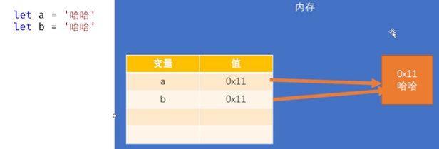

[JavaScript03_编写位置_哔哩哔哩_bilibili](https://www.bilibili.com/video/BV1mG411h7aD/?p=3&spm_id_from=pageDriver&vd_source=796ed40051b301bfa3a84ba357f4828c)

# 一. 基础

## 1. 入门

### 1.01 HelloWorld

```html
<!DOCTYPE html>
<html lang="zh">
    <head>
        <meta charset="UTF-8" />
        <meta http-equiv="X-UA-Compatible" content="IE=edge" />
        <meta name="viewport" content="width=device-width, initial-scale=1.0" />
        <title>Hello World</title>

        <!-- JS代码需要编写到script中 -->
        <script>
            alert("哈哈哈哈")
            console.log('你猜我在哪？')
            document.write('你猜我在哪？')
        </script>
    </head>
    <body></body>
</html>
```

### 1.02 编写位置

```html
<!DOCTYPE html>
<html lang="zh">
    <head>
        <meta charset="UTF-8" />
        <meta http-equiv="X-UA-Compatible" content="IE=edge" />
        <meta name="viewport" content="width=device-width, initial-scale=1.0" />
        <title>JS的编写位置</title>
        <!-- 
        1.可以将js编写到网页内部的script标签
        -->
        <!-- <script>
            alert("哈哈！")
        </script> -->
        <!-- 
            2.可以将js编写外部的js文件中，然后通过script标签进行引入
        -->
        <!-- <script src="./script/script.js"></script> -->
    </head>
    <body>
        <!--
            3.可以将js代码编写到指定属性中
        -->
        <button onclick="alert('你点我干嘛！')">点我一下</button>
        <hr>
        <a href="javascript:alert(123);">超链接</a>
        <hr>
        <!-- 这个超链接什么都不做 -->
        <a href="javascript:;">超链接</a>
    </body>
</html>
```

### 1.03 注释及格式

```html
<!DOCTYPE html>
<html lang="zh">
<head>
    <meta charset="UTF-8">
    <meta http-equiv="X-UA-Compatible" content="IE=edge">
    <meta name="viewport" content="width=device-width, initial-scale=1.0">
    <title>基本语法</title>
    <script>
        /*
            1. 多行注释
                - 注释中的内容会被解释器忽略
                - 可以通过注释来对代码进行解释说明
                - 也可以通过注释来注释掉不想执行的代码
        */
        // 2. 单行注释
        // alert(123) // alert()用来弹出一个警告框

        /*
            3. JS严格区分大小写
        */
    //    alert(123)

        /*
            4. 在JS中多个空格和换行会被忽略
                可以利用这个特点来对代码进行格式化
        */
    //    alert(123)
        /*
            5. JS中每条语句都应该以分号结尾
                JS中具有自动添加分号的机制，所以如果不写分号解释器会自动添加
        */
    //    alert(111)
    //    console.log(222)
    </script>
</head>
<body> 
</body>
</html>
```

### 1.04 字面量和变量

```html
<!DOCTYPE html>
<html lang="zh">
    <head>
        <meta charset="UTF-8" />
        <meta http-equiv="X-UA-Compatible" content="IE=edge" />
        <meta name="viewport" content="width=device-width, initial-scale=1.0" />
        <title>字面量和变量</title>
        <script>
            /*
            字面量
                - 字面量其实就是一个值，它所代表的含义就是它字面的意思
                - 比如：1 2 3 4 100 "hello" true null .....
                - 在js中所有的字面量都可以直接使用，但是直接使用字面量并不方便

            变量
                - 变量可以用“存储”字面量
                - 并且变量中存储的字面量可以随意的修改
                - 通过变量可以对字面量进行描述，并且变量比较方便修改
        */
            let x
            x = 80
            x = "哈哈"

            let age
            age = 80
            age = 81
            // console.log(age)

            /* 
                多行注释：shift + alt + a
                变量的使用 
                    声明变量 --> let 变量名 / var 变量
                    变量赋值 --> a = xx
                    声明和赋值同时进行 --> let 变量 = 值
            */
            let a
            let b, c, d

            var e
            var f, g, h

            a = 10
            a = "hello"
            a = true

            // console.log(a)

            let i = 100
            console.log(i)
        </script>
    </head>
    <body></body>
</html>
```

### 1.04_1 let 和 var 的区别

```html
<!DOCTYPE html>
<html lang="zh">
<head>
    <meta charset="UTF-8">
    <meta http-equiv="X-UA-Compatible" content="IE=edge">
    <meta name="viewport" content="width=device-width, initial-scale=1.0">
    <title>let和get的区别</title>
    
    <script>
        /*
            var 和 let 的区别
                - 变量作用域：let声明的变量作用域为块级作用域，而var声明的变量作用域为函数级作用域。
                - 变量提升：var声明的变量会进行变量提升，即在代码执行前会先声明变量，而let声明的变量不会进行变量提升，只有在声明后才能使用。
                - 重复声明：var声明的变量可以重复声明，后面的声明会覆盖前面的声明，而let声明的变量不允许重复声明。
                - 全局声明：var声明的变量会成为全局变量，而let声明的变量不会成为全局变量，只存在于块级作用域中。
                - 循环中的作用：在循环中使用let声明的变量可以避免变量共享问题，而var声明的变量会存在变量共享问题。
        */
        // var声明变量
        for(var i = 0; i < 3; i++){
          console.log(i); // 0, 1, 2
        }
        console.log(i); // 3

        // let声明变量
        for(let j = 0; j < 3; j++){
          console.log(j); // 0, 1, 2
        }
        console.log(j); // 报错：j is not defined

        // var重复声明变量
        var x = 1;
        var x = 2;
        console.log(x); // 2

        // let重复声明变量
        let y = 1;
        let y = 2; // 报错：Identifier 'y' has already been declared

        // var变量提升
        console.log(a); // undefined
        var a = 1;

        // let变量提升
        console.log(b); // 报错：Cannot access 'b' before initialization
        let b = 1;

    </script>
</head>
<body>
</body>
</html>
```

### 1.05 变量的内存



```html
<!DOCTYPE html>
<html lang="zh">
<head>
    <meta charset="UTF-8">
    <meta http-equiv="X-UA-Compatible" content="IE=edge">
    <meta name="viewport" content="width=device-width, initial-scale=1.0">
    <title>变量的内存</title>
    <script>

/* 
        变量中并不存储任何值，而是存储值的内存地址！
*/
        let a = '哈哈'
        let b = '哈哈'

    </script>
</head>
<body> 
</body>
</html>
```

### 1.06 常量

锁住地址值

 

> 在 JavaScript 中，常量（constant）是一个固定不变的值，一旦被定义就不能被重新赋值。
>
> - 常量本质上是一个指向某个值的引用，这个引用无法被改变，但是这个值本身是可以被改变的，特别是对于对象和数组等引用类型的值。
>
> - ES6 引入了 `const` 关键字来声明常量，使用方式与 `let` 关键字类似，但是常量必须在声明时进行初始化，而且不能再次赋值。
>
> - 例如：
>   ```js
>   const PI = 3.14; // 声明一个常量 PI
>   PI = 3; // 报错，常量不能重新赋值
>       
>   const arr = [1, 2, 3]; // 声明一个常量 arr，指向一个数组
>   arr.push(4); // 可以改变数组本身的值
>   console.log(arr); // [1, 2, 3, 4]
>   ```

```html
<!DOCTYPE html>
<html lang="zh">
    <head>
        <meta charset="UTF-8" />
        <meta http-equiv="X-UA-Compatible" content="IE=edge" />
        <meta name="viewport" content="width=device-width, initial-scale=1.0" />
        <title>常量</title>
        <script>
            /* 
                在JS中，使用const声明常量，常量只能赋值一次，重复赋值会报错
                    在JS中除了常规的常量外，有一些对象类型的数据我们也会声明为常量
                    常量锁住的就是内存地址
            */
            const PI = 3.1415926
            // PI = 10

            console.log(PI)
        </script>
    </head>
    <body></body>
</html>
```

### 1.07 标识符

```html
<!DOCTYPE html>
<html lang="zh">
    <head>
        <meta charset="UTF-8" />
        <meta http-equiv="X-UA-Compatible" content="IE=edge" />
        <meta name="viewport" content="width=device-width, initial-scale=1.0" />
        <title>标识符</title>
        <script>
            /* 
                在JS中，所有可以由我们自主命名的内容，都可以认为是一个标识符
                    像 变量名 函数名 类名...
                使用标识符需要遵循如下的命名规范：
                    1. 标识符只能含有字母、数字、下划线、$，且不能以数字开头
                    2. 标识符不能是JS中的关键字和保留字，也不建议使用内置的函数或类名作为变量名
                    3. 命名规范：
                        - 通常会使用驼峰命名法
                            - 首字母小写，每个单词开头大写
                            - maxlength --> maxLength
                            - borderleftwidth --> borderLeftWidth

                        - 类名会使用大驼峰命名法
                            - 首字母大写，每个单词开头大写
                            - maxlength --> MaxLength

                        - 常量的字母会全部大写
                            - MAX_LENGTH
            */
            let a = 10
            let abc123_$ = 22
            let _abc = 33
            let $bcd = 44
            
            // let alert = 55
            //alert(123)

        </script>
    </head>
    <body></body>
</html>
```

### 1.08 箭头函数

JavaScript 中的箭头函数是一种更加简洁的函数声明语法，它可以用于替代传统的函数声明和匿名函数，让代码更加简洁易读。

箭头函数的基本语法如下：

```js
(param1, param2, ...) => { statements }
```

其中，`param1`、`param2` 等是函数的参数，`statements` 是函数体的语句，可以是一个表达式或一组语句块。箭头函数可以有多个参数，也可以没有参数，如果只有一个参数，可以省略参数列表的括号。

例如，下面是一个简单的箭头函数，用于计算两个数的和：

```js
const add = (a, b) => a + b;
```

这个箭头函数等价于下面的传统函数声明：

```js
function add(a, b) {
    return a + b;
}
```

箭头函数的优点在于它更加简洁易读，可以用于简化函数声明、回调函数和对象方法的声明等场景，例如：

1. 简化函数声明：

```js
// 传统方式声明函数
function add(a, b) {
    return a + b;
}

// 箭头函数声明
const add = (a, b) => a + b;
```

2. 简化回调函数：

```js
// 传统方式的回调函数
array.forEach(function(item) {
    console.log(item);
});

// 箭头函数的回调函数
array.forEach(item => console.log(item));
```

3. 简化对象方法的声明：

```js
// 传统方式声明对象方法
const obj = {
    name: 'Alice',
    sayHello: function() {
        console.log('Hello, ' + this.name);
    }
};

// 箭头函数声明对象方法
const obj = {
    name: 'Alice',
    sayHello: () => console.log('Hello, ' + this.name)
};
```

需要注意的是，箭头函数和传统函数在一些细节上有所不同，例如箭头函数没有自己的 `this` 和 `arguments`，不能用作构造函数和生成器函数等，需要根据具体情况选择使用。

## 2. 数据类型

### 2.01 数值

#### 2.01.1 简介

- 在 JavaScript 中，数值类型（Number）是一种基本数据类型，用于表示数字。

- JavaScript 中的数值类型包括整数和浮点数两种类型。整数是没有小数部分的数字，而浮点数则包含小数部分。JavaScript 中的所有数字都使用 IEEE 754 标准规定的 64 位浮点数表示，也就是说，**JavaScript 中所有的数字都是浮点数。**

- JavaScript 中的数值类型可以进行加减乘除等基本的算术运算，也可以使用 Math 对象中的方法进行高级数学运算。同时，JavaScript 中还提供了一些特殊的数值类型，例如 Infinity（正无穷）、-Infinity（负无穷）和 NaN（非数字）等。

- 以下是一些数值类型的示例：
  ```js
  let num1 = 123; // 整数
  let num2 = 3.14; // 浮点数
  let num3 = Infinity; // 正无穷
  let num4 = -Infinity; // 负无穷
  let num5 = NaN; // 非数字
  ```

#### 2.01.2 精度问题存在误差

- 需要注意的是，JavaScript 中的数值类型存在精度问题。由于使用的是浮点数表示，因此在进行精确计算时可能会出现**误差**。因此，对于需要精确计算的场景，建议使用其他方式进行处理，例如使用字符串类型进行计算。

- 浮点型出现**误差的原因**

  - 在计算机中，浮点数是以**二进制**表示的。然而，有些十进制数无法精确地以二进制形式表示，这就会导致浮点数的精度问题。例如，0.1 在二进制中是无限循环的小数，因此在计算机中表示为浮点数时，只能近似表示。这种近似表示就会引起精度误差。

  - 另外，浮点数在计算时还会涉及到舍入误差。由于计算机内存中只能存储有限的位数，因此可能会出现一些位的丢失。在进行浮点数计算时，这些丢失的位数可能会导致结果出现误差。

  - 例如，下面的代码中将两个浮点数相加，实际结果应该是 0.3，但是由于浮点数精度问题，实际结果却是 0.30000000000000004：
    ```js
    let num1 = 0.1;
    let num2 = 0.2;
    let result = num1 + num2; // 0.30000000000000004
    ```

  - 为了避免浮点数精度问题，可以使用一些技巧来减少误差。例如，可以使用整数进行计算，然后再将结果转换为浮点数。另外，可以使用一些库来处理浮点数计算，例如 Decimal.js 和 big.js 等。

#### 2.01.3 解决计算误差

- 在 JavaScript 中，由于浮点数精度的限制，处理大整数（超过 2 的 53 次方）的计算会出现精度误差。为了解决这个问题，可以使用一些第三方库来支持大整数计算。

  以下是一些常用的 JavaScript 处理大整数的库：

  1. `bignumber.js`：一个用于处理大整数和大浮点数的 JavaScript 库，支持加减乘除等基本运算，以及对数、指数、三角函数等高级数学运算。
  2. `big.js`：一个用于高精度计算的 JavaScript 库，支持任意精度的整数和浮点数，支持加减乘除、幂运算、对数函数等各种高级数学运算。
  3. `decimal.js`：一个用于处理高精度浮点数的 JavaScript 库，支持任意精度的浮点数计算，支持加减乘除、幂运算、对数函数等各种高级数学运算。

  这些库可以在浏览器端和服务器端都使用。使用这些库可以避免 JavaScript 中浮点数精度的问题，从而实现高精度的整数计算

#### 2.01.4 大整数

- 在数字末尾加上 `n` 表示这个数字是 **BigInt** 类型，而不是普通的 Number 类型。BigInt 是一种新的数据类型，它支持任意大小的整数，可以用来处理超出 JavaScript Number 类型所支持的范围的整数。

  在 JavaScript 中，可以通过在数字后面加上 `n` 来创建一个 BigInt 类型的数字。例如：

  ```js
  const bigNum = 123456789012345678901234567890n;
  console.log(bigNum); // 123456789012345678901234567890n
  ```

  需要注意的是，BigInt 类型的数字不能与普通的 Number 类型的数字进行混合运算，需要使用 BigInt 提供的方法进行运算。例如：

  ```js
  const bigNum = 123456789012345678901234567890n;
  const num = 123;
  console.log(bigNum + num); // Uncaught TypeError: Cannot mix BigInt and other types, use explicit conversions
  console.log(bigNum + BigInt(num)); // 123456789012345678901234567913n
  ```

  在上面的例子中，如果直接将 BigInt 类型的 bigNum 与 Number 类型的 num 相加，会抛出类型错误。正确的做法是使用 BigInt() 函数将 num 转换为 BigInt 类型，然后再与 bigNum 相加。

#### 2.01.5 其他进制的数字

- 在 JavaScript 中，除了十进制数字外，还可以使用其他进制表示数字，包括二进制、八进制和十六进制。

  1. 二进制数字：二进制数字以 `0b` 或 `0B` 开头，后面跟一串由 0 和 1 组成的数字。例如，`0b1010` 表示十进制的 10。

  2. 八进制数字：八进制数字以 `0` 开头，后面跟一串由 0 到 7 的数字组成。例如，`012` 表示十进制的 10。

  3. 十六进制数字：十六进制数字以 `0x` 或 `0X` 开头，后面跟一串由 0 到 9 和 A 到 F 的字母组成的数字。其中 A 到 F 表示 10 到 15。例如，`0xA` 表示十进制的 10。

  下面是一些使用其他进制数字的例子：

  ```js
  const binaryNum = 0b1010; // 二进制的 1010，等价于十进制的 10
  const octalNum = 0o12; // 八进制的 12，等价于十进制的 10
  const hexNum = 0xA; // 十六进制的 A，等价于十进制的 10
  
  console.log(binaryNum); // 10
  console.log(octalNum); // 10
  console.log(hexNum); // 10
  ```

  需要注意的是，不同进制的数字在进行运算时需要先转换为十进制。可以使用 `parseInt()` 函数将其他进制的数字转换为十进制。例如：

  ```js
  const binaryNum = '1010';
  const decimalNum = parseInt(binaryNum, 2); // 将二进制的 1010 转换为十进制的 10
  console.log(decimalNum); // 10
  ```

### 2.02 类型的检查

在 JavaScript 中，可以使用 `typeof` 运算符来检查数据类型。`typeof` 运算符返回一个表示数据类型的字符串。

下面是一些常见数据类型的 `typeof` 运算符返回值：

- `undefined`：如果变量未定义，则返回 `"undefined"`。
- `null`：如果变量的值为 `null`，则返回 `"object"`。这是一个历史遗留问题，实际上 `null` 是一种特殊的数据类型。
- `boolean`：如果变量的值为布尔值 `true` 或 `false`，则返回 `"boolean"`。
- `number`：如果变量的值为数字，则返回 `"number"`。
- `string`：如果变量的值为字符串，则返回 `"string"`。
- `object`：如果变量的值为对象（包括数组、函数等），则返回 `"object"`。
- `function`：如果变量的值为函数，则返回 `"function"`。

下面是一些使用 `typeof` 运算符的例子：

```js
const str = 'Hello';
const num = 123;
const bool = true;
const obj = {};
const arr = [1, 2, 3];
const func = function() {};

console.log(typeof str); // "string"
console.log(typeof num); // "number"
console.log(typeof bool); // "boolean"
console.log(typeof obj); // "object"
console.log(typeof arr); // "object"
console.log(typeof func); // "function"
```

需要注意的是，`typeof` 运算符对于数组和对象返回的都是 `"object"`。如果需要**进一步区分数组和对象**，可以使用 `Array.isArray()` 方法来检查是否为数组。例如：

```js
const obj = {};
const arr = [1, 2, 3];

console.log(Array.isArray(obj)); // false
console.log(Array.isArray(arr)); // true
```

除了 `typeof` 运算符之外，还可以使用 `instanceof` 运算符来检查对象的类型。`instanceof` 运算符返回一个布尔值，表示对象是否为指定类型的实例。例如：

```js
const obj = {};
const arr = [1, 2, 3];

console.log(obj instanceof Object); // true
console.log(arr instanceof Array); // true
```

需要注意的是，`instanceof` 运算符只能用来检查对象是否为某个类型的实例，不能用来检查基本数据类型的类型。

### 2.03 字符串

```html
<!DOCTYPE html>
<html lang="zh">
    <head>
        <meta charset="UTF-8" />
        <meta http-equiv="X-UA-Compatible" content="IE=edge" />
        <meta name="viewport" content="width=device-width, initial-scale=1.0" />
        <title>字符串</title>
        <script>
            /* 
                字符串（String）
                    - 在JS中使用单引号或双引号来表示字符串
                    - 转义字符 \
                        \" --> "
                        \' --> '
                        \\ --> \\
                        \t --> 制表符
                        \n --> 换行
                    - 模板字符串
                        - 使用反单引号` 来表示模板字符串
                        - 模板字符串中可以嵌入变量
                    - 使用typeof检查一个字符串时会返回 "string"
            */
            let a = "Hello"
            a = "你好"
            a = '这是一个"字\\\\符串'
            a = "呵呵\t哈哈哈"
            a = "呵呵\n哈哈哈"

            a = "今天天气真不错！"

            a = `今天天气挺好的！`

            let name = "猪八戒"

            let str = `你好，${name}`

            let b = 10

            //    console.log(`b = ${b}`)

            let c = "5"
            c = "hhh"
            c = `aaa`
            console.log(typeof c)
        </script>
    </head>
    <body></body>
</html>
```

### 2.04  其他数据类型

```html
<!DOCTYPE html>
<html lang="zh">
<head>
    <meta charset="UTF-8">
    <meta http-equiv="X-UA-Compatible" content="IE=edge">
    <meta name="viewport" content="width=device-width, initial-scale=1.0">
    <title>其他的类型</title>
    <script>
        /* 
            布尔值（Boolean）
                - 布尔值主要用来进行逻辑判断
                - 布尔值只有两个true 和 false
                - 使用typeof检查一个布尔值时会返回 "boolean"

            空值 （Null）
                - 空值用来表示空对象
                - 空值只有一个 null
                - 使用typeof检查一个空值时会返回"object"
                - 使用typeof无法检查空值

            未定义（Undefined）
                - 当声明一个变量而没有赋值时，它的值就是Undefined
                - Undefined类型的值只有一个就是 undefined
                - 使用typeof检查一个Undefined类型的值时，会返回 "undefined"
            
            符号（Symbol）
                - 用来创建一个唯一的标识    
                - 使用typeof检查符号时会返回 "symbol"

            JS中原始值一共有七种
                1.Number
                2.BigInt
                3.String
                4.Boolean
                5.Null
                6.Undefined
                7.Symbol
                七种原始值是构成各种数据的基石
                    原始值在JS中是不可变类型，一旦创建就不能修改
        */
       let bool = true // 真
       bool = false // 假
       let num = 1

       let a = null

    //    console.log(typeof bool)
    //    console.log(typeof a)

    //    let b
       console.log(typeof b)

       let c = Symbol() // 调用Symbol()创建了一个符号

       console.log(typeof c) 
    </script>
</head>
<body>
</body>
</html>
```

### 2.05 类型转换

JavaScript中有三种基本数据类型：字符串、数字和布尔值。在JavaScript中，数据类型转换是非常常见的操作。以下是一些常见的数据类型转换方式：

#### 2.05.1 字符串转换为数字

使用Number()函数将字符串转换为数字。例如：

```js
var str = "123";
var num = Number(str);
console.log(num); // 输出 123
```

>专门用来将字符串转换为数值的两个方法
>
>1. parseInt() —— 将一个字符串转换为一个整数
>
>   - 解析时，会自左向右读取一个字符串，直到读取到字符串中所有的有效的整数
>
>   - 也可以使用parseInt()来对一个数字进行取整
>
>2. parseFloat() —— 将一个字符串转换为浮点数
>
>   - 解析时，会自左向右读取一个字符串，直到读取到字符串中所有的有效的小数

​          

转换的情况：

- 字符串：
     - 如果字符串是一个合法的数字，则会自动转换为对应的数字
     - 如果字符串不是合法数字，则转换为NaN
     - 如果字符串是空串或纯空格的字符串，则转换为0

- 布尔值：

     - true转换为1，false转换为0

     - null 转换为 0
     - undefined 转换为 NaN

#### 2.05.2 数字转换为字符串

使用toString()函数将数字转换为字符串。例如：

```js
var num = 123;
var str = num.toString();
console.log(str); // 输出 "123"
```

#### 2.05.3 布尔值转换为字符串

使用toString()函数将布尔值转换为字符串。例如：

```js
var bool = true;
var str = bool.toString();
console.log(str); // 输出 "true"
```

#### 2.05.4 字符串转换为布尔值

使用Boolean()函数将字符串转换为布尔值。例如：

```js
var str = "true";
var bool = Boolean(str);
console.log(bool); // 输出 true
```

#### 2.05.5 数字转换为布尔值

使用Boolean()函数将数字转换为布尔值。例如：

```js
var num = 0;
var bool = Boolean(num);
console.log(bool); // 输出 false
```

#### 2.05.6 布尔值转换为数字

使用Number()函数将布尔值转换为数字。例如：

```js
var bool = true;
var num = Number(bool);
console.log(num); // 输出 1
```