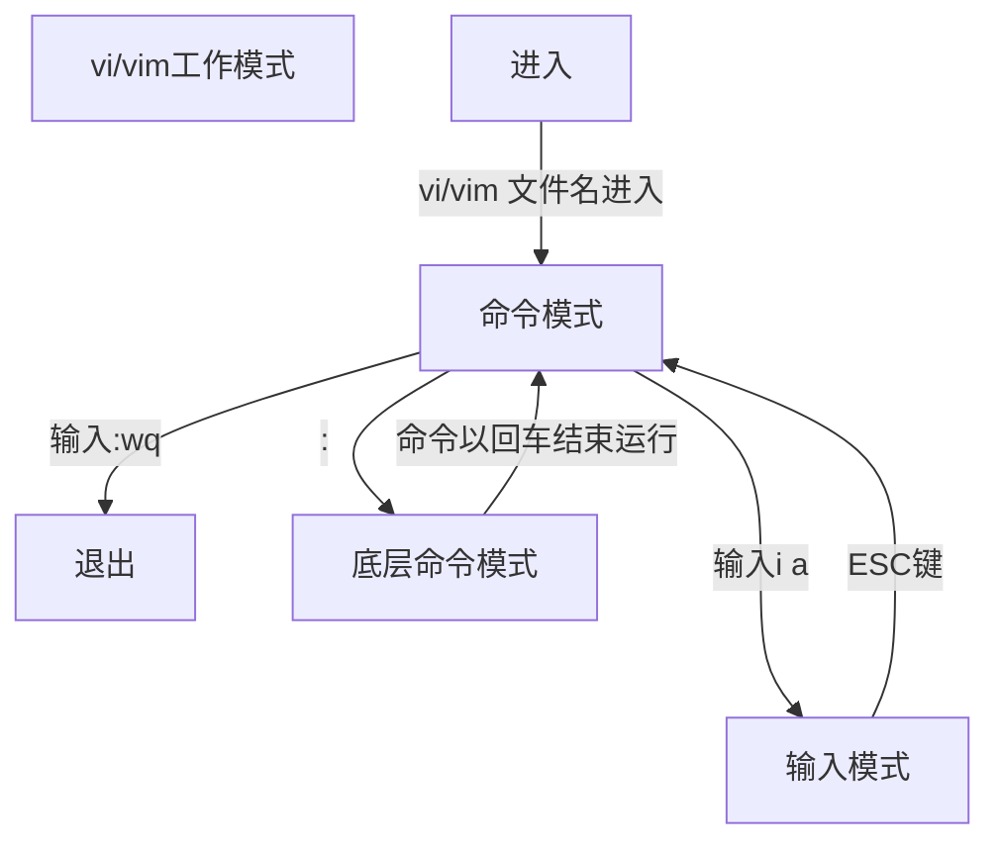
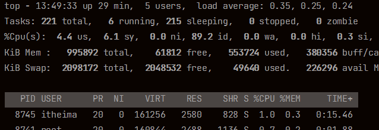
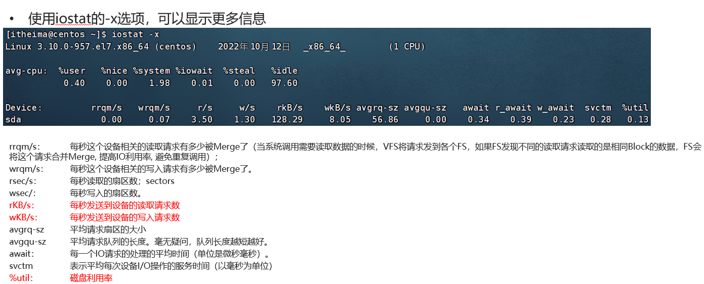

> [Linux导学视频_哔哩哔哩_bilibili](https://www.bilibili.com/video/BV1n84y1i7td?p=1&vd_source=796ed40051b301bfa3a84ba357f4828c)的学习笔记
>
> <h1 style="color:#d19a66">目录</h1>
>
> [Linux命令](#Linux命令)
>
> 1. [文件](##文件)
> 1. [用户和用户组](##用户和用户组)
> 1. [vi||vim](##vi||vim)
> 1. [Linux使用操作命令](##linux使用操作)
>
> [Linux使用操作](#Linux使用操作)
>
> 1. [Linux使用操作命令](##linux使用操作)
> 1. [时间相关](##时间相关)
> 1. [ip地址和主机名](##ip地址和主机名)
> 1. [域名解析](###域名解析)
> 1. [端口](##端口)

# Linux命令

## 文件

| 命令本身                 | 用途                                   | 可选项                 | 参数                                                         | 语法                                                         | 用户 |
| ------------------------ | -------------------------------------- | ---------------------- | ------------------------------------------------------------ | ------------------------------------------------------------ | ---- |
| [ls](##ls)               | 列出文件夹信息                         | [-l](##权限信息) -a -h | 被查看的文件夹，不提供参数，表示查看当前工作目录             | ls  [-l -a -h] 参数                                          | 任意 |
| pwd                      | 展示当前工作目录                       | 无                     | 无                                                           | pwd                                                          | 任意 |
| cd                       | 切换工作目录                           | 无                     | 目标目录，要切换去的地方，不提供默认切换到`当前登录用户HOME目录`[^HOME目录] | cd 参数[^相对路径][^绝对路径][^特殊路径符]                   | 任意 |
| [mkdir](##mkdir)         | 创建文件夹                             | -p                     | 被创建文件夹的路径                                           | mkdir 参数                                                   | 任意 |
| touch                    | 创建文件                               | 无                     | 被创建的文件路径                                             | touch 参数                                                   | 任意 |
| cat                      | 查看全部文件内容                       | 无                     | 被查看的文件路径                                             | cat 参数                                                     | 任意 |
| more                     | 查看文件，可以支持翻页查看             | 无                     | 被查看的文件路径                                             | more 文件路径  查看过程中`空格`键翻页 `q`退出查看            | 任意 |
| [cp](##cp)               | 复制文件、文件夹                       | -r                     | 参数1，被复制的 参数2，要复制去的地方                        | cp [-r] 参数1 参数2  复制文件[夹]路径1到路径2                | 任意 |
| mv                       | 移动文件、文件夹                       |                        | 参数1：被移动的 参数2：要移动去的地方，参数2如果文件不存在，则会进行改名 | mv 参数1 参数2                                               | 任意 |
| [rm](##rm)               | 删除文件、文件夹                       | -r -f                  | 参数1 参数2... 支持多个，每一个表示被删除的，空格进行分隔 支持通配符[^通配符*] | rm [-r -f] 参数1...参数n[^通配符*]                           | 任意 |
| which                    | 查看命令的程序本体文件路径             | 无                     | 被查看的命令                                                 | which 参数                                                   | 任意 |
| [find](##find)           | 搜索文件                               | -name -size            | 搜索的关键字，支持通配符*   +\|-n[kMG]s                 | find 路径 -name\|-size  参数 按name\|size查找路径下符合参数的文件 | 任意 |
| [grep](##grep)           | 过滤关键字                             | -n                     | 参数1："关键字"，必填，表示过滤的关键字，带有空格或其它特殊符号，建议使用""将关键字包围起来 参数2：文件路径，在此文件中搜索关键字 | grep [-n] 参数1关键字 参数2路径                              | 任意 |
| [wc](##wc)               | 统计文件相关信息                       | -c -m -l -w            | 文件路径，被统计的文件，可作为管道符的输入[^管道符]          | wc [-c -m -l -w] 参数                                        | 任意 |
| echo                     | 输出内容                               | 无                     | 被输出的内容 [^反引号][^重定向符]                            | echo 参数                                                    | 任意 |
| head                     | 查看文件头部(从前往后看)               | -n                     |                                                              |                                                              |      |
| [tail](##tail)           | 查看文件尾部内容(从后往前查看文件内容) | -f -num[num指一个数字] | 被查看的文件                                                 | tail [-f -num] 参数                                          | 任意 |
| [vi\|\|vim](##vi\|\|vim) | vi/vim编辑器                           | 无                     | 编辑(并创建)的文件                                           | vi 参数                                                      | 任意 |
## 用户和用户组
| 命令本身                   | 用途                               | 可选项                                              | 参数                                                      | 语法                                        | 用户                             |
| -------------------------- | ---------------------------------- | --------------------------------------------------- | --------------------------------------------------------- | ------------------------------------------- | -------------------------------- |
| [su](##su)                 | 切换用户                           | -                                                   | 用户名(可省略，默认root用户)                              | su [-] 参数                                 | 任意                             |
| exit \|\| ctrl+d           | 回退到上一用户                     | 无                                                  | 无                                                        | exit \|\| ctrl+d                            | 任意                             |
| [sudo](##sudo)             | 普通命令的授权(临时以root身份执行) | 无                                                  | 其他命令                                                  | sudo 参数                                   | 获得root认证的用户               |
| groupadd                   | 创建用户组                         | 无                                                  | 用户组名                                                  | groupadd 参数                               | root                             |
| groupdel                   | 删除用户组                         | 无                                                  | 用户组名                                                  | groupdel 参数                               | root                             |
| [useradd](##useradd)       | 创建用户                           | -g -d                                               | 参数1：用户名  参数2：组名  参数3：用户home目录 | useradd  参数1 [-g 参数2 -d 参数3]          | root                             |
| [userdel](##userdel)       | 删除用户                           | -r                                                  | 用户名                                                    | userdel 参数                                | root                             |
| usermod                    | 锁定解锁用户                       | -L：锁定 -U：解锁                              |                                                           |                                             |                                  |
| id                         | 查看用户信息                       | 无                                                  | 用户名(查看其它用户仅限root用户使用)                      | id [参数]                                   | 任意                             |
| usermod                    | 修改用户所属组                     | -aG                                                 | 参数1：用户组 参数2： 用户名                         | usermod -aG 参数1 参数2                     | root                             |
| [getent](##getent)         | 查看当前系统中有哪些用户\|\|用户组 | 无                                                  | passwd:用户 group:用户组                             | getent 参数                                 | 任意                             |
| [查看权限信息](##权限信息) |                                    |                                                     |                                                           |                                             |                                  |
| [chmod](##chmod)           | 修改文件、文件夹的权限信息         | -R                                                  | 参数1:权限 参数2:文件或文件夹                        | chmod [-R] 参数1 参数2                      | 文件、文件夹的所属用户或root用户 |
| [chown](##chown)           | 修改所属用户、用户组               | -R \|\| 用户 \|\| 用户组 \|\| :用于分隔用户和用户组 | 文件或文件夹                                              | chown [-R] [用户] [:] [用户组] 文件或文件夹 | root                             |
## Linux使用操作
### 软件安装与服务、网卡、软链接
| 命令本身                 | 用途                                                         | 可选项                                               | 参数                                                         | 语法                                         | 用户 |
| ------------------------ | ------------------------------------------------------------ | ---------------------------------------------------- | ------------------------------------------------------------ | -------------------------------------------- | ---- |
| [yum](###yum)            | CentOS中联网**管理软件安装**；RPM包软件管理器，用于自动化安装配置Linux软件，并可以自动解决依赖问题。 | -y \|\| install \|\| remove \|\| search              | 软件名                                                       | yum [-y] install 软件名                      | root |
| [apt](###apt)            | Ubuntu中联网管理软件安装                                     | -y \|\| install \|\| remove \|\| search              |                                                              |                                              |      |
| [systemctl](##systemctl) | 控制软件[服务](###服务)[^服务]的启动和关闭                   | start \|\| stop \|\| status \|\| enable \|\| disable | 服务名                                                       | systemctl 可选项 服务名                      |      |
| systemctl                | 重启网卡                                                     | restart network                                      |                                                              | systemctl restart network                    |      |
| ln                       | 创建**软链接**[^软链接]，可以将文件、文件夹链接到其它位置,类似快捷方式 | -s 软连接                                            | 参数1：被链接的文件或文件夹 参数2：要链接去的目的地，类似于windows新创建的快捷方式图标 | ln -s 参数1 参数2                            |      |
### 日期、ip地址和主机名
| 命令本身                   | 用途                                                         | 可选项                                               | 参数                                                         | 语法                                                         | 用户                             |
| -------------------------- | ------------------------------------------------------------ | ---------------------------------------------------- | ------------------------------------------------------------ | ------------------------------------------------------------ | -------------------------------- |
| [date](##date)           |                                                              | -d \|\| +格式换字符串                                |                                                              | date [-d] [+格式化字符串]                    | 任意 |
| hostname                 | 查看[主机名](##主机名)[^主机名]                              | 无                                                   | 无                                                           | hostname                                     | 任意 |
| hostnamectl              | 修改主机名                                                   | set-hostname                                         | 主机名                                                       | hostnamectl set-hostname 主机名              | root |
### 网络请求和下载
| 命令本身                   | 用途                                                         | 可选项                                               | 参数                                                         | 语法                                                         | 用户                             |
| -------------------------- | ------------------------------------------------------------ | ---------------------------------------------------- | ------------------------------------------------------------ | ------------------------------------------------------------ | -------------------------------- |
| [wget](##wget)           | 非交互式的文件下载器，可以在命令行内**下载网络文件**         | -b                                                   | url，下载链接                                                | wget [-b] url                                | 任意 |
| [curl](##curl)           | **发送http网络请求**，-O可用于：下载文件、获取信息等，类似浏览器打开网页-O | -O此选项类似wget                                     | url，要发起请求的网络地址                                    | curl [-O] url                                | 任意 |

### 端口及进程
| 命令本身                   | 用途                                                         | 可选项                                               | 参数                                                         | 语法                                                         | 用户                             |
| -------------------------- | ------------------------------------------------------------ | ---------------------------------------------------- | ------------------------------------------------------------ | ------------------------------------------------------------ | -------------------------------- |
| [nmap](###nmap)          | 查看指定ip对外暴露端口                                       | 无                                                   | 被查看的IP地址                                               | nmap 被查看的IP地址                          | 任意 |
| [netstat](###netstat)    | 查看指定端口的占用情况                                       | -anp                                                 | 端口号                                                       | netstat -anp \| grep 端口号                  | 任意 |
| [ps](###ps)              | 查看Linux系统中的进程信息                                    | -e -f                                                | 无                                                           | ps [-e -f]                                   | 任意 |
| kill                     | 关闭进程                                                     | -9(强制关闭)                                         | 进程id号                                                     | kill [-9] 进程id                             | 任意 |
### 主机状态监控
| 命令本身                   | 用途                                                         | 可选项                                               | 参数                                                         | 语法                                                         | 用户                             |
| -------------------------- | ------------------------------------------------------------ | ---------------------------------------------------- | ------------------------------------------------------------ | ------------------------------------------------------------ | -------------------------------- |
| [top](###top)            | 查看CPU、内存使用情况，类似Windows的任务管理器               | 很多                                                 | 很多                                                         | top [各种可选项] [参数]                      | 任意 |
| [df](###df)              | 查看硬盘的使用情况                                           | -h                                                   | 无                                                           | df [-h]                                      | 任意 |
| [iostat](###iostat)      | 查看CPU、磁盘的相关信息                                      | -x num1 num2                                         | 无                                                           | iostat [-x] [num1] [num2]                    | 任意 |
| [sar](###sar)            | 查看网络的相关统计（sar命令非常复杂，这里仅简单用于统计网络） | -n DEV num1 num2                                     | 无                                                           | sar -n DEV num1 num2                         | 任意 |
| [export](##export#)      | 临时设置环境变量 可以通过$符[^$符]查看环境变量的值           | 无                                                   | 环境变量键值对                                               | export 变量名=变量值                         | 任意 |
### 文件下载和上传
| 命令本身                   | 用途                                                         | 可选项                                               | 参数                                                         | 语法                                                         | 用户                             |
| -------------------------- | ------------------------------------------------------------ | ---------------------------------------------------- | ------------------------------------------------------------ | ------------------------------------------------------------ | -------------------------------- |
| [rz](###rz)              | 文件上传(win->linux)                                         | 无                                                   | 文件路径                                                     | rz win中文件路径                             | 任意 |
| [sz](###sz)              | 文件下载(linux->win)                                         | 无                                                   | 文件路径                                                     | sz linux中文件路径                           | 任意 |

### 压缩和解压
| 命令本身                   | 用途                                                         | 可选项                                               | 参数                                                         | 语法                                                         | 用户                             |
| -------------------------- | ------------------------------------------------------------ | ---------------------------------------------------- | ------------------------------------------------------------ | ------------------------------------------------------------ | -------------------------------- |
| [tar](###tar)            | tar和gz文件压缩及解压缩                                      | 很多                                                 | 很多                                                         | tar [-c -v -x -f -z -C] 参数1 参数2 ...参数n | 任意 |
| [zip](###zip)            | zip文件压缩                                                  | -r(解压文件包含文件夹)                               | 压缩文件 被压缩文件(夹)                                      | zip [-r] 参数1 参数2 ... 参数n               | 任意 |
| [unzip](###zip)          | zip文件解压                                                  | -d(指定解压目的地)                                   | 压缩文件 解压目的地目录                                      | unzip [-d] 参数                              | 任意 |

## 权限信息

> [修改文件权限](##chmod)

通过[ls -l](##ls) 可以以列表形式查看内容，并显示权限细节

| 序号               | 详情                           |
| ------------------ | ------------------------------ |
| [序号1](###序号一) | 表示文件、文件夹的权限控制信息 |
| 序号2              | 表示文件、文件夹所属用户       |
| 序号3              | 表示文件、文件夹所属用户组     |

### 序号一

> •r表示读权限
> •w表示写权限
> •x表示执行权限
>
> 针对文件、文件夹的不同，rwx的含义有细微差别:
> | 权限 | 文件                   | 文件夹                                     |
> | ---- | ---------------------- | ------------------------------------------ |
> | -    | 无此项对应的权限       | 无此项对应的权限                           |
> | r    | 可以查看文件内容       | 可以查看文件夹内容                         |
> | w    | 可以修改此文件         | 可以在文件夹内：创建、删除、改名等操作     |
> | x    | 可以将文件作为程序执行 | 表示可以更改工作目录到此文件夹，即`cd`进入 |

[序号权限r4w2x1](###[权限](##权限信息)的数字序号)

---

## ls

- 查看文件信息

| 可选项 | 用途                                   |
| ------ | -------------------------------------- |
|        | 列出文件夹信息                         |
| -l     | 以列表形式查看[各项信息](##权限信息)   |
| -a     | 配合-l，以更加人性化的方式显示文件大小 |
| -h     | 显示隐藏文件文件夹[^隐藏文件]          |

## mkdir

- 创建文件夹

| 可选项 | 用途                                  |
| ------ | ------------------------------------- |
|        | 创建文件夹,不可创建前置路径           |
| -p     | 表示创建前置路径,可以一次创建多级目录 |

## cp

- 复制文件(夹)

| 可选项 | 用途       |
| ------ | ---------- |
|        | 复制文件   |
| -r     | 复制文件夹 |

## rm

- 删除文件(夹)

| 可选项 | 用途                                                      |
| ------ | --------------------------------------------------------- |
|        | 删除文件                                                  |
| -r     | 删除文件夹                                                |
| -f     | 强制删除，不会给出确认提示，一般root用户会用到[^root用户] |

## find

- 搜索文件

| 可选项 | 用途               | 语法                          | eg                                                    |
| ------ | ------------------ | ----------------------------- | ----------------------------------------------------- |
| -name  | 按文件名搜索文件   | find 起始路径 -name "参数"    | find / -name "text*" 查找根目录下所有以test开头的文件 |
| -size  | 按文件大小搜索文件 | find 起始路径 -size +\|-[kMG] | find / -size +100M 查找根目录下大于100MB的文件        |

## grep

- 过滤

| 可选项 | 用途                                 | 语法                                                         |
| ------ | ------------------------------------ | ------------------------------------------------------------ |
|        | 过滤关键字                           | grep 关键字 文件路径 搜索关键字在文件路径文件中         |
| -n     | 可选，表示在结果中显示匹配的行的行号 | grep [-n] 关键字 文件路径 搜索关键字在文件路径文件中且显示行号 |

## wc

- 统计文件

| 可选项 | 用途                                               | 语法           |
| ------ | -------------------------------------------------- | -------------- |
|        | 统计文件 显示文件内容行数 单词数 字节数 以及文件名 | wc 文件路径    |
| -c     | 统计bytes数量                                      | wc -c 文件路径 |
| -m     | 统计字符数量                                       | wc -m 文件路径 |
| -l     | 统计行数                                           | wc -l 文件路径 |
| -w     | 统计单词数量                                       | wc -w 文件路径 |

## tail

- 查看文件尾部内容

| 可选项 | 用途                                                         |
| ------ | ------------------------------------------------------------ |
|        | 查看文件尾部内容                                             |
| -f     | 持续跟踪文件修改 ctrl+c停止追踪                              |
| -num   | 查看尾部多少行，不填默认10行 num指一个数字 例如 tail -5 test.txt |

## vi||vim

- 编辑器

| 模式                            | 介绍                                                         |
| ------------------------------- | ------------------------------------------------------------ |
| [命令模式](###命令模式)         | 命令模式下，所敲的按键编辑器都理解为命令，以命令驱动执行不同的功能。 此模型下，不能自由进行文本编辑。 |
| [输入模式](###输入模式)         | 也就是所谓的编辑模式、插入模式。 此模式下，可以对文件内容进行自由编辑。 |
| [底线命令模式](###底线命令模式) | 以：开始，通常用于文件的保存、退出。                         |

### 命令模式

| 命令           | 描述                              |
| -------------- | --------------------------------- |
| i              | 在当前光标位置，进入输入模式      |
| a              | 在当前光标位置之后，进入输入模式  |
| I              | 在当前行开头，进入输入模式        |
| A              | 在当前行结尾，进入输入模式        |
| o              | 在当前光标下一行，进入输入模式    |
| O              | 在当前光标上一行，进入输入模式    |
| esc            | 任何情况下输入esc都能回到命令模式 |
| ↑ \|\| k       | 向上移动光标                      |
| ↓ \|\| j       | 向下移动光标                      |
| ← \|\| h       | 向左移动光标                      |
| → \|\| l       | 向右移动光标                      |
| 0              | 移动光标到当前行的开头            |
| $              | 移动光标到当前行的结尾            |
| pageup(PgUp)   | 向上翻页                          |
| pagedown(PgDn) | 向下翻页                          |
| /              | 进入搜索模式                      |
| n              | 向下继续搜索                      |
| N              | 向上继续搜索                      |
| dd             | 删除光标所在行的内容              |
| ndd            | n是数字，表示删除当前光标向下n行  |
| yy             | 复制当前行                        |
| nyy            | n是数字，复制当前行和下面的n行    |
| p              | 粘贴复制的内容                    |
| u              | 撤销修改                          |
| ctrl+r         | 反向撤销修改                      |
| gg             | 跳到首行                          |
| G              | 跳到行尾                          |
| dG             | 从当前行开始，向下全部删除        |
| dgg            | 从当前行开始，向上全部删除        |
| d$             | 从当前光标开始，删除到本行的结尾  |
| d0             | 从当前光标开始，删除到本行开头    |

### 输入模式

输入模式也就是编辑模式，没有什么特殊的，进入编辑模式后，任何快捷键都没有作用，就是正常输入文本而已。

唯一大家需要记住的，就是：*通过esc，可以退回到命令模式中*即可。

| 命令 | 描述                              |
| ---- | --------------------------------- |
| esc  | 任何情况下输入esc都能回到命令模式 |

### 底线命令模式

| 命令       | 描述         |
| ---------- | ------------ |
| :wq        | 保存并退出   |
| :q         | 仅退出       |
| :q!        | 强制退出     |
| :w         | 仅保存       |
| :set nu    | 显示行号     |
| :set paste | 设置粘贴模式 |

## su

- 切换用户

| 可选项 | 用途                   | 语法        |
| ------ | ---------------------- | ----------- |
|        | 切换用户               | su 用户名   |
| -      | 切换用户后加载环境变量 | su - 用户名 |

## sudo

- 将命令授予root权限

| 命令 | 用途                               | 适用范围               |
| ---- | ---------------------------------- | ---------------------- |
| sudo | 普通命令的授权(临时以root身份执行) | 获得root用户认可的用户 |

### 为普通用户配置`sudo`认证

1. `su - root`切换到root用户，执行`visudo`命令，会自动通过vi编辑器打开：/etc/sudoers
2. 在文件的最后添加：`用户名 ALL=(ALL)     NOPASSWD: ALL`
3. 最后通过`:wq`保存
4. 切换回普通用户
5. 执行的命令均可以root运行`sudo ls /root ...`

## useradd

- 创建用户

| 可选项 | 用途                               | 语法                                                         |
| ------ | ---------------------------------- | ------------------------------------------------------------ |
|        | 创建用户并加入到与用户名同名的组中 | useradd itheima                                              |
| -g     | 指定用户的组                       | useradd itheima -g itcast                                    |
| -d     | 指定用户的HOME路径                 | useradd itheima2 -g itcast -d  /home/itheima222              |
| -c     | 为用户添加注释                     | useradd itheima2 -g itcast -d  /home/itheima222 -c 黑马的用户2 |

## userdel

- 删除用户

| 可选项 | 用途                            |
| ------ | ------------------------------- |
|        | 删除用户 不删除用户home目录文件 |
| -r     | 删除用户 且删除用户home目录文件 |

## getent

- 查看系统用户(组)

| 参数   | 用途                                                         |
| ------ | ------------------------------------------------------------ |
| passwd | 查看当前系统中有哪些用户 共有7份信息，分别是：用户名:密码(x):用户ID:组ID:描述信息(无用):HOME目录:执行终端(默认bash) |
| group  | 可以查看当前系统中有哪些用户组 包含3份信息，组名称:组认证(显示为x):组ID |

## chmod

- 修改文件、文件夹的权限信息

| 参数 | 用途                               | 示例                                                         | 含义                                                         |
| ---- | ---------------------------------- | ------------------------------------------------------------ | ------------------------------------------------------------ |
|      | 修改文件、文件夹的权限信息         | chmod u=rwx,g=rx,o=x hello.txt                               | 将文件权限修改为：rwxr-x--x 其中：u表示user所属用户权限，g表示group组权限，o表示other其它用户权限 |
| -R   | 对文件夹内的全部内容应用同样的操作 | chmod -R u=rwx,g=rx,o=x test 除此之外，还有[快捷写法](###权限的数字序号)：chmod 751 hello.txt 注： 751表示： rwx(7) r-x(5) --x(1) | 将文件夹test以及文件夹内全部内容权限设置为：rwxr-x--x        |

### [权限](##权限信息)的数字序号

权限可以用3位数字来代表，第一位数字表示用户权限，第二位表示用户组权限，第三位表示其它用户权限。

数字的细节如下：r记为4，w记为2，x记为1，可以有：
>•0：无任何权限， 即 ---
>•1：仅有x权限， 即 --x
>•2：仅有w权限 即 -w-
>•3：有w和x权限 即 -wx
>•4：仅有r权限 即 r--
>•5：有r和x权限 即 r-x
>•6：有r和w权限 即 rw-
>•7：有全部权限 即 rwx

## chown

| 选项         | 用途                               | 示例                         | 含义                                                         |
| ------------ | ---------------------------------- | ---------------------------- | ------------------------------------------------------------ |
|              | 修改文件、文件夹的所属用户和用户组 | chown  root test             | 将hello.txt所属用户修改为root                                |
| -R           | 对文件夹内全部内容应用相同规则     | chown -R root test           | 将文件夹test的所属用户修改为root并对文件夹内全部内容应用同样规则 |
| 用户         |                                    | chown root hello.txt         | 将hello.txt所属用户修改为root                                |
| 用户组       |                                    | chown :root hello.txt        | 将hello.txt所属用户组修改为root                              |
| 用户及用户组 |                                    | chown root:itheima hello.txt | 将hello.txt所属用户修改为root，用户组修改为itheima           |

# Linux使用操作

## 各类快捷键

| 快捷键          | 用途                                  | 注释                                                         | 分类         |
| --------------- | ------------------------------------- | ------------------------------------------------------------ | ------------ |
| ctrl + c        | 强制停止正在运行的某些程序            |                                                              | 终止         |
|                 | 命令输入错误时,退出当前输入，重新输入 |                                                              | 重新输入     |
| exit            | 退出账户的登录                        |                                                              | 退出账号     |
| ctrl + d        | 退出账户的登录                        |                                                              | 退出账号     |
|                 | 退出某些特定程序的专属页面            | 不能用于退出vi/vim                                           | 退出某些程序 |
| history命令     | 查看历史输入过的命令                  | 可以通过 `| grep 参数`过滤命令                               | 历史命令     |
| !命令前缀       | 自动执行上一次匹配前缀的命令          | 从历史命令中由近及远搜索匹配命令 eg:`!p`                     | 历史命令匹配 |
| ctrl + r        | 输入内容去匹配历史命令                | 如果搜索到的内容是你需要的，那么： •回车键可以直接执行 •键盘左右键，可以得到此命令（不执行） | 历史命令搜索 |
| ctrl + a        | 跳到命令开头                          |                                                              | 光标移动     |
| ctrl + e        | 跳到命令结尾                          |                                                              | 光标移动     |
| ctrl + 键盘左键 | 向左跳一个单词                        |                                                              | 光标移动     |
| ctrl + 键盘右键 | 向右跳一个单词                        |                                                              | 光标移动     |
| ctrl + l        | 清空终端内容                          |                                                              | 清屏         |
| clear           | 清空终端内容                          |                                                              | 清屏         |

## 软件安装

### yum

- RPM包软件管理器

> CentOS系统中用yum
> yum命令需要联网和root权限

| 选项    | 用途                                                         | 语法                    |
| ------- | ------------------------------------------------------------ | ----------------------- |
|         | RPM包软件管理器，用于自动化安装配置Linux软件，并可以自动解决依赖问题。 | yum [-y] install 软件名 |
| -y      | 自动确认，无需手动确认安装或卸载过程                         | yum [-y] install 软件名 |
| install | 安装                                                         | yum [-y] install 软件名 |
| remove  | 卸载                                                         | yum [-y] remove 软件名  |
| search  | 搜索                                                         | yum [-y] search 软件名  |

### apt

- apt包软件管理器

>Ubuntu系统中用apt
>apt命令需要联网和root权限

语法同[yum](##yum)

## systemctl

- 可以控制软件（服务）的启动、关闭、开机自启动

| 可选项  | 用途               | 语法                     |
| ------- | ------------------ | ------------------------ |
| start   | 开启服务           | systemctl start 服务名   |
| stop    | 停止服务           | systemctl stop 服务名    |
| status  | 查看服务状态       | systemctl status 服务名  |
| enable  | 开机自启动服务     | systemctl enable 服务名  |
| disable | 关闭开机自启动服务 | systemctl disable 服务名 |

> 系统内置服务均可被systemctl控制
> 第三方软件，如果自动注册了可以被systemctl控制
> 第三方软件，如果没有自动注册，可以手动注册

### 服务

Linux系统很多软件（内置或第三方）均支持使用systemctl命令控制：启动、停止、开机自启
能够被systemctl管理的软件，一般也称之为：服务

**系统内置服务**

| 服务名         | 中文释义                                             |
| -------------- | ---------------------------------------------------- |
| NetworkManager | 主网络服务                                           |
| network        | 副网络服务                                           |
| firewalld      | 防火墙服务                                           |
| sshd           | ssh服务（FinalShell远程登录Linux使用的就是这个服务） |

除了内置的服务以外，**部分第三方软件**安装后也可以以systemctl进行控制。
eg:
•yum install -y ntp，安装ntp软件
可以通过ntpd服务名，配合systemctl进行控制
•yum install -y httpd，安装apache服务器软件
可以通过httpd服务名，配合systemctl进行控制
部分软件安装后没有自动集成到systemctl中，我们可以手动添加。
## 时间相关
### date

- 查看系统时间

| 可选项                           | 用途                                       |
| -------------------------------- | ------------------------------------------ |
|                                  | 直接查看系统时间                           |
| [-d](###-d)                      | 按照给定的字符串显示日期，一般用于日期计算 |
| [+格式化字符串](###格式化字符串) | 通过特定的字符串标记，来控制显示的日期格式 |

### -d

> 可以按照给定的字符串显示日期，一般用于日期计算
> -d选项可以和 格式化字符串配合一起使用

| 支持的时间标记 | 含义 |
| -------------- | ---- |
| year           | 年   |
| month          | 月   |
| day            | 日   |
| hour           | 时   |
| minute         | 分   |
| second         | 秒   |

可以进行时间的+-

eg:`date -d "-3 month" "+%Y-%m-%d %H:%M:%S"`

### 格式化字符串

| 字符串 | 含义                                    |
| ------ | --------------------------------------- |
| %Y     | 年                                      |
| %y     | 年份后两位数字 (00..99)                 |
| %m     | 月份                                    |
| %d     | 日                                      |
| %H     | 小时                                    |
| %M     | 分钟                                    |
| %S     | 秒                                      |
| %s     | 自 1970-01-01 00:00:00 UTC 到现在的秒数 |

eg:`date "+%Y-%m-%d %H:%M:%S"`

### 修改时区

使用root权限，执行如下命令，修改时区为东八区时区

1. 将系统自带的localtime文件删除
   `rm -f /etc/loacltime`
2. 将/usr/share/zoneinfo/Asia/Shanghai文件链接为localtime文件即可
   `sudo ln -s /usr/share/zoneinfo/Asia/Shanghai /etc/localtime`

### ntp程序 自动校准

1. 安装ntp
   `yum -y install ntp`
2. 启动并设置开机自启：
   `systemctl start ntpd`
   `systemctl enable ntpd`
3. 当ntpd启动后会定期的帮助我们联网校准系统的时间
4. 也可以手动校准(需root权限)
   `ntpdate -u ntp.aliyun.com`
   通过阿里云提供的服务网址配合ntpdate（安装ntp后会附带这个命令）命令自动校准

## ip地址和主机名

### IP地址

每一台电脑都有对外联络地址（IP地址），也可以有一个名字，称之为[主机名](###主机名)

每一台联网的电脑都会有一个地址，用于和其它计算机进行通讯
IP地址主要有2个版本，V4版本和V6版本（V6很少用，课程暂不涉及）

IPv4版本的地址格式是：`a.b.c.d`，其中abcd表示0~255的数字，如`192.168.88.101`就是一个**标准的IP地址**

可以通过命令：`ifconfig`，查看本机的ip地址，如无法使用`ifconfig`命令，可以安装：`yum -y install net-tools`

除了标准的IP地址以外，还有几个**特殊的IP地址**需要我们了解：

1. 127.0.0.1，这个IP地址用于指代本机
2. 0.0.0.0，特殊IP地址
   •可以用于指代本机
   •可以在端口绑定中用来确定绑定关系（后续讲解）
   •在一些IP地址限制中，表示所有IP的意思，如放行规则设置为0.0.0.0，表示允许任意IP访问

### 固定ip地址

配置固定IP需要2个大步骤：

1.在VMware Workstation（或Fusion）中配置IP地址网关和网段（IP地址的范围）

2.在Linux系统中手动修改配置文件，固定IP

首先让我们，先进行第一步，跟随图片进行操作

`vim /etc/sysconfig/network-scripts/ifcfg-ens33 `

>TYPE="Ethernet"
>PROXY_METHOD="none"
>BROWSER_ONLY="no"
>BOOTPROTO="static"
>DEFROUTE="yes"
>IPV4_FAILURE_FATAL="no"
>IPV6INIT="yes"
>IPV6_AUTOCONF="yes"
>IPV6_DEFROUTE="yes"
>IPV6_FAILURE_FATAL="no"
>IPV6_ADDR_GEN_MODE="stable-privacy"
>NAME="ens33"
>UUID="3c62589a-ac06-436c-8a8b-7caaf5f98fde"
>DEVICE="ens33"
>ONBOOT="yes"
>
>IPADDR="192.168.88.130"
>NETMASK="255.255.255.0"
>GATEWAY="192.168.88.2"
>DNS1="192.168.88.2"

### 主机名

[^主机名]:每一台电脑除了对外联络地址（IP地址）以外，也可以有一个名字，称之为主机名

无论是Windows或Linux系统，都可以给系统设置主机名

Linux系统主机名`hostname`

### 配置主机名映射

可以**通过主机名找到对应计算机的IP地址**，这就是主机名映射（[域名解析](###域名解析)）

在Windows系统的：[C:\Windows\System32\drivers\etc\hosts](C:\Windows\System32\drivers\etc\hosts)文件中配置映射记录

先通过系统本地的记录去查找主机名映射，如果找不到就联网去公开DNS服务器去查找

### 域名解析

eg 访问www.baidu.com的流程如下：

即：

1. 先查看本机的记录（私人地址本记录[域名和ip地址的映射关系](##配置主机名映射)）
   - Windows看：[C:\Windows\System32\drivers\etc\hosts](C:\Windows\System32\drivers\etc\hosts)
   - Linux看：/etc/hosts
2. 再联网去DNS服务器（如114.114.114.114，8.8.8.8等）询问

## wget

- 命令行内下载网络文件

使用wget命令需先下载`yum [-y] install wget`

| 可选项 | 用途                                               | 语法        |
| :----- | :------------------------------------------------- | ----------- |
|        | 是非交互式的文件下载器，可以在命令行内下载网络文件 | wget url    |
| -b     | 后台下载，会将日志写入到当前工作目录的wget-log文件 | wget -b url |

> 注意：无论下载是否完成，都会生成要下载的文件，如果下载未完成，请及时清理未完成的不可用文件。

**持续跟踪下载详情`[tail](##tail)`**
`tail -f wget-log`

## curl

- 命令行内下载网络文件

| 可选项 | 用途                                                         | 语法        |
| ------ | ------------------------------------------------------------ | ----------- |
|        | 发送http网络请求，获取信息等                                 | curl url    |
| -O     | 用于下载文件，当url是下载链接时，可以使用此选项保存文件，类似[wget](##wget) | curl -O url |

## 端口

[^端口]:是设备与外界通讯交流的出入口。端口可以分为：物理端口和虚拟端口两类

- 物理端口：又可称之为接口，是可见的端口，如USB接口，RJ45网口，HDMI端口等
- 虚拟端口：是指计算机内部的端口，是不可见的，是用来操作系统和外部进行交互使用的

> 计算机程序之间的通讯，通过IP只能锁定计算机，但是无法锁定具体的程序。
>
> 通过端口可以锁定计算机上具体的程序，确保程序之间进行沟通
>
> IP地址相当于小区地址，在小区内可以有许多住户（程序），而门牌号（端口）就是各个住户（程序）的联系地址

| 端口分类 | 范围        | 用途                           | 备注                               |
| -------- | ----------- | ------------------------------ | ---------------------------------- |
| 公认端口 | 1~1023      | 系统内置或常用知名软件绑定使用 | 非特殊需要，不要占用这个范围的端口 |
| 注册端口 | 1024~49151  | 用于松散绑定使用（用户自定义） | 通常可以随意使用                   |
| 动态端口 | 49152~65535 | 用于临时使用（多用于出口）     | 通常不会固定绑定程序，用于临时使用 |

### nmap

- 指定IP地址的对外暴露端口

使用该命令前需先下载`yum -y install nmap`

| 可选项 | 语法        | 用途                         |
| ------ | ----------- | ---------------------------- |
|        | nmap IP地址 | 查看指定IP地址的对外暴露端口 |

### netstat

- 查看端口的占用情况

使用该命令前需先下载`yum -y install net-tools`

| 可选项                                                | 语法                          | 用途                   |
| ----------------------------------------------------- | ----------------------------- | ---------------------- |
| -anp                                                  | netstat -anp                  | 查看端口的占用情况     |
| -anp \| grep 筛选字段即端口号等 （与管道符组合使用 ） | netstat -anp \| grep 筛选字段 | 查看指定端口的占用情况 |

## 进程

进程是指程序在操作系统内运行后被注册为系统内的一个进程，并拥有独立的进程ID（进程号）

管理进程的命令

| 命令                   | 含义                   |
| ---------------------- | ---------------------- |
| ps -ef                 | 查看进程信息           |
| ps -ef \|  grep 关键字 | 过滤指定关键字进程信息 |
| kill [-9] 进程号       | 关闭指定进程号的进程   |

### ps

- 查看Linux系统中的进程信息

| 可选项 | 用途                                       |
| ------ | ------------------------------------------ |
|        | 查看Linux系统中的进程信息                  |
| -e     | 显示出全部的进程                           |
| -f     | 以完全格式化的形式展示信息（展示全部信息） |

一般来说，固定用法就是： `ps -ef `列出全部进程的全部信息
通常配合管道符使用`ps -ef | grep 关键字`查看某些进程的全部信息

| 列表项(从左到右) | 含义                                          |
| ---------------- | --------------------------------------------- |
| UID              | 进程所属的用户ID                              |
| PID              | 进程的进程号ID                                |
| PPID             | 进程的父ID（启动此进程的其它进程）            |
| C                | 此进程的CPU占用率（百分比）                   |
| STIME            | 进程的启动时间                                |
| TTY              | 启动此进程的终端序号，如显示?，表示非终端启动 |
| TIME             | 进程占用CPU的时间                             |
| CMD              | 进程对应的名称或启动路径或启动命令            |

## 主机状态

使用[top](###top)命令可以
- 类似Windows任务管理器
- 查看CPU、内存、进程的信息

使用[df](###df)命令可以
- 查看磁盘使用率

使用[iostat](###iostat)可以
- 查看磁盘速率等信息

使用[sar -n DEV](###sar)命令可以
- 查看网络情况

### top

- 类似Windows任务管理器
- 查看CPU、内存、进程的信息

| 可选项 | 语法               | 含义                                                         |
| ------ | ------------------ | ------------------------------------------------------------ |
|        | top                | 查看CPU、内存使用情况，类似Windows的任务管理器               |
| -p     | top -p 进程ID(pid) | 只显示某个进程的信息                                         |
| -d     | top -d 3           | 设置刷新时间，默认5s                                         |
| -c     | top -c             | 显示产生进程的完整命令，默认是进程名                         |
| -n     | top -n 刷新次数    | 指定刷新次数，比如`top -n 3`，刷新输出3次后退出              |
| -b     | top -b             | 以非交互非全屏模式运行，一批次的方式执行top,一般配合-n指定输出几次统计信息，将输出重定向到指定文件，比如`top -b -n 3 > /tmp/top.tmp` |
| -i     | top -i             | 不显示任何闲置(idle)或无用(zombie)的进程                     |
| -u     | top -u 用户id      | 查找指定用户的进程                                           |

`top`查看CPU、内存使用情况，类似Windows的任务管理器
默认每5秒刷新一次，语法：直接输入`top`即可，按`q`或`ctrl + c`退出

**top信息含义**

| 行数      | 第一列                        | 第二列             | 第三列                   | 第四列                               | 第五列                         | 第六列                            | 第七列                        | 第八列                                                       | 第九列                  | 第十列                   | 第十一列                               | 第十二列                                |
| --------- | ----------------------------- | ------------------ | ------------------------ | ------------------------------------ | ------------------------------ | --------------------------------- | ----------------------------- | ------------------------------------------------------------ | ----------------------- | ------------------------ | -------------------------------------- | --------------------------------------- |
| 1top      | top：命令名称                 | -：当前系统时间    | up：启动了的时间         | users：用户登录数                    | load average:负载时间          |                                   |                               |                                                              |                         |                          |                                        |                                         |
| 2Tasks    | Tasks：进程                   | total：进程数      | running：进程正在运行    | sleeping：进程睡眠                   | stopped：停止进程              | zombie：僵尸进程                  |                               |                                                              |                         |                          |                                        |                                         |
| 3%Cpu(s)  | CPU使用率                     | us：用户CPU使用率  | sy：系统CPU使用率        | ni：高优先级进程占用CPU时间百分比    | id：空闲CPU率                  | wa：IO等待CPU占用率               | hi：CPU硬件中断率             | si：CPU软件中断率                                            | st：强制等待占用CPU率   |                          |                                        |                                         |
| 4KiB Mem  | Kib Mem：物理内存             | total：总量        | free：空闲               | used：使用                           | buff/cache：buff和cache占用    |                                   |                               |                                                              |                         |                          |                                        |                                         |
| 5Kib Swap | KibSwap：虚拟内存（交换空间） | total：总量        | free：空闲               | used：使用                           | buff/cache：buff和cache占用    |                                   |                               |                                                              |                         |                          |                                        |                                         |
|           |                               |                    |                          |                                      |                                |                                   |                               |                                                              |                         |                          |                                        |                                         |
| 列表开始  | **PID：进程id**               | USER：进程所属用户 | PR：进程优先级，越小越高 | NI：负值表示高优先级，正表示低优先级 | VIRT：进程使用虚拟内存，单位KB | **RES：进程使用物理内存，单位KB** | SHR：进程使用共享内存，单位KB | S：进程状态（S休眠，R运行，Z僵死状态，N负数优先级，I空闲状态） | **%CPU：进程占用CPU率** | **%MEM：进程占用内存率** | TIME+：进程使用CPU时间总计，单位10毫秒 | COMMAND：进程的命令或名称或程序文件路径 |

当top以交互式运行（非-b选项启动），可以用以下交互式命令进行控制

**top下交互式命令**

| 按键 | 功能                                                         |
| ---- | ------------------------------------------------------------ |
| h    | 显示帮助画面                                                 |
| c    | 显示产生进程的完整命令，等同于-c参数，变为默认显示           |
| f    | 可以选择需要展示的项目                                       |
| M    | 根据驻留内存大小(RES)排序                                    |
| P    | 根据CPU使用百分比大小排序                                    |
| T    | 根据时间/累计时间进行排序                                    |
| E    | 切换顶部内存显示单位                                         |
| e    | 切换进程内存显示单位                                         |
| l    | 切换显示平均负载和启动时间信息                               |
| i    | 不显示限制或无用的进程，等同于-i参数，再次按下，变为默认显示 |
| t    | 切换显示CPU状态信息                                          |
| m    | 切换显示内存信息                                             |

### df

- 查看硬盘的使用情况

| 可选项 | 用途                   |
| ------ | ---------------------- |
|        | 查看硬盘的使用情况     |
| -h     | 以更加人性化的单位显示 |

### iostat

- 查看CPU、磁盘的相关信息

| 可选项      | 语法       | 含义                                                         |
| ----------- | ---------- | ------------------------------------------------------------ |
|             | iostat     | 查看CPU、磁盘的相关信息                                      |
| -x          | iostat -x  | 显示更多信息                                                 |
| num1 [num2] | iostat 1 2 | num1：数字，刷新间隔，num2：数字，刷新几次(刷新几次就是运行这个命令本身几次 没有代表不停下来 ) |
|             |            |                                                              |

"一次传输"意思是 "一次I/O请求"。多个逻辑请求可能会被合并为"一次I/O请求"。"一次传输"请求的大小是未知的。

**iostat主要关注词条**

| 词条  | 含义                       |
| ----- | -------------------------- |
| rKB/s | 每秒发送到设备的读取请求数 |
| wKB/s | 每秒发送到设备的写入请求数 |
| %util | 磁盘利用率                 |

 ## 网络状态监控

可以使用`sar`命令查看网络的相关统计（sar命令非常复杂，这里仅简单用于统计网络）

### sar

- 查看网络的相关统计

| 语法                       | 选项 | 含义                           |
| -------------------------- | ---- | ------------------------------ |
| sar -n DEV num1 num2       | -n   | 查看网络                       |
| 这个命令非常复杂           | DEV  | 查看网络接口                   |
| 我们只用这个固定格式就行了 | num1 | 刷新间隔（不填就查看一次结束） |
| sar -n DEV num1 num2       | num2 | 查看次数（不填无限次数）       |

**sar查看后主要看两个指标**
rxKB/S 每秒钟接受的数据包大小，单位为KB
txKB/S 每秒钟发送的数据包大小，单位为KB

## 环境变量

环境变量是操作系统（Windows、Linux、Mac）在运行的时候，记录的一些关键性信息，用以辅助系统运行。

在Linux系统中执行：`env`命令即可查看当前系统中记录的环境变量

| 命令 | 作用                         |
| ---- | ---------------------------- |
| env  | 查看当前系统中记录的环境变量 |

环境变量是一种KeyValue型结构,因此可以用[$符号](###$符号[^$符])取得环境变量的值

PATH记录了系统执行任何命令的搜索路径,当执行任何命令，都会按照顺序，从PATH路径中搜索要执行的程序的本体

### 自行设置环境变量

### export

| 语法                 | 含义             |
| -------------------- | ---------------- |
| export 变量名=变量值 | 临时配置环境变量 |

Linux环境变量可以用户自行设置，其中分为：
1. 临时设置，语法：`export 变量名=变量值`
   - 重启FinalShell后会失效
2. 永久生效
   - 针对当前用户生效，1.将`export 变量名=变量值`配置在当前用户的： ~/.bashrc文件中
   - 针对所有用户生效，1.将`export 变量名=变量值`配置在系统的： /etc/profile文件中
   - 2.并通过语法：`source 配置文件`加载变量，进行立刻生效，或重新登录FinalShell生效

**测试自定程序**

1. 在当前HOME目录内创建文件夹，myenv，在文件夹内创建文件mkhaha
2. 通过vim编辑器，在mkhaha文件内填入：`echo 哈哈哈哈哈`
3. 完成上述操作后，随意切换工作目录，执行mkhaha命令尝试一下，会发现无法执行
4. 修改PATH的值
   临时修改PATH：export PATH=$PATH:/home/itheima/myenv，再次执行mkhaha，无论在哪里都能执行`mkhaha`命令了
5. 或将export PATH=$PATH:/home/itheima/myenv，填入用户环境变量文件或系统环境变量文件中去

### $符号[^$符]

在Linux系统中，$符号被用于取”变量”的值,即通过键找值。

取得环境变量的值就可以通过语法：`$环境变量名` 来取得

比如：` echo $PATH`就可以取得PATH这个环境变量的值，并通过`echo`语句输出出来。
又或者：`echo ${PATH}aaa` 当和其它内容混合在一起的时候，可以通过{}来标注取的变量是谁

## 文件上传和下载

我们可以通过FinalShell工具，方便的和虚拟机进行数据交换。
在FinalShell软件的下方窗体中，提供了Linux的文件系统视图，可以方便的：
- 浏览文件系统，找到合适的文件，右键点击下载，即可传输到本地电脑
- 浏览文件系统，找到合适的目录，将本地电脑的文件拓展进入，即可方便的上传数据到Linux中

也可以通过`rz、sz`命令进行文件传输。

执行命令需要安装，可以通过：`yum -y install lrzsz`，即可安装

rz、sz命令需要终端软件支持才可正常运行

### rz

- 文件上传(win->linux)

| 语法                | 用途                                       |
| ------------------- | ------------------------------------------ |
| rz -y win中的文件名 | 将win中文件上传到linux中（-y是上传加覆盖） |

### sz

- 文件下载(linux->win)
- 文件会自动下载到桌面的：fsdownload文件夹中。

| 语法               | 用途                     |
| ------------------ | ------------------------ |
| sz linux中的文件名 | 将linux中文件下载到win中 |

## 压缩、解压

### 压缩格式

| 格式 | 常用系统              |
| ---- | --------------------- |
| zip  | Linux、Windows、MacOS |
| 7zip | Windows               |
| rar  | Windows               |
| tar  | Linux、MacOS          |
| gzip | Linux、MacOS          |

- .tar，称之为tarball，归档文件，即**简单**的将文件组装到一个.tar的文件内，并没有太多文件体积的减少，仅仅是简单的封装
- .gz，也常见为.tar.gz，gzip格式压缩文件，即使用gzip压缩算法将文件压缩到一个文件内，可以**极大的减少**压缩后的体积

### tar

- 针对tar gz格式，使用tar命令均可以进行压缩和解压缩的操作

| 可选项 | 用途                                                         |
| ------ | ------------------------------------------------------------ |
|        |                                                              |
| -c     | 创建压缩文件，用于压缩模式                                   |
| -v     | 显示压缩、解压过程，用于查看进度                             |
| -x     | 解压模式                                                     |
| -f     | 要创建的文件，或要被解压的文件，-f选项必须在所有选项中位置处于最后一个 |
| -z     | gzip模式，不使用-z就是普通的tarball格式                      |
| -C     | 选择解压的目的地，用于解压模式                               |

#### tar压缩

常用组合

- tar -cvf test.tar 1.txt 2.txt 3.txt   将1.txt 2.txt 3.txt 压缩到test.tar文件内
- tar -zcvf test.tar.gz 1.txt 2.txt 3.txt  将1.txt 2.txt 3.txt 压缩到test.tar.gz文件内，使用gzip模式

注意

- -z选项(gzip模式)如果使用的话，一般处于选项位第一个
- -f选项(被解压的文件)，必须在选项位最后一个

#### tar解压

常用组合

- `tar -xvf test.tar`  解压test.tar，将文件解压至当前目录
- `tar -xvf test.tar -C /home/itheima`  解压test.tar，将文件解压至指定目录（/home/itheima）
- `tar -zxvf test.tar.gz -C /home/itheima ` 以Gzip模式解压test.tar.gz，将文件解压至指定目录（/home/itheima）

注意

- -f(要被解压的文件)选项，必须在选项组合体的最后一位
- z选项(gzip模式)，建议在开头位置
- -C选项单独使用，和解压所需的其它参数分开

### zip

- 压缩文件为zip压缩包

| 可选项 | 语法                        | 含义                                |
| ------ | --------------------------- | ----------------------------------- |
|        | zip 参数1 参数2 ...参数n    | 将参数2..n文件压缩到参数1文件内     |
| -r     | zip -r 参数1 参数2 ...参数n | 将参数2..n文件(夹)压缩到参数1文件内 |

### unzip

- 解压zip压缩文件

| 可选项 | 语法                       | 含义                     |
| ------ | -------------------------- | ------------------------ |
|        | unzip 文件                 | 将文件解压到当前目录     |
| -d     | unzip 文件 -d 目的地文件夹 | 将文件解压到目的地文件夹 |

---

# 安装应用程序

| 应用程序                  | 命令                                | 用途                                             |
| ------------------------- | ----------------------------------- | ------------------------------------------------ |
| [wget](##wget)            | yum [-y] install wget               | 非交互式的文件下载器，可以在命令行内下载网络文件 |
| ntp                       | yum -y install ntp                  | 自动校准系统时间                                 |
| [nmap](##nmap)            | yum -y install nmap                 | 查看端口的占用情况                               |
| [net-tools](##netstat)    | grep 端口号yum -y install net-tools | 查看指定端口的占用情况                           |
| [lrzsz](##文件上传和下载) | rz                                  | 文件上传和下载                                   |

---

[^隐藏文件]:在Linux中以`.`开头的，均是隐藏的。默认不显示出来，需要`-a`选项才可查看到。
[^HOME目录]:每一个用户在Linux系统中都有自己的专属工作目录，称之为HOME目录。普通用户的HOME目录，默认在：`/home/用户名` root用户的HOME目录，在：`/root`
[^相对路径]:相对路径，`非/`开头的称之为相对路径,相对路径表示以`当前目录`作为起点，去描述路径，如`test/a.txt`，表示当前工作目录内的test文件夹内的a.txt文件
[^绝对路径]: 绝对路径，以`/`开头的称之为绝对路经，绝对路径从`根`开始描述路径
[^特殊路径符]:`.`	表示当前，比如./a.txt，表示当前文件夹内的`a.txt`文件
`..`    表示上级目录，比如`../`表示上级目录，`../../`表示上级的上级目录
`~`    表示用户的HOME目录，比如`cd ~`，即可切回用户HOME目录

[^通配符*]:`test*`表示匹配任何以test开头的内容`*test`表示匹配任何以test结尾的内容`*test*`表示匹配任何包含test的内容
[^root用户]:•可以通过` su - root`，并输入密码123456（和普通用户默认一样）临时切换到root用户体验•通过输入`exit`命令，退回普通用户。（临时用root，用完记得退出，不要一直用，关于root我们后面会讲解）
[^管道符]:写法：`|`功能：将符号左边的结果，作为符号右边的输入- 示例：`cat a.txt | grep itheima`，将cat a.txt的结果，作为grep命令的输入，用来过滤`itheima`关键字 - 可以支持嵌套：`cat a.txt | grep itheima | grep itcast` `ls -l /usr/bin | grep gtf(只查看gtf的详细信息)`
[^反引号]: 被两个反引号包围的内容，会作为命令执行,实例`echo` \`pwd\`  ，会输出当前工作目录

[^重定向符]:功能：将符号左边的结果，输出到右边指定的文件中去`>`，表示覆盖输出`>>`，表示追加输出`echo "hello limux" > test.txt` `echo "im linux" >> test.txt` `ls > test.txt`
[^服务]:Linux系统很多软件（内置或第三方）均支持使用systemctl命令控制：启动、停止、开机自启能够被systemctl管理的软件，一般也称之为：服务
[^软链接]:可以将文件、文件夹链接到其它位置链接只是一个指向，并不是物理移动，类似Windows系统的快捷方式

[^$符]:在Linux系统中，$符号被用于取”变量”的值,即通过键找值。eg:取得环境变量的值就可以通过语法：`$                 环境变量名` 来取得
