[002-下载并安装vue.js_哔哩哔哩_bilibili](https://www.bilibili.com/video/BV17h41137i4/?p=2&spm_id_from=pageDriver&vd_source=796ed40051b301bfa3a84ba357f4828c)

## 0. vsCode小技巧

### 0.1 快速生成js代码片段

1.  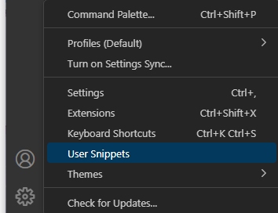

2.  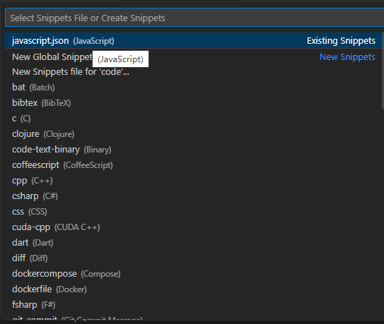

3. ```json
   {
   	// Place your snippets for javascript here. Each snippet is defined under a snippet name and has a prefix, body and 
   	// description. The prefix is what is used to trigger the snippet and the body will be expanded and inserted. Possible variables are:
   	// $1, $2 for tab stops, $0 for the final cursor position, and ${1:label}, ${2:another} for placeholders. Placeholders with the 
   	// same ids are connected.
   	// Example:
   	"Print to console": {//提示
   		"prefix": "log",//简写形式
   		"body": [//生成的代码片段
   			"console.log('$1');",
   			"$2"
   		],
   		"description": "Log output to console"
   	},
   
   	"Create vue instance": {
   		"prefix": "vmobj",//简写形式
   		"body": [//生成的代码片段
   		"const vm = new Vue({",
           "    el : '#app',",
           "    data : {",
   		"        $1",
           "    }",
           "})",
   		],
   		"description": "Log output to console"
   	},
   }
   ```

## 1. Vue程序初体验

我们可以先不去了解 Vue 框架的发展历史、Vue 框架有什么特点、Vue 是谁开发的，这些对我们编写 Vue 程序起 不到太大的作用，更何况现在说了一些特点之后，我们也没有办法彻底理解它，因此我们可以先学会用，使用一 段时间之后，我们再回头来熟悉一下 Vue 框架以及它的特点。

现在你只需要知道 Vue 是一个基于 JavaScript(JS） 实现的框架。要使用它就需要先拿到 Vue 的 js 文件。

### 1.1 下载vue.js

从 Vue 官网（https://v2.cn.vuejs.org/）下载 vue.js 文件

### 1.2 第一个 Vue 程序

```html
<!DOCTYPE html>
<html lang="en">
<head>
    <meta charset="UTF-8">
    <meta http-equiv="X-UA-Compatible" content="IE=edge">
    <meta name="viewport" content="width=device-width, initial-scale=1.0">
    <title>第一个Vue程序</title>
    <!-- 安装vue：当你使用script进行Vue安装之后，上下文中就注册了一个全局变量：Vue -->
    <script src="../js/vue.js"></script>
</head>
<body>
    <!-- 指定Vue实例的挂载位置。 -->
    <div id="app"></div>

    <script>
        /* 
        第一步：创建Vue实例
        1. 为什么要new Vue()，直接调用Vue()函数不行吗？
            不行，因为直接调用Vue()函数，不创建实例的话，会出现以下错误：
                Vue is a constructor and should be called with the `new` keyword
        2. 关于Vue构造函数的参数：options？
            option翻译为选项
            options翻译为多个选项
            Vue框架要求这个options参数必须是一个纯粹的JS对象：{}
            在{}对象中可以编写大量的key:value对。
            一个key:value对就是一个配置项。
            主要是通过options这个参数来给Vue实例指定多个配置项。
        3. 关于template配置项：
            template翻译为：模板。
            template配置项用来指定什么？用来指定模板语句，模板语句是一个字符串形式的。
            什么是模板语句？
                Vue框架自己制定了一些具有特殊含义的特殊符号eg:{{}}。
                Vue的模板语句是Vue框架自己搞的一套语法规则。
                我们写Vue模板语句的时候，不能乱写，要遵守Vue框架的模板语法规则。
            模板语句可以是一个纯粹的HTML代码，也可以是Vue中的特殊规则。也可以是HTML代码 + Vue的特殊规则。
            template后面的模板语句会被Vue框架的编译器进行编译，转换成浏览器能够识别的HTML代码。
        */

        /* 
        let options = {
            template : '<h1>Hello Vue!!!!!</h1>'
        }
        const myVue = new Vue(options) 
        */

        const myVue = new Vue({
            template : '<h1>Hello Vue!!!!!</h1>'
        })

        /* 
        第二步：将Vue实例挂载到id='app'的元素位置。
        1. Vue实例都有一个$mount()方法，这个方法的作用是什么？
            将Vue实例挂载到指定位置。
        2. #app 显然是ID选择器。这个语法借鉴了CSS。
        */
        myVue.$mount('#app')
        //myVue.$mount(document.getElementById('app'))
    </script>
</body>
</html>
```

### 1.3 Vue 的 data 配置项

[API — Vue.js (vuejs.org)](https://v2.cn.vuejs.org/v2/api/#data)

```html
<!DOCTYPE html>
<html lang="en">
<head>
    <meta charset="UTF-8">
    <meta http-equiv="X-UA-Compatible" content="IE=edge">
    <meta name="viewport" content="width=device-width, initial-scale=1.0">
    <title>模板语句的数据来源</title>
    <!-- 安装Vue -->
    <script src="../js/vue.js"></script>
</head>
<body>
    <!-- 指定挂载位置 -->
    <div id="app"></div>
    <!-- vue程序 -->
    <script>
        /* 
        模板语句的数据来源：
            1. 谁可以给模板语句提供数据支持呢？
                data选项。
            2. data选项的类型是什么？
                Object | Function （对象或者函数）
            3. data配置项的专业叫法：
                Vue 实例的数据对象.（data实际上是给整个Vue实例提供数据来源的。）
            4. 如果data是对象的话，对象必须是纯粹的对象 
                (含有零个或多个的 key/value 对)
            5. data数据如何插入到模板语句当中？
                {{}} 这是Vue框架自己搞的一套语法，别的框架看不懂的，浏览器也是不能够识别的。
                Vue框架自己是能够看懂的。这种语法在Vue框架中被称为：模板语法中的插值语法。（有的人把他叫做胡子语法。）
                怎么用？
                    {{data的key}}
                插值语法的小细节：
                    {这里不能有其它字符包括空格{
                    }这里不能有其它字符包括空格}
            
        */
        new Vue({
            template : `<h1>最近非常火爆的电视剧{{name}}，它的上映日期是{{releaseTime}}。主角是{{lead.name}}，年龄是{{lead.age}}岁。
                其他演员包括：{{actors[0].name}}({{actors[0].age}}岁)，{{actors[1].name}}({{actors[1].age}}岁)。{{a.b.c.d.e.name}}
                </h1>`,
            data : {
                name : '狂飙!!!',
                releaseTime : '2023年1月2日',
                lead : {
                    name : '高启强',
                    age : 41
                },
                actors : [
                    {
                        name : '安欣',
                        age : 41
                    },
                    {
                        name : '高启兰',
                        age : 29
                    }
                ],
                a : {
                    b : {
                        c : {
                            d : {
                                e : {
                                    name : '呵呵'
                                }
                            }
                        }
                    }
                }
            }
        }).$mount('#app')
    </script>
</body>
</html>
```

>以上程序执行原理
>
>- Vue 编译器对 template 进行编译，遇到胡子{{}}时从 data 中取数据，然后将取到的数据插到对应的位置。生成一段 HTML 代码，最终将 HTML 渲染到挂载位置，呈现。  
>- 当 data 发生改变时，template 模板会被重新编译，重新渲染。

### 1.4 Vue 的 templatie 配置项

````html
<!DOCTYPE html>
<html lang="en">
<head>
    <meta charset="UTF-8">
    <meta http-equiv="X-UA-Compatible" content="IE=edge">
    <meta name="viewport" content="width=device-width, initial-scale=1.0">
    <title>template配置项详解</title>
    <!-- 安装Vue -->
    <script src="../js/vue.js"></script>
</head>
<body>
    <!-- 指定挂载位置 -->
    <!-- 注意：以下代码就是只有Vue框架能够看懂的代码了。下面的代码就是一个模板语句。这个代码是需要Vue框架编译，然后渲染的。 -->
    <div id="app">
        <div>
            <h1>{{msg}}</h1>
            <h1>{{name}}</h1>
        </div>
    </div>

    <!-- vue程序 -->
    <script>
        // Vue.config是Vue的全局配置对象。
        // productionTip属性可以设置是否生成生产提示信息。
        // 默认值：true。如果是false则表示阻止生成提示信息。
        // Vue.config.productionTip = false//可能没有效果//如果没有效果可以直接改源码vue.js productionTip = false

        /* 
        关于template配置项：
            1.template后面指定的是模板语句，但是模板语句中只能有一个根节点。
            2.只要data中的数据发生变化，模板语句一定会重新编译。（只要data变，template就会重新编译，重新渲染）
            3.如果使用template配置项的话，指定挂载位置的元素会被替换。
            4.好消息：目前我们可以不使用template来编写模板语句。这些模板语句可以直接写到html标签中。Vue框架能够找到并编译，然后渲染。
            5.如果直接将模板语句编写到HTML标签中，指定的挂载位置就不会被替换了。
        关于$mount('#app')？
            也可以不使用$mount('#app')的方式进行挂载了。
            在Vue中有一个配置项：el
            el配置项和$mount()可以达到同样的效果。
            el配置项的作用？
                告诉Vue实例去接管哪个容器。
                el : '#app'，表示让Vue实例去接管id='app'的容器。
            el其实是element的缩写。被翻译为元素。
        */
        new Vue({
            // 错误的
            //template : '<h1>{{msg}}</h1> <h1>动力节点老杜</h1>',//这里有两个h1根节点，是错误的

            // 正确的
           /*  template : `
            <div>
                <h1>{{msg}}</h1>
                <h1>{{name}}</h1>
            </div>
            `, */
            // 定义的数据也可以直接在html被挂载的标签中的{{}}中引用
            data : {
                msg : 'Hello Vue!!!!!!!',
                name : 'a动力节点老杜!!!!!!'
                // vue的谷歌开发者工具插件有个小bug 数据开头一定要是非中文 不然插件无效
            },
            //el配置项和$mount()可以达到同样的效果。
            el : '#app'
            //el : document.getElementById('app')
        })
        //}).$mount('#app')
        
    </script>
</body>
</html>
````

### 1.5  Vue示例与容器的关系

一夫一妻制
一个容器对应一个示例

```html
<!DOCTYPE html>
<html lang="en">
<head>
    <meta charset="UTF-8">
    <meta http-equiv="X-UA-Compatible" content="IE=edge">
    <meta name="viewport" content="width=device-width, initial-scale=1.0">
    <title>Vue实例 和 容器 的关系是：一夫一妻制</title>
    <!-- 安装Vue -->
    <script src="../js/vue.js"></script>
</head>
<body>
    <!-- 准备容器(指定挂载位置) -->
    <!-- 结果： 只有第一个.app挂载了数据 -->
    <div class="app">
        <h1>{{msg}}</h1>
    </div>

    <div class="app">
        <h1>{{msg}}</h1>
    </div>

    <!-- 准备容器 -->
    <div id="app2">
        <h1>{{name}}</h1>
    </div>

    <!-- vue程序 -->
    <script>
        /* 
            验证：一个Vue实例可以接管多个容器吗？
                不能。一个Vue实例只能接管一个容器。一旦接管到容器之后，即使后面有相同的容器，Vue也是不管的。因为Vue实例已经“娶到媳妇”了。
        */
        new Vue({
            el : '.app',
            data : {
                msg : 'Hello Vue!'
            }
        })

        new Vue({
            el : '#app2',
            data : {
                name : 'zhangsan'
            }
        })

        // 这个Vue实例想去接管 id='app2'的容器，但是这个容器已经被上面那个Vue接管了。他只能“打光棍”了。
        new Vue({
            el : '#app2',
            data : {
                name : 'jackson'
            }
        })
        
    </script>


</body>
</html>
```

## 2. Vue 核心技术

### 2.1模板语法之插值语法

- 内容动态
- {{}}

```html
<!DOCTYPE html>
<html lang="en">
<head>
    <meta charset="UTF-8">
    <meta http-equiv="X-UA-Compatible" content="IE=edge">
    <meta name="viewport" content="width=device-width, initial-scale=1.0">
    <title>模板语法之插值语法{{}}</title>
    <!-- 安装Vue -->
    <script src="../js/vue.js"></script>
</head>
<body>
    <!-- 
        主要研究：{{这里可以写什么}}
        1. 在data中声明的变量、函数等都可以。
        2. 常量都可以。
        3. 只要是合法的javascript表达式，都可以。
        4. 模板表达式都被放在沙盒中，只能访问全局变量的一个白名单，如 Math 和 Date 等。
            'Infinity,undefined,NaN,isFinite,isNaN,' 
            'parseFloat,parseInt,decodeURI,decodeURIComponent,encodeURI,encodeURIComponent,' 
            'Math,Number,Date,Array,Object,Boolean,String,RegExp,Map,Set,JSON,Intl,' 
            'require'
     -->
    <!-- 准备容器 -->
    <div id="app">
        <!-- 在data中声明的 -->
        <!-- 这里就可以看做在使用msg变量。 -->
        <h1>{{msg}}</h1>
        <h1>{{sayHello()}}</h1>
        <!-- <h1>{{i}}</h1> -->
        <!-- <h1>{{sum()}}</h1> -->

        <!-- 常量 -->
        <h1>{{100}}</h1>
        <h1>{{'hello vue!'}}</h1>
        <h1>{{3.14}}</h1>

        <!-- javascript表达式 -->
        <h1>{{1 + 1}}</h1>
        <h1>{{'hello' + 'vue'}}</h1>
        <h1>{{msg + 1}}</h1><!--变量＋数字-->
        <h1>{{'msg' + 1}}</h1>
        <h1>{{gender ? '男' : '女'}}</h1>
        <h1>{{number + 1}}</h1>
        <h1>{{'number' + 1}}</h1>
        <h1>{{msg.split('').reverse().join('')}}</h1>

        <!-- 错误的：不是表达式，这是语句。 -->
        <!-- <h1>{{var i = 100}}</h1> -->

        <!-- 在白名单里面的 -->
        <h1>{{Date}}</h1>
        <h1>{{Date.now()}}</h1>
        <h1>{{Math}}</h1>
        <h1>{{Math.ceil(3.14)}}</h1>

    </div>

    <!-- vue程序 -->
    <script>

        // 用户自定义的一个全局变量
        var i = 100
        // 用户自定义的一个全局函数
        function sum(){
            console.log('sum.....');
        }

        new Vue({
            el : '#app',
            data : {
                number : 1,
                gender : true,
                msg : 'abcdef',  // 为了方便沟通，以后我们把msg叫做变量。（这行代码就可以看做是变量的声明。）
                sayHello : function(){
                    console.log('hello vue!');
                }
            }
        })
    </script>
</body>
</html>
```

### 2.2 模板指令-数据绑定

- 属性动态
- 指令的一个完整的语法格式：
  `<HTML标签 v-指令名:参数="javascript表达式"></HTML标签>`
- [v-on 事件绑定指令](###2.11  Vue的事件绑定——`v-on `指令)
- [v-if条件渲染指令](####2.21.1 条件渲染 `v-if`)
- [v-show条件渲染指令](####2.21.2 条件渲染`v-show`和`v-if`与`<template>`标签)
- [v-for循环指令](###2.22 列表渲染 `v-for`)
- [vue的其他指令](###2.26 Vue的其他指令)

```html
<!DOCTYPE html>
<html lang="en">
<head>
    <meta charset="UTF-8">
    <meta http-equiv="X-UA-Compatible" content="IE=edge">
    <meta name="viewport" content="width=device-width, initial-scale=1.0">
    <title>模板语法之指令语法 v-??? </title>
    <!-- 安装Vue -->
    <script src="../js/vue.js"></script>
</head>
<body>
    <!-- 
        指令语法：
            1. 什么是指令？有什么作用？
                指令的职责是，当表达式的值改变时，将其产生的连带影响，响应式地作用于 DOM
            2. Vue框架中的所有指令的名字都以“v-”开始。
            3. 插值是写在标签体当中的，那么指令写在哪里呢？
                Vue框架中所有的指令都是以HTML标签的属性形式存在的，例如：
                    <span 指令是写在这里的>{{这里是插值语法的位置}}</span>
                    注意：虽然指令是写在标签的属性位置上，但是这个指令浏览器是无法直接看懂的。
                    是需要先让Vue框架进行编译的，编译之后的内容浏览器是可以看懂的。
            4. 指令的语法规则：
                指令的一个完整的语法格式：
                    <HTML标签 v-指令名:参数="javascript表达式"></HTML标签>
                    表达式：
                        之前在插值语法中{{这里可以写什么}}，那么指令中的表达式就可以写什么。实际上是一样的。
                        但是需要注意的是：在指令中的表达式位置不能外层再添加一个{{}}
                    不是所有的指令都有参数和表达式：
                        有的指令，不需要参数，也不需要表达式，例如：v-once
                        有的指令，不需要参数，但是需要表达式，例如：v-if="表达式"
                        有的指令，既需要参数，又需要表达式，例如：v-bind:参数="表达式"
            5. v-once 指令
                作用：只渲染元素一次。随后的重新渲染，元素及其所有的子节点将被视为静态内容并跳过。这可以用于优化更新性能。
            
            6. v-if="表达式" 指令
                作用：表达式的执行结果需要是一个布尔类型的数据：true或者false
                    true：这个指令所在的标签，会被渲染到浏览器当中。
                    false：这个指令所在的标签，不会被渲染到浏览器当中。
     -->
    <!-- 准备一个容器 -->
    <div id="app">
        <h1>{{msg}}</h1>
        <h1 v-once>{{msg}}</h1>
        <h1 v-if="a > b">v-if测试：{{msg}}</h1>
    </div>
    <!-- vue程序 -->
    <script>
        new Vue({
            el : '#app',
            data : {
                msg : 'Hello Vue!',
                a : 10,
                b : 11
                // b : 9
            }
        })
    </script>
</body>
</html>
```

#### 2.2.1` v-bind `指令详解

- 编译前：
  `<HTML标签 v-bind:参数="表达式"></HTML标签>`

- 编译后：
  `<HTML标签 参数="表达式的执行结果"></HTML标签>`

- 作用
  它可以让HTML标签的某个**属性的值产生动态的效果**

- data ===> 视图单向绑定
  
  数据变化视图跟着变化，反之不可以
  
- 简写
  只是针对v-bind提供了以下简写方法

  ``简写↓
  ``
  `v-bind:参数="表达式"   简写为    :参数="表达式"`

```html
<!DOCTYPE html>
<html lang="en">
<head>
    <meta charset="UTF-8">
    <meta http-equiv="X-UA-Compatible" content="IE=edge">
    <meta name="viewport" content="width=device-width, initial-scale=1.0">
    <title>v-bind指令详解（它是一个负责动态绑定的指令）</title>
    <!-- 安装Vue -->
    <script src="../js/vue.js"></script>
</head>
<body>
    <!-- 
        v-bind指令详解
            1. 这个指令是干啥的？
                它可以让HTML标签的某个属性的值产生动态的效果。
            2. v-bind指令的语法格式：
                <HTML标签 v-bind:参数="表达式"></HTML标签>
            3. v-bind指令的编译原理？
                编译前：
                    <HTML标签 v-bind:参数="表达式"></HTML标签>
                编译后：
                    <HTML标签 参数="表达式的执行结果"></HTML标签>
                注意两项：
                    第一：在编译的时候v-bind后面的“参数名”会被编译为HTML标签的“属性名”
                    第二：表达式会关联data，当data发生改变之后，表达式的执行结果就会发生变化。
                    所以，连带的就会产生动态效果。
            4. v-bind因为很常用，所以Vue框架对该指令提供了一种简写方式：
                只是针对v-bind提供了以下简写方式：
                    
            
            5. 什么时候使用插值语法？什么时候使用指令？
                凡是标签体当中的内容要想动态，需要使用插值语法。
                只要向让HTML标签的属性动态，需要使用指令语法。
     -->
    <!-- 准备一个容器 -->
    <div id="app">
        <!-- 注意：以下代码中 msg 是变量名。 -->
        <!-- 注意：原则上v-bind指令后面的这个参数名可以随便写。 -->
        <!-- 虽然可以随便写，但大部分情况下，这个参数名还是需要写成该HTML标签支持的属性名。这样才会有意义。 -->
        <span v-bind:xyz="msg"></span>
        <!-- 编译为 <span xyz="Hello Vue!"></span> -->

        <!-- 这个表达式带有单引号，这个'msg'就不是变量了，是常量。 -->
        <span v-bind:xyz="'msg'"></span>
        <!-- 编译为 <span xyz="msg"></span> -->

        <!-- v-bind实战 -->
         <br>
         <br>

        <!-- v-bind简写形式 -->
         <br>

        <!-- 这是一个普通的文本框 -->
        <input type="text" name="username" value="zhangsan"> <br>
        <!-- 以下文本框可以让value这个数据变成动态的：这个就是典型的动态数据绑定。 -->
        <input type="text" name="username" :value="username"> <br>

        <!-- 使用v-bind也可以让超链接的地址动态 -->
        <a href="https://www.baidu.com">走起</a> <br>
        <a :href="url">走起2</a> <br>

        <!-- 不能采用以下写法吗？ -->
        <!-- 
            不能这样，报错了，信息如下：
            Interpolation inside attributes has been removed. 
            Use v-bind or the colon shorthand instead. For example, 
            instead of <div id="{{ val }}">, use <div :id="val">
            
            属性内部插值这种语法已经被移除了。（可能Vue在以前的版本中是支持这种写法的，但是现在不允许了。）
            请使用v-bind或冒号速记来代替。
            请使用 <div :id="val"> 来代替 <div id="{{ val }}">

         -->
        <!-- <a href="{{url}}">走起3</a>  -->

        <h1>{{msg}}</h1>

    </div>
    <!-- vue程序 -->
    <script>
        
        // 赋值的过程就可以看做是一种绑定的过程。
        //let i = 100

        new Vue({
            el : '#app',
            data : {
                msg : 'Hello Vue!',
                imgPath : '../img/1.jpg',
                username : 'jackson',
                url : 'https://www.baidu.com'
            }
        })
    </script>
</body>
</html>
```

#### 2.2.2` v-model `指令详解

- v-model是双向数据绑定
  data <===> 视图
- v-model只能使用在表单类元素上,只为value属性绑定
   因为表单类的元素才能给用户提供交互输入的界面
- 简写
  `v-model:value="表达式"  简写为    v-model="表达式"`
- 一些修饰符

  - `v-model.number="age"` 将获取的数据转为number，如果包含其他字符则只转数字的那一部分字符，其他的非数字被过滤掉

  - `v-model.trim="name"` 将获取的数据去掉前后空格

  -  `v-model.lazy`不加时文本域内输入一个字母执行一次双向绑定，加上后光标离开才双向绑定

    ```html
    <textarea cols="50" rows="15" v-model.lazy="user.introduce"></textarea>
    ```

```html
<!DOCTYPE html>
<html lang="en">
<head>
    <meta charset="UTF-8">
    <meta http-equiv="X-UA-Compatible" content="IE=edge">
    <meta name="viewport" content="width=device-width, initial-scale=1.0">
    <title>v-model指令详解</title>
    <!-- 安装Vue -->
    <script src="../js/vue.js"></script>
</head>
<body>
    <!-- 
        v-bind和v-model的区别和联系
            1. v-bind和v-model这两个指令都可以完成数据绑定。
            2. v-bind是单向数据绑定。
                data ===> 视图
                数据变化视图跟着变化，反之不可以
            3. v-model是双向数据绑定。
                data <===> 视图
                数据变化视图跟着变化，反之也可以
            4. v-bind可以使用在任何HTML标签当中。v-model只能使用在表单类元素上，例如：
                input标签、select标签、textarea标签。
                为什么v-model的使用会有这个限制呢？
                    因为表单类的元素才能给用户提供交互输入的界面。
                v-model指令通常也是用在value属性上面的。
            5. v-bind和v-model都有简写方式：
                v-bind简写方式：
                    v-bind:参数="表达式"    简写为      :参数="表达式"
                v-model简写方式：
                    v-model:value="表达式"  简写为      v-model="表达式"
     -->
    <!-- 准备一个容器 -->
    <div id="app">
        v-bind指令：<input type="text" v-bind:value="name1"><br>
        v-model指令：<input type="text" v-model:value="name2"><br>
        年龄：<input type="number" v-model.number="age"><!--这里的.number是将拿到的数据转为number，如果包含其他字符则只转数字的那一部分字符，其他的非数字被过滤掉-->

        <!-- 以下报错了，因为v-model不能使用在这种元素上。 -->
        <!-- <a v-model:href="url">百度</a> -->

        v-bind指令：<input type="text" :value="name1"><br>
        v-model指令：<input type="text" v-model="name2"><br>

        bind简写：<input type="text" :value="msg"><br>
        model简写：<input type="text" v-model="msg"><br>
    </div>

    <!-- vue程序 -->
    <script>
        new Vue({
            el : '#app',
            data : {
                name1 : 'zhangsan',
                name2 : 'wangwu',
                age: 1
                url : 'https://www.baidu.com',
                msg : 'Hello Vue!'
            }
        })
    </script>
    vmobj
</body>
</html>
```


### 2.3 MVVM 分层思想

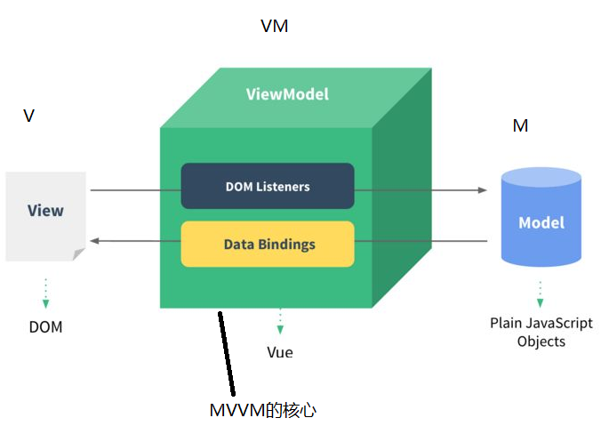

```html
<!DOCTYPE html>
<html lang="en">
<head>
    <meta charset="UTF-8">
    <meta http-equiv="X-UA-Compatible" content="IE=edge">
    <meta name="viewport" content="width=device-width, initial-scale=1.0">
    <title>初识MVVM分层思想</title>
    <script src="../js/vue.js"></script>
</head>
<body>
    <!-- 
        1. MVVM是什么？
            M：Model（模型/数据）
            V：View（视图）
            VM：ViewModel（视图模型）：VM是MVVM中的核心部分。（它起到一个核心的非常重要的作用。）
            MVVM是目前前端开发领域当中非常流行的开发思想。(一种架构模式。)
            目前前端的大部分主流框架都实现了这个MVVM思想，例如Vue，React等。
        2. Vue框架遵循MVVM吗？
            虽然没有完全遵循 MVVM 模型，但是 Vue 的设计也受到了它的启发。
            Vue框架基本上也是符合MVVM思想的。

        3. MVVM模型当中倡导了Model和View进行了分离，为什么要分离？
            假如Model和View不分离，使用最原始的原生的javascript代码写项目：
                如果数据发生任意的改动，接下来我们需要编写大篇幅的操作DOM元素的JS代码。

            将Model和View分离之后，出现了一个VM核心，这个VM把所有的脏活累活给做了，
            也就是说，当Model发生改变之后，VM自动去更新View。当View发生改动之后，
            VM自动去更新Model。我们再也不需要编写操作DOM的JS代码了。开发效率提高了很多。
     -->
     <!-- 准备容器 -->
     <!-- View V-->
     <div id="app">
        姓名：<input type="text" v-model="name">>
     </div>

     <!-- vue程序 -->
     <script>
        // ViewModel  VM
        const vm = new Vue({
            el : '#app',
            // Model  M
            data : {
                name : 'zhangsan'
            }
        })
     </script>
</body>
</html>
```

### 2.4 vm

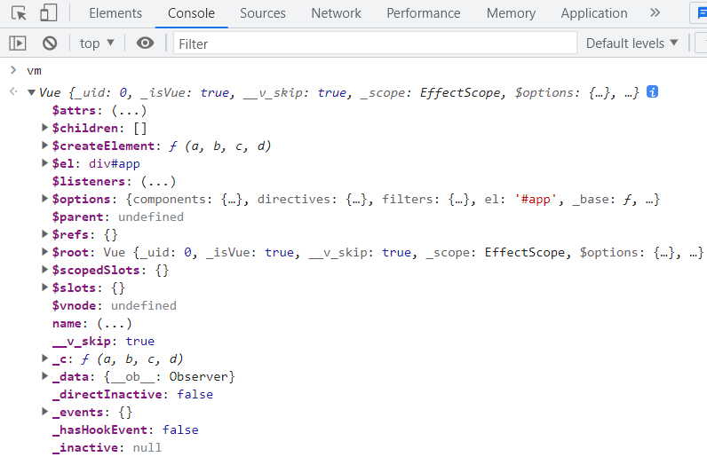

```html
<!DOCTYPE html>
<html lang="en">
<head>
    <meta charset="UTF-8">
    <meta http-equiv="X-UA-Compatible" content="IE=edge">
    <meta name="viewport" content="width=device-width, initial-scale=1.0">
    <title>认识vm</title>
    <!-- 安装Vue -->
    <script src="../js/vue.js"></script>
</head>
<body>
    <!-- 
        1. 通过Vue实例都可以访问哪些属性？(通过vm都可以vm. 什么。)
            Vue实例中的属性很多，有的以 $ 开始，有的以 _ 开始。
            所有以 $ 开始的属性，可以看做是公开的属性，这些属性是供程序员使用的。
            所有以 _ 开始的属性，可以看做是私有的属性，这些属性是Vue框架底层使用的。一般我们程序员很少使用。
            通过vm也可以访问Vue实例对象的原型对象上的属性，例如：vm.$delete...
        2. 
     -->
    <div id="app">
        <h1>{{msg}}</h1>
    </div>
    <script>

        let dataObj = {
            msg : 'Hello Vue!'
        }

        const vm = new Vue({
            el : '#app',
            data : dataObj
        })

        // 按说msg是dataObj对象的属性。
        console.log('dataObj的msg', dataObj.msg);

        // 为什么msg属性可以通过vm来访问呢？
        // 这是因为Vue框架底层使用了数据代理机制。
        // 要想搞明白数据代理机制，必须有一个基础知识点要学会：Object.defineProperty()。
        console.log('vm的msg', vm.msg);
       
    </script>
</body>
</html>
```

### 2.5 Object.defineProperty()

要想搞明白数据代理机制，必须有一个基础知识点要学会：Object.defineProperty()。

 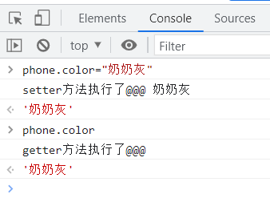

```html
<!DOCTYPE html>
<html lang="en">
<head>
    <meta charset="UTF-8">
    <meta http-equiv="X-UA-Compatible" content="IE=edge">
    <meta name="viewport" content="width=device-width, initial-scale=1.0">
    <title>Object.defineProperty()</title>
</head>
<body>
    <!-- 
        Object.defineProperty()
        1. 这个方法是ES5新增的。
        2. 这个方法的作用是：给对象新增属性，或者设置对象原有的属性。
        3. 怎么用？
            Object.defineProperty(给哪个对象新增属性, 
                                '新增的这个属性名叫啥',
                                {给新增的属性设置相关的配置项key:value对})
        4. 第三个参数是属性相关的配置项，配置项都有哪些？每个配置项的作用是啥？
            value 配置项：给属性指定值
            writable 配置项：设置该属性的值是否可以被修改。true表示可以修改。false表示不能修改。
            getter方法 配置项：不需要我们手动调用的。当读取属性值的时候，getter方法被自动调用。
                * getter方法的返回值非常重要，这个返回值就代表这个属性它的值。
            setter方法 配置项：不需要我们手动调用的。当修改属性值的时候，setter方法被自动调用。
                * setter方法上是有一个参数的，这个参数可以接收传过来的值。
            注意：当配置项当中有setter和getter的时候，value和writable配置项都不能存在。
     -->
     <script>

        // 这是一个普通的对象
        let phone = {}

        // 临时变量
        let temp

        // 给上面的phone对象新增一个color属性
        Object.defineProperty(phone, 'color', {
            //当配置项当中有setter和getter的时候，value和writable配置项都不能存在。
            //value : '太空灰', //给属性指定值
            //writable : true, //设置该属性的值是否可以被修改
            // getter方法配置项
            get : function(){
                console.log('getter方法执行了@@@');
                //return '动态'
                //return this.color
                return temp
            },
            // setter方法配置项
            set : function(val){
                console.log('setter方法执行了@@@',val);
                //this.color = val
                temp = val
            }
        })

     </script>
</body>
</html>
```

### 2.6 数据代理机制

- 数据代理机制
  通过访问 代理对象的属性 来间接访问 目标对象的属性。
-  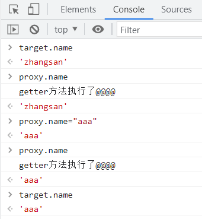

```html
<!DOCTYPE html>
<html lang="en">
<head>
    <meta charset="UTF-8">
    <meta http-equiv="X-UA-Compatible" content="IE=edge">
    <meta name="viewport" content="width=device-width, initial-scale=1.0">
    <title>数据代理机制</title>
    <script src="../js/vue.js"></script>
</head>
<body>

    <div id="app">
        <h1>{{msg}}</h1><!--这也是个代理机制，它会调用get方法(框架给写好的)来获取vm的msg属性-->
    </div>
    
    <script>
        const vm = new Vue({
            el : '#app',
            data : {
                msg : 'Hello Vue!'
            }
        })
    </script>

    <!-- 
        1. 什么是数据代理机制？
            通过访问 代理对象的属性 来间接访问 目标对象的属性。
            数据代理机制的实现需要依靠：Object.defineProperty()方法。
        2. ES6新特性：
            在对象中的函数/方法 :function 是可以省略的。
     -->
     <script>

        // 目标对象
        let target = {
            name : 'zhangsan'
        }

        // 代理对象
        let proxy = {}

        // 如果要实现数据代理机制的话，就需要给proxy新增一个name属性。
        // 注意：代理对象新增的这个属性的名字 和 目标对象的属性名要一致。
        Object.defineProperty(proxy, 'name', {
            // get : function(){
            //     // 间接访问目标对象的属性
            //     return target.name
            // },
            // set : function(val){
            //     target.name = val
            // }

            get(){
                console.log('getter方法执行了@@@@');
                return target.name
            },
            set(val){
                target.name = val
            }
        })

        // let target = {
        //     name : 'zhangsan'
        // }

        // const vm = new Vue({
        //     el : '#app',
        //     data : target
        // })
     </script>
</body>
</html>
```

### 2.7 Vue 数据代理机制对属性名的要求

 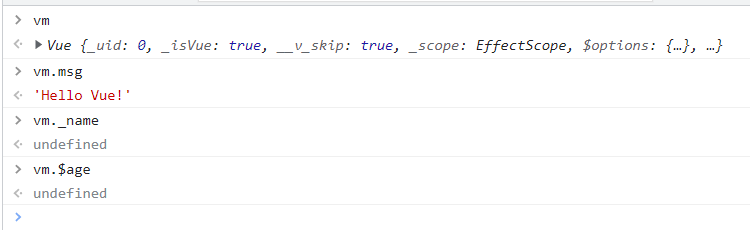

```html
<!DOCTYPE html>
<html lang="en">
<head>
    <meta charset="UTF-8">
    <meta http-equiv="X-UA-Compatible" content="IE=edge">
    <meta name="viewport" content="width=device-width, initial-scale=1.0">
    <title>Vue数据代理机制对属性名的要求</title>
    <!-- 安装Vue -->
    <script src="../js/vue.js"></script>
</head>
<body>
    <!-- 
        1. Vue实例不会给以_和$开始的属性名做数据代理。
        
        2. 为什么？
            如果允许给_或$开始的属性名做数据代理的话。
            vm这个Vue实例上可能会出现_xxx或$xxx属性，
            而这个属性名可能会和Vue框架自身的属性名冲突。

        3. 在Vue当中，给data对象的属性名命名的时候，不能以_或$开始。
     -->
    <!-- 容器 -->
    <div id="app">
        <h1>{{msg}}</h1><!--这也是个代理机制，它会调用vm的get方法(框架给写好的)来获取msg属性，在控制台可以Vue实例.msg获取它的值（vm.msg）-->
    </div>
    <!-- vue程序 -->
    <script>
        const vm = new Vue({
            el : '#app',
            data : {
                msg : 'Hello Vue!',
                _name : 'zhangsan',
                $age : 20
            }
        })
    </script>
</body>
</html>
```

### 2.8 手写vue框架——数据代理

`myvue.js`

```javascript
// 定义一个Vue类
class Vue {
    // 定义构造函数
    // options是一个简单的纯粹的JS对象：{}
    // options对象中有一个data配置项
    constructor(options){
        // 获取所有的属性名
        Object.keys(options.data).forEach((propertyName, index) => {
            //console.log(typeof propertyName, propertyName, index)
            let firstChar = propertyName.charAt(0)
            if(firstChar != '_' && firstChar != '$'){
                Object.defineProperty(this, propertyName, {
                    get(){
                        return options.data[propertyName]
                    },
                    set(val){
                        options.data[propertyName] = val
                    }
                })
            }
        })
        // 获取所有的方法名
        Object.keys(options.methods).forEach((methodName, index) => {
            // 给当前的Vue实例扩展一个方法
            this[methodName] = options.methods[methodName]
        })
    }
}

```

html:
```html
<!DOCTYPE html>
<html lang="en">
<head>
    <meta charset="UTF-8">
    <meta http-equiv="X-UA-Compatible" content="IE=edge">
    <meta name="viewport" content="width=device-width, initial-scale=1.0">
    <title>手写Vue框架数据代理的实现</title>
    <!-- 安装我们自己的Vue -->
    <script src="../js/myvue.js"></script>
    <!-- 安装Vue -->
    <!-- <script src="../js/vue.js"></script> -->
</head>
<body>
    <!-- 容器 -->
    <!-- <div id="app">
        <h1>{{msg}}</h1>
    </div> -->

    <!-- Vue代码 -->
    <script>
        // const vm = new Vue({
        //     el : '#app',
        //     data : {
        //         msg : 'Hello Vue!',
        //         name : 'jackson',
        //         age : 30
        //     }
        // })

        const vm = new Vue({
            data : {
                msg : 'Hello Vue!',
                _name : 'jackson',
                $age : 30
            }
        })
    </script>
</body>
</html>
```

### 2.9  解读Vue框架源代码

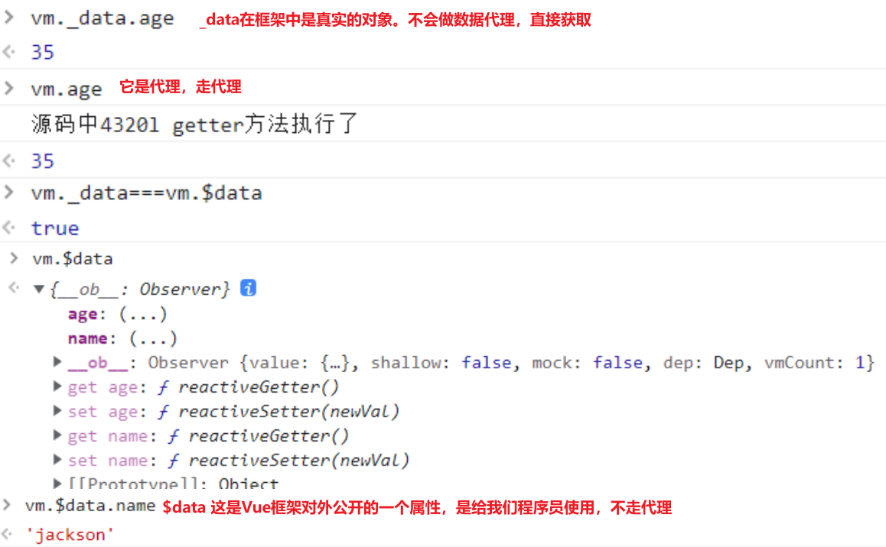

```html
<!DOCTYPE html>
<html lang="en">
<head>
    <meta charset="UTF-8">
    <meta http-equiv="X-UA-Compatible" content="IE=edge">
    <meta name="viewport" content="width=device-width, initial-scale=1.0">
    <title>解读Vue框架源代码</title>
    <!-- 安装Vue -->
    <script src="../js/vue.js"></script>
</head>
<body>
    <!-- 
        Vue框架源代码中关键性代码：
        1. var data = vm.$options.data;
            注意：这是获取data。程序执行到这里的时候vm上还没有 _data 属性。
        2. data = vm._data = isFunction(data) ? getData(data, vm) : data || {};
            程序执行完这个代码之后，vm对象上多了一个_data这样的属性。
            通过以上源码解读，可以得知data不一定是一个{}，也可以是一个函数。
            代码含义：
                如果data是函数，则调用getData(data, vm)来获取data。
                如果data不是函数，则直接将data返回，给data变量。并且同时将data赋值给vm._data属性了。
            有一个疑问？
                程序执行到这里，为什么要给vm扩展一个_data属性呢？
                    _data属性，以"_"开始，足以说明，这个属性是人家Vue框架底层需要访问的。
                    Vue框架底层它使用vm._data这个属性干啥呢？
                        vm._data是啥？
                            vm._data 是：{
                                            name : 'jackson',
                                            age : 35
                                        }
                vm._data 这个属性直接指向了底层真实的data对象。通过_data访问的name和age是不会走数据代理机制的。
                通过vm._data方式获取name和age的时候，是不会走getter和setter方法的。
            
            注意：对于Vue实例vm来说，不仅有_data这个属性，还有一个$data这个属性。
                   _data 是框架内部使用的，可以看做私有的。
                   $data 这是Vue框架对外公开的一个属性，是给我们程序员使用。

        3. 重点函数：
            function isReserved(str) {
                var c = (str + '').charCodeAt(0);
                return c === 0x24 || c === 0x5f;
            }
            这个函数是用来判断字符串是否以 _ 和 $ 开始的。
            true表示以_或$开始的。
            false表示不是以_或$开始的。
        4. proxy(vm, "_data", key);
            通过这行代码直接进入代理机制（数据代理）。
        5. 重点函数proxy
            function proxy(target, sourceKey, key) { // target是vm，sourceKey是"_data"，key是"age"
                sharedPropertyDefinition.get = function proxyGetter() {
                    return this["_data"]["age"];
                };
                sharedPropertyDefinition.set = function proxySetter(val) {
                    this["_data"]["age"] = val;
                };
                Object.defineProperty(vm, 'age', sharedPropertyDefinition);
            }
     -->
     
    <!-- 容器 -->
    <div id="app">
        <h1>姓名：{{name}}</h1>
        <h1>年龄：{{age}}岁</h1>
    </div>

    <!-- vue代码 -->
    <script>
        //源码中的，判断是否以_或$开始
        function isReserved(str) {
            var c = (str + '').charCodeAt(0);
            return c === 0x24 || c === 0x5f;
        }

        const vm = new Vue({
            el : '#app',
            data : {
                name : 'jackson',
                age : 35
            }
        })

        // 如果我们程序员不想走代理的方式读取data，想直接读取data当中的数据，可以通过_data和$data属性来访问。
        // 建议使用$data这个属性。
        console.log('name = ' + vm.$data.name)
        console.log('age = ' + vm.$data.age)
        
    </script>
</body>
</html>
```

### 2.10 data 是一个函数

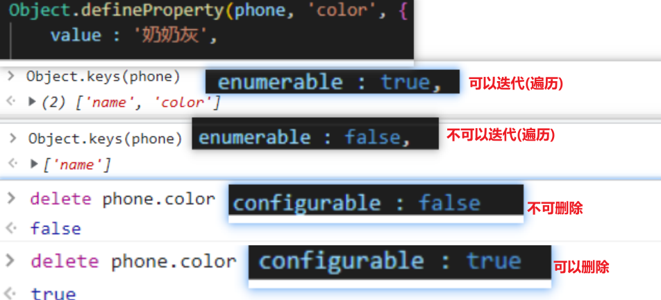

```html
<!DOCTYPE html>
<html lang="en">
<head>
    <meta charset="UTF-8">
    <meta http-equiv="X-UA-Compatible" content="IE=edge">
    <meta name="viewport" content="width=device-width, initial-scale=1.0">
    <title>data也可以是一个函数</title>
    <!-- 安装Vue -->
    <script src="../js/vue.js"></script>
</head>
<body>
    <!-- 容器 -->
    <div id="app">
        <h1>{{msg}}</h1>
    </div>
    <!-- vue代码 -->
    <script>
        const vm = new Vue({
            el : '#app',
            // data : {
            //     msg : 'Hello Vue!'
            // }
            // 报错：data functions should return an object：data函数应该返回一个对象。
            // data 也可以是一个函数。

            // 如果是函数的话，必须使用return语句返回{}对象。
            // data可以是直接的对象，也可以是一个函数，什么时候使用直接的对象？什么时候使用函数呢？（等你学到组件的时候自然就明白了。）
            // data : function(){
            //     return {
            //         msg : 'Hello Vue!'
            //     }
            // }

            // 在对象当中，函数的 :function 可以省略
            data(){
                return {
                    msg : 'Hello Zhangsan!'
                }
            }
        })

        /*
        源码：
        var sharedPropertyDefinition = {
            enumerable: true,
            configurable: true,
            get: noop,
            set: noop
        };      
        */
        // 关于配置项：enumerable、configurable
        let phone = {
            name : '苹果X'
        }

        // 给phone对象新增一个color属性
        Object.defineProperty(phone, 'color', {
            value : '奶奶灰',
            
            // true表示该属性是可以遍历的。（可枚举的，可迭代的。）
            // false表示该属性是不可遍历的。
            enumerable : false,

            // true表示该属性是可以被删除的。
            // false表示该属性是不可以被删除的。
            configurable : true
        })

    </script>
</body>
</html>                                       
```

### 2.11  Vue的事件绑定——`v-on` 指令

```html
<!DOCTYPE html>
<html lang="en">
<head>
    <meta charset="UTF-8">
    <meta http-equiv="X-UA-Compatible" content="IE=edge">
    <meta name="viewport" content="width=device-width, initial-scale=1.0">
    <title>Vue的事件绑定</title>
    <!-- 安装Vue -->
    <script src="../js/vue.js"></script>
</head>
<body>
    <!-- 
        Vue事件处理:
            1.指令的语法格式：
                <标签 v-指令名:参数名="表达式">{{插值语法}}</标签>
                “表达式”位置都可以写什么？
                    常量、JS表达式、Vue实例所管理的XXX
            2. 在Vue当中完成事件绑定需要哪个指令呢？
                v-on指令。
                语法格式：
                    v-on:事件名="表达式"
                例如：
                    v-on:click="表达式" 表示当发生鼠标单击事件之后，执行表达式。
                    v-on:keydown="表达式" 表示当发生键盘按下事件之后，执行表达式。
            3. 在Vue当中，所有事件所关联的回调函数，需要在Vue实例的配置项methods中进行定义。
                methods是一个对象：{}
                在这个methods对象中可以定义多个回调函数。
            4. v-on指令也有简写形式
                v-on:click 简写为 @click
                v-on:keydown 简写为 @keydown
                v-on:mouseover 简写为 @mouseover
                ....
            5. 绑定的回调函数，如果函数调用时不需要传递任何参数，小括号()可以省略。
            6. Vue在调用回调函数的时候，会自动给回调函数传递一个对象，这个对象是：当前发生的事件对象。
            7. 在绑定回调函数的时候，可以在回调函数的参数上使用 $event 占位符，Vue框架看到这个 $event 占位符之后，会自动将当前事件以对象的形式传过去。
     -->
    <!-- 容器 -->
    <div id="app">
        <h1>{{msg}}</h1>
        <!-- 使用javascript原生代码如何完成事件绑定。 -->
        <button onclick="alert('hello')">hello</button>

        <!-- 使用Vue来完成事件绑定 -->
        <!-- 以下是错误的，因为alert()并没有被Vue实例管理。 -->
        <!-- <button v-on:click="alert('hello')">hello</button> -->

        <!-- 以下是错误的，因为sayHello()并没有被Vue实例管理。 -->
        <!-- <button v-on:click="sayHello()">hello</button> -->

        <!-- 正确的写法 -->
        <button v-on:click="sayHello2()">v-on:click hello</button>
        <!-- v-on指令的简写形式 -->
        <button @click="sayHi1()">hi() button</button>
        <!-- 绑定的回调函数，如果不需要传任何参数，小括号() 可以省略 -->
        <button @click="sayHi1">hi button</button>

        <!--$event click事件对象-->
        <button @click="sayHi($event, 'jack')">hi button2</button>
        <!-- 绑定的回调函数，如果不需要传任何参数，小括号() 可以省略 -->
        <button @click="sayWhat">what button</button>
    </div>
    <!-- vue代码 -->
    <script>
        // 自定义一个函数
        // function sayHello(){
        //     alert('hello')
        // }

        const vm = new Vue({
            el : '#app',
            data : {
                msg : 'Vue的事件绑定'
            },
            methods : {
                // 回调函数
                // sayHello : function(){
                //     alert('hello')
                // }
                // : function 可以省略
                sayHello2(){
                    alert('hello2')
                },
                sayHi1(){
                    alert("hi1")
                },
                sayHi2(event, name){
                    console.log(name, event)
                    //alert("hi " + name)
                },
                sayWhat(event){
                    console.log(event)//事件对象
                    console.log(event.target)//事件对象的html代码
                    console.log(event.target.innerText)//事件对象按钮上的文本
                    alert('what...')
                }
            }
        })
    </script>
</body>
</html>
```

### 2.12 事件回调函数中的 this

```html
<!DOCTYPE html>
<html lang="en">
<head>
    <meta charset="UTF-8">
    <meta http-equiv="X-UA-Compatible" content="IE=edge">
    <meta name="viewport" content="width=device-width, initial-scale=1.0">
    <title>关于事件回调函数中的this</title>
    <!-- 安装Vue -->
    <script src="../js/vue.js"></script>
</head>
<body>
    <!--
        对于普通函数来说，this就是vue实例
        对于箭头函数来说，this就是window
            箭头函数中没有this，箭头函数中的this是从父级作用域当中继承过来的。
            对于当前程序来说，父级作用域是全局作用域:window

    -->
    <!-- 容器 -->
    <div id="app">
        <h1>{{msg}}</h1>
        <h1>计数器：{{counter}}</h1>
        <button @click="counter++">点击我加1</button>
        <button @click="add">点击我加1</button>
        <button @click="add2">点击我加1（箭头函数）</button>
    </div>
    <!-- vue代码 -->
    <script>
        const vm = new Vue({
            el : '#app',
            data : {
                msg : '关于事件回调函数中的this',
                counter : 0
            },
            // 1.methods对象中的方法可以通过vm去访问吗？可以。
            // 2.methods对象中的方法有没有做数据代理呢？没有。
            methods : {
                add(){
                    //counter++; // 错误的。
                    // 在这里需要操作counter变量？怎么办？
                    //console.log(vm === this)
                    //console.log(this)
                    //这个this就是vue实例
                    this.counter++;
                    //vm.counter++;
                },
                add2:()=>{
                    //this.counter++;
                    //console.log(this === vm)
                    //箭头函数中没有this，箭头函数中的this是从父级作用域当中继承过来的。
                    //对于当前程序来说，父级作用域是全局作用域:window
                    console.log(this)
                },
                sayHi(){
                    alert('hi...')
                }
            }
        })

    </script>
</body>
</html>
```

### 2.13 methods 的实现原理

```js
// 定义一个Vue类
class Vue {
    // 定义构造函数
    // options是一个简单的纯粹的JS对象：{}
    // options对象中有一个data配置项
    constructor(options){
        // 获取所有的属性名
        Object.keys(options.data).forEach((propertyName, index) => {
            //console.log(typeof propertyName, propertyName, index)
            let firstChar = propertyName.charAt(0)
            if(firstChar != '_' && firstChar != '$'){
                Object.defineProperty(this, propertyName, {
                    get(){
                        return options.data[propertyName]
                    },
                    set(val){
                        options.data[propertyName] = val
                    }
                })
            }
        })
        // 获取所有的方法名
        Object.keys(options.methods).forEach((methodName, index) => {
            // 给当前的Vue实例扩展一个方法
            this[methodName] = options.methods[methodName]
        })
    }
}
```

```html
<!DOCTYPE html>
<html lang="en">
<head>
    <meta charset="UTF-8">
    <meta http-equiv="X-UA-Compatible" content="IE=edge">
    <meta name="viewport" content="width=device-width, initial-scale=1.0">
    <title>methods实现原理</title>
    <!-- 引入我们自己的vue.js -->
    <script src="../js/myvue.js"></script>
</head>
<body>
    <!-- vue程序 -->
    <script>
        const vm = new Vue({
            data : {
                msg : 'hello vue!'
            },
            methods : {
                sayHi(){
                    //console.log(this === vm)
                    console.log(this.msg)
                    //alert('hi')
                },
                sayHello(){
                    alert('hello')
                },
                sayWhat : () => {
                    //console.log(this === vm)
                    console.log(this)
                }
            }
        })
        
    </script>
</body>
</html>
```

### 2.14 事件修饰符

Vue事件修饰符是一种语法糖，用于在处理DOM事件时添加特殊功能。Vue提供了以下事件修饰符：

1. .stop：阻止事件冒泡。

2. .prevent：阻止默认事件。

3. .capture：事件捕获模式。

4. .self：只有在事件触发的元素是当前元素时才触发事件。

5. .once：只触发一次事件。

6. .passive：告诉浏览器不要阻止事件的默认行为，可以提高页面的性能。

7. .native：监听组件根元素的原生事件。

```html
<!DOCTYPE html>
<html lang="en">
<head>
    <meta charset="UTF-8">
    <meta http-equiv="X-UA-Compatible" content="IE=edge">
    <meta name="viewport" content="width=device-width, initial-scale=1.0">
    <title>事件修饰符</title>
    <!-- 安装Vue -->
    <script src="../js/vue.js"></script>
    <style>
        .divList{
            width: 300px;
            height: 200px;
            background-color: aquamarine;
            overflow: auto;
        }
        .item{
            width: 300px;
            height: 200px;
        }
    </style>
</head>
<body>
    <!-- 
        Vue当中提供的事件修饰符：
        .stop ： 停止事件冒泡，等同于 event.stopPropagation()。
        .prevent ： 等同于 event.preventDefault() 阻止事件的默认行为。
        .capture ：添加事件监听器时使用事件捕获模式
                    添加事件监听器包括两种不同的方式：
                        一种是从内到外添加。（事件冒泡模式）
                        一种是从外到内添加。（事件捕获模式）
        .self ：这个事件如果是“我自己元素”上发生的事件，这个事件不是别人给我传递过来的事件，则执行对应的程序。
        .once ： 事件只发生一次
        .passive ：passive翻译为顺从/不抵抗。无需等待，直接继续（立即）执行事件的默认行为。
                    .passive 和 .prevent 修饰符是对立的。不可以共存。（如果一起用，就会报错。）
                    .prevent：阻止事件的默认行为。
                    .passive：解除阻止。
     -->        
    <!-- 容器 -->
    <div id="app">
        <h1>{{msg}}</h1>

        阻止事件的默认行为
        <a href="https://www.baidu.com" @click.prevent="yi">百度</a> <br><br>

        停止事件冒泡
        <div @click="san">
            <div @click.stop="er">
                <button @click="yi">事件冒泡</button>
            </div>
        </div>

        <br><br>

        添加事件监听器时使用事件捕获模式
        <div @click.capture="san">
            <!-- 这里没有添加.capture修饰符，以下这个元素，以及这个元素的子元素，都会默认采用冒泡模式。 -->
            <div @click="er">
                <button @click="yi">添加事件监听器的时候采用事件捕获模式</button>
            </div>
        </div>
        
        <br>
        <br>
        .self修饰符
        <div @click="san">
            <div @click.self="er">
                <!-- 点击这个按钮时会弹出1到2时这个事件并不是在2元素这儿发生的，不会弹出2，直接到3 -->
                <button @click="yi">self修饰符</button>
            </div>
        </div>

        <br>
        <br>

        在Vue当中，事件修饰符是可以多个联合使用的。
            但是需要注意：
                @click.self.stop：先.self，再.stop
                @click.stop.self：先.stop，再.self
        <div @click="san">
            <div @click="er">
                <button @click.self.stop="yi">self修饰符</button>
            </div>
        </div>

        <br>
        <br>
        .once修饰符：事件只发生一次，之后再点击无效
        <button @click.once="yi">事件只发生一次</button>

        <br>
        .passive修饰符
        <!-- 鼠标滚动事件 -->
        <!-- 如果滚动事件被阻止，滚动时滚动条不变化 -->
        <!-- 优先事件的默认行为执行，不管前面有什么，先变化滚动条 -->
        <div class="divList" @wheel.passive="testPassive">
            <div class="item">div1</div>
            <div class="item">div2</div>
            <div class="item">div3</div>
        </div>

    </div>
    <!-- vue代码 -->
    <script>
        const vm = new Vue({
            el : '#app',
            data : {
                msg : '事件修饰符'
            },
            methods : {
                yi(event){
                    //alert('去百度！！！!!!')
                    // 手动调用事件对象的preventDefault()方法，可以阻止事件的默认行为。
                    //event.preventDefault();

                    // 在Vue当中，这种事件的默认行为可以不采用手动调用DOM的方式来完成，可以使用事件修饰符:prevent。
                
                    alert(1)
                },
                er(){
                    alert(2)
                },
                san(){
                    alert(3)
                },
                testPassive(event){
                    for(let i = 0; i < 1000; i++){
                        console.log('test passive' + i)
                    }
                    // 阻止事件的默认行为
                    // event.preventDefault()
                }
            }
        })
    </script>
</body>
</html>
```

### 2.15 按键修饰符

```html
<!DOCTYPE html>
<html lang="en">
<head>
    <meta charset="UTF-8">
    <meta http-equiv="X-UA-Compatible" content="IE=edge">
    <meta name="viewport" content="width=device-width, initial-scale=1.0">
    <title>按键修饰符</title>
    <script src="../js/vue.js"></script>
</head>
<body>
    <!-- 
        9个比较常用的按键修饰符：
			.enter：响应回车键事件
			.tab：响应Tab键事件（必须配合keydown事件使用。）
			.delete：响应删除键事件 (捕获“删除”和“退格”键)
			.esc：响应Esc键事件
			.space：响应空格键事件
			.up：响应上方向键事件
			.down：响应下方向键事件
			.left：响应左方向键事件
			.right：响应右方向键事件
        怎么获取某个键的按键修饰符？
            第一步：通过event.key获取这个键的真实名字。
            第二步：将这个真实名字以kebab-case风格进行命名。
                PageDown是真实名字。经过命名之后：page-down
        按键修饰符是可以自定义的？
            通过Vue的全局配置对象config来进行按键修饰符的自定义。
            语法规则：
                Vue.config.keyCodes.按键修饰符的名字 = 键值
        系统修饰键：4个比较特殊的键
            ctrl、alt、shift、meta（win、mac……键）
            对于keydown事件来说：只要按下ctrl键，keydown事件就会触发。
            对于keyup事件来说：需要按下ctrl键，并且加上按下组合键，然后松开组合键之后，keyup事件才能触发。
     -->
    <div id="app">
        <h1>{{msg}}</h1>
        回车键@keyup.enter：<input type="text" @keyup.enter="getInfo"><br>
        回车键（键值）@keyup.13：<input type="text" @keyup.13="getInfo"><br>
        delete键：<input type="text" @keyup.delete="getInfo"><br>
        esc键：<input type="text" @keyup.esc="getInfo"><br>
        space键：<input type="text" @keyup.space="getInfo"><br>
        up键：<input type="text" @keyup.up="getInfo"><br>
        down键：<input type="text" @keyup.down="getInfo"><br>
        left键：<input type="text" @keyup.left="getInfo"><br>
        right键：<input type="text" @keyup.right="getInfo"><br>
        tab键无法触发keyup事件。只能触发keydown事件。<br>
        tab键： <input type="text" @keyup.tab="getInfo"><br>
        tab键（keydown）： <input type="text" @keydown.tab="getInfo"><br>

        PageDown键： <input type="text" @keyup.page-down="getInfo"><br>
        自定义按键<br>
        huiche键： <input type="text" @keyup.huiche="getInfo"><br>
        ctrl键(keydown)： <input type="text" @keydown.ctrl="getInfo"><br>
        <!-- 松开ctrl+任何键都可以 -->
        ctrl键(keyup)： <input type="text" @keyup.ctrl="getInfo"><br>
        <!-- 只有松开ctrl+i才可以 -->
        ctrl键(keyup)： <input type="text" @keyup.ctrl.i="getInfo"><br>
    </div>

    <script>

        // 自定义了一个按键修饰符：.huiche 。代表回车键。
        Vue.config.keyCodes.huiche = 13

        const vm = new Vue({
            el : '#app',
            data : {
                msg : '按键修饰符'
            },
            methods : {
                getInfo(event){
                    // 当用户键入回车键的时候，获取用户输入的信息。
                    //if(event.keyCode === 13){
                        console.log(event.target.value)//输的值
                    //}
                    console.log(event.key)//键的真实名字
                }
            }
        })
    </script>
</body>
</html>
```

### 2.16 计算属性 computed——反转字符串案例

#### 2.16.1 反转v1.0

```html
<!DOCTYPE html>
<html lang="en">
<head>
    <meta charset="UTF-8">
    <meta http-equiv="X-UA-Compatible" content="IE=edge">
    <meta name="viewport" content="width=device-width, initial-scale=1.0">
    <title>反转字符串</title>
    <script src="../js/vue.js"></script>
</head>
<body>
    <div id="app">
        <h1>{{msg}}</h1>
        v-model双向绑定
        输入的信息：<input type="text" v-model="info"> <br>
        <!-- 
            三个问题：
                1. 可读性差。
                2. 代码没有得到复用。
                3. 难以维护。
         -->
         <!-- 将info按空字符串拆分，然后反转，然后以空字符串拼接 -->
        反转的信息：{{info.split('').reverse().join('')}} <br>
        反转的信息：{{info.split('').reverse().join('')}} <br>
        反转的信息：{{info.split('').reverse().join('')}} <br>
        反转的信息：{{info.split('').reverse().join('')}} <br>
        反转的信息：{{info.split('').reverse().join('')}} <br>
    </div>
    <script>
        const vm = new Vue({
            el : '#app',
            data : {
                msg : '计算属性-反转字符串案例',
                info : ''
            }
        })
    </script>
</body>
</html>
```

#### 2.16.2 反转v2.0

```html
<!DOCTYPE html>
<html lang="en">
<head>
    <meta charset="UTF-8">
    <meta http-equiv="X-UA-Compatible" content="IE=edge">
    <meta name="viewport" content="width=device-width, initial-scale=1.0">
    <title>反转字符串methods实现</title>
    <script src="../js/vue.js"></script>
</head>
<body>
    <div id="app">
        <h1>{{msg}}</h1>
        输入的信息：<input type="text" v-model="info"> <br>
        <!-- 在插值语法中可以调用方法，小括号不能省略。这个方法需要是Vue实例所管理的。 -->
        反转的信息：{{reverseInfo()}} <br>
        反转的信息：{{reverseInfo()}} <br>
        反转的信息：{{reverseInfo()}} <br>
        反转的信息：{{reverseInfo()}} <br>
    </div>
    <script>
        const vm = new Vue({
            el : '#app',
            data : {
                msg : '计算属性-反转字符串案例',
                info : ''
            },
            methods : {
                // 反转信息的方法
                reverseInfo(){
                    console.log('@')//输入一次会在上面调用很多次这个方法，效率低
                    return this.info.split('').reverse().join('');
                }
            }
        })
    </script>
</body>
</html>
```

#### 2.16.3 反转3.0计算属性

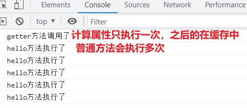
```html
<!DOCTYPE html>
<html lang="en">
<head>
    <meta charset="UTF-8">
    <meta http-equiv="X-UA-Compatible" content="IE=edge">
    <meta name="viewport" content="width=device-width, initial-scale=1.0">
    <title>反转字符串计算属性实现</title>
    <script src="../js/vue.js"></script>
</head>
<body>
    <!-- 
        计算属性：
        1. 什么是计算属性？
            使用Vue的原有属性，经过一系列的运算/计算，最终得到了一个全新的属性，叫做计算属性。
            Vue的原有属性: data对象当中的属性可以叫做Vue的原有属性。
            全新的属性: 表示生成了一个新的属性，和data中的属性无关了，新的属性也有自己的属性名和属性值。
            计算属性不能通过vue实例.$data.属性 或 vue实例._data.属性 来调用
                    可以通过vue实例.属性获取
		   计算属性是有缓存机制的
        2. 计算属性怎么用？
            语法格式：需要一个新的配置项 computed
                computed : {
                    // 这是一个计算属性
                    计算属性1 : {
                        // setter 和 getter方法。
                        // 在computed中：
						当第一次读取计算属性1的值的时候，getter方法被自动调用。
						或之后再读取计算属性1，读取之前set方法绑定的data值发生变化就会执行get方法
                        get(){
                        },
                        // 当修改计算属性1的值的时候，setter方法被自动调用。
                        set(val){
                        }
                    },
                    // 这是另一个计算属性
                    计算属性2 : {},
				  // 简写形式：set不需要的时候。
				  计算属性3(){
  					  return ...,
				  }
                }
        3. 计算属性的作用？
            代码得到了复用。
            代码更加便于维护了。
            代码的执行效率高了。
     -->
    <div id="app">
        <h1>{{msg}}</h1>
        输入的信息：<input type="text" v-model="info"> <br>
        反转的信息：{{reversedInfo}}<br><!--计算属性调用时不能加 () -->
        反转的信息：{{reversedInfo}}<br>
        反转的信息：{{reversedInfo}}<br>
        反转的信息：{{reversedInfo}}<br>
        反转的信息：{{reversedInfo}}<br>
        {{hehe}} <br><!--普通函数 ()可加可不加-->
        {{hehe}} <br>
        {{hehe}} <br>
        {{hehe}} <br>
        {{hehe}} <br>
        {{hello()}} <br>
        {{hello()}} <br>
        {{hello()}} <br>
        {{hello()}} <br>
        {{hello()}} <br>
    </div>
    <script>
        const vm = new Vue({
            el : '#app',
            data : {
                msg : '计算属性-反转字符串案例',
                info : ''
            },
            methods : {
                hello(){
                    console.log('hello方法执行了')
                    return 'hello'
                }
            },
            computed : {//(有缓存机制)
                // 可以定义多个计算属性
                hehe : {
                    // get方法的调用时机包括两个
                    // 第一个时机：第一次访问这个属性的时候。
                    // 第二个时机：该计算属性所关联的Vue原有属性的值发生变化时，getter方法会被重新调用一次。
                    get(){
                        console.log('getter方法调用了')
                        // console.log(this === vm)
                        return 'haha' + this.info
                    },
                    // 不能使用箭头函数，使用箭头函数会导致this的指向是：window
                    // get:()=>{
                    //     console.log('getter方法调用了')
                    //     console.log(this === vm)
                    //     return 'haha'
                    // },
                    set(val){
                        console.log('setter方法调用了')
                        // console.log(this === vm)
                    }
                },
                // 完整写法
                reversedInfo : { 
                    get(){
                        return this.info.split('').reverse().join('')
                    },
                    // 当修改计算属性的时候，set方法被自动调用。
                    set(val){
                        //console.log('setter方法被调用了。')
                        // 不能这么做，这样做就递归了。
                        //this.reversedInfo = val
                        // 怎么修改计算属性呢？原理：计算属性的值变还是不变，取决于计算属性关联的Vue原始属性的值。
                        // 也就是说：reversedInfo变还是不变，取决于info属性的值变不变。
                        // 本质上：修改计算属性，实际上就是通过修改Vue的原始属性来实现的。
                        this.info = val.split('').reverse().join('')
                    }
                } 

                // 简写形式：set不需要的时候。
                reversedInfo(){ 
                    return this.info.split('').reverse().join('')
                }
            }
        })
    </script>
</body>
</html>
```

### 2.17 侦听属性的变化——watch

```html
<!DOCTYPE html>
<html lang="en">
<head>
    <meta charset="UTF-8">
    <meta http-equiv="X-UA-Compatible" content="IE=edge">
    <meta name="viewport" content="width=device-width, initial-scale=1.0">
    <title>侦听/监视 属性的变化</title>
    <script src="../js/vue.js"></script>
</head>
<body>
    <div id="app">
        <h1>{{msg}}</h1>
        数字：<input type="text" v-model="number"><br>
        数字：<input type="text" v-model="a.b"><br>
        数字：<input type="text" v-model="a.c"><br>
        数字：<input type="text" v-model="a.d.e.f"><br>
        数字(后期添加监视)：<input type="text" v-model="number2"><br>
    </div>
    <script>
        const vm = new Vue({
            el : '#app',
            data : {
                number2 : 0,
                msg : '侦听属性的变化',
                number : 0,
                // a属性中保存的值是一个对象的内存地址。
                // a = 0x2356
                a : {
                    b : 0,
                    c : 0,
                    d : {
                        e : {
                            f : 0
                        }
                    }
                }
            },
            computed : {
                hehe(){
                    return 'haha' + this.number
                }
            },
            watch : {
                // 可以监视多个属性
                // 监视哪个属性，请把这个属性的名字拿过来即可。
                // 可以监视Vue的原有属性
                /* number : {
                    // 初始化的时候，调用一次handler方法。
                    immediate : true,
                    // 这里有一个固定写死的方法，方法名必须叫做：handler
                    // handler方法什么时候被调用呢？当被监视的属性发生变化的时候，handler就会自动调用一次。
                    // handler方法上有两个参数：第一个参数newValue，第二个参数是oldValue
                    // newValue是属性值改变之后的新值。
                    // oldValue是属性值改变之前的旧值。
                    handler(newValue, oldValue){
                        console.log(newValue, oldValue)
                        // this是当前的Vue实例。
                        // 如果该函数是箭头函数，这个this是window对象。不建议使用箭头函数。
                        console.log(this)
                    }
                }, */

                // 无法监视b属性，因为b属性压根不存在。
                /* b : {  
                    handler(newValue, oldValue){
                        console.log('@')
                    } 
                } */
                
                // 如果监视的属性具有多级结构，一定要添加单引号：'a.b'
                 'a.b' : {  
                    handler(newValue, oldValue){
                        console.log('@a.b')
                    } 
                },

                'a.c' : {  
                    handler(newValue, oldValue){
                        console.log('@a.c')
                    } 
                }, 

                a : {//监视a属性
                    // 启用深度监视，默认是不开启深度监视的。
                    // 什么时候开启深度监视：当你需要监视一个具有多级结构的属性，并且监视所有的属性，需要启用深度监视。
                    deep : true,  //开启深度监视

                    handler(newValue, oldValue){
                        console.log('@')
                    } 
                },

                // 注意：监视某个属性的时候，也有简写形式，什么时候启用简写形式？
                // 当只有handler回调函数的时候，可以使用简写形式。
                number(newValue, oldValue){
                    console.log(newValue, oldValue)
                }

                // 也可以监视计算属性
                /* hehe : {
                    handler(a , b){
                        console.log(a, b)
                    }
                } */
            }
        })

        // 如何后期添加监视？调用Vue相关的API即可。
        // 语法：vm.$watch('被监视的属性名', {})
        /* vm.$watch('number2', {
            immediate : true,
            deep : true,
            handler(newValue, oldValue){
                console.log(newValue, oldValue)
            }
        }) */

        // 这是后期添加监视的简写形式。
        vm.$watch('number2', function(newValue, oldValue){
            console.log(newValue, oldValue)
        })

    </script>
</body>
</html>
```

### 2.18 watch监听属性和conputed计算属性——比较大小案例

#### 2.18.1 比较大小的案例watch实现

```html
<!DOCTYPE html>
<html lang="en">
<head>
    <meta charset="UTF-8">
    <meta http-equiv="X-UA-Compatible" content="IE=edge">
    <meta name="viewport" content="width=device-width, initial-scale=1.0">
    <title>比较大小的案例watch实现</title>
    <script src="../js/vue.js"></script>
</head>
<body>
    <div id="app">
        <h1>{{msg}}</h1>
        数值1：<input type="number" v-model="num1"><br>
        数值2：<input type="number" v-model="num2"><br>
        比较大小：{{compareResult}}
    </div>
    <script>
        const vm = new Vue({
            el : '#app',
            data : {
                msg : '比较大小的案例',
                num1 : 0,
                num2 : 0,
                compareResult : ''
            },
            watch : {
                // 监视num1
                num1 : {
                    immediate : true,//刚开始就执行handler
                    /* handler(newValue, oldValue){
                        console.log(newValue, oldValue)
                    } */
                    handler(val){//这个val是newValue
                        //console.log(val)
                        let result = val - this.num2
                        // 这个箭头函数也不是Vue管理的。是javascript引擎负责管理的。调用这个箭头函数的还是window。
                        // 箭头函数没有this，只能向上一级找this，上一级是num1，num1是Vue实例的属性，所以this是Vue实例。
                        setTimeout(() => {
                            console.log(this)
                            if(result == 0){
                                this.compareResult = val + ' = ' + this.num2
                            }else if(result > 0){
                                this.compareResult = val + ' > ' + this.num2
                            }else {
                                this.compareResult = val + ' < ' + this.num2
                            }    
                        }, 1000 * 3)
                        
                    }
                },
                // 监视num2
                num2 : {//这个val是newValue
                    immediate : true,//刚开始就执行handler
                    /* handler(newValue, oldValue){
                        console.log(newValue, oldValue)
                    } */
                    handler(val){
                        //console.log(val)
                        let result = this.num1 - val
                        /* setTimeout(() => {
                            // 虽然这个函数是箭头函数，但是this是Vue实例。
                            console.log(this)
                            if(result == 0){
                                this.compareResult = this.num1 + ' = ' + val
                            }else if(result > 0){
                                this.compareResult = this.num1 + ' > ' + val
                            }else {
                                this.compareResult = this.num1 + ' < ' + val
                            }    
                        }, 1000 * 3) */

                        // 这里虽然是普通函数，但是这个函数并不是Vue管理的。是window负责调用的。
                        // 所以这个普通函数当中的this是window。
                        setTimeout(function(){
                            // 虽然这个函数是普通函数，但是this是window。
                            console.log(this)
                            if(result == 0){
                                this.compareResult = this.num1 + ' = ' + val
                            }else if(result > 0){
                                this.compareResult = this.num1 + ' > ' + val
                            }else {
                                this.compareResult = this.num1 + ' < ' + val
                            }    
                        }, 1000 * 3)
                        
                    }
                }

            }
        })
    </script>
</body>
</html>
```

#### 2.18.2 比较大小的案例computed实现

```html
<!DOCTYPE html>
<html lang="en">
<head>
    <meta charset="UTF-8">
    <meta http-equiv="X-UA-Compatible" content="IE=edge">
    <meta name="viewport" content="width=device-width, initial-scale=1.0">
    <title>比较大小的案例computed实现</title>
    <script src="../js/vue.js"></script>
</head>
<body>
    <!-- 
        1. computed和watch如果都能够完成某个功能，优先选择computed。
        2. 有一种情况下，必须使用watch，computed无法完成！
            如果在程序当中采用了异步的方式，只能使用watch。
        3. 什么时候使用箭头函数？什么时候使用普通函数？
            看看这个函数是否属于Vue管理的。
            是Vue管理的函数：统一写普通函数。
            不是Vue管理的函数：统一写箭头函数。
     -->
    <div id="app">
        <h1>{{msg}}</h1>
        数值1：<input type="number" v-model="num1"><br>
        数值2：<input type="number" v-model="num2"><br>
        比较大小：{{compareResult}}
    </div>
    <script>
        const vm = new Vue({
            el : '#app',
            data : {
                msg : '三秒后比较大小的案例(异步，无法实现)',
                num1 : 0,
                num2 : 0
            },
            computed : {
                // 计算属性的简写形式

                compareResult(){
                    let result = this.num1 - this.num2
                    /*           
                        if(result == 0){
                            return this.num1 + ' = ' + this.num2
                        }else if(result > 0){
                            return  this.num1 + ' > ' + this.num2
                        }else {
                            return  this.num1 + ' < ' + this.num2
                        }    
                    } 
                    */

                    // 这里采用了异步方式,用户输入三秒后再比较大小，
                    //     这里的箭头函数是javascript引擎去调用。所以最终return的时候，也会将值返回给javascript引擎。
                    //     这是不可以的
                    setTimeout(() => {
                        if(result == 0){
                            return this.num1 + ' = ' + this.num2
                        }else if(result > 0){
                            return  this.num1 + ' > ' + this.num2
                        }else {
                            return  this.num1 + ' < ' + this.num2
                        }    
                    }, 1000 * 3) // X
                }
            }
        })
    </script>
</body>
</html>
```

### 2.19 Class绑定

操作元素的 class 列表和内联样式是数据绑定的一个常见需求。
因为它们都是 attribute，所以我们可以用 `v-bind` 处理它们：
只需要通过表达式计算出字符串结果即可。不过，字符串拼接麻烦且易错。
因此，在将 `v-bind` 用于 `class` 和 `style` 时，Vue.js 做了专门的增强。表达式结果的类型除了字符串之外，还可以是对象或数组。

#### 2.19.1 Class绑定之字符串形式

- 适用场景：如果确定动态绑定的样式个数只有1个，但是名字不确定。

```html
<!DOCTYPE html>
<html lang="en">
<head>
    <meta charset="UTF-8">
    <meta http-equiv="X-UA-Compatible" content="IE=edge">
    <meta name="viewport" content="width=device-width, initial-scale=1.0">
    <title>Class绑定之字符串形式</title>
    <script src="../js/vue.js"></script>
    <style>
        .static{
            border: 1px solid black;
            background-color: aquamarine;
        }
        .big{
            width: 200px;
            height: 200px;
        }
        .small{
            width: 100px;
            height: 100px;
        }
    </style>
</head>
<body>
    <div id="app">
        <h1>{{msg}}</h1>
        <!-- 静态写法 -->
        <div class="static small">{{msg}}</div>
        <br><br>
        <button @click="changeBig">变大</button>
        <button @click="changeSmall">变小</button>
        <!-- 动态写法：动静都有 -->
        <!-- 适用场景：如果确定动态绑定的样式个数只有1个，但是名字不确定。 -->
        <!-- <div class="static" v-bind:class="c1">{{msg}}</div> -->
        <div class="static" :class="c1">{{msg}}</div>
    </div>
    </div>
    <script>
        const vm = new Vue({
            el : '#app',
            data : {
                msg : 'Class绑定之字符串形式',
                c1 : 'small'
            },
            methods: {
                changeBig(){
                    this.c1 = 'big'
                },
                changeSmall(){
                    this.c1 = 'small'
                }
            },
        })
    </script>
</body>
</html>
```

#### 2.19.2Class绑定之数组形式

- 适用场景：当样式的个数不确定，并且样式的名字也不确定的时候，可以采用数组形式。

```html
<!DOCTYPE html>
<html lang="en">
<head>
    <meta charset="UTF-8">
    <meta http-equiv="X-UA-Compatible" content="IE=edge">
    <meta name="viewport" content="width=device-width, initial-scale=1.0">
    <title>Class绑定之数组形式</title>
    <script src="../js/vue.js"></script>
    <style>
        .static {
            border: 1px solid black;
            width: 100px;
            height: 100px;
        }
        .active {
            background-color: green;
        }
        .text-danger {
            color: red;
        }
    </style>
</head>
<body>
    <div id="app">
        <h1>{{msg}}</h1>
        <!-- 静态写法 -->
        <div class="static active text-danger">{{msg}}</div>
        <br>
        <!-- 动态写法：动静结合 -->
        <div class="static" :class="['active','text-danger']">{{msg}}</div>
        <br>
        <div class="static" :class="[c1, c2]">{{msg}}</div>
        <br>
        <!-- 适用场景：当样式的个数不确定，并且样式的名字也不确定的时候，可以采用数组形式。 -->
        <div class="static" :class="classArray">{{msg}}</div>

    </div>
    <script>
        const vm = new Vue({
            el : '#app',
            data : {
                msg : 'Class绑定之数组形式',
                c1 : 'active',
                c2 : 'text-danger',
                classArray : ['active', 'text-danger']
            }
        })
    </script>
</body>
</html>
```

#### 2.19.3 Class绑定之对象形式

```html
<!DOCTYPE html>
<html lang="en">
<head>
    <meta charset="UTF-8">
    <meta http-equiv="X-UA-Compatible" content="IE=edge">
    <meta name="viewport" content="width=device-width, initial-scale=1.0">
    <title>Class绑定之对象形式</title>
    <script src="../js/vue.js"></script>
    <style>
        .static {
            border: 1px solid black;
            width: 100px;
            height: 100px;
        }
        .active {
            background-color: green;
        }
        .text-danger {
            color: red;
        }
    </style>
</head>
<body>
    <div id="app">
        <h1>{{msg}}</h1>
        <!-- 动态写法：动静结合 -->
        <!-- 对象形式的适用场景：样式的个数是固定的，样式的名字也是固定的，但是需要动态的决定样式用还是不用。 -->
        <div class="static" :class="classObj">{{msg}}</div>
        <br>
        <div class="static" :class="{active:true,'text-danger':false}">{{msg}}</div>
    </div>
    <script>
        const vm = new Vue({
            el : '#app',
            data : {
                msg : 'Class绑定之对象形式',
                classObj : {
                    // 该对象中属性的名字必须和样式名一致。
                    //属性名字的单引号可以省，但是text-danger不能省，因为它有“-”符号
                    active : false,
                    'text-danger' : true
                }
            }
        })
    </script>
</body>
</html>
```

### 2.20 Style绑定

```html
<!DOCTYPE html>
<html lang="en">
<head>
    <meta charset="UTF-8">
    <meta http-equiv="X-UA-Compatible" content="IE=edge">
    <meta name="viewport" content="width=device-width, initial-scale=1.0">
    <title>Style绑定</title>
    <script src="../js/vue.js"></script>
    <style>
        .static {
            border: 1px solid black;
            width: 100px;
            height: 100px;
        }
    </style>
</head>
<body>
    <div id="app">
        <h1>{{msg}}</h1>
        <!-- 静态写法 -->
        <div class="static" style="background-color: green;">{{msg}}</div>
        <br>
        <!-- 动态写法：字符串形式 -->
        <div class="static" :style="myStyle">{{msg}}</div>
        <br>
        <!-- 动态写法：对象形式
        在对象里属性要用大驼峰，值加单引号 -->
        <div class="static" :style="{backgroundColor: 'gray'}">{{msg}}</div>
        <br>
        <div class="static" :style="styleObj1">{{msg}}</div>
        <br>
        <!-- 动态写法：数组形式 -->
        <div class="static" :style="styleArray">{{msg}}</div>
    </div>
    <script>
        const vm = new Vue({
            el : '#app',
            data : {
                msg : 'Style绑定',
                myStyle : 'background-color: gray;',
                styleObj1 : {
                    backgroundColor: 'green'
                },
                styleArray : [
                    {backgroundColor: 'green'},
                    {color : 'red'}
                ]
            }
        })
    </script>
</body>
</html>
```

### 2.21 条件渲染 

#### 2.21.1 条件渲染 `v-if`

`v-if`如果为`false`直接删除这个dom元素

```html
    <title>条件渲染</title>
    <script src="../js/vue.js"></script>
</head>
<body>
    <div id="app">
        <h1>{{msg}}</h1>
        <!-- 
            v-if指令的值：true/false
                true: 表示该元素会被渲染到页面上。
                false: 表示该元素不会被渲染到页面上。（注意：不是修改了CSS样式，是这个元素压根没有加载）
         -->
        <div v-if="false">{{msg}}</div>

        <div v-if="2 === 1">{{msg}}</div>

        <button @click="counter++">点我加1</button>

        <h3>{{counter}}</h3>

        <!-- 奇数显示 -->
        

        <!-- 提醒：v-if和v-else之间不能断开。 -->
        <!-- <div></div> -->
        <!-- 多了这个div下面的else就会报错else缺少if -->

        <!--  -->
        <!-- 为了提高效率，可以使用v-else指令 -->
        <!-- 否则(不是奇数)显示这个 -->
        

        <br><br>

        温度：<input type="number" v-model="temprature"><br><br>

        <!-- 天气：<span v-if="temprature <= 10">寒冷</span>
        <span v-if="temprature > 10 && temprature <= 25">凉爽</span>
        <span v-if="temprature > 25">炎热</span> -->

        天气：<span v-if="temprature <= 10">寒冷</span>
        <!-- v-if v-else-if v-else三者在使用的时候，中间不能断开。 -->
        <!-- <br> -->
        <span v-else-if="temprature <= 25">凉爽</span>
        <span v-else>炎热</span>

        <br><br><br>

        <!-- 
            v-show指令是通过修改元素的CSS样式的display属性来达到显示和隐藏的。
            v-if和v-show应该如何选择？
                1. 如果一个元素在页面上被频繁的隐藏和显示，建议使用v-show，因为此时使用v-if开销比较大。
                2. v-if的优点：页面加载速度快，提高了页面的渲染效率。
         -->
        <div v-show="false">你可以看到我吗？</div>

        <!-- template标签/元素只是起到占位的作用，不会真正的出现在页面上，也不会影响页面的结构。 -->
        <template v-if="counter === 10">
            <input type="text">
            <input type="checkbox">
            <input type="radio">            
        </template>

    </div>
    <script>
        const vm = new Vue({
            el : '#app',
            data : {
                msg : '条件渲染',
                counter : 1,
                imgPath1 : '../img/1.jpg',
                imgPath2 : '../img/2.jpg',
                temprature : 0
            }
        })
    </script>
```

#### 2.21.2 条件渲染`v-show`和`v-if`与`<template>`标签

另一个用于根据条件展示元素的选项是 `v-show` 指令。用法大致一样：

```html
<h1 v-show="ok">Hello!</h1>
```

不同的是带有 `v-show` 的元素始终会被渲染并保留在 DOM 中。`v-show` 只是简单地切换元素的 CSS property `display`。

注意，`v-show` 不支持 `<template>` 元素，也不支持 `v-else`。

```html
<!-- 
            v-show指令是通过修改元素的CSS样式的display属性来达到显示和隐藏的。
            v-if和v-show应该如何选择？
                1. 如果一个元素在页面上被频繁的隐藏和显示，建议使用v-show，因为此时使用v-if开销比较大。
                2. v-if的优点：页面加载速度快，提高了页面的渲染效率。
         -->
        <div v-show="false">你可以看到我吗？</div>

        <!-- template标签/元素只是起到占位的作用，不会真正的出现在页面上，也不会影响页面的结构。 -->
        <template v-if="counter === 10">
            <input type="text">
            <input type="checkbox">
            <input type="radio">            
        </template>

```

### 2.22 列表渲染 `v-for`

1. v-for要写在循环项上。
2. v-for的语法规则：
   - v-for="(变量名,index) in/of 数组"
   - 变量名 代表了 数组中的每一个元素

```html
<!DOCTYPE html>
<html lang="en">
<head>
    <meta charset="UTF-8">
    <meta http-equiv="X-UA-Compatible" content="IE=edge">
    <meta name="viewport" content="width=device-width, initial-scale=1.0">
    <title>列表渲染</title>
    <script src="../js/vue.js"></script>
</head>
<body>
    <div id="app">
        <h1>{{msg}}</h1>

        <h2>遍历对象的属性</h2>
        <ul>
            <li v-for="(value, propertyName) of user">
                {{propertyName}},{{value}}
                <!--属性值，属性名-->
            </li>
        </ul>

        <h2>遍历字符串</h2>
        <ul>
            <li v-for="(c,index) of str">
                {{index}},{{c}}
            </li>
        </ul>

        <h2>遍历指定的次数</h2>
        <ul>
            <li v-for="(num,index) of counter">
                {{index}}, {{num}}
                <!--
				0, 1
				1, 2
				2, 3
				3, 4
				4, 5
				5, 6
				6, 7
				7, 8
				8, 9
				9, 10
				-->
            </li>
        </ul>


        <h2>遍历数组</h2>
        <!-- 静态列表 -->
        <ul>
            <li>张三</li>
            <li>李四</li>
            <li>王五</li>
        </ul>

        <!-- 动态列表 -->
        <ul>
            <!-- 
                1. v-for要写在循环项上。
                2. v-for的语法规则：
                    v-for="(变量名,index) in/of 数组"
                    变量名 代表了 数组中的每一个元素
             -->
            <li v-for="fdsafds in names">
                {{fdsafds}}
            </li>
        </ul>


        <ul>
            <li v-for="name of names">
                {{name}}
            </li>
        </ul>

        
        <ul>
            <li v-for="(name,index) of names">
                {{name}}-{{index}}
            </li>
        </ul>

        <ul>
            <li v-for="(vip,index) of vips">
                会员名：{{vip.name}}，年龄：{{vip.age}}岁
            </li>
        </ul>

        <table>
            <tr>
                <th>序号</th>
                <th>会员名</th>
                <th>年龄</th>
                <th>选择</th>
            </tr>
            <tr v-for="(vip,index) in vips">
                <td>{{index+1}}</td>
                <td>{{vip.name}}</td>
                <td>{{vip.age}}</td>
                <td><input type="checkbox"></td>
            </tr>
        </table>
    </div>
    <script>
        const vm = new Vue({
            el : '#app',
            data : {
                msg : '列表渲染',
                names : ['jack','lucy','james'],
                vips : [
                    {id:'111',name:'jack',age:20},
                    {id:'222',name:'lucy',age:30},
                    {id:'333',name:'james',age:40}
                ],
                user : {
                    id : '111',
                    name : '张三',
                    gender : '男'
                },
                str : '动力节点',
                counter : 10
            }
        })
    </script>
</body>
</html>
```

### 2.23 虚拟dom与diff算法

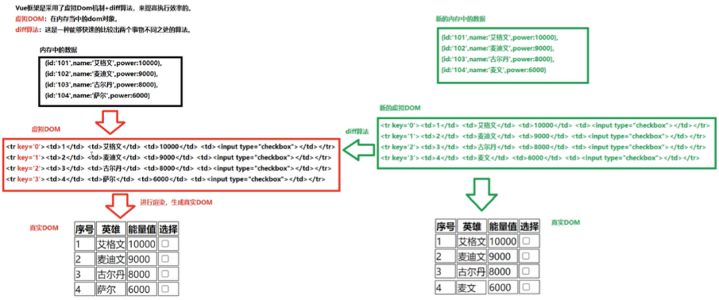
只有key不同时会创建一个新元素渲染这一列，其他的不同只会渲染不同的那一部分

- :key不设置时，即key为索引时缺点：
  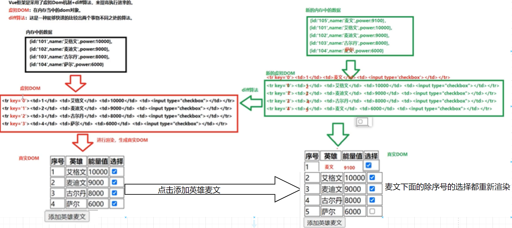
- 设置:key为主键，就不会出现错乱

```html
<!DOCTYPE html>
<html lang="en">
<head>
    <meta charset="UTF-8">
    <meta http-equiv="X-UA-Compatible" content="IE=edge">
    <meta name="viewport" content="width=device-width, initial-scale=1.0">
    <title>虚拟dom与diff算法</title>
    <script src="../js/vue.js"></script>
    <style>
        th,td{border: 1px solid black;}
    </style>
</head>
<body>
    <div id="app">
        <h1>{{msg}}</h1>
        <table>
            <tr>
                <th>序号</th>
                <th>英雄</th>
                <th>能量值</th>
                <th>选择</th>
            </tr>
            <!-- 
                v-for指令所在的标签中，还有一个非常重要的属性：
                    :key
                如果没有指定 :key 属性，会自动拿index作为key。
                这个key是这个dom元素的身份证号/唯一标识。

                分析以下：采用 index 作为key存在什么问题？
                    第一个问题：效率低。
                    第二个问题：非常严重了。产生了错乱。尤其是对数组当中的某些元素进行操作。（非末尾元素。）
                怎么解决这个问题？
                    建议使用对象的id作为key
             -->
            <tr v-for="(hero,index) in heros" :key="hero.id">
                <td>{{index+1}}</td>
                <td>{{hero.name}}</td>
                <td>{{hero.power}}</td>
                <td><input type="checkbox"></td>
            </tr>
        </table>

        <button @click="add">添加英雄麦文</button>
    </div>
    <script>
        const vm = new Vue({
            el : '#app',
            data : {
                msg : '虚拟dom与diff算法',
                heros : [
                    {id:'101',name:'艾格文',power:10000},
                    {id:'102',name:'麦迪文',power:9000},
                    {id:'103',name:'古尔丹',power:8000},
                    {id:'104',name:'萨尔',power:6000}
                ]
            },
            methods : {
                add(){
                    this.heros.unshift({id:'105',name:'麦文',power:9100})
                }
            }
        })
    </script>
</body>
</html>
```

### 2.24 列表及表单案例

#### 2.24-1 列表过滤-监听属性

```html
<!DOCTYPE html>
<html lang="en">
<head>
    <meta charset="UTF-8">
    <meta http-equiv="X-UA-Compatible" content="IE=edge">
    <meta name="viewport" content="width=device-width, initial-scale=1.0">
    <title>列表过滤监听属性</title>
    <script src="../js/vue.js"></script>
    <style>
        th,td{border: 1px solid black;}
    </style>
</head>
<body>
    <div id="app">
        <h1>{{msg}}</h1>
        <input type="text" placeholder="请输入搜索关键字" v-model="keyword">
        <table>
            <tr>
                <th>序号</th>
                <th>英雄</th>
                <th>能量值</th>
                <th>选择</th>
            </tr>
            <tr v-for="(hero,index) in filteredHeros" :key="hero.id">
                <td>{{index+1}}</td>
                <td>{{hero.name}}</td>
                <td>{{hero.power}}</td>
                <td><input type="checkbox"></td>
            </tr>
        </table>
    </div>
    <script>
        const vm = new Vue({
            el : '#app',
            data : {
                keyword : '',
                msg : '列表过滤',
                heros : [
                    {id:'101',name:'艾格文',power:10000},
                    {id:'102',name:'麦迪文',power:9000},
                    {id:'103',name:'古尔丹',power:8000},
                    {id:'104',name:'萨尔',power:6000}
                ], 
                filteredHeros : []
            },
            watch : {
                /* keyword(val){
                    // 执行过滤规则
                    this.filteredHeros = this.heros.filter((hero) => {
                        return hero.name.indexOf(val) >= 0
                    })
                } */
                
                keyword : {//搜索的关键字
                    immediate : true,//刚打开就调用一次heanler(var)
                    handler(val){//var就是用户输进去的搜索关键字
                        this.filteredHeros = this.heros.filter((hero) => {
                            //return过滤规则
                            return hero.name.indexOf(val) >= 0
                        })
                    }
                }
            }
        })

        // 回顾filter
        let arr = [1,2,3,4,5,6,7,8,9]

        // filter不会破坏原数组的结构，会生成一个全新的数组。
        let newArr = arr.filter((num) => {
            //return 过滤规则
            return num < 5
        })

        console.log(newArr)
    </script>
</body>
</html>
```

#### 2.24-2 列表过滤-计算属性

- 推荐使用这个

```html
<!DOCTYPE html>
<html lang="en">
<head>
    <meta charset="UTF-8">
    <meta http-equiv="X-UA-Compatible" content="IE=edge">
    <meta name="viewport" content="width=device-width, initial-scale=1.0">
    <title>列表过滤计算属性实现</title>
    <script src="../js/vue.js"></script>
    <style>
        th,td{border: 1px solid black;}
    </style>
</head>
<body>
    <div id="app">
        <h1>{{msg}}</h1>
        <input type="text" placeholder="请输入搜索关键字" v-model="keyword">
        <table>
            <tr>
                <th>序号</th>
                <th>英雄</th>
                <th>能量值</th>
                <th>选择</th>
            </tr>
            <tr v-for="(hero,index) in filteredHeros" :key="hero.id">
                <td>{{index+1}}</td>
                <td>{{hero.name}}</td>
                <td>{{hero.power}}</td>
                <td><input type="checkbox"></td>
            </tr>
        </table>
    </div>
    <script>
        const vm = new Vue({
            el : '#app',
            data : {
                keyword : '',
                msg : '列表过滤',
                heros : [
                    {id:'101',name:'艾格文',power:10000},
                    {id:'102',name:'麦迪文',power:9000},
                    {id:'103',name:'古尔丹',power:8000},
                    {id:'104',name:'萨尔',power:6000}
                ]
            },
            computed : {
                filteredHeros(){
                    // 执行过滤
                    return this.heros.filter((hero) => {
                        return hero.name.indexOf(this.keyword) >= 0
                    })
                }
            }
        })
    </script>
</body>
</html>
```

#### 2.24-3 列表排序

```html
<!DOCTYPE html>
<html lang="en">
<head>
    <meta charset="UTF-8">
    <meta http-equiv="X-UA-Compatible" content="IE=edge">
    <meta name="viewport" content="width=device-width, initial-scale=1.0">
    <title>列表排序</title>
    <script src="../js/vue.js"></script>
    <style>
        th,td{border: 1px solid black;}
    </style>
</head>
<body>
    <div id="app">
        <h1>{{msg}}</h1>
        <input type="text" placeholder="请输入搜索关键字" v-model="keyword">
        <br>
        <button @click="type = 1">升序</button>
        <button @click="type = 2">降序</button>
        <button @click="type = 0">原序</button>
        <table>
            <tr>
                <th>序号</th>
                <th>英雄</th>
                <th>能量值</th>
                <th>选择</th>
            </tr>
            <tr v-for="(hero,index) in filteredHeros" :key="hero.id">
                <td>{{index+1}}</td>
                <td>{{hero.name}}</td>
                <td>{{hero.power}}</td>
                <td><input type="checkbox"></td>
            </tr>
        </table>
    </div>
    <script>
        const vm = new Vue({
            el : '#app',
            data : {
                type : 0,
                keyword : '',
                msg : '列表排序',
                heros : [
                    {id:'101',name:'艾格文',power:10000},
                    {id:'102',name:'麦迪文',power:9000},
                    {id:'103',name:'古尔丹',power:8000},
                    {id:'104',name:'萨尔',power:11000}
                ]
            },
            computed : {
                filteredHeros(){
                    // 执行过滤
                    const arr = this.heros.filter((hero) => {
                        return hero.name.indexOf(this.keyword) >= 0
                    })
                    // 排序
                    if(this.type === 1){
                        arr.sort((a, b) => {
                            return a.power - b.power
                        })
                    }else if(this.type == 2){
                        arr.sort((a, b) => {
                            return b.power - a.power
                        })
                    }
                    
                    // 返回
                    return arr
                }
            }
        })

        // 回顾sort方法
        let arr = [8,9,5,4,1,2,3]

        // sort方法排序之后，不会生成一个新的数组，是在原数组的基础之上进行排序，会影响原数组的结构。
        // 参数a和b是数组中的元素
        arr.sort((a, b) => {
            return b - a
        })

        console.log(arr)
    </script>
</body>
</html>
```

#### 2.24-4 表单数据收集

```html
<!DOCTYPE html>
<html lang="en">
<head>
    <meta charset="UTF-8">
    <meta http-equiv="X-UA-Compatible" content="IE=edge">
    <meta name="viewport" content="width=device-width, initial-scale=1.0">
    <title>表单数据的收集</title>
    <script src="../js/vue.js"></script>
</head>
<body>
    <div id="app">
        <h1>{{msg}}</h1>
        <!-- @submit.prevent="send"阻止表单提交的默认行为(我们用ajax发请求) -->
        <form @submit.prevent="send">
            用户名：<input type="text" v-model.trim="user.username"><br><br><!-- v-model.trim可以将收集到的字符串去除前后空格-->
            密码：<input type="password" v-model="user.password"><br><br>
            年龄：<input type="number" v-model.number="user.age"><br><br><!-- v-model.number可以将收集到的字符串转为number-->
            性别：
                男<input type="radio" name="gender" value="1" v-model="user.gender">
                女<input type="radio" name="gender" value="0" v-model="user.gender"><br><br>
            爱好：
            <!-- 注意：对于checkbox来说，如果没有手动指定value，那么会拿这个标签的checked属性的值作为value -->
                旅游<input type="checkbox" v-model="user.interest" value="travel">
                运动<input type="checkbox" v-model="user.interest" value="sport">
                唱歌<input type="checkbox" v-model="user.interest" value="sing"><br><br>
            学历：
                <select v-model="user.grade">
                    <option value="">请选择学历</option>
                    <option value="zk">专科</option>
                    <option value="bk">本科</option>
                    <option value="ss">硕士</option>
                </select><br><br>
            简介：
            <!-- v-model.lazy：不加时文本域内输入一个字母执行一次双向绑定，加上后光标离开才双向绑定 -->
                <textarea cols="50" rows="15" v-model.lazy="user.introduce"></textarea><br><br>
            <input type="checkbox" v-model="user.accept">阅读并接受协议<br><br>
            <!-- <button @click.prevent="send">注册</button>阻止表单提交的默认行为(我们用ajax发请求) -->
            <button>注册</button>
        </form>
    </div>
    <script>
        const vm = new Vue({
            el : '#app',
            data : {
                user : {
                    username : '',
                    password : '',
                    age : '',
                    gender : '1',
                    interest : ['travel'],
                    grade : 'ss',
                    introduce : '',
                    accept : ''
                },
                msg : '表单数据的收集'
            },
            methods : {
                send(){
                    alert('ajax...!!!!')
                    // 将数据收集好，发送给服务器。
                    //console.log(JSON.stringify(this.$data))
                    console.log(JSON.stringify(this.user))
                }
            }
        })
    </script>
</body>
</html>
```

### 2.25 过滤器-`filters`

```html
<!DOCTYPE html>
<html lang="en">
<head>
    <meta charset="UTF-8">
    <meta http-equiv="X-UA-Compatible" content="IE=edge">
    <meta name="viewport" content="width=device-width, initial-scale=1.0">
    <title>过滤器</title>
    <script src="../js/vue.js"></script>
</head>
<body>
    <!-- 
        需求：
            从服务器端返回了一个商品的价格price，这个price的值可能是这几种情况：''、null、undefined、60.5
            要求：
                如果是''、null、undefined ，页面上统一显示为 - 
                如果不是 ''、null、undefined，则页面上显示真实的数字即可。 
            过滤器只能用在两个地方
                插值语法和v-bind中
        在Vue3当中，已经将过滤器语法废弃了。
     -->
    <div id="app">
        <h1>{{msg}}</h1>
        <h2>商品价格：{{formatPrice}}</h2>
        <h2>商品价格：{{formatPrice2()}}</h2>
        <h2>商品价格：{{price | filterA | filterB(2)}}</h2><!-- 将price这个参数通过管道的方式传给过滤器filterA然后再传给过滤器filterB 参数为保留的小数个数 -->
        <input type="text" :value="price | filterA | filterB(3)">
        <!-- <input type="text" v-model="price | filterA | filterB(3)">  报错-->

    </div>

    <hr>

    <div id="app2">
        <h2>商品价格：{{price | filterA | filterB(3)}}</h2>
    </div>

    <script>

        // 配置全局的过滤器。
        Vue.filter('filterA', function(val){
            if(val === null || val === undefined || val === ''){
                return '-'
            }
            return val
        })

        Vue.filter('filterB', function(val, number){
            return val.toFixed(number)
        })

        const vm2 = new Vue({
            el : '#app2',
            data : {
                price : 20.3
            }
        })

        const vm = new Vue({
            el : '#app',
            data : {
                msg : '过滤器',
                price : 50.6
            },
            methods: {
                formatPrice2(){
                    if(this.price === '' || this.price === undefined || this.price === null){
                        return '-'
                    }
                    return this.price
                }
            },
            computed : {//计算属性
                formatPrice(){
                    if(this.price === '' || this.price === undefined || this.price === null){
                        return '-'
                    }
                    return this.price
                }
            },
      /*       filters : {//再Vue3已经废弃了过滤器
                // 局部过滤器，只在当前vue中可以用
                filterA(val){//定义一个过滤器叫filterA
                    if(val === null || val === undefined || val === ''){
                        return '-'
                    }
                    return val
                },
                filterB(val, number){//过滤器传参，第一个参数是管道符传来的参数，不用自己写，第二个参数要写
                    // 确保传递过来的数据val，保留number位小数。
                    return val.toFixed(number)
                }
            } */
        })
    </script>
</body>
</html>
```

### 2.26 Vue的其他指令

#### 2.26-1 `v-text` 

将内容**填充到标签体**当中，并且是以**覆盖**的形式填充，而且填充的内容中即使存在 HTML 标签也只是会**当做一个普通的字符串**处理，不会解析。功能等同于原生 JS 中的 innerText。

- 总结：不如{{}}

```html
<!DOCTYPE html>
<html lang="en">
<head>
    <meta charset="UTF-8">
    <meta http-equiv="X-UA-Compatible" content="IE=edge">
    <meta name="viewport" content="width=device-width, initial-scale=1.0">
    <title>Vue的其它指令</title>
    <script src="../js/vue.js"></script>
</head>
<body>
    <div id="app">
        <h1>{{msg}},test</h1>
        <!-- 
            v-text指令：
                可以将指令的内容拿出来填充到标签体当中。和JS的innerText一样。
                这种填充是以覆盖的形式进行的。先清空标签体当中原有的内容，填充新的内容。
                即使内容是一段HTML代码，这种方式也不会将HTML代码解析并执行。只会当做普通文本来处理。
         -->
        <h1 v-text="msg">test</h1>
        <h1 v-text="name">test</h1>
        <h1 v-text="s1"></h1>

        <!-- 
            v-html指令：
                和v-text一样，也是填充标签体内容。也是采用覆盖的形式进行。
                只不过v-html会将内容当做一段HTML代码解析并执行。
         -->
         <h1 v-html="s1"></h1>
    </div>
    <script>
        const vm = new Vue({
            el : '#app',
            data : {
                msg : 'Vue的其它指令',
                name : 'jack',
                s1 : '<h1>欢迎大家学习Vue！</h1>'
            }
        })
    </script>
</body>
</html>
```

#### 2.26-2` v-html`

将内容填充到标签体当中，并且是**以覆盖的形式填充**，而且将**填充的内容当做 HTML 代码解析**。功能等同于原生 JS 中的 innerHTML。 
v-html 不要用到用户提交的内容上。可能会导致 XSS 攻击。XSS 攻击通常指的是通过利用网页开发时留下的漏洞，通过巧妙的方法注入恶意指令代码到网页，使用户加载并执行攻击者恶意制造的网页程序。这些恶意网页程序通常是 JavaScript。

留言案例:(含XSS攻击)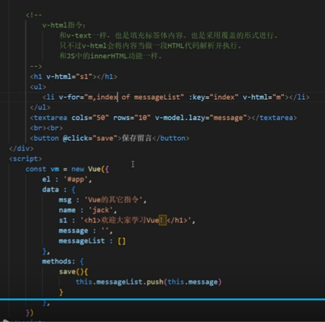
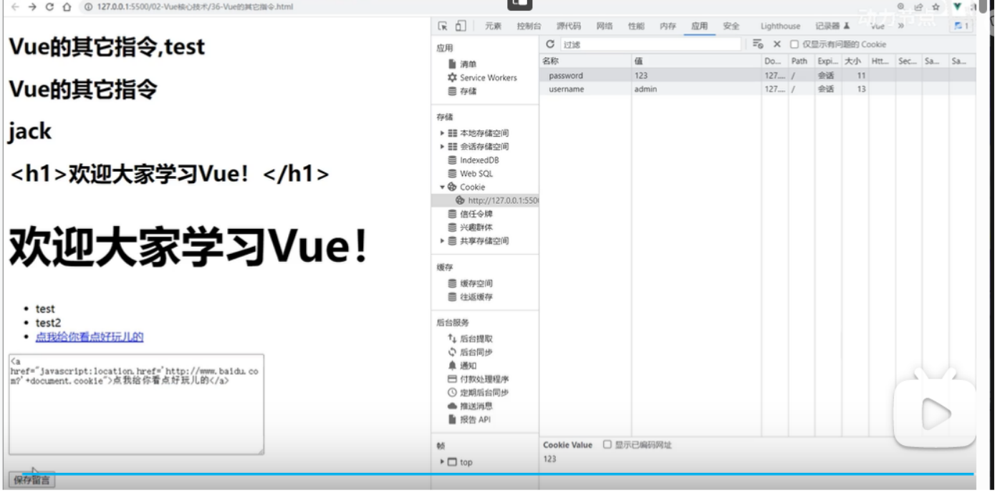

#### 2.26-3 `v-clock` 解决胡子问题

- v-cloak 配置 css 样式来**解决胡子的闪现**问题。 

- v-cloak 指令使用在标签当中，当 Vue 实例接管之后会删除这个指令。 

- 这是一段 CSS 样式：当前页面中所有带有 v-cloak 属性的标签都隐藏起来。 当vue执行vue.js文件时再把这段代码干掉，渲染出来真实的数据
  ```css
  [v-cloak] { 
  	display : none; 
  }
  ```

```html
<!DOCTYPE html>
<html lang="en">
<head>
    <meta charset="UTF-8">
    <meta http-equiv="X-UA-Compatible" content="IE=edge">
    <meta name="viewport" content="width=device-width, initial-scale=1.0">
    <!--如果不加v-clock页面会展示“{{msg}}”这个字符串，加载完vue.js文件并有{{msg}}的参数时会渲染-->
    <!--加v-clock页面会将“{{msg}}”的标签隐藏(v-clock指定的css代码)，加载完vue.js文件并有{{msg}}的参数时会渲染,并移除v-clock的css代码-->
    <title>Vue的其它指令</title>
    <style>
        [v-cloak] {
            display: none;
        }
    </style>
</head>
<body>
    <div id="app">
        <h1 v-cloak>{{msg}}</h1>
    </div>

    <script>
        setTimeout(() => {
            let scriptElt = document.createElement('script')
            scriptElt.src = '../js/vue.js'
            document.head.append(scriptElt)
        }, 3000)//三秒后加载vue.js文件

        setTimeout(() => {
            const vm = new Vue({
                el : '#app',
                data : {
                    msg : 'Vue的其它指令'
                }
            })
        }, 4000)//四秒后创建vue实例
    </script>
</body>
</html>
```

#### 2.11.4 v-once

初次接触指令的时候已经学过了。**只渲染一次。之后将被视为静态内容**。 

```html
<!DOCTYPE html>
<html lang="en">
<head>
    <meta charset="UTF-8">
    <meta http-equiv="X-UA-Compatible" content="IE=edge">
    <meta name="viewport" content="width=device-width, initial-scale=1.0">
    <title>Vue的其它指令</title>
    <script src="../js/vue.js"></script>
</head>
<body>
    <div id="app">
        <ul>
            <li v-for="user,index of users" :key="index" v-once>
                {{user}}
            </li>
        </ul>

        <ul>
            <li v-for="user,index of users" :key="index">
                {{user}}
            </li>
        </ul>
    </div>

    <script>
        const vm = new Vue({
            el : '#app',
            data : {
                msg : 'Vue的其它指令',
                users : ['jack', 'lucy', 'james']
            }
        })
    </script>
</body>
</html>
```

#### 2.11.5 v-pre

使用该指令可以提高编译速度。**带有该指令的标签将不会被编译**。可以在没有 Vue 语法规则的标签中使用**可以提高效率**。**不要将它用在带有指令语法以及插值语法的标签中。** 

```html
<!DOCTYPE html>
<html lang="en">
<head>
    <meta charset="UTF-8">
    <meta http-equiv="X-UA-Compatible" content="IE=edge">
    <meta name="viewport" content="width=device-width, initial-scale=1.0">
    <title>Vue的其它指令</title>
    <script src="../js/vue.js"></script>
</head>
<body>
    <div id="app">
        <h1 v-cloak>{{msg}}</h1>
        <h1 v-pre>欢迎学习Vue框架！</h1>
        <h1 v-pre>{{msg}}</h1><!-- 这里不要用v-pre他不会编译，就成为了{{msg}}字符串 -->

    <script>
        const vm = new Vue({
            el : '#app',
            data : {
                msg : 'Vue的其它指令',
            }
        })
    </script>
</body>
</html>
```

### 2.27 Vue的自定义指令-`directives`

```html
<!DOCTYPE html>
<html lang="en">
<head>
    <meta charset="UTF-8">
    <meta http-equiv="X-UA-Compatible" content="IE=edge">
    <meta name="viewport" content="width=device-width, initial-scale=1.0">
    <title>自定义指令</title>
    <script src="../js/vue.js"></script>
</head>
<body>
    <div id="app">
        <h1>自定义指令</h1>
        <div v-text="msg"></div>
        <div v-text-danger="msg"></div>
        用户名：<input type="text" v-bind:value="username">
        <!-- 
            需要一个指令，可以和v-bind指令完成相同的<!DOCTYPE html>
<html lang="en">
<head>
    <meta charset="UTF-8">
    <meta http-equiv="X-UA-Compatible" content="IE=edge">
    <meta name="viewport" content="width=device-width, initial-scale=1.0">
    <title>自定义指令</title>
    <script src="../js/vue.js"></script>
</head>
<body>
    <div id="app">
        <h1>自定义指令</h1>
        <div v-text="msg"></div>
        <div v-text-danger="msg"></div>
        用户名：<input type="text" v-bind:value="username">
        <!-- 
            需要一个指令，可以和v-bind指令完成相同的功能，同时将该元素的父级元素的背景色设置为蓝色。
         -->
        <div>
            用户名：<input type="text" v-bind-blue="username">
        </div>
    </div>

    <div id="app2">
        <div v-text-danger="msg"></div>
        <div>
            用户名：<input type="text" v-bind-blue="username">
        </div>
    </div>

    <script>
        // 定义全局的指令
        // 函数式自定义指令
        Vue.directive('text-danger', function(element, binding){
            //对于自定义指令来说，函数体当中的this是window，而不是vue实例。
            console.log(this)
            element.innerText = binding.value
            element.style.color = 'red'
        })

        // 定义全局的指令
        // 对象式自定义指令
        Vue.directive('bind-blue', {
            bind(element, binding){
                element.value = binding.value
                console.log(this)
            },
            inserted(element, binding){
                element.parentNode.style.backgroundColor = 'skyblue'
                console.log(this)
            },
            update(element, binding){
                element.value = binding.value
                console.log(this)
            }
        })

        const vm2 = new Vue({
            el : '#app2',
            data : {
                msg : '欢迎学习Vue框架！',
                username : 'lucy'
            }
        })

        const vm = new Vue({
            el : '#app',
            data : {
                msg : '自定义指令',
                username : 'jackson'
            },
            directives : {//局部自定义指令
                // 指令1
                // 指令2
                // ...
                // 关于指令的名字：1. v- 不需要写。 2. Vue官方建议指令的名字要全部小写。如果是多个单词的话，请使用 - 进行衔接。
                // 这个回调函数有两个参数：第一个参数是真实的dom元素。 第二个参数是标签与指令之间绑定关系的对象。

                // 这个回调函数的执行时机包括两个：第一个：标签和指令第一次绑定的时候。第二个：模板被重新解析的时候。
                // 函数式自定义指令
                /* 'text-danger' : function(element, binding){
                    console.log('@')
                    element.innerText = binding.value
                    element.style.color = 'red'
                }, */
                /* 'bind-blue' : function(element, binding){
                    element.value = binding.value
                    console.log(element)
                    // 为什么是null，原因是这个函数在执行的时候，指令和元素完成了绑定，但是只是在内存当中完成了绑定，元素还没有被插入到页面当中。
                    console.log(element.parentNode)//null
                    element.parentNode.style.backgroundColor = 'blue'//报错
                }, */

                // 局部对象式自定义指令 更加细致
                /* 'bind-blue' : {
                    // 这个对象中三个方法的名字不能随便写。
                    // 这三个函数将来都会被自动调用。
                    // 注意：在特定的时间节点调用特定的函数，这种被调用的函数称为钩子函数。

                    // 元素与指令初次绑定的时候，自动调用bind
                    bind(element, binding){
                        element.value = binding.value
                    },
                    // 元素被插入到页面之后，这个函数自动被调用。
                    inserted(element, binding){
                        element.parentNode.style.backgroundColor = 'blue'
                    },
                    // 当模板重新解析的时候，这个函数会被自动调用。
                    update(element, binding){
                        element.value = binding.value
                    }
                } */
            }
        })
    </script>
</body>
</html>功能，同时将该元素的父级元素的背景色设置为蓝色。
         -->
        <div>
            用户名：<input type="text" v-bind-blue="username">
        </div>
    </div>

    <div id="app2">
        <div v-text-danger="msg"></div>
        <div>
            用户名：<input type="text" v-bind-blue="username">
        </div>
    </div>

    <script>
        // 定义全局的指令
        // 函数式自定义指令
        Vue.directive('text-danger', function(element, binding){
            //对于自定义指令来说，函数体当中的this是window，而不是vue实例。
            console.log(this)
            element.innerText = binding.value
            element.style.color = 'red'
        })

        // 定义全局的指令
        // 对象式自定义指令
        Vue.directive('bind-blue', {
            bind(element, binding){
                element.value = binding.value
                console.log(this)
            },
            inserted(element, binding){
                element.parentNode.style.backgroundColor = 'skyblue'
                console.log(this)
            },
            update(element, binding){
                element.value = binding.value
                console.log(this)
            }
        })

        const vm2 = new Vue({
            el : '#app2',
            data : {
                msg : '欢迎学习Vue框架！',
                username : 'lucy'
            }
        })

        const vm = new Vue({
            el : '#app',
            data : {
                msg : '自定义指令',
                username : 'jackson'
            },
            directives : {//自定义指令
                // 指令1
                // 指令2
                // ...
                // 关于指令的名字：1. v- 不需要写。 2. Vue官方建议指令的名字要全部小写。如果是多个单词的话，请使用 - 进行衔接。
                // 这个回调函数的执行时机包括两个：第一个：标签和指令第一次绑定的时候。第二个：模板被重新解析的时候。
                // 这个回调函数有两个参数：第一个参数是真实的dom元素。 第二个参数是标签与指令之间绑定关系的对象。

                // 函数式自定义指令
                /* 'text-danger' : function(element, binding){
                    console.log('@')
                    element.innerText = binding.value
                    element.style.color = 'red'
                }, */
                /* 'bind-blue' : function(element, binding){
                    element.value = binding.value
                    console.log(element)
                    // 为什么是null，原因是这个函数在执行的时候，指令和元素完成了绑定，但是只是在内存当中完成了绑定，元素还没有被插入到页面当中。
                    console.log(element.parentNode)
                    element.parentNode.style.backgroundColor = 'blue'
                }, */

                // 对象式自定义指令 更加细致
                /* 'bind-blue' : {
                    // 这个对象中三个方法的名字不能随便写。
                    // 这三个函数将来都会被自动调用。
                    // 元素与指令初次绑定的时候，自动调用bind

                    // 注意：在特定的时间节点调用特定的函数，这种被调用的函数称为钩子函数。
                    bind(element, binding){
                        element.value = binding.value
                    },
                    // 元素被插入到页面之后，这个函数自动被调用。
                    inserted(element, binding){
                        element.parentNode.style.backgroundColor = 'blue'
                    },
                    // 当模板重新解析的时候，这个函数会被自动调用。
                    update(element, binding){
                        element.value = binding.value
                    }
                } */
            }
        })
    </script>
</body>
</html>
```

### 2.28 响应式与数据劫持

- 什么是**响应式**？
  修改 data 后，页面自动改变/刷新。这就是响应式。就像我们在使用 excel 的时候，修改一个单元格中的数据，
  其它单元格的数据会联动更新，这也是响应式。
- Vue 的响应式是如何实现的？
  **数据劫持**：Vue 底层使用了 Object.defineProperty，配置了 setter 方法，当去修改属性值时 setter 方法则被自
  动调用，setter 方法中不仅修改了属性值，而且还做了其他的事情，例如：重新渲染页面。setter 方法就像半路劫
  持一样，所以称为数据劫持。
- Vue 会给 data 中所有的属性，以及属性中的属性，都会添加响应式。
- 后期添加的属性，不会有响应式，怎么处理？
  `Vue.set(目标对象, ‘属性名’, 值)`
  `vm.$set(目标对象, ‘属性名’, 值)`
- Vue 没有给数组下标 0,1,2,3....添加响应式，怎么处理？
  - 调用 Vue 提供的 7 个 API：
    `push()`
    `pop()`
    `reverse()`
    `splice()`
    `shift()`
    `unshift()`
    `sort()`
  - 或者使用：
    `Vue.set(数组对象, ‘index’, 值)`
    `vm.$set(数组对象, ‘index’, 值)`

`myvue.js`

```js
// 定义一个Vue类
class Vue {
    // 定义构造函数
    // options是一个简单的纯粹的JS对象：{}
    // options对象中有一个data配置项
    constructor(options){
        // 获取所有的属性名
        Object.keys(options.data).forEach((propertyName, index) => {
            //console.log(typeof propertyName, propertyName, index)
            let firstChar = propertyName.charAt(0)
            if(firstChar != '_' && firstChar != '$'){
                Object.defineProperty(this, propertyName, {
                    //数据代理
                    get(){
                        return options.data[propertyName]
                    },
                    //数据劫持
                    set(val){
                        //1. 修改内存中对象的属性值
                        options.data[propertyName] = val
                        //2. 重新渲染页面
                        console.log('页面上的真实DOM元素更新了！！！')

                    }
                })
            }
        })
        // 获取所有的方法名
        Object.keys(options.methods).forEach((methodName, index) => {
            // 给当前的Vue实例扩展一个方法
            this[methodName] = options.methods[methodName]
        })
    }
}

```

```html
<!DOCTYPE html>
<html lang="en">
<head>
    <meta charset="UTF-8">
    <meta http-equiv="X-UA-Compatible" content="IE=edge">
    <meta name="viewport" content="width=device-width, initial-scale=1.0">
    <title>响应式与数据劫持</title>
    <script src="../js/vue.js"></script>
</head>
<body>
    <div id="app">
        <h1>{{msg}}</h1>
        <div>姓名：{{name}}</div>
        <div>年龄：{{age}}岁</div>
        <div>数字：{{a.b.c.e}}</div>
        <div>邮箱：{{a.email}}</div>
    </div>
    <script>
        const vm = new Vue({
            el : '#app',
            data : {
                msg : '响应式与数据劫持',
                name : 'jackson',
                age : 20,
                a : {
                    b : {
                        c : {
                            e : 1
                        }
                    }
                }
            }
        })

        // 测试：后期给Vue实例动态的追加的一些属性，会添加响应式处理吗？
        // 目前来看，通过这种方式后期给vm追加的属性并没有添加响应式处理。
        //vm.$data.a.email = 'jack@126.com'

        // 如果你想给后期追加的属性添加响应式处理的话，调用以下两个方法都可以：
        // Vue.set() 、 vm.$set() 但是添加响应式时不能给根(vm data)添加响应式属性
        //Vue.set(目标对象, 属性名, 属性值)
        //Vue.set(vm.$data.a, 'email', 'jack@126.com')
        //Vue.set(vm.a, 'email', 'jack@123.com')
        vm.$set(vm.a, 'email', 'jack@456.com')

        // 避免在运行时向Vue实例或其根$data添加响应式
        // 不能直接给vm / vm.$data 追加响应式属性。只能在声明时提前定义好。
        //Vue.set(vm, 'x', '1')
        //Vue.set(vm.$data, 'x', '1')

    </script>
</body>
</html>
```

### 2.28 数组的响应式与数据劫持

```html
<!DOCTYPE html>
<html lang="en">
<head>
    <meta charset="UTF-8">
    <meta http-equiv="X-UA-Compatible" content="IE=edge">
    <meta name="viewport" content="width=device-width, initial-scale=1.0">
    <title>数组的响应式处理</title>
    <script src="../js/vue.js"></script>
</head>
<body>
    <!-- 
        1. 通过数组的下标去修改数组中的元素，默认情况下是没有添加响应式处理的。怎么解决？
        
        2. 第一种方案：
            vm.$set(数组对象, 下标, 值)
            Vue.set(数组对象, 下标, 值)

        3. 第二种方案：
            push()//向数组最后添加一个或多个元素，并返回新数组的长度。
            pop()//移除数组的最后一个元素，并返回该元素的值。
            reverse()//反转数组中的元素顺序。
            splice()//在数组中添加或删除元素。
               如果只传递了第一个参数 index，则会从该索引位置开始删除所有后续元素。
               如果只传递了第一个参数 index 和第二个参数 deleteCount，则会从该索引位置开始删除指定数量的元素。
               如果还传递了第三个参数 item1, item2, ...，则会在删除元素的位置添加这些元素。

                    示例：

                    let arr = [1, 2, 3, 4, 5];
                    // 从索引位置2开始删除2个元素，再添加两个元素
                    arr.splice(2, 2, 'a', 'b'); 
                    console.log(arr); // [1, 2, 'a', 'b', 5]

                    // 从索引位置1开始删除1个元素
                    arr.splice(1, 1); 
                    console.log(arr); // [1, 'a', 'b', 5]

                    // 从索引位置0开始删除所有元素
                    arr.splice(0); 
                    console.log(arr); // []
            shift()//移除数组的第一个元素，并返回该元素的值。
            unshift()//在数组的开头添加一个或多个元素，并返回新数组的长度。
            sort()//对数组中的元素进行排序。

            在Vue当中，通过以上的7个方法来给数组添加响应式处理。
     -->
    <div id="app">
        <h1>{{msg}}</h1>
        <ul>
            <li v-for="user in users">
                {{user}}
            </li>
        </ul>
        <ul>
            <li v-for="vip in vips" :key="vip.id">
                {{vip.name}}
            </li>
        </ul>
    </div>
    <script>
        const vm = new Vue({
            el : '#app',
            data : {
                msg : '数组的响应式处理',
                users : ['jack', 'lucy', 'james'],
                vips : [
                    {id:'111', name:'zhangsan'},
                    {id:'222', name:'lisi'}
                ]
            }
        })
    </script>
</body>
</html>
```

### 2.29 Vue 的生命周期

#### 2.29.1 Vue 生命周期

Vue 的生命周期指的是：vm 对象从创建到最终销毁的整个过程。

1. 虚拟 DOM 在内存中就绪时：去调用一个 a 函数
2. 虚拟 DOM 转换成真实 DOM 渲染到页面时：去调用一个 b 函数
3. Vue 的 data 发生改变时：去调用一个 c 函数
4. ...... 
5. Vue 实例被销毁时：去调用一个 x 函数

在生命线上的函数叫做**钩子函数**，这些函数是不需要程序员手动调用的，由 Vue 自动调用，程序员只需要按照自己的需求写上，到了那个时间点自动就会执行。

研究 Vue 的生命周期主要研究的核心是：在**哪个时刻**调用了**哪个钩子函数**

####  2.29.2 Vue 生命周期的 4 个阶段 8 个钩子

- Vue 的生命周期可以被划分为 4 个阶段：
  初始阶段、挂载阶段、更新阶段、销毁阶段(或许叫解绑阶段更好)。

- 每个阶段会调用两个钩子函数。

- 两个钩子函数名的特点：`beforeXxx()`、`xxxed()`。

- 8 个生命周期钩子函数分别是：

  | 阶段     | 时间   | 方法              |
  | -------- | ------ | ----------------- |
  | 初始阶段 | 创建前 | `beforeCreate()`  |
  | 初始阶段 | 创建后 | `created()`       |
  | 挂载阶段 | 挂载前 | `beforeMount()`   |
  | 挂载阶段 | 挂载后 | `mounted()`       |
  | 更新阶段 | 更新前 | `beforeUpdate() ` |
  | 更新阶段 | 更新后 | `updated()`       |
  | 销毁阶段 | 销毁前 | `beforeDestroy()` |
  | 销毁阶段 | 销毁后 | `destroyed() `    |

- 8 个钩子函数写在哪里？直接写在 Vue 构造函数的 options 对象当中。

- **初始阶段**做了这么几件事：

   1. 创建 Vue 实例 vm（此时 Vue 实例已经完成了创建，这是生命的起点）
   2. 初始化事件对象和生命周期（接产大夫正在给他洗澡）
   3. 调用 beforeCreate()钩子函数（此时还无法通过 vm 去访问 data 对象的属性）
   4. 初始化数据代理和数据监测
   5. 调用 created()钩子函数（此时数据代理和数据监测创建完毕，已经可以通过 vm 访问 data 对象的属性）
   6. 编译模板语句生成虚拟 DOM（此时虚拟 DOM 已经生成，但页面上还没有渲染）
      该阶段适合做什么？
      - `beforeCreate`：可以在此时加一些 loading 效果。
      - `created`：结束 loading 效果。也可以在此时发送一些网络请求，获取数据。也可以在这里添加定时器。
      - 等

- **挂载阶段**做了什么事儿
   做了这么几件事：

   1. 调用 `beforeMount()`钩子函数（此时页面还未渲染，真实 DOM 还未 生成）
   2. 给 vm 追加$el$ 属性，用它来代替”$el$”，$el $代表了真实的 DOM 元素（此时真实 DOM 生成，页面渲染完成）
   3. 调用 mounted()钩子函数
      该阶段适合做什么？
      - `mounted`：可以操作页面的 DOM 元素了。	

- 更新阶段做了什么事儿
   做了这么几件事：

   1. data 发生变化（这是该阶段开始的标志）
   2. 调用` beforeUpdate()`钩子函数（此时只是内存中的数据发生变化，页面还未更新）
   3. 虚拟 DOM 重新渲染和修补
   4. 调用 updated()钩子函数（此时页面已更新）
      该阶段适合做什么？
      - `beforeUpdate`：适合在更新之前访问现有的 DOM，比如手动移除已添加的事件监听器。
      - `updated`：页面更新后，如果想对数据做统一处理，可以在这里完成。

- 销毁阶段做了什么事儿
   做了这么几件事：

   1. `vm.$destroy()`方法被调用（这是该阶段开始的标志）
   2. 调用 `beforeDestroy()`钩子函数（此时 Vue 实例还在。虽然 vm 上的监视器、vm 上的子组件、vm 上的自定义事件监听器还在，但是它们都已经不能用了。此时修改 data 也不会重新渲染页面了）
   3. 卸载子组件和监视器、解绑自定义事件监听器
   4. 调用 destroyed()钩子函数（虽然 destroyed 翻译为已销毁，但此时 Vue 实例还在，空间并没有释放，只不过马上要释放了，这里的已销毁指的是 vm 对象上所有的东西都已经**解绑**完成了）
      该阶段适合做什么？
      - `beforeDestroy`：适合做销毁前的准备工作，和人临终前写遗嘱类似。例如：可以在这里清除定时器。

- Vue 官方的生命周期图：
  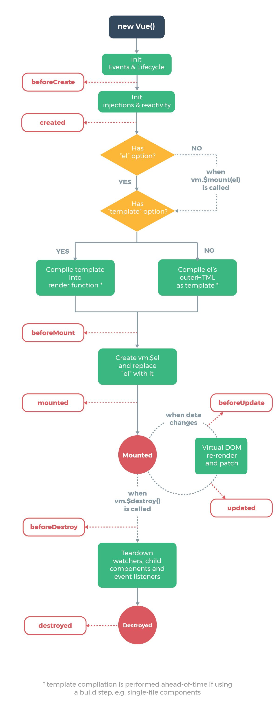

- 翻译后的生命周期图：
   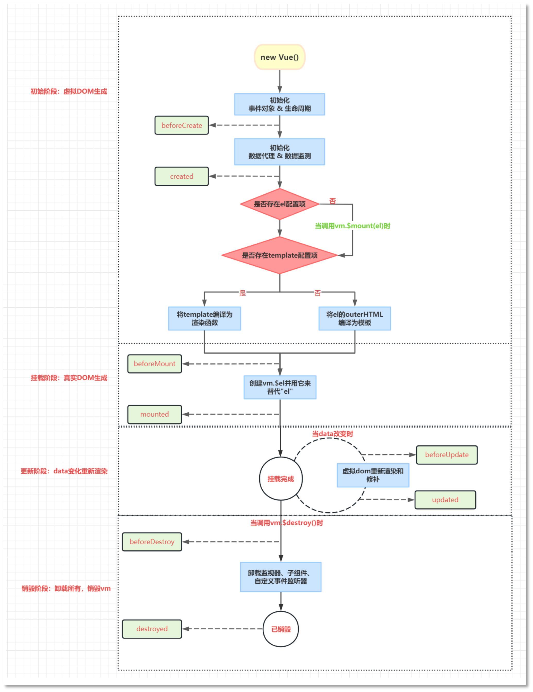

```html
<!DOCTYPE html>
<html lang="en">
<head>
    <meta charset="UTF-8">
    <meta http-equiv="X-UA-Compatible" content="IE=edge">
    <meta name="viewport" content="width=device-width, initial-scale=1.0">
    <title>Vue的生命周期</title>
    <script src="../js/vue.js"></script>
</head>
<body>
    <div id="app">
        <h1>{{msg}}</h1>
        <h3>计数器：{{counter}}</h3>
        <h3 v-text="counter"></h3>
        <button @click="add">点我加1</button>
        <button @click="destroy">点我销毁</button>
    </div>
    <script>
        const vm = new Vue({
            el : '#app',
            data : {
                msg : 'Vue生命周期',
                counter : 1
            },
            methods: {
                add(){
                    console.log('add....')
                    this.counter++
                },
                destroy(){
                    // 销毁vm
                    this.$destroy()
                },
                /* m(){
                    console.log('m....')
                } */
            },
            watch : {
                counter(){
                    console.log('counter被监视一次！')
                }
            },
            /*
            1.初始阶段
                el有，template也有，最终编译template模板语句。
                el有，template没有，最终编译el模板语句。
                el没有的时候，需要手动调用 vm.$mount(el) 进行手动挂载，然后流程才能继续。此时如果template有，最终编译template模板语句。
                el没有的时候，需要手动调用 vm.$mount(el) 进行手动挂载，然后流程才能继续。此时如果没有template，最终编译el模板语句。

                结论：
                    流程要想继续：el必须存在。
                    el和template同时存在，优先选择template。如果没有template，才会选择el。
            */
            beforeCreate() {
                // 创建前
                // 创建前指的是：数据代理和数据监测的创建前。
                // 此时还无法访问data当中的数据。包括methods也是无法访问的。
                console.log('beforeCreate', this.counter)
                // 调用methods报错了，不存在。
                //this.m()
            },
            created() {
                // 创建后
                // 创建后表示数据代理和数据监测创建完毕，可以访问data中的数据了。
                console.log('created', this.counter)
                // 可以访问methods了。
                //this.m()
            },
            // 2.挂载阶段
            beforeMount() {
                // 挂载前
                console.log('beforeMount')
            },
            mounted() {
                // 挂载后
                console.log('mounted')
                console.log(this.$el)
                console.log(this.$el instanceof HTMLElement)
            },
            // 3.更新阶段
            beforeUpdate() {
                // 更新前
                console.log('beforeUpdate')
            },
            updated() {
                // 更新后
                console.log('updated')
            },
            // 4.销毁阶段(或许叫解绑阶段更好) 销毁前后的方法用途差不多
            beforeDestroy() {
                // 销毁前
                console.log('beforeDestroy')
                console.log(this)
                this.counter = 1000//虽然仍与监听器处于绑定关系，但是监听器已不再工作 这个改动也不会重新渲染
            },
            destroyed() {
                // 销毁后 销毁后vm实例还在 只是把监视器、子组件、自定义事件监听器解绑了 并不释放vm内存空间
                //高版本的不只移除自定义的事件监听器，自带的事件监听器也会移除

                console.log('destroyed')
                console.log(this)
            },
        })
    </script>
</body>
</html>
```

## 3. Vue 组件化

### 3.1 什么是组件

传统方式开发的应用
一个网页通常包括三部分：结构（HTML）、样式（CSS）、交互（JavaScript）

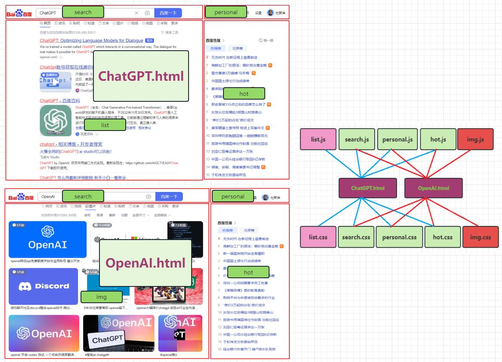

传统应用存在的问题：

1. 关系纵横交织，复杂，牵一发动全身，不利于维 护。
2. 代码虽然复用，但复用率不高。

---

组件化方式开发的应用

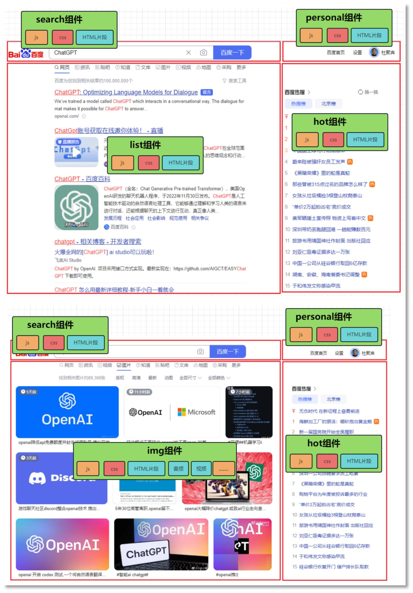

使用组件化方式开发解决了以上的两个问题：

1. 每一个组件都有独立的 js，独立的 css，这些独立的 js 和 css 只供当前组件使用，不存在纵横交错。更加便于维护。
2. 代码复用性增强。组件不仅让 js css 复用了，HTML 代码片段也复用了（因为要使用组件直接引入组件即可）。

什么是组件？

1. 组件：**实现应用中局部功能的代码和资源的集合**。凡是采用组件方式开发的应用都可以称为组件化应用。
2. 模块：一个大的 js 文件按照模块化拆分规则进行拆分，生成多个 js 文件，每一个 js 文件叫做模块。凡是采用模块方式开发的应用都可以称为模块化应用。
3. 任何一个组件中都可以包含这些资源：HTML CSS JS 图片 声音 视频等。从这个角度也可以说明组件是可以包括模块的。
4. 组件的划分粒度很重要，粒度太粗会影响复用性。为了让复用性更强，Vue 的组件也支持父子组件嵌套使用。

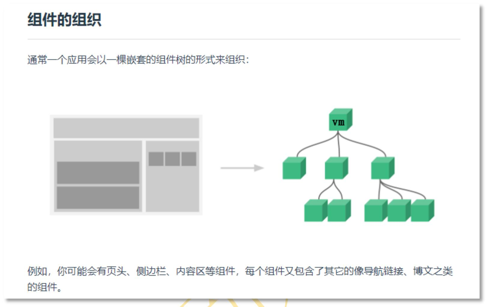

子组件由父组件来管理，父组件由父组件的父组件管理。在 Vue 中根组件就是 vm。因此每一个组件也是一个 Vue 实例

### 3.2 第一个组件

```html
<!DOCTYPE html>
<html lang="en">
<head>
    <meta charset="UTF-8">
    <meta http-equiv="X-UA-Compatible" content="IE=edge">
    <meta name="viewport" content="width=device-width, initial-scale=1.0">
    <title>第一个组件</title>
    <script src="../js/vue.js"></script>
</head>
<body>
    <!-- 
        组件的使用分为三步：
            第一步：创建组件
                Vue.extend({该配置项和new Vue的配置项几乎相同，略有差别})
                区别有哪些？
                    1. 创建Vue组件的时候，配置项中不能使用el配置项。（但是需要使用template配置项来配置模板语句。）
                    2. 配置项中的data不能使用直接对象的形式，必须使用function。
            第二步：注册组件
                局部注册：
                    在配置项当中使用components，语法格式：
                        components : {
                            组件的名字 : 组件对象
                        }
                全局注册：
                    Vue.component('组件的名字', 组件对象)
            第三步：使用组件
        
        小细节：
            1. 在Vue当中是可以使用自闭合标签的，但是前提必须在脚手架环境中使用。
            2. 在创建组件的时候Vue.extend()可以省略，但是底层实际上还是会调用的，在注册组件的时候会调用。
            3. 组件的名字
                第一种：全部小写
                第二种：首字母大写，后面都是小写
                第三种：kebab-case命名法（串式命名法。例如：user-login）
                第四种：CamelCase命名法（驼峰式命名法。例如：UserLogin），但是这种方式只允许在脚手架环境中使用。
                不要使用HTML内置的标签名作为组件的名字。
                在创建组件的时候，通过配置项配置一个name，这个name不是组件的名字，是设置Vue开发者工具中显示的组件的名字。
     -->
    <div id="app">
        <h1>{{msg}}</h1>
        <!-- 3. 使用组件 -->
        <userlogin></userlogin>
        <userlist></userlist>
        <userlist></userlist>
        <userlist></userlist>
        <userlogin></userlogin>

        <!-- <userlogin/> -->
    </div>

    <div id="app2">
        <userlogin></userlogin>
        <hello-world></hello-world>
        <!-- <form></form> -->
    </div>

    <script>

        /* // 创建组件
        const abc = {
            template : `<h1>测试组件的名字????</h1>`
        }

        // 全局注册组件
        Vue.component('HelloWorld', abc) */


        Vue.component('hello-world', {
            name : 'Xxxxx',
            template : `<h1>测试组件的名字%%%%%</h1>`
        })

        /* Vue.component('form', {
            template : `<h1>测试组件的名字%%%%%</h1>`
        }) */

        // 1.创建组件(结构HTML 交互JS 样式CSS)
        /* const myComponent = Vue.extend({
            template : `
            <ul>
                <li v-for="(user,index) of users" :key="user.id">
                    {{index}},{{user.name}}
                </li>
            </ul>
            `,
            data(){
                return {
                    users : [
                        {id:'001',name:'jack'},
                        {id:'002',name:'lucy'},
                        {id:'003',name:'james'}
                    ]
                }
            }
        }) */

        const myComponent = {
            template : `
            <ul>
                <li v-for="(user,index) of users" :key="user.id">
                    {{index}},{{user.name}}
                </li>
            </ul>
            `,
            data(){
                return {
                    users : [
                        {id:'001',name:'jack'},
                        {id:'002',name:'lucy'},
                        {id:'003',name:'james'}
                    ]
                }
            }
        }

        // 1. 创建组件
        /* const userLoginComponent = Vue.extend({
            template : `
            <div>
                <h3>用户登录</h3>
                <form @submit.prevent="login">
                    账号：<input type="text" v-model="username"> <br><br>
                    密码：<input type="password" v-model="password"> <br><br>
                    <button>登录</button>
                </form>
            </div>
            `,
            data(){
                return {
                    username : '',
                    password : ''
                }
            },
            methods: {
                login(){
                    alert(this.username + "," + this.password)
                }
            },
        }) */

        const userLoginComponent = {
            template : `
            <div>
                <h3>用户登录</h3>
                <form @submit.prevent="login">
                    账号：<input type="text" v-model="username"> <br><br>
                    密码：<input type="password" v-model="password"> <br><br>
                    <button>登录</button>
                </form>
            </div>
            `,
            data(){
                return {
                    username : '',
                    password : ''
                }
            },
            methods: {
                login(){
                    alert(this.username + "," + this.password)
                }
            },
        }

        // 全局注册
        Vue.component('userlogin', userLoginComponent)

        const vm2 = new Vue({
            el : '#app2'
        })

        // Vue实例
        const vm = new Vue({
            el : '#app',
            data : {
                msg : '第一个组件'
            },
            // 2. 注册组件（局部注册）
            components : {
                // userlist是组件的名字。myComponent只是一个变量名。
                userlist : myComponent,
                //userlogin : userLoginComponent
            }
        })

        /* let data = {
            counter : 1
        } */

        function data(){
            return {
                counter : 1
            }
        }

        let x = data();
        let y = data();

    </script>
</body>
</html>
```

### 3.3 组件的嵌套

```html
<!DOCTYPE html>
<html lang="en">
<head>
    <meta charset="UTF-8">
    <title>组件嵌套</title>
    <script src="../js/vue.js"></script>
</head>
<body>
    <div id="root"></div>
    <script>
        // 创建Y1组件
        const y1 = {
            template : `
                <div>
                    <h3>Y1组件</h3>
                </div>
            `
        }
        // 创建X1组件
        const x1 = {
            template : `
                <div>
                    <h3>X1组件</h3>
                </div>
            `
        }
        // 创建Y组件
        const y = {
            template : `
                <div>
                    <h2>Y组件</h2>
                    <y1></y1>
                </div>
            `,
            components : {y1 : y1}/* 可省略为y1 */
        }
        // 创建X组件
        const x = {
            template : `
                <div>
                    <h2>X组件</h2>
                    <x1></x1>
                </div>
            `,
            components : {x1}
        }
        // 创建app组件
        const app = {
            template : `
                <div>
                    <h1>App组件</h1>
                    <x></x>
                    <y></y>
                </div>
            `,
            // 注册X组件
            components : {x,y}
        }
        // vm
        const vm = new Vue({
            el : '#root',
            template : `
                <app></app>
            `,
            // 注册app组件
            components : {app}
        })
    </script>
</body>
</html>
```

### 3.4 VueComponent & Vue

#### 3.4.1 this

<iframe src="//player.bilibili.com/player.html?aid=226837727&bvid=BV17h41137i4&cid=1077694679&page=66&autoplay=false" scrolling="no" border="0" frameborder="no" framespacing="0" allowfullscreen="true" > </iframe>

`new Vue({})`配置项中的 `this `和` Vue.extend({})`配置项中的 `this `他们分别是谁？

```html
<!DOCTYPE html>
<html lang="en">
<head>
    <meta charset="UTF-8">
    <title>vm与vc</title>
    <script src="../js/vue.js"></script>
</head>
<body>
    <div id="app">
        <h1>{{msg}}</h1>
        <user></user>
        <user></user>
        <user></user>
    </div>
    <script>

        // 这个不是给Vue扩展counter属性。
        // 这个是给“Vue的原型对象”扩展一个counter属性。
        Vue.prototype.counter = 1000

        // 创建组件
        const user = Vue.extend({
            template : `
            <div>
                <h1>user组件</h1>
            </div>
            `,
            mounted(){/* 生命周期钩子函数 */
                // this是VueComponent实例
                // user是什么呢？？？？是一个全新的构造函数 VueComponent构造函数。
                //console.log('vc', this === user)
                // 为什么要这样设计？为了代码复用。
                // 底层实现原理：
                // VueComponent.prototype.__proto__ = Vue.prototype
                console.log('vc.counter', this.counter)
                // 这个访问不了，因为msg是vm实例上的属性。
                //console.log('vc.msg', this.msg)
            }
        })

        console.log('user.prototype.__proto__ === Vue.prototype' , user.prototype.__proto__ === Vue.prototype)

        console.log(user)

        // vm
        const vm = new Vue({
            el : '#app',
            data : {
                msg : 'vm与vc'
            },
            components : {/* 注册组件 */
                user
            },
            mounted() {
                // this是Vue实例
                console.log('vm', this)
            },
        })

        console.log('vm.counter', vm.counter)
        // 本质上是这样的：
        console.log('vm.counter', vm.__proto__.counter)

        /* function test(){
            var Sub = function User(){
                this.name = 'admin'
            }
            return Sub
        }

        let a = test()
        // 通过构造函数创建对象
        console.log(new a()) */

        /* console.log(a)
        let b = test()
        console.log(b)
        console.log(a === b) */

        // prototype __proto__
        // 构造函数（函数本身又是一种类型，代表Vip类型）
        function Vip(){}

        // Vip类型/Vip构造函数，有一个 prototype 属性。
        // 这个prototype属性可以称为：显式的原型属性。
        // 通过这个显式的原型属性可以获取：原型对象
        // 获取Vip的原型对象
        let x = Vip.prototype

        // 通过Vip可以创建实例
        let a = new Vip()
        /* let b = new Vip()
        let c = new Vip() */
        // 对于实例来说，都有一个隐式的原型属性: __proto__
        // 注意：显式的(建议程序员使用的)。隐式的（不建议程序员使用的。）
        // 这种方式也可以获取到Vip的原型对象
        let y = a.__proto__
        /* b.__proto__
        c.__proto__ */

        // 原型对象只有一个，其实原型对象都是共享的。
        console.log(x === y) // true

        // 这个不是给Vip扩展属性
        // 是在给“Vip的原型对象”扩展属性
        Vip.prototype.counter = 1000

        // 通过a实例可以访问这个扩展的counter属性吗？可以访问。为什么？原理是啥？
        // 访问原理：首先去a实例上找counter属性，如果a实例上没有counter属性的话，会沿着__proto__这个原型对象去找。
        // 下面代码看起来表面上是a上有一个counter属性，实际上不是a实例上的属性，是a实例对应的原型对象上的属性counter。
        console.log(a.counter)
        //console.log(a.__proto__.counter)
        

    </script>
</body>
</html>
```

测试结果
 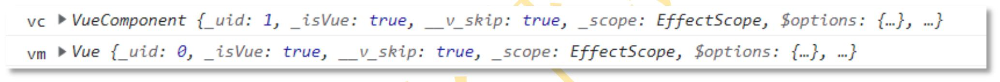

- new Vue({})配置项中的 this 就是：Vue 实例（vm）。
- Vue.extend({})配置项中的 this 就是：VueComponent 实例（vc）。

打开 vm 和 vc 你会发现，它们拥有大量相同的属性。例如：生命周期钩子、methods、watch 等。

可以这么说：**vm上有的vc不一定有，vc有的vm一定有(vm包含vc)**

#### 3.4.2 Vue.extend()方法做了什么？

每一次的 extend 调用返回的都是一个全新的 VueComponent 函数。
以下是 Vue.extend()的源码：

<audio id="audio" controls="" preload="none">
      <source id="mp3" src="../MDImg/vue/3.4-2eg.mp3">
</audio>

注意：是每一次都会返回一个全新的 VueComponent 构造函数。是全新的！！！
构造函数有了，什么时候会调用构造函数来实例化 VueComponent 对象呢？

```html
<div id="app">
    <mc></mc>
</div>
```

Vue 在解析`<mc></mc>`时会创建一个 VueComponent 实例，也就是：new VueComponent()

#### 3.4.3 通过 vc 可以访问 Vue 原型对象上的属性

<iframe src="//player.bilibili.com/player.html?aid=226837727&bvid=BV17h41137i4&cid=1077694679&page=66&autoplay=false" scrolling="no" border="0" frameborder="no" framespacing="0" allowfullscreen="true"> </iframe>

##### 3.4.3.1 回顾原型属性

```html
<!DOCTYPE html>
<html lang="en">
<head>
    <meta charset="UTF-8">
    <title>vm与vc</title>
    <script src="../js/vue.js"></script>
</head>
<body>
    <div id="app">
        <h1>{{msg}}</h1>
        <user></user>
        <user></user>
        <user></user>
    </div>
    <script>

        // 这个不是给Vue扩展counter属性。
        // 这个是给“Vue的原型对象”扩展一个counter属性。
        Vue.prototype.counter = 1000

        // 创建组件
        const user = Vue.extend({
            template : `
            <div>
                <h1>user组件</h1>
            </div>
            `,
            mounted(){/* 生命周期钩子函数 */
                // this是VueComponent实例
                // user是什么呢？？？？是一个全新的构造函数 VueComponent构造函数。
                //console.log('vc', this === user)
                // 为什么要这样设计？为了代码复用。
                // 底层实现原理：
                // VueComponent.prototype.__proto__ = Vue.prototype
                console.log('vc.counter', this.counter)
                // 这个访问不了，因为msg是vm实例上的属性。
                //console.log('vc.msg', this.msg)
            }
        })

        console.log('user.prototype.__proto__ === Vue.prototype' , user.prototype.__proto__ === Vue.prototype)

        console.log(user)

        // vm
        const vm = new Vue({
            el : '#app',
            data : {
                msg : 'vm与vc'
            },
            components : {/* 注册组件 */
                user
            },
            mounted() {
                // this是Vue实例
                console.log('vm', this)
            },
        })

        console.log('vm.counter', vm.counter)
        // 本质上是这样的：
        console.log('vm.counter', vm.__proto__.counter)

        /* function test(){
            var Sub = function User(){
                this.name = 'admin'
            }
            return Sub
        }

        let a = test()
        // 通过构造函数创建对象
        console.log(new a()) */

        /* console.log(a)
        let b = test()
        console.log(b)
        console.log(a === b) */

        // prototype __proto__
        // 构造函数（函数本身又是一种类型，代表Vip类型）
        function Vip(){}

        // Vip类型/Vip构造函数，有一个 prototype 属性。
        // 这个prototype属性可以称为：显式的原型属性。
        // 通过这个显式的原型属性可以获取：原型对象
        // 获取Vip的原型对象
        let x = Vip.prototype

        // 通过Vip可以创建实例
        let a = new Vip()
        /* let b = new Vip()
        let c = new Vip() */
        
        // 对于实例来说，都有一个隐式的原型属性: __proto__
        // 注意：显式的(建议程序员使用的)。隐式的（不建议程序员使用的。）
        // 这种方式也可以获取到Vip的原型对象
        let y = a.__proto__
        /* b.__proto__
        c.__proto__ */

        // 原型对象只有一个，其实原型对象都是共享的。
        console.log(x === y) // true

        // 这个不是给Vip扩展属性
        // 是在给“Vip的原型对象”扩展属性
        Vip.prototype.counter = 1000

        // 通过a实例可以访问这个扩展的counter属性吗？可以访问。为什么？原理是啥？
        // 访问原理：首先去a实例上找counter属性，如果a实例上没有counter属性的话，会沿着__proto__这个原型对象去找。
        // 下面代码看起来表面上是a上有一个counter属性，实际上不是a实例上的属性，是a实例对应的原型对象上的属性counter。
        console.log(a.counter)
        //console.log(a.__proto__.counter)
    </script>
</body>
</html>
```

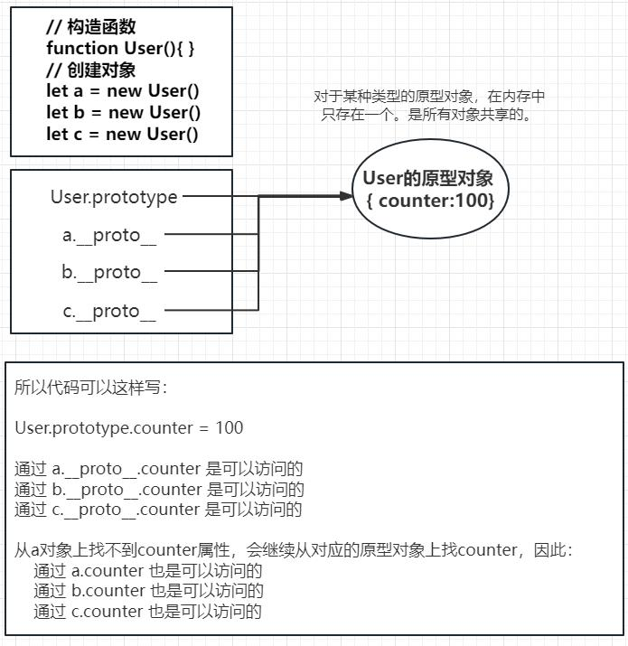

##### 3.4.3.2 原理剖析

VueComponent.prototype.__proto__ = Vue.prototype

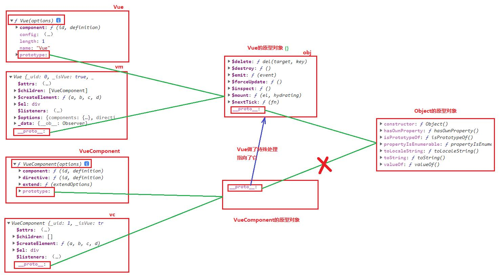

这样做的话，最终的结果就是：Vue、vm、VueComponent、vc 都共享了 Vue 的原型对象（并且这个 Vue 的原型对象只有一个）。

### 3.5 单文件组件

<iframe src="//player.bilibili.com/player.html?aid=226837727&bvid=BV17h41137i4&cid=1077691440&page=67&autoplay=false" scrolling="no" border="0" frameborder="no" framespacing="0" allowfullscreen="true"> </iframe>

1. 什么是单文件组件？
   - 一个文件对应一个组件（之前我们所学的是非单文件组件，一个 html 文件中定义了多个组件）
   - 单文件组件的名字通常是：`x.vue`，这是 Vue 框架规定的，只有 Vue 框架能够认识，浏览器无法直接打开运行。需要 Vue 框架进行编译，将 x.vue 最终编译为浏览器能识别的 html js css。
   - 单文件组件的文件名命名规范**和组件名的命名规范相同**：
     1. 全部小写：userlist
     2. 首字母大写，后面全部小写：Userlist
     3. kebab-case 命名法：user-list
     4. **CamelCase 命名法**：UserList（我们使用这种方式，和 Vue 开发者工具呼应。推荐使用）
2. x.vue 文件的内容包括三块：
   - 结构：`<template>HTML 代码</template>`
   - 交互：`<script>JS 代码</script>`
   - 样式：`<style>CSS 代码</style>`
3. export 和 import，ES6 的模块化语法。
   - 使用 export 导出（暴露）组件，在需要使用组件的 x.vue 文件中使用 import 导入组件
     1. 默认导入和导出
        1. export default {}
        2. import 任意名称 from ‘模块标识符’
     2.  按需导入和导出
        1. export {a, b}
        2. import {a, b} from ‘模块标识符’
     3.  分别导出
        export var name = ‘zhangsan’
        export function sayHi(){}

在`.vue`文件中写
```vue
<template></template>

<script></script>

<style></style>
```

---

`index.html`

```html
<!DOCTYPE html>
<html lang="en">
<head>
    <meta charset="UTF-8">
    <meta http-equiv="X-UA-Compatible" content="IE=edge">
    <meta name="viewport" content="width=device-width, initial-scale=1.0">
    <title>单文件组件</title>
</head>
<body>
    <div id="root"></div>
    <script src="../js/vue.js"></script>
    <script src="./main.js"></script>
</body>
</html>
```

`main.js`

```js

import App from './App.vue'

new Vue({
    el : '#root',
    // 使用组件
    template : `<App></App>`,
    // 注册App组件
    components : {App}
})
```


`App.vue`

```vue
<template>
    <div>
        <h1>App组件</h1>
        <!-- 使用组件 -->
        <X></X>
        <Y></Y>
    </div>
</template>

<script>
    import X from './X.vue'
    import Y from './Y.vue'
    export default {
        // 注册组件
        components : {X, Y}
    }
</script>
```

`X1.vue`

```vue
<template>
    <div>
        <h3>X1组件</h3>
    </div>
</template>

<script>
    export default {
    }
</script>
```

`X.vue`

```vue
<template>
    <div>
        <h2>X组件</h2>
        <!-- 使用组件 -->
        <X1></X1>
    </div>
</template>

<script>
    import X1 from './X1.vue'
    export default {
        // 注册组件
        components : {X1}
    }
</script>
```

`Y1.vue`

```vue
<template>
    <div>
        <h3>Y1组件</h3>
    </div>
</template>

<script>
    export default {
    }
</script>
```

`Y.vue`

```vue
<template>
    <div>
        <h2>Y组件</h2>
        <!-- 使用组件 -->
        <Y1></Y1>
    </div>
</template>

<script>
    // 导入组件Y1（Y1可以使用其它名字。）
    import Y1 from './Y1.vue'
    export default {
        // 注册组件
        components : {Y1}
    }
</script>
```

### 3.6 Vue 脚手架

<iframe src="//player.bilibili.com/player.html?aid=226837727&bvid=BV17h41137i4&cid=1077692548&page=69&autoplay=false" scrolling="no" border="0" frameborder="no" framespacing="0" allowfullscreen="true"> </iframe>

#### 3.6.1 确保 npm 能用（安装 Node.js）

Node.js 的下载地址:
https://nodejs.org/zh-cn/download/

#### 3.6.2 Vue CLI（脚手架安装）

1. Vue 的脚手架（Vue CLI: Command Line Interface）是 Vue 官方提供的标准化开发平台。它可以将我们.vue 的
代码进行编译生成 html css js 代码，并且可以将这些代码自动发布到它自带的服务器上，为我们 Vue 的开发提供
了一条龙服务。脚手架官网地址：`https://cli.vuejs.org/zh`
注意：Vue CLI 4.x 需要 Node.js v8.9 及以上版本，推荐 v10 以上。
2. 脚手架安装步骤：
  1. 建议先配置一下 npm 镜像：
     - `npm config set registry https://registry.npm.taobao.org`
     - `npm config get registry` 返回成功，表示设置成功
  2. 第一步：安装脚手架（全局方式：表示只需要做一次即可）
     - `npm install -g @vue/cli`
     - 安装完成后，重新打开 DOS 命令窗口，输入 `vue `命令可用表示成功了
  3. 第二步：创建项目（项目中自带脚手架环境，自带一个 HelloWorld 案例）
     1. 切换到要创建项目的目录，然后使用` vue create vue_pro`
        这里选择 `Vue2`，
        `babel`：负责 ES6 语法转换成 ES5。
        `eslint`：负责语法检查的。
        回车之后，就开始创建项目，创建脚手架环境（内置了 webpack loader），自动生成 HelloWorld 案例。
  4. 第三步：编译 Vue 程序，自动将生成 html css js 放入内置服务器，自动启动服务。
     1. dos 命令窗口中切换到项目根：`cd vue_pro`
     2. 执行：`npm run serve`，这一步会编译 HelloWorld 案例
        `ctrl + c `停止服务。
     3. 打开浏览器，访问：http://localhost:8080

#### 3.6.3 认识脚手架结构

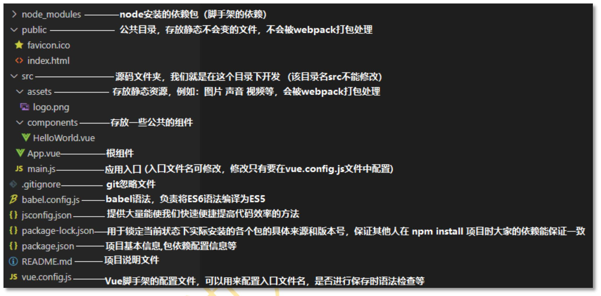

package.json：包的说明书（包的名字，包的版本，依赖哪些库）。该文件里有 webpack 的短命令：

- `serve`（启动内置服务器）
- `build` 命令是最后一次的编译，生成 html css js，给后端人员
- `lint `做语法检查的。
