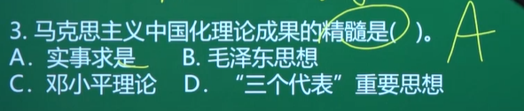
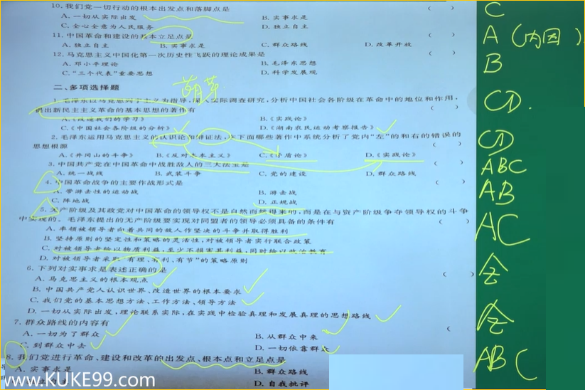

“毛中特”课程框架
绪论:马克思主义及马克思主义中国化

- 第一部分:毛泽东思想(第1——4章)
  1. 毛泽东思想总论(第1章)
  2. 新民主主义革命(第2章)
  3. 社会主义革命(第3章)
  4. 社会主义建设的早期探索（第4章)
- 第二部分:中国特色社会主义理论体系(第5——7章)中特”理论的三大基础理论(第5、6、7、章)
- 第三部分:习近平新时代中国特色社会主义思想(第8——14章)
  1. 习近平新时代中国特色社会主义思想及其历史地位(第8章)
  2. 坚持和发展中国特色社会主义的总任务(第9章)
  3. “五位一体”总体布局(第10章)
  4. “四个全面”战略布局(第11章)
  5. 实现中华民族伟大复兴的重要保障(第12章)
  6. 中国特色大国外衣（第13章)
  7. 坚持和加强党的领导（第14章）

## 绪论

>1. 马克思主义的科学内涵
>
>   - 内涵
>
>   - 拓展
>
>     - 马克思主义和具体科学的关系
>
>     - 马克思主义诞生的标志
>     - 马克思主义三个重要组成部分
>
>2. 马克思主义中国化的科学内涵
>
>   - 马克思主义中国化的必然性(多选)
>   - 马克思主义中国化的科学内涵(全背，主观题)
>
>3. 马克思主义中国化的历史进程
>
>   - 三次历史性飞跃
>   - 三大理论成果
>     - 提出
>     - 解决的问题
>   - 中国化马克思主义理论的历史地位

### 一. 马克思主义的科学内涵

马克思主义是**关于**自然界、人类社会、人类思维发展的**一般规律**的**理论体系**,**揭示**了事物的**本质、内在联系及发展规律**，是**“伟大的认识工具”**，是人们观察世界、分析问题的有力思想武器。

- 知识拓展1:马克思主义和具体科学的**关系**
  | 马克思主义 | 具体科学 |
  | ---------- | -------- |
  | 普遍       | 特殊     |
  | 共性       | 个性     |
  | 一般       | 个别     |

- 知识拓展2:马克思主义诞生的**标志**

  <mark>**1848** 年，**《共产党宣言》**的发表</mark>

> 马克思主义包括(三个重要组成部分)：**马**克思主义**哲**学，**马**克思主义**政**治**经**济学和**科学社会主义**

### 二. 马克思主义中国化的科学内涵

#### 1. 马克思主义中国化的必然性

> （多项选择题）

1. 是解决中国实际问题的**客观需要**
2. 是马克思主义理论发展的**内在要求**。
   (马克思主义具有发展性)

#### 2. 马克思主义中国化的科学内涵

> 识记(完完整整的背下来)，在主观题中作把握

- **具体化**
  就是把[^马克思主义基本原理]同中国具体实际和时代特征结合起来，**运用**马克思主义的立场、观点、方法**研究和解决**中国革命、建设、改革中的**实际问题**。

  > [^马克思主义基本原理]:包括马克思主义哲学，马克思主义政治经济学和科学社会主义

- **理论化**
  就是**总结和提炼**中国革命、建设、改革的实践经验,从而**认识和掌握**客观规律,为马克思主义理论宝库增添新的内容。

- **民族化**
  就是**运用**中国人民喜闻乐见的民族语言来**阐述**马克思主义理论,使之成为具有中国特色、中国风格、中国气派的马克思主义。

### 三. 马克思主义中国化的历史进程

<mark>**1938年第六届六中全会《论新阶段》**</mark>首次提出马克思主义中国化命题

#### 1. 三次历史性飞跃

- 第一次:发生在[^新民主主义革命时期]，形成了**毛泽东思想**。
- 第二次:发生在[^社会主义进入改革开放的新时期]，形成了**中国特色社会主义理论体系**
- 第三次:发生在[^中国特色社会主义进入新时代]，形成了**习近平新时代中国特色社会思想**

> [^新民主主义革命时期]:1919(五四运动)——1949
> [^社会主义进入改革开放的新时期]:1978(十一届三中全会: 做出了改革开放的伟大决策)——2012(习近平同志登上历史舞台)
> [^中国特色社会主义进入新时代]:2012(习近平同志登上历史舞台，党的十八大，形成了中国特色社会主义理论体系)——至今

#### 2. 三大理论成果

- 第一大理论成果:毛泽东思想
- 第二大理论成果:中国特色社会主义理论体系（包含邓小平理论、“三个代表”重要思想、科学发展观)
- 第三大理论成果:习近平新时代中国特色社会主义思想。

> 中国特色社会主义理论体系，就是包括邓小平理论、三个代表’重要思想以及科学发展观等重大战略思想在内的科学理论体系。
>
> 邓小平理论是中国特色社会主义理论体系的**开篇之作**
>
> 毛泽东思想本身并不属于中国特色社会主义理论体系，因为中国特色社会主义理论体系是在改革开放以后形成的，是在中国特定的历史条件下，以邓小平理论为主要思想基础，结合新的历史条件和实践经验，形成的一套理论体系。虽然毛泽东思想已经成为中国共产党的重要思想遗产，但是它和中国特色社会主义理论体系是两个不同的概念。(了解)
>
> 习近平新时代中国特色社会主义理论体系包括：马克思列宁主义、毛泽东思想、邓小平理论、三个代表重要思想、科学发展观、习近平新时代中国特色社会主义思想等成熟的理论成果
>
> 习近平新时代中国特色社会主义理论体系是中国特色社会主义理论体系的延续和发展，是中国特色社会主义理论的最新成果

| 提出             | 理论成果                         | 解决问题                                                     |
| ---------------- | -------------------------------- | ------------------------------------------------------------ |
| 1945  中共七大   | 毛泽东思想                       | 革命问题，什么是马克思主义，怎样对待马克思主义               |
| 1997  党的十五大 | 邓小平理论                       | 什么是社会主义，怎样建设社会主义                             |
| 2002  党的十六大 | 三个代表的重要思想               | 建设什么样的党，怎样建设党                                   |
| 2007  党的十七大 | 科学发展观                       | 实现什么样的发展，怎样发展                                   |
| 2017  党的十九大 | 习近平新时代中国特色社会主义思想 | 新时代坚持和发展什么样的中国特色社会主义、怎样坚持和发展中国特色社会主义 建设什么样的社会主义现代化强国、怎样建设社会主义现代化强国 建设什么样的长期执政的马克思主义政党、怎样建设长期执政的马克思主义政党 |

#### 3. 中国化马克思主义理论的历史地位

是马克思主义中国化的**理论成果**，是中国化的**马克思主义**，是中国共产党长期坚持的**指导思想**和全国各族人民团结奋斗的**共同思想基础**，是**国家指导思想**。

> eg:
> 

## Ⅰ. 毛泽东思想

> 要求：
>
> 1. 把握毛泽东思想**形成的条件**和毛泽东思想**形成的过程**
> 2. 把握毛泽东思想**活的灵魂**
> 3. 把握毛泽东思想的**历史地位**

### 一. 毛泽东思想及其历史地位

>- 毛泽东思想形成和发展的历史条件
>
>  - 时代背景
>
>    > 时代主题
>
>  - 实践基础
>
>  - 阶级基础、思想基础、现实需要(了解)
>
>- 毛泽东思想形成发展的过程
>
>  - 四个过程
>  - 萌芽标志、形成标志、成熟标志(单选)
>  - 一些当时的重要文献(单选)

#### 1. 毛泽东思想形成和发展的历史条件

> 选择题

- **时代背景**
  <mark>19世纪末20世纪初，世界进入帝国主义和**无产阶级革命**的新时代</mark>（提示: 回顾世界历史1917年俄国爆发的十月革命对中国的影响，十月革命一声炮响为中国送来了马克思主义)

  > 毛泽东思想形成时，当时的时代主题是：**战争与革命**
  >
  > 从邓小平开始以来**和平与发展**成为时代主题
  >
  > 注：战争与革命的时代主题(选择题中可能出现这种说法)
  >
  > 

- **实践基础**
  <mark>中国共产党领导的**革命和建设**的成功实践</mark>

  | 革命/建设          | 时间           | 注意                                                         |
  | ------------------ | -------------- | ------------------------------------------------------------ |
  | 新民主主义**革命** | 1919-1949      | 反帝反封反官僚(帝国主义、封建主义、官僚资本主义)             |
  | 社会主义**革命**   | 1949-1956      | 土地改革使得数百万农民从封建地主阶级的压迫中解放出来，成为社会主义改革的积极参与者。 |
  | 社会主义**建设**   | 1956-1976/1978 | 1956年底，三大改造完成，标志着社会主义制度在我们国家确立，进入了社会主义社会，开始进行社会主义建设 1976年文革结束 1978年十一届三中全会结束 |

- 阶级基础(了解)
  **工人阶级**力量的不断壮大

  > 1919年五四运动爆发，标志着一个崭新的阶级进入历史舞台

- 思想基础(了解)
  **马克思主义**

  > 1921年中共一大召开，标志着中国共产党成立，将马克思主义作为中国共产党的指导思想

- 现实需要(了解)
  在当时的时代背景下迫切需要一个新的理论产生，来指导工人运动

> eg: 
> 

#### 2. 毛泽东思想形成发展的过程

##### 过程

- 毛泽东思想*萌芽*的标志：<mark>**基本提出**新民主主义革命理论</mark>(与成熟区别开来)(单选)
- 毛泽东思想*形成*的标志：<mark>**提出中国革命的新道路**</mark>（农村包围城市，武装夺取政权）(单选)
- 毛泽东思想*成熟*的标志：<mark>**系统阐述新民主主义革命理论**</mark>(单选)
- 将毛泽东思想*写入党章*是在<mark>**1945年的中共七大**</mark>上。(单选)

| 过程     | 时间                                                         | 补充                                                         | 评价（标志）                   |
| -------- | ------------------------------------------------------------ | ------------------------------------------------------------ | ------------------------------ |
| 萌芽     | 1924-1927 **大革命时期(==第一次国内革命战争时期==)(北伐战争)** | 这一时期毛泽东的文章[《中国社会各阶层的分析》](#####《中国社会各阶层的分析》萌芽(1925年)) [《湖南农民运动考察报告》](#####《湖南农民运动考查报告》萌芽(1927年)) [《国民革命与农民运动》](#####《国民革命与农民运动》萌芽(1926年))(单选) | 提出了新民主主义革命的根本思想 |
| 形成     | 1927-1937\1935 **土地革命时期**                         | 《井冈山的斗争》《关于纠正党内的错误思想》 [《星星之火，可以燎原》](#####《星星之火，可以燎原》形成(1930年)) [《中国的红色政权为什么能够存在?》](#####《中国的红色政权为什么能够存在?》形成(1928年)) [反对本本主义](#####《反对本本主义》形成(1930年))(单选) |                                |
| 成熟     | 1937-1945 **全民族抗日战争时期**                        | 《共产党人发刊词》《中国革命和中国共产党》《新民主主义论》(单选) 1935年遵义会议取消了左的错误，确立了以毛泽东为代表的马克思主义的思想路线在党内的领导地位，解决了当时党内的**军事问题和组织问题** 遵义会议历史地位： **挽救**了党，**挽救**了红军，**挽救**了革命，是中国共产党历史中一次生死攸关的**转折**点，也是中国共产党在政治上从幼年走向成熟的**标志** |                                |
| 继续发展 | **解放战争时期，和建国以后**                                 | 《论人民民主专政》《论十大关系》《关于正确处理人民内部矛盾的问题》(单选) |                                |

书

##### 《中国社会各阶层的分析》萌芽(1925年)

> 重点记1，2 和 民族资产阶级的两面性

1. 分清敌友是革命的**首要问题**;

2. 地主阶级和买办阶级是中国**革命的敌人**;

3. **资产阶级分为**官僚资产阶级和民族资产阶级

   >民族资产阶级的两面性（中间势力、要团结):既有革命性又有**软弱性**、妥协性
   >
   >| 时期                               | 民族资产阶级的两面性表现                                     |
   >| ---------------------------------- | ------------------------------------------------------------ |
   >| 1949建国之前                       | 革命性>软弱性和妥协性                                        |
   >| 1949j建国之后-1956三大改造完成之前 | 既有拥护社会主义改造的一面 又有剥削工人阶级取得利润的一面 |
   >
   >民族资产阶级的根本特点是软弱性

4. 小资产阶级是无产阶级最接近的朋友(革命的基本动力，也是同盟军)，农民是最可靠的同盟军;

##### 《国民革命与农民运动》萌芽(1926年)

指出:“农民问题乃国民革命的中心问题”。(了解)

##### 《湖南农民运动考查报告》萌芽(1927年)

内容:

1. 肯定农民的作用及党领导农民革命的重要性;
2. 论述了建立农民革命领导权和农民革命武装的必要性，正确解决了无产阶级领导权的中心问题--农民问题
3. 分析了农民的富农、中农、贫农三个阶层，认为**贫农是农民中最革命的力量**;

##### 《中国的红色政权为什么能够存在?》形成(1928年)

提出工农武装割据的思想。

##### 《反对本本主义》形成(1930年)

- 内容:<mark>**没有调查，没有发言权**;第一次反对**教条主义**</mark>;基本形成了包含毛泽东思想活的灵魂的**实事求是**、群众路线、独立自主的**基本因子**，基本形成了马克思主义的思想路线(实事求是的思想路线)。

> 本本主义又叫教条主义

##### 《星星之火，可以燎原》形成(1930年)

<mark>以"乡村为中心"，探索武装夺取政权的新道路</mark>

##### 历史事件（了解）

- 帮助我们理解毛泽东思想形成发展的过程
- 加粗的时间是与 毛泽东有关的时期

| 中国近现代史的时间        | 重要事件                                                     | 时期                                                         | 补充                                                         |
| ------------------------- | ------------------------------------------------------------ | ------------------------------------------------------------ | ------------------------------------------------------------ |
| 1840-1919(第一个阶段)     | 1840年鸦片战争是中国近代史的开端                             | 旧民主主义革命时期                                           | 领导阶级主要是资产阶级                                       |
| **1919-1949(第二个阶段)** | 1919年五四运动标志着一个崭新的阶级登上历史舞台，我们把五四运动作为新旧民主主义革命的分水岭 | 新民主主义革命时期                                           | 领导阶级主要是无产阶级 这个阶段又分为四个时期 1919-1927: 中共创立初期和大革命时期 1927-1937： 土地革命时期(国共两党内战) 1937-1945： 全民族抗日战争时期 1945-1949： 解放战争时期  |
| **1949-1956(第三个阶段)** | 1949年新中国的成立，标志着新民主主义革命的基本胜利           | 过渡时期 或叫：社会主义革命时期 (解释：新民主主义社会向社会主义社会过渡的时期) |                                                              |
| **1956-1978(第四个阶段)** |                                                              | 社会主义建设的探索时期 或叫：社会主义社会在曲折中前进时期 |                                                              |
| 1978-2012(第五个阶段)     | 1978年十一届三中全会，做出了停止以阶级斗争为纲的口号，把党的工作重心转移到经济建设中来，实行改革开放的伟大历史决策 | 改革开放的新时期                                             |                                                              |
| 2012-至今(第六个阶段)     | 2012年党的十八大以来，习近平登上历史舞台，取得历史性成就以及进行了一系列的历史性变革，使中国特色社会主义进入新时代 | 中国特色社会主义进入新时代                                   |                                                              |

### 二. 毛泽东思想主要内容及活的灵魂

#### 1. 毛泽东思想主要内容（六个方面）

1. 新民主主义革命理论
2. 社会主义革命和社会主义建设理论
3. 革命军队建设和军事战略的理论
4. 政策和策略的理论
5. 思想政治工作和文化工作的理论
6. 党的建设理论

#### 2.  毛泽东思想活的灵魂

> 主观选择（重要）

- 毛泽东思想的活的灵魂,是贯串于各个理论的立场、观点和方法。

- 毛泽东思想的**活的灵魂**有三个基本方面，即<mark>**实事求是，群众路线，独立自主.**</mark>（选择）

- 我们党进行革命、建设和改革的出发点、根本点和立足点是**实事求是，群众路线，独立自主**(一 一对应)

  > 区别于<mark>**新民主主义革命**的三大法宝</mark>
  > 新民主主义革命的三大法宝：
  >
  > 1. 统一战线
  > 2. 武装斗争
  > 3. 党的建设

- 毛泽东思想活的灵魂的**提出及文献**
  <mark>1981年十一届六中全会</mark>《中国共产党中央委员会关于建国以来党的若干历史问题的决议》

  

##### 1) 实事求是——出发点

实事求是:<mark>就是一切从实际**出发**，理论联系实际，坚持在实践中检验真理和发展真理</mark>

- > （了解）
  > 毛泽东指出:“‘′实事′就是客观存在着的一切事物，‘是'就是客观事物的内部联系，即规律性，‘求’就是我们去研究。”
  > 实事求是的基本含义：从客观存在的一切事物中，去研究事物的发展规律
  
  - 实事求是的地位
    <mark>实事求是，是**马克思主义**的根本观点，是中国共产党人**认识世界、改造世界**的根本要求，是我们党的基本思想方法、工作方法、领导方法，是中国共产党的**思想路线**，是毛泽东思想的**精髓**，是马克思主义中国化理论成果的**精髓**。</mark>
  
    > （补充）1978年十一届三中全会上邓小平**重新确立**实事求是的思想路线
    
    > 实事求是是马克思主义中国化理论成果的**精髓**，邓小平理论的**精髓**、三个代表科学发展观、习近平新时代中国特色社会主义思想的**精髓**都是实事求是
    > 实事求是是中国共产党的**思想路线**(的实质或核心或认识路线)
    
  - **要求(怎样坚持实事求是)**
  
    1. 要深入实际了解事物的本来面貌，把握事物内在的必然联系，按照**客观规律办事**
    2. 要清醒认识和正确把握我国**基本国情**
    3. 要不断推进实践基础上的理论创新。

> eg1:
> 
> 1978年邓小平重新确立实事求是的思想路线
>
> eg2:
> 
>
> - 后来邓小平在实事求是的基础之上多了解放思想
>   习近平认为解放思想就是打破一切错误的理论和主观偏见的束缚，研究新情况解决新问题，并且认为只有解放思想才能实事求是，只有实事求是才是真正的解放思想
> - 江泽民在实事求是解放思想的基础上又多了与时俱进
>   党的全部理论和全部工作要体现规律性，把握时代性，赋予创造性
> - 胡锦涛又在解放思想实事求是与时俱进的基础之上又多了求真务实
>
> eg3
> 
> eg4
> 

##### 2) 群众路线——根本点

- 群众路线
  就是<mark>一切为了群众，一切依靠群众，从群众中来，到群众中去。
  群众路线是**我党的生命线和根本工作路线**</mark>。(选择)
- 坚持群众路线的**要求**:
  1. 要坚持人民是推动历史发展的**根本力量**
  2. 要坚持全心全意为人民服务的**根本宗旨**
  3. 要保持党同人民群众的**血肉联系**。

> 注意: **全心全意为人民服务**是我们党一切**行动的**根本**出发点和落脚点**，<mark>是我们党**区别于**其他一切政党的**根本标志**</mark>。

##### 3) 独立自主——立足点

- 独立自主
  就是坚持独立思考，走自己的路，把立足点放在**依靠自己力量的基础上**。同时积极争取外援，开展国际经济文化交流，学习外国一切对我们有益的先进事物。
- 独立自主的地位
  <mark>是党的全部理论和实践的**立足点**，也是党和人民事业不断走向胜利的**根本保障**。</mark>
- 坚持独立自主的**要求**:
  1. 要坚持中国的事情必须由**中国人民自己处理**
  2. 要坚持独立自主的和平外交政策，坚定不移走和平发展道路

> eg1
> 
>
> - 《改造我们的学习》1941年对实事求是做了马克思主义的界定
> - 《中国共产党中央委员会关于建国以来党的若干历史问题的决议》1981年十一届六中全会，中心议题是正确评价毛泽东，正确评价毛泽东思想，同时提出了毛泽东思想活的灵魂
> - 《论人民民主专政》1949年
>
> eg2
> 
>
> - 另起炉灶：要执行一条不同于国民党的外交政策
> - 打扫干净屋子再请客，完成民主革命的遗留问题，即反帝、反封(打扫干净屋子)，然后再从事国际交往(请客)
> - 一边倒，倒向以苏联为代表的社会主义阵营

#### 3. 毛泽东思想的历史地位

1. **马克思主义中国化第一次历史性飞跃的理论成果**
   在中国共产党的历史上，毛泽东在认真总结历史经验的基础上，(<mark>1938年第六届六中全会《论新阶段》</mark>)**第一次明确提出了马克思主义同中国实际相结合。**毛泽东思想是马克思主义中国化的第一个理论形态，实现了马克思主义中国化的第一次历史性飞跃。
   注意:李大钊和毛泽东

2. **中国革命和建设的科学指南**
   在毛泽东思想的指引下，我们找到了新民主主义革命的正确道路，结束了中国半殖民地半封建社会的历史，建立了中华人民共和国;找到从新民主主义向社会主义过渡的道路，确立了社会主义基本制度。在此基础上，毛泽东又对适合中国国情的社会主义道路进行了艰苦探索，并取得了重要的理论成果，提出了许多很有启发性的论断。

   > 补充
   > 中国革命分两步走
   >
   > 1. 新民主主义革命
   > 2. 社会主义革命

3. **中国共产党和中国人民宝贵的精神财富**
   毛泽东是伟大的马克思主义者、伟大的无产阶级革命家、战略家和理论家。他为中国共产党和中国人民解放军的创立和发展，为中国各族人民解放事业的胜利，为中华人民共和国的缔造和社会主义事业的发展，建立了不可磨灭的功勋，为世界被压迫民族的解放和人类进步事业作出了重大贡献。

   - 怎样正确评价毛泽东
     <u>毛泽东是伟大的马克思主义者、伟大的无产阶级革命家、战略家和理论家。他为中国共产党和中国人民解放军的创立和发展，为中国各族人民解放事业的胜利，为中华人民共和国的缔造和社会主义事业的发展，建立了不可磨灭的功勋，为世界被压迫民族的解放和人类进步事业作出了重大贡献。
     毛泽东的功绩是第一位的，错误是第二位的。</u>
     注：要将毛泽东晚年的错误同毛泽东思想区别开来。

   > 补充
   > 1945年中共七大把毛泽东思想确立为党的指导思想，并写入党章

>
>
>- 要将毛泽东的思想，毛泽东个人的思想，毛泽东晚年的思想和毛泽东思想区别开来

##  .Ⅰ.绪论&毛泽东思想

| 背景                                                         | 文章                                                         | 标志 |
| ------------------------------------------------------------ | ------------------------------------------------------------ | ---- |
| 毛泽东利用马克思主义认识论河边争论系统分析党内"左"和"右"的错误 | 《矛盾论》《实践论》                                         |      |
| 毛泽东思想萌芽时期(提出新民主主义革命的基本思想)             | [《中国社会各阶层的分析》](#####《中国社会各阶层的分析》萌芽(1925年)) [《湖南农民运动考察报告》](#####《湖南农民运动考查报告》萌芽(1927年)) [《国民革命与农民运动》](#####《国民革命与农民运动》萌芽(1926年)) |      |
| 毛泽东思想形成时期(土地革命时期) | 《井冈山的斗争》《关于纠正党内的错误思想》 [《星星之火，可以燎原》](#####《星星之火，可以燎原》形成(1930年)) [《中国的红色政权为什么能够存在?》](#####《中国的红色政权为什么能够存在?》形成(1928年)) [反对本本主义](#####《反对本本主义》形成(1930年)) |      |
| 毛泽东思想成熟时期(全民族抗日战争时期) | 《共产党人发刊词》《中国革命和中国共产党》《新民主主义论》 |  |
| 毛泽东思想继续发展时期(解放战争时期，和建国以后) | 《论人民民主专政》《论十大关系》《关于正确处理人民内部矛盾的问题》 |  |
|  |                           |  |

| 会议                 | 标志                             |
| -------------------- | -------------------------------- |
| 1945年的中共七大     | 将毛泽东思想*写入党章*           |
| 1981年十一届六中全会 | 毛泽东思想活的灵魂的提出         |
| 1978年十一届三中全会 | 邓小平重新确立实事求是的思想路线 |

 

三.1.

三.2 

## Ⅱ. 新民主主义革命理论

> - 新民主主义革命理论形成的依据
> - 新民主主义革命的总路线和基本纲领
> - 新民主主义革命的道路和基本经验

### 一. 新民主主义革命理论的形成

近代中国的国情 是 新民主主义革命理论形成的<mark>历史背景</mark>
中国革命的时代特征 是 新民主主义革命理论形成的<mark>时代条件</mark>
中国革命经验的概括和总结 是 新民主主义革命理论形成的<mark>实践基础</mark>

#### 1. 近代中国的国情——新民主主义革命理论形成的历史背景

毛泽东指出:“认清中国社会的性质，就是说，<mark>认清中国的国情，乃是认清一切革命问题的**基本的根据**。”认清国情,是解决中国革命问题的**基本前提**(单选)。</mark>

>从1840年起，帝国主义列强先后发动了两次鸦片战争、中法战争、甲午战争、八国联军侵华战争等，迫使中国签订了一系列不平等条约。其中《南京条约》《马关条约》和《辛丑条约》等3个条约对中国伤害最深。<mark>使中国逐步沦为半殖民地半封建社会。这是近代中国最基本的国情。(单选)</mark>半殖民地半封建社会(1840-1949)

- 近代中国半殖民地半封建社会的基本特点 (理解)
  第一,中国虽然保持独立的形式，但实际上已丧失了独立主权。<mark>**帝国主义侵略**</mark>势力日益成为统治中国的决定性力量。帝国主义列强强迫清政府签订不平等条约，从经济、政治、文化等各方面牢牢控制了中国，<mark>**成为近代中国一切灾难和祸害的总根源，是阻碍中国独立发展的根本原团**(单选)</mark>
