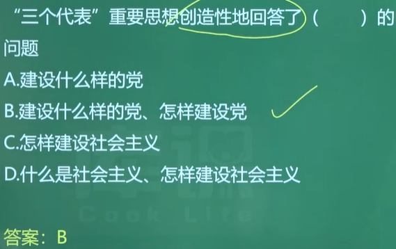
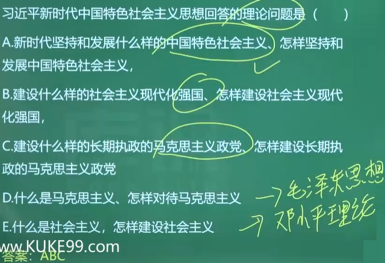
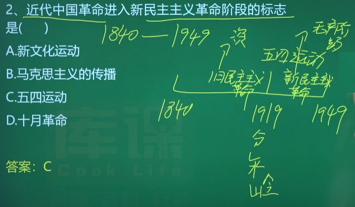
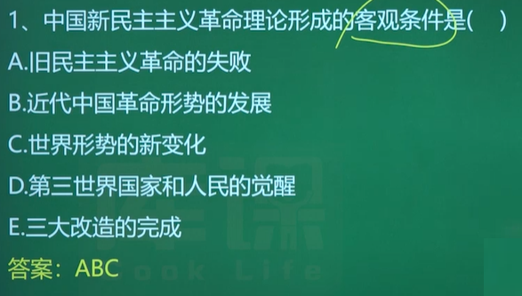
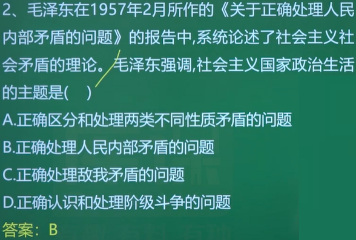

---
​---
title: "政治"
author: "1302344595@qq.com"
​---
---

## Ⅰ. 导论

 

### 一. 马克思主义中国化时代化的提出 X

1938年，**毛泽东**在==**党的六届六中全会**==上作的==**《论新阶段》**==的报告，强调:“没有抽象的马克思主义，只有具体的马克思主义。.......马克思主义的中国化，使之在其每一表现中带着中国的特性，即是说，按照中国的特点去应用它，成为全党亟待了解并亟需解决的问题。”**这==标志着“马克思主义中国化”这一命题的正式提出==。**

---

1945年，在**党的七大**上，**刘少奇**代表党中央作了**《关于修改党章的报告》**，对马克思主义中国化从理论上作了进一步的闸述，并**指出毛泽东思想是“中国化的马克思主义”。**  <u>X(新增)</u>

---

- **李大钊**——**第一个在中国==宣传==马克思主义的人**

---

> eg:
> 
> eg:
> 

---

**马克思主义中国化同时包含着马克思主义时代化的意蕴**。我们党自成立以来，始终坚持把马克思主义基本原理同**中国具体实际**和**时代特征**相结合，不断进行理论创新。

---

**党的十八大以来**，以习近平同志为核心的党中央明确提出要**不断推进马克思主义中国化时代化。**

---

2021年，**党的十九届六中全会**通过的**《中共中央关于党的百年奋斗重大成就和<u>历史</u>经验的<u>决议</u>》**总结了百年来中国共产党推进马克思主义中国化时代化的**重大成就**，**闸释了**马克思主义中国化时代化的**重大历史意义**。

- 建党以来的**第三个**历史决议：《中共中央关于党的百年奋斗重大成就和历史经验的决议》

---

2022年,**党的二十大**明确把“不断谱写马克思主义中国化时代化新篇章”作为当代中国共产党人的庄严历史责任，并提出了**继续推进马克思主义中国化时代化的新要求**。

### 二. “马克思主义中国化时代化”的必然性 X

> 也就也是为什么提出马克思主义 或
> 提出马克思主义的原因

1. **是马克思主义理论本身发展的内在要求**
2. **是解决中国实际问题的客观需要**

>- 1848年**《共产党宣言》的发表，标志着马克思主义的诞生**
>- 近代中国国情：半殖民地半封建社会
>- 现在我国的国情：社会主义初级阶段

> eg：
> 
> eg：
> 

### 三. 马克思主义中国化时代化的科学内涵 D

马克思主义中国化时代化，就是**==立足==中国国情和时代特点，坚持把马克思主义基本原理同中国具体实际相==结合==、同中华优秀传统文化相==结合==，深入研究和==解决==中国==革命、建设、改革==不同历史时期的实际问题**，真正搞懂面临的时代课题，不断吸收新的时代内容，科学回答时代提出的重大理论和实践课题，创造新的理论成果。(一立足、两结合、三解决)

---

具体包含三层含义(选择及大题)

1. 运用马克思主义的立场、观点和方法，观察时代、把握时代、引领时代，**解决中国革命、建设、改革中的实际问题。**（具体化）

   > 马克思主义基本原理 包括马克思主义哲学，马克思主义政治经济学和科学社会主义
2. **总结和提炼**中国革命、建设、改革的实践**经验**并将其**上升为理论**，不断丰富和发展马克思主义的理论宝库，赋予马克思主义以新的时代内涵。（理论化）
3. **运用中国人民喜闻乐见的民族语言来阐述马克思主义**，使其植根于中华优秀传统文化的土壤之中，具有中国特色、中国风格、中国气派。（民族化）
4. 准确把握马克思主义中国化时代化的科学内涵，要**做到坚持马克思主义与发展马克思主义相统一。**（时代化）

习近平指出:“把坚持马克思主义和发展马克思主义统一起来，结合新的实践不断作出新的理论创造，这是马克思主义永葆生机活力的奥妙所在。"

---

- 知识拓展1:马克思主义和具体科学的**关系**

  | 马克思主义 | 具体科学 |
  | ---------- | -------- |
  | 普遍       | 特殊     |
  | 共性       | 个性     |
  | 一般       | 个别     |

### 四. 马克思主义中国化时代化的历史进程 X

#### 1. 三个历史性飞跃

1. 马克思主义中国化时代化的第一次历史性飞跃——**毛泽东思想**
2. 马克思主义中国化时代化新的飞跃——**中国特色社会主义理论体系**(邓小平理论、三个代表的重要思想、科学发展观)
3. 马克思主义中国化时代化新的飞跃——**习近平新时代中国特色社会主义思想**

---

| 历史性飞跃       | 时期                             | 成果                             |
| ---------------- | -------------------------------- | -------------------------------- |
| 第一次历史性飞跃 | 新民主主义**革命**时期           | 毛泽东思想                       |
| 第二次历史性飞跃 | 社会主义进入**改革开放**的新时期 | 中国特色社会主义理论体系         |
| 第三次历史性飞跃 | **中国特色社会主义**进入新时代   | 习近平新时代中国特色社会主义思想 |

- 第一次:发生在[^新民主主义革命时期]，形成了**毛泽东思想**。
- 第二次:发生在[^社会主义进入改革开放的新时期]，形成了**中国特色社会主义理论体系**
- 第三次:发生在[^中国特色社会主义进入新时代]，形成了**习近平新时代中国特色社会思想**

> [^新民主主义革命时期]: 1919(五四运动)——1949
> [^社会主义进入改革开放的新时期]: 1978(十一届三中全会: 做出了改革开放的伟大决策)——2012(习近平同志登上历史舞台)
> [^中国特色社会主义进入新时代]: 2012(习近平同志登上历史舞台，党的十八大，形成了中国特色社会主义理论体系)——至今

#### 2. 三大理论成果

| 写入党章(并确立为指导思想)的会议                             | 理论成果                         | 解决问题                                                     |
| ------------------------------------------------------------ | -------------------------------- | ------------------------------------------------------------ |
| **党的七大**《中国共产党党章》写入党章并确立为指导思想       | 毛泽东思想                       | 革命问题，什么是马克思主义，怎样对待马克思主义               |
| **党的十五大**写入党章并确立为指导思想                       | 邓小平理论                       | 什么是社会主义，怎样建设社会主义                             |
| **党的十六大**写入党章并确立为指导思想                       | 三个代表的重要思想               | 建设什么样的党，怎样建设党                                   |
| **党的十七大**写入党章<br />**党的十八大**确立为指导思想     | 科学发展观                       | 实现什么样的发展，怎样发展                                   |
| **党的十九大**写入党章并确立为指导思想<br />---<br />**十三届全国人大**一次会议写入宪法 | 习近平新时代中国特色社会主义思想 | 新时代坚持和发展什么样的中国特色社会主义、怎样坚持和发展中国特色社会主义 建设什么样的社会主义现代化强国、怎样建设社会主义现代化强国 建设什么样的长期执政的马克思主义政党、怎样建设长期执政的马克思主义政党 |

##### 2.1 毛泽东思想

**① 在新民主主义革命时期**，以毛泽东同志为主要代表的中国共产党人，把马克思列宁主义基本原理同中国具体实际结合起来，对经过艰苦探索、付出巨大牺牲积累的一系列独创性经验作了理论概括，**开辟了农村包围城市、武装夺取政权的正确革命道路，创立了毛泽东思想。**

**② 在社会主义革命和建设时期**，以毛泽东同志为主要代表的中国共产党人，**提出把马克思列宁主义基本原理同中国具体实际进行“第二次结合”**，提出了关于社会主义建设的一系列重要思想，结合新的实际**丰富和发展了毛泽东思想。毛泽东思想是马克思主义中国化时代化的第一次历史性飞跃。**

- 毛泽东思想==回答的问题==：**什么是马克思主义，怎样对待马克思主义**

##### 2.2 中国特色社会主义理论体系

(邓小平理论、三个代表的重要思想、科学发展观)

**在改革开放和社会主义现代化建设新时期**，实现了马克思主义中国化时代化新的飞跃。

新时期最开明的特点是：**改革开放**

1. 邓小平理论
   1978年召开的党的**十一届三中全会,**实现了新中国成立以来党的历史上具有深远意义的伟大转折，**开启了改革开放和社会主义现代化建设历史新时期。**
   以邓小平同志为主要代表的中国共产党人，团结带领全党全国各族人民，深刻总结新中国成立以来正反两方面经验，围绕**什么是社会主义、怎样建设社会主义这一根本问题**，借鉴世界社会主义历史经验，创立了邓小平理论。
   - 邓小平理论==回答的问题==：**什么是社会主义、怎样建设社会主义**
   - **十二大**首次提出中国特色社会主义成为我们当全部理论和实践创新的主题
2. “三个代表”重要思想
   党的**十三届四中全会**以后，以江泽民同志为主要代表的中国共产党人，团结带领全党全国各族人民，坚持党的基本理论、基本路线，**加深了对什么是社会主义、怎样建设社会主义和建设什么样的党、怎样建设党的认识**，形成了“三个代表”重要思想。
   - “三个代表重要思想”创造性==回答的问题==是：**建设什么样的党、怎样建设党**
3. 科学发展观——胡锦涛
   进入新世纪新阶段，党的十六大以后，以胡锦涛同志为主要代表的中国共产党人，团结带领全党全国各族人民，在全面建设小康社会进程中推进**实践创新、理论创新、制度创新**，深刻认识和**回答了新形势下实现什么样的发展、怎样发展等重大问题**，形成了科学发展观。
   - 科学发展观==回答的问题==是：**实现什么样的发展、怎样发展**
   - **社会主义的根本任务**是：(解放和)**发展生产力**

##### 2.3 习近平新时代中国特色社会主义思想

党的**十八大以来**，中国特色社会主义**进入新时代**，以习近平同志为主要代表的中国共产党人，坚持把马克思主义基本原理同中国具体实际相结合、同中华优秀传统文化相结合，==系统回答了：==

1. **新时代坚持和发展什么样的中国特色社会主义、怎样坚持和发展中国特色社会主义**
2. **建设什么样的社会主义现代化强国、怎样建设社会主义现代化强国**
3. **建设什么样的长期执政的马克思主义政党、怎样建设长期执政的马克思主义政党**

等重大时代课题，**实现了马克思主义中国化时代化新的飞跃。**

----

实践证明，**中国共产党为什么能，中国特色社会主义为什么好，归根到底是马克思主义行，是中国化时代化的马克思主义行。**马克思主义深刻改变了中国，中国也极大丰富了马克思主义。

---

马克思主义的**科学性和真理性**在中国得到充分检验，马克思主义的**人民性和实践性**在中国得到充分贯彻，马克思主义的**开放性和时代性**在中国得到充分彰显。

- **马克思主义的特点或特征**：(选择)
  1. **科学性**
  2. **真理性**
  3. **人民性**
  4. **实践性**
  5. **开放性**
  6. **时代性**

> eg：
> 
> eg：
> 
> eg：
> 

### 五.  马克思主义中国化时代化理论成果及其关系

#### 5.1 马克思主义中国化时代化理论成果

在马克思主义中国化时代化的历史进程中，产生了毛泽东思想、邓小平理论、“三个代表”重要思想、科学发展观、习近平新时代中国特色社会主义思想。

1. 在**新民主主义革命、社会主义革命和建设时期创立的毛泽东思想**，是马克思列宁主义在中国的运用和发展，是被实践证明了的关于中国革命和建设的正确的理论原则和经验总结，是中国共产党集体智慧的结晶。
2. **改革开放以来形成的中国特色社会主义理论体系**是指导党和人民沿着中国特色社会全父道路实现中民族伟大复兴的正确理论，是立于时代前沿、与时俱选的科学理论。
   中国特色社会主义理论体系：
   - ①党的十一届三中全会以后，以邓小平同志为主要代表的中国共产党人创立的**邓小平理论，是中国特色社会主义理论体系的==开篇之作==**;（X）
   - ②党的十三届四中全会以后，以江泽民(1989-2002)同志为主要代表的中国共产党人形成的**“三个代表”重要思想，推动了**中国特色社会主义理论体系的**跨世纪发展**;（X新增）
   - ③党的十六大以后，以胡锦涛同志为主要代表的中国共产党人形成的**科学发展观，实现了**中国特色社会主义理论体系**在新世纪新阶段的新发展**。

---

**党的十七大**提出了**“中国特色社会主义理论体系”的科学概念，**把改革开放以来我们党在实践中相继形成的邓小平理论、“三个代表”重要思想以及科学发展观等重大战略思想一道作为中国特色社会主义理论体系的重要组成部分，**标志着中国特色社会主义理论和实践的进一步成熟。**（X）

- 党的**十二大**提出了**“中国特色社会主义”**
- 党的**十七大**提出了**“中国特色社会主义理论体系”，标志着中国特色社会主义理论和实践的进一步成熟**

---

党的十八大以来，以习近平同志为主要代表的中国共产党人创立了习近平新时代中国特色社会主义思想，谱写了新时代中国特色社会主义新篇章。

---

> eg：
> 

#### 5.2 马克思主义中国化时代化理论成果之间的关系

马克思主义中国化时代化的理论成果是**一脉相承又与时俱进**的关系。

1. 一方面，**毛泽东思想**所蕴含的马克思主义的立场、观点和方法，为中国特色社会主义理论体系**提供了基本遵循**。
   >基本遵循比如：(了解)
   >
   >1. **实事求是、群众路线、独立自主**是毛泽东思想活的灵魂，这一具有中国共产党人特色的立场、观点和方法**也贯穿于中国特色社会主义理论体系之中。**
   >2. **中国特色社会主义理论体系始终坚持将<u>群众路线</u>作为根本工作路线**，坚持以人为本、执政为民，始终强调发展为了人民、发展依靠人民、发展成果由人民共享。
   >3. 改革开放以来，中国共产党始终强调走自己的路、建设中国特色社会主义，并将**自力更生、艰苦奋斗**作为党的基本路线的重要内容，始终**坚持<u>独立自主</u>的和平外交政策。**

2. 另一方面，中国特色社会主义理论体系在新的历史条件下进一步**丰富和发展**了毛泽东思想。

   > 比如:(了解)
   >
   > 1. 提出走自己的路、建设**中国特色社会主义**，丰富发展了毛泽东思想关于社会主义**建设道路**理论;
   > 2. 提出中国正处于并将长期处于**社会主义初级阶段**，丰富发展了毛泽东思想关于中国社会主义发展阶段理论;
   > 3. 提出**中国式现代化**，建设富强民主文明和谐美丽的社会主义现代化国家，丰富发展了毛泽东思想关于社会主义“四个现代化”理论;
   > 4. 提出全面从严治党，推进党的建设新的伟大工程，以党的自我革命引领社会革命，丰富发展毛泽东思想关于**党的建设理论**;
   > 5. 提出走平发展道路，推动构建人类命运共同体丰富发展了毛泽东思想关手**独立自主和平外交的**理论等等。

---

总结：
**毛泽东思想和中国特色社会主义理论体系，都是马克思列宁主义在中国的运用和发展，都以独创性的理论成果丰富和发展了马克思主义的理论宝库。**（X）

---

毛泽东思想、邓小平理论、“三个代表”重要思想、科学发展观、习近平新时代中国特色社会主义思想同马克思列宁主义一起，**都是党和国家必须长期坚持的指导思想，是全国各族人民团结奋斗的共同思想基础。**

### T-1 题目

 

## Ⅱ. 毛泽东思想及其历史地位

> - 毛泽东思想的形成和发展☆X
>   - 历史条件
>   - 过程X
> - 毛泽东思想的主要内容和获得灵魂☆☆X+D
>   - 主要内容D
>   - 活的灵魂X
> - 毛泽东思想的历史地位☆☆☆X+D
>   - 马克思主义中国化的第一个重大理论成果
>   - 中国革命和建设的科学指南
>   - 中国共产党和中国人民宝贵的精神财富

### 一. 毛泽东思想的形成和发展

#### 1. 毛泽东思想形成和发展的历史条件

- **时代背景**
  ==19世纪末20世纪初，世界进入帝国主义(战争)和**无产阶级革命**的新时代==（提示: 回顾世界历史1917年俄国爆发的十月革命对中国的影响，==**十月革命**一声炮响为中国送来了**马克思主义**==)

  > 毛泽东思想形成时，当时的时代主题(时代背景)是：**战争与革命**
  >
  > - eg：第一次世界大战和俄国十月革命
  >
  > 从邓小平开始以来**和平与发展**成为时代主题
  >
  > 注：战争与革命的时代主题(选择题中可能出现这种说法)
  >

- **实践基础**
  ==中国共产党领导的**革命和建设的成功实践**是毛泽东思想形成的实践基础==

  | 革命/建设          | 时间           | 注意                                                         |
  | ------------------ | -------------- | ------------------------------------------------------------ |
  | 新民主主义**革命** | 1919-1949      | 反帝反封反官僚(帝国主义、封建主义、官僚资本主义)             |
  | 社会主义**革命**   | 1949-1956      | 土地改革使得数百万农民从封建地主阶级的压迫中解放出来，成为社会主义改革的积极参与者。 |
  | 社会主义**建设**   | 1956-1976/1978 | 1956年底，三大改造完成，标志着社会主义制度在我们国家确立，进入了社会主义社会，开始进行社会主义建设<br />1976年文革结束<br />1978年十一届三中全会结束 |

  > 中国共产党的历史使命：**为中国人民谋幸福，为中华民族谋复兴**

- 阶级基础(了解)
  **工人阶级**力量的不断壮大

  > 1919年五四运动爆发，标志着一个崭新的阶级进入历史舞台

- 思想基础(了解)
  **马克思主义**

  > 1921年==中共一大召开，标志着中国共产党成立，将马克思主义作为中国共产党的指导思想==

- 现实需要(了解)
  在当时的时代背景下迫切需要一个新的理论产生，来指导工人运动

---

> 1.

#### 2. 毛泽东思想形成发展的过程

##### 2.1 过程

毛泽东思想是在我国**新民主主义革命、社会主义革命和社会主义建设**的实践过程中，逐步形成和发展起来的。

---

- 毛泽东思想*萌芽*的标志：==**基本提出**新民主主义革命理论==(与成熟区别开来)(单选)
- 毛泽东思想*形成*的标志：==**提出中国革命的新道路**==（农村包围城市，武装夺取政权）(单选)
- 毛泽东思想*成熟*的标志：==**系统阐述新民主主义革命理论**==(单选)
- 将毛泽东思想*写入党章*是在1945年的==**中共七大**==上。(单选)

---

| 过程     | 时间                                                         | 补充                                                         | 评价（标志）                                                 |
| -------- | ------------------------------------------------------------ | ------------------------------------------------------------ | ------------------------------------------------------------ |
| 萌芽     | 1924-1927<br />**大革命时期(==第一次国内革命战争时期==)(北伐战争)** | 这一时期毛泽东的文章[《中国社会各阶层的分析》](#####《中国社会各阶层的分析》萌芽(1925年)) [《湖南农民运动考察报告》](#####《湖南农民运动考查报告》萌芽(1927年)) [《国民革命与农民运动》](#####《国民革命与农民运动》萌芽(1926年))(单选) | 基本==**提出**了新民主主义革命的根本思想==                   |
| **形成** | 1927-1937\1935<br />**土地革命时期**                         | 《井冈山的斗争》《关于纠正党内的错误思想》<br />[《星星之火，可以燎原》](#####《星星之火，可以燎原》形成(1930年)) [《中国的红色政权为什么能够存在?》](#####《中国的红色政权为什么能够存在?》形成(1928年)) [反对本本主义](#####《反对本本主义》形成(1930年))(单选) | 提出并阐释了农村==包围城市、武装夺取政权==的思想(中国革命的新道路)，标志着==毛泽东思想的**初步形成**== |
| **成熟** | 1935(遵义会议)-1945<br />**全民族抗日战争时期**              | 《共产党人发刊词》《中国革命和中国共产党[^Ⅱ.一.2.1]》《新民主主义论》《实践论》《矛盾论》《论联合政府》(单选)<br />**------<br />**1935年**遵义会议**取消了左的错误，==确立了以毛泽东为代表的马克思主义的思想路线在党内的领导地位==，解决了当时党内的**军事问题和组织问题**<br />遵义会议历史地位： **挽救**了党，**挽救**了红军，**挽救**了革命，是中国共产党历史中一次生死攸关的**转折**点，也是中国共产党在政治上从幼年走向成熟的**标志** | ==《新民主主义论》中新民主主义革命理论的**系统阐述**==，实现了马克思主义与中国革命实践相结合的历史性飞跃，==标志着毛泽东思想的成熟== |
| 继续发展 | **解放战争时期，和新中国成立以后**                           | 《七届二中全会上的报告》《论人民民主专政》《论十大关系》《关于正确处理人民内部矛盾的问题》(单选) | 社会主义革命和社会主义建设的重要思想，是==毛泽东思想的丰富和发展== |

[^Ⅱ.一.2.1]:《中国革命和中国共产党》第一次提出“新民主主义革命”这一概念

>1.
>
>2.

##### 2.2 遵义会议(新增)

在党的历史上，遵义会议是一次具有伟大转折意义的重要会议。这次会议在**红军第五次反“围剿”失败和长征初期严重受挫**的历史关头召开，事实上==确立了毛泽东在党中央和红军的**领导地位**==，==开始确立了以毛泽东为主要代表的马克思主义正确路线在党中央的领导地位==，==开始形成了以毛泽东同志为核心的党的第─代中央领导集体==，==开启了我们**党独立自主**解决中国革命实际问题的新阶段==，在最危急关头**挽救了党、挽救了红军、挽救了中国革命**.

---

##### 2.3 补充

- **八七会议**确定实行**土地革命和武装起义的方针**

- **中国革命的发展规律是**: 农村包围城市，武装夺取政权
  将党的工作重点从城市转入农村，在农村开展游击战争，进行土地革命，建立红色政权，把落后的农村变为先进的革命根据地;依托这样的农村革命根据地去反对依靠城市进攻农村的强大敌人，进而以农村包围城市，逐步削弱敌人的力量;直到敌我力量强弱发生转化，再攻占中心城市，夺取全国政权和全国革命的胜利。

- 党的**六届七中全会**通过的==**《关于若干历史问题的决议》**充分肯定了确立毛泽东在全党领导地位的重大意义==，指出:“全党已经空前一致地认识了毛泽东同志的路线的正确性，空前自觉地团结在毛泽东的旗帜下了。

- 经过六届七中全会的酝酿和讨论，**1945年党的七大**通过的**《中国共产党党章》**明确规定，“中国共产党，以马克思列宁主义的理论与中国革命的实践之统一的思想——毛泽东思想，作为自己一切工作的指针”。这**标志着把毛泽东思想确立为党必须长期坚持的指导思想**。

  > ==党的七大通过的《中国共产党党章》将毛泽东思想写入党章并确立为党的指导思想==

---

##### 2.4 书

###### 《中国社会各阶层的分析》萌芽(1925年)

> 重点记1，2 和 民族资产阶级的两面性

1. 分清敌友是革命的**首要问题**;

2. 地主阶级和买办阶级是中国**革命的敌人**;

3. **资产阶级分为**官僚资产阶级和民族资产阶级

   >民族资产阶级的两面性（中间势力、要团结):既有革命性又有**软弱性**、妥协性
   >
   >| 时期                               | 民族资产阶级的两面性表现                                     |
   >| ---------------------------------- | ------------------------------------------------------------ |
   >| 1949建国之前                       | 革命性>软弱性和妥协性                                        |
   >| 1949j建国之后-1956三大改造完成之前 | 既有拥护社会主义改造的一面<br />又有剥削工人阶级取得利润的一面 |
   >
   >民族资产阶级的根本特点是软弱性

4. 小资产阶级是无产阶级最接近的朋友(革命的**基本动力**，也是**同盟军**)，农民是最可靠的同盟军;

###### 《国民革命与农民运动》萌芽(1926年)

指出:“农民问题乃国民革命的中心问题”。(了解)

###### 《湖南农民运动考查报告》萌芽(1927年)

内容:

1. 肯定农民的作用及党领导农民革命的重要性;
2. 论述了建立农民革命领导权和农民革命武装的必要性，正确解决了无产阶级领导权的中心问题--农民问题
3. 分析了农民的富农、中农、贫农三个阶层，认为**贫农是农民中最革命的力量**;

###### 《中国的红色政权为什么能够存在?》形成(1928年)

提出工农武装割据的思想。

###### 《反对本本主义》形成(1930年)

- 内容:<mark>**没有调查，没有发言权**;第一次反对**教条主义**==;基本形成了包含毛泽东思想活的灵魂的**实事求是**、群众路线、独立自主的**基本因子**，基本形成了马克思主义的思想路线(实事求是的思想路线)。

> 本本主义又叫教条主义

###### 《星星之火，可以燎原》形成(1930年)

==以"乡村为中心"，探索武装夺取政权的新道路==

### 二. 毛泽东思想的主要内容和获得灵魂

#### 1. 毛泽东思想主要内容（六个方面）

毛泽东思想紧紧围绕中国**革命**和**建设**的主题。

---

毛泽东思想的主要内容：

1. [新民主主义革命理论](#####1.1 新民主主义革命理论)
2. [社会主义革命和社会主义建设理论](#####1.2 社会主义革命和社会主义建设理论)
3. [革命军队建设和军事战略的理论](#####1.3 革命军队建设和军事战略的理论)
4. [政策和策略的理论](#####1.4 政策和策略的理论)
5. [思想政治工作和文化工作的理论](#####1.5 思想政治工作和文化工作的理论)
6. [党的建设理论](#####1.6 党的建设理论)

---

##### 1.1 新民主主义革命理论

**无产阶级**(即工人阶级)领导的，工农联盟为基础的，人民大众的，反对帝国主义、封建主义和官僚资本主义的新民主主义革命理论。

- 基本点
  1. 是认为**中国资产阶级有两个部分**:依附于帝国主义的**大资产阶级(官僚资产阶级)**和既有革命要求又有动摇性的**民族资产阶级**。
  2. 是认为由于帝国主义的侵略，加之中国没有资产阶级民主，因此==中国革命只能以**长期的武装斗争**为**主要形式**==。
- ==中国革命的三大法宝==
  1. ==统一战线==
  2. ==武装斗争==
  3. ==党的建设==

> 1.

##### 1.2 社会主义革命和社会主义建设理论

社会主义革命：1949-1956
社会主义建设：1956-1976

---

- 新民主主义革命胜利后，采取社会主义工业化和社会主义改造并举的方针，实行逐步改造生产资料私有制的具体政策，**建立了社会主义制度**。毛泽东**提出了==人民民主==专政的理论**，丰富了马克思列宁主义关于无产阶级专政的学说。
  ==三大改造建立了社会主义制度==
- 在社会主义制度建立以后，毛泽东又领导全党和全国人民积极探索适合中国国情的社会主义建设道路，**提出了一系列具有战略意义户正确思想和方针。其中包括:**（了解）
  1. **关于社会主义社会的基本的矛盾**，仍然是生产关系和生产力之间的矛盾、上层建筑和经济基础之间的矛盾，必须**严格区分和正确处理**  **敌我矛盾**和**人民内部矛盾**的思想;
  2. 关于人民内部要在政治上实行“团结一批评一团结”，在党与民主党派的关系上实行“长期共存、互相监督”，在科学文化工作中实行“百花齐放、百家争鸣”，在经济工作以及其他各项工作中实行统筹兼顾、适当安排”等一系列正确方针;
  3. 关于不要机械搬用外国的经验，而要从中国是一个农业大国这种情况出发，以工业为主导，以农业为基础，正确处理重工业同农业、轻工业的关系，充分重视农业和轻工业，**走出一条适合我国国情的中国工业化道路的思想**;
  4. 关于在社会主义建设中要处理好经济建设和国防建设、大型企业和中小企业、汉族和少数民族、沿海和内地、中央和地方、自力更生和学习外国等各种关系，处理好积累和消费的关系，注意综合平衡等思想;
  5. 关于**调动一切积极因素**，化消极因素为积极因素，团结全国各族人民**建设社会主义强大国家**的思想
  6. 关于要造成一个又有集中又有**民主**，又有纪律又有自由，又有统一意志、又有个人心情舒畅、生动活泼，那样一种**政治局面**的主张。

##### 1.3 革命军队建设和军事战略的理论

- 毛主席规定了**党对军队绝对领导**的原则，强调==全心全意为人民服务==是人民军队的==唯一宗旨==。强调实行政治、经济、军事三大民主。
- 系统地提出了**建设人民军队的思想**，提出了以人民军队为骨干，依靠广大人民群众，建立农村根据地，进行人民战争的思想。
- 认为**中国革命战争**在长时期内的**==主要作战形式是游击战和带游击性的运动战==。**

##### 1.4 政策和策略的理论

毛泽东指出==政策和策略是党的生命==，他在总结实践经验的基础上，提出了许多重要的政策和策略思想。其中包括:

1. 弱小的革命力量在变化着的主客观条件下能够最终战胜强大的反动力量;
2. 战略上要藐视敌人，战术上要重视敌人;
3. 要掌握斗争的主要方向，不要四面出击(不要树敌过多);
4. 对敌人要区别对待、分化瓦解，实行利用矛盾、争取多数、反对少数、各个击破的策略，并做到**有理、有利、有节**;
   - 有理：人不犯我，我不犯人
   - 有利：不斗则已，斗则必胜
   - 有节：有节制地斗争
5. 在反动统治地区，把公开斗争和秘密斗争结合起来，在组织上采取隐蔽精干的方针;
6. 对被打倒的反动统治阶级成员和反动分子,只要他们不造反、不捣乱，都给予生活出路，让他们在劳动中改造成为自食其力的劳动者;
7. **无产阶级及其政党要实现自己对同盟者的领导，必须具备两个条件**:（选择）
   1. ==一是率领被领导者向着共同的敌人作坚决斗争并取得胜利==
   2. ==二是对被领导者给以物质利益，至少不损害其利益，同时给以政治教育==，等等。

##### 1.5 思想政治工作和文化工作的理论

==掌握**思想教育**，是团结全党进行伟大政治斗争的**中心环节**。==

1. 关于**思想政治工作**是经济工作和其他一切工作的生命线,要实行政治和经济的统一、政治和技术的统一、**又红又专**的方针;
2. 关于发展民族的、科学的、大众的**文化**，实行**百花齐放、百家争鸣**和古为今用、洋为中用、推陈出新的方针;
3. 关于**知识分子**在革命和建设中具有重要作用，知识分子要同工农相结合，通过学习马克思列宁主义、学习社会和工作实践，树立无产阶级世界观的思想;等等
4. 他(毛泽东思想)指出，==“为什么人的问题，是一个根本的问题，原则的问题==”，强调要==全心全意为人民服务==，对革命工作要极端负责，要艰苦奋斗和不怕牺牲。

##### 1.6 党的建设理论

在无产阶级人数很少而战斗力很强、农民和其他小资产阶级占人口大多数的国家，建设一个具有广泛性群众性的、马克思主义的无产阶级政党，是极其艰巨的任务。毛泽东建党学说成功地解决了这个问题。==马克思主义政党的先进性，首先体现为思想理论上的先进性。注重思想建党、理论强党，是我们党的鲜明特色和光荣传统。==(选择)

1. 毛泽东特别注重从思想上建党，提出党员不但要在组织上入党，而且要在思想上入党，经常注意以无产阶级思想改造和克服各种非无产阶级思想。
2. 他指出，==**理论和实践相结合**的作风，和**人民群众紧密地联系在一起**的作风，以及**自我批评**的作风，是中国共产党**区别于其他任何政党的显著标志**。（党的三大优良作风）==
3. 针对历史上党内斗争中存在过的“残酷斗争、无情打击”的“左”的错误，他提出“**惩前瑟后、治病救人**"的正确方针，强调在党内斗争中要达到既弄清思想又团结同志的目的。
4. 他创造了全党通过批评与自我批评进行马克思列宁主义思想教育的整风形式,**中华人民共和国成立前后**，鉴于我们党已成为领导全国政权的党，他多次提出**务必**使同志们继续地保持谦虚、谨慎、不骄、不躁的作风，**务必**使同志们继续地保持艰苦奋斗的作风;**要求**全党警惕资产阶级思想的侵蚀，**反对**脱离群众的官僚主义。

#### 2.  毛泽东思想活的灵魂

> 主观选择（重要）

- 毛泽东思想的活的灵魂,是贯串于各个理论的立场、观点和方法。

- 毛泽东思想的**活的灵魂**有三个基本方面，即==**实事求是，群众路线，独立自主.**==（选择）

- 我们党进行革命、建设和改革的出发点、根本点和立足点是**实事求是，群众路线，独立自主**(一 一对应)

  > 区别于==**新民主主义革命**的三大法宝==
  > 新民主主义革命的三大法宝：
  >
  > 1. 统一战线
  > 2. 武装斗争
  > 3. 党的建设

- 毛泽东思想活的灵魂的**提出及文献**
  ==1981年十一届六中全会==《中国共产党中央委员会关于建国以来党的若干历史问题的决议》

##### 1) 实事求是——出发点、基本点、精髓

- ==实事求是是毛泽东思想的**基本点**，是毛泽东思想的**精髓**。==
- ==实事求是的**思想路线**由毛泽东**确立于民主革命时期**==毛泽东向来反对离开中国社会和中国革命的实际去研究马克思主义。
  
  1. 1930年，他在==《反对本本主义》==中强调调查研究是一切工作的第一步，提出了==“没有调查，没有发言权”==的著名论断。
  2. 为了揭示主观主义，特别是教条主义错误的思想根源,1937年，**毛泽东在《实践论》和《矛盾论》等著作中，深刻阐述了理论对于实践的依赖关系，以及矛盾的普遍性和特殊性的关系，对党的思想路线作了系统的哲学论证。**
  3. **1938年，他在党的六届六中全会上**，借用我国传统文化中的“实事求是”命题，来提倡马克思主义同中国实际相结合的科学态度。
  4. 他指出:“共产党员应是实事求是的模范”“因为只有实事求是，才能完成确定的任务”。为了统一全党思想并为制定新民主主义革命的总路线奠定思想基础，==毛泽东在延安整风期间==又从思想路线的角度，不仅系统阐述了坚持实事求是的重要性，而且对实事求是的科学含义作了马克思主义的界定。==经过**延安整风和党的七大**、实事求是的思想路线在全党得到了**确立**==。(选择)
  
- 含义：==就是一切从实际**出发**，理论联系实际，坚持在实践中检验真理和发展真理==。DX**′实事′就是客观存在着的一切事物，‘是'就是客观事物的内部联系，即规律性，‘求’就是我们去研究。”**X

- > （了解）
  > 毛泽东指出:“‘实事’就是客观存在着的一切事物，‘是'就是客观事物的内部联系，即规律性，‘求’就是我们去研究。”
  > 实事求是的基本含义：从客观存在的一切事物中，去研究事物的发展规律

- 地位(X)

  1. 是**马克思主义**的根本观点，
  2. 是中国共产党人**认识世界、改造世界**的根本要求
  3. 是我们党的基本思想方法、工作方法、领导方法
  4. 是中国共产党的**思想路线**，是毛泽东思想的**精髓**，是马克思主义中国化理论成果的**精髓**。

  > （补充）==1978年十一届三中全会上邓小平**重新确立**实事求是的**思想路线**==

  > 实事求是是马克思主义中国化理论成果的**精髓**，邓小平理论的**精髓**、三个代表科学发展观、习近平新时代中国特色社会主义思想的**精髓**都是实事求是
  > 实事求是是中国共产党的**思想路线**(的实质或核心或认识路线)

- **要求(怎样坚持实事求是)**

  1. 要深入实际了解事物的本来面貌，把握事物内在的必然联系，按照**客观规律办事**
  2. 要清醒认识和正确把握我国**基本国情**
  3. 要不断推进实践基础上的理论创新。

> 1.
>
> 2.
>
> eg1:
> 
> 1978年邓小平重新确立实事求是的思想路线
>
> eg2:
> 
>
> - 后来邓小平在实事求是的基础之上多了解放思想
>   习近平认为解放思想就是打破一切错误的理论和主观偏见的束缚，研究新情况解决新问题，并且认为只有解放思想才能实事求是，只有实事求是才是真正的解放思想
> - 江泽民在实事求是解放思想的基础上又多了与时俱进
>   党的全部理论和全部工作要体现规律性，把握时代性，赋予创造性
> - 胡锦涛又在解放思想实事求是与时俱进的基础之上又多了求真务实
>
> eg3
> 
> eg4
> 

##### 2) 群众路线——根本点

- 含义
  就是==一切为了群众，一切依靠群众，从群众中来，到群众中去。==
- 重要性：群众路线是==我党的**生命线**和**根本工作路线**，是我们党永葆青春活力和战斗力的重要传家宝==。(选择)
- 本质：体现了马克思主义关于人民群众是历虫的创造者这一基本原理
- 坚持群众路线的**要求**:D
  1. ==要坚持人民是推动历史发展的**根本力量**==
  2. ==要坚持全心全意为人民服务的**根本宗旨**==
  3. ==要保持党同人民群众的**血肉联系**。==

> 注意: 
>
> - ==**全心全意为人民服务**是我们党一切**行动的**根本**出发点和落脚点**==
> - ==是我们党**区别于**其他一切政党的**根本标志**==。
> - ==党风问题，党同人民群众的联系问题关系党的生死存亡。==X

##### 3) 独立自主——立足点

- 含义(了解)
  就是坚持独立思考，走自己的路，把立足点放在**依靠自己力量的基础上**。同时积极争取外援，开展国际经济文化交流，学习外国一切对我们有益的先进事物。
  
- 独立自主的地位
  ==是党的全部理论和实践的**立足点**，也是党和人民事业不断走向胜利的**根本保障**。==
  
- 重要性：中华民族的优良传统

- 坚持独立自主的**要求**:（了解）
  1. 要坚持中国的事情必须由**中国人民自己处理**
  
  2. 要坚持独立自主的和平外交政策，坚定不移走和平发展道路
  
     > ==我国外交宗旨：**维护世界和平、促进共同发展**==

> eg1
> 
>
> - 《改造我们的学习》1941年对实事求是做了马克思主义的界定
> - 《中国共产党中央委员会关于建国以来党的若干历史问题的决议》1981年十一届六中全会，中心议题是正确评价毛泽东，正确评价毛泽东思想，同时提出了毛泽东思想活的灵魂
> - 《论人民民主专政》1949年
>
> eg2
> 
>
> - 另起炉灶：要执行一条不同于国民党的外交政策
> - 打扫干净屋子再请客，完成民主革命的遗留问题，即反帝、反封(打扫干净屋子)，然后再从事国际交往(请客)
> - 一边倒，倒向以苏联为代表的社会主义阵营

#### 3. 毛泽东思想的历史地位

1. [马克思主义中国化时代化的第一次历史性飞跃的理论成果](#####3.1 马克思主义中国化时代化的第一次历史性飞跃的理论成果)
2. [中国革命和建设的科学指南](#####3.2 中国革命和建设的科学指南)
3. [中国共产党和中国人民宝贵的精神财富](#####3.3 中国共产党和中国人民宝贵的精神财富)

> 大题

##### 3.1 马克思主义中国化时代化的第一次历史性飞跃的理论成果

在中国共产党的历史上，毛泽东在认真总结历史经验的基础上，==(1938年第六届六中全会《论新阶段》)**第一次明确提出了马克思主义同中国实际相结合。**==毛泽东思想是马克思主义中国化时代化的第一个理论形态，实现了马克思主义中国化时代化的第一次历史性飞跃。

> ==马克思主义中国化时代化的重大理论成果是**毛泽东思想**==
> 注意：李大钊和毛泽东

1. **毛泽东是马克思主义中国化时代化的伟大开拓者，是毛泽东思想的生要创立者。**在中国共产党历史上，==毛泽东**第一个明确提出**了“马克思主义中国化时代化”的科学命题和重大任务==，深刻论证了马克思主义中国化时代化的必要性和极端重要性，系统阐述了马克思主义中国化时代化的科学内涵和实现马克思主义中国化时代化的正确途径。
2. 毛泽东思想是马克思主义中国化时代化第一次历史性飞跃的理论成果，毛泽东思想在新民主主义革命、社会主义革命和建设、军队和国防建设、政策和策略思想政治工作和文化工作、外交工作和党的建设等方面，以独创性的理论**丰富和发展了马克思列宁主义。**
3. **实事求是、群众路线、独立自主**是我们党进行革命、建设和改革的出发点、根本点和立足点。
4. 毛泽东思想的话语表达做到了**理论的通俗化**，以通俗的言语解释深刻道理;在表达方式上具有鲜明的民族特色，为广大人民群众所喜闻乐见。

---

##### 3.2 中国革命和建设的科学指南

在毛泽东思想的指引下，我们**找到了新民主主义革命的正确道路**，结束了中国半殖民地半封建社会的历史，建立了中华人民共和国;**找到从新民主主义向社会主义过渡的道路**，确立了社会主义基本制度。在此基础上，毛泽东又对适合中国国情的社会主义道路进行了艰苦探索，并取得了重要的理论成果，提出了许多很有启发性的论断。

1. 毛泽东思想是被实践证明了的关于中国**革命和建设**的正确的理论原则和经验总结。

   - 在毛泽东思想指引下，我们党领导全国人民，找到了一条**新民主主义革命**的正确道路，完成了反对帝国主义、封建主义、官僚资本主义的任务，结束了中国半殖民地半封建社会的用史，建立了中华人民共和国;
     找到了一条**从新民主主义向社会全义过渡**的道路确立了社会主义基本制度，实现了中国历史上最深刻最伟大的社会变革。

     > ==中国历史上最深刻最伟大的社会变革是**三大改造(社会主义革命)**。==

   - 毛泽东对适合中国国情的社会主义道路进行了艰苦探索，并取得了重要的理论成果，提出了许多很有启发性的论断。**他领导我们建立起独立的比较完整的工业体系和国民经济体系，为社会主义现代化建设奠定了重要的物质技术基础**，为在中国这样落后的东方大国进行社会主义建设积累了重要经验。

2. 毛泽东思想关于社会主义**建设**的基本思想观点，仍具有重要的现实指导作用。
   ==关于正确认识和处理**社会主义社会基本矛盾**==、两类不同性质的矛盾尤其是（选择）

   1. ==人民内部矛盾的思想==
   2. ==关于调动一切积极因素为社会全义事业服务的思想==
   3. ==关于走中国工业化道路的思想等==

   对于建设和发展中国特色社会主义仍然具有十分重要的指导意义。

​			

> 补充
> 中国革命分两步走
>
> 1. 新民主主义革命
> 2. 社会主义革命

##### 3.3 中国共产党和中国人民宝贵的精神财富

~~毛泽东是伟大的马克思主义者、伟大的无产阶级革命家、战略家和理论家。他为中国共产党和中国人民解放军的创立和发展，为中国各族人民解放事业的胜利，为中华人民共和国的缔造和社会主义事业的发展，建立了不可磨灭的功勋，为世界被压迫民族的解放和人类进步事业作出了重大贡献。~~

- “文化大革命”结束后，在对毛泽东和毛泽东思想的认识问题上，**存在过两种错误倾向**:（选择）
  1. 一种是认为**凡是**手泽东作出的一切决策指示，都必须坚决维护、始终遵循;(盲目崇拜)
  2. 另一种是借口毛泽东晚年犯了严重错误，**全面否定**毛泽东的历史地位与毛泽东思想的科学价值和指导作用。(全盘否定)
- 《**中国共产党中央委员会关于建国以来党的若干历史问题的决议**》
  **对毛泽东和毛泽东思想的历史地位作出了科学的、实事求是的==评价==**，对于统一全党的认识起到了重要作用，得到了全党的拥护。
  - 该决议指出，**毛泽东是伟大的马克思主义者、伟大的无产阶级革命家、战略家和理论家**。他为中国共产党和中国人民解放军的创立和发展，为中国各族人民解放事业的胜利，为中华人民共和国的缔造和社会主义事业的发展，建立了不可磨灭的功勋，为世界被压迫民族的解放和人类进步事业作出了重大**贡献**。
  - 由于在中国建设社会主义是一项崭新的事业，人们对如何走出一条适合中国国情的社会主义道路还缺少规律性认识，加上当时复杂严峻的国际环境的影响，我们党在社会主义建设道路的探索中发生过曲折。**毛泽东的功绩是第一位的，错误是第二位的**。他的错误是一个伟大的革命家、一个伟大的马克思主义者所犯的错误。
  - **将毛泽东晚年的错误同经过长期历史检验形成科学理论的毛泽东思想区别开来**，为我们完整准确地理解毛泽东思想、坚持和发展毛泽东思想指明了方向。

> 补充
> 1945年中共七大把毛泽东思想确立为党的指导思想，并写入党章
> 注：要将毛泽东晚年的错误同毛泽东思想区别开来。
>         毛泽东的功绩是第一位的，**错误是第二位的**

### T-1 题目

1.

2.

> 毛泽东思想也是马克思主义中国化时代化的第一次历史性飞跃
> 邓小平理论、三个代表的重要思想和科学发展观属于中国特色社会主义思想，也是马克思主义中国化时代化的第二次历史性飞跃

3.

4.

5.

6.

> 党的三大优良作风：==理论联系实际、密切联系群众、批评与自我批评==

7.

8.

## Ⅲ. 新民主主义革命理论

>- 新民主主义革命理论形成的依据☆X
>  - 近代中国国情和中国革命的时代特征X
>  - 新民主主义革命理论实践基础
>- 新民主主义革命的总路线和基本纲领☆☆☆DX
>  - 总路线X
>  - 基本纲领D(经济、政治、文化)
>- 新民主主义革命的道路和基本经验(法宝)☆☆DX
>  - 道路X
>  - 三大法宝(经验)D
>  - 意义(了解)

### 一. 新民主主义革命理论形成的依据

#### 1.近代中国国情和中国革命的时代特征

> 近代中国的国情 是 新民主主义革命理论形成的<mark>历史背景</mark>
> 中国革命的时代特征 是 新民主主义革命理论形成的<mark>时代条件</mark>
> 中国革命经验的概括和总结 是 新民主主义革命理论形成的<mark>实践基础</mark>

##### 1.1 近代中国的国情

毛泽东指出:“认清中国社会的性质,就是说，==**认清中国的国情**,乃是认清一切革命问题的**基本的根据**==。X

---

鸦片战争后，由于**西方列强的入侵**和**封建统治的腐败**，中国逐渐成为**半殖民地半封建社会，这是近代中国最基本的国情**。

>鸦片战争之后==**半殖民地半封建社会**，是近代中国最基本的国情==
>鸦片战争之前是**封建社会**
>
>人类社会的五个社会形态
>
>- 原始社会-->奴隶社会-->封建社会-->资本主义社会-->社会主义社会

 

1. 社会性质
   半殖民地半封建社会

   - 从经济结构上看：半封建性
     中国社会的主要经济形式是自给自足的小农经济。
   - 从政治地位上看：半殖民地
     形式上是一个独立的国家，实际上依附于外国殖民主义

2. 近代中国的主要矛盾和根本任务
   ~~在诸多社会矛盾中，占支配地位的主要矛盾是**帝国主义和中华民族的矛盾、封建主义和人民大众的矛盾**，而**帝国主义和中华民族的矛盾，又是**各种矛盾中**最主要的矛盾**。这决定了**近代中国革命的根本任务是推翻帝国主义、封建主义和官僚资本主义的统治**。~~

   >==近代中国的**主要矛盾**==X
   >
   >1. 帝国主义和中华民族的矛盾（各种矛盾中最主要的矛盾）
   >2. 封建主义和人民大众的矛盾
   >
   >==近代中国的**根本任务**==X
   >
   >- ==推翻帝国主义、封建主义和官僚资本主义的统治==(由帝国主义和中华民族的矛盾决定的)

   

##### 1.2 近代中国的时代特征

==近代中国的社会性质和主要矛盾，决定了中国革命仍然是**资产阶级民主革命**==。但中国的资产阶级民主革命不同于一般的资产阶级民主革命，经历了从**旧民主主义革命向新民主主义革命的转变**，具有鲜明的时代特征。

> 近代中国的社会性质(半殖民地半封建社会)决定了主要矛盾(帝国主义和中华民族的矛盾，封建主义和人民大众的矛盾)，
> 主要矛盾决定了革命的任务(推翻帝国主义、封建主义和官僚资本主义的统治)，
> 革命的任务决定了==革命的对象(资产阶级民主革命)==

---

世界背景

- 俄国十月革命

中国背景

- 五四运动

---

1. 俄国十月革命对中国资产阶级民主革命的影响

   - **以俄国十月革命的胜利为标志，中国资产阶级民主革命的时代背景发生了根本转化。**从鸦片战争到辛亥革命期间，所有的反帝反封斗争都从属于旧民主主义革命范畴。

   - 俄国十月革命胜利的意义(读一读，了解，偏史纲，出过选择)

     1. 改变了整个世界历史的方向，划分了整个世界历史的时代。开辟了世界无产阶级社会主义革命的新纪元，标志着人类历史开始了由资本主义向社会主义转变的进程。
     2. 不仅**促进**了西方资本主义国家无产阶级的觉醒，也**促进**了东方殖民地半殖民地国家被压迫民族和被压迫人民的觉醒，并且**建立**了一条从西方无产者经过俄国革命到东方被压迫民族的新的反对世界帝国主义的革命战线。
     3. 俄国十月革命的胜利使中国的资产阶级民主主义革命，从原来属于旧的世界资产阶级民主主义革命的范畴，属于旧的世界资产阶级民主主义革命的一部分，**转变为属于新的资产阶级民主主义革命的范畴，属于世界无产阶级社会主义革命的一部分**

      

2. 五四运动的历史意义

   - 导火索: 巴黎和会上中国外交的失败
   - 在十月革命的影响下，以**五四运动**为标志，**中国无产阶级开始以独立的政治力量登上历史舞台，成为革命的领导力量**，马克思主义逐步成为中国革命的指导思想，**中国进入新民主主义革命阶段。**

3. 新民主主义革命和其他民主革命的不同之处[表格总结](#####1.4 新民主主义革命的性质和前途)

   - **和历史上欧美各国的民主革命大不相同,**它不是要建立资产阶级的共和国，造成资产阶级专政，而是要造成各革命阶级在无产阶级领导之下的联合专政，**建立各革命阶级联合专政的民主共和国，为进入社会主义社会做准备。**
   - **它和一般意义上的社会主义革命也不相同，**它只推翻帝国主义、封建主义和**官僚资本主义(不包含民族资产阶级)**的反动统治，**而不破坏参加反帝反封建的资本主义成分**。这样的民主主义革命，不是旧范畴的民主主义革命，而是新民主主义革命。

   

> ==中国革命要分两步走==X
>
> - 第一步是完成反帝反封建的**新民主主义**革命任务
> - 第二步是完成社会主义革命任务，这是性质不同但又相互联系的两个革命过程。


#### 2. 新民主主义革命理论的实践基础

1. 旧民主主义革命的失败呼唤新的革命理论
   > 旧民主主义革命的实践
   > 太平天国运动：农民
   > 洋务运动：封建地主阶级
   > 戊戌变法：资产阶级维新(改良)派
   > 辛亥革命：资产阶级革命派

   - ==新民主主义革命诞生的客观条件X==
     - 旧民主主义革命的失败
   
     - 近代中国革命形势的发展
   
     - 世界形势的新变化
   
   
   
   
2. 新民主主义革命的艰辛探索奠定了革命理论形成的实践基础

   1. 两次国共合作的实践，形成了关于统一战线的理论
   2. 建立和巩固农村根据地的实践，形成了农村包围城市、武装夺取政权的革命道路理论
   3. 革命战争的实践，形成了建设人民军队和关于革命战争的理论
   4. 党由小到大、由弱到强的实践，形成了党的建设理论

### 二. 新民主主义革命的总路线和基本纲领

#### 1. 新民主主义革命的总路线

- 1939年，毛泽东在==《中国革命和中国共产党》==一文中==第一次提出了“新民主主义革命”的科学概念==。X
- 1948年，毛泽东在==《在晋绥干部会议上的讲话》中完整的表述了总路线的内容==，即**无产阶级领导的，人民大众的，反对帝国主义、封建主义和官僚资本主义的革命**。指明了中国革命的对象、动力、领导力量革命的性质和前途，是新民主主义革命的指导路线。


---

##### 1.1 新民主主义革命的对象

==**分清敌友**，这是革命的首要问题==
近代中国社会的性质和主要矛盾，决定了中国革命的==主要敌人就是**帝国主义、封建主义和官僚资本主义。**==

- 帝国主义
  ==帝国主义是中国革命的**首要对象**。帝国主义是中国社会进步和发展的**最大障碍**,是近代中国贫困落后和一切灾难祸害的**总根源**==。推翻帝国主义的压迫是中国走向独立和富强的前提。
- 封建主义
  **封建地主阶级是帝国主义统治中国和封建军阀实行专制统治的社会基础**。==地主阶级是中国经济现代化和政治民主化的**主要障碍**==。在经济上消灭封建制度，在政治上消灭军阀的专制统治，消灭地主阶级，解放生产力，为中国经济现代化和政治民主化创造务

帝国主义和封建主义相互勾结，残酷地压迫和掠夺中国人民，严重阻碍中国社会的发展。==中国革命“主要就是打击这两个敌人，就是对外推翻帝国主义压迫的**民族革命**和对内推翻封建地主压迫的**民主革命**，而**最主要的任务是推翻帝国主义的民族革命**”==

- 官僚资本主义
  官僚资本主义是依靠帝国主义、勾结封建势力、利用国家政权力量而发展起来的买办的封建的国家垄断资本主义。

---

从总体上来说，中国革命的对象是帝国主义、封建主义和官僚资本主义，它们是压在中国人民头上的三座大山。但是，在不同历史阶段，**随着社会主要矛盾的变化，革命的主要对象也有所不同**。

- 国共合作时期:北洋军阀(帝国主义支持下的)
- 土地革命时期:国民党新军阀
- 抗日战争时期:日本帝国主义
- 解放战争时期:国民党反动派(美帝国主义支持)


##### 1.2 新民主主义革命的动力

 ==近代中国新民主主义革命的动力==X

- 无产阶级
- 农民阶级
- 城市小资产阶级
- 民族资产阶级

---

1. 无产(工人)阶级——中国革命最基本的动力
   无产阶级是中国沦为半殖民地半封建社会过程中**最早**出现的一个新的社会阶级。==中国无产阶级是新的社会生产力的代表，是近代中国**最进步的阶级**，是中国革命的领导力量==
2. 农民——中国革命的主力军
   贫雇农是无产阶级**最可靠**的同盟军，中农是无产阶级可靠的同盟军。
   ==**中国革命的基本问题**：农民问题==X
3. 城市小资产阶级(它不是资产阶级)——可靠同盟者
   城市小资产阶级，包括==广大的知识分子、小商人手工业者和自由职业者X==。同样受帝国主义、封建主义和官僚资本主义的压迫。
4. 民族资产阶级——革命的动力之一
   - 两面性的表现:
     **革命性**——既受帝国主义的压迫，又受封建主义的束缚
     **动摇性/妥协性/不彻底性**——在经济上和政治上与帝国主义和封建主义有着千丝万缕的联系，没有彻底反帝反封的勇气。


##### 1.3 新民主主义革命的领导力量——无产阶级

1. 无产阶级领导权的重要性
   - ==**无产阶级的领导权**是中国革命的**中心问题**，**也是**新民主主义革命理论的**核心问题**==。
   - ==**区别新旧**两种不同范畴的民主主义革命的**根本标志**是，革命的**领导权**是**掌握在**无产阶级(新)手中还是掌握在资产阶级(旧)手中==
2. 中国革命为什么必须由无产阶级来领导？(了解)
   1. **帝国主义不允许**中国民族资产阶级建立独立的资产阶级共和国，而是要把中国变成它们的殖民地和半殖民地;
   2. 由于中国**民族资产阶级**的软弱性和妥协性,它们不愿意也**不能**够彻底推翻帝国主义和封建势力;
   3. 由于**中国无产阶级的强大和革命的彻底性**，领导中国革命的重任，历史地落到了中国无产阶级及其政党的肩上。

==无产阶级及其政党的领导，是中国革命取得胜利的**根本保证**==

---

3. 无产阶级的特点和优点
   - 一般特点(中国与外国都有的)
     1. 与先进的生产方式相联系
     2. 没有私人占有的生产资料
     3. 富于组织纪律性
   - 中国无产阶级的自身特点和优点
     - 从诞生之日起，就身受外国资本主义、本国封建势力和资产阶级的**三重压迫,具有彻底的革命性和斗争性**
     - **分布集中**，有利于无产阶级队伍的组织和团结,有利于革命思想的传播
     - 成员大多出身于破产农民，**和农民有着天然的联系**。便于和农民结成紧密的联盟
4. 无产阶级领导权的实现
   无产阶级及其政党对中国革命的领导权不是自然而然的来得的，而是在与资产阶级争夺领导权的斗争中实现的。
   1. ==**建立以工农联盟为基础的广泛的统一战线**，这是无产阶级及其政党**实现领导权的关键**==。因此，必须首先**建立巩固的工农联盟。**X
   2. 必须==坚持独立自主==的原则，保持党在思想上、政治上和组织上的独立性，实行==又联合又斗争==(对民族资产阶级)的方针，这是==**坚持领导权的基本策略**==。X
   3. ==建立==一支无产阶级领导的以农民为主体的强大的==**革命武装**，是保证领导权的**坚强支柱**==。X
   4. ==加强无产阶级政**党的建设**==，是==实现领导权的根本保证==

##### 1.4 新民主主义革命的性质和前途

- 近代中国社会==性质==:半殖民地半封建社会
- 革命的==任务==:推翻帝国主义、封建主义和官僚资本主义的统治
- 革命的==性质==:资产阶级民主主义革命

---

新旧民主主义革命的比较

- 不同点
  | 名称         | 旧民主主义革命(1840-1919) | 新民主主义革命(1919-1949) |
  | ------------ | ------------------------- | ------------------------- |
  | 所处时代不同 | 资产阶级民主革命          | 社会主义革命时代          |
  | 领导阶级不同 | 资产阶级                  | 无产阶级                  |
  | 指导思想不同 | 资产阶级革命思想          | 马克思列宁主义            |
  | 革命前途不同 | 资本主义                  | 社会主义                  |
  
- 相同点

  1. 革命的对象和**任务**相同：反帝反封建
  2. 革命的**基本动力**相同：发动广大群众
  3. 革命的**性质**相同：资产阶级民主革命

---

新民主主义革命与社会主义革命的比较

- 不同点
  | 名称         | 新民主主义革命                         | 社会主义革命/改造              |
  | ------------ | -------------------------------------- | ------------------------------ |
  | 革命性质不同 | 资产阶级民主革命                       | 无产阶级性质的革命             |
  | 革命对象不同 | 反对三座大山(帝、官、封)               | 消灭资产阶级                   |
  | 奋斗目标不同 | 建立无产阶级领导的各革命阶级的联合专政 | 建立社会主义制度和无产阶级专政 |

- 相同点

  1. ==新民主主义革命与社会主义革命又是相互联系、紧密衔接的，**中间不容横插一个资产阶级专政**==。毛泽东把新民主主义革命和社会主义革命比喻为文章的上篇和下篇。“两篇文章，上篇与下篇，只有上篇做好，下篇才能做好”。
  2. ==(新)民主主义革命是社会主义革命的必要准备;==X
     ==社会主义革命是民主主义革命的必然趋势==X


#### 2. 新民主主义的基本纲领

> D+X

1940年，毛泽东在==《新民主主义论》==中，阐述了新民主主义的政治、经济和文化。==新民主主义理论的系统阐述，**标志着毛泽东思想的成熟**==。X

1945年，毛泽东在==党的七大作的《论联合政府》==中，==进一步把新民主主义的政治、经济和文化与党的基本纲领联系起来，进行了具体阐述==。新民主主义**基本纲领是**新民主主义革命**总路线的进一步**展开和体现。

##### 2.1 新民主主义的政治纲领

1. 新民主主义的==政治纲领(政治理想)==:
   推翻帝国主义和封建主义的统治==建立一个==无产阶级领导的、以工农联盟为基础的==各革命阶级联合专政的新民主主义的共和国==。X

2. 新民主主义国家的==国体==:
   无产阶级领导的以工农联盟为基础，包括小资产阶级、民族资产阶级和其他反帝反封建的人们在内的==各革命阶级的联合专政==。X

3. 新民主主义国家的==政体==:
   ==民主集中制的人民代表大会制度==

   > 现在的国体是：==人民民主专政==

##### 2.2 新民主主义的经济纲领

1. 没收封建地主阶级的土地**归农民**所有——主要内容(中心内容)
2. 没收官僚资产阶级的垄断资本归新民主主义的**国家所有**——应有之义
3. 保护民族工商业——极具特色的内容

---

1. ==没收封建地主阶级的土地**归农民**所有——新民主主义革命的**主要(中心)内容**==
   ~~在半殖民地半封建的中国，土地制度极不合理，要解放农村生产力，改变中国贫穷落后的面貌，必须废除封建地主土地所有制，进行土地革命，实行“耕者有其田”，以扫除封建的剥削关系，把土地变为农民的私产，发展农民的个体经济，解放农村生产力。~~
   党在民主革命时期，逐步认识到土地革命的极端重要性，形成了==**土地革命路线**，这就是依靠贫雇农，团结中农，有步骤、有分别地消灭封建剥削制度，发展农业生产。==X
2. ==没收官僚资本归新民主主义**国家**所有，是新民主主义革命的题中**应有之义。**==
   反对官僚资本主义并非因为它是资本主义，而是因为这种资本主义同外国帝国主义、本国地主阶级和旧式富农密切地结合着，是一种买办的封建的国家垄断资本主义。==没收官僚资本，包含着**新民主主义革命**和**社会主义革命**的双重性质。X==
3. ==保护民族工商业，是新民主主义经济纲领中**极具特色**的一项内容。==
   **这是由中国落后的生产力和新民主主义革命的性质所决定的**。同官僚资产阶级相比，民族资产阶级与帝国主义和封建主义联系较少。**民族资本主义经济，是一种与新生产力相联系的先进的生产方式和经济成分**，它对发展现代技术、发展社会生产力具有积极作用。因此，对民族资本主义工商业必须采取保护政策。

##### 3. 新民主主义的文化纲领

**一定的文化是一定社会的政治和经济在观念形态上的反映**。近代以来，中国成为半殖民地半封建社会，因而在中国，有帝国主义文化，也有半封建文化。五四运动后，中国的新文化是与新民主主义的政治和经济相适应的新民主主义性质的文化。

> ==一定的经济和政治决定一定的文化==X

新民主主义文化，就是无产阶级领导的人民大众的反帝反封建的文化，即**民族的科学的大众的**文化

- 新民主主义文化是**民族的**
  就其内容说是反对帝国主义压迫，主张中华民族的尊严和独立;
- 新民主主义文化是**科学的**
  是反对一切封建思想和迷信思想，主张实事求是、客观真理及理论和实践的一致性。对于封建时代创造的文化，应**剔除**其封建性的**糟粕**，**吸收**其民主性的**精华**。同时要尊重中国的历史，反对民族虚无主义，以历史唯物主义的态度对待古今中外文化，发展民族新文化，提高民族自信心。
- 新民主主义文化是人民**大众的**文化,也就是民主的文化。
  文化工作者要用革命文化教育和武装人民大众，使它成为人民大众的有力思想武器;同时又要以人民群众的实践作为创作的源泉，坚持为人民大众服务的方向。


#### 3. 新民主主义革命的道路和基本经验

> 道路X
> 基本经验法宝，应用

##### 3.1 新民主主义革命的道路

> - 提出
> - 存在原因
> - 存在必然性
> - 内容及意义

中国共产党在马克思主义指导下，立足中国国情，走出了一条不同于俄国十月革命的道路，即==农村包围城市、武装夺取政权==的革命道路。

- ~~为什么要武装斗争？~~
  京汉铁路工人大罢工
  七一五反革命政变

---

新民主主义革命道路的==提出==

- **党成立初期，首先把工作重心放在城市**，~~领导工人阶级，开展工人运动，这样有利于扩大党的阶级基础。但当时对于发动农民参加革命、建立农村革命根据地的重要性缺乏足够的认识。~~

- 1927年大革命失败后，党的工作重心开始转向农村。秋收起义失败后，毛泽东率领队伍开赴井冈山，创建了==井冈山革命根据地，把武装斗争的**主攻方向首先指向农村**。==

  在领导农村革命根据地的斗争实践中，毛泽东相继写下了《中国的红色政权为什么能够存在?》《井冈山的斗争》《星星之火，可以燎原》等文章，提出了“工农武装割据”思想，==**初步形成**了农村包围城市的革命道路理论==。
  
- **1938年11月，他在党的==六届六中全会==上明确指出**:“共产党的任务，基本地不是经过长期合法斗争以进入起义和战争，也不是先占城市后取乡村，而是走相反的道路。”从而==确立了经过长期武装斗争，先占乡村，后取城市，最后夺取全国胜利==的革命道路。

---

新民主主义革命道路提出的必然性(下面有总结)

1. 必要性(红色政权存在的必要性)
   中国革命必须走农村包围城市、武装夺取政权的道路==是由中国所处的**时代特点**和**具体国情**决定的==。
   一方面，在半殖民地半封建的中国社会，**内无民主制度而受封建主义的压迫，外无民族独立而受金国主义的压迫**。中国革命的斗争形式只能是武装斗争，相应的主要组织形式必吠是军队
   另一方面，**近代中国是一个农业大国，农民占全国人口的绝大多数，是无产阶级可靠的同盟军和革命的主力军。**在中国开展革命斗争，这就要求无产阶级及其政党必须深入农村，从解决农民的土地问题入手，组织、发动和武装农民，使革命战争获得广大农民的支持和参加，为最后夺取全国政权奠定基础。
2. 可能性(红色政权存在的可能性 选择)
   中国革命之所以能走农村包围城市、武装夺取政权的道路，同样是由中国所处的时代特点和特殊国情决定的。
   1. 近代中国是多个帝国主义间接统治的经济落后的半殖民地国家，==社会政治经济发展极端不平衡(根本原因)==，四分五裂，军阀割据，存在不少的统治薄弱环节，为党在农村开展革命斗争、建设革命根据地提供了缝隙和可能;
   2. ==国民大革命的洗礼和良好的群众基础==，是红色政权能够存在和发展的必备==客观条件==。
   3. ==全国革命形势的继续向前发展==，为在农村建设革命根据地提供了==客观条件==。
   4. ==相当力量正式红军的存在==，是红色政权存在和发展的必要==主观条件==。
   5. ==党的领导的有力量及其政策的不错误==，是红政权存在和发展的==主观条件==。

> - 红色政权存在的==必要性==
>   - 是由中国所处的**时代特点**和**具体国情**决定的
> - 农村革命根据地能够在中国存在和发展的==根本原因(条件)==：
>   - 社会政治经济发展极端不平衡
> - 农村革命根据地能够在中国存在和发展的==客观原因(条件)==：
>   - 国民大革命的洗礼和良好的群众基础
>   - 全国革命形势的继续向前发展
> - 农村革命根据地能够在中国存在和发展的==主观原因(条件)==：
>   - 相当力量正式红军的存在
>   - 党的领导的有力量及其政策的不错误

---

新民主主义革命道路的内容及意义

- 新民主主义革命道路的==内容==X
  ~~中国走农村包围城市、武装夺取政权的道路，根本在于~~==处理好**土地革命**、**武装斗争**、**农村革命根据地建设**三者之间的关系==。
  1. ==土地革命==——民主革命的==基本内容==
  2. ==武装斗争==——中国革命的==主要形式==，是农村根据地建设和土地革命的强有力保证（$主要形式\neq唯一形势，还有工人运动 学生运动等$）
  3. ==农村革命根据地==——中国革命的==战略阵地==，是进行武装斗争和开展土地革命的==依托==。
- 新民主主义革命道路的==意义==(不是那么重要)
  中国革命道路的理论，反映了中国半殖民地半封建社会民主革命发展的客观规律。党在探索中国革命道路的过程中，不是照抄照搬俄国十月革命的经验，而是从中国的实际出发，开辟了引导中国革命走向胜利的正确道路，独创性地发展了马克思列宁主义。

##### 3.2 新民主主义革命的三大法宝(秘密武器、经验)

提出X
==毛泽东在《<共产党人>发刊词==》一文中，把==统一战线、武装斗争、党的建设==比作党在中国革命中战胜敌人的==三个主要的法宝==。

---

###### 3.2.1 统一战线

- 原因

  1. 建立最广泛的统一战线，**首先是由中国半殖民地半封建社会的阶级状况所决定的。**
     - “中国社会(近代中国)是一个两头小中间大的社会
       - 两头小(人数少的)指的是
         ==无产阶级和地主大资产阶级==
       - 中间大(人数多的)指的是
         ==农民、城市小资产阶级及其他的中间阶级== 
         (其他的中间阶级包括民族资产阶级)
  2. 建立最广泛的统一战线，也是由**中国革命的长期性、残酷性及其发展的不平衡性**所决定的。（1919-1949）
     **中国政治经济发展的不平衡性也造成了革命发展的不平衡性**，这就使得无产阶级及其政党有必要采取正确的统一战线的策略，把一切可以团结和利用的力量尽可能团结在自己的周围，以逐步从根本上改变敌强我弱的态势，夺取中国革命的最终胜利。

- 两个联盟

  - 新民主主义革命时期，中国共产党领导的统一战线，先后经历了**第一次国共合作(1924-1927)**的统一战线、**工农民主统一战线(土地革命时期1927-1935)**、**抗日民族统一战线(1937-1945)**、**人民民主统一战线(1946-)**等几个时期，为新民主主义革命的胜利作出了重要贡献。
  - ==工农联盟(工人同劳动者的联盟)——统一战线的基础==
    一个是**工人阶级同农民阶级、广大知识分子及其他劳动者的联盟，主要是工农联盟**——统一战线的基础
  - ==工人与民族资产阶级的联盟(工人同非劳动者)==
    另一个是**工人阶级和非劳动人民的联盟，主要是与民族资产阶级的联盟**。

- ==党建立、巩固和发展统一战线的实践经验(D背)==

  1. 是要建立巩固的**工农**联盟。

  2. 是要正确对待**资产阶级**，尤其是民族资产阶级。在革命斗争中要依据革命的需要，对资产阶级实行既联合又斗争的策略。

  3. 是要采取区别对待的方针。在革命进程中，要坚持发展**进步势力**、争取**中间势力**、孤立**顽固势力**的策略方针。

     > - 发展进步势力(动力 朋友)
     >   就是发展无产阶级(最基本的动力)、农民阶级(主力军)和城市小资产阶级(可靠的同盟者)
     > - 争取中间势力(摇摆的)
     >   就是争取民族资产阶级(既有革命性的一面，又有动摇性的一面)、开明绅士和地方实力派。
     > - 孤立顽固势力(敌人)
     >   就是孤立大地主大资产阶级的势力

  4. 是要坚持**独立自主**的原则。要保持党在政治上组织上和思想上的独立性。


---

###### 3.2.2 武装斗争

- 武装斗争是**中国革命的特点和优点之一**。
  ~~与资本主义国家不同，在半殖民地半封建的旧中国，无产阶级和广大人民群众无议会民主可以利用,无组织工人举行罢工的合法权利。革命人民只有武装起来，以武装的革命反对武装的反革命。~~
- 建设人民军队的经验(D最好全背)
  1. 一要坚持==党对军队的绝对领导。是毛泽东建军思想想的**核心**==。
  2. 二要建设==全心全意为人民服务==的人民军队。人民军队必须以全心全意为人民服务为==唯一宗旨==。
  3. 三要==开展革命的政治工作==
     ==人民军队政治工作的基本原则包括==:(新增D+X)
     - **官兵一致的原则**，就是在军队内部建立自觉纪律，实行**同甘共苦**的生活，官兵待遇平等;
     - **军民一致的原则**，就是军队要减轻民众的经济负担，宣传组织和武装民众;
     - **瓦解敌军和优待俘虏的原则**，就是要削弱敌人壮大自己。
  4. 四要==坚持正确的战略战术原则==。
     党在加强人民军队建设的同时，在深入研究中国革命战争的特点和规律的基础上，形成了一整套**以少胜多**、**以弱胜强**的人民战争的理论和一系列的战略战术原则。

###### 3.2.3 党的建设

中国共产党要领导革命取得胜利，**必须不断加强党的==思想建设==、==组织建设==和==作风建设==**。中国共产党在加强自身建设中积累了丰富的经验，归纳起来主要有:

1. 第一，必须==把**思想建设**始终放在党的建设的**首位**==。加强党的思想建设，关键是要**以无产阶级思想克服和改造各种非无产阶级思想**。
   | 革命时代                       | 新时代                         |
   | ------------------------------ | ------------------------------ |
   | **思想建设**放在党的建设的首位 | **政治建设**摆在党的建设的首位 |

2. 第二，必须==在任何时候都重视党的**组织建设**==。加强党的组织建设，根本的是要**贯彻民主集中制这一根本组织原则**。

3. 第三，必须==重视党的**作风建设**==。党在领导新民主主义革命的过程中，把==**党的建设**作为一项“**伟大的工程**==”，逐步形成了==理论联系实际、密切联系群众、批评与自我批评相结合的**三大优良作风**==，这是中国共产党**区别于其他任何政党的显著标志**。

4. 第四，必须==联系党的政治路线加强党的建设==。党的政治路线是党的纲领在一定历史时期的具体体现，是完成党在一定历史阶段的政治任务的总政策，为全党的团结统一奠定政治基础。

###### 3.2.4 三大法宝之间的关系

1939年10月，毛泽东在《<共产党人>发刊词》
文章的最后，总结性地指出:==“**统一战线和武装斗争**是战胜敌人的两个**基本武器**。==统一战线是实行武装斗争的统一战线，武装斗争是统一战线的中心支柱。而党的组织，则是掌握统一战线和武装斗争这两个武器以实行对敌冲锋陷阵的英勇战士。

##### 3.3 新民主主义革命理论的意义

1. 理论意义
   新民主主义革命理论揭示了中国革命的发展规律，解决了在一个以农民为主体的、落后的半殖民地半封建的东方大国里进行革命的一系列理论问题，科学地回答了近代中国革命向何处去的问题，正确地解决了中国革命的发展阶段问题，**丰富和发展了马克思主义革命理论。**
2. 实践意义
   中国共产党领导中国人民<u>取得了新民主主义革命的胜利</u>，<u>结束了中国几千年来的封建地主阶级剥削统治广大劳动人民的历史，结束了帝国主义、殖民主义奴役中国各族人民的历史</u>，**建立了中华人民共和国。**
3. 世界意义
   是20世纪继俄国十月革命社会主义以后改变世界面貌的伟大历史事件，**鼓舞和推动了世界上被压迫民族和被压迫人民反抗帝国主义、殖民主义的斗争。**

----

1.


2.


3.


4.


- A——新民主主义革命到现在的政体
  政体：政权组织形式
- B人民民主专政——现在的国体
  国体能表明谁是统治阶级，谁是被统治阶级
- C——新民主主义革命的政治纲领(理想，就是建立一个什么样的国家)
- D——新民主主义革命的国体
  国体能表明谁是统治阶级，谁是被统治阶级

5.


6.


7.


8.


9.


## Ⅳ. 社会主义改造理论

>- 从新民主主义到社会主义的转变☆X
>
>  - 新民主主义社会是一个过渡性的社会X
>
>  - 党在过渡时期的总路线及其理论依据X
>
>- 社会主义改造道路和历史经验☆☆D+X
>
>  - 适合中国特点的社会主义改造道路 记过程
>  - 社会主义改造的历史经验D背
>
>- 社会主义基本制度在中国的确立☆☆☆D
>
>  - 社会主义基本制度的确立及其理论根据
>  - 确立社会主义基本制度的重大意义D背

### 一. 从新民主主义到社会主义的转变

#### 1. 新民主主义社会是一个过渡性的社会

##### 1.1 新民主主义社会的**性质** （X单）

从中华人民共和国成立到社会主义改造基本完成，是我国从新民主主义到社会主义的过渡时期。**这一时期的社会性质是**==新民主主主义社会。新民主主义社会不是一个独立的社会形态，而是一个由新民主主义向社会主义转变的过渡性社会形态==。

> 人类社会5个独立的社会形态(理解)
> 原始社会-->奴隶社会-->封建社会-->资本主义社会-->社会主义社会

---

##### 1.2 新民主主义社会的特点

> - 经济成分
> - 阶级构成
> - 主要矛盾

1. 新民主主义社会的经济成分X
   在新民主主义社会中，存在着**五种经济成分**，即:

   1. <u>社会主义性质的**国营经济**</u>==(主要的 公有)==
   2. 半社会主义性质的**合作社经济**==(过渡性经济 )==
   3. <u>农民和手工业者的**个体经济**</u>==(主要的 私有 处于十字路口的)==
   4. <u>**私人**资本主义经济</u>==(主要的 私有)==
   5. **国家**资本主义经济==(过渡性经济 私有)==

   > ==主要的经济成分是三种==
   >
   > 1. 社会主义经济
   > 2. 个体经济
   > 3. (私人)资本主义经济

2. ==新民主主义社会的阶级构成==

   - 工人阶级
   - 农民阶级和其他小资产阶级
   - 民族资产阶级

3. ==国内/社会主义**改造** 的**主要矛盾**==
   随着士地改革的基本完成，工人阶级和资产阶级的矛盾逐步成为我国社会的主要矛盾。

   1. ==社会主义和资本主义两条道路的矛盾==
   2. ==工人阶级和(民族资产阶级)资产阶级两个阶级的矛盾==

   **这一时期的民族资产阶级**仍然是一个具有**两面性**的阶级:**既有剥削工人的一面，又有接受工人阶级及其政党领导的一面**。

   ==在新民主主义社会中==，**社会主义的因素不论在经济上还是在政治上都已经居于领导地位**，<u>但非社会主义因素仍有很大比重。</u>社会主义因素居于领导地位，加上当时有利于发展社会主义的国际条件，决定了社会主义因素将不断增长并获得最终胜利，**==非社会主义因素将不断受到限制和改造==。==新民主主义社会是属于社会主义体系的，是逐步过渡到社会主义社会的过渡性质的社会==。**(X)

 

#### 2. 党在过渡时期的总路线及其理论依据

1. 党在过渡时期总路线的**提出** X
   1949年党的==**七届二中全会**==，==**提出了**使中国“稳步地由农业国转变为工业国，由新民主主义国家转变为社会主义国家”即**“两个转变”同时并举**的思想==。

2. 对于新民主主义向社会主义的过渡，毛泽东及其他党的领导人先后**有过**的**两种思路**

   - 第一种:毛泽东提出了在新民主主义革命取得全国胜利以后，大约还需要经过10年、15年或20年再向社会主义过渡的设想。（**先搞工业化建设,再一举过渡**）
   - 第二种:经过三年的努力，到1952年我国国民经济得以恢复，(民主革命遗留任务已经完成，经济、政治及社会面貌发生巨大变化,这时，毛泽东和党的其他领导人对原来的设想有了新的认识，于是重新思考向社会主义过渡的时间和步骤问题。(**建设和改造同时并举**)

3. 党在过渡时期总路线的完整表述 (记4简要概述)
   1953年，毛泽东在中央政治局会议上正式提出过渡时期的总路线和总任务，12月形成了关于总路线的完整表述:“**从中华人民共和国成立，到社会主义改造基本完成，这是一个过渡时期**。**党在过渡时期的总路线和总任务，是要在一个相当长的时期内，逐步实现国家的方会主义<u>工业化</u>，并逐步实现国家对农业、对手工业和本主义工商业的社会主义<u>改造</u>。**"

4. 党在过渡时期总路线的**简要表述**
   ==党在过渡时期总路线的主要内容被概括为“一化三改”。
   “**一化**”即社会主义工业化，“**三改**”即对个体农业、手工业和资本主义工商业的社会主义改造。==

   也可以叫做**一体两翼**
   它们之间相互联系，不可分离，可以比喻为鸟的主体”和“两翼”。其中，**“一化”是“主体”，“三改”是“两翼”**，两者相辅相成、相互促进。
   农业、手工业为一翼，资本主义工商业为一翼

5. 党在过渡时期总路线的**特点** X
   这是一条==社会主义建设和社会主义改造同时并举==的路线，体现了==社会主义**工业化**和社会主义**改造**的紧密结合==，体现了==**解放生产力与发展生产力**、**变革生产关系与发展生产力**的有机统一===。

6. 党在过渡时期总路线的理论依据(**几乎没考过**)

   1. ~~**马恩**关于过渡的理论~~
      - **马克思、恩格斯在创立科学社会主义理论时，就提出了从资本主义社会向社会主义社会过渡的问题**。他们认为，从资本主义社会到社会主义社会，需要经历一个从无产阶级夺取政权到利用国家政权对旧的生产关系进行革命性的改造，逐步消灭私有制、确立公有制并大力发展生产力的过渡时期，这是一切走向共产主义的国家不可逾越的发展阶段。
      - **马克思、恩格斯还曾设想用暴力没收与和平赎买这两种方式来变革所有制**，并认为如果能用赎买的办法变革所有制，将是“最便宜不过了“
   2. ~~**列宁**进一步发展了马克思、恩格斯的革命转变思想~~
      列宁还认为，改变资产阶级和小资产阶级的经营方式和习惯势力是一件极其困难的事情，**必须经过一个相当长的从资本主义到社会主义的过渡时期**。==过渡时期的根本任务是把剥削阶级的生产资料转化为公有财产==，同时，通过**合作社**的形式使农民走上集体化道路，并把创造高于资本主义的劳动生产率的根本任务提到首位，以建立和发展社会主义的经济基础。

   1953年12月，由**毛泽东**审阅通过的文件指出:“我国由新民主主义社会逐步过渡到社会主义社会这一过渡历史时期之所以必要，并且需要一个相当长的时间，是由于:

   1. **我国经济和文化的落后**，要求一个相当长的时期来创造为保证社会主义完全胜利所必要的经济上和文化上的前提;
   2. **我国有极其广大的个体的农业和手工业及在国民经济中占很大一部分比重的资本主义工商业**，要求一个相当长的时期来改造它们。"

   ~~毛泽东在审阅这个提纲时还特别指出:**我们之所以要进行社会主义改造，“是因为**只有完成了由生产资料的私人所有制到社会主义所有制的过渡，才利于社会生产力的迅速向前发展，把在我国绝大部分社会经济中使用简单的落后的工具农具去工作的情况，改变为使用各类机器直至最先进的机器去工作的情况，借以达到大规模地出产各种工业和农业产品，满足人民日益增长着的需要，提高人民的生活水平，增强国防力量，反对帝国主义的侵略，以及最后地巩固人民政权，防止反革命复辟这些目的”~~

7. 党提出过渡时期总路线的现实依据(理解 新增的)

   1. **第一个依据:有了一定的物质基础**
      经过1949年到1952年三年的努力，我国已经有了相对强大和迅速发展的社会主义国营经济）由于现代工业的固定资产中**官僚资本**占80%，国家**没收**这一部分资本，不仅建立起了在国民经济中起领导作用的社会主义国营经济，而且成为整个国民经济进行社会主义改造的重要开端。**国家已经掌握了重要的工矿企业、铁路、银行等国民经济的命脉。**

   2. **第二个依据:农业自助合作可以帮助农民增产**
      **土地改革完成后，为发展生产、抵御自然灾害，广大农民具有走互助合作道路的要求**。在国民经济恢复时期，党在一些老解放区大力推广农业互助组，并着手组织以土地入股为主要特征的半社会主义性质的初级合作社。党总结这些经验，认为这些互助合作形式是帮助贫苦农民战胜自然灾害、克服困难、增加生产、避免农村重新出现两极分化、引导农业向社会主义方向发展的适当形式。

      > **毛泽东认为，中国工业化和农业机械化将是一个漫长的过程，农业合作化不能坐等工业化和机械化。**一般规模较小的农业互助合作组织，没有大机器，主要靠协作，也可以增产。事实上，与个体农业相比，农业互助合作组织的增产一般比较明显。

   3. **第三个依据:在调整工商业的过程中积累了一定的经验**
      新中国成立初期，党和国家在合理调整商业的过程中，出现了加工订货、经销代销、统购包销、公私合营等一系列从低级到高级的国家资本主义形式。这些本来主要是为了帮助私营工商业克服生产困难而采取的措施，不但对资本主义工商业进行了有效的利用和限制，也很自然地加深了它们同社会主义国营经济之间的联系，引起它们在生产关系上发生程度不同的变化。国家在利用和限制资本主义工商业的过程中所积累的经验，成为对资本主义经济进行社会主义改造的最初步骤。

   4. **第四个依据:当时的国际形势也有利于中国向社会主义过渡**
      新中国成立后，尽管帝国主义对我国军事上侵略威胁、经济上严密封锁、政治上孤立遏制，<u>但当时资本主义国家也很不景气。与此形成鲜明对照的是，社会主义国家正充满向上发展的活力</u>。苏联社会主义的发展已经显示出相对于资本主义的优越性，对我国有重要的借鉴作用。此外，朝鲜战争停战也使世界的形势开始和缓。这为实行过渡时期总路线提供了有利的国际环境。

1.

2.


### 二. 社会主义改造道路和历史经验

> - 改造道路X
> - 历史经验D

#### 1.适合中国特点的社会主义改造道路

##### 1.1 农业的社会主义改造

<u>中国的一个特点是农民占人口的绝大多数。如何将几亿农民的个体所有制改造成集体所有制，是一个历史性的难题</u>。以毛泽东为主要代表的中国共产党人根据马克思列宁主义关于农业社会主义改造的基本原理，从我国农村实际出发，开辟了一条**适合我国情况的农业社会主义改造道路：**

1. ==积极引导农民组织起来，走互助合作道路==。土地改革完成后，我国广大农民的生产积极性大大提高。这种积极性表现在两个方面:一是个体经济的积极性，二是互助合作的积极性。

2. ==遵循**自愿互利、典型示范和国家帮助**的**原则**,以互助合作的优越性吸引农民走互助合作的道路==。农民既是私有者又是劳动者，对农民不能采取剥夺的办法，只能引导、说服和教育，使其自愿地走合作化的道路。

3. ==正确分析农村的阶级和阶层状况，制定正确的阶级政策。==党制定并贯彻执行了依靠贫下中农，发展互助合作，由逐步限制到最后消灭富农剥削的农村阶级政策。

4. ==坚持**积极领导、稳步前进**的方针,采取**循序渐进**的步骤==。农业的社会主义合作大体上经历了==互助组、初级社和高级社三个发展阶段。==

   | 阶段   | 性质             |
   | ------ | ---------------- |
   | 互助组 | 社会主义萌芽性质 |
   | 初级社 | 半社会主义性质   |
   | 高级社 | 社会主义性质     |

   - 第一阶段主要是发展**互助组**
     ~~同时试办初级社互助组主要是为了解决农业生产过程中各自的劳动力、畜力、农具不足的困难，在自愿基础上建立的劳动互助组织。~~
     ~~<u>互助组有两种形式：临时互助组和常年互助组</u>~~
     ~~互助组由农民自愿组成，土地耕畜和其他生产资料仍归农民个人所有，但在生产方面组织起来、互帮互助，~~==具有**社会主义萌芽性质**。（互助组的性质）==
   - 第二阶段主要是建立**初级农业生产合作社**
     ~~它的特点是以<u>土地入股，耕畜、农具作价入社，由社实行盛一经营，社员参加集体劳动，劳动产品分配牙取按劳分配和土地入股分红相结合</u>，在扣除农业税、生产费、公积金、公益金和管理费用之后，按照社员的劳动数量和质量及入社的土地等生产资料==(私有的，不过是入股的)的多少进行分配，~~==具有**半社会主义性质**(初级农业生产社的性质)==。
   - 第三阶段是发展**高级农业生产合作社**
     高级社是我国农业合作化过程中建立的==社会主义性质==的集体经济组织，~~由初级社发展而成，规模比初级社大，特点是土地、耕畜、大型农具等<u>生产资料归集体所有(公有)，取消了土地报酬，实行**按劳分配**的原则。</u>~~

 

---

##### 1.2 对手工业的社会主义改造

对手工业的社会主义改造，党和政府采取了**积极领导、稳步前进**的方针。
在**方法步骤**上，从**供销合作**入手，**逐步发展到走生产合作**的道路。具体来说，手工业的社会主义改浩经历了由小到大、由低级到高级的三个步骤。

| 阶段               | 性质             |
| ------------------ | ---------------- |
| 手工业供销小组     | 社会主义萌芽性质 |
| 半手工业供销合作社 | 半社会主义性质   |
| 手工业生产合作社   | 社会主义性质     |

==在手工业的社会主义改造过程中，党和政府采取**说服教育、示范和国家帮助**的方法==，使手工业者自愿参加到手工业合作社中来，从而把手工业者的私有制改变为社会主义的集体所有制。到1956年底，对手工业的社会主义改造基本完成。

---

##### 1.3 对资本主义工商业的社会主义改造

| 阶段                   | 性质                             |
| ---------------------- | -------------------------------- |
| 初级形式的国家资本主义 | 具有了社会主义因素               |
| 个别企业的公私合营     | 半社会主义性质                   |
| 实行全行业的公私合营   | 基本上成为社会主义国营性质的企业 |

1. 用**和平赎买**的方法改造资本主义工商业
   <u>所谓赎买，就是国家有偿地将私营企业改变为国营企业，将资本主义私有制改变为社会主义公有制。</u>赎买的具体方式不是由国家支付一笔巨额补偿资金，而是让资本家在一定年限内从企业经营所得中获取一部分利润。

   - 对资本主义工商业实行和平赎买的**必要性**(读一读就行，真题没考过)
     1. 有利于发挥私营工商业在国计民生方面的积极作用，促进国民经济发展;
     2. 有利于争取和团结民族资产阶级，有利于团结各民主党派和各界爱国民生人士，巩固和发展统一战线;
     3. 有利于发挥民族资产阶级中大多数人的知识、才能、技术专长和管理经验；
     4. 也有利于争取和团结那些原来同资产阶级相联系的知识分子为社会主义建设服务。
   - 对资本主义工商业实行和平赎买的**可能性**(读一读就行，真题没考过)
     - <u>首先，民族资产阶级具有两面性</u>。在社会主义革命时期，民族资产阶级既有剥削工人取得利润的一面，又有拥护宪法、愿意接受社会主义改造的一面。
     - <u>其次，中国共产党与民族资产阶级长期保持着统一战线的关系</u>，这就为将工人阶级和民族资产阶级之间存在着的对抗性矛盾转化为非对抗性矛盾并按照人民内部矛盾来处理提供了前提。
     - <u>最后，我国已经有了以工人阶级为领导、工农联盟为基础的人民民主专政的国家政权，建立了强大的社会主义国营经济并掌握了国家的经济命脉，这就造成了私人资本主义在政治上、经济上对社会主义的依赖。</u>再加上当时国家对粮食和工业原料的统购统销，以及资本主义企业中工人群众对资本家的监督等因素，就使私人资本主义企业只能接受社会主义改造。

2. 采取**从低级到高级的国家资本主义**的过渡形式
   <u>所谓国家资本主义，就是在国家直接控制和支配下的资本主义经济。</u>我国社会主义改造中出现的国家资本主义经济，“是在人民政府管理之下的，用各种形式和国营社会主义经济联系着的，并受工人监督的资本主义经济。

   这种资本主义经济已经不是普通的资本主义经济，而是一种特殊的资本主义经济，即新式的<u>国家资本主义经济。它主要地不是为了资本家的利润而存在，而是为了供应人民和国家的需要而存在”。</u>

   1. 国家资本主义有初级形式和高级形式之分。
   2. **初级形式的国家资本主义**是国家对私营工商业实行**委托加工、计划订货、统购包销、经销代销**等，X 真题没出过 多处于模拟题
   3. <u>高级形式的国家资本主义是**公私合营**</u>，包括个别企业的公私合营和全行业的公私合营。

3. **把资本主义工商业者改造成为自食其力的社会主义劳动者**
   在资本主义工商业的社会主义改造中，国家对资方在职人员和资方代理人采取“包下来”的政策，以企业为基地，根据“量才使用，适当照顾”的原则，<u>对他们在政治上适当安排、工作上发挥作用、生活上妥善照顾</u>通过改造阶级成分的方式达到从整体上消灭资产阶级白的目的。

###### 利润分配

- 企业的利润，按==国家所得税、企业公积金、工人福利费、资方红利==这四个方面进行分配，即当时所说的“==四马分肥==”。
- **国家所得税、企业公积金**是初级形式的国家资本主义和个别企业的公司合营


#### 2. 社会主义改造的历史经验

> 背下来 背主句

1. 坚持社会主义工业化**建设**与社会主义改造同时并举
2. 坚持**积极引导，逐步过渡**的方式
3. 用**和平方法**进行改造

---

1. **坚持社会主义工业化建设与社会主义改造同时并举**
   社会主义革命的目的是为了解放生产力。社会主义改造就是变革不适应工业化发展要求的生产关系，是围绕着**社会主义工业化建设**这个**中心任务**展开的。
   ==社会主义改造围绕的**中心任务**：**社会主义工业化建设(或发展生产力)**==
2. 坚持积极引导，逐步过渡的方式

 

#### 3. 社会主义基本制度在中国的确立

##### 3.1 社会主义基本制度的确立及其理论依据

1. 以公有制为基础的社会主义基本**经济制度**的确立
2. 人民民主政治建设也在有步骤地向前推进
3. 社会阶级关系发生了根本变化

---

以公有制为基础的社会主义基本经济制度的确立
1956年底，三大改造基本完成，我国社会经济结构发生了根本变化，社会主义经济成分已占绝对优势，社会主义公有制已成为我国社会的经济基础，标志着中国历史上长达数千年的阶级剥削制度的结束和社会主义基本制度的确立。

1. 人民民主政治建设也在有步骤地向前推进
   1954年9月，第一届全国人民代表大会的召开和《中华人民共和国宪法》的制定及颁布施行，为各族人民参与政治生活提供了必要条件和保证，为健全和完善我国社会主义政治制度奠定了坚实的基础，成为我国社会主义民主政治建设的里程碑。

   这部宪法明确规定了==我国人民民主专政的**国体**和人民代表大会的**政体**。==
   人民代表大会制度这一根本政治制度，中国共产党领导的多党合作和政治协商制度、民族区域自治制度这些基本政治制度的确立，表明我国由一个新民主主义的国家转变为社会主义国家。

2. 社会阶级关系发生了根本变化

   - 帝国主义侵略势力已经被清除出中国大陆;
   - 官僚资产阶级已经在中国内地被消灭;
   - 原来的地主和富农正在被改造成为自食其力的劳动者;
   - 民族资产阶级被改造成自食其力的社会主义劳动者
   - 工人阶级已经成为国家的领导阶级，工人阶级队伍进一步壮大;
   - 亿万农民和其他个体劳动者已经变成社会主义的集体劳动者;
   - 知识界已经成为一支为社会主义服务的队伍;
   - 广大劳动人民从此摆脱了被剥削被奴役的地位，成为掌握生产资料的国家和社会的主人以及掌握自己命运的主人。

##### 3.2 确立社会主义基本制度的重大意义☆☆☆

> X+D 黄色的一定要背 尽量全背

1. 社会主义基本制度的确立是==中国历史上**最深刻最伟大的变革**，为当代中国一切发展进步**奠定了制度基础**,==也为中国特色社会主义制度的创新和发展提供了重要前提
2. 社会主义基本制度的确立，极大地==提高了工人阶级和广大劳动人民的积极性、创造性。==
3. 极大地==促进了我国社会生产力的发展==，显示了社会主义的优越性。我国逐步建立起独立的比较完整的工业体系和国民经济体系，积累了社会主义建设的经验。
4. ==社会主义基本制度的确立，**使广大劳动人民真正成为国家的主人。这是中国几千年来阶级关系的最根本变革**==，极大地巩固了和扩大了工人阶级领导的、以工农联盟为基础的人民民主专政国家政权的阶级基础和经济基础。“为当代中国一切发展进步奠定了根本政治前提和制度基础，实现了中华民族由近代不断袁落到根本扭转命运、持续走向繁荣富强的伟大飞跃”
5. 社会主义基本制度的确立，使占世界人口/4的东方大国进入了社会主义社会，==这是世界社会主义发展史上又一个历史性的伟大胜利==。它进一步改变了世界政治经济格局，增强了社会主义的力量，对维护世界和平产生了积极影响。
6. 社会主义基本制度的确立，==不仅再次证明了马克思列宁主义的真理性，而且==以其独创性的理论原则和经验总结==丰富和发展了科学社会主义理论==。

---

1.


2.
 

- 党的七大将毛泽东思想写入党章
- 七届二中全会提出两个转变

3.


4.


5.
 

6.
 

7.
 

## Ⅴ. 社会主义建设道路初级探索的理论成果

> - 初步探索的重要理论成果☆X
>   - 调动一切积极因素为社会主义事业服务X
>   - 正确认识和处理社会主义社会矛盾的思想X
>   - 走中国工业化道路的思想D+X
>   - 初步探索的其他理论成果X23年新增
> - 初步探索的意义和经验教训☆☆☆X+D
>   - 初步探索的意义D
>   - 初步探索的经验教训D
>   - 正确认识改革开放前和改革开放后两个历史时期及其相互关系D

### 一.初步探索的重要理论成果

> X

#### 1. 调动一切积极因素为社会主义事业服务

1. 一个报告X
2. 一个方针X
3. 十大关系X
4. 如何调动各种积极因素为社会主义事业服务D+X

---

1. 一个报告
   1956年4月和5月，毛泽东先后在中央政治局扩大会议和最高国务会议上，作了==《论十大关系》==的报告。

   ==《论十大关系》初步总结了我国社会主义建设的经验，明确提出要以苏为鉴，独立自主地探索适合中国情况的社会主义建设道路，明确了建设社会主义必须根据本国情况走自己的道路这一根本思想。《论十大关系》标志着党探索中国社会主义建设道路的良好开端。==X

2. 一个**方针**
   ==《论十大关系》确立了一个基本方针:就是“努力把党内党外、国内国外的**一切积极的因素**，直接的、间接的积极因素，全部**调动**起来”**为社会主义建设服务**。==X

3. 《论十大关系》中的十大关系(下面的有序列表项为第n个关系)

   - 前五条主要讨论经济问题，着眼于调动<u>经济领域</u>各个方面的积极因素。(只记第一条，其他的了解)
     1. ==重工业和轻工业、农业的关系==X
     2. 沿海工业和内地工业的关系
     3. 经济建设和国防建设的关系
     4. 国家、生产单位和生产者个人的关系
     5. 中央和地方的关系
   - 后五条，论述的是<u>政治生活</u>和<u>思想文化</u>生活领域如何调动各种积极因素的问题。
     6. 汉族和少数民族的关系
     7. 党和非党的关系
     8. 革命和反革命的
     9. 是非关系
     10. 中国和外国的关系

4. 如何调动各种积极因素为社会主义事业服务

   1. 调动一切积极因素为社会主义事业服务，==必须坚持中国共产党的领导==。
      ~~毛泽东多次强调:“领导我们事业的核心力量是中国共产党。”毛泽东还明确提出了“党领导一切”的思想，指出:“工、农、商、学、兵、政、党这七个方面，党是领导一切的。~~
   2. 调动一切积极因素为社会主义事业服务，==必须发展社会主义民主政治,==
      - ~~党的八大提出，要扩大社会主义民主，开展反对官值主义的斗争;~~
      - ~~<u>加强对于国家工作的监督</u>，特别是加强党对于国家机关的领导和监督;~~
      - ~~着手系统地制定比较完备的法律，健全社会主义法制。~~
      - ~~<u>毛泽东还提出，“我们的目标，是想造成一个又有集中又有民主，又有纪律又有自由，又有统一意志、又有个人心情舒畅、生动活泼，那样一种政治局面，以利于社会主义革命和社会主义建设”。</u>~~

 

#### 2. 正确认识和处理社会主义社会矛盾的思想

- ==三大改造完成后==，==无产阶级同资产阶级之间的矛盾(三大改造时期的矛盾)==已经基本解决，==**大量人民内部矛盾**(三大改造完成后)==逐步成为国家**政治生活中居于==主导地位的矛盾==**。X

- **党在八大**前后，特别是毛泽东在1957年2月所作的==**《关于正确处理人民内部矛盾的问题》**的报告，系统论述了**社会主义社会矛盾的理论**==。X

- ~~毛泽东指出，矛盾是普遍存在的，社会主义社会同样充满着**矛盾**，正是这些矛盾推动着社会主义社会不断地向前发展。~~

  1. ==关于社会主义社会的**基本矛盾**==X
     毛泽东指出:“在社会主义社会中，基本的矛盾==仍然是**生产关系和生产力之间的矛盾**，**上层建筑和经济基础之间的矛盾**。==”

     社会主义社会的基本矛盾是在生产关系和生产力基本适应、上层建筑和经济基础基本适应条件下的矛盾，==是在**人民根本利益一致**基础上的矛盾。==X
     <u>因此，它不是对抗性(你死我活)的矛盾，而是非对抗性的矛盾</u>。==**社会主义社会基本矛盾运动**具有“**又相适应又相矛盾**”的特点==X。它可以经过社会主义制度本身，不断地得到解决”。

  2. ==关于我国社会的主要矛盾和根本任务==X 1956-1981

     - 关于我国社会的**主要矛盾**
       ==**党的八大**==正确分析了社会主义改造完成后我国社会主要矛盾的变化，==指出:我们的国内主要矛盾，已经是**人民对于建立先进的工业国的要求同落后的农业国的现实之间**的矛盾，已经是**人民对于经济文化迅速发展的需要同当前经济文化不能满足人民需要的状况之间**的矛盾X==。(接下)
     - 关于我国社会的**根本任务**
       据此(接上半段)，党中央提出要==把党和国家的工作重点转到**技术革命**和**社会主义建设**上来。==

  3. 关于社会主义社会**存在两类不同性质矛盾**的理论

     - 毛泽东强调: 在我们面前有两类社会矛盾，这就是**敌我矛盾**和**人民内部矛盾**，这是两类完全不同性质的矛盾。

       > 在社会主义建设道路初步探索时期有两类不同性质的矛盾：==敌我矛盾和人民内部矛盾==

       - <u>敌我矛盾</u>是人民同反抗社会主义革命、敌视和破坏社会主义建设的社会势力和社会集团的矛盾，<u>这是根本利益对立基础上的矛盾，因而是对抗性的矛盾。</u>
       - <u>人民内部矛盾</u>，包括工人阶级内部的矛盾，农民阶级内部的矛盾，知识分子内部的矛盾，工农两个阶级之间的矛盾，工人、农民同知识分子之间的矛盾，**工人阶级和其他劳动人民同民族资产阶级的矛盾**，也包括政府和人民群众之间的矛盾，民主同集中的矛盾，领导同被领导之间的矛盾，国家机关某些工作人员的官僚主义作风同群众之间的矛盾，等等。

     - 一般说来,人民内部矛盾是在人民根本利益一致基础上的矛盾，因而是非对抗性的矛盾。毛泽东还特别指出，==在我国，由于民族资产阶级有两面性，工人阶级同民族资产阶级的矛盾属于人民内部的矛盾。(在社会主义初步探索时期)==  (稍微注意一下)

  4. 关于正确**处理**两类不同性质社会**矛盾的基本方法**

     - 毛泽东指出:==敌我之间和人民内部这两类矛盾的性质不同==，解决的方法也不同。简单地说起来，==前者是**分清敌我**的问题，后者是**分清是非**的问题==。
     - ==对于敌我矛盾用**专政**的方法，对于人民内部的矛盾用**民主**的方法==
       - 所谓**专政**方法，就是运用人民民主专政的国家机器(警察 监狱等)，对于国家内部那些反抗社会主义改造、破坏社会主义建设的敌对分子和严重犯罪分子依法治罪，剥夺他们的政治权利，强迫他们从事劳动，并在劳动中尽量使他们改造成为新人。
       - 所谓==民主==方法，就是==讨论的方法、批评的方法、说服教育==的方法。

  5. 关于==正确处理人民内部矛盾==的方针
     毛泽东指出，用**民主的方法**解决人民内部矛盾，这是一个总方针。针对人民内部矛盾在具体实践中的不同情况，毛泽东**提出了一系列==具体方针==**:

     1. ==政治==思想领域的人民内部矛盾:实行==“**团结—批评—团结**”==的方针，坚持说服教育、讨论的方法;(政治领域)X
     2. 对于==物质利益、分配方面==的人民内部矛盾，实行==**统筹兼顾、适当安排**==的方针，兼顾国家、集体和个人兰面的利益;(经济领域)X
     3. 对于==人民群众和政府机关的矛盾==，坚持民主集中制的原则，努力克服政府机关的官僚主义，也要加强对群众的思想教育。X 3考的概率低一些(政府领域)
     4. 对于科学==文化==领域的矛盾，实行==“**百花齐放、百家争鸣**”==的方针，通过自由讨论和科学实践、艺术实践去解决。(文化领域)
     5. 对于共产党和民丰==党派==的矛盾，实行==“**长期共存互相监督**”==的方针;(党派领域)
     6. 对于==民族==之间的矛盾，实行民族平等、团结互助的方针，着重反对大汉族主义，也要反对地方民族主义(民族领域)

  6. 关于区分两类不同性质矛盾和正确处理人民内部矛盾的目的和意义

     - 毛泽东强调，关于正确处理人民内部矛盾的问题是社会主义国家政治生活的主题。
     - <u>目的</u>:这一论断的根本着眼点，在于调动一切积极因素，团结一切可以团结的力量，把全党的注意力转移到社会主义建设上来。
     - <u>意义</u>:毛泽东关于社会主义社会矛盾的学说，科学揭示了社会主义社会发展的动力，以独创性的内容丰富了马克思主义的理论宝库，为正确处理社会主义社会各种矛盾、创造良好的社会环境和政治环境，提供了基本的理论依据，也为后来的社会主义改革奠定了理论基础。

 

#### 3. 走中国工业化道路的思想

1. 原因☆☆☆D+X

   1. 实现工业化是==中国近代以来历史发展的必然要求，也是民族独立和国家富强的必要条件==。X
   2. ==中华人民共和国的成立==，为我国实现工业化==提供了根本的**政治前提**。==X
   3. 新中国刚刚建立的时候，==我国的工业基础非常薄弱==党把实现国家工业化确定为新中国整个经济建设的主要任务。X

2. 相关论述
   毛泽东在==《论十大关系》中论述的第一大关系，便是**重工业、轻工业和农业**的关系==在《关于正确处理人民内部矛盾的问题》中，毛泽东明确提出了中国工业化道路的问题，主要是指重工业、轻工业和农业的发展关系问题，<u>要走一条有别于苏联的中国工业化道路</u>。
   ==毛泽东还提出了以**农业为基础**、以**工业为主导**，**以农轻重（农业、轻工业、重工业）为序发展国民经济的总方针**，以及一整套“**两条腿走路**”的工业化发展思路==X，即重工业和轻工业同时并举，中央工业和地方工业同时并举，沿海工业和内地工业同时并举，大型企业和中小型企业同时并举，等等。

3. 走工业化道路的要求

   1. 走中国工业化道路，==必须采取正确的**经济建设**方针==
      ==党的八大提出了**既反保守又反冒进、在综合平衡中稳步前进**的方针==。~~毛泽东多次阐述了统筹兼顾的方针，强调正确处理国家、集体与个人的关系，生产两大部类的关系，中央与地方的关系，积累与消费的关系，长远利益与当前利益的关系;既要顾全大局，突出重点，也要统筹兼顾，全面安排，综合平衡。~~

   2. 走中国工业化道路，==必须调整和完善**所有制**结构==☆☆☆

      - 毛泽东、刘少奇、周恩来提出了把资本主义经济作为社会主义经济的补充的思想。

      - 陈云提出了==“三个主体、三个补充”==的设想:X

        1. 即在==工商业经营方面，国家经济和集体经济是==工商业的==主体==，一定数量的个体经济是国家经济和集体经济的补充;

        1. 在==生产计划方面，计划生产是==工农业生产的==主体==，按照市场变化在国家计划许可范围内的自由生产是计划生产的补充;

        1. 在==社会主义的统一市场里，国家市场是==它的==主体==，一定范围内的国家领导的自由市场是国家市场的补充

   3. ==必须积极探索适合我国情况的**经济体制和运行机制**==

      - ==毛泽东提出了发展商品生产、利用价值规律的思想==，认为商品生产在社会主义条件下，还是一个不可缺少的、有利的工具，要有计划地大大地发展社会主义的商品生产。
      - 主张企业建立合理的规章制度和严格的责任制，要实行民主管理，==实行干部参加劳动，工人参加管理，改革不合理的规章制度，工人群众、领导干部和**技术人员**三结合==，**即两参一改三结合;**X
      - **刘少奇**提出了使社会主义经济既有计划性又有多样性和灵活性的主张，以及按照**经济办法管理经济的思想**。
        行
      - **陈云**提出了建立“适合于我国情况和人民需要的社会主义的市场”的思想。
      - **邓小平**提出了实行职工代表大会制等思想。

 

#### 4. 初步探索的其他理论成果

- 社会主义发展阶段
- “四个现代化”战略目标
- 科学教育文化工作
- 国防建设
- 祖国统一
- 关于国际战略和外交工作
- 关于执政党建设

---

1. 关于社会主义发展阶段的思想X
   在探索中国社会主义建设道路过程中，==**毛泽东**提出:“社会主义这个阶段，又可能**分为两个阶段**，第一个阶段是**不发达**的社会主义，第二个阶段是**比较发达**的社会主义==。后一阶段可能比前一阶段需要更长的时间。

2. 关于“四个现代化”战略目标

   1. “四个现代化”战略目标的形成，有一个历史过程。1954年9月，==周恩来==在==一届全国人大一次会议==的政府工作报告中代表党中央==**第一次**提出关于“**四个现代化**”的构想==X:“如果我们不建设起强大的<u>现代化的**工业**、现代化的**农业**、现代化的***交通运输业***和现代化的**国防**</u>，我们就不能摆脱落后和贫困，我们的革命就不能达到目的。”

   2. 1959年，**毛泽东**在读苏联《政治经济学教科书》时指出:“建设社会主义，原来要求是==工业现代化，农业现代化，***科学文化现代化***，现在要加上**国防现代化**==。”这样，就形成了“==四个现代化==X”战略目标的完整提法。

   3. 1964年底，==周恩来在三届全国人大一次会议上==所作的政府工作报告中==***正式宣布***==，“==把我国建设成为一个具有**现代农业、现代工业、现代国防和现代科学技术**的社会主义**强国**==”。==(战略目标X)==

      同时，==周恩来提出了建设“四个现代化”的战略步骤==:从第三个五年计划开始，==第一步要**建立一个独立的比较完整的工业体系和国民经济体系**，第二步要**全面实现“四个现代化”**==，使中国的经济发展走在世界的前列。==(战略步骤X)==

3. 关于<u>科学</u> <u>教育</u> <u>文化</u>和<u>知识分子</u>工作

   - 在**科技工作**方面，我们党提出了“向科学进军”的口号，==强调实现“四个现代化”关键在于**科学技术现代化**==。X
   - 在**教育事业**方面，
     - 毛泽东提出:“我们的教育方针，应该使受教育者在**德育、智育、体育**几方面都得到发展，成为有社会主义觉悟的有文化的劳动者。
     - 刘少奇提出实行“**两种劳动制度、两种教育制度**”，一种是全日制的劳动制度，全日制的教育制度;一种是半日制的劳动制度，半日制的教育制度（即半工半读)。
   - 在**文化工作**方面，党提出了“百花齐放、百家争鸣”这—促进我国社会主义文化繁荣的方针。
   - 在**知识分子**工作方面，毛泽东提出，知识分子在革命和建设中都具有重要作用，要建设一支宏大的工人阶级知识分子队伍。
     周恩来提出了知识分子中的绝大部分是工人阶级一部分的观点，强调要加强和改善党对知识分子和科学文化工作的领导，善于团结广大知识分子，使他们得以发挥自己的聪明才智，更好地为社会主义服务。

4. 关于国防建设
   20世纪60年代前期，国际形势出现新的动荡，美国对越南北方的侵略战争逐步扩大，苏联因大国沙文主义而把与中国的矛盾上升为冲突，我国周边形势日趋紧张，备战问题摆到了党的重要议程上来，我国经济建设的战略重点发生了向备战倾斜的重大转变。==“三线建设”开始布局==。

5. 关于祖国统一

   - 中国共产党==在新中国诞生之初==，就明确==提出**武力**解放台湾的方针==。后因朝鲜战争爆发，解放台湾的计划被迫搁置。

   - ==20世纪50年代中期==，围绕台湾问题的国内外形势都发生很大变化。党及时调整对台政策，提出了==和平解放台湾==的设想:

     1. 1956年4月，毛泽东提出“和为贵”“爱国一家”“爱国不分先后”等政策主张;

     2. 毛泽东、周恩来后来在不同场合==进一步阐明和平解放台湾的具体方针政策，其要点==概括起来有:===省亲会友、来去自由，既往不咎、立功受奖，国共合作、爱国一家，和平解放、互不破坏。==

        > 在2008年才实现与台湾的三通：通商、通航和通邮

     3. 为了维护国家和民族的根本利益，中国共产党适时提出了==“联蒋抵美”==，同国民党进行第三次合作的策略。

     4. ==周恩来==之后将我们党提出的<u>一系列==和平解决台湾问题==的思想、政策和主张归纳为</u>==“一纲四目”(一纲四目的解释读一读，可能考选择)==

        - **“一纲”**是:<u>只要台湾归回祖国，其他一切问题悉尊重台湾领导人意见妥善处理</u>。
        - **“四目”**是:
          1. 台湾归回祖国后，除外交必须统一于中央外，所有军政大权人事安排等悉由台湾领导人全权处理;
          2. 所有军政及建设费用，不足之数，悉由中央拨付;
          3. 台湾之社会改革，可以从缓，必俟条件成熟，并尊重台湾领导人意见协商决定，然后进行;
          4. 双方互约不派人进行破坏对方团结之事。

        在党对台方针政策的推动下，对台工作取得了进展。我们把蒋介石集团控制区域压缩到了台、澎、金、马地区，==彻底打破了蒋介石“反攻大陆”的幻想;坚决粉碎了美国“划峡而治”的图谋;尝试了以和平的方式解放台湾;实现了中国与许多国家邦交正常化，**确立了国际社会普遍承认一个中国原则的格局**(读一读，可能出现选择题)==，为最终解决台湾问题创造了不可或缺的条件。

6. 关于国际战略和外交工作
   新中国成立之初，根据当时的国内外环境，中国宣布站在社会主义阵营一边。<u>**1953年**，我们**提出在和平共处五项原则**的基础上发展同所有友好国家的关系</u>。

   - ==两个“中间地带”(毛泽东)(知道哪两个X)==
     根据形势的发展，毛泽东提出两个“中间地带”战略思想:

     - 亚洲、非洲、拉丁美洲是第一个中间地带;

     - 欧洲、北美加拿大、大洋洲、加上日本是第二个中间地带。

   - ==“三个世界“的划分（毛泽东)(知道哪三个X)==

     - 苏美两个超级大国属于第一世界;
     - 苏美以外的西方发达国家和东欧国家属于第二世界;
     - 亚洲、非洲、拉丁美洲的广大发展中国家属于第三世界。

   ==我们的主要任务==是反对超级大国的**霸权主义**和**战争威胁**，并宣布中国永远不称霸，要努力发展同第三世界各国和其他类型国家的友好合作关系，同时争取同包括美国在内的资本主义国家实现关系正常化。

7. 关于执政党建设
   1956年9月，党的八大集中讨论了执政党的建设问题

   - ==一方面突出地提出加强党的建设，反对党内主观主义、宗派主义、官僚主义，批评脱离实际、脱离群众的思想作风==;
   - ==另一方面==，根据苏联社会主义建设的经验教训，==强调坚持民主集中制和集体领导制度==。强调群众路线是党的组织工作中的根本问题，党的领导工作能否保持正确，决定于它能否采取“从群众中来，到群众中去”的言注

   此后，毛泽东就执政党建设问题提出了一系列独创性的思想，其中包括党必须坚持马克思主义的指导并使马克思主义中国化时代化，党的建设要密切联系党的政治路线，必须坚持民主集中制的组织原则，必须坚必须坚持理论联系实际、密切联系群众、批评和自我批评，必须正确处理党际关系等。

总之，党在探索社会主义建设道路过程中取得的重要理论成果，是毛泽东思想的重要组成部分，丰富和发展了科学社会主义理论，<u>成为中国特色社会主义理论体系的重要思想来源</u>。

### 二. 初步探索的意义和经验教训

#### 1. 初步探索的意义

> D但考的概率较经验教训低

1. 巩固和发展了我国的社会主义制度
2. 为开创中国特色社会主义提供了宝贵经验、理论准备、物质基础
3. 丰富了科学社会主义的理论和实践

#### 2. 初步探索的经验教训

> D ==全背==

1. 必须把马克思主义与中国实际相结合，探索符合中国特点的社会主义建设道路。
2. 必须正确认识社会主义社会的主要矛盾和根本任务，集中力量发展生产力。
3. 必须从实际出发进行社会主义建设，建设规模和速度要和国力相适应，不能急于求成。
4. 必须发展社会主义民主，健全社会主义法制。
5. 必须坚持党的民主集中制和集体领导制度，加强执政党建设。
6. 必须坚持对外开放，借鉴和吸收人类文明成果建设社会主义，不能关起门来搞建设。

#### 3. 正确认识改革开放前和改革开放后两个历史时期及其相互关系

> D

- ==社会主义建设道路初步探索==的正反两方面经验，为今天坚持和发展中国特色社会主义==提供了重要借鉴==。

- **习近平**强调:“我们党领导人民进行社会主义建设,==有**改革开放前**和**改革开放后**两个历史时期==，这是两个==**相互联系又有重大区别**的时期==，但==本质上都==是我们==党领导人民进行社会主义建设的实践探索==。

- ==中国特色社会主义==是在**改革开放历史新时期**开创的，==但也是==在**新中国已经建立起社会主义基本制度**、并**进行了20多年建设**的==基础上开创的==。

  ==改革开放前==的社会主义实践探索==为改革开放后==的社会主义实践探索==积累了经验并准备了条件，改革开放后==的社会主义实践探索==是对前一个时期探索的坚持、改革、发展==。


 

 

 

 

 

 

 

 

 

  

## Ⅵ. 中国特色社会主义理论体系形成发展

### 一. 中国特色社会主义理论体系形成发展的社会历史条件

| 名称                             | 国际背景                           | 历史条件                     | 实践基础                                       |
| -------------------------------- | ---------------------------------- | ---------------------------- | ---------------------------------------------- |
| 邓小平理论                       | **和平与发展**的时代主题           | **社会主义建设**的经验与教训 | **改革开放和社会主义现代化建设**的崭新实践     |
| “三个代表”思想                   | 冷战结束后的国际局势               | 党的历史地位和历史经验       | 十三届四中全会后建设中国特色社会主义的伟大实践 |
| 科学发展观                       | 进入21世纪的国际形势和世界发展趋势 | 基本国情和新的阶段性特征     | 十六大以来的实践经验                           |
| 习近平新时代中国特色社会主义思想 | 世界百年未有之大变局               | 中国特色社会主义进入新时代   | 党的十八大以来党和国家事业取得的重大成就       |

#### 1. 国际背景

- **邓小平理论**形成的国际背景—**和平与发展**的时代主题==X==
- **“三个代表”**思想形成的国际背景—**冷战结束后的国际局势**==X==
- **科学发展观**形成的国际背景—**进入21世纪的国际形势和世界发展趋势**==X==
- **习近平新时代中国特色社会主义思想**形成的国际背景—**世界百年未有之大变局**==X==
  - 百年未有之大变局的表现

---

1. **邓小平理论**形成的国际背景—**和平与发展的时代主题**

   - 20世纪70年代，整个世界发生着大变动大调整，最显著的变化，就是==**和平与发展**成为时代主题==，==**世界多极化**和**经济全球化**深入发展，综合国力竞争日趋激烈==。
   - 一方面，西方资本主义遭遇严重的经济危机，美苏两极对抗的冷战格局出现重大变化，世界上各种力量出现新的分化和组合，大国间关系不断调整，广大发展中国家总体实力增强。
   - 另一方面，新科技革命推动下的经济社会快速发展使各国人民更加珍惜发展的机遇，<u>求发展的愿望更加强烈。科技竞争成为综合国力竞争的焦点</u>。特别是科学技术的突飞猛进，极大地推动了世界生产力和人类经济社会的发展。以改革求和平、谋发展、促合作，逐渐成为世界各国人民的普遍愿望。
   - 正是在这样的时代背景下，==邓小平==敏锐地把握了国际形势的重大变化，对时代主题的转换作出了科学判断明确指出“==应当把**发展问题**提到全人类的高度来认识,要从这个高度去观察问题和解决问题==”。

    

2. **“三个代表”**思想形成的国际背景—**冷战结束后的国际局势**

   - 20世纪80年代末90年代初，发生了==东欧剧变、苏联解体==筹重大事件，==国际共产主义运动遭受了重大挫折==
   - 苏联解体以后，国际局势发生深刻变化。美国作为唯一的超级大国，极力使世界向单极化方向发展，谋求建立以其为领导的世界秩序，以美国为首的霸权主义和强权政治导致世界很不安宁，==**和平与发展**仍然是时代的主题，世界多极化仍然在曲折中获得了发展==，这也为我国的社会主义建设带来了一个难得的相对稳定的和平的外部环境。
   - 特别是使全球经济日益融为一体的==经济全球化浪潮正在蓬勃发展==，它是当今世界的生产力、世界市场和科学技术等共同作用的结果，是历史发展不可阻挡的大趋势，积极参与经济全球化是包括我国在内的发展中国家实现现代化的必由之路。
   - 在对冷战结束后国际局势进行科学判断的基础上，以**江泽民**同志为主要代表的中国共产党人明确提出了<u>和平与发展仍然是当今时代主题、==**科学技术**已经成为**先进生产力的集中体现和主要标志**==X、社会主义仍然代表人类未来发展方向等重大论断</u>，为我国迎头赶上时代潮流，在日益激烈的国际竞争中始终立于不败之地，实现社会生产力的跨越式发展奠定了思想基础。

3. **科学发展观**形成的国际背景—**进入21世纪的国际形势和世界发展趋势**

   - 进入21世纪，世界处在**大发展大变革大调整**之中。==<u>和平与发展仍然是时代主题，世界多极化不可逆转经济全球化深入发展，科技革命加速推进，各国相互依存逐步加深，大国关系深刻变动，国际力量对比朝着有利于维护世界和平方向发展</u>。同时，国际环境中不稳定不确定因素增多，我国发展的外部条件复杂多变。
   - 经过改革开放以来的发展，当代中国同世界关系已经发生历史性变化，<u>中国发展对世界发展的作用和影响不断提高，国际社会普遍看好中国的发展前景</u>，看重中国的作用和影响，同中国合作的意愿普遍增强
   - 面对总体上有利于我国发展、但不利因素也可能增多的国际环境，<u>以胡锦涛同志为主要代表的中国共产党人，把中国的发展放到世界的大局中来思考，深刻分析国际形势、顺应世界发展趋势、借鉴国外发展经验，形成科学发展的新理念新观点新战略</u>。

4. **习近平新时代中国特色社会主义思想**形成的国际背景—**世界百年未有之大变局**

   - 党的十八大以来，世界之变、时代之变、历史之变正以前所未有的方式展开，**世界百年未有之大变局**加速演进。
   - ==百年未有之大变局的表现:==
     1. 世界经济版图发生的深刻变化前所未有;
     2. 新一轮科技革命和产业变革带来的新陈代谢和激烈竞争前所未有;
     3. 国际力量对比发生的革命性变化前所未有;
     4. 全球治理体系的不适应、不对称前所未有;
     5. 人类前途命运的休戚与共前所未有。

#### 2. 历史条件

中国特色社会主义理论体系，==**是在**认真**总结**我国社会主义**建设正反两方面**的**历史经验**，科学**判断**党和国家发展**所处历史方位**的基础上**形成并不断发展**的。==

- **邓小平理论**形成的历史条件—社会主义**建设的经验与教训**==X==
- **“三个代表”**思想形成的历史条件—**党的历史地位和历史经验**==X==
- **科学发展观**形成的历史条件—**基本国情和新的阶段性特征**==X==

---

1. **邓小平理论**形成的历史条件—社会主义**建设的经验与教训**

   社会主义基本制度建立后，如何在中国这样一个经济文化比较落后的东方大国建设社会主义，成为我们党面临的一个崭新课题。解决这个重大课题，既要认真**吸取其他国家社会主义建设的经验与教训**，又要时刻警惕西方资本主义的压力与渗透;既要坚决抵制抛弃社会主义的错误主张，又要自觉纠正僵化的错误观念。

2. **“三个代表”**思想形成的历史条件—**党的历史地位和历史经验**

   - 20世纪80年代末90年代初，国外发生苏东剧变，国内发生严重政治风波，世界社会主义出现严重曲折，我国社会主义事业的发展面临新的巨大困难和压力，我们党又处在一个重大历史关头。在这种情况下，如何加快推进社会主义现代化，把一个繁荣发展的社会主义中国带入21世纪，是对我们党的重大考验。
   - **我们党**历经革命、建设和改革，已经从领导人民为夺取全国政权而奋斗的党，**成为领导人民掌握全国政权并长期执政的党**;已经从受到外部封锁和实行计划经济条件下领导国家建设的党，**成为对外开放和发展社会主义市场经济条件下领导国家建设的党**。党所处的地位和环境、党所肩负的历史任务、党的自身状况，都发生了新的重大变化。
   - ==**进一步提高党的领导水平和执政水平**、**提高拒腐防变和抵御风险的能力**==，是==我们党必须解决好的两大历史性课题X==。

3. **科学发展观**形成的历史条件—**基本国情和新的阶段性特征**

   - 新世纪新阶段，经过新中国成立以来特别是改革开放以来的不懈努力，我国经济社会发展取得了举世瞩目的成就，但==我国仍**处于并将长期处于社会主义初级阶段**的**基本国情**没有变==X。我国进入发展关键期、改革攻坚期和矛盾凸显期，**经济社会发展呈现一系列新的阶段性特征**。

4. **习近平新时代中国特色社会主义思想**形成的历史条件—**中国特色社会主义进入新时代**
   党的十八大以来，==中国特色社会主义**进入新时代**，这是我国发展**新的历史方位**==。

   - 新时代的内涵==X==
     1. 中国特色社会主义新时代是==承前启后、继往开来==、在新的历史条件下继续夺取中国特色社会主义伟大胜利的时代;
     2. 是决胜全面建成小康社会、进而==全面建设社会主义现代化国家的时代==; 
     3. 是全国各族人民团结奋斗、不断创造美好生活、逐步实现==全体人民共同富裕==的时代;
     4. 是全体中华儿女戮力同心、==奋力实现中华民族伟大复兴中国梦的时代==;
     5. 是我国不断==为人类作出更大贡献==的时代。
   - 新时代的意义
     1. 中国特色社会主义进入新时代，意味着近代以来久经磨难的中华民族==迎来了从**站起来,富起来到强起来**的伟大飞跃==，迎来了实现中华民族伟大复兴的光明前景;
     2. 意味着<u>科学社会主义在21世纪的中国焕发出强大生机活力</u>，在世界上高高举起了中国特色社会主义伟大旗帜;
     3. 意味着中国特色社会主义==道路、理论、制度、文化(四个自信)X==不断发展，拓展了发展中国家走向现代化的途径，给世界上那些既希望加快发展又希望保持自身独立性的国家和民族提供了全新选择，为解决人类问题贡献了中国智慧和中国方案。

 

 

#### 3. 实践基础

==**改革开放**和**社会主义现代化建设** **新时期**，党面临的**主要任务**是==，继续探索中国建设社会主义的正确道路，==解放和发展社会生产力，使人民摆脱贫困、尽快富裕起来，为实现中华民族伟大复兴提供充满新的活力的体制保证和快速发展的物质条件X+D==。

1. **邓小平理论**形成的实践基础—**改革开放和社会主义现代化建设的崭新实践**

   - 以==邓小平==同志为主要代表的中国共产党人以巨大的政治勇气和理论勇气，==**重新确立实事求是**的思想路线==，科学评价毛泽东和毛泽东思想，**彻底否定“以阶级斗争为纲”的错误理论和实践**，**作出把党和国家工作中心转移到经济建设上来、实行改革开放的历史性决策**，吹响“走自己的路，建设有中国特色的社会主义”的时代号角。

   - 我国改革从农村实行家庭联产承包责任制率先突破，逐步转向城市经济体制改革并全面铺开，确立社会主义市场经济的改革方向，坚决推进经济体制改革，探索==公有制为主体、多种所有制经济共同发展，按劳分配为主体、多种分配方式并存的**经济制度**==。同时进行政治、文化、社会等各领域体制改革，推进党的建设制度改革，==把对外开放确立为基本国策，兴办**深圳、珠海、汕头、厦门、海南**等经济特区==，推动沿海港口城市开放，不断形成和发展符合当代中国国情、充满生机活力的体等

     > 第一个经济特区：深圳

2. “**三个代表”思想**形成的实践基础—**十三届四中全会**后建设中国特色社会主义的伟大实践

   - <u>党的十三届四中全会</u>以后，国际局势风云变幻，我国改革开放和现代化建设的进程波澜壮阔。以江泽民同志为主要代表的中国共产党人从容应对一系列关系我国主权和安全的国际突发事件，战胜在政治、经济领域和自然界出现的困难和风险，<u>特别是</u>领导我们<u>成功抵御亚洲金融危机冲击、战胜1998年特大洪涝灾害</u>等，保证了改革开放和社会主义现代化建设的航船始终沿着正确方向破浪前进

3. **科学发展观**形成的实践基础—**十六大**以来的实践经验

   - 党的十六大以后，中国特色社会主义事业进入发展的关键期。这些经验集中体现为十七大概括的“十个结合”:

     - 一是把坚持马克思主义基本原理同推进马克思主义中国化结合起来;

     - 二是把坚持==四项基本原则(1.党的领导2.人民民主专政3.社会主义道路4.马克思列宁主义)==同坚持改革开放结合起来

     - 三是把尊重人民首创精神同加强和改善党的领导结合起来;

     - 四是把坚持社会主义基本制度同发展市场经济结合起来;

     - 五是把推动经济基础变革同推动上层建筑改革结合起来;

     - 六是把发展社会生产力同提高全民族文明素质结合起来;

     - 七是把提高效率同促进社会公平结合起来;

     - 八是把坚持独立自主同参与经济全球化结合起来;

     - 九是把促进改革发展同保持社会稳定结合起来;

     - 十是把推进中国特色社会主义伟大事业同推进党的建设新的伟大工程结合起来。

   - 胡金涛干的大事

     - ==**2001**年加入世贸组织==
     - 成功应对国际金融危机
     - 成功应对非典疫情
     - 08年北京奥运会
     - 汶川大地震

   - 党带领人民战胜各种风险挑战、坚持和发展中国特色社会主义的成功探索，**是科学发展观形成的实践基础**。

4. **习近平新时代中国特色社会主义思想**的实践基础—**党的十八大**以来党和国家事业取得的重大成就

   - ==党的**十八大以来**，党面临的**主要任务**是，**实现第一个百年奋斗目标，开启实现第二个百年奋斗目标新征程**，朝着实现中华民族伟大复兴的宏伟目标继续前进==。
   - 面对影响党长期执政、国家长治久安、人民幸福安康的一系列突出矛盾和问题，以习近平同志为核心的党中央以伟大的历史主动精神、巨大的政治勇气、强烈的责任担当，==统筹国内国际两个大局，统揽**伟大斗争、伟大工程、伟大事业、伟大梦想(四个伟大，中国共产党的历史使命X)**==，创立习近平新时代中国特色社会主义思想，明确坚持和发展中国特色社会主义的基本方略，提出一系列治国理政新理念新思想新战略，实现了马克思主义中国化时代化新的飞跃，为新时代党和国家事业发展提供了根本遵循。

### 二. 中国特色社会主义理论体系形成发展过程

[回答的问题](####2. 三大理论成果)

> X 不重要 但它是新增的

#### 1. 形成——邓小平理论

<p style="color:blue;font-size:30px">邓小平理论</p>

“文化大革命”结束后，“中国向何处去”成为摆在中国人民面前头等重要的问题。**邓小平**以他的远见卓识、丰富政治经验、高超领导艺术，==强调实事求是是毛泽东思想的精髓==，**旗帜鲜明反对“两个凡是“的错误观点，支持和领导开展真理标准问题的讨论**,推动进行各方面的拨乱反正。

---

==邓小平理论的形成过程==X

| 时间     | 会议                           | 主要内容                                                     |
| -------- | ------------------------------ | :----------------------------------------------------------- |
| 1978 年  | ==党的十一届三中全会==         | ①==重新确立了**解放思想、实事求是**的思想路线==,停止使用“以阶级斗争为纲”的错误提法;<br />②==确定把全党的工作重点转移到社会主义现代化**建设**上来==<br/>③==作出了实施**改革开放**的重大决策==，实现了党的历史上具有深远意义的伟大转折 |
| 1982  年 | ==党的十二大==                 | 1982年邓小平在==党的十二大开幕词==中明确指出:“把马克思主义的普遍真理同我国的具体实际结合起来，走自己的道路，建设有中国特色的社会主义,这就是我们总结长期历史经验得出的基本结论。”从此，==“**中国特色社会主义”**成为我们党的全部理论和实践创新的**主题**。这一重大命题的提出具有里程碑意义，是中国共产党人对科学社会主义发展的开创性贡献。== |
| 1984 年  | ==党的十二届三中全会==         | ==《中共中央关于经济体制改革的决定》==，提出了社会主义经济是在公有制基础上的有计划的商品经济。此后，从农村改革到城市改革，由经济体制改革到各方面体制改革，展开了波澜壮阔的历史进程，形成了一系列新的方针政策以及与此相对应的理论观点 |
| 1987 年  | ==党的十三大==                 | ①==第一次比较**系统**的**论述**了**社会主义初级阶段理论**==<br/>②明确概括和全面阐发了党的==“一个中心，两个基本点”==(<u>以经济建设为中心，坚持四项基本原则，坚持改革开放</u>)的**基本路线**，从马克思主义哲学、政治经济学和科学社会主义等方面，第一次对中国特色社会主义理论进行系统的概括。==标志着**邓小平理论的形成**==。 |
| 1992 年  | ==南方谈话==(准确的说不是会议) | 南方谈话是==邓小平理论的**集大成之作**==,从理论上深刻地回答了当时困扰和束缚人们思想的一系列重大问题，推动改革开放和社会主义现代化建设进入新阶段，==邓小平理论也**逐步走向成熟**==。 |
| 1992 年  | ==党的十四大==                 | 系统总结了改革开放以来十四年取得的巨大成就，同时指出:“我们党所以能够取得这样的胜利，根本原因是在十四年的伟大实践中，坚持把马克思主义基本原理同中国具体实际相结合，逐步形成和发展了建设有中国特色社会主义的理论。”==**系统阐述了**邓小平理论的**历史地位和指导意义**，并<u>高度评价了邓小平对开创中国特色社会主义理论的杰出贡献</u>== |
| 1997 年  | ==党的十五大==                 | ==正式提出“邓小平理论”这一概念==，==**深刻阐述**了邓小平理论的历史地位和指导意义==，进一步论述了邓小平对这一理论的创立作出的独创性贡献。==把**邓小平理论确立为党的指导思想**，并**写入党章**。== |
| 1999 年  | ==九届人大二次会议==           | ==宪法修正案正式将邓小平理论**载入宪法**==                   |

> 注：
>
> - **中国特色社会主义**成为主题的会议是==党的十二大==
> - **中国特色社会主义理论体系**成为主题的会议是==党的十七大==

 

#### 2. 跨世纪发展——“三个代表”重要思想

<p style="color:blue;font-size:30px">"三个代表"重要思想</p>

==“三个代表”重要思想==，是我们党继续拓展中国特色社会主义实践、探索中国特色社会主义规律的结果，==是中国特色社会主义理论体系的跨世纪发展==。“三个代表”重要思想是一个完整的思想体系，经历了一个酝酿、形成到逐步深化的过程。

| 时间              | 会议                                 | 主要内容                                                     |
| ----------------- | ------------------------------------ | :----------------------------------------------------------- |
| 2000 年 2 月      | ==广东考察==                         | ==首次对“三个代表”进行了比较全面的阐述。==                   |
| 2000 年 5 月      | 江苏、浙江、上海**党建**工作座谈会上 | 江泽民明确提出:“推进党的思想建设、政治建设、组织建设、作风建设，都应贯穿‘三个代表’要求。”要把‘三个代表’要求贯彻落实到党的全部工作中去” |
| 2000 年 6 月      | 全国**党校**工作会议                 | ==江泽民第一次指出，“三个代表”重要思想所要回答和解决的正是“**建设什么样的党、怎样建设党**”的重大问题。== |
| 2000 年 6 月      | 中央思想政治工作会议                 | 提出了==**如何认识**社会主义发展的历史进程，**如何认识**资本主义发展的历史进程，**如何认识**我国社会主义改革实践过程对人们思想的影响，**如何认识**当今的国际环境和国际政治斗争带来的影响==。这**“四个如何认识”**实际上深刻揭示了“三个代表”重要思想产生的历史起点和逻辑起点，反映了“三个代表”重要思想提出时代背景和发展的现实依据。 |
| 2000 年 10 月     | 党的十五届五中全会                   | **江泽民就“改进党的作风”发表重要讲话**,郑重地告诫全党:“历史和现实都表明，一个政权也好，一个政党也好，==其前途命运最终取决于人心向背==，不能赢得最广大人民的支持，就必然垮台。”因此，务必要使全党同志深刻认识和全面、正确地把握“三个代表”的要求，以“三个代表”作为检验我们各项工作是否合格的根本标准。“按照’三个代表’要求全面加强党的建设，**根本目的就在于保证我们党能够始终保持同人民群众的血肉联系**” |
| 2001 年 7 月 1 日 | 庆祝中国共产党成立 80 周年大会上     | **全面阐述了“三个代表”重戛思想的科学内涵和基本内容**，指出“三个代表”重要思想是我们党坚持以马克思列宁主义、毛泽东思想、邓小平理论和党的基本路线为指导，以我国改革开放和现代化建设的实际问题、以我们正在做的事情为中心，着眼于马克思主义理论的运用，着眼于对现实问题的思考，着眼于新的实践和新的发展，及对党在现阶段以至今后相当长的历史时期中的基本纲领、基本任务的新概括，这就非常明确地表明了“三个代表”重要思想的基本内涵。 |
| 2002 年 5 月      | 中共中央党校省部级干部进修班毕业典礼 | 深刻阐述了“三个代表”重要思想的内在联系，==提出“贯彻’三个代表'重要思想，**关键**在坚持与时俱进，**核心**在坚持党的先进性，**本质**在坚持执政为民”==。这就深刻揭示了“三个代表重要思想作为一个完整理论体系的内在逻辑关系。 |
| 2002 年 11 月     | 党的十六大                           | 全面阐述了“三个代表”重要思想形成的时代背景、历史地位、精神实质和指导意义。==十六大将“三个代表”重要思想同马克思列宁主义、毛泽东思想和邓小平理论一道确立为党必须长期坚持的指导思想，并**写入党章**。== |

   

#### 3. 在新世纪新阶段的发展——科学发展观

<p style="color:#56e6ff;font-size:30px">科学发展观</p>

**科学发展观**是以胡锦涛同志为主要代表的中国共产党人，在新世纪新阶段全面建设小康社会进程中，在新的历史起点上推进中国特色社会主义事业的过但中形成和发展起来的。==科学发展观是中国特色社会主义理论体系在新世纪新阶段的**新发展**。==

| 时间          | 会议                   | 主要内容                                                     |
| ------------- | ---------------------- | :----------------------------------------------------------- |
| 2003 年 10 月 | 党的十六届三中全会     | ==《中共中央关于完善社会主义市场经济体制若干问题的决定》==指出:“坚持以人为本，树立全面、协调、可持续的发展观，促进经济社会和人的全面发展。”==这是我们党的文件中**第一次**提出科学发展观。== |
| 2004 年 3 月  | 中央人口环境座谈会     | 胡锦涛深刻阐明了科学发展观提出的背景、意义，**明确界定了以人为本““全面发展”“协调发展”“可持续发展”的深刻内涵和基本要求**，并对如何树立和落实科学发展观提出了明确的要求，==标志着科学发展观的形成。== |
| 2004 年初     | 宏观经济环境越绷越紧   | 为避免国民经济陷入大起大落困境，中央及时作出加强宏观调控的重大决策。**胡锦涛强调**，“这次加强和改善宏观调控是贯彻落实以人为本、全面协调可持续的**科学发展观的重大实践**” |
| 2004 年 5 月  | 胡锦涛在江苏考察时指出 | “科学发展观总结了二十多年来我国改革开放和现代化建设的成功经验，揭示了经济社会发展的客观规律，反映了我们党对**发展问题的新认识**。科学发展观对整个改革开放和现代化建设都具有重要指导意义。只有贯彻落实好科学发展观，才能确保全面建成小康社会、基本实现现代化。" |
| 2004 年 9 月  | 十六届四中全会         | 《中共中央关于加强党的执政能力建设的决定》，把树立和落实科学发展观作为提高党的执政能力的重要内容。 |
| 2005 年 10 月 | 十六届五中全会         | 《中共中央关于制定国民经济和社会发展第十一个五年规划的建议》强调，要坚定不移地以科学发展观统领经济社会发展全局，坚持以人为本，转变发展观念、创新发展模式、提高发展质量,把经济社会发展切实转入全面协调可持续发展的轨道。 |
| 2006 年 3 月  | 十届全国人大四次会议   | 会议通过的《中华人民共和国国民经济和社会发展第十一个五年规划纲要》指出，“十一五”时期促进国民经济持续快速协调健康发展和社会全面进步，要以邓小平理论和“三个代表’重要思想为指导，**以科学发展观统领经济社会发展全局。** |
| 2007 年 10 月 | 党的十七大             | 以党的十七大为标志，科学发展观进一步走向成熟。党的十七大对科学发展观的理论定位、理论依据、理论内涵作了全面阐述。**十七大报告明确指出:“科学发展观，是对党的三代中央领导集体关于发展的重要思想的继承和发展，是马克思主义关于发展的世界观和方法论的集中体现，是同马克思列宁主义、毛泽东思想、邓小平理论和'三个代表’重要思想既一脉相承又与时俱进的科学理论，是我国经济社会发展的重要指导方针，是发展中国特色社会主义必须坚持和贯彻的重大战略思想。**"==十七大报告**提出了**“中国特色社会主义**理论体系**”的科学概念，把科学发展观与邓小平理论、“三个代表”重要思想一道作为中国特色社会主义理论体系的重要组成部分，把科学发展观**写入党章**，科学发展观进一步**走向成熟**== |
| 2010 年 10 月 | 十七届五中全会         | 会议强调，在当代中国，坚持发展是硬道理的本质要求，就是坚持科学发展，更加注重以人为本，更加注重全面协调可持续发展，更加注重统筹兼顾，更加注重保障和改善民生，促进社会公平正义。 |
| 2012 年 11 月 | 党的十八大             | 科学发展观是马克思主义同当代中国实际和时代特征相结合的产物，是马克思主义关于发展的世界观和方法论的集中体现，==对新形势下实现什么样的发展、怎样发展==<u>等重大问题作出了新的**科学回答**</u>，把我们对中国特色社会主义规律的认识提高到新的水平。**科学发展观是马克思主义中国化重大成果，是中国共产党集体智慧的结晶。**==党的十八大通过的《中国共产党章程(修正案)》把科学发展观同马克思列宁主义、毛泽东思想、邓小平理论、“三个代表”重要思想一道，**确立为党必须长期坚持的指导思想**== |

 

#### 4. 在新时代的新篇章——习近平新时代中国特色社会主义思想

1. 习近平新时代中国特色社会主义思想的内涵
   <u>习近平新时代中国特色社会主义思想内涵</u>十分丰富，涵盖新时代坚持和发展中国特色社会主义的<u>总目标、总任务、总体布局、战略布局和发展方向</u>、发展方式、发展动力、战略步骤、外部条件、政治保证等基本问题。

2. 习近平新时代中国特色社会主义思想的主要内容
   ==党的十九大、十九届六中全会==提出的==“十个明确”“十四个坚持”“十三个方面成就”==概括了习近平新时代中国特色社会主义思想的主要内容。

3. 习近平新时代中国特色社会主义思想==回答的理论问题X==
   - 新时代==坚持和发展==什么样的中国特色社会主义、怎样坚持和发展中国特色社会主义
   - ==建设==什么样的==社会主义现代化强国==，怎样建设社会主义现代化强国
   - ==建设==什么样的==长期执政的马克思主义政党==、怎样建设长期执政的马克思主义政党
     等重大时代课题

   ---

   2017年，==党的**十九大**==把习近平新时代中国特色社会主义思想==**确立为党**必须长期坚持的**指导思想**并庄严地**写入党章**==，实现了党的指导思想的与时俱进

   ---

   2018年，==**十三届全国人大一次会议**==通过的==宪法修正案==，郑重地==把习近平新时代中国特色社会主义思想**载入宪法**==，实现了国家指导思想的一过俱进。

   ---

4. 习近平新时代中国特色社会主义思想的历史地位
   习近平新时代中国特色社会主义思想是==对马克思列宁主义、毛泽东思想、邓小平理论、“三个代表”重要思想、科学发展观的继承和发展，是当代中国马克思主义、21世纪马克思主义，是中华文化和中国精神的时代精华==，**是党和人民实践经验和集体智慧的结晶，是中国特色社会主义理论体系的重要组成部分，是全党全国人民为实现中华民族伟大复兴而奋斗的行动指南**

   ---

   中国特色社会主义理论体系是全党全国各族人民团结奋斗的**共同思想基础**，是战胜来自政治、经济、社会和自然界等一切风险和挑战的精神支柱，是坚持和发展中国特色社会主义的**行动指南**，是全面推进中华民族伟大复兴的**根本指针**，是我们党最可宝贵的**政治和精神财富**，必须长期坚持。

---

 

 

 

 

## Ⅶ. 邓小平理论

### 一. 邓小平理论首要的基本的理论问题和精髓

#### 1. 邓小平理论首要的基本的理论问题

> X

==什么是社会主义、怎样建设社会主义==，是邓小平在领导改革开放和现代化建设这一新的革命过程中，不断提出和反复思考的**首要的基本的理论问题**。

搞清楚什么是社会主义、怎样建设社会主义，<u>关键是要在坚持社会生义基本制度的基础上进一步认清社会主义的本质。</u>

---

##### 1.1 邓小平对社会主义本质的认识和概括过程

| 时间          | 认识过程                                                     |
| ------------- | :----------------------------------------------------------- |
| 1980 年 5 月  | ==**邓小平** **第一次提出**了“社会主义的**本质**”这个概念==。 |
| 1985 年 8 月  | 邓小平在会见外宾时说，“对内搞活经济，是活了社会主义，没有伤害社会主义的本质。至于吸收外国资金，这是作为发展社会生产力的一个补充，不用担心它会冲击社会主义制度” |
| 1986 年 9 月  | 邓小平再次强调:“社会主义财富属于人民，社会主义的致富是全民共同致富。==社会主义原则，第一是**发展生产**，第二是**共同致富**==。” |
| 1990 年 12 月 | 邓小平进一步指出，社会主义不是少数人富起来大多数人穷，==社会主义**最大的优越性**就是**共同富裕**，这是体现**社会主义本质**的一个东西。== |
| 1992 年初     | 邓小平在==南方谈话==中对社会主义本质作出了总结性的理论概括，他指出:==“社会主义的本质，是解放生产力，发展生产力，消灭剥削，消除两极分化，最终达到共同富裕。”== |

##### 1.2 社会主义本质的科学内涵

邓小平对社会主义**本质的科学概括**，既==坚持了科学社会主义的基本原则，又赋予其鲜明的时代特色==，是探索中国特色社会主义取得的重大理论成果之一，是对马克思主义的重大发展。

邓小平对社会主义**本质的概括**，==既包括了社会主义社会的**生产力**问题，又包括了社会主义社会的**生产关系**问题，是一个有机的整体==。

---

==首先，它突出地强调解放和发展生产力在社会主义社会发展中的重要地位==，纠正了过去关于发展生产力的一些错误观念，反映了中国社会主义整个历史阶段尤其是初级阶段特别需要注重生产力发展的迫切要求，**并明确了社会主义基本制度建立后还要通过改革进一步解放生产力**。邓小平把解放生产力和发展生产力联系在一起，作为社会主义的本质来讲，**是对社会主义的新认识**。

==其次，它突出地强调“**消灭剥削，消除两极分化，最终达到共同富裕**”，从**生产关系**和发展目标角度认识和把握社会主义本质。==

1. **揭示了资本主义建立在生产资料私有制基础上，必然产生剥削和两极分化;消灭剥削，消除两极分化只有在坚持公有制和按劳分配为主体的条件下才能实现。**

   ```mermaid
   graph LR
   i((理解))
   a[生产关系]-->b(生产关系所有制)
   a-->c(生产过程中人与人之间的关系)
   a-->d(产品分配关系)
   b-->e(公有)
   b-->f(私有)
   d-->g(按劳分配)
   d-->h(...)
   ```

2. **阐明了社会主义社会发展生产力的目的不是为少数人谋利益**，生产力发展的成果不是少数人享有，而是要使全体社会成员过上富裕幸福的生活，**是要实现共同富裕**。这实质上体现了社会主义发展的价值目标,**体现了发展手段(消灭剥削，消除两极分化)和发展目的(共同富裕)的统一**

3. **为我们坚持和完善公有制指出了明确的方向**。邓小平说，“==在改革中，我们始终坚持两条根本原则，一是以社会主义公有制经济为主体，一是共同富裕==。”==实现共同富裕要**以坚持公有制为根本保证**，坚持**公有制为主体**，要以**消灭剥削、消除两极分化**为**前提条件**==X。

##### 1.3 社会主义本质的意义

邓小平关于社会主义本质的概括，反映了人民的利益和时代的要求，廓清了不合乎时代进步和社会发展规律的模糊观念，摆脱了长期以来拘泥于具体模式而忽略社会主义本质的错误倾向，把对社会主义的认识提高到新的科学水平。

这对于我们在坚持社会主义基本制度的基础上推进改革，指导改革沿着合乎社会主义本质要求的方向发展，对于建设中国特色社会主义，具有重大的政治意义.理论意义和实践意义。

---

 

#### 2. 邓小平理论的精髓

所谓精髓，对于理论而言，指的是能使这一理论得以形成和发展并贯穿始终，同时又体现在这一理论中最本质的东西。

==解放思想、实事求是，是邓小平理论的精髓。==

---

##### 2.1 解放思想的含义

邓小平指出:“==我们讲解放思想，是指在马克思主义指导下打破习惯势力和主观偏见的束缚，研究新情况，解决新问题。==”X

---

==解放思想必须坚持以马克思主义为指导==，而不是背离马克思主义的胡思乱想;

==同时必须敢于面对新情况新问题，把**实践**当作最高权威==，不做习惯势力和主观偏见的奴隶。

---

==解放思想通常包括两种情况(读一读):==
**一是对原先的认识进行再认识**，这其中既有对原先认识中那些正确部分的坚持，也有对原先认识中那些错误部分的纠正;
**二是**在研究新情况、解决新问题、总结新经验的基础上，**形成新的正确认识**。

---

##### 2.2 解放思想和实事求是的辩证统一关系

邓小平深刻阐明了解放思想和实事求是的辩证统一关系，他指出:<u>“==解放思想==，就是使思想和实际相符合，使主观和客观相符合，==就是实事求是==。”</u>

==只有解放思想才能达到实事求是，只有实事求是才是真正的解放思想。==

##### 2.3 党的思想路线的确立

==毛泽东在新民主主义革命时期==领导我们党克服了党内曾经盛行的把马克思主义教条化、把共产国际决议和苏联经验神圣化的错误倾向，==在全党**确立了实事求是的思想路线**，由此保证了新民主主义革命和社会主义改造的胜利==。然而，党没能始终如一坚持这条思想路线，在社会主义建设道路的探索中出现了曲折。

##### 2.4 党的思想路线的重新确立

邓小平指出:“一个党，一个国家，一个民族，如果一切从本本出发，思想僵化，迷信盛行，那它就不能前进，它的生机就停止了，就要亡党亡国。”因此，==党的**十一届三中全会**以后，以**邓小平**同志为主要代表的中国共产党人**重新确立**并丰富发展了这一思想路线==，提出了一系列有利于增强党的团结和调动一切积极因素的方针政策。

##### 2.5 党的思想路线的重新确立的重要性(意义)

1. ==坚持解放思想、实事求是，有力推动和保证了拨乱反正的进行。==

   **党的十一届三中全会**批评了“两个凡是”的错误方针，果断地作出了把党和国家工作重点转移到社会主义现代化建设上来的战略决策。

   邓小平在为这次全会做准备的中央工作会议上发表了==《解放思想，实事求是，团结一致向前看》==的重要讲话，这实际上是党的十一届三中全会的主题报告，是开辟新时期新道路的宣言书，==标志着党**重新确立了马克思主义**的思想路线、政治路线和组织路线。==

2. ==坚持解放思想、实事求是，破除了僵化的社会主义模式观念，坚持走自己的路。==

   邓小平指出:“把马克思主义的普遍真理同我国的具体实际结合起来，走自己的道路，建设有中国特色的社会主义，这就是我们总结长期历史经验得出的基本结论，这个基本结论使人们在探索建设社会主义道路的过程中获得了思想上的大解放。

3. ==坚持解放思想、实事求是，一切从**社会主义初级阶段**的实际出发。==
   邓小平强调，我国处于并将长期处于社会主义初级阶段，“一切都要从这个实际出发，根据这个实际来制订规划”。

   ==**社会主义初级阶段**也是我国的**基本国情** 我国**处于并将长期处于**社会主义初级阶段==

4. ==坚持解放思想、实事求是，坚持以“三个有利于”作为检验一切工作是非得失的根本标准，破除了在改革开放进程中离开发展生产力抽象谈论姓“社”姓“资”的思维定势，把我国的改革开放和现代化建设推进到一个新的阶段。==

##### 2.6 党的思想路线在实践中的运用

**在拨乱反正和改革开放中**，以邓小平同志为主要代表的中国共产党人始终坚持解放思想和实事求是相统一。

1. 坚持解放思想、实事求是，==科学地评价了毛泽东，维护了毛泽东思想的历史地位;==
2. ==坚持解放思想、实事求是，开创了中国特色社会主义;==
3. 坚持解放思想、实事求是，==开辟了马克思主义新境界。==
   坚持解放思想、实事求是，在实行**家庭联产承包责任制、发展乡镇企业、创办经济特区、引进外资、提出社会主义市场经济理论**等问题上，自觉地把思想认识从那些不合时宜的观念、做法和体制的束缚中解放出来，从对马克思主义的错误的和教条式的理解中解放出来，开辟了马克思主义新境界。

### 二. 邓小平理论的主要内容

#### 1. 社会主义初级阶段理论和党的基本路线

##### 1.1 社会主义初级阶段理论

正确认识党和人民事业所处的历史方位和发展阶段，是我们党明确阶段性中心任务、制定路线方针政策的根本依据，也是我们党领导革命、建设、改革不断取得胜利的重要经验。

1. 社会主义初级阶段理论的提出
   十三大前夕，邓小平指出:“我们党的十三大要阐述中国社会主义是处在一个什么阶段，就是处在初级阶段，是初级阶段的社会主义。==社会主义本身是共产主义的初级阶段，而我们中国又处在社会主义的初级阶段，就是不发达的阶段。==一切都要从这个实际出发，根据这个实际来制订规划。”|

   ```mermaid
   graph LR
   a(共产主义)-->b(初级阶段)--也就是-->d(社会主义阶段)-->e(初级)
   a-->c[高级阶段]
   d-->f[中级]
   d-->g[高级]
   ```

2. 社会主义初级阶段的内涵

   1. 阐明了社会主义初级阶段这个论断包括==两层含义==:

      - ==第一，我国已经进入社会主义社会,必须坚持而不能离开社会主义。==
      - ==第二，我国的社会主义社会还处在不发达的阶段，必须正视而不能超越初级阶段。==

      **第一层含义阐明了**初级阶段的**社会性质**，**第二层含义阐明了**我国社会主义**社会的发展程度**，两层全V不可分割以须全面把握

   2. 强调了社会主义初级阶段的==长期性D==
      我国社会主义的初级阶段，==不是泛指任何国家进入社会主义都会经历的起始阶段，而是特指我国在生产力落后、商品经济不发达条件下建设社会主义必然要经历的特定阶段。==

   3. 阐述了社会主义初级阶段的==基本特征==
      我国社会主义的初级阶段，==既不同于社会主义经济基础尚未奠定的过渡时期，又不同于已经实现社会主义现代化的阶段。==X↓

      - 总起来说，这一阶段是逐步**摆脱贫穷、摆脱落后**的阶段;
      - **是由**农业人口占多数的手工劳动为基础的**农业国**，逐步**变为**非农产业人口占多数的现代化的**工业国**的阶段;
      - **是由自然经济**半自然经济占很大比重，**变为商品经济**高度发达的阶段;
      - 是通过改革和探索，**建立**和发展充满活力的**社会主义经济、政治、文化体制**的阶段;
      - 是全民奋起，艰苦创业，**实现中华民族伟大复兴的阶段**。

      1997年9月，==党的十五大==又进一步概括了社会主义初级阶段的特征，强调==现在处于并将长时期处于社会主义初级阶段是中国最大的实际。==

3. 社会主义初级阶段理论的==重要性X==
   社会主义初级阶段理论**基于对中国国情的准确把握，是建设中国特色社会主义的总依据，是对马克思主义关于社会主义发展阶段理论**的重大发展和重大突破，**为建设中国特色社会主义提供了总依据。**

 

##### 1.2 党在社会主义初级阶段的基本路线

1. 内容
   ==党的十三大报告==提出了党在社会主义初级阶段的基本路线:==(党)领导和团结全国各族人民，**以经济建设为中心，坚持四项基本原则，坚持改革开放，自力更生，艰苦创业(一个中心、两个基本点)**，**为把我国建设成为富强、民主、文明的社会主义现代化国家而奋斗(目标)**==。

2. 完善
   ==党的十七大把“**和谐**”==与“富强、民主、文明”一起==写入了基本路线==。

   ==党的十九大==提出“为把我国建设成为富强民主文明和谐美丽的社会主义现代化强国而奋斗”，不仅将==“**美丽**"纳入了基本路线==，而且将==“现代化国家”提升为“**现代化强国**”==扩展了党的基本路线的内涵，提升了社会主义初级阶段的奋斗目标。

   - 第一，==建设“富强、民主、文明的社会主义现代化国家”==。这是基本路线规定的党在社会主义初级阶段的==奋斗目标==，体现了社会主义社会全面发展的要求。

   - 第二，==“一个中心、两个基本点”==。这是==基本路线最主要的内容==，是实现社会主义现代化奋斗目标的==基本途径==。

     其中，**“以经济建设为中心”**回答了社会主义的**根本任务**问题，“**坚持四项基本原则”**回答了政治保证问题，**“坚持改革开放”**回答了社会主义的**发展动力和外部条件**问题。

   - 第三，“==领导和团结全国各族人民==”。这是实现社会主义现代化奋斗目标的==领导力量==和==依靠力量==

   - 第四，==“自力更生，艰苦创业”==。这是我们==党的优良传统==，也是实现社会主义初级阶段奋斗目标的==根本立足点==。

   ---

   “以经济建设为中心，坚持四项基本原则，坚持改革开放”，**即“一个中心，两个基本点”是党在社会主义初级阶段基本路线的简明概括。**

   ---

   ==**以经济建设为中心**是党在改革开放和社会主义现代化建设新时期实现的**最根本的拨乱反正**==。能否坚持以经济建设为中心，是关系到我国社会主义现代化的成败关系到社会主义的前途和命运的大问题。

   ---

   ==**四项基本原则**是**立国之本**，是我们党和国家生存发展的**政治基石**;==

   ==**改革开放**是**强国之路**，是我们党和国家发展进步的**活力源泉**。==
   把两个基本点有机结合起来，既要以四项基本原则保证改革开放的正确方向，又要通过改革开放赋予四项基本原则新的时代内涵。

#### 2. 社会主义根本任务和发展战略理论

1. 社会主义根本任务的理论
   ==生产力==是社会发展的==最根本的决定性因素==。社会主义的==根本任务是**发展生产力**==。

   - ==发展才是硬道理，中国**解决所有问题的关键**是要**靠自己的发展**X==。
     <u>维护世界和平，反对霸权主义，离不开发展</u>;<u>振兴中华民族，使中国屹立于世界民族之林，离不开发展</u>;<u>坚持和完善社会主义制度，说服那些不相信社会主义优越性的人们，离不开发展</u>;<u>解决国内各种问题，保持稳定局面，做到长治久安，离不开发展</u>;<u>发展社会主义民主，健全社会主义法制，离不开发展</u>;<u>加强精神文明建设，提高全社会的文明程度，离不开发展</u>;<u>坚持“一国两制”方针，和平统一祖国，离不开发展</u>
   - ==中国要发展，离不开科学技术。==
     邓小平指出，社会生产力的巨大发展，劳动生产率的大幅度提高，最主要的是靠科学的力量、技术的力量，进而==提出“四个现代化(工业、农业、国防、科学技术)，关键是**科学技术**的现代化”的主张。**邓小平提出“科学技术是第一产力**”==的重大论断。

2. 分三步走基本实现现代化的发展战略
   | 步骤   | 详情                                                         | 目标 |
   | ------ | ------------------------------------------------------------ | ---- |
   | 第一步 | 1981年到1990年<br />实现国民生产总值比1980年翻一番<br/>解决人民的**温饱**问题 | 温饱 |
   | 第二步 | 1991年到二十世纪末<br />国民生产总值再增长一倍<br />人民生活达到**小康**水平 | 小康 |
   | 第三步 | 到二十一世纪中叶<br />人民生活比较富裕，基本实现现代化，人均国民生产总值达到中等发达国家水平<br />人民过上比较**富裕**的生活。 | 富裕 |

   - A.以重点带动全局的思想
     <u>为了更好地实现“三步走”的现代化发展战略</u>，==邓小平提出了以**重点带动全局**的思想==。1982年9月，他提出三个**战略重点**:==一是**农业**，二是**能源和交通**，三是**教育和科学**X。==

     - ==农业==是我国国民**经济发展**的==基础X==
       关于中国农业的长远发展战略，邓小平提出了==两个飞跃的思想:
       - ==第一个飞跃==，是废除人民公社，==实行家庭联产承包为主的责任制。==
       - ==第二个飞跃==，是适应科学种田和生产社会化的需要，==发展适度规模经营，发展集体经济。==
     - ==能源和交通==，是我国国民**经济发展**的==突出薄弱环节==，是制约我国经济发展的重要因素。
     - ==教育和科学==，是我国**经济发展的**==关键==。无论是农业的发展、能源和交通的发展，还是整个经济的现代化，最后解决问题都要靠科技和教育。

   - B.台阶式发展思想
     为了更好地实现现代化发展战略，**邓小平提出了台阶式”发展的思想**，要求抓住机遇，加快发展，争取隔几年使国民经济上一个新台阶。

   - C.先富带后富，实现共同富裕的思想
     为了顺利实现现代化发展战略，==邓小平还提出允许和鼓励一部分地区、一部分人先富起来逐步实现共同富裕的思想。==邓小平提出的这一大政策的==出发点和落脚点是实现共同富裕==。

     ---

     关于地区的“先富”和“后富”，==邓小平提出“两个大局”思想==，即沿海先发展起来，从而带动内地更好地发展，这是一个事关大局的问题。内地要顾全这个大局。反过来，发展到一定的时候，又要求沿海拿出更多力量来帮助内地发展，这也是个大局。

      


#### 3. 社会主义改革开放和社会主义市场经济理论

##### 3.1 社会主义改革开放理论

党的**十一届三中全会**作出把党和国家**工作中心转移到==经济建设==上来、实行==改革开放==的历史性决策**，实现了新中国成立以来党的历史上具有深远意义的伟大转折，开启了改革开放和社会主义现代化的伟大征程。**新时期最鲜明的特点是==改革开放==。**

1. 改革的性质

   ==改革==是一场深刻的社会变革，是中国的第二次革命==是实现中国现代化的必由之路==。

   ---

   邓小平指出:“改革的性质同过去的革命一样，也是为了==扫除发展社会生产力的障碍==，使中国摆脱贫穷落后的状态。从这个意义上说，==改革也可以叫革命性的变革==。"

   ---

   ==改革==不是<u>一个阶级推翻另一个阶级那种原来意义上的革命(这是中国的第一次革命，即新民主主义革命)</u>，不是也不允许否定和抛弃我们建立起来的社会主义基本制度，而==是社会主义制度的自我完善和发展X==。

   ---

   ==改革**不是**原有经济体制的细枝末节的修补==，它的实质和目标，是要从根本上改变束缚我国生产力发展的经济体制，建立充满生机和活力的社会主义新经济体制，同时相应地改革政治体制和其他方面的体制，以实现中国的社会主义现代化。

2. ==改革==是**社会主义社会发展**的==直接动力==
   ==<u>社会主义社会的基本矛盾</u>仍然是**生产关系和生产力**、**上层建筑和经济基础**之间的矛盾==，正是这些矛盾推动了社会主义社会的发展。

3. ==判断改革是非得失的标准==
   判断改革和各方面工作的是非得失，归根到底，要以:

   - ==是否有利于**发展**社会主义社会的**生产力**;==
   - ==是否有利于**增强**社会主义国家的**综合国力**；==
   - ==是否有利于**提高人民生活水平**==

   为标准。

4. 开放也是改革

   - ==对外开放是建设中国特色社会主义的一项基本国策==
     对外开放，包括对发达国家的开放，也包括对发展中国家的开放，**是对世界所有国家的开放**。它不仅是经济领域的开放，还包括科技、教育、文化等领域的开放

     ---

     开放的特点：全方位、寛领域、多层次

   - 
