 

# Ⅰ. 函数极限与连续 18%

 

## 一. 函数

### ①  1. 求函数的定义域

函数：$y=f(x)$

> y：自变量
> x：因变量
> 定义域：x的所有取值
> 值域：y的所有取值
> f：对应法则
> 函数三要素：值域、定义域、对应法则

- 函数的定义域
  使函数有意义的 $x$ 的取值范围
- 求函数的定义域$\begin{cases}求具体函数的定义域\\
  求抽象函数的定义域(这三年没考过)\end{cases}$

#### 1.1 求具体函数的定义域

1. 有分母$\frac{1}{x},x\neq0$
2. 二次根式$\sqrt{x},x\geqslant0$
3. 对数的真数$\log_ax,(\ln x,\lg x),x>0$
4. 反正弦 / 反余弦函数 $\arcsin x.\arccos x,-1\leqslant x\leqslant1$

> 注：
>
> 1. 上述 $x$ 均可换成 $\square$
> 2. 四则运算(加减乘除)取交集

> eg: 
> 
> eg:
>  

#### 1.2 求抽象函数定义域(这三年没考过)

1. 已知 $f(x)$ 的定义域为 $[a,b]$ ，求 $f[\varphi(x)]$ 的定义域
   方法：由 $a\leqslant\varphi(x)\leqslant b$ 解出 $x$ 的范围
2. 已知 $f[\varphi(x)]$ 的定义域为 $[a,b]$ ，求 $f(x)$ 的定义域
   方法：求出 $\varphi(x)$ 在 $[a,b]$ 上的值域

>eg: 1.
>
>eg: 2.
>

### 2. 判断两函数是否相同

$两函数相同\Leftrightarrow(1)定义域相同(2)对应法则相同$

> eg:
> 

### ①  3. 求函数的表达式

$\begin{cases}f(x)\rightarrow求f[g(x)]：直接带入\\
f[g(x)]\rightarrow求f(x)：换元法、恒等变形\\
f[g(x)]\rightarrow求f[\varphi(x)]：f[g(x)]\rightarrow求f(x)\rightarrow求f[\varphi(x)]\end{cases}$

1. 由 $f(x)\rightarrow_求f[g(x)]$
   方法：直接带入
2. 由 $f[g(x)]\rightarrow_求f(x)$
   方法：换元法、恒等变形
   1. 换元法
   2. 恒等变形(凑)
3. 由 $f[g(x)]\rightarrow_求f[\varphi(x)]$ (没考过)
   方法：$f[g(x)]\rightarrow_求f(x)\rightarrow_求f[\varphi(x)]$

> eg:1.直接带入
> 
> eg:1.直接带入
> eg:2.1.换元法
> 
> eg:2.2.恒等变形(凑)
> 
> eg:3.没考过
> 

### ②  4. 函数的四种性质

单调性、**奇偶性**、**有界性**、周期性

1. 单调性
   $定义：\begin{cases}若x_1<x_2,f(x_1)<f(x_2),则f(x)单调递减\\
   若x_1<x_2,f(x_1)>f(x_2),则f(x)单调递减\end{cases}$

2. **奇偶性**

   - 定义
     定义域关于原点对称
     $若\begin{cases}f(-x)=f(x)，偶函数，关于y轴对称\\
     f(-x)=-f(x)，奇函数，关于原点对称\end{cases}$
   - 常见
     - 奇：$\sin x,\tan x,x^{2n+1},\cot x,\arcsin x,\arctan x,\log_a(\sqrt{1+x^2} \pm x),\frac{a^x-a^{-x}}{b}$
     - 偶：$\cos x,x^{2n},|x|,非零常数,\frac{a^x+a^{-x}}{b}$
   - 运算性质
     - “加减”：
       - $奇\pm奇=奇$
       - $偶\pm偶=偶$
       - $奇\pm偶=非奇非偶$
     - “乘除”:
       - $奇\times\div奇=偶$
       - $偶\times\div偶=偶$
       - $奇\times\div偶=奇$
     - “复合”
       - 内偶则偶，内奇同外

3. 有界性

   - 定义：$|f(x)|\leqslant M$ ，则称 $f(x)$ 有界

   - 常见有界函数：
     $\sin x,\cos x,所有的反三角函数$

     > 注：上述 $x$ 均可换成 $\square$

4. 周期性

   - 定义：若 $f(x+T)=f(x)$ ，则 $f(x)$ 为周期函数， $T$ 是 $f(x)$ 的一个周期
   - 常见
     $\sin x,\cos x\ \ \ T=2\pi$
     $c\sin(ax+b)+d,c\cos(ax+b)+d,T=\frac{2\pi}{|a|}$
     $\tan x,\cot x,\ \ \ T=\pi$
     $c\tan(ax+b)+d,c\cot(ax+b)+d,T=\frac{\pi}{|a|}$

> eg:2.奇偶性
> eg:2.奇偶性
> eg:2.奇偶性证明
> eg:4.周期
> 

### 5.  反函数

- 定义
  若 $y= f(x)$ 中 $x$ 与 $y$ 的取值是一 一对应的,则把 $y$ 当作自变量， $x$ 当作因变量，所定义的一个新函数即 $x = f^{-1}(y)$ .称为$y= f(x)$的反函数.习惯上记作 $y=f^{-1}(x)$

- 求反函数步骤

  1. 反解 x
  2. 互换 x, y
  3. 写定义域，即原来函数的值域（小题可不写）

  $$
  求y=x+1的反函数\\
  解：\because y=x+1 \\
  \ \therefore x=y-1\implies x,y互换\\
   \therefore y=x-1
  $$

  > eg:
  > 
  > eg:
  > 

### ①  6. 基本初等函数的性质和图形

- 基本初等函数：5 种

  - 幂函数$y=x^a$

  - *指数函数$y=a^x$*

  - *对数函数$y=\log_a{x}$*

  - **三角函数**

  - **反三角函数$y=\arcsin x,\cdots $**

#### 6.1 幂函数

$y=x^a(a为任何实数)$

#### 6.2 指数函数

$y=a^x,(a>0\ 且\ a\not=1)$

- 指数函数和对数函数互为反函数
- 图像性质
  - 横过(0,1)点
  - $a>1$ 时单调递增
    - ${x\rightarrow+\infty,a^x\rightarrow+\infty}$
    - $x\rightarrow-\infty,a^x\rightarrow0$
    - 特殊
      $y=e^x,e=2.71828\cdots$
  - $0<a<1$ 时单调递减
    - ${x\rightarrow+\infty,a^x\rightarrow 0}$
    - ${x\rightarrow-\infty,a^x\rightarrow +\infty}$
- **运算性质**
  - $a^m\cdot a^n=a^{m+n}$
  - **$\frac{a^m}{a^n}=a^{m-n}$**

#### 6.3 对数函数

‘$y=\log_ax,(a>0且a\not=1)$

- 指数函数和对数函数互为反函数
- 图像性质
  - 横过(1,0)点
  - $a>1$ ,单调递增
    - 特殊$y=\ln x,(a=e)$
    - 特殊$y=\lg x,(a=10)$
  - $a<1$ ,单调递减
- **运算性质**
  - $\ln a-\ln b=\frac{a}{b}$
  - $\ln a+\ln b=\ln ab$
  - $\ln a^b=b\ln a$
  - $e^{\ln a}=a$
  - $a^b=e^{\ln a^b}=e^{b\ln a}$

#### 6.4 三角函数

$y=\sin x,\cos x,\tan x,\cot x,\sec x,\csc x$

| $函数\setminus 角$ | $0$  |   $\frac{\pi}{6}$    |   $\frac{\pi}{4}$    |   $\frac{\pi }{3}$   | $\frac{\pi}{2}$ |
| :----------------: | :--: | :------------------: | :------------------: | :------------------: | :-------------: |
|       $\sin$       | $0$  |    $\frac{1}{2}$     | $\frac{\sqrt{2}}{2}$ | $\frac{\sqrt{3}}{2}$ |       $1$       |
|       $\cos$       | $1$  | $\frac{\sqrt{3}}{2}$ | $\frac{\sqrt{2}}{2}$ |    $\frac{1}{2}$     |       $0$       |
|       $\tan$       | $0$  | $\frac{\sqrt{3}}{3}$ |         $1$          |      $\sqrt{3}$      |   $+ \infty $   |

- 常见公式
  1. $\tan x=\frac{\sin x}{\cos x}$
  2. **二倍角公式**
     - $\sin 2x=2\sin x \cos x$
     - $\cos 2x=2\cos ^2x-1=1-2\sin^2x=\cos^2x-\sin^2x$
  3. 降次公式
     - $\cos^2x=\frac{\cos 2x+1}{2}$
     - $\sin^2x=\frac{1-\cos 2x}{2}$
  4. $\cot x=\frac{1}{\tan x}=\frac{\cos x}{\sin x}$
  5. $\sec x=\frac{1}{\cos x}$
  6. $\csc x=\frac{1}{\sin x}$
  7. - $\sec^2x=\tan^2x+1$
     - $\tan^2x=\sec^2x-1$

> 1. 正弦函数和余弦函数的关系：$\sin(\theta)=\cos(\frac{\pi}{2}-\theta)$，$\cos(\theta)=\sin(\frac{\pi}{2}-\theta)$
>
> 2. 正切函数和余切函数的关系：$\tan(\theta)=\frac{\sin(\theta)}{\cos(\theta)}$，$\cot(\theta)=\frac{\cos(\theta)}{\sin(\theta)}$
>
> 3. 正弦函数和余切函数的关系：$\sin(\theta)=\frac{1}{\csc(\theta)}$，$\csc(\theta)=\frac{1}{\sin(\theta)}$
>
> 4. 余弦函数和正切函数的关系：$\cos(\theta)=\frac{1}{\sec(\theta)}$，$\sec(\theta)=\frac{1}{\cos(\theta)}$
>
> 5. 正弦函数和正切函数的关系：$\tan(\theta)=\frac{\sin(\theta)}{\sqrt{1-\sin^2(\theta)}}$，$\sin(\theta)=\frac{\tan(\theta)}{\sqrt{1+\tan^2(\theta)}}$
>
> 6. 余弦函数和余切函数的关系：$\cot(\theta)=\frac{\cos(\theta)}{\sqrt{1-\cos^2(\theta)}}$，$\cos(\theta)=\frac{\cot(\theta)}{\sqrt{1+\cot^2(\theta)}}$​
>
> 7. 正弦函数和余弦函数的平方和恒等于1：$\sin^2(\theta)+\cos^2(\theta)=1$
>
> 8. 正切函数和余切函数的平方差恒等于1：$\tan^2(\theta)+1=\sec^2(\theta)$，$\cot^2(\theta)+1=\csc^2(\theta)$
>
> 9. 正弦函数和余弦函数的和差公式：$\sin(\alpha\pm\beta)=\sin(\alpha)\cos(\beta)\pm\cos(\alpha)\sin(\beta)$，$\cos(\alpha\pm\beta)=\cos(\alpha)\cos(\beta)\mp\sin(\alpha)\sin(\beta)$
>
> 10. 正切函数的和差公式：$\tan(\alpha\pm\beta)=\frac{\tan(\alpha)\pm\tan(\beta)}{1\mp\tan(\alpha)\tan(\beta)}$
>
> 11. 倍角公式：$\sin(2\theta)=2\sin(\theta)\cos(\theta)$，$\cos(2\theta)=\cos^2(\theta)-\sin^2(\theta)$，$\tan(2\theta)=\frac{2\tan(\theta)}{1-\tan^2(\theta)}$
>
> 12. 半角公式：$\sin(\frac{\theta}{2})=\pm\sqrt{\frac{1-\cos(\theta)}{2}}$，$\cos(\frac{\theta}{2})=\pm\sqrt{\frac{1+\cos(\theta)}{2}}$，$\tan(\frac{\theta}{2})=\frac{\sin(\theta)}{1+\cos(\theta)}=\frac{1-\cos(\theta)}{\sin(\theta)}$
>
> 13. 三角函数的积化和差公式：$\sin(\alpha)\sin(\beta)=\frac{1}{2}[\cos(\alpha-\beta)-\cos(\alpha+\beta)]$，$\cos(\alpha)\cos(\beta)=\frac{1}{2}[\cos(\alpha-\beta)+\cos(\alpha+\beta)]$，$\sin(\alpha)\cos(\beta)=\frac{1}{2}[\sin(\alpha+\beta)+\sin(\alpha-\beta)]$
>
> 14. 三角函数的积化和差公式（续）：$\tan(\alpha)\tan(\beta)=\frac{\sin(\alpha)\sin(\beta)}{\cos(\alpha)\cos(\beta)}=\frac{\cos(\alpha-\beta)-\cos(\alpha+\beta)}{\cos(\alpha)\cos(\beta)}$，$\cot(\alpha)\cot(\beta)=\frac{\cos(\alpha)\cos(\beta)}{\sin(\alpha)\sin(\beta)}=\frac{\cos(\alpha-\beta)+\cos(\alpha+\beta)}{\sin(\alpha)\sin(\beta)}$
>
> 15. 三角函数的和差化积公式：$\sin(\alpha)\pm\sin(\beta)=2\sin(\frac{\alpha\pm\beta}{2})\cos(\frac{\alpha\mp\beta}{2})$，$\cos(\alpha)\pm\cos(\beta)=2\cos(\frac{\alpha\pm\beta}{2})\cos(\frac{\alpha\mp\beta}{2})$，$\tan(\alpha)\pm\tan(\beta)=\frac{\sin(\alpha\pm\beta)}{\cos(\alpha)\cos(\beta)}$
>
> 16. 三角函数的倒数公式：$\csc(\theta)=\frac{1}{\sin(\theta)}$，$\sec(\theta)=\frac{1}{\cos(\theta)}$，$\cot(\theta)=\frac{1}{\tan(\theta)}$
>
> 17. 三角函数的周期性：$\sin(\theta+2n\pi)=\sin(\theta)$，$\cos(\theta+2n\pi)=\cos(\theta)$，$\tan(\theta+n\pi)=\tan(\theta)$，其中$n$为任意整数。
>
> 18. 三角函数的对称性：$\sin(-\theta)=-\sin(\theta)$，$\cos(-\theta)=\cos(\theta)$，$\tan(-\theta)=-\tan(\theta)$​。
>
> 19. 三角函数的极值：$\sin(\theta)$和$\cos(\theta)$的最大值为1，最小值为-1，$\tan(\theta)$的最大值为正无穷，最小值为负无穷。$\csc(\theta)$和$\sec(\theta)$的最大值为正无穷，最小值为-1和1。
>
> 20. 三角函数的单调性：$\sin(\theta)$在$[0,\pi]$上单调递增，在$[\pi,2\pi]$上单调递减。$\cos(\theta)$在$[0,\frac{\pi}{2}]$上单调递减，在$[\frac{\pi}{2},\pi]$上单调递增。$\tan(\theta)$在$(-\frac{\pi}{2},\frac{\pi}{2})$上单调递增。$\csc(\theta)$在$(0,\frac{\pi}{2})\cup(\pi,\frac{3\pi}{2})$上单调递减。$\sec(\theta)$在$(0,\frac{\pi}{2}]\cup[\pi, \frac{3\pi}{2}]$上单调递减。
>
> 21. 三角函数的导数：$\frac{d}{d\theta}\sin(\theta)=\cos(\theta)$，$\frac{d}{d\theta}\cos(\theta)=-\sin(\theta)$，$\frac{d}{d\theta}\tan(\theta)=\sec^2(\theta)$，$\frac{d}{d\theta}\cot(\theta)=-\csc^2(\theta)$，$\frac{d}{d\theta}\csc(\theta)=-\csc(\theta)\cot(\theta)$，$\frac{d}{d\theta}\sec(\theta)=\sec(\theta)\tan(\theta)$。
>
> 22. 三角函数的反函数：$\arcsin(x)$​的定义域为$[-1,1]$​，值域为$[-\frac{\pi}{2},\frac{\pi}{2}]$​。$\arccos(x)$​的定义域为$[-1,1]$​，值域为$[0,\pi]$​。$\arctan(x)$​的定义域为$(-\infty,\infty)$​，值域为$(-\frac{\pi}{2},\frac{\pi}{2})$​。$arccot(x)$​的定义域为$(-\infty,\infty)$​，值域为$(0,\pi)$​。$arcsec(x)$​的定义域为$[1,\infty)\cup(-\infty,-1]$​，值域为$[0,\frac{\pi}{2}]\cup[\frac{\pi}{2},\pi]$​。$arccsc(x)$​的定义域为$(-\infty,-1]\cup[1,\infty)$​，值域为$[-\frac{\pi}{2},0]\cup[0,\frac{\pi}{2}]$
>
> 23. 三角函数的积分：
>     $\int \sin(x)dx=-\cos(x)+C$
>
>     $\int \cos(x)dx=\sin(x)+C$
>
>     $\int \tan(x)dx=-\ln|\cos(x)|+C$
>
>     $\int \cot(x)dx=\ln|\sin(x)|+C$
>
>     $\int \sec(x)dx=\ln|\sec(x)+\tan(x)|+C$
>
>     $\int \csc(x)dx=-\ln|\csc(x)+\cot(x)|+C$
>
>     其中$C$为常数。
>
> 24. 三角函数在复平面上的表示：$\sin(z)=\frac{e^{iz}-e^{-iz}}{2i}$，$\cos(z)=\frac{e^{iz}+e^{-iz}}{2}$，$\tan(z)=\frac{\sin(z)}{\cos(z)}$。
>
> 25. 三角函数的应用：三角函数在物理、工程、计算机图形学等领域有广泛的应用，如波动、振动、电路、天文学、机械运动、图像处理等。

#### 6.5 反三角函数

$y=\arcsin x,\arccos x,\arctan x,arccot\ x$

- 反弦 
   
   
  - $y=\arcsin x$ 是 $y=\sin x$ 的反函数
  
    >取 $y=\sin x上[-\frac{\pi}{2},\frac{\pi}{2}]$ 的一段，
    >关于y=x对称得 $y=\arcsin x$,
    >定义域变值域，值域变定义域
  
    - $\arcsin \frac{1}{2}=? \\ 
      \because \sin \frac{\pi}{6}=\frac{1}{2}\\
       \therefore \arcsin \frac{1}{2}=\frac{2}{1}$
  
  - $y=\arccos x是y=\cos x的反函数$
  
    >取 $y=\cos x$ 上 $[0,\pi]$ 的一段
  
- 反切
  
  
  - $y=\arctan x$ 是 $y=\tan x$ 的反函数
  
     >取$y=\tan x$上$(-\frac{\pi}{2},\frac{\pi}{2})$的一段
     >
     >$x\rightarrow+\infty,\arctan x\rightarrow\frac{\pi}{2} $
     >$x\rightarrow-\infty,\arctan x\rightarrow-\frac{\pi}{2} $
  
- 正反三角函数关于 $y=x$ 对称
   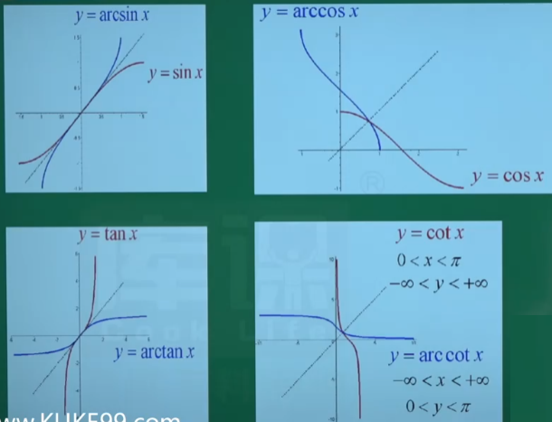

### ①  7. 复合函数的概念

1. 概念
   $y=f[\varphi(x)]$ 可看成由 $y=f(t),t=\varphi(x)$ 复合而成

2. 分解：
   “由外到内”，层层分解

   >eg:
   >
   >1. $y=(x+1)^4:y=t^4,t=x+1$
   >2. $y=\sin x^2:y=\sin t,t=\sin x$
   >3. $y=\ln \cos(x^2+1):y=\ln m,m=\cos n,n=x^2+1$

3. 求函数值
   “由里及外”

   > eg:
   > 设$f(x)=\frac{x}{1+x},g(x)=e^x$,则$f[g(0)]=$____________
   > 解:
   > $g(0)=e^0=1$
   >
   > $f[g(0)]=f(1)=\frac{1}{2}$

### 8. 分段函数的概念

由两个及两个以上的式子分段表达
$y=
\begin{cases}
x^2,x>0\\
x+1,x\leqslant0
\end{cases}$

### 9. 初等函数的概念

由**基本初等函数**经过**有限次四则运算**和**一定的复合**步骤后用**一个式子表达**的函数称为初等函数。
$初等函数
\begin{cases}
基本初等函数\\
四则运算\\
复合
\end{cases}$

> 注：分段函数不是初等函数

## 二. 极限

### ① 1. 极限定义

$2种\begin{cases}
x\rightarrow x_0\\
x\rightarrow \infty
\end{cases}$

1. 当 $x\rightarrow x_0$ 时，函数 $f(x)$ 的极限
   - 当 $x\rightarrow x_0$ 时，$f(x)$无限趋近于一个确定的常数A
     则称A为$f(x)当\ x\rightarrow x_0 $时的极限，记作$\lim\limits_{x\rightarrow x_0}f(x)=A$
   - 左极限与右极限
     左极限 $\lim\limits_{x\rightarrow x_0^-}f(x)=f(x_0^-)=A$
     右极限 $\lim\limits_{x\rightarrow x_0^+}f(x)=f(x_0^+)=A$
     - $\longrightarrow x_0^-\ \ \ x_0^+\longleftarrow $
   - 极限的充要条件
     $\lim\limits_{x\rightarrow x_0}f(x)\Leftrightarrow
     \lim\limits_{x\rightarrow x_0^-}f(x)=
     \lim\limits_{x\rightarrow x_0^+}f(x)=A$
     **极限存在  $\Leftrightarrow$ 左右极限均存在且相等**
2. 当$x\rightarrow \infty$时，函数$f(x)$的极限
   - 当$x\rightarrow \infty $时，$f(x)$ 无限趋近于一个确定的常数A
     则称 $A$ 为 $f(x)当x\rightarrow \infty $ 时的极限，记作$\lim\limits_{x\rightarrow \infty }f(x)=A$
   - 这里没有左右极限一说
     $\lim\limits_{x\rightarrow +\infty }f(x)=A$
     $\lim\limits_{x\rightarrow -\infty }f(x)=A$
   - 充要条件
     $\lim\limits_{x\rightarrow \infty }f(x)\Leftrightarrow
     \lim\limits_{x\rightarrow +\infty}f(x)=
     \lim\limits_{x\rightarrow -\infty}f(x)=A$
3. 常见的极限不存在
   $\begin{cases}
   左极限\not=右极限\\
   \infty \ \ \ 当左右极限都是\infty 时，不管是+\infty还是-\infty我们不习惯写极限不存在，我们习惯写\infty \\
   震荡不存在:如\lim\limits_{x\rightarrow\infty}\sin x
   \end{cases}$
4. 常见的“分左右极限(或分$+\infty,-\infty$)”的情况
   $\begin{cases}
   分段函数：“\geqslant<”或“>=<”,绝对值也属于“\geqslant<”的分段函数\\
   \lim\limits_{\square\rightarrow\infty}a^\square(左右极限不一样) \\
   \lim\limits_{\square\rightarrow \infty}\arctan \square(不常考)
   \end{cases}$

>eg:4. 分段函数 
>eg: $\frac{1}{\infty}=0$
> 
>eg:4. $e^x$
> 

### ①  2. 函数极限的运算

##### 2.1 极限的四则运算法则（有定义直接待入）

设 $\lim\limits_{x\rightarrow\cdot}f(x)=A,\lim\limits_{x\rightarrow\cdot}g(x)=B$ ($\cdot$可以是一个常数也可以是$\infty$) 则

- $$\lim\limits_{x\rightarrow\cdot}[f(x)\pm g(x)]=\lim\limits_{x\rightarrow\cdot}f(x)\pm\lim\limits_{x\rightarrow\cdot}g(x)=A\pm B$$
- $$\lim\limits_{x\rightarrow\cdot}[f(x)\cdot g(x)]=\lim\limits_{x\rightarrow\cdot}\cdot\lim\limits_{x\rightarrow\cdot}g(x)=A\cdot B$$
- $B\neq0时：\lim\limits_{x\rightarrow\cdot}\frac{f(x)}{g(x)}
  =\frac
  {\lim\limits_{x\rightarrow\cdot}f(x)}
  {\lim\limits_{x\rightarrow\cdot}g(x)}
  =\frac{A}{B}$

>有定义直接带入
> 

##### 2.2 $\frac{0}{0}$ 型分解因式、约去零因式求极限

- 方式一：分解因式、约去零因式求极限
  $因式分解
  \begin{cases}
  十字相乘法\\
  平方差公式:a^2-b^2=(a+b)(a-b)\\
  \end{cases}$
- 方式二：可以用[洛必达法则](###① 3. 洛必达法则)  第二章讲

> eg:因式分解
>
>eg:因式分解
>

##### 2.3 分式相减无穷减无穷$(\infty-\infty)$求极限

- 通分、约去零因式

> eg: 
> 

##### 2.4 根式有理化求极限

- 根式有理化

  1. 含$\sqrt{A}-(+)\sqrt{B}\rightarrow 分子分母同乘\rightarrow \sqrt{A}+(-)\sqrt{B}$
  2. 平方差: 新产生的根号直接带入

  > eg: 平方差: 新产生的根号直接带入
  >
  >
  > eg: 平方差: 新产生的根号直接带入
  >
  >eg: 平方差: 新产生的根号直接带入
  >

#####  ①  2.5 $\frac{\infty}{\infty} $型，抓大头

- 分子分母同抓最大项

  - 分子次幂比分母高，为$\infty$
  - 分子次幂比分母低，为$0$

  > - 遇到有界函数可以忽略

  > eg: 抓大头
  >  
  > eg: 抓大头
  > 
  > eg: 抓大头
  > 
  > eg: 抓大头
  > 
  > eg: 抓大头
  > 
  > eg: 抓大头
  > 
  >
  > 

### ① 3. 两个重要极限

#### 3.1 第一重要极限

$\lim\limits_{x\rightarrow0}\frac{\sin x}{x}=1$ 之后会学等价 $\sin x \Rightarrow x$

- 变形：$\lim\limits_{\square\rightarrow0}\frac{\sin \square}{\square}=1$

> 
>

#### 3.2 第二重要极限

$\lim\limits_{x\rightarrow0}(1+x)^\frac{1}{x}=e$

- 变形：$\lim\limits_{\square\rightarrow0}(1+\square)^\frac{1}{\square}=e$

- 本质：**$1^\infty$型**

- 特点：有**“1”，“+”和“倒数”**形式

- 小题套结论：$\lim[1+f(x)]^{g(x)}=e^{\lim f(x)g(x)}$

- 答题方法
  1. 判断特点：
     - 整体是$1^\infty$型
     - 有没有$(1+x)^\frac{1}{X}$，即1和倒数关系
  2. 凑$\lim\limits_{\square\rightarrow0}(1+\square)^\frac{1}{\square}=e$

> eg：凑第二重要极限
> 
> eg:
> 
> eg：
> 
> eg：①
> 
> eg:
> eg：大题最少要有这几步：
> 
> eg：已知极限，反求参数
> 

### (了解)4. 数列极限的定义及其运算

- 不是很重要，但也出过题

#### 4.1 数列极限的定义

- 对于数列${x_n}$，
  若**当n无线增大时**，$x_n$**无限接近与一个确定的常数A,**
  则称当n趋于无穷大时，${x_n}$以A为极限
  或称${x_n}$**收敛**于$A$
  记作$\lim\limits_{n\rightarrow\infty}=A$
  或者$a_n\rightarrow A(n\rightarrow\infty)$（这种方式不用管 删掉或不常用）
- 有极限的数列称为收敛数列，否则成为发散数列

> 注：数列中$n\rightarrow\infty$仅指$n\rightarrow+\infty$

#### 4.2 数列极限的运算

- 四则运算法则
  
- 抓大头
  
- 重要极限
  

#### 4.3 夹逼准则(不重要)

- 定理：$\left[  \begin{matrix} 若&y_n&\leqslant &x_n&\leqslant& z_n\\
  &\lim_{y_n}&\leqslant&\lim_{x_n}&\leqslant&\lim_{z_n}\\
  &\downarrow&&&&\downarrow\\
  &A&\Rightarrow&A&\Leftarrow&A&求出的极限\\
  &\infty&\Rightarrow&\infty&\Leftarrow&\infty(同号无穷大)&求出的极限\end{matrix}  \right]\\$

eg：

#### 4.4 单调有界准则

- 单调有界的数列必有极限(收敛)

### ① 5. 无穷小量与无穷大量

#### 5.1 定义

1. 无穷小：
   若$\lim\limits_{x\rightarrow\square}f(x)=0$,则称$f(x)$是当$x\rightarrow\square$时的无穷小
2. 无穷大:
   若$\lim\limits_{x\rightarrow\square}f(x)=\infty$,则称$f(x)$是当$x\rightarrow\square$时的无穷大

#### 5.2 两者关系

在同一极限过程中

- 若$f(x)$为无穷小，且$f(x)\neq0$,则$\frac{1}{f(x)}$为无穷大
- 若$f(x)$为无穷大，且$f(x)\neq0$,则$\frac{1}{f(x)}$为无穷小

> 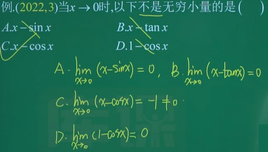

#### 5.3 无穷小量的性质

- 有限个无穷小的代数和仍为无穷小
  - 无穷个无穷小的代数和为1
    
- **无穷小与有界函数的积仍为无穷小**
  即$0*有界=0$
  
- 常数与无穷小之积仍为无穷小
- 有限个无穷小之积仍为无穷小

### ① 6. 无穷小的比较

#### 6.1 定义

就是比谁更小一些
设在同一个自变量的变化过程中有
$\lim\alpha(x)=0,\lim\beta=0$
$\lim\frac{\alpha(x)}{\beta(x)}=
\begin{cases}
0,\alpha(x)是\beta(x)的高阶无穷小\\
\infty,\alpha(x)是\beta(x)的低阶无穷小\\
C(\neq0),\alpha(x)是\beta(x)的同阶无穷小\\
1,\alpha(x)是\beta(x)的等阶无穷小.\alpha(x)\sim\beta(x)\\
\end{cases}$

#### 6.2 常见的等价无穷小

- 当$x\rightarrow0$时**(必计)**

  - $\sin x,\tan x,\arcsin x,\arctan x\sim x$
  - $e^x-1\sim x,\ln (1+x)\sim x$
  - $1-\cos x\sim\frac{1}{2}x^2$
  - $(1+x)^a-1\sim \alpha x,\sqrt{1+x}-1\sim\frac{1}{2}x$

  > 注：
  >
  > - 上述$x$均可替换为$\square$
  > - 前提$\square$趋于零
  > - 等价替换**乘除可用，加减不可用**
  >   eg:
  >   

>eg：
>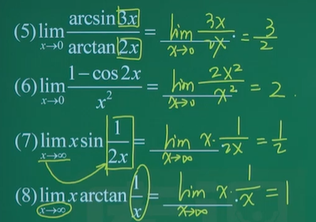
>eg：
>
>eg：
>

#### 6.3 无穷小的比较

方法

1. 常见的**等价后**比较次幂（等价法）  [常见等价无穷小](####6.2 常见的等价无穷小)

   - **次幂**越高，阶数越高
   - 次幂相同
     - 同阶系数不同，同阶非等价
     - 同阶系数相同，等价无穷小

2. 非常见的按定义（定义法）[定义](####6.1 定义)

>  eg：
> 
> eg：
> 

#### 6.4 已知等价，反求参数

- 常见的等价后次幂和系数需一样

- 非常见的按等价定义$\lim\frac{\alpha(x)}{\beta(x)}=1$

>eg：
>

### 特殊总结

#### $\sin\square$

 

[ 常见的等价无穷小](####6.2 常见的等价无穷小)

## 三. 连续

### ① 1. 函数的连续性

#### 1.1 定义

- 连续

  若$\lim\limits_{x\rightarrow x_0}f(x)=f(x_0)$,称$f(x)$在点$x_0$处连续
  即“**函数值=极限值**”

  即$\lim\limits_{x\rightarrow x_0^-}f(x)=\lim\limits_{x\rightarrow x_0^+}f(x)=f(x_0)$
  即“左极限=右极限=函数值”

- 左连续：$\lim\limits_{x\rightarrow x_0^-}f(x)=f(x_0)$
  右连续：$\lim\limits_{x\rightarrow x_0^+}f(x)=f(x_0)$

- 连续的充要条件

  $f(x)在x_0除连续$
  $\Leftrightarrow f(x)$在$x_0$处左连续且右连续
  $\Leftrightarrow \lim\limits_{x\rightarrow x_0^-}f(x)=\lim\limits_{x\rightarrow x_0^+}f(x)=f(x_0)$

  > 注：极限值和函数值本身无任何关系

#### 1.2 定理

- 若$f(x),g(x)$连续，则他们的和差商积也连续
- 一切初等函数(在专升本阶段除了分段函数其余的都是初等函数)在定义区间内必连续

#### 1.3 分段函数

$分段函数\begin{cases}
在各个分段区间上连续\\
分断点处的连续性不确定\end{cases}$

##### 1.3.1 判断分段函数在分段点出的连续性

$一般情况下\begin{cases}"\neq="\ \ \ 极限=?=函数值\\
"\geqslant<"或">=<"\ \ \  左=?=右=?=函数值\end{cases}$

> eg：
> 
> eg：
> 

##### 1.3.2 已知连续，反求参数

$一般情况下\begin{cases}"\neq="\ \ \ 极限=函数值\\
"\geqslant<"或">=<"\ \ \  左=右=函数值\end{cases}$

> eg:
> 
> eg：
> 
> eg：
> 
> eg：
> 

### ① 2. 函数的间断点

#### 2.1 定义

不连续的点

$间断点只讨论\begin{cases}无定义点\ \ 必间断\\
分段点\ \ 未必间断\end{cases}$

#### 2.2 间断点个数的判别

一般常见$\frac{h(x)}{g(x)}$分式
方法： **求出定义域，找出无定义的点**

> eg：
> 
> eg：
> 
> eg：
> 

#### ① 2.3 间断点的分类

1. 第一类间断点：左右极限均存在

   - **跳跃间断点**：$左\neq右$
   - **可去间断点**：$\frac{左=右}{(极限存在)}$且$\begin{cases}\neq函数值\ 或\\
     无定义\end{cases}$

2. 第二类间断点：左右极限至少有一个不存在

   - 无穷间断点：左或右$=\infty$

   - 振荡间断点：极限振荡不存在

     > eq：$y=\sin^n\frac{1}{x}$或$\cos^n\frac{1}{x}$在$x=0$处

3. 方法：求极限或左右极限(因题而异)
   常见的“分左右极限”的情况

   - 分段函数"$\geq<$"

     > 注：$|\square|$,绝对值函数也是分段函数

   - $\lim\limits_{\square\rightarrow\infty}a^\square$

   - $\lim\limits_{\square\rightarrow\infty}\arctan \square$

> eg：
> 
> eg：
> 
> eg：
> 
> eg：
> 
> eg：
> 
> eg：
> 
> eg：
> 
> eg：
> 
> eg：
> 

### ① 3. 闭区间上连续函数的性质

#### 3.1 最值定理

若$f(x)$在$[a,b]$上连续，
则$f(x)$在$[a,b]$上必有最大值和最小值

#### ① 3.2 零点定理

> 有等号没有导数

##### 1. 内容

- 条件：$若f(x)满足\begin{cases}[a,b]上连续\ 且\\
  f(a)\cdot f(b)<0\end{cases}$
- 结论：$则\exists\zeta\in(a,b),使得f(\zeta)=0$

 

##### 2. 利用零点定理证明方程根的存在性

解题步骤：

1. 移项
   方程右边为0.$(\zeta\rightarrow x)$
   构造辅助函数：令$f(x)=方程的左边$

2. 验证零点定理的两个条件

   $\begin{cases}[a,b]上连续\\
   f(a)\cdot f(b)<0\end{cases}$

3. 由零点定理得直接结论

4. 回归证明题干

> eg：
> 
> eg：
> 
> eg：
> 
> eg：
> 

# Ⅱ. 一元函数微分学

## 一. 导数与微分

### ① 1. 导数的定义

#### 1.1 定义

若极限$\lim\limits_{\Delta x\rightarrow 0}\frac{\Delta y}{\Delta x}=\lim\limits_{\Delta x\rightarrow 0}\frac{f(x_0+\Delta x)-f(x_0)}{\Delta x}$存在，
则称函数$y=f(x)$在点$x_0$处可导，
称这个极限为函数$y=f(x)$在点$x_0$处的导数，记作$f'(x_0),y'|_{x=x_0},\frac{dy}{dx}|_{x=x_0}$

#### 1.2 两种定义式

- 定义式一：$f'(x_0) =\lim\limits_{\Delta x\rightarrow0}\frac{f(x_0+\Delta x)-f(x_0)}{\Delta x}$
  	广义化：$f'(x_0)=\frac{f(x_0+\square x)-f(x_0)}{\square x}$
  凑导数定义求极限或求导（有结论）
- 定义式二  ：$f'(x_0)=\lim\limits_{\Delta x\rightarrow x_0}\frac{f(x)-f(x_0)}{x-x_0}$
  分段函数在分断点处“$=\neq$”时必须用定义式2（不用分左右极限）

> 注：导函数记作$f'(x),y'，\frac{dy}{dx}$

#### 1.3 单侧导数

* 左导数
  $f_-'(x_0)=定义式一\lim\limits_{\Delta x\rightarrow0^-}\frac{f(x_0+\Delta x)-f(x_0)}{\Delta x}=定义式二\lim\limits_{\Delta x\rightarrow x_0^-}\frac{f(x)-f(x_0)}{x-x_0}$
* 右导数
  $f_+'(x_0)=定义式一\lim\limits_{\Delta x\rightarrow0^+}\frac{f(x_0+\Delta x)-f(x_0)}{\Delta x}=定义式二\lim\limits_{\Delta x\rightarrow x_0^+}\frac{f(x)-f(x_0)}{x-x_0}$

> 注：分段函数在分断点处$\geq<$用单侧导数定义式二(分左右导数)

#### 1.4 可导的充要条件

函数$y=f(x)$在点$x_0$处可导 $\Leftrightarrow$ 左右导数均存在且相等

#### 1.5 题型一：利用导数定义判断函数可导性

 

eg：$=\neq$

eg：$\leqslant>$

 

#### 1.6 题型二：凑导数定义求极限或求导

- $f'(x)=\lim\limits_{\square x\rightarrow0}\frac{f(x_0+\square x)-f(x_0)}{\square x}$

- 结论**(去 f 乘导法)**：
  已知$f'(x_0)$存在
  $\lim\limits_{h\rightarrow0}\frac{f(x_0+ah)-f(x_0+bh)}{ch}=\frac{a-b}{c}f'(x_0)$

  >  

> 1.结论 
> 
>
> 2.结论
> 
>
> 3.凑 || 结论
> 

### 2. 可导与连续的关系

- 可导$\Rightarrow$连续
  (**可导一定连续，连续不一定可导**)

  > 注：尖点不可导, 必须是光滑的优美的曲线可导
  >
  > 例：$y=|x|$在x=0处连续但不可导
  > 

- 结论
  $y=|x-a|$在$x=a$处连续但不可导

- 可导$\Rightarrow$连续$\Rightarrow$极限存在

### ① 3. 导数的公式

1. 基本初等函数的导数公式

   - $(C)'=0\ \ (C为常数)$ 

   - $(x^n)'=n x^{n-1}$

     > $(x)'=1, (\frac{1}{x})'=-\frac{1}{x^2},(\sqrt{x})'=\frac{1}{2\sqrt{x}}$

   - $(\log_ax)'=\frac{1}{x\ln_a}$

     > $(\ln x)'=\frac{1}{x}$

   - $(a^x)'=a^x\ln a$

     > $(e^x)'=e^x$

   ---

   -  $(\sin x)'=\cos x$
   - $(\cos x)'=-\sin x$

   ---

   - $(\tan x)'=\sec^2x$ ①
   - $(\cot x)'=-\csc^2x$

   ---

   - $(\sec x)'=\sec x·\tan x$ ①
   - $(\csc x)'=-\csc x·\cot x$

   ---

   - $(\arcsin x)'=\frac{1}{\sqrt{1-x^2}}$ ①
   - $(\arccos x)'=-\frac{1}{\sqrt{1-x^2}}$

   ---

   - $(\arctan x)'=\frac{1}{{1+x^2}}$ ①
   - $(arccot\ x)'=-\frac{1}{{1+x^2}}$

2. 导数的四则运算法则

   - $(a\pm b)'=a'\pm b'$
   - $(ab)'=a'b+ab'$
   - $(Ca)'=Ca'\ (C为常数)$
   - $(\frac{a}{b})'=\frac{a'b-ab'}{b^2}\ (b\neq0)$

> 1.

### ① 4. 导数的几何意义

1. $f'(x_0)$：在几何上表示$y=f(x)$在点$(x_0,y_0)$处的**切线斜率**

2. 切线斜率：$f'(x_0)$又过$(x_0,y_0)$
   切线方程(点斜式)：$y-y_0=f'(x_0)·(x-x_0)$

3. 法线斜率：$-\frac{1}{f'(x_0)}$；又过$(x_0,y_0)$
   法线方程(点斜式)：$y-y_0=-\frac{1}{f'(x_0)}·(x-x_0)$

   > 注：法线与切线互相垂直，斜率相乘为-1

> 1.
>
> 2.

### ① 5. 复合函数求导

 定理：若$y=f(u)$与$u=u(x)$复合成$y=f[u(x)]$,
则$\frac{dy}{dx}=\frac{dy}{du}·\frac{du}{dx}$

> 注：$(复合函数)'_x=(复合函数)'_{中间变量}·(中间变量)'_x$

> 1.
>
> 2.
>
> 3.
>
> 4.
>
> 5.

### ① 6. 求高阶导数

#### 6.1 定义

二阶及二阶以上的导数

#### 6.2 各阶导数符号记法

一阶导：$y',f'(x),\frac{dy}{dx}或\frac{df(x)}{dx}$
二阶导：$y'',f''(x),\frac{d^2y}{dx^2}或\frac{d^2f(x)}{dx^2}$
三阶导：$y''',f'''(x),\frac{d^3y}{dx^3}或\frac{d^3f(x)}{dx^3}$

四阶导：$y(4),f^{(4)}(x),\frac{d^4y}{dx^4}或\frac{d^4f(x)}{dx^4}$
$\ \ \ \vdots$
n 阶导：$y^{(n)},f^{(n)}(x),\frac{d^ny}{dx^n}或\frac{d^nf(x)}{dx^n}$

#### 6.3 求高阶导数的一般方法：

- 简单的($n\leqslant4$)
  - 直接逐步求导
- 阶数比较高的
  - n 阶导数公式
  - 求出前几阶导，总结规律

#### 6.4 常见的n阶导数公式

1. $(a^x)^{(n)}=(\ln a)^na^x$
   $(e^x)^{(n)}=e^x$
   $(e^{ax+b})^{(n)}=a^ne^{ax+b}$
2. $(x^n)^{(n)}=n!$
   $(x^n)^{(m)}=0\ \ (正整数m>n)$
3. $(\sin x)^{(n)}=\sin(x+n·\frac{\pi}{2})$
   $(\cos x)^{(n)}=\cos(x+n·\frac{\pi}{2})$

> 1.
>
> 2.
>
> 3.
>
> 4.
>
> 5.
>
> 6.

### ① 7. 隐函数求导

#### 7.1 定义

显函数：$y=f(x)$
隐函数：$F(x,y)=0(由\cdots所确定的隐函数)$

#### 7.2 方法

- 方法一：方程两边同时对x求导，解出$y'$

  > 注：始终把y当作x的函数

- 方法二：公式法

  1. 移项，令方程右边为0，
     令$F(x,y)=方程的左边$
  2. 求出偏导$F_x,F_y$
  3. 套公式：$\frac{dy}{dx}=-\frac{F_x}{F_y}$

> 1.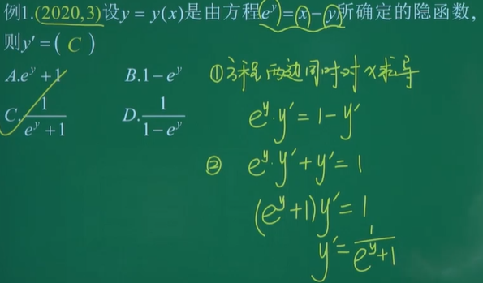
>
> 2.
>
> 3.
>
> 4.
>   

### ① 8. 对数求导法

#### 8.1 适用范围

1. **幂指函数**$[u(x)]^{v(x)}$ 利用$\ln u^v=v\ln u$
2. 形如$y=n\sqrt{\frac{f(x)}{g(x)}}/y=\frac{f(x)g(x)}{h(x)}$
   含乘、除、乘方、开方较多的函数 利用$\ln uv=\ln u\cdot\ln v$

#### 8.2 幂指函数求导（重要）

- 方法一：**对数求导法**（先取对数函数再求导）
      利用$\ln u^v=v\ln u$
- 方法二：化为以e为底的指数函数后再求导（$y=u^v=e^{v\ln u}$)

> 1.
>
> 2.

#### 8.3 含乘、除、乘方、开方较多的函数

含乘、除、乘方、开方较多的函数$\rightarrow$对数求导法
利用$\ln uv=\ln u\cdot\ln v$

eg：求函数$y=x^2\cdot\sqrt[3]{\frac{1-x}{1+x}}$的导数$\frac{dy}{dx}$

> 

### ① 9. 参数方程求导

1. 参数方程：$\begin{cases}x=x(t)\\y=y(t)\end{cases},t为参数$
2. 求导公式
   $\frac{dy}{dx}=\frac{dy/dt}{dx/dt}=\frac{y'(t)}{x'(t)}$
   $\frac{d^2y}{dx^2}=\frac{d(\frac{dy}{dx})/dt}{dx/dt}=\frac{(\frac{y'(t)}{x'(t)})'}{x'(t)}$

> 1.一阶导
> 
>
> 2.二阶导
> 

### ① 10. 微分的计算

1. 函数$y=f(x)$的微分：$dy=y'dx$
2. 求微分的方法：先求导，再乘以$dx$
3. 对于一元函数
   可微$\Leftrightarrow$可导$\Rightarrow$连续$\Rightarrow$极限存在

> 1.
>
> 2.

## 二.  微分中值定理和导数的应用

### ① 1. 罗尔定理

> 有等号有导数

#### 1. 内容

- 条件：
  $若f(x)满足\begin{cases}[a,b]上连续\\
  (a,b)内可导\\
  f(a)=f(b)\end{cases}$
- 结论：
  $则\exists\zeta\in(a,b),使f'(\zeta)=0$
- 几何意义
  若满足条件，则至少存在一条平行于x轴的切线(即$k_切=0$)
    

#### 2. 证明

1. 题眼：有等号有导数 $f'(x)=\square$

2. 构造辅助函数(重要)
   右移成0，找左边求导之前的函数
   A. 直接观察
   B. **互导形式**
   $\begin{cases}f(\zeta)g'(\zeta)+f'(\zeta)g(\zeta)=0,设F(x)=f(x)g(x)\\
   f(\zeta)g'(\zeta)-f'(\zeta)g(\zeta)=0,设F(x)=\frac{f(x)}{g(x)}，或\frac{g(x)}{f(x)},让不为0的在分母上\end{cases}$
   C. 总公式：$f'(\zeta)+g'(\zeta)f(\zeta)=0,设F(x)=f(x)\cdot e^{g(x)}$

3. 找端点

   1. 有提示
   2. 零点定理
   3. 积分中值定理

   >chatgpt 问答
   >
   >- 问：
   >  为什么$f'(\zeta)+g'(\zeta)f(\zeta)=0$,要设$F(x)=f(x)\cdot e^{g(x)}$
   >
   >- 答：
   >  设 $F(\zeta) = f(\zeta) e^{g(\zeta)}$ 是为了利用乘积法则，将原方程改写为：
   >   $$F'(\zeta) = f'(\zeta) e^{g(\zeta)} + f(\zeta) g'(\zeta) e^{g(\zeta)} = 0$$
   >   这样，我们就得到了一个一阶常微分方程，可以直接进行求解：
   >   $$F(\zeta) = C$$
   >   其中 $C$ 是常数。将 $F(\zeta) = f(\zeta) e^{g(\zeta)}$ 代入，就可以得到 $f(\zeta) e^{g(\zeta)} = C$。我们可以将其写成 $f(\zeta) = C e^{-g(\zeta)}$，然后对其求导，得到：
   >   $$f'(\zeta) = -C g'(\zeta) e^{-g(\zeta)}$$
   >   将其代入原方程，得到：
   >   $$-C g'(\zeta) e^{-g(\zeta)} + g'(\zeta) C e^{-g(\zeta)} = 0$$
   >   化简得到：
   >   $$f'(\zeta) + g'(\zeta) f(\zeta) = 0$$
   >   因此，我们设 $F(x) = f(x) e^{g(x)}$，可以将原方程改写为 $F'(\zeta) = 0$，从而得到一阶常微分方程，简化了求解过程。

   > 如
   >
   > 1. $f(\zeta)+\zeta f'(\zeta)=0,\ \ 设F(x)=xf(x)$
   > 2. $2f(\zeta)+\zeta f'(\zeta)=0\rightarrow两边同乘\zeta\\\rightarrow
   >    2\zeta f(\zeta)+\zeta^2f'(\zeta)=0,\ \ 设F(x)=x^2f(x)$

#### 3.  步骤

1. 构造辅助函数

   >1. 将 $\zeta$ 换为 $x$
   >2. 移项，使等式的一端为 $0$
   >3. 构造辅助函数，即左边一端的原函数(求导之前的函数)

2. 验证罗尔定理的 3 个条件

   > $\begin{cases}[a,b]上连续\\
   > (a,b)内可导\\
   > f(a)=f(b)\end{cases}$

3. 由罗尔定理得直接结论

4. 回归到题目得结论

> 1.罗尔定理 乘法
> 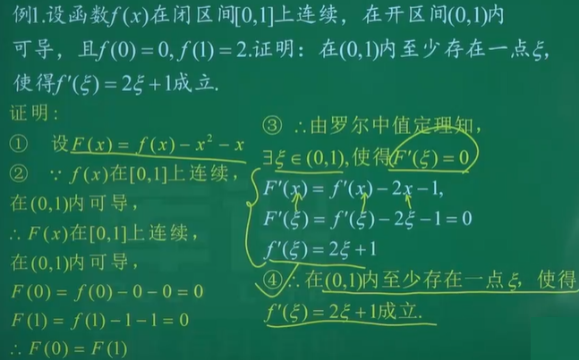
>
> 2.零点定理&罗尔定理&第二问用第一问的部分结论
> 
>
> 3.罗尔定理 除法
> 
>
> 4.罗尔定理 凑互导 乘法
> 
>
> 5.罗尔定理 凑互导  除法
>  
>
> 6.罗尔定理 总公式
>
>  
>
> 7.罗尔定理 凑互导(tan) 乘
>  

###  ① 2. 拉格朗日中值定理

> 双边不等式

#### 1. 内容

- 条件
  若$f(x)$满足$\begin{cases}[a,b]上连续\\
  (a,b)内可导\end{cases}$
- 结论
  则$\exists\zeta\in(a,b),使f'(\zeta)=\frac{f(b)-f(a)}{b-a}$

#### 2. 几何意义

若满足条件，则至少存在一条平行于端点直线的切线(即$k_切=k_端$)
  

#### 3. 拉格朗日中值定理作证明

- 题眼：两种题型

  - 题型一：含**同一函数差**的不等式（一般多为**双边不等式**）

    > eg：
    > 同一函数差：
    >
    > - 函数$f(x)=e^x$
    > - 差$e^a-e^b$

  - 题型二：双中值问题（一般考存在两个不同的点$\zeta_1,\zeta_2)$

- 步骤

  - 题型一：含同一函数差的不等式（双边）证明步骤
    1. 构造辅助函数$f(x)$
       将**中间**部分写成**差的形式**，确定$f(x)$及区间$[a,b]$
    2. 验证拉格朗日中值定理的两个条件
    3. 利用拉格朗日中值定理的结论得到等式
    4. 利用$\zeta$或$f'(\zeta)$的取值范围得到不等式
  - 题型二：双中值问题（一般考存在两个不同的点$\zeta_1,\zeta_2)$
    1. 将区间$[a,b]$分成两个不同的小区间$[a,c]$和$[c,b]$，分别使用拉格朗日中值定理
    2. c 点(断开点)的选择
       (重点)证明"直接"加或乘的等式
       - 有提示，从提示点处断开
       - 无提示，一般是中点处断开

> 1.拉格朗日中值定理(双边不等式)
>
> 2.零点定理&双中值问题(存在两个不同的点$\zeta_1,\zeta_2)$)
> 
> 
>
> 3.罗尔定理&双中值问题(存在两个不同的点$\zeta_1,\zeta_2)$)
> 
> 
>
> 4.
>  

### ① 3. 洛必达法则

[变上限积分与洛必达结合求极限](####2.3 变上限积分与洛必达结合求极限)

#### 3.1 内容

前提：$\frac{0}{0}型或\frac{\infty}{\infty}型$

$\lim\limits_{x\rightarrow·}\frac{f(x)}{g(x)}=\lim\limits_{x\rightarrow·}\frac{f'(x)}{g'(x)}$
$A(\infty)\Leftarrow若A(\infty)$
若非A或$\infty$，则洛必达失效

#### 3.2 洛必达法则求极限步骤

1. 化简先行(等价代换,根式有理化)
2. 判别类型(7种未定式)
   $\frac{0}{0},\frac{\infty}{\infty},\infty·0,\infty-\infty,\infty^0,0^0,1^\infty$
3. 使用洛必达法则
   用一步验证一步,若仍为$\frac{0}{0}或\frac{\infty}{\infty}型$,
   可继续洛必达;否则不可再用洛必达.

##### 3.2.1 $\frac{0}{0}或\frac{\infty}{\infty}$：直接使用洛必达

> 1.洛必达法则$\frac{0}{0}型$
> 
>
> 2.洛必达法则$\frac{0}{0}型$
> 
>
> 3.洛必达法则$\frac{0}{0}型$
> 
>
> 4.多次使用洛必达法则$\frac{0}{0}型$
> 
> 5.洛必达法则$\frac{\infty}{\infty}型$
> 

##### 3.2.2 $0·\infty$: 化为$\frac{0}{0}$或$\frac{\infty}{\infty}$

$\infty·0$

- $\frac{0}{\frac{1}{\infty}}=\frac{0}{0}$
- $\frac{\infty}{\frac{1}{0}}=\frac{\infty}{\infty}$

注：对于$0·\infty$型，简单的因式放分母上

- 简单：x   复杂：$\ln x$

> $0·\infty$型
> 

##### 3.2.3$\infty-\infty$ $\infty-\infty$: 有分母先通分

> $\infty-\infty$型 
> 
> 

##### 3.2.4 $0^0,\infty^0$ 幂指函数

幂指函数 $a^b=e^{\ln a^b}=e^{b\ln a}$
公式：$\lim a^b=e^{\lim b\ln a}$

> $0^0$
>
> $\infty^0$
> 

##### 3.2.5 $1^\infty$: 凑第二重要极限

[第二重要极限](####3.2 第二重要极限)

$1^\infty$型

- 1
- +号
- 倒数关系

$\lim\limits_{x\rightarrow0}(1+x)^\frac{1}{x}=e$

 

### ① 4. 函数的单调性

#### 4.1 定义

  $\forall x_1<x_2$

- 若$f(x_1)<f(x_2)$，则称$f(x)$单调递增
- 若$f(x_1)>f(x_2)$，则称$f(x)$单调递减

#### 4.2 一阶导判断单调性

$\begin{cases}f'(x)>0\Rightarrow f(x)单调递增\\
f'(x)<0\Rightarrow f(x)单调递减\end{cases}$

> 特殊情况(如果单选遇到$[5,+\infty)和(5,+\infty)$)
>
> $\begin{cases}f'(x)>0\Rightarrow f(x)严格单调递增\\
> f'(x)\geqslant0\Rightarrow f(x)单调递增\end{cases}$
>
> 当问单调递增区间就选$[5,+\infty)$
> 当问严格单调递增区间就选$(5,+\infty)$
>
> 一般不区分得这么细

> 1.
>
> 2.

#### 4.3 求单调区间

单调增区间：定义域与$f'(x)>0$的交集
单调减区间：定义域与$f'(x)<0$的交集

### ① 5. 利用单调性做证明

#### 5.1 题型一——证明单边函数不等式问题

- 题眼：单边(无函数差)不等式

- 步骤

  1. 移项，构造辅助函数

  2. 求导，判断单调性

     > 若一阶导不能判断，继续求导，直至能判断为止(最多求三阶导)

  3. 结合区间端点，利用单调性定义完成不等式的证明

1.

2.

3.

4.求二阶导

#### 5.2 题型二——零点定理+单调性证明根的唯一性

> 证明只有一个实根

1. 题眼：唯一性+单调性证明根的唯一性
2. 步骤
   1. 零点定理证明至少有一个实根
   2. 单调性证明至多有一个实根
   3. 综上有且仅有一个实根

1.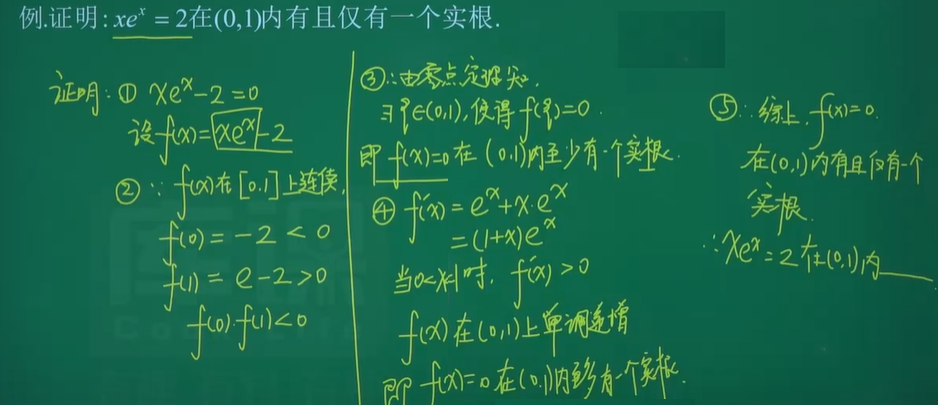

### ① 6. 函数的极值问题

#### 6.1 极值的定义

对于$x_0$附近，若
$\begin{cases}f(x)<f(x_0)\Rightarrow f(x_0)极大值，x=x_0极大值点\\f(x)>f(x_0)\Rightarrow f(x_0)极小值，x=x_0极小值点\end{cases}
$

> 注：极值点写法$x=x_0$

极值点可能有多个，是指一个小范围内最大或最小的值
最值点只有一个

> 

#### 6.2 驻点

一阶导数等于0的点

> 注：驻点写法：$x=x_0$

> 

#### 6.3 极值点可能在哪儿取得

$极值点可能在\begin{cases}驻点(f'(x)=0)\\
一阶不可导点(f'(x_0)不存在)\end{cases}处取得$

> 注：$极值点!\Leftrightarrow驻点\begin{cases}极值点不一定是驻点，还有可能是一阶不可导点\\
> 驻点不一定是极值点\end{cases}$

#### 6.4 极值的必要条件

可导函数的极值点必为驻点

$可导+极值点\Rightarrow驻点$

#### 6.5 极值的第一判定法

- 设$f(x)$在$x_0$处连续，且在$x_0$附近($x_0$处可除外)可导

- 若在点$x_0$两侧

  1. $x<x_0,f'(x)>0$
     $x>x_0,f'(x)<0\Leftrightarrow极大值$
  
     > 先增后减极大值
  
  2. $x<x_0,f'(x)<0$
     $x>x_0,f'(x)>0\Leftrightarrow极小值$
     
     > 先减后增极小值
  
  > 注：
  > $x_0$两侧$f'(x)$异号，$f(x_0)$是极值
  > $x_0$两侧$f'(x)$同号，$f(x_0)$不是极值
  >

#### 6.6 极值的第二判定法

若$f(x)$在$x_0$处二阶可导
$f'(x_0)=0,f''(x_0)\neq0\Leftrightarrow f(x_0)是极值，x_0为极值点$
且$\begin{cases}f''(x_0)>0\Rightarrow极小值\\
f''(x_0)<0\Rightarrow极大值\end{cases}$

- 翻译成文字就是
  在驻点处的
  二阶导数不是0，则$x_0$为极值点，$f(x_0)$为极值，
  二阶导数大于0，$f(x_0)$为极小值，
  二阶导数小于0，$f(x_0)$为极大值，

> 注：
>
> - 判别法一是看两侧的
> - 判别法二是盯着一点看的

1.

2.

#### 6.7 求函数极值的一般步骤

1. 确定定义域;
2. 找出可疑点（**驻点和一阶不可导点**)
3. - 方法一: 第一判别法（**万能**)
     将可疑点作为分点（列表）讨论$f'(x)$的正负，
     确定极值(单调区间和极值).
   - 方法二: 第二判别法
     若可疑点只有驻点,可利 用第二判别法求极值.

1.第二判别法

2.第二判别法

3.第一判别法

4.第一判别法 同时求单调区间和极值

5.第一判别法

#### 6.8 函数的凹凸性和拐点

##### 6.8.1 凹凸性定义

##### 6.8.2 判定凹凸性

二阶导判定凹凸性
$f''(x)>0\Rightarrow f(x)凹$
$f''(x)<0\Rightarrow f(x)凸$

> 简称大凹小凸
> eg:
> eg:

##### 6.8.3 求凹凸区间

凹区间：$f''(x)>0$与定义域的交集
凸区间：$f''(x)<0$与定义域的交集

> 

##### 6.8.4 拐点: 凹凸分界点

$x_0$两侧二阶导变号$\Rightarrow (x_0, y_0)$为拐点

> 注：如$x_0$左右两侧$f''(x)$不变号，则$(x_0,y_0)$一定不是拐点

##### 6.8.5 拐点可能是

拐点可能是$\begin{cases}二阶导等于0(f''(x_0)=0)\\
二阶不可导点(f''(x)不存在)\end{cases}$

> 注：拐点   $!\rightleftharpoons   二阶导等于0
> $\begin{cases}拐点不一定是二阶导等于0\\
> 二阶导等于0不一定是拐点\end{cases}$

##### 6.8.6 $二阶可导+拐点\Rightarrow f''(x_0)=0$

$二阶可导+拐点\Rightarrow f''(x_0)=0$

> eg: 

##### 6.8.7 求拐点(或凹凸区间和拐点)的步骤

1. 确定定义域
2. 找出可疑点($f''(x)=0$和二阶导不存在的点)
3. 可疑点两边二阶导异号即为拐点

> 注：若求凹凸区间和拐点，将可疑点作为分点(列表)讨论$f''(x)$的正负，确定凹凸区间和拐点
> 凹、凸区间有两个时不能用"$\bigcup$"要用"**和**"或者"**,**"
>
> eg:
> eg: 

#### 6.9 函数的渐近线

##### 6.9.1 水平渐近线

若$\lim\limits_{x\rightarrow\infty或x\rightarrow+\infty或x\rightarrow-\infty}y(x)=A$，则$y=A$为水平渐近线

> 

##### 6.9.2 垂直渐近线(铅直)

若$\lim\limits_{x\rightarrow x_0或x\rightarrow x_0^+或x\rightarrow x_0^-}y(x)=\infty$，则$x=x_0$垂直(铅直)渐近线

> 注：$x_0$一般是$\begin{cases}无定义点\\
> 定于区间的端点(开区间)\end{cases}$

>

> eg: 
> eg:

### 7. 函数的最值问题

> 这几年没有考过，但前些年分考过

1. 求给定区间上连续函数的最值

   > 考的非常少

   方法:

   1. 求出区间内驻点、不可导点;
   2. 求出各驻点、不可导点、区间端点处函数值;
   3. 比较各函数值，其中最大的为最大值，最小的为最小值.
      

   ---

2. 应用题：求实际问题中的最值
   步骤

   1. 建立目标函数;
   2. 求驻点;
   3. 求驻点处的二阶导,说明是极大（小）值点;
   4. 由实际问题知,必存在最值,且极值点唯一,所得大(小）值点即最大（小）值点;
   5. 回归到问题,说结论.

1.

2.

### ① 8. 函数的凹凸性和拐点

#### 8.1 函数的凹凸性

定义

 

---

判定凹凸性

二阶导判定凹凸性
$f''(x)>0\Rightarrow f(x)凹$
$f''(x)<0\Rightarrow f(x)凸$

- 简称大凹小凸
  

> 1.
> 
>
> 2.
> 

----

求凹凸区间

凹区间：$f''(x)>0$与定义域的交集
凸区间：$f''(x)<0$与定义域的交集

> 

#### 8.2 函数的拐点

拐点: 凹凸分界点

$x_0$两侧二阶导变号$\Rightarrow (x_0, y_0)$为拐点

> 注：如$x_0$左右两侧$f''(x)$不变号，则$(x_0,y_0)$一定不是拐点

---

拐点可能是$\begin{cases}二阶导等于0(f''(x_0)=0)\\
二阶不可导点(f''(x)不存在)\end{cases}$

> 注：拐点   $!\rightleftharpoons   二阶导等于0
> $
> $\begin{cases}拐点不一定是二阶导等于0\\
> 二阶导等于0不一定是拐点\end{cases}$

----

$二阶可导+拐点\Rightarrow f''(x_0)=0$

$二阶可导+拐点\Rightarrow f''(x_0)=0$

> 

---

求拐点(或凹凸区间和拐点)的步骤

1. 确定定义域
2. 找出可疑点($f''(x)=0$和二阶导不存在的点)
3. 可疑点两边二阶导异号即为拐点

> 注：若求凹凸区间和拐点，将可疑点作为分点(列表)讨论$f''(x)$的正负，确定凹凸区间和拐点
> 凹、凸区间有两个时不能用"$\bigcup$"要用"**和**"或者"**,**"

 

> 1.
> 
> 2.
> 

### 9. 函数的渐近线

- 水平渐近线
  若$\lim\limits_{x\rightarrow\infty或 x\rightarrow+\infty或x\rightarrow-\infty}y(x)=A$，则$y=A$为水平渐近线
- 垂直渐近线(铅直)
  若$\lim\limits_{x\rightarrow x_0或x\rightarrow x_0^+或x\rightarrow x_0^-}y(x)=\infty$，则$x=x_0$垂直(铅直)渐近线

​	

注：$x_0$一般是$\begin{cases}无定义点\\
定义区间的端点(开区间)\end{cases}$

>

# Ⅲ. 一元函数积分学

##                  一. 不定积分

### ① 1. 原函数和不定积分的概念

#### 1.1 原函数

若$F'(x)=f(x)$，则称$F(x)$为$f(x)$的一个原函数
也就是说，求导之前的函数是求导之后的原函数

> 注：
>
> 1. 若$f(x)$有原函数$F(x )$,则有无穷多个原函数
>
>    > $(\sin x+1)'=\cos x$
>    > $(\sin x+2)'=\cos x$
>    > $(\sin x+3)'=\cos x$
>    > $\vdots$
>    > $(\sin x+C)'=\cos x$
>
> 2. 全部原函数可表示为$F(x)+C$
>
> 3. 任两个原函数之间差一个常数
>
> eg:$(\sin x)'=f(x)$则称$\sin x$为$f(x)$的原函数

1.

2.

#### 1.2 不定积分

$f(x)$的全体原函数称为不定积分，记作$\int f(x)dx$
若$F(x)$为$f(x)$的一个原函数，则$\int f(x)dx=F(x)+C$

> eg: $(\sin x)'=\cos x,\sin x为\cos x的原函数\\\int \cos xdx=\sin x+C,\cos x的不定积分为它的原函数+C$
> 注：
>
> - $\int$称为积分号，$x$称为积分变量，$f(x)$称为被积分函数，$f(x)dx$称为被积表达式，$C$被称为积分常数
> - 积分和求导是逆运算

### ① 2. 不定积分的性质

1. $\int [f(x)\pm g(x)]dx=\int f(x)dx\pm\int g(x)dx$

2. $\int kf(x)dx=k\int f(x)dx$

3. 积分与微分(求导)互逆

   1. $[\int f(x)dx]'=f(x)$

   2. $d[\int f(x)dx]=f(x)dx$

      > 前置：微分公式：$dy=f(x)'\cdot dx$

   3. $\int f'(x)dx=f(x)+C$

   4. $\int df(x)=f(x)+C$

> 注：
> 小尾巴据最外侧运算选择，$\begin{cases}\int():+C & 积分\to 加上个C\\
> d(x):dx& 微分\to 乘上个dx\\
> ()'或\frac{d}{dx}[\ ]:无&求导\to 什么都不加\end{cases}$

> 

### ① 3. 基本 积分公式(必记)

1. $\int kdx=kx+C,(k是常数)$

   > $\int 1dx=x+C$

2. $\int x^ndx=\frac{x^{n+1}}{n+1}+C=\frac{1}{n+1}x^{n+1}+C$

   > $\int xdx=\frac{1}{2}x^2+C$
   > $\int \frac{1}{x^2}dx=-\frac{1}{x}+C$
   > $\int \frac{1}{\sqrt{x}}dx=2\sqrt{x}+C$

3. $\int \frac{1}{x}dx=\ln|x| + C$

4. $\int a^xdx=\frac{a^x}{\ln a}+C$

5. $\int e^xdx=e^x+C$

6. $\int \sin xdx=-\cos x+C$

7. $\int\cos xdx=\sin x+C$

8. $\int \sec^2xdx=\tan x+C$

9. $\int \csc^2xdx=-\cot x+C$

10. $\int \sec x\tan xdx=\sec x+C$

11. $\int \csc x\cot xdx=-\csc x + C$

12. $\int\frac{1}{\sqrt{1-x^2}}dx=\arcsin x+C$

13. $\int\frac{1}{1+x^2}dx=\arctan x+C$

>1.
>
>
>2.
>

### ① 4. 第一类  换元法(凑微分)

#### 4.1 公式

给定积分**不能直接套公式**，凑微分凑成能套公式的形式

1. 必须熟记基本积分公式($x$均可换成$\square$)
   $\int e^xdx=e^x+C$

   - 本质：$\int e^\square d\square=e^\square+C$

2. 凑微分公式$\begin{cases}dx=\frac{1}{a}d(ax)=\frac{1}{a}d(ax+b)\\
   y'dx=dy\ \ \ \ (凑微分实际上就是积分)\end{cases}$

3. 常用的凑微分公式

   1. $dx=\frac{1}{a}d(ax)=\frac{1}{a}d(ax+b)$
   2. $e^xdx=d(e^x)$
   3. $xdx=d(\frac{1}{2}x^2)=\frac{1}{2}d(x^2)$
   4. $x^2dx=d(\frac{1}{3}x^3)=\frac{1}{3}d(x^3)$
   5. $\frac{1}{\sqrt{x}}dx=d(2\sqrt{x})=2d(\sqrt{x})$
   6. $\frac{1}{x^2}dx=d(-\frac{1}{x})=-d(\frac{1}{x})$
   7. $\frac{1}{x}dx=d(\ln |x|)$
   8. $\cos xdx=d(\sin x)$
   9. $\sin xdx=d(-\cos x)=-d(\cos x)$
   10. $\frac{1}{1+x^2}dx=d(\arctan x)$
   11. $\frac{1}{\sqrt{1-x^2}}dx=d(\arcsin x)$
   12. $\csc^2 xdx=d(-\cot x)=-d(\cot x)$
   13. $\sec ^2 xdx=d(\tan x)$

   > 注：上述$x$均可换为$\square$，如$e^\square d\square=d(e^\square)$

4. 凑微分的适用情况
   $被积函数\begin{cases}一个函数(基本积分公式)dx=\frac{1}{a}d(ax+b)\\
   两个函数乘积(导数关系)y'dx=dy\end{cases}$

   

   - **导数关系**很宽泛： 有某一函数或有某一函数的一小部分，求导等于另外一个函数或求导等于另一个函数的几倍
   - 常见导数关系$\begin{cases}(x^2)'=2x\\
     (\ln x)'=\frac{1}{x}\\
     (\sin x)'=\cos x\end{cases}$

#### 4.2 例题

##### 4.2.1直接代

1.

2.
 

3.

4.

##### 4.2.2 $\ln x 与\frac{1}{x}$型

5.$\ln x 与\frac{1}{x}$

 

6.$\ln x 与\frac{1}{x}$

 

7.$\ln x 与\frac{1}{x}$
 

8.$\ln x 与\frac{1}{x}$       

9.$\ln x 与\frac{1}{x}$       

 

##### 4.2.3 $x与x^2$型

10.$x与x^2$

 

11.$x与x^2$

 

12.$x与x^2$

13.$x与x^2$

##### 4.2.4 $\frac{1}{x}与\frac{1}{x^2}$型

14.$\frac{1}{x}与\frac{1}{x^2}$

15.$\sin x与\cos x$

##### 4.2.5 抽象

16.抽象

17.抽象

18.抽象

19.抽象

20.抽象

21.抽象

### ① 5. 第二类换元法

常用于被积函数中含有根式的情况

#### 5.1 根式替换（重要）

被积函数含$\sqrt[n]{ax+b}时，令\sqrt[n]{ax+b}=t$

- 令$\sqrt[n]{ax+b}=t$
- $\therefore x=?t$    $dx=d?t$

1.
 

2.
 

#### 5.2 三角代换

$\sqrt{\ \ }$ 内含平方，以下三种情况，作三角代换（第三种很少）

1. $\sqrt{a^2-x^2}$：令$x=a \sin t$
2. $\sqrt{a^2+x^2}$：令$x=a \tan t$
3. $\sqrt{x^2-a^2}(x>a)$：令$x=a \sec t$
    

1.

2.
 

3.
 

### ① 6. 分部积分法

1. 公式：
   $\int ab'dx=\int adb=ab-\int bda$

2. 适用范围

   - 被积函数

     1. 两类不同函数乘积(反三角函数·对数函数·幂函数·三角函数·指数函数)

        - 使用原则
          - 按**反对幂三指**的顺序，顺序靠后积到后面
            $\int ab'dx=\int adb$
          - 然后$\int adb=ab-\int bda$

     2. 一个函数（$对数\int\ln xdx,反三角\int \arctan xdx$）

        - $\int adb=ab-\int bda$

1.一个函数
 

2.一个函数
 

3.两个函数

4.两个函数
 

5.两个函数
  

6.两个函数
 

7.两个函数
 

8.两个函数 根式替换与分部积分结合
 

### ③ 7. 简单有理函数的积分

有理函数：两个**多项式之商**$\frac{P(x)}{Q(x)}$表示的函数，$P(x)$与$Q(x)$**不可约**

#### 7.1 有理真分式(分子次数$<$分母次数)

有理真分式$\frac{P(x)}{Q(x)}$(多项式分子次数$<$分母次数)

若分母可分解为两个一次因式的乘积，则将被积函数化为两个分母为一次式的有理函数之和.

- 拆项通用方法：待定系数法
- 被积函数为：$\frac{1}{x^2+ax+b}$(分母可因式分解)
  - 常规方法：待定系数法(麻烦，不推荐用)
     
  - 简单方法：分母因式分解，拆项
    ==口诀==：$\frac{1}{差}\cdot(\frac{1}{小}-\frac{1}{大})$这里的差取正数
     

- 被积函数为：$\frac{dx+e}{ax^2+bx+c}$
  - 常规方法：待定系数法
  - 简单方法：分母因式分解，拆项(==分母有谁，分子写谁，然后凑系数==)
     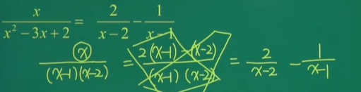

1.被积函数为：$\frac{1}{x^2+ax+b}$(分母可因式分解)

 

2.被积函数为：$\frac{1}{x^2+ax+b}$(分母可因式分解)

 

3.被积函数为：$\frac{1}{x^2+ax+b}$(分母可因式分解)

 

4.被积函数为：$\frac{dx+e}{ax^2+bx+c}$

 

5.被积函数为：$\frac{1}{x^2+ax+b}$(分母可因式分解)

 

#### 7.2 $\frac{x^n}{x^n+a}$(分子次数=分母次数)

对于$\frac{x^n}{x^n+a}$(分子次数=分母次数)

- 方法”$\frac{x^n+a-a}{x^n+a}$

1.
 

2.
 

#### 7.3 $\frac{x^2}{x+\pm a}$(分子次数$>$分子次数)

对于 $\frac{x^2}{x+\pm a}$(分子次数$>$分子次数)

- 方法：$\frac{x^2-a^2+a^2}{x\pm a}$(凑平方差公式)

 

##  二. 定积分及其应用

### ② 1. 定积分的概念和性质

#### 1.1 定积分的概念

 
定积分$\int^b_af(x)dx$

> 其中，$[a,b]$叫做积分区间，a叫做积分下限，b叫做积分上限

#### 1.2 几何意义

1. $f(x)\geqslant0$时，$\int^b_af(x)dx$的值为==曲边梯形的面积==
2. $f(x)\leqslant0$时，$\int^b_af(x)dx$的值为曲边 梯形的面积的**负值**
3. $f(x)$有正有负时，$\int_a^bf(x)dx$的值为曲边梯形的面积的**代数和**
   （x轴上面积 - x轴下面积）

 
 

#### 1.3 定积分是一个面积(常数)，求导为$0$

$\frac{d}{dx}\int_a^bf(x)dx=0$

#### 1.4 定积分的性质

- 补充规定：

  - 当$a=b$时，$\int_a^bf(x)dx=0$

  - 当$a\neq b$时，$\int_a^bf(x)dx=-\int_b^af(x)dx$

1. 线性运算

   - $\int_a^b[f(x)\pm g(x)]dx=\int_a^bf(x)dx\pm \int_a^bg(x)dx$
   - $\int_a^bkf(x)dx=k\int_a^bf(x)dx$

2. 积分区间的可加性
   $\int_a^bf(x)dx=\int_a^cd(x)dx+\int_c^bf(x)dx $

    

3. $\int_a^b1dx=b-a$

4. 保号性
   $f(x)\geqslant0\Leftrightarrow\int_a^bf(x)dx\geqslant0$
   推理：若$f(x)\leqslant g(x)$，则$\int_a^bf(x)dx\leqslant\int_a^bg(x)dx$

5. 积分中值定理
   若$f(x)$在区间$[a,b]$上连续，则$\exists\zeta\in(a,b)$使得$\int_a^bf(x)dx=f(\zeta)\cdot (b-a)$
    
   函数$f(x)$在$[a,b]$上的平均值$f(\zeta)=\frac{\int_a^b f(x)dx}{b-a}$，即平均的高

   >  

6. 估值定理
   设$f(x)$在区间$[a,b]$上的最大值和最小值
   分别为$M$和$m$，则$m(b-a)\leqslant\int_a^bf(x)dx\leqslant M(b-a)$
    

   > 

   

### ① 2. 变上限积分

#### 2.1 定理

如果函数$f(x)$在区间$[a,b]$上连续，
则函数$\Phi(x)=\int_a^xf(t)dt$是$f(x)$的一个原函数
因此，$\Phi'(x)=\frac{d}{dx}\int_a^xf(t)dt=f(x)$

#### 2.2 求导公式

1. $(\int_a^xf(t)dt)'=f(x)$

   >   
   
2. $(\int_a^{\Phi(x)}f(t)dt)'=f[\Phi(x)]\Phi'(x)$

   > 类似复合函数求导
   >  

3. $(\int_x^af(t)dt)'=-f(x)$

   >   

4. $(\int_{\Phi(x)}^af(t)dt)'=-f[\Phi(x)]\Phi'(x)$

5. $(\int_{\Phi_2(x)}^{\Phi_1(x)}f(t)dt)'=f[\Phi_1(x)]\Phi_1'(x)-f[\Phi_2(x)]\Phi_2'(x)$

   >   

> eg:1
>  
>
> eg:2
>  
>
> eg:3
> 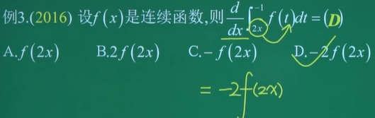
>
> eg:5
> 
>
> eg:
>  
>
> eg:两边同时求导，再求
> 
>
> eg:两边同时求导，再求
>
> 

#### 2.3 变上限积分与洛必达结合求极限

- [洛必达](###① 3. 洛必达法则)
  - 前提：$\frac{0}{0}型或\frac{\infty}{\infty}型$

  - $\lim\limits_{x\rightarrow·}\frac{f(x)}{g(x)}=\lim\limits_{x\rightarrow·}\frac{f'(x)}{g'(x)}$

>
>
>
> 

### ① 3.  牛顿——莱布尼茨公式

若$F(x)$是连续函数$f(x)$在$[a,b]$上的一个原函数
$\int_a^bf(x)dx=F(x)|^b_a=F(b)-F(a)$

>  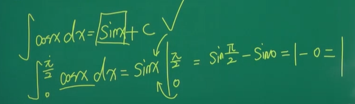

### ① 4. 定积分的对称性

$\int_{-a}^af(x)dx=\begin{cases}0,\ \ f(x)为奇函数\\
2\int_0^af(x)dx,\ \ d(x)为偶函数\end{cases}$

> 1.
> 
> 2.
> 
>
> 3.
> 
>
> 4.
> 
>
> 5.
> 

### ① 5. 定积分的换元法

#### 5.1 第一类换元法(凑微分法)

$被积函数\begin{cases}第一个函数(基本积分公式)\\
两个函数乘积(导数关系)\end{cases}$

>  
>  
> 
>   
> 
>  

#### 5.2 第二类换元法

> 注：定积分换元一定要换限

1. 根式替换
   含$\sqrt[n]{ax+b}$
   方法：$令\sqrt[n]{ax+b}=t$

   >  
   > 
   >  
   
2. 三角代换(不重要)

   >  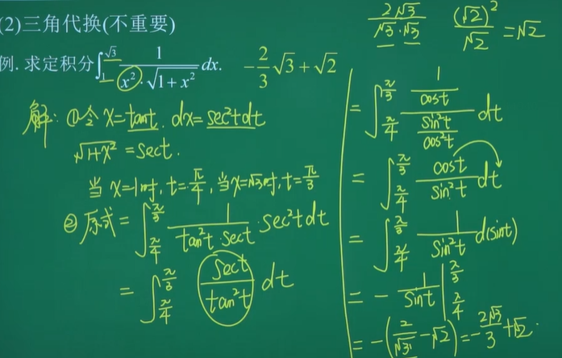

### ① 6. 定积分的分部积分法

1. 公式
   $\int_a^buv'dx=\int_a^budv=uv|^b_a-\int_a^bvdu$

2. 适用范围

   被积函数

   - 两类不同函数乘积(反三角函数·对数函数·幂函数·三角函数·指数函数)

     - 使用原则
       - 按**反对幂三指**的顺序，顺序靠后积到后面
         $\int_a^buv'dx=\int_a^budv$
       - 然后$\int_a^budv=uv|^b_a-\int_a^bvdu$

   - 一个函数（$对数\int_a^b\ln xdx,反三角\int_a^b \arctan xdx$）

     - $\int_a^b udv=uv|_a^b-\int_a^b vdu$

     > 
     >
     > 
     >
     > 
     >
     > 
     >
     > 
     >
     > 

### 7. 分段函数求定积分

- 方法：根据积分区间的**可加性**积分

 

 

### 8. 去绝对值求定积分

- 方法：去绝对值
  以绝对值里面的0的x值为分段点

 

 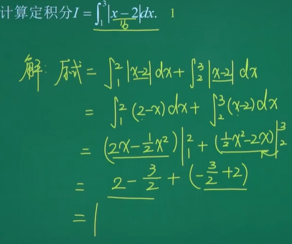

### 9. 含有定积分的方程求定积分

- 方法
  1. 令$\int_a^bf(x)dx=A$
  2. 等式两边同时取$\int_a^b$定积分

 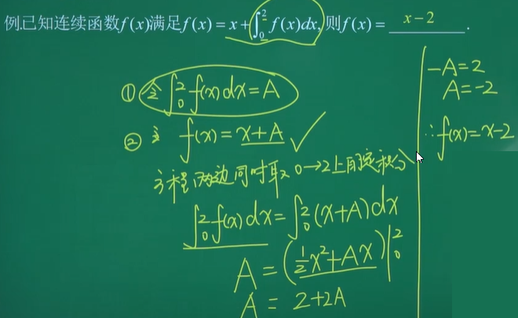

### ① 10. 定积分求平面图形的面积

#### 10.1 以x作为积分变量

- 常见

  1. $S=\int_a^bf(x)dx$
      
  
  2. $S=\int_a^b(上-下)dx$
  
       

#### 7.2 以y作为积分变量

- 常见

  1. $S=\int_c^d\varphi(y)dy$
      
  
  2. $S=\int_c^d(右-左)dy$
      
  
> 注：有时，可借助三角形求面积

  1.x

2.x

 

3.

4.
 

5.

6.
 

7.
 

8.
 

### 11. 定积分求旋转体的体积

1. 平面图形绕x轴旋转一周所生成的旋转体体积
   常见

   1. $V=\pi\int_a^bf^2(x)dx$
       
      
   2. $V=\pi\int_a^b(上^2-下^2)dx$
   
        
   
2. 平面图形绕y轴旋转一周所生成的旋转体的体积
   常见

   1. $V=\pi\int_c^d\varphi^2(y)dy$
       
   2. $V=\pi\int_c^d(右^2-左^2)dy$
   
   > 注：有时可借助圆锥求体积
   >  

> eg: 绕x
> 
> eg: 绕x $上^2-下^2$
> 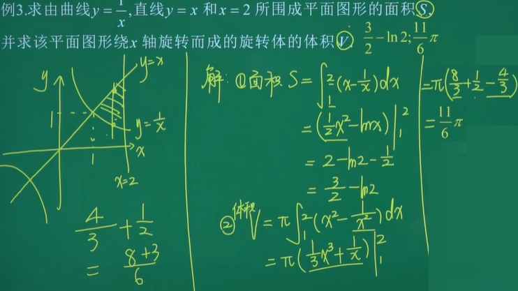
>
> eg:绕x $上^2-下^2$
>
>  
>
> eg:绕x $上^2-下^2$或规则图形(三角形->圆锥$V=\frac{1}{3}\pi r^2h$)
>
> eg:绕x $上^2-下^2$
>
>  
>
> eg:绕x $上^2-下^2$ 分两块
>
>  

# Ⅳ. 向量代数与空间解析几何12%

## 一. 向量代数

### 1. 空间点的直角坐标

空间的点$P\rightleftharpoons^{一一对应}(x,y,z)$(三元有序实数组)

### 2. 空间两点间的距离

空间两点$M_1(x_1,y_1,z_1)$与$M_2(x_2,y_2,z_2)$之间的距离为
$|M_1M_2|=\sqrt{(x_2-x_1)^2+(y_2-y_1)^2+(z_2-z_1)^2}$

### ① 3. 向量的概念

1. 既有大小又有方向的量称为向量(矢量)
   

   - $\vec a=x\vec i+y \vec j+z \vec k=\{x,y,z\}$

     - $(x,y,z)$表示的点的坐标位置；

     - $\{x,y,z\}$表示这一点与原点连接起来构成的向量

     - `()`和`{}`都可以表示，但`{}`更严谨

     - 表示以原点$(0,0,0)$为起点，以$(x,y,z)$为终点的向量

   - 两点连线的向量
     $\vec{M_0}(x_0,y_0,z_0)$ $\vec{M_1}(x_1,y_1,z_1)$
     $\vec{M_0M_1}=\{x_1-x_0,y_1-y_0,z_1-z_0\}$

2. 向量 $\vec a$ 的大小称为向量的模
   $\vec a=\{x,y,z\}$  $|\vec a|=\sqrt{x^2+y^2+z^2}$ 

3. 单位向量

   - 单位向量是模为 1 的向量
     如：$\vec i=\{1,0,0\}$   $\vec j=\{0,1,0\}$    $\vec k=\{0,0,1\}$ 
   - 与向量 $\vec a=\{x,y,z\}$ 平行的单位向量 $\vec b=\pm\frac{\vec a}{|\vec a|}$
   - 与向量 $\vec a=\{x,y,z\}$ 同向平行的单位向量 $\vec {a^0}=\frac{\vec a}{|\vec a|}$
   - 与向量 $\vec a=\{x,y,z\}$ 同向平行的单位向量 $-\vec {a^0}=-\frac{\vec a}{|\vec a|}$

4. 方向余弦
   $\vec a=\{x,y,z\}=x\vec i+y\vec j+z\vec k$
   向量 $\vec a$ 与三个坐标轴正向的夹角为 $\alpha,\beta,\gamma$，称其为**方向角**
   而 $\cos\alpha,\cos\beta,\cos\gamma$ 称为向量 $\vec a$ 的**方向余弦**

   - 向量 $\vec a$ 与 $x$ 轴的夹角的余弦值 $\cos \alpha=\frac{x}{\vec a}=\frac{x}{\sqrt{x^2+y^2+z^2}}$
   - 向量 $\vec a$ 与 $y$ 轴的夹角的余弦值 $\cos \beta=\frac{y}{\vec a}=\frac{y}{\sqrt{x^2+y^2+z^2}}$
   - 向量 $\vec a$ 与 $z$ 轴的夹角的余弦值 $\cos \gamma=\frac{z}{\vec a}=\frac{z}{\sqrt{x^2+y^2+z^2}}$

   注：方向余弦的平方和为1：$\cos^2\alpha+\cos^2\beta+\cos^2\gamma=1$

>  求模
>  
>
>  求模
>  
>
>  求单位向量
>  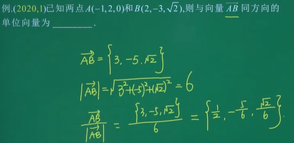
>
>  求方向角 根据方向余弦求
>
>   

### ① 4. 向量的运算

$$
\vec a=\{a_1,a_2,a_3\}\ \ \ \vec b=\{b_1,b_2,b_3\}
$$

#### 4.1 线性运算

$\vec a+\vec b=\{a_1+b_1,a_2+b_2,a_3+b_3\}$
$\vec a-\vec b=\{a_1-b_1,a_2-b_2,a_3-b_3\}$
$k\vec a=\{ka_1,ka_2,ka_3\}$

#### 4.2两向量的数量积(点乘、内积)

- 向量 $\vec a$ 与 $\vec b$ 的数量积
  $\vec a\cdot\vec b=|\vec a||\vec b|\cos\theta=a_1b_1+a_2b_2+a_3b_3$
  $\vec a\cdot\vec a=|\vec a|^2=a_1^2+a_2^2+a_3^2$
- 两向量垂直
  $\vec a\bot\vec b\Leftrightarrow \vec a\cdot\vec b=0\Leftrightarrow a_1b_1+a_2b_2=0$
- 性质
  $\vec a\cdot\vec b=\vec b\cdot\vec a$
  $\vec a\cdot(\vec b+\vec c)=\vec a\cdot \vec b+\vec a\cdot \vec c$
  $\lambda\vec a\cdot \vec b=(\lambda \vec a)\cdot\vec b=\vec a\cdot(\lambda\vec b)$
  一般情况下，$(\vec a\cdot\vec b)\cdot\vec c\neq\vec a\cdot(\vec b\cdot \vec c)$

> 向量点乘
> 

#### 4.3 两向量的夹角$(0\leqslant\theta\leqslant\pi)$

夹角的余弦值 $\cos \theta=\frac{\vec a\cdot \vec b}{|\vec a|\cdot |\vec b|}=\frac{a_1b_1+a_2b_2+a_3b_3}{\sqrt{a_1^2+a_2^2+a_3^2}\sqrt{b_1^2+b_2^2+b_3^2}}$

> 求余弦
> 
>
> 求夹角  求余弦->求夹角
> 
>
> $\vec a\cdot\vec a=\vec a^2=|\vec a|^2$
> 

#### 4.4 两向量的向量积(叉积、外积)

- 定义
  设两向量 $\vec a$ 与 $\vec b$，按照下列方式确定一个新的向量 $\vec c$

  - 若 $|\vec c|=|\vec a||\vec b|\sin\theta,(0\leqslant\theta\leqslant\pi)$
  - $\vec c$ 垂直于 $|\vec a|$ 与 $|\vec b|$，~~且 $\vec a$、$\vec b$ 和 $\vec c$成右手系~~，
    那么称向量 $\vec c$ 为向量 $|\vec a|$ 和 $|\vec b|$ 的向量积，记 $\vec a\times\vec b$

  | 情况                                                         | 向量积                                            |
  | ------------------------------------------------------------ | ------------------------------------------------- |
  | $|\vec c|=|\vec a||\vec b|\sin\theta,(0\leqslant\theta\leqslant\pi)$ | $|\vec a\times\vec b|=|\vec a||\vec b|\sin\theta$ |
  | $\vec c$  同时垂直于 $\vec a$ 和 $\vec b$ (就是一种特殊情况，夹角为90度$\sin\theta=0$) | $\vec a\times\vec b$                              |

  **几何意义**：$|\vec a\times\vec b|$ 表示以 $\vec a$、$\vec b$ 为邻边的平行四边形的面积(山东没考过)
   

- 向量积的计算
  $\vec a=\{\vec a_1,\vec a_2,\vec a_3\}$  $\vec b=\{\vec{b_1},\vec b_2,\vec b_3\}$
  $$
  \vec a\times\vec b=\left|\begin{matrix} 
  \vec i&\vec j&\vec k\\
  a_1&a_2&a_3\\
  b_1&b_2&b_3\end{matrix} \right|
  \\=\left|\begin{matrix} a_2&a_3\\
  b_2&b_3
  \end{matrix} \right|\vec i-
  \left|\begin{matrix} a_1&a_3\\
  b_1&b_3
  \end{matrix} \right|\vec j+
  \left|\begin{matrix} a_1&a_2\\
  b_1&b_2
  \end{matrix} \right|\vec k\\
  =(a_2\times b_3-b_2\times a_3)\vec i-(a_1\times b_3-b_1\times a_3)\vec j+(a_1\times b_2-b_1\times a_2)\vec k
  $$
  
- 性质

  - $\vec b\times \vec a=-\vec a\times\vec b$
  - $\vec a\times\vec a=\vec 0$
  - $(\vec a+\vec b)\times\vec c=\vec a\times\vec c+\vec b\times \vec c$
  - $\vec c\times(\vec a+\vec b)=\vec c\times\vec a+\vec c\times\vec b$
  - $(\lambda\vec a)\times\vec b=\vec a\times(\lambda\vec b)$
  - 一般情况下，$(\vec a\times\vec b)\times\vec c\neq\vec a\times(\vec b\times\vec c)$

- 平行向量(共线向量)

  - $\vec a=\{\vec a_1,\vec a_2,\vec a_3\}\ \ \ \vec b=\{\vec b_1,\vec b_2,\vec b_3\}$

    $\vec a$ 平行于 $\vec b$ 即 $\theta = 0^\circ $
    $\Leftrightarrow |\vec a\times\vec b|=|\vec a||\vec b|\sin\theta=0$
    $\Leftrightarrow\vec a\times\vec b=0$
    $\Leftrightarrow \frac{a_1}{b_1}=\frac{a_2}{b_2}=\frac{a_3}{b_3}$
    $\Leftrightarrow \vec b=\lambda\vec a(\lambda 为实数)$

  - 注：用 $\vec a\times\vec b=0$ 来判别 $\vec a$ 平行于 $\vec b$ 计算比较复杂，一般采用 $\frac{a_1}{b_1}=\frac{a_2}{b_2}=\frac{a_3}{b_3}$

- 平行四边形面积的计算

  - 空间中以 $\vec a$、$\vec b$ 向量为邻边构成的平行四边形面积 $S=|\vec a\times\vec b|$
  - 空间中以 $\vec a$、$\vec b$ 向量为邻边构成的三角形面积为 $S=\frac{1}{2}|\vec a\times\vec b|$

> 叉乘
>  
>
> 叉乘
> 
>
>  平行向量
> 
>
> 平行向量
> 
>
> 平行四边形
> 
>
>  三角形

#### 4.5 $\vec a$ 在 $\vec b$ 上的投影

$\vec a$ 在 $\vec b$ 上的投影：$\frac{\vec a\cdot\vec b}{|\vec b|}$

> 推导过程
> $|\vec a|\cos \theta=|\vec a|\frac{\vec a\cdot\vec b}{|\vec a||\vec b|}=\frac{\vec a\cdot\vec b}{|\vec b|}$

> 

### ① 5. 向量间的关系

设 $\vec a$，$\vec b$ 为非零向量，两向量的夹角为 $\theta$，

$\vec a=\{a_1,a_2,a_3\}\ \ \ \vec b=\{b_1,b_2,b_3\}$

1. $\cos \theta=\frac{\vec a\cdot \vec b}{|\vec a|\cdot |\vec b|}=\frac{a_1b_1+a_2b_2+a_3b_3}{\sqrt{a_1^2+a_2^2+a_3^2}\sqrt{b_1^2+b_2^2+b_3^2}}$
2. $\frac{a_1}{b_1}=\frac{a_2}{b_2}=\frac{a_3}{b_3}\Leftrightarrow\vec a||\vec b$
3. $a_1b_1+a_2b_2+a_3b_3=0\Leftrightarrow\vec a\cdot \vec b=0\Leftrightarrow\vec a\bot\vec b $

## 二. 空间平面与直线

### ① 1. 空间平面方程

 

1. 点法式方程

   - 点 $(x_0,y_0,z_0)$ 法向量$\vec n=\{A,B,C\}$
     $A(x-x_0)+B(y-y_0)+C(z-z_0)=0$==👈==

   - 推导：
     已知点$M_0(x_0,y_0,z_0)$ 点$M_1(x,y,z)$，
     法向量$\vec n=\{A,B,C\}$
     $\vec{M_0M_1}=\{x-x_0,y-y_0,z-z_0\}$ 
     $\vec{M_0M_1}\cdot\vec n=A(x_1-x_0)+B(y_1-y_0)+C(z_1-z_0)=0$

2. 一般式方程

   - $Ax+By+Cz+D=0$==👈==
   - 推导
     $A(x-x_0)+B(y-y_0)+C(z-z_0)=0$
     $Ax+By+Cz-(Ax_0+By_0+Cz_0)=0$
     $(Ax_0+By_0+Cz_0)$这部分就是 $D$

3. 特殊平面

   - 平行于 $Oz$ 轴：$Ax+By+D=0$

     > 平行于 $Ox$ 轴：$By+Cz+D=0$
     >
     > 平行于 $Oy$ 轴：$Ax+Cz+D=0$

   - 平行于 $yOz$ 坐标面：$Ax+D=0$

   - 过 $Oz$ 轴：$Ax+By=0$

     > 对于平面方程 $Ax + By + Cz + D = 0$，如果要求该平面过 $Oz$ 轴，即过原点 $(0, 0, 0)$，我们可以将其代入平面方程，得到 $A \cdot 0 + B \cdot 0 + C \cdot 0 + D = 0$，简化为 $D = 0$。
     >
     > 因此，如果平面过 $Oz$ 轴，即满足 $Ax + By + Cz = 0$，其中 $D = 0$。进一步简化为 $Ax + By = 0$。
     >
     > 这意味着平面上的所有点 $(x, y, z)$，只要满足 $Ax + By = 0$，即平面上的点在 $Oz$ 轴上。这是因为在 $Oz$ 轴上，$z$ 的值为 $0$，而对于满足 $Ax + By = 0$ 的点，$z$ 可以是任意值。
     >
     > 所以，当 $Ax + By + Cz + D = 0$ 过 $Oz$ 轴时，可以简化为 $Ax + By = 0$，表示平面上的点在 $Oz$ 轴上。

4. 平面方程的求法
   方法(常用)：点法式法

   1. 求出平面的一法向量 $\vec n=\{A,B,C\}$
   2. 确认平面上一点 $(x_0,y_0,z_0)$
   3. 带入点法式方程，化简为一般式

> 点法式法求平面方程
> 
>
>  
>
>  
>
>  
>
>  

### ② 2. 两平面的位置关系

设有两个平面
$\pi_1:A_1x+B_1y+C_1z+D_1=0,\vec {n_1}=\{A_1,B_1,C_1\}$
$\pi_2:A_2x+B_2y+C_2z+D_2=0,\vec {n_2}=\{A_2,B_2,C_2\}$

==两面关系同两向量==

1. $\frac{A_1}{A_2}=\frac{B_1}{B_2}=\frac{C_1}{C_2}\Leftrightarrow\vec {n_1}//\vec {n_2}\Leftrightarrow\pi_1//\pi_2$
   1. $\frac{A_1}{A_2}=\frac{B_1}{B_2}=\frac{C_1}{C_2}\neq\frac{D_1}{D_2}\Leftrightarrow\pi_1//\pi_2$，但不重合
   2. $\frac{A_1}{A_2}=\frac{B_1}{B_2}=\frac{C_1}{C_2}=\frac{D_1}{D_2}\Leftrightarrow\pi_1//\pi_2$，且重合
2. $\vec {n_1}\cdot\vec {n_2}=0\ \ \ (A_1A_2+B_1B_2+C_1C_2=0)\Leftrightarrow\vec {n_1}\bot\vec {n_2}\Leftrightarrow\pi_1\bot\pi_2$

#  | 证明题

> 1. [最值定理](####3.1 最值定理)
> 2. [零点定理](####① 3.2 零点定理)
>    - 有等号没有导数
>    - $\begin{cases}[a,b]上连续\ 且\\
>      f(a)\cdot f(b)<0\end{cases}$
>    - $\exists\zeta\in(a,b),使得f(\zeta)=0$
> 3. [罗尔定理](###1. 罗尔定理)
>    - 有等号有导数
>    - $\begin{cases}[a,b]上连续\\
>      (a,b)内可导\\
>      f(a)=f(b)\end{cases}$
>    - $\exists\zeta\in(a,b),使f'(\zeta)=0$
> 4. [拉格朗日中值定理](###① 2. 拉格朗日中值定理)
>    - 双边不等式
>    - $\begin{cases}[a,b]上连续\\
>      (a,b)内可导\end{cases}$
>    - $\exists\zeta\in(a,b),使f'(\zeta)=\frac{f(b)-f(a)}{b-a}$
> 5. [单调性](####5.1 题型一——证明单边函数不等式问题)
>    - 单边函数不等式
> 6. [零点定理+单调性](####5.2 题型二——零点定理+单调性证明根的唯一性)
>    - 证明根的唯一性

