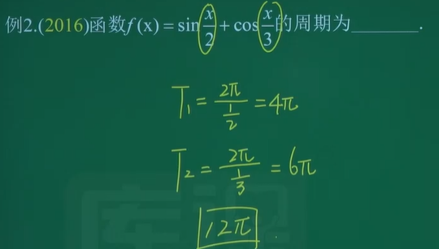

# Ⅰ. 函数极限与连续 18%

 

## 一. 函数

### ①  1. 求函数的定义域

函数：$y=f(x)$

> y：自变量
> x：因变量
> 定义域：x的所有取值
> 值域：y的所有取值
> f：对应法则
> 函数三要素：值域、定义域、对应法则

- 函数的定义域
  使函数有意义的 $x$ 的取值范围
- 求函数的定义域$\begin{cases}求具体函数的定义域\\
  求抽象函数的定义域(这三年没考过)\end{cases}$

#### 1.1 求具体函数的定义域

1. 有分母$\frac{1}{x},x\neq0$
2. 二次根式$\sqrt{x},x\geqslant0$
3. 对数的真数$\log_ax,(\ln x,\lg x),x>0$
4. 反正弦 / 反余弦函数 $\arcsin x.\arccos x,-1\leqslant x\leqslant1$

> 注：
>
> 1. 上述 $x$ 均可换成 $\square$
> 2. 四则运算(加减乘除)取交集

> eg: 
> 
> eg: 

#### 1.2 求抽象函数定义域(这三年没考过)

1. 已知 $f(x)$ 的定义域为 $[a,b]$ ，求 $f[\varphi(x)]$ 的定义域
   方法：由 $a\leqslant\varphi(x)\leqslant b$ 解出 $x$ 的范围
2. 已知 $f[\varphi(x)]$ 的定义域为 $[a,b]$ ，求 $f(x)$ 的定义域
   方法：求出 $\varphi(x)$ 在 $[a,b]$ 上的值域

>eg: 1.
>
>eg: 2.
>

### 2. 判断两函数是否相同

$两函数相同\Leftrightarrow(1)定义域相同(2)对应法则相同$

> eg:
> 

### ①  3. 求函数的表达式

$\begin{cases}f(x)\rightarrow求f[g(x)]：直接带入\\
f[g(x)]\rightarrow求f(x)：换元法、恒等变形\\
f[g(x)]\rightarrow求f[\varphi(x)]：f[g(x)]\rightarrow求f(x)\rightarrow求f[\varphi(x)]\end{cases}$

1. 由 $f(x)\rightarrow_求f[g(x)]$
   方法：直接带入
2. 由 $f[g(x)]\rightarrow_求f(x)$
   方法：换元法、恒等变形
   1. 换元法
   2. 恒等变形(凑)
3. 由 $f[g(x)]\rightarrow_求f[\varphi(x)]$ (没考过)
   方法：$f[g(x)]\rightarrow_求f(x)\rightarrow_求f[\varphi(x)]$

> eg:1.直接带入
> 
> eg:1.直接带入
> eg:2.1.换元法
> 
> eg:2.2.恒等变形(凑)
> 
> eg:3.没考过
> 

### ②  4. 函数的四种性质

单调性、**奇偶性**、**有界性**、周期性

1. 单调性
   $定义：\begin{cases}若x_1<x_2,f(x_1)<f(x_2),则f(x)单调递减\\
   若x_1<x_2,f(x_1)>f(x_2),则f(x)单调递减\end{cases}$

2. **奇偶性**

   - 定义
     定义域关于原点对称
     $若\begin{cases}f(-x)=f(x)，偶函数，关于y轴对称\\
     f(-x)=-f(x)，奇函数，关于原点对称\end{cases}$
   - 常见
     - 奇：$\sin x,\tan x,x^{2n+1},\cot x,\arcsin x,\arctan x,\log_a(\sqrt{1+x^2} \pm x),\frac{a^x-a^{-x}}{b}$
     - 偶：$\cos x,x^{2n},|x|,非零常数,\frac{a^x+a^{-x}}{b}$
   - 运算性质
     - “加减”：
       - $奇\pm奇=奇$
       - $偶\pm偶=偶$
       - $奇\pm偶=非奇非偶$
     - “乘除”:
       - $奇\times\div奇=偶$
       - $偶\times\div偶=偶$
       - $奇\times\div偶=奇$
     - “复合”
       - 内偶则偶，内奇同外

3. 有界性

   - 定义：$|f(x)|\leqslant M$ ，则称 $f(x)$ 有界

   - 常见有界函数：
     $\sin x,\cos x,所有的反三角函数$

     > 注：上述 $x$ 均可换成 $\square$

4. 周期性

   - 定义：若 $f(x+T)=f(x)$ ，则 $f(x)$ 为周期函数， $T$ 是 $f(x)$ 的一个周期
   - 常见
     $\sin x,\cos x\ \ \ T=2\pi$
     $c\sin(ax+b)+d,c\cos(ax+b)+d,T=\frac{2\pi}{|a|}$
     $\tan x,\cot x,\ \ \ T=\pi$
     $c\tan(ax+b)+d,c\cot(ax+b)+d,T=\frac{\pi}{|a|}$

> eg:2.奇偶性
> eg:2.奇偶性
> eg:2.奇偶性证明
> eg:4.周期
> 

### 5.  反函数

- 定义
  若 $y= f(x)$ 中 $x$ 与 $y$ 的取值是一 一对应的,则把 $y$ 当作自变量， $x$ 当作因变量，所定义的一个新函数即 $x = f^{-1}(y)$ .称为$y= f(x)$的反函数.习惯上记作 $y=f^{-1}(x)$

- 求反函数步骤

  1. 反解 x
  2. 互换 x, y
  3. 写定义域，即原来函数的值域（小题可不写）

  $$
  求y=x+1的反函数\\
  解：\because y=x+1 \\
  \ \therefore x=y-1\implies x,y互换\\
   \therefore y=x-1
  $$

  > eg:
  > 
  > eg:
  > 

### ①  6. 基本初等函数的性质和图形

- 基本初等函数：5 种

  - 幂函数$y=x^a$

  - *指数函数$y=a^x$*

  - *对数函数$y=\log_a{x}$*

  - **三角函数**

  - **反三角函数$y=\arcsin x,\cdots $**

#### 6.1 幂函数

$y=x^a(a为任何实数)$

#### 6.2 指数函数

$y=a^x,(a>0\ 且\ a\not=1)$

- 指数函数和对数函数互为反函数
- 图像性质
  - 横过(0,1)点
  - $a>1$ 时单调递增
    - ${x\rightarrow+\infty,a^x\rightarrow+\infty}$
    - $x\rightarrow-\infty,a^x\rightarrow0$
    - 特殊
      $y=e^x,e=2.71828\cdots$
  - $0<a<1$ 时单调递减
    - ${x\rightarrow+\infty,a^x\rightarrow 0}$
    - ${x\rightarrow-\infty,a^x\rightarrow +\infty}$
- **运算性质**
  - $a^m\cdot a^n=a^{m+n}$
  - **$\frac{a^m}{a^n}=a^{m-n}$**

#### 6.3 对数函数

‘$y=\log_ax,(a>0且a\not=1)$

- 指数函数和对数函数互为反函数
- 图像性质
  - 横过(1,0)点
  - $a>1$ ,单调递增
    - 特殊$y=\ln x,(a=e)$
    - 特殊$y=\lg x,(a=10)$
  - $a<1$ ,单调递减
- **运算性质**
  - $\ln a-\ln b=\frac{a}{b}$
  - $\ln a+\ln b=\ln ab$
  - $\ln a^b=b\ln a$
  - $e^{\ln a}=a$
  - $a^b=e^{\ln a^b}=e^{b\ln a}$

#### 6.4 三角函数

$y=\sin x,\cos x,\tan x,\cot x,\sec x,\csc x$

| $函数\setminus 角$ | $0$  |   $\frac{\pi}{6}$    |   $\frac{\pi}{4}$    |   $\frac{\pi }{3}$   | $\frac{\pi}{2}$ |
| :----------------: | :--: | :------------------: | :------------------: | :------------------: | :-------------: |
|       $\sin$       | $0$  |    $\frac{1}{2}$     | $\frac{\sqrt{2}}{2}$ | $\frac{\sqrt{3}}{2}$ |       $1$       |
|       $\cos$       | $1$  | $\frac{\sqrt{3}}{2}$ | $\frac{\sqrt{2}}{2}$ |    $\frac{1}{2}$     |       $0$       |
|       $\tan$       | $0$  | $\frac{\sqrt{3}}{3}$ |         $1$          |      $\sqrt{3}$      |   $+ \infty $   |

- 常见公式
  1. $\tan x=\frac{\sin x}{\cos x}$
  2. **二倍角公式**
     - $\sin 2x=2\sin x \cos x$
     - $\cos 2x=2\cos ^2x-1=1-2\sin^2x=\cos^2x-\sin^2x$
  3. 降次公式
     - $\cos^2x=\frac{\cos 2x+1}{2}$
     - $\sin^2x=\frac{1-\cos 2x}{2}$
  4. $\cot x=\frac{1}{\tan x}=\frac{\cos x}{\sin x}$
  5. $\sec x=\frac{1}{\cos x}$
  6. $\csc x=\frac{1}{\sin x}$
  7. - $\sec^2x=\tan^2x+1$
     - $\tan^2x=\sec^2x-1$

#### 6.5 反三角函数

$y=\arcsin x,\arccos x,\arctan x,arccot\ x$

- 反弦 
   
   
  - $y=\arcsin x$ 是 $y=\sin x$ 的反函数
  
    >取 $y=\sin x上[-\frac{\pi}{2},\frac{\pi}{2}]$ 的一段，
    >关于y=x对称得 $y=\arcsin x$,
    >定义域变值域，值域变定义域
  
    - $\arcsin \frac{1}{2}=? \\ 
      \because \sin \frac{\pi}{6}=\frac{1}{2}\\
       \therefore \arcsin \frac{1}{2}=\frac{2}{1}$
  
  - $y=\arccos x是y=\cos x的反函数$
  
    >取 $y=\cos x$ 上 $[0,\pi]$ 的一段
  
- 反切
  
  
  - $y=\arctan x$ 是 $y=\tan x$ 的反函数
  
     >取$y=\tan x$上$(-\frac{\pi}{2},\frac{\pi}{2})$的一段
     >
     >$x\rightarrow+\infty,\arctan x\rightarrow\frac{\pi}{2} $
     >$x\rightarrow-\infty,\arctan x\rightarrow-\frac{\pi}{2} $
  
- 正反三角函数关于 $y=x$ 对称
   

### ①  7. 复合函数的概念

1. 概念
   $y=f[\varphi(x)]$ 可看成由 $y=f(t),t=\varphi(x)$ 复合而成

2. 分解：
   “由外到内”，层层分解

   >eg:
   >
   >1. $y=(x+1)^4:y=t^4,t=x+1$
   >2. $y=\sin x^2:y=\sin t,t=\sin x$
   >3. $y=\ln \cos(x^2+1):y=\ln m,m=\cos n,n=x^2+1$

3. 求函数值
   “由里及外”

   > eg:
   > 设$f(x)=\frac{x}{1+x},g(x)=e^x$,则$f[g(0)]=$____________
   > 解:
   > $g(0)=e^0=1$
   >
   > $f[g(0)]=f(1)=\frac{1}{2}$

### 8. 分段函数的概念

由两个及两个以上的式子分段表达
$y=
\begin{cases}
x^2,x>0\\
x+1,x\leqslant0
\end{cases}$

### 9. 初等函数的概念

由**基本初等函数**经过**有限次四则运算**和**一定的复合**步骤后用**一个式子表达**的函数称为初等函数。
$初等函数
\begin{cases}
基本初等函数\\
四则运算\\
复合
\end{cases}$

> 注：分段函数不是初等函数

## 二. 极限

### 1. 极限定义

$2种\begin{cases}
x\rightarrow x_0\\
x\rightarrow \infty
\end{cases}$

1. 当 $x\rightarrow x_0$ 时，函数 $f(x)$ 的极限
   - 当 $x\rightarrow x_0$ 时，$f(x)$无限趋近于一个确定的常数A
     则称A为$f(x)当\ x\rightarrow x_0 $时的极限，记作$\lim\limits_{x\rightarrow x_0}f(x)=A$
   - 左极限与右极限
     左极限 $\lim\limits_{x\rightarrow x_0^-}f(x)=f(x_0^-)=A$
     右极限 $\lim\limits_{x\rightarrow x_0^+}f(x)=f(x_0^+)=A$
     - $\longrightarrow x_0^-\ \ \ x_0^+\longleftarrow $
   - 极限的充要条件
     $\lim\limits_{x\rightarrow x_0}f(x)\Leftrightarrow
     \lim\limits_{x\rightarrow x_0^-}f(x)=
     \lim\limits_{x\rightarrow x_0^+}f(x)=A$
     **极限存在  $\Leftrightarrow$ 左右极限均存在且相等**
2. 当$x\rightarrow \infty$时，函数$f(x)$的极限
   - 当$x\rightarrow \infty $时，$f(x)$ 无限趋近于一个确定的常数A
     则称 $A$ 为 $f(x)当x\rightarrow \infty $ 时的极限，记作$\lim\limits_{x\rightarrow \infty }f(x)=A$
   - 这里没有左右极限一说
     $\lim\limits_{x\rightarrow +\infty }f(x)=A$
     $\lim\limits_{x\rightarrow -\infty }f(x)=A$
   - 充要条件
     $\lim\limits_{x\rightarrow \infty }f(x)\Leftrightarrow
     \lim\limits_{x\rightarrow +\infty}f(x)=
     \lim\limits_{x\rightarrow -\infty}f(x)=A$
3. 常见的极限不存在
   $\begin{cases}
   左极限\not=右极限\\
   \infty \ \ \ 当左右极限都是\infty 时，不管是+\infty还是-\infty我们不习惯写极限不存在，我们习惯写\infty \\
   震荡不存在:如\lim\limits_{x\rightarrow\infty}\sin x
   \end{cases}$
4. 常见的“分左右极限(或分$+\infty,-\infty$)”的情况
   $\begin{cases}
   分段函数：“\geqslant<”或“>=<”,绝对值也属于“\geqslant<”的分段函数\\
   \lim\limits_{\square\rightarrow\infty}a^\square(左右极限不一样) \\
   \lim\limits_{\square\rightarrow \infty}\arctan \square(不常考)
   \end{cases}$

>eg:4. 分段函数 
>eg: $\frac{1}{\infty}=0$
> 
>eg:4. $e^x$
> 

### ①  2. 函数极限的运算

#### 2.1 极限的四则运算法则（有定义直接待入）

设 $\lim\limits_{x\rightarrow\cdot}f(x)=A,\lim\limits_{x\rightarrow\cdot}g(x)=B$ ($\cdot$可以是一个常数也可以是$\infty$) 则

- $$\lim\limits_{x\rightarrow\cdot}[f(x)\pm g(x)]=\lim\limits_{x\rightarrow\cdot}f(x)\pm\lim\limits_{x\rightarrow\cdot}g(x)=A\pm B$$
- $$\lim\limits_{x\rightarrow\cdot}[f(x)\cdot g(x)]=\lim\limits_{x\rightarrow\cdot}\cdot\lim\limits_{x\rightarrow\cdot}g(x)=A\cdot B$$
- $B\neq0时：\lim\limits_{x\rightarrow\cdot}\frac{f(x)}{g(x)}
  =\frac
  {\lim\limits_{x\rightarrow\cdot}f(x)}
  {\lim\limits_{x\rightarrow\cdot}g(x)}
  =\frac{A}{B}$

>有定义直接带入
> 

#### 2.2 $\frac{0}{0}$ 型分解因式、约去零因式求极限

- 方式一：分解因式、约去零因式求极限
  $因式分解
  \begin{cases}
  十字相乘法\\
  平方差公式:a^2-b^2=(a+b)(a-b)\\
  \end{cases}$
- 方式二：可以用[洛必达法则]()  第二章讲

> eg:因式分解
>
>eg:因式分解
>

#### 2.3 分式相减无穷减无穷$(\infty-\infty)$求极限

- 通分、约去零因式

> eg: 
> 

#### 2.4 根式有理化求极限

- 根式有理化

  1. 含$\sqrt{A}-(+)\sqrt{B}\rightarrow 分子分母同乘\rightarrow \sqrt{A}+(-)\sqrt{B}$
  2. 平方差: 新产生的根号直接带入

  > eg: 平方差: 新产生的根号直接带入
  >
  >
  > eg: 平方差: 新产生的根号直接带入
  >
  >eg: 平方差: 新产生的根号直接带入
  >

####  ①  2.5 $\frac{\infty}{\infty} $型，抓大头

- 分子分母同抓最大项

  - 分子次幂比分母高，为$\infty$
  - 分子次幂比分母低，为$0$

  > - 遇到有界函数可以忽略

  > eg: 抓大头
  >  
  > eg: 抓大头
  > 
  > eg: 抓大头
  > 
  > eg: 抓大头
  > 
  > eg: 抓大头
  > 
  > eg: 抓大头
  > 
  >
  > 
