# Ⅰ. 诗

## 一. 诗概述

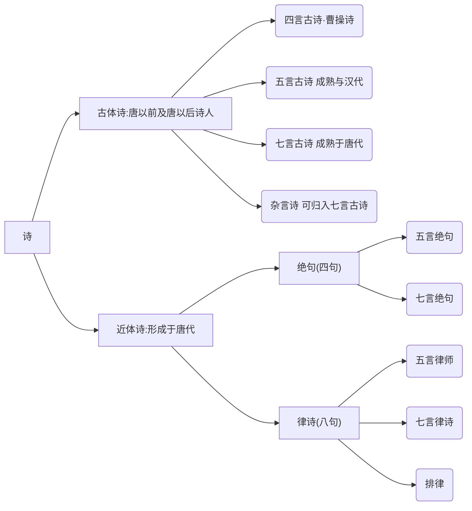

- 绝句[^绝句]
- 律诗[^律诗]
  共**八句**，每两句为一行
  从上往下分为 **首联 颔联 颈联 尾联**

### 1. 先秦诗歌

- 现实主义源头：《诗经》
- 浪漫主义源头：《楚辞》

#### 1.1《 诗经》风，(现实主义源头)

**现实主义源头：《诗经[^《诗经》]》**

>重点篇目
>
>- [《秦风·蒹葭》](##1.1 蒹葭)
>- 《卫风·氓》
>- 《秦风·无衣》
>- 《魏风·硕鼠》
>- 《周南·关雎》
>- 《小雅·采薇》
>- 《王风·蜀离》
>- 《小雅·鹿鸣》

##### 1.1.1 基本文学常识

- 名称演变
  最初==《诗》《诗三百》==汉朝时==《诗经》==
- 收录内容
  - 西周初年至春秋中叶
  - **共305篇**
- 价值地位
  - 我国==最早的一部诗歌总集==
  - “五经”[^五经]之一
- 四言为主，重章叠句[^重章叠句]

##### 1.1.2 诗经的“六义”

- 内容[^风] [^雅] [^颂 ]
  - 风： 各地的土风歌谣
  - 雅： 朝廷宴饮之乐
  - 颂： 宗庙祭祀的音乐
- 表现手法[^赋] [^比] [^兴]
  - 赋： 铺叙    叙述，用于写景、状物、叙事
  - 比： 比喻    使表达更加生动形象
  - 兴： 托物起兴    先说看似无关的物象，再说实际表达的意蕴内涵

##### 1.1.3 一些词的释义

- 窈窕淑女，君子好**逑**。 *逑：配偶*

##### 1.1.4 诗经的一些思想内容

1. 批判统治者的残暴与贪婪

   > 《魏风·硕鼠》

2. 表达对沉重徭役和兵役的厌恶、憎恨

   > 《王风·君子于役》

3. 对男女美好爱情与夫妻幸福婚宴的歌颂

   > 《周南·桃夭》

4. 赞美劳动者的辛劳、勤快与善良、朴质

   >《周南·芣苢》

5. 开创了“弃妇诗”的先河，控诉弱势妇女的不幸遭遇

   > 《卫风·氓》


#### 1.2 《楚辞》骚(浪漫主义源头)

>- [《离骚》](####2.1 《离骚》)
>- 《九歌·国殇》
>- 《天问》
>- 《哀郢》
>- 《湘夫人》
>- 《渔夫》

##### 1.2.1 基本文学常识

> 注:
>
> | 不同点 | 楚辞[^楚辞]                                                  | 《楚辞》[^《楚辞》]                                          |
> | ------ | ------------------------------------------------------------ | ------------------------------------------------------------ |
> | 是什么 | 楚辞，也作“楚词”，是[战国](https://baike.baidu.com/item/战国/4819?fromModule=lemma_inlink)时期[楚国](https://baike.baidu.com/item/楚国/950754?fromModule=lemma_inlink)诗人[屈原](https://baike.baidu.com/item/屈原/6109?fromModule=lemma_inlink)创作的一种新的**诗歌体裁**。 | 后期西汉刘向编辑的楚辞**作品集**，包含屈原的，和其他楚辞体裁的诗 |
> | 代表作 | 离骚，九歌，天问等                                           | 包括屈原所作的 和 后期仿照屈原所写的文学作品                 |
>
> 

- 奠基人和代表作家
  **屈原**
  - 我国历史上==第一个**浪漫主义**诗人==
  - 我国历史上==第一个**爱国**诗人==
  - ==“楚辞”的**创立者**和代表作家==，开创了香草美人的传统
  - 被誉为“==楚辞之祖==”
- 文学价值
  中国==第一部浪漫主义诗歌总集==

##### 1.2.2 主要内容-《离骚》骚

[《离骚》](####2.1 《离骚》)

###### 1.2.2.1 文学常识

- 文学价值
  中国诗歌史上==最长的浪漫主义政治抒情诗==
- 作者
  屈原
- 题目释义
  “离”：遭遇
  “骚”：忧愁
  “离骚”：即作者遭遇忧愁而写成的诗句

###### 1.2.2.2 常见意象

| 意象                | 含义                                         |
| ------------------- | -------------------------------------------- |
| 香草[^香草]         | 比喻贤臣                                     |
| 美人[^美人]         | 比喻君主                                     |
| 香草美人[^香草美人] | 比喻忠贞贤良之士，象征高洁的人格、美好的理想 |

###### 1.2.2.3 诗

《国殇》：是一首追悼为国牺牲的将士的挽歌

> 人们常将“风”“骚”并称，用==“风”来概括《诗经》==，用==“骚”来概括《楚辞》==**。**==“风、骚”是中国诗歌史上现实主义和浪漫主义两大优良传统的源头。==“风骚”也因此成为==文学的代名词==。

### 2. 汉乐府、《乐府诗集》（合乐而歌的诗歌的总称）

>《陌上桑》
>《孔雀东南飞》
>《十五从军征》
>《东门行》
>《饮马长城窟行》
>《行行重行行》
>《青青林上柏》
>《涉江采芙蓉》
>《生年不满百》

#### 2.1 基本文学常识

#### 2.1.1 乐府及乐府诗

- 乐府，古代掌管音乐的机构，后人把这个机构所采集的诗歌都称为“乐府”。它既包括采自民间的诗歌，也包括那些文人创作的诗歌。这些诗，一般都配乐歌唱。

##### 2.1.2 汉乐府

- 汉朝的乐府诗
- 起源及特点
  汉代**乐府机关**收集、整理、保存下来的可以合乐而歌的**诗歌的总称**，后代模仿的又称为乐府诗/乐府歌辞
- 语言特点
  **语言朴素自然**，活泼生动，且时有真率稚气，局势多样，**以五言为主**
- 其诗收录在宋代==郭茂倩==所编的==《乐府诗集》==里
- 艺术特色
  叙事性，擅长通过语言和行为表现人物性格，标志着我国古代叙事诗发展到了更加成熟的阶段。

##### 2.1.3 《乐府诗集》

- 主编：==郭茂倩==
- 内容：辑录了==从汉魏到唐五代==的乐府诗
- 成就：现存成书最早、流行最广、收录乐府诗最完备的诗歌总集
- **乐府双壁**
  ==《孔雀东南飞》 + 《木兰诗》==
              ↓                        ↓
        汉乐府诗            北朝民歌


##### 2.1.4 乐府诗的内容

1. 控诉统治者的腐朽与战争的残酷。
2. 对真挚爱情和美好婚姻的歌颂与向往。
3. 表现底层百姓的苦难生活。
4. 展现达官权贵之家的豪奢气象。
5. 揭露封建礼教制度的黑暗与罪恶。

### 3 《古诗十九首》

- 编者
  ==萧统==
- 地位及评价
  - 代表**当时五言诗创作的最高成就**。
  - 后人奉之为**“五言抒情诗的典范”**
    ==刘勰《文心雕龙》誉之为“五言之冠冕”==
    钟嵘《诗品》“惊心动魄，一字干金”
  - 是==文人五言诗走向成熟的标志==


### 1.5 魏晋南北朝 ——文人五言诗

#### 1.5.1 建安诗歌的代表人物

第一次掀起了文人诗歌的高潮

````mermaid
graph LR
a["“三曹”"]
a-->b[曹操]-->e["诗风：慷慨悲凉"]
a-->c[曹丕]-->f["《燕歌行》最早的文人七言诗<br>《 典论·论文 》是 中国文学 批评史上最早出现的一篇文学专论"]
a-->d[曹植]
d-->g["“才高八斗”"]
d-->h["“建安之杰”"]
d-->i["“骨气奇高，词采华茂”"]
````

#### 1.5.2 陶渊明 谢灵运

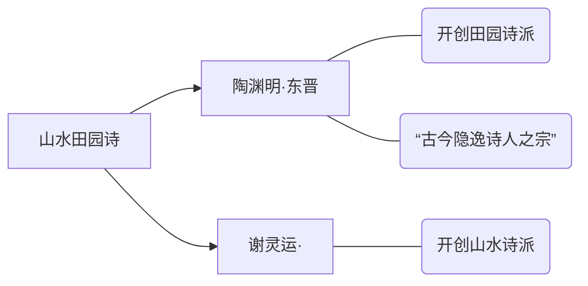

陶渊明的文学成就

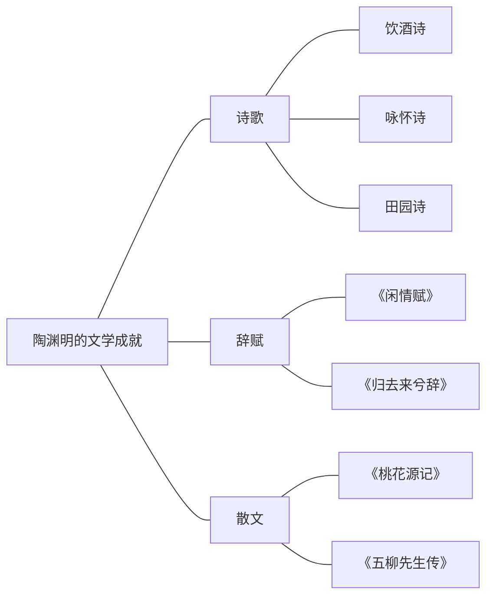

#### 1.5.3 南北朝民歌

>《观沧海》
>《短歌行》
>《龟虽寿》
>《白马篇》
>《归园田居》
>《移居》（两首）
>《木兰诗》
>《饮酒》（其五）
>《敕勒歌》

- 南朝民歌
  文学特征：题材狭窄（爱情）、语言清新自然、喜用双关
  代表作：《西湖 曲》
- 北朝民歌
  文学特征：题材广泛、风格粗犷豪放、语言直率
  代表作：==《木兰诗》==（代表了北朝民歌的最高成就，互文、双关等非常的多）

### 1.4 唐诗——诗歌的黄金时期 重武轻文 重抒情

初唐 盛唐 中唐 晚唐
重武轻文

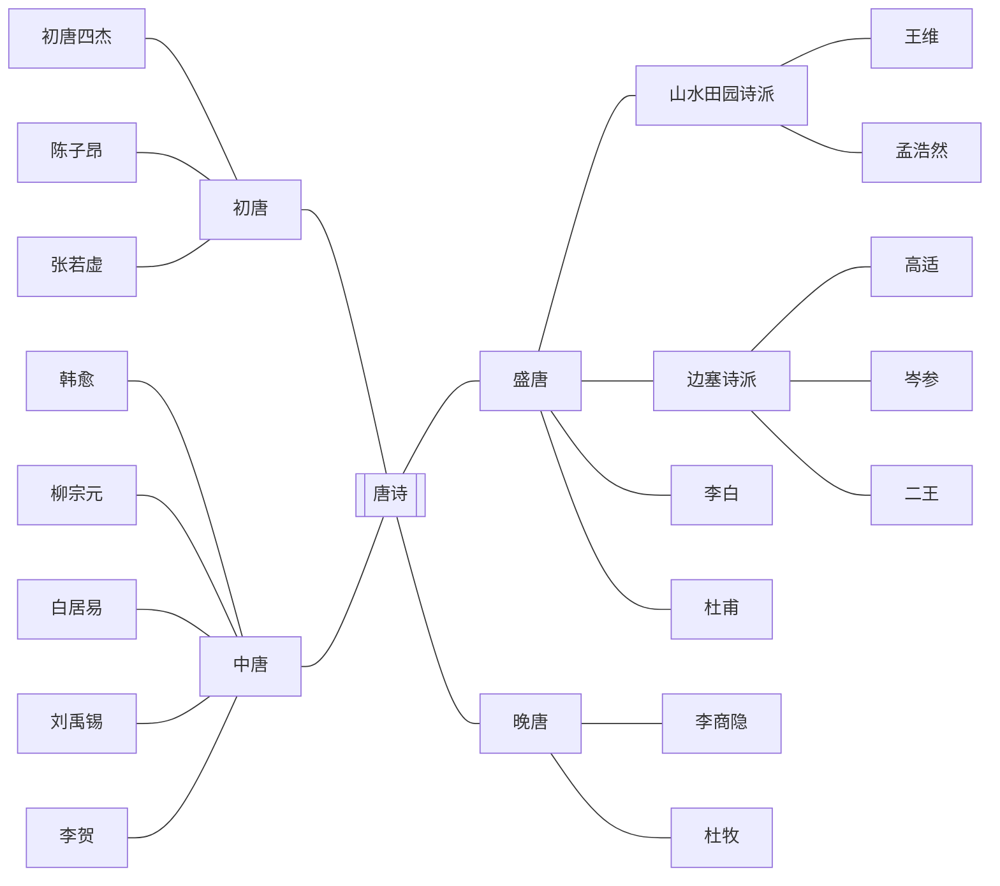


#### 1.4.1 初唐

- 初唐四杰[^初唐四杰]
  - ==王勃==：字子安，世称==“诗杰”，初唐四杰之首==，擅长五言绝句和律诗
  - ==杨炯==：世称“杨盈川”，多写边塞征战，想打仗
  - ==卢照邻==：号幽优子，想去死
  - ==骆宾王==：字观光，年少有才名，仕途不顺，想造反
- ==陈子昂==
  - 世称“==诗骨==”
  - 在诗歌理论上颇有建树，认为==“诗歌应该有所寄托”==。
- ==张若虚的《春江花月夜》”==。
  - 称誉
    - 《春江花月夜》被王闾运誉为==“孤篇横绝,竟为大家”==
    - 《春江花月夜》被闻一多誉为==“诗中的诗,顶峰上的顶峰”==
  - 原为乐府旧题
  - 描写了民间游子私妇的离别相思之苦

#### 1.4.2 盛唐——盛唐时期诗诗歌繁荣的顶峰

- 乐府、歌行、律诗、绝句，各体齐备;
- **现实主义、浪漫主义**相辅传扬;
- **边塞诗派、山水田园诗派**，各呈异彩。
- 中国诗坛盛极一时的“双子星”——"==大李杜=="[^大李杜]
- ==杜甫==本人被称为==诗圣==，他的诗被称为==诗史==
- ==“诗狂”贺知章==。
- 两座高峰(大李杜)
  - ==李白 浪漫主义==
    - 字太白，号青莲居士，又号谪仙人，浪漫主义诗人
    - 被称为==诗仙==
    - 与杜甫并称为“大李杜”
    - 诗风：**清新俊逸**
  - ==杜甫 现实主义  ==
    - 字子美，号==少陵野老==，世称==“杜工部”==
    - 被后人誉为“==诗圣==”，他的诗被称为==诗史==
    - 三吏三别[^三吏三别]
    - 诗风：沉郁顿挫
      早期的热情奔放、乐观坦荡
      后期悲壮凄凉，形成“沉郁顿挫”的诗风。
- 两个词派
  - 边塞诗派（高适、岑参、王昌龄、王之焕）
    - 多写边塞风光、军旅生涯、战斗场面以及战争带来的各种矛盾(离别、思乡、闺怨、厌战等)，具有**阳刚苍劲、悲壮
      雄浑、奔放豪迈、奇异峭拔、浪漫瑰丽**的风格。
    - 内容
      1. 以诗歌来反映边塞的山川景物和风土人情;
      2. 表现从军边塞、杀敌报国的意志;
      3. 讴歌边塞将士不畏辛劳、保卫边陲的战斗精神;
      4. 抒发御敌建功的愿望和安边定远的思想;
      5. 描写将士和亲人相互思念的深沉情感;
      6. 讽刺并劝谏拓土开边、穷兵黩武的统治者。
    - ==王昌龄==
      - 有==七绝圣手==”“诗家天子”或“诗家夫子”的美誉
  - 山水田园诗派（王维、孟浩然）
    - 孟浩然
      - 山水田园派诗人
      - 世称“孟襄阳”
    - ==王维==
      - 字“==摩诘==”，世称“==诗佛==”
      - 苏轼:“味摩诘之诗，==诗中有画==;观摩诘之画,==画中有诗==。”

#### 1.4.3 中唐

- 中唐诗歌是盛唐诗歌的延续。这时期的作品以表现**社会动荡、人民痛苦为主流**。
- 韦应物
- 韩愈
  - 唐宋八大家之首
  - 主张“辞必己出”“惟陈言之务去”
- ==孟郊==
  - 字东野
  - 有==“诗囚”==之称
- ==贾岛==
  - 人称==“诗奴”==
- ==李贺==
  - 世称==“诗鬼”==
  - ==与李白、李商隐合称“三李”==
  - 作品誉为“鬼仙之辞”、“骚之苗裔”
- 元白诗派
  - 白居易在《与元九书》中提出的**“文章合为时而著，歌诗合为事而作”**
- 新乐府诗歌
  - 多反映民生疾苦
  - 元稹
    - 与白居易齐名，并称元白，同为新乐府运动倡导者
  - ==白居易==
    - 字乐天，号香山居士
    - 有==“诗魔”==和==“诗王”==之称
- ==刘禹锡==
  - 字梦得
  - 有==“诗豪”==之称
- ==柳宗元==
  - 唐宋八大家之一
  - 世称==“河东先生”==

#### 1.4.4 晚唐——晚唐时期的诗歌感伤气氛浓厚

- 杜牧[^小李杜]
  - 作品清丽飘逸
- 李商隐
  - 作品深婉含蓄
- ==温庭筠==
  - 作品绮丽香艳,代表着晚唐诗歌的最高成就。
  - ==“**花间词派**”鼻祖==

### 1.5 宋诗 重文轻武   重理趣，重说理

- 特点
  以文为诗，追求平淡，好议论，重理趣
- 代表人
  - 北宋：苏轼、黄庭坚("江西诗派")，一祖三宗[^一祖三宗]
    - ==欧阳修==
      - 字永叔，号醉翁，晚号六一居士
      - 北宋政治家文学家
      - ==谥号：文忠==，故世称欧阳文忠公
      - 提出“诗穷而后工”
      - **北宋诗文革新领袖**
    - 王安石
    - 黄庭坚
      - 江西诗派的开山宗主
      - 提出“点铁成金”“夺胎换骨”
  - 南宋：杨万里(诚斋体)、陆游(南宋诗坛盟主)[^中兴四大诗人][^唐宋八大家]
    - 陆游
      - 字务观，号放翁
      - 爱国主义诗人
      - 诗风：雄浑豪放
      - 主张“功夫在诗外”
    - 杨万里
      - 号“诚斋”
    - 范成大
      - 风格“平易浅显，清新抚媚”
      - 号“石湖居士”
    - 文天祥

### 1.6 元明清诗

- 元好问
  - 金代
- 于谦
  - 明
- 郑燮(郑板桥)
  - 清
- 龚自珍
  - 清
  - 借古讽今

## 2. 诗歌赏析

### 2.1 《从军行 · 其四》

#### 2.1.1 作者

- 王昌龄(王江宁)，字少伯，河东晋阳（今山西太原)人，**盛唐**著名**边塞**诗人。
- 与高适、王之涣齐名，有**“七绝圣手” “诗家天子”**的美誉。
- 代表作有《从军行七首》《出塞》《闺怨》

#### 2.1.2 原诗

《从军行 · 其四》
青海长云暗[^暗]雪山，孤城遥望玉门关。
黄沙百战穿金甲，不破楼兰终不还。 

#### 2.1.3 赏析

**《从军行 · 其四》**

> 《从军行》是乐符《相和歌辞·平调曲》
> 旧题。**内容叙述军旅战争之事**

1. 青海长云暗[^暗]雪山，孤城遥望玉门关。

   > 译：青海上空的阴云遮暗了雪山，站在孤城遥望着远方的玉门关。

   - 情景交融，借景抒情
     - 复杂的感情:戍边将士对边防形势的关注，对自己所担负任务的**自豪感、责任感**,以及戍边生活的**孤寂、艰苦**之感，都融合在**悲壮、开阔而又迷蒙暗淡的景色**里。
   - 一、二句写景对表现戍边将士有什么作用?
     - 通过境界壮阔、环境恶劣的景物描写，**衬托**戍边将士**不畏艰难,守卫边疆**的豪情壮志。

2. 黄沙百战穿[^穿]金甲，不破楼兰[^楼兰]终不还。

   > 译：塞外身经百战磨穿了盔和甲，不打败西部的敌人誓不回还。

   - 直接抒情

   - 用典[^楼兰]

   - 主旨

     - 体现了出征将士报国御敌，以身许国的壮志。

   - 诗中“黄沙百战穿金甲”句具有高度的概括性，请作具体分析。

     - > 赏析时侧重在逐字逐词赏析
       > 注重关键词、表现手法

     - “黄沙”形象点出边塞战场的特征，“百战”极言战事之频繁，“穿金甲”是说金甲都磨穿了，形容时间之长，战斗之艰苦。短短七个字，高度概括了边地之荒凉、条件之恶劣、时间之漫长、战争之岁繁艰难。

- 小结
  全诗前两句是铺垫,是烘托，是渲染;后两句是抒情,是显志,是歌赞。景中寄情,以实代虚;情中有物，以实化虚。整首诗不仅格调高昂豪迈,蕴含深邃,而且用语也十分洗炼、精道。

---

- [^暗]: 使动用法，使······暗 或者 遮暗

- [^穿]: 磨穿

# Ⅱ. 词

## 1. 词的概述

- 词，是我国古代诗歌的一种。是为配合音乐而创作的歌辞，它始于梁代，形成于唐代而极盛于宋代。
- 词初名曲、曲子、曲子词，简称“词”，又名乐府、近体乐府、乐章、琴趣，还被称作诗余、歌曲、长短句。

 

- 词牌
  词牌是指填词时所用的曲调名。
  - 来源(了解)
    1. 本来是乐曲的名称。
    2. 摘取一首词中的几个字
    3. 本来就是词的题目
- 流派
  - **豪放派、婉约派**
    

- 发展简史
  - 唐代:词的开端及发展期
  - 北宋:词的发展高峰(四个时期)
  - 南宋:词发展的又一高峰

## 2. 唐五代词

唐代:词的开端及发展时期

1. 民间词(敦煌曲子词)∶

   - 词的开端阶段

2. 文人词的开端:

   - 早期文人词的主要内容是描写**男女爱情**。

     > 如刘禹锡《竹枝词》，富有民歌情韵。

   - 还有一些风格苍劲意境宏大富有现实意义的**边塞词**
     >如相传盛唐李白的《菩萨蛮》及《忆秦娥》

3. 文人词的发展:

   > 中唐张志和、刘禹锡、白居易等人的词

4. 文人词的成熟:

   - 晚唐是词的成熟期
   - 题材内容依然多为**男女情爱**
   - *柔靡绮丽**逐渐成为词的主要特色
   - 晚唐词人将这一新兴的文学样式推向成熟，但是使词走上了狭窄了道路。

   > 代表词人:==温庭筠==，他是==“**花间词派**”的开创者==，是词史上第一个致力于填词的作家，他的词是文人词成熟的标志。

5. 五代词
   南唐后主李煜。五代词人中成就最高的，是五代词集大成者。

   - ==李煜==

     - 初名从嘉，字重光，号钟隐、莲峰居士，史称李后主。

     - 被誉为==“千古词帝”==。

     - 代表作:《虞美人·春花秋月何时了》《相见欢·无言独上西楼》《浪淘沙令·帘外雨潺潺》

     - 生平经历

       1. 圣人之相
       2. 天降皇位
       3. 南唐被攻
       4. 阶下之囚

     - 词作风格

       李煜的词以亡国被捕为界，分为前后两期

       - 前期大都描写宫廷奢华生活，男女间柔情蜜意词风**香艳柔靡**。
       - 后期全写**亡国之痛**、**故国之思**，词风**厚重沉郁**、**悲怆伤感**,这部分成就较高。形象鲜明，语言生动，在题材与意境上也**突破了晚唐五代词以写艳情为主的局面**。

## 3. 宋词

- 宋代是中国词史上的黄金时代，词作、词派众多，名家辈出，佳作如林。
- 宋词与唐诗一起成为我国古典诗歌的两朵奇葩。
- 宋朝上至皇帝大臣，下至士人妇女，都爱好词章。
- 今人唐圭璋编的《全宋词》，收录词人1330家,词作19900多首。

### 3.1 宋代词坛盛况

 

#### 3.1.1 北宋：词发展的高峰

- 令词为主的时期

  - 人物:晏殊、欧阳修
    - 晏殊
      - 字同叔，北宋临川人，世称“晏元献”，与儿子晏几道横行词坛，号称“大晏”“小晏”，擅长小令，多写诗酒生活和悠闲情致，风格清婉，词集为**《珠玉词》**。
    - 欧阳修
      - 欧阳修的婉约词扩大了抒情功能，像李煜那样表达个人感受;改变了审美趣味，像柳永那样**走向通俗化**，词集为**《六一词》**。
  - 内容:在词中主要反映贵族士大夫闲适自得的生活,伤感时序的愁情。

- ==柳永==时期

  - 开创宋慢词时代，“凡有井水饮处，即能歌柳词”

  - 柳永

    - 原名三变，字耆卿、世称柳屯田，又称柳七。

    - 成就

      是北宋婉约派代表词人

      北宋第一个专力填词的作家，也是==**第一位**大量创作**慢词**的作家==。

    -  代表作:《乐章集》(《雨霖铃》《望海潮》《蝶恋花》《八声甘州》等)

    - 一生多情多才不得志

- 苏轼时期

  - 开拓词的内容，提高词的意境，==开**豪放**词风==。
  - 苏轼“以诗为词”，把词看作和诗具有同样言志的作用,使它具有较以前宽广得多的社会功能。
  - ==“苏门四学士”(黄庭坚、秦观、晁补之、张耒)==
  - 苏轼
    - 名字:字子瞻，号东坡居士
    - 成就:北宋书法家、文学家，画家，“唐宋八大家”之一。诗启宋诗新风，与黄庭坚并称“苏黄”;散文自然畅达，词开豪放一派，与辛弃疾并称为“苏辛”。
    - 代表作:《水调歌头》《定风波》《念奴娇·赤壁怀古》《江城子·密州出猎》
    - 一生宦海沉浮，奔走四方
  
- 周邦彦时期

  - 婉约词风。周邦彦精于音律，在词律方面起了规范作用,使词的语言风格**趋向典雅、含蓄**，受到文坛词人的推崇。
  - 周邦彦
    - 字美成，**号“清真居士”**
    - 多写慢词，格律谨严，语言精雅，长调善于铺叙
    - 词集为**《片玉集》**，标志着宋词艺术的成熟。
  - 秦观
    - 字少游，号“太虚”、“淮海居士”，
    - 与黄庭坚、晁补之、张耒合称“苏门四学士”
    - 他的词多写男女间的柔情蜜意，颇有感伤身世之作，风格委婉含蓄、清丽雅淡，词集为**《淮海词》**(又名《淮海居士长短句》)

#### 3.1.2 南宋：词发展的又一高峰

- ==李清照==
  - 号易安居士
  - 成就
    - 两宋之交著名女词人
    - **婉约词派**代表人物，提出词**“别是一家”**之说，其词世称==“易安体”==。
  - 代表作:《如梦令》(常记溪亭日暮)《如梦令》(昨夜雨疏风骤)《武陵春·春晚》《声声慢》(寻寻觅觅)
- 辛弃疾
  - 爱国主义词作的杰出代表
  - 名字
    字幼安，号稼轩
  - 成就
    南宋杰出的爱国词人，**豪放词**派代表人物，与苏轼并称**“苏辛”**，与李清照并称**“济南二安”**。
  - 代表作
    《永遇乐·京口北固亭怀古》《水龙吟·登建康赏心亭》《摸鱼儿》(更能消几番风雨)
  - 生平
    出身坎坷->立志报国->敌阵擒敌->南归献策->各地辗转->闲居乡间->老年领兵  
- 姜夔
  - 婉约派词的代表
  - 名字
    字号:字尧章，自号白石道人。
  - 成就
    书法、音乐、诗词都有很高造诣。词集中多自度曲。其词风格**清高典雅,讲究音律**，南宋**“格律词派”**的代表。
  - 作品集
    《白石道人诗集》《白石诗说》《白石道人歌曲》等。

# Ⅲ. 元曲

## 1. 元曲概述

政治专权、社会黑暗
读书人社会地位低:“八娼九儒十丐”
“不读书最高,不识字最好，不晓事倒有人夸俏”
“人皆嫌命窘，谁不见钱亲”

 

- 散曲
  体式和词相近，可以字数之外加衬字，较多的使用口语。包括小令和套曲。

- 元杂剧
  以唱为主，说白只是起很次要的作用。体制为一本四折一楔子，角色分为末，旦，净，外，杂五大类。
  从音乐的角度看，元杂剧的曲调与词有密切的联系。

## 2. 元曲

### 2.1人物

#### 2.1.1 元曲四大家

关汉卿、郑光祖、白朴、马致远

---

- ==关汉卿==
  - 原名不详，字**汉卿**，号已斋(又作一斋、已斋叟)，汉族，解州(今山西省运城)人,元杂剧奠基人，
  - ==“元曲四大家”之首。==
  - 代表作品:《窦娥冤》《救风尘》《望江亭》《鲁斋郎》《单刀会》
  - 被誉为“曲家圣人”，简称==“曲圣”==  “十三世纪的莎士比亚”
  - 《窦娥冤》
    - 元曲四大悲剧之首
    - 中国十大悲剧之一
    - 中国古典戏曲的典范

- ==郑光祖==
  - 字德辉，平阳襄陵(今山西襄汾县)人,生卒年不详。元代著名的杂剧家和散曲家。“元曲四大家”之一。
  - 代表作:《迷青琐倩女离魂》别名《倩女离魂》

- ==白朴==
  - 原名恒，字仁甫，后改名朴，字太素，号兰谷，汉族，汴梁(今河南开封)人，**终身未仕**。
  - 白朴是元代著名的杂剧作家，“元曲四大家”之一。
  - 代表作:《唐明皇秋夜梧桐雨》(简称《梧桐雨》)《裴少俊墙头  马上》(简称《墙头马上》)《董秀英花月东墙记》(简称《东墙记》）《天净沙·秋》等。

- ==马致远==
  - 生于公元1250年，约卒于公元1321年。字千里，晚号“东管”2877以示效陶渊明之志。
  - 马致远在元代梨园声名很大，有**“曲状元”**之称。他既是当时名士，又从事杂剧、散曲创作。“元曲四大家”之一，大都(今北京)人。
  - 代表作:《东篱乐府》(散曲作品集)《汉宫秋》(杂剧)

#### 2.1.2 王实甫

- 名德信，大都(今北京)人。元代著名杂剧作家。
- 王实甫的作品全面地继承了唐诗宋词精美的语言艺术，又吸收了元代民间生动活泼的口头语言，创造了文采璀璨的元曲词汇，成为中国戏曲史上==**“文采派”**的杰出代表。==
- 代表作品:
  - ==**《西厢记》**==：==取材于元稹的《莺莺传》==
  - 《丽春堂》《破窑记》。

### 2.2 元杂剧四大悲剧

- 关汉卿《窦娥冤》
- 马致远《汉宫秋》
- 白朴《梧桐雨》
- 纪君祥《赵氏孤儿》

### 2.3 元代四大爱情剧

- 关汉卿《拜月亭》
- 白朴《墙头马上》
- 王实甫《西厢记》
- 郑光祖《倩女离魂》

### 2.4 南戏四大传奇

- 南戏

  是国内北宋未至元末明初，在我国南方地区最早兴起的传统戏曲剧种。

- 南戏四大传奇

  - 《荆钗记》

  - 《拜月亭》

  - 《白兔记》

  - 《杀狗记》

## 3. 明清曲

### 3.1 明朝

- 汤显祖
  - 人物
    江西临川人，字义仍，号海若、若士、清远道人，明代戏曲家、文学家。
  - 代表作品
    《紫钗记》《牡丹亭》《南柯梦》《邯郸梦》都作于作者晚年，被称为**“临川四梦”**或**“玉茗堂四梦”**。
    《牡丹亭》是其得意之作:“一生四梦，得意处唯在《牡丹》。”
  - 《牡丹亭》
    全名《牡丹亭还魂记》，取材于明人话本小说《杜丽娘慕色还魂》。

### 3.2 清朝

- 南洪北孔
  - 洪生(昇)的《长生殿》
  - 孔尚任的《桃花扇》

# Ⅳ. 散文

## 1. 先秦散文

 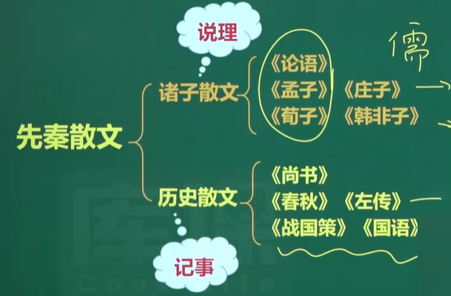

### 1.1 诸子散文

| 人物   | 生平                                                        | 身份                                             | 思想                                                         |
| ------ | ----------------------------------------------------------- | ------------------------------------------------ | ------------------------------------------------------------ |
| 孔子   | 春秋末期鲁国人<br />名丘，字仲尼                            | **儒家**学派的创始人，被尊称为==圣人，万世师表== | 教育思想：==有教无类，因材施教<br />== 政治思想：==治国以礼，为政以德== |
| 孟子   | 战国时期邹人<br />名轲，字子舆                              | **儒家**学派的主要代表，“==亚圣==”               | 思想： ==性善论 ==<br />政治思想:==“民贵君轻(体现了民本思想)”“仁政”“王道”== |
| 荀子   | 战国末期赵国人<br />名况，字卿，又称孙卿身份:儒家学派的代表 | **儒家**学派的代表                               | 思想:制天命而用之   ==性恶论== <br />政治思想:==“礼法并施”==“法后王” |
| 庄子   | 战国中期宋国人<br />名周                                    | **道家**学派的代表                               | 思想:顺应自然<br />政治思想:==“无为而治”==                   |
| 韩非子 | 战国末期韩国人<br />韩非                                    | **法家**学派的代表                               | 法治思想:==依法治国==<br />政治理想:==君主专制==，中央集权   |


| 著作       | 作者                                               | 体例                                   | 特点                         |
| ---------- | -------------------------------------------------- | -------------------------------------- | ---------------------------- |
| 《论语》   | 孔子的弟子及再传弟子                               | 语录体散文集                           | 语言简练                     |
| 《孟子》   | 孟子及其弟子共同编撰而成                           | 语录体散文集                           | 长于论辩、长于比喻、气势浩然 |
| 《荀子》   | 荀子和弟子们整理或记录他人言行的哲学著作           | 有标题的论文、散文                     |                              |
| 《庄子》   | ~~庄子门人和后学所作~~                             | 散文                                   | 想象丰富，汪洋恣肆           |
| 《韩非子》 | ~~大部分为韩非自著，有些篇章可能是后代学者补充的~~ | 一类是：政论散文<br />另一类是：说理的 |                              |


#### 1.1.1 散文发展的原因

1. 周王室衰败和诸侯兼并
2. 平民教育的兴起
3. 游说之术的兴起

#### 1.1.2 孔子与《论语》

1. 孔子
   - 籍贯：春秋末期鲁国人
   - 名字：名丘，字仲尼
   - 身份：儒家学派的创始人，被尊称为==圣人，万世师表==
   - 教育思想：==有教无类，因材施教==
   - 政治思想：治国以礼，为政以德；==克己复**礼**，**仁**者爱人==
   - 作品：晚年整理了“六经”（《诗》《书》《礼》《乐》《易》《春秋》）
2. 《论语》
   - 作者
     孔子的弟子及再传弟子
   - 内容
     孔子的言行
   - 文体
     ==语录体散文集==
   - 主要特点
     语言简练
   - 经典句子
     - 三人行必有我师焉，择其善者而从之，其不善者而改之。
     - 知之者不如好之者，好之者不如乐之者。
     - 见贤思齐焉，见不贤而内自省也。
     - 温故而知新，可以为师矣。

#### 1.1.3 诸子散文——孟子与《孟子》

1. 孟子
   - 籍贯:战国时期邹人
   - 名字:名轲，字子舆
   - 身份:==儒家学派==的主要代表，==“亚圣”==
   - 思想:==性善论==
   - 政治:==“民贵君轻(体现了民本思想)”“仁政”“王道”==
   - 作品：《孟子》
2. 《孟子》
   - 《孟子》是战国时期孟子的==言论汇编==，记录了孟子与其他各家思想的争辩，对弟子的言传身教，游说诸侯等内容，==由孟子及其弟子共同编撰而成。==
   - 《孟子》共七篇，分别为《梁惠王》《公孙丑》《滕文公》《离娄》《万章》《告子》《尽心》。各篇又都分为上、下。
   - 名篇:《生于忧患死于安乐》《得道多助失道寡助》《鱼我所欲也》《齐桓晋文之事》等
   - 文体：==语录体散文集==
   - 艺术特色
     《孟子》的思想核心是“仁义”，是对孔子学说的发展。其艺术特色表现为:
     1. **长于论辩**。巧妙灵活地运用逻辑推理的方法，反复诘难，迂回曲折地把对方引入自己预设的结论中。
     2. **长于比喻**。在论辩中常用比喻，把抽象的道理用具体生动的形象表现出来。
     3. **气势浩然**。大量使用排偶句、叠句等修辞手法,来加强了文章的气势。

#### 1.1.4 荀子与《荀子》.

- 荀子

  - 籍贯:战国末期赵国人

  - 名字:名况，字卿，又称孙卿身份:儒家学派的代表

  - 思想:制天命而用之   ==性恶论==

  - 政治:==“礼法并施”==“法后王”

  - 作品:《荀子》

- 《荀子》

  - 《荀子》，是战国时期**荀子和弟子们整理或记录他人言行的哲学著作。**
  - 《荀子》一书今存三十二篇，除少数篇章外，大部分是他自己所写。该书由《论语》《孟子》的语录体，发展为**有标题**的**论文**，标志着古代说理文的进一步成熟。他的散文说理透彻、语言质朴、多排比句，又善用比喻，有很强的说服力和感染力。
  - 《劝学》是《荀子》的第一篇。

#### 1.1.5 诸子散文——庄子与《庄子》

- 庄子
  - 籍贯:战国中期宋国人
  - 名字:名周
  - 身份:==道家==学派的代表
  - 思想:==顺应自然==
  - 政治:“==无为而治==”
  - 作品:《庄子》
- 《庄子》
  - 《庄子》又名《南华经》，共33篇。相传其中“**内篇**”7篇为庄子所作，“外篇”15篇和“杂篇”11篇为庄子门人和后学所作。庄子文章**想象丰富，汪洋恣肆**，辞藻瑰丽，善于虚构，并多采用**寓言**形式，富有浓厚的文学气息和**浪漫主义**色彩，被誉为“文学的哲学、哲学的文学”。
  - 名篇:《逍遥游》《秋水》等

#### 1.1.6 诸子散文——韩非子与《韩非子》

- 韩非子
  - 籍贯:战国末期韩国人
  - 名字:韩非
  - 身份:==法家==学派的代表
  - 法治思想:==依法治国==
  - 政治理想:==君主专制==，中央集权
- 《韩非子》
  - 《韩非子》是先秦**政论散文**的重要著作，全书五十五篇，约十余万字，大部分为韩非自著，有些篇章可能是后代学者补充的。
  - 《韩非子》的文章体裁，包括两类作品，一类是**政论文**，以说理精密、文笔犀利见长，表现出一种严峻、峭刻的文风;另一类是利用记述**历史故事**和创作**寓言**进行说理，寓意深刻，形象生动。

### 1.2  历史散文

| 历史散文       | 别名                       | 作者                 | 文体       | 地位                                                         | 备注                                                         |
| -------------- | -------------------------- | -------------------- | ---------- | ------------------------------------------------------------ | ------------------------------------------------------------ |
| 《尚书》       |                            |                      | 历史散文集 | ==《尚书》我国第一部**历史散文集**==                         |                                                              |
| 《春秋》       |                            |                      | 编年体史书 | ==《春秋》是我国历史上第一部**编年体**史书。==               | “春秋三传”:==《左传》、《公羊传》、《谷梁传》==。(为春秋做注解的) |
| 《左传》       | 《春秋左氏传》《左氏春秋》 | 左丘明               | 编年体史书 | ==《左传》是中国**第一部叙事详尽**、形式完备的**编年体**史书== | 为春秋做注解                                                 |
| 《国语》       | 《春秋外传》               | 相传为左丘明编写     | 国别体     | ==《国语》是我国第一部**国别体**史书==                       | 以==记载言论为主==的历史著作，长于对话，开创了国别体         |
| **《战国策》** |                            | 西汉**刘向**重加整理 | 国别体     |                                                              | 以==策士的游说==活动为中心                                   |


#### 1.2.1 《尚书》

1. 《尚书》释义
   意即“上古的历史”。它主要记录上古时期的誓、命、训、诰等历史文献。春秋战国时称《书》，到了汉代，才改称《尚书》。儒家尊之为经典，故又称《书经》。
2. 《尚书》内容
   记录的是王公的训诰与政令。
3. ==《尚书》我国第一部**历史散文集**==

#### 1.2.2 《春秋》及《左传》

1. 《春秋》释义
   “春秋”原是先秦时代各国史书的通称，后来仅有鲁国的《春秋》传世,便成为专称。这部原来由鲁国史官所编《春秋》，相传经过孔子整理、修订,赋予特殊的意义，因而也成为儒家重要的经典。
   ==《春秋》是我国历史上第一部**编年体**史书。==
2. “春秋笔法”和“春秋三传”
   - “春秋笔法”:相传孔子按照自己的观点对一些历史事件和人物作了评判，并选择他认为恰当的字眼来暗寓褒贬之意，文字相当简约，后人称之为“春秋笔法”或“微言大义”。
     - 如同样写战争，就有伐、侵、战、围、入、灭等不同的字眼:
       声罪致讨曰**伐**，潜师掠境曰**侵**，两兵相接曰**战**，环其城邑曰**围**，造其国都曰**入**，毁其宗庙社稷曰**灭**。
     - 同样杀人，又有杀、诛、弑等区别:
       杀无罪者曰**杀**，杀有罪者曰**诛**，下杀上曰**弑**。
   - “春秋三传”:
     **解说**、阐发《春秋》的主要有三部书，
     即==《左传》、《公羊传》、《谷梁传》==。
     《公羊传》和《谷梁传》纯用义理解释《春秋》，而《左传》则重视历史故事，用事实来补充、说明《春秋》。
3. 《左传》
   - 作者：相传==左丘明==
   - 体例：==编年体==
   - 为《春秋》做注解的史书
   - 艺术特色：==叙事能力表现惊人==
   - 地位：==我国历史上第一个**叙事详尽的编年体**史书==

#### 1.2.3 左丘明与《国语》

- 又名：==《春秋外传》==
- 作者：相传为==左丘明==编写
- 体例：==国别体==
- 地位：它是==我国第一部**国别体**史书==
- 内容：涉及周、鲁、齐、晋、郑、楚、吴、越八国
- 特点：以记载==言论为主==的历史著作，长于对话，开创了国别体

#### 1.2.4 刘向与《战国策》

- 作者：==西汉**刘向**==重加整理
- 文体：==国别体==
- 内容：==以**策士的游说**活动为中心==，反映出这一时期各国政治、外交的情状
- 艺术特色：
  - 语言富于文采
  - 描写人物性格和活动具体细致
  - 巧用譬喻和寓言故事，增强说服力

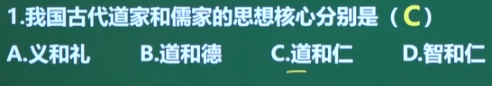

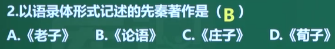

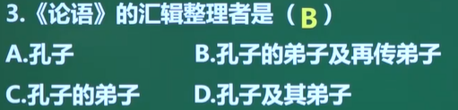

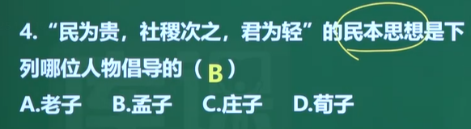

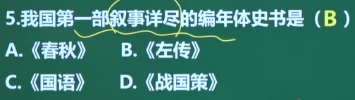

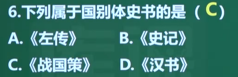

## 2. 秦汉散文

### 2.1 李斯与秦代散文

- 李斯
  - 籍贯: 战国未楚国上蔡
  - 师从:荀子
  - 身份:秦始皇时丞相，==法家学派代表人物==。
  - 作品:==《谏逐客书》==《言赵高书》《狱中上书》

### 2.2 汉代散文

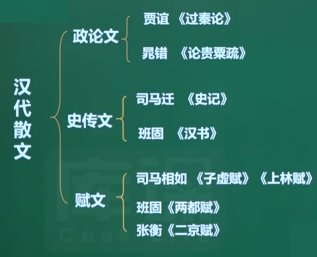

#### 2.2.1 政论文

- ~~两汉政论文的发展颇为迅速。政论文的**功利性和时效性**，决定了它与时代需要、社会风气，特别是与土人心态有着直接紧密的联系。~~
- 文人喜借题发挥，以史为鉴而述治国方略，东汉后期文人常径遂直陈，横议朝政以痛斥时弊，**文风刚劲质朴**。代表人物:贾谊、晁错。
- ~~贾谊散文简介~~
  据《汉书．艺文志》记载，贾谊散文共58篇，收录于《新书》。
  其作品大致可分三类:
  - 一是专题**政论文**，如《过秦论》
  - 二是就具体问题所写的疏牌文，如《论积贮琉》《陈政事书》
  - 三是一些杂论。

#### 2.2.2 史传文

##### 2.2.2.1 司马迁和《史记》

- 司马迁
  - 字==子长==
  - ==西汉时期伟大的史学家、文学家==。
  - 司马谈之子，任太史令，因替李陵败降之事辩解而受宫刑，后任中书令。发奋继续完成所著史籍
  - 被后世尊称为==史迁、太史公、历史之父==。
- 《史记》
  - 原名==《太史公书》==，东汉末始称《史记》
  - 作者：==司马迁==
  - 我国==第一部纪传体通史==
  - ==12本纪，30世家，70列传，10表，8书==
  - 目的:究天人之际，通古今之变，成一家之言
  - 鲁迅:“==史家之绝唱，无韵之离骚=="
  - ==内容(单选)==：
    - 本纪: 叙述历代帝王的历史
    - 世家: 叙述贵族王侯的历史
    - 列传: 历代诸侯之外名官名人的事迹
    - 表: 各个历史时期的简单大事记
    - 书: 记载典章制度，天文地理
  - 影响：
    - 开纪传体史书之先河，**前4史:《史记》《汉书》《后汉书》《三国志》**
  - ==“史学双璧”:《史记》《资治通鉴》==

##### 2.2.2.2 班固与《汉书》

- 班固
  - 字孟坚，东汉大臣、史学家、文学家
  - 与司马迁并称“班马”。
  - 作为史学家，修撰==《汉书》==，是“前四史”之一;
    作为辞赋家，是“汉赋四大家”之一
  - ==《两都赋》==**开创了京都赋的范例**，列入《文选》第一篇;
- 《汉书》
  - 别称：==《前汉书》==
  - 地位：==第一部**纪传体断代史**==
  - 《汉书》全书主要记述了上起汉高祖元年，下至新朝王莽地皇四年共二百多年的史事，包括**纪十二篇，表八篇,，志十篇，传七十篇，共一百篇。**
  - 《汉书》与《史记》《后汉书》《三国志》并称为“前四史”。

#### 2.2.3 赋文

汉赋

- 汉赋,是在汉朝涌现出的一种**有韵的散文**
- 特点是散韵结合，专事铺叙。
- 从赋的形式上看，在于“铺采璃文”;
  从赋的内容上说，侧重“体物写志”。
- 汉赋的内容可分为5类:
  一是渲染宫殿城市;二是描写帝王游猎;三是叙述旅行经历;四是抒发不遇之情;五是杂谈禽兽草木。而以前二者为汉赋之代表。
- 赋的特点:体物写志，注重铺陈，词藻华美,色彩绚丽。
- 在发展中它吸收了楚辞的某些特点─华丽的辞藻，夸张的手法，因而丰富了自己的体制。正由于赋体的发展与楚辞有着密切关系，所以汉代往往把辞赋连称。
- ==汉赋代表==
  - **司马相如《子虚赋》《上林赋》**
  - 扬雄《甘泉》《河东》
  - 枚乘《七发》
  - 京都赋 **班固《两都赋》**
  - **张衡《二京赋》**
  - 小赋 张衡《归田赋》等

## 3. 魏晋南北朝散文

- 南北朝时期骈文兴盛
- 郦道元《水经注》

## 4. 唐宋散文

一方面扬六朝余波，有讲究辞采的骈文另一方面革六朝旧习，有散行流畅的古文
代表作家:唐宋八大家

---

古文运动

- <u>中唐</u>时期，伴随着政治变革，**韩愈、柳宗元**等人尖锐批判六朝以来的骈俪文，提倡更为实用的上继先秦两汉的散文，并称之为“古文”，与骈俪文相对立。在他们的影响下，中唐文风大变，清新流畅的新文体基本上取代了几百年来骈文的统治地位这次文体革新被称为唐代古文运动。
- 欧阳修在<u>北宋</u>中叶发起继韩柳之后的再一次古文运动，**欧阳修**以他文坛盟主的地位，快速形成了以他为首的，包括**曾巩、王安石、三苏**在内的文学集团，于是一度中断了的韩柳古文传统得到继承与发扬。

---

- ==唐宋八大家==

  - 唐：韩愈、柳宗元
  - 宋：欧阳修、王安石、曾巩、苏询、苏轼、苏辙

- **韩愈**：被苏轼赞为“==文起八代之衰，道济天下之溺==”

- 苏轼：《前赤壁赋》(文赋)

- 文学主张
  | 人物   | 主张                                                       |
  | ------ | ---------------------------------------------------------- |
  | 韩愈   | ==“文以载道”“惟陈言之务去”“不平则鸣”“文从字顺”“辞必己出”== |
  | 柳宗元 | ==“文以明道”==                                             |
  | 欧阳修 | ==“明道致用，事信言文”==                                   |

## 5. 元明清散文

- 元明清三代，戏曲、小说兴盛起来，而诗文的成就已不能和唐宋相比。元代散文和宋代相比，远为逊色。明清考试的八股文，是骈文的别支，形式死板，严重束缚作者的创作自由，给文学发展带来负面影响。
- 明代的散文取材较为广泛，后期散文的表现手法也较为多样，尤其是晚明小品文。清代散文，包括古文和骈文

### 5.1 明初

- ==宋濂==:
  - 被朱元璋誉为==“开国文臣之首”==
  - 简练典雅的散文。《送东阳马生序》
- 刘基:
  - 短篇寓言。
  - 《卖柑者言》《郁离子》

### 5.2 明代初期

- ==明七子==：
  - 提倡：“==文必秦汉，诗必盛唐==”
  - **李梦阳、何景明**为首的**前七子**发起复古运动，倡导**文必秦汉**。对扫荡八股文风起到一定积极用，同时又走上了<u>盲目摸拟古人</u>的路子。
  - 后来的**李攀龙、王世贞**为代表的**后七子**复古运动，也再一次重复了他们的错误。
- 李梦阳《梅山先生墓志铭》
- ==宗臣《报刘一丈书》==

---

- **归有光**和“唐宋派”
  唐宋派<u>主张继承唐宋古文传统，反对前后七子</u>。代表:归有光、王慎中。
  ==归有光《项脊轩志》《先妣事略》==

### 5.3 明代晚期

- 公安派
  - 代表人物:**袁宏道**
  - 主张:文学应真实地表现人的个性化情感与欲望，反对前后“七子”的拟古。
- 竟陵派
  - 代表人物:钟惺  谭元春
  - 特点:多描写文人日常生活情景，表现当时的生活风尚与情调，形成了个人化、生活化与写实求真的创作特征
- ==张岱==
  - 代表作品:==《湖心亭看雪》《西湖七月半》==

> 公安派和竟陵派共同推动了小品文的发展
>
> - 小品文:散文的一种。融议论、抒情和叙述于一体，篇幅短小，笔法灵活，语言活泼生动。有时事小品、历史小品、科学小品和讽刺小品等。

## 6. 清代散文

### 6.1 清代初期

- 清代初期散文可分为两类:
  1. 学者之文:以黄宗羲、顾炎武、王夫之等为代表。以学术修养根底，以政论、史论见长，风骨遒劲，表现出强烈的时代精神。
  2. 文人之文:以侯方域、魏禧、汪碗等为代表。以唐宋古文为取资，以传记文学为优，各具特色，表现出较高的艺术价值
- 清初三大散文家：==侯方域、魏禧、汪碗==
  - ==侯方域《马伶传》==，《马伶传》中，马伶两次演《鸣凤记》，她==饰演的人物是**严崇**==
  - 魏禧《大铁椎传》
  - 汪碗《传是楼记》
- **桐城派**
  桐城派是清中叶最著名的流派，主要作家有方苞、刘大概、姚鼎。方苞提出的“**义法**”是桐城派的基本理论。文章多简洁自然，但缺乏生气，代表作品有方苞的《狱中杂记》《左忠毅公逸事》，姚辣的《登泰山记》等。
- 鸦片战争时期
  - **龚自珍**
    - 直接继承和发扬先秦诸子百家散文无所拘忌的创造精神，突破一般记事和议论模式，自由大胆地表示自己的见解和情感,开创了经世散文的新风，标志着清代散文的转折。
    - 代表作品:==《病梅馆记》==(反对摧残自然生机、追求个性解放)
- 晚清时期
  - 康有为和梁启超:
    - 主张变法维新，冲击桐城派。梁启超创立的新文体散文比传统古文通俗，条理明畅，不避俚语俗言，并吸收外文语法，大胆抒写新见解，笔锋常带感情，又极大的感染力语说服刀。
    - 代表作品:==梁启超《少年中国说》==

# Ⅴ. 小说的发展

小说是以叙述、描写为主要方式,以塑造**人物形象**为中心，通过**故事情节**和**具体环境**的描绘来反映社会现实的一种文学体裁。

- 小说的三要素：==人物、环境和故事情节==

## 一. 中国古典小说的发展历程

| 朝代       | 发展阶段 | 类型                     | 例子                               |
| ---------- | -------- | ------------------------ | ---------------------------------- |
| 六朝以前   | 起源     | 神话传说                 | 《山海经》                         |
| 魏晋南北朝 | 雏形期   | 志人志怪小说             | 《世说新语》《搜神记》             |
| 唐         | 定型期   | 传奇小说                 | 《柳毅传》《李娃传》               |
| 宋元       | 发展期   | 话本小说<br />拟话本小说 | 《五代史平话》《大唐三藏取经诗话》 |
| 明清       | 高峰期   | 拟话本小说<br />章回小说 | 四大名著等                         |

### 1. 小说的起源

| 分类     | 解释                                                         |
| -------- | ------------------------------------------------------------ |
| 寓言故事 | 《孟子》《庄子》《韩非子》《战国策》，等书中都有不少人物**性格鲜明**的**寓言故事**,它们已经带有小说的意味。 |
| 史传文学 | 《左传》《战国策》《史记》《三国志》，描弓**人物性格**，叙述**故事情节**，或为小说提供了素材，或为小说积累了叙事的经验。 |
| 神话传说 | 《盘古开天》《女娲补天》《后羿射曰》《夸父逐日》《嫦娥奔月》等等 |

### 2. 小说的雏形期

- 魏晋南北朝——志人志怪小说
- 志人小说:
  - 以记载人物的琐闻逸事为主。
  - 代表作品:==刘义庆《世说新语》==
  
    - 地位：==我国第一部**志人**小说==
  
    - 《世说新语》分为==雅量、言语、俭啬、容止、任诞、汰侈==
  
      - 雅量
        夏侯太初尝倚柱作书，时大雨，霹雳破所倚柱，衣服焦然，神色无变，书亦如故。宾客左右皆跌荡不得住。(淡定的境界)
  
      - 言语
        徐孺子年九岁，尝月下戏。人语之曰:“若令月中无物，当极明邪?”徐曰:“不然。譬如人眼中有瞳子，无此必不明。"
  
      - 俭啬
        王戎女适裴頠，贷钱数万。女归，戎色不说;女遽还钱，乃释然。
  
      - 容止
        卫瑜从豫章至下都，人久闻其名，观者如堵墙。玢先有赢疾，体不堪劳，遂成病而死。时人谓看杀卫瑜。
  
      - 任诞
        刘伶恒纵酒放达，或脱衣裸形在屋中，人见讥之。伶曰:“我以天地为栋宇，屋室为辉衣，诸君何为入我裈中!”
  
      - 汰侈
        石祟厕，常有十馀婢侍列，皆丽服藻饰;置甲煎粉。沉香汁之属，无不毕备。又与新衣著令出，客多羞不能如厕。王大将军往，脱故衣，著新衣，神色傲然。群婢相谓曰:“此客必能作贼!”
  
  - 志怪小说:
  
    - 记述神仙方术、鬼魅妖怪、佛法灵异之事,有一些宗教迷信思想但也有积极的民间故事和传说。
    - 代表作品:==干宝《搜神记》==

### 3. 小说的定型期

唐——传奇小说

- 唐传奇是指唐代流行的文言小说，作者大多以记、传名篇，以史家笔法，传奇闻异事。

- 特点：

  - 有意识的作小说
  - 从鬼神灵异、奇闻逸事走向现实生活
  - 在艺术上有了很大的创造和提高

- 代表作品(主要看表中的)

  - ==元稹《莺莺传》==

  - 唐初年:   王度(隋末)《古镜记》无名氏《白猿传》

  - 武则天时:  张薏《游仙窟》

  - 大历

    - ==沈既济《枕中记》==→明 汤显祖《邯郸记》→清 蒲松龄《续黄粱》
    - 陈鸿《长恨歌传》→清洪昇《长生殿》
    - 白行简《李娃传》→元人的《曲江池》→明薛近兖《绣襦记》

  - | 作家   | 作品           | 主要人物     |
    | ------ | -------------- | ------------ |
    | 蒋防   | 《霍小玉传》   | 霍小玉、李益 |
    | 元稹   | 《莺莺传》     | 张生、崔莺莺 |
    | 李朝威 | 《柳毅传》     | 柳毅、龙女   |
    | 白行简 | 《李娃传》     | 李娃、郑生   |
    | 李公佐 | 《南柯太守传》 | 淳于棼       |

### 4. 小说的发展期

宋元——==话本、拟话本==

- 话本:

  - 话本是宋代兴起的白话小说，用通俗文字写成，多以历史故事和当时社会生活为题材，是宋元民间艺人说唱的底本。
  - 代表作品(了解):
    《梁公九谏》《五代史平话》《通俗小说》《京本通小说》《清平山堂话本》

- 拟话本:

  - 文人模仿话本形式编写的小说

  - 代表作品:
    《大唐三藏取经诗话》-取材后->《西游记》
    《大宋宣和遗事》-取材后->《水浒传》

### 5. 小说的高峰期

明清

章回小说
由宋元讲史话本发展而来的分章回叙事的**白话小说**，是我国古典小说的主要形式，分回标目，段落整齐，首尾完整,是其主要特点。

---

- 明代小说
  - 长篇小说
    - 神魔小说
      - 《西游记》中国第一部浪漫主义章回体长篇**神魔小说**
      - 《封神演义》
      - 《三宝太监西洋记》
    - 世情小说
      - ==兰陵笑笑生的《金瓶梅》：我国第一部世情小说==
  - 短篇小说
    - ==三言==
      - 《喻世明言》
      - 《警世通言》
      - 《醒世恒言》
    - ==二拍==
      - 作者:凌蒙初
      - 《初刻拍案惊奇》
      - 《二刻拍案惊奇》

---

- 《西游记》
  - 作者：明代 吴承恩
  - 地位：==中国第一部浪漫主义章回体长篇**神魔小说**==
  - 现实依据：以“玄奘取经”这一历史事件为蓝本，经作者的艺术加工，深刻地描绘出明代百姓的社会生活状况。
- “三言二拍”是明代著名的拟话本系列，是我国古代流传颇广的短篇小说集。
  - “三言”是指明代冯梦龙所编纂的==《喻世明言》《警世通言》和《醒世恒言》==，作品题材广泛，内容复杂，从各个角度不同程度地反映了当时市民阶层的生活面貌和思想感情。
  - “二拍”是指==凌蒙初==所编的==《初刻拍案惊奇》和《二刻拍案惊奇》==，作者根据野史笔记、文言小说和当时的社会传闻创作的，主题反映了市民生活中追求财富和享乐的社会风气，同时反映了资本主义萌芽时期人们渴望爱情和平等的自由主义思想。


---

清代小说的四大类别

| 类别   | ~~解释~~                                                     |
| ------ | ------------------------------------------------------------ |
| 拟古派 | 所谓拟古，是指模拟六朝的志怪小说，或模拟唐朝的传奇小说。     |
| 讽刺派 | 在小说中寄寓讥讽                                             |
| 人情派 | 叙述的是些风流放纵的故事，在悲欢离合之中，写炎凉的世态       |
| 侠义派 | 一般是叙侠义之士，除道平判的故事。而书中又以文臣大官，总领一切 |

- 拟古派

  - 《剪灯新话》 瞿佑
  - ==《聊斋志异》蒲松龄==

    - 书中所叙，多是神仙，狐鬼，精魅等故事。其优点在于描写详细而委曲，用笔变幻而熟达。说妖鬼多具人情，通世故，使人觉得可亲。

    - 《聊斋志异》(简称《聊斋》，俗名**《鬼狐传》**）是清朝小说家==蒲松龄==创作的==文言**短**篇小说集==。

    - 评价：

      - 郭沫若:“写鬼写妖高人一等，刺贪刺虐入骨三分。”
      - 老舍:“鬼狐有性格，笑骂成文章。"

    - 题材(了解)

      - 反映社会黑暗，揭露和抨击封建统治阶级压迫、残害人民罪行。
        - 作品及描写的人物
          《席方平》：席方平
          《促织》：成名

      - 反对封建婚姻批判封建礼教，歌颂青年男女纯真的爱情。
        - 作品及描写的人物
          《聂小倩》：聂小倩，宁采臣
          《婴宁》：王子服，婴宁
      - 揭露和批判科举考试制度的腐败和种种弊端。
        《叶生》
      - 总结生活中的经验教训，教育人要诚实、乐于助人、吃苦耐劳、知过能改等等，带有道德训诫意义。
        《画皮》《崂山道士》
  - 《阅微草堂笔记》纪昀(纪晓岚)

    - 完全模仿六朝志怪小说，尚质黜华，叙述简古,力避唐人的作法。他的材料大多自编，多借狐鬼的话，来攻击社会。


---

- 讽刺派

  - 《儒林外史》吴敬梓
    - 书中描写士林形形色色的人物，有劣伸，贪官迁儒,斗方名士，自命不凡的贵公子。当然也有作者赞扬的人，一类是士林中为数不多的贤者，一类是市井小民。
  - ==四大谴责小说==
    - 《官场现形记》李宝嘉
    - 《二十年目睹之怪现状》吴沃尧
    - 《孽海花》曾朴
    - 《老残游记》刘鹗

  ---

- 人情派

  - 《红楼梦》曹雪芹
    - 作者：清代 曹雪芹
      其通行本共120回，一般认为前80回是清代作家曹雪芹所著，后40回为高鹗所续。
    - 原名《石头记》
    - 地位：中国古代章回体长篇小说,中国古典四大名著之一。
    - 小说以**贾、史、王、薛**四大家族的兴衰为背景，
      以**贾宝玉**与**林黛玉**、**薛宝钗**的爱情婚姻悲剧为主线，
      描绘了一些闺阁佳人的人生百态，展现了真正的人性美和悲剧美,是一部具有世界影响力的人情小说、==中国封建社会的百科全书==、传统文化的集大成者。
    - 人物：
      - 晴雯：心比天高，身为下贱吗。风流灵巧招人怨
  - 《海上花列传》
  - 《九尾龟》

## 二. 中国现当代小说发展历程

| 时间      | 发展阶段             | 类型                                     | 代表人物                           |
| --------- | -------------------- | ---------------------------------------- | ---------------------------------- |
| 民国时期  | 多元文艺复兴阶段     | 各类小说题材涌现，连载小说出现           | 鲁讯、郭沫若、矛盾、巴金、老舍、曹 |
| 1949-1976 | 阶级斗争阶段         | 主题带有政治倾向(大陆)，武侠、言情(港台) | 琼瑶、金庸                         |
| 1976-2003 | 小说的反思和蜕变阶段 | 农村题材、城市题材                       | 莫言、贾平凹、陈忠实               |
| 2003-至今 | 网络文学阶段         | 武侠玄幻、言情                           | 唐七公子、桐华                     |

代表作家及作品

- 鲁迅

  - 原名：周章寿，后改名周树人，字豫才

  - 浙江绍兴人

  - 著名文学家、思想家、教育家，中国现代文学的奠基人之一

  - 评价：
    毛泽东评价他是伟大的无产阶级的文学家、思想家、革命家，是中国文化革命的主将，被称为==民族魂==

  - 作品

    - 1918年5月，鲁迅首次以“鲁迅”作笔名,发表了==中国文学史上第一篇白话小说《狂人日记》==。

    - 他的著作以小说、杂文为主，

    - 代表作有:
      小说集==《呐喊》《彷徨》《故事新编》==
      小说：==《伤逝》《风波》==;
      散文集==《朝花夕拾》==;
      文学论著《中国小说史略》;
      散诗集《野草》;
      杂文集《坟》《热风集》《华盖集》等18部。

    - 《风波》：

      - 《风波》是鲁迅创作于1920年的一篇短篇小说，首发《新青年》杂志，后收入在《呐喊》中。小说写的是一根辫子引发的风波。1917年张勋拥护溥仪复辟,要求百姓留辫子。此时落后的农村有三种人，多数是还留着辫子的，少数是剪掉辫子的，还有极少数是留着辫子把辫子盘在头上的。主人公七斤是一个没有辫子的人，但他并不是自觉剪掉辫子的，而是进城时不小心被人抓住剪掉的。

      - 思想内容：
        《风波》通过一场由辫子引起的风波，<u>反映了辛亥革命的不彻底性</u>，这次革命既没能启发农民的觉悟，也没给封建统治下的农村带来真正的变革，从而表明<u>没有广大农民的觉悟，就不会有民主革命。</u>

  ---

- 矛盾

  - 原名沈德鸿，字雁冰，浙江嘉兴人。
  - 中国现代作家、文学评论家、文化活动家以及社会活动家。
  - 代表作品:《林家铺子》《子夜》
    =="蚀"三部曲:《幻灭》《动摇》《追求》==
    ==农村三部曲:《春蚕》《秋收》《残冬》==
  - 作品多写“大革命”失败之后，中国工商业和农业的凋敝状况

- 巴金

  - 原名：李娆棠
  - 擅长写以家庭生活为题材的小说
  - 作品
    - ==**爱情**三部曲：《雾》《雨》《电》==
    - ==**激流**三部曲：《家》《春》《秋》==

- 老舍

  - 原名：舒庆春，字舍予
  - ==新中国第一位获得“**人民艺术家**”称号的作家==，是一位典型的“京味儿”作家
  - 代表作
    - ==长篇小说《骆驼祥子》《四世同堂》==
    - 中篇小说：《月牙儿》《我这一辈子》
    - ==短片小说《断魂枪》==
      - 《断魂枪》讲的是清朝末年，列强入侵。镖局被洋枪取代后，身怀绝技“五虎断魂枪”的镖师沙子龙无奈把镖局解散;而“五虎断魂枪”的枪法也决不再传。王三胜是沙子龙的大徒弟，在与孙老者的较量中被打败，就引着孙老者来拜会沙子龙。但不管孙老者怎么说，沙子龙就是无动于衷，绝口不提武艺，从而威名大跌。深夜，往日的老镖师在后院耍起了枪法，望着星空，想起了当年押镖的岁月，说了4个字:“不传，不传”。

- 赵树理

  - 被誉为==“山药蛋派”==的鼻祖。
  - 代表着20世纪40年代解放区文学的最高成就。
  - 他的小说多以华北农村为背景，反映农村社会的变迁和矛盾斗争。
  - 代表作品有《小二黑结婚》《李家庄的变迁》《李有才板话》等。

- 钱钟书

  - 字默存
  - 代表作品：
    长篇小说==《围城》==
    短篇小说集《人·兽·鬼》等
  - ==**《围城》**被认为是中国现代文学史上的一部**新《儒林外史》**==
  - 讲述的是知识分子方鸿渐与苏文纨、唐晓芙、孙柔嘉等女性青年在爱情上的纠葛以及与赵辛楣、顾尔谦、李梅亭等同僚在事业中的恩怨

- 张爱玲

  - 祖籍河北唐山，生于上海，中国现代女作家。
  - 代表作品
    - **《沉香屑》**(葛薇龙)
    - **《半生缘》**(又名《十八春》沈世钧+顾曼桢)
    - **《倾城之恋》**(白流苏+范柳原)
    - **《花凋》**(川娥)
    - **《金锁记》**（曹七巧)等
  - 具有“华丽而苍凉,琐碎又大气”的风格。

- 周立波

  - 原名周绍仪，与赵树理并称“南周北赵”。
  - 名作是长篇小说==《暴风骤雨》==、《山乡巨变》。
  - 其中，==以农村土地改革为题材的《暴风骤雨》，于1951年荣获了“斯大林文学奖”==

- 曲波
  - 名作是长篇小说==《林海雪原》==，写的是团参谋长少剑波带领侦察英雄杨子荣与威虎山悍匪“座山雕”斗智斗勇的故事，被誉为==“新武侠小说”==。
- 茹志娟
  - ==短篇小说《百合花》==，被誉为“没有爱情的爱情牧歌”
- 张洁
  - 代表作品：==《从森林里来的孩子》**《沉重的翅膀》**《祖母绿》==
- 冯骥才==《俗世奇人》==
  - 充满天津的市井风格
- 陈忠实《白鹿原》
- 路遥《平凡的世界》
- 史铁生
  - 短篇小说==《我的遥远的清平湾》==
  - 中篇小说==《命若琴弦》==
  - 散文==《我与地坛》==
  
- 莫言

  - 原名：管谟业
  - ==我国第一位获得**“诺贝尔文学奖”**的作家==
  - 作品：==《蛙》《透明的红萝卜》《红高粱》《丰乳肥臀》《檀香刑》《生死疲劳》==等

- 林海音

  - 原名：林含英

  - 《城南旧事》

# Ⅵ. 现代文阅读

## 一. 写作(艺术)手法

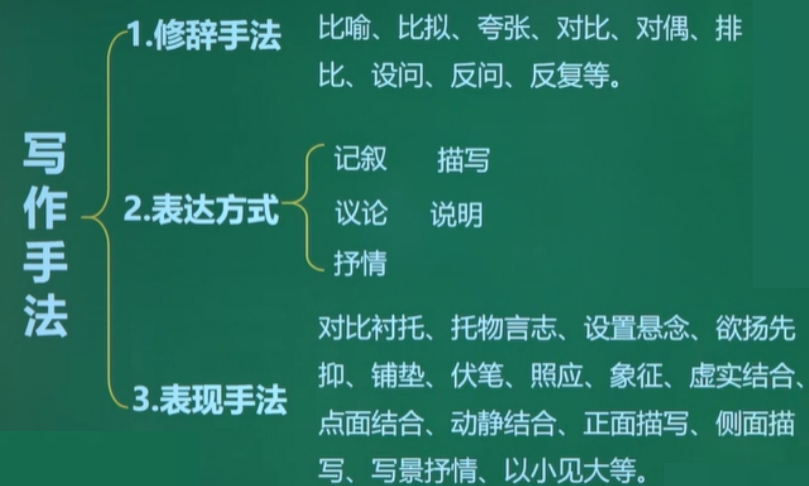

### 1. 修辞手法

通常情况下涉及的修辞手法为有**比喻、拟人、排比、夸张**

1. 比喻作用
   - 能将要表达的内容说明得**生动、形象**、具体、逼真
   - 能给人以**深刻鲜明的形象**，使说理更透彻
2. 拟人作用
   - 能使事物**人格化**，生动、形象
3. 夸张作用
   - 揭示事物的**本质**，烘托气氛，增加语言感染力
   - 给读者以**联想和想象**，增加语言的生动性
4. 排比作用
   - **加强语言气势**，增强文章的说服力和感染力

---

答题思路：

- 从修辞角度分析
  - 方法：修辞手法+词语表达效果
  - 答题思路：这个词采用了……的手法，生动形象地写出了……的特点，表现了……的情感(或心理)

> 例1:结合语境，分析划线词语的表达效果。
>
> 小草<u>偷偷地</u>从土里钻出来，嫩嫩的，绿绿的。
>
> - “偷偷”运用了**拟人**的修辞手法，**生动形象**地写出了小草在不经意间已经破土而出的情态，表现了作者对小草的喜爱之情。
>
> ---
>
> 例2:请从修辞的角度赏析下列句子的表达效果。
>
> “滴滴点点滴滴，似幻似真，若孩时在摇篮里，一曲耳熟的童谣摇摇欲睡，母亲吟哦鼻音与喉音。”(《听听那冷雨》)
>
> - 此句运用了**比喻**的修辞手法，把听雨的感受**比作**听到母亲哼唱催眠童谣，**形象生动地**表现出雨的节奏细细密密，听雨的感受柔婉亲切。
>
> ---
>
> 例3:下面句子使用了什么修辞手法?其作用是什么?
> 听听那冷雨，看看那冷雨，嗅嗅闻闻那冷雨，舔舔吧，那冷雨。(《听听那冷雨》)
>
> - 运用了**排比**的修辞手法，更加具体地展现出冷雨的形态，**增强语言气势**，给人以难以忘怀的超脱感，**表达了**作者对基隆的雨的喜爱之情。
>
> ---
>
> 例4:下面句子使用了什么修辞手法?其作用是什么?
> 贾不假，白玉为堂金作马。
> 阿房宫，三百里，住不下金陵一个史。东海缺少白玉床，龙王来请金陵王。丰年好大雪，珍珠如土金如铁。
>
> - 运用了夸张的修辞，强调了四大家族的富有和奢侈。
>
> ---
>
> 1.饺子如一尾尾小银鱼在翻滚的水花中上下翻腾，充满生趣。(《花边饺子》)
> 将上段中“饺子如一尾尾小银鱼在翻滚的水花中上下翻腾，充满生趣”改成“饺子在翻滚的水花中上下翻腾，充满生趣”好不好?为什么?
>
> - 不好，原句中的“如一尾尾小银鱼”使用了比喻，既写出了锅中饺子的形态，又表现了场面的欢快，显得生动、形象、有趣。
>
> ---
>
> 2.还可以用艺术形式对应四季，这样春天就是一幅画,夏天就是一部长篇小说，秋天是一组短歌或诗，冬天是一群雕塑。(《我与地坛》)
> 这段文字主要运用了哪些修辞手法?有何表达效果?
>
> - 排比、比喻。增强了语句的气势，把四季比成不同的艺术形式，生动形象地说明了四季之美，表达作者对四季的喜爱之情。
>
> ---
>
> 祖母的葵花
> 丁立梅
> ①我总是要想到葵花，一排一排，种在小院门口。
>
> - 首段作用：表明本文的**描写对象**葵花;**引出下文**对祖母的回忆。
>
> ②是祖母种的。<u>A祖母侍弄土地，就像她在鞋面上绣花一样，一针下去，绿的是叶，再一针下去，黄的是花。</u>
>
> - A运用**比喻**，**生动形象**地表现了祖母侍弄土地时的精心，对劳动的热爱，对生活的热爱。
>
> ③记忆里的黄花总也开不败。
> ④丝瓜、黄瓜是搭在架子上长的。<u>B扁扁的绿叶在风中婆娑，那些小黄花，就开在叶间，很妖娆地笑着。</u>南瓜多数是趴在地上长的，长长的蔓，会牵引得很远很远。像对遥远的地方怀了无限向往，蓄着劲儿要追寻了去，在一路的追寻中，绽放大朵大朵黄花。黄得很浓艳,是化不开的情。
>
> - B运用**拟人**，**生动形象**地描写了绿叶在地里摇摆的姿态和小黄花的可爱情态，**表现了**作者的喜爱之情。
>
> ⑤还有一种植物，被祖母称作“乌子”的。它像爬山虎似的，顺着墙角往上爬，枝枝蔓蔓都是绿绿的，一直把整座房子包裹住了才作罢。忽一日，哗啦啦花都开了，远远看去，房子插了满头黄花呀，美得让人心醉。
> ⑥最突出的，还是葵花。它们挺立着，情绪饱满，斗志昂扬，迎着太阳的方向，把头颅昂起，再昂起。小时候我曾奇怪于它怎么总迎着太阳转呢，伸了小手，拼命拉扯那大盘的花，不让它看太阳，但我手一松，它弹跳一下，头颅又昂上去了，永不可折弯的样子。
> ⑦梵高在1888年的《向日葵》里，用大把金黄来渲染葵花。画中，一朵一朵葵花，在阳光下怒放，仿佛是“背景上迸发出的燃烧的火焰”。梵高说，那是爱的最强光。在颇多失意颇多彷徨的日子里，那大朵的葵花，给他幽暗沉郁的心，注入最后的温暖。
>
> - 第⑦段写到了梵高和他创作的《向日葵》，这样写有什么作用?请结合文章内容简要分析。
> - 表现了葵花对失意、彷徨中的梵高的鼓舞(注入的温暖),表现了“爱的最强光”;**赋予葵花更深的内涵**，艺术中的葵花与现实生活中的黄花**虚实结合**，**丰富了文章的内涵，点明文章中心。**
>
> ⑧我的祖母不知道梵高，不懂得爱的最强光，但她喜欢种葵花。在那些缺衣少吃的岁月里，院门前那一排排葵花，在我们心头，投下最明艳的色彩。葵花开了，就快有香香的瓜子嗑了。这是一种<u>C香香的</u>等待，这样的等待很幸福。
>
> - 联系上下文，体会第⑧段中“这是一种香香的等待,这样的等待很幸福”一句中“香香的"有何妙处。
> - C表现了葵花籽的香味;表现了等待嗑瓜子时的幸福快乐;体现了“我们”的童真童趣;**使用叠词，朗朗上口，有韵律美。**
>
> ⑨葵花结籽，亦有另一种风韵。沉甸甸的，望得见日月风光在里头喧闹。这个时候，它的头颅开始低垂，有些含羞，有些深沉，但腰杆仍是挺直的。一颗一颗的瓜子，一日一日成形，饱满，吸足阳光和花香。葵花成熟起来，蜂窝一般的。祖母摘下它们，轻轻敲，一颗一颗的瓜子就落到祖母预先放好的匾子里。放在阳光下晒，会闻见花朵的香气。一颗瓜子，原来是一朵花的魂啊!
> ⑩瓜子晒干，祖母会用文火炒熟，这个孩子口袋里装一把，那个孩子口袋里装一把。我们的童年就这样香香地过来了。
> 11.如今，祖母老了，老得连葵花也种不动了。老家屋前，一片空落的寂静。七月的天空下，祖母坐在老屋院门口，坐在老槐树底下，不错眼地盯着一个方向看。我想，那里，一定有一棵葵花正在开放，开在祖母的心窝里。

### 2. 表达方式

记叙、说明、议论、描写、抒情

##### 2.1.1 记叙

- 概念:
  记载、述说人物活动的一般情况和事件的发生、发展**过程**。
- 作用:
  - 介绍人物的身世、地位、经历、事迹等，叙述事情的发生、发展或变化过程，交代事件的前因后果等。
  - 在议论文中，提供事实论据，以用来证明论点。

##### 2.1.2 说明

- 概念:
  对事物的外形、性质、特点、构造、功能、作用、成因、关系等作**客观的介绍**。一般不是感性形象的描绘。
- 作用:
  1. 用来把事物的外形、特点、性质、构造、功能等解说清楚，使读者对这一事物有明晰、完整的了解和认识。
  2. 是说明文的主要表达方式，常用于说明文。
  3. 也常在议论文中与议论交叉使用或在记叙文中使用。

##### 2.1.3 议论

- 概念:
  对人和事物的好坏、是非、价值、特点、作用等所表示的**意见**。
- 作用:
  1. 是议论的主要表达方式。
  2. 在记叙文中常穿插在叙述、描写之中，用以点明或更鲜明地突出文章的中心思想，增强文章的感染力。、

##### 2.1.4 描写

- 概念:用形象生动的语言对**人物、事件、环境**所作的**具体描绘和刻画。**
- 作用:
  1. 再现美丽的自然景色和山川风光，抒发感情。
  2. 描写人物的外貌、言行和内心世界，表现人物性格，刻画人物形象。
  3. 描写人物活动的自然或社会环境，交代背景，渲染气氛，帮助刻画人物性格，衬托人物的思想感情。
  4. 增强文章的形象性、生动性和真实感。
- 分类
  - 人物描写
    - 外貌、语言、动作、心理、神态描写
  - 环境描写
    - 自然环境
    - 社会环境
  - 场面描写
  - 细节描写

###### 2.1.4.1 外貌描写

根据表现手法分类正面描写和侧面描写

---

<p style="color:green">正面描写</p>

对所要表现的人物或中心事件进行直接地描写，用以直接刻画人物、表现主题。(也叫直接描写)

- 外貌描写作用
  - 刻画人物性格
  - 反映人物心理
  - 反映人物的身份，地位
  - 丰富人物形象，使人物有血有肉
  - 流露作者情感
- 语言描写作用
  - 表现人物性格
  - 反映人物心理
  - 揭示人物的身份，地位
  - 预示并推动故事情节发展
  - 反映作品主题和时代特点
- 动作描写作用
  -  表现人物性格
  - 反映人物心理
  - 体现人物的身份，地位
  - 推动故事情节发展
- 神态描写作用
  - 表现人物内心世界
  - 刻画人物性格
  - 反映人物品质
  - 推动故事情节发展
- 心理描写作用
  - 能够直接深入人物心灵
  - 揭示人物的内心世界
  - 表现人物丰富而复杂的思想感情
  - 刻画人物性格

<p style="color:green">侧面描写</p>

描写所要表现的人物和事件周围的事物，使所要表现的人物、事件更鲜明突出。（也叫间接描写)**侧面烘托**

###### 2.1.4.2 环境描写

环境描写是指对人物所处的具体的**社会环境**和**自然环境**的描写。其中，社会环境是指能反映社会、时代特征的建筑、场所、陈设等景物以及民俗民风等。自然环境是指自然界的景物，如季节变化、风霜雨雪、山川湖海、森林原野等。

---

环境描写作用：(==渲主人被劫==)

- ==渲==染故事**气氛**
  - 渲染了……的气氛
  - 衬托出……的心情
- 深化作品**==主==题**
  - 揭示(深化)了……的主题
- 烘托**==人==物形象**(衬托人物心情)
- 交代故事**==背==景**
- 推动**情==节==发展**
  - 为后文……情节做铺垫
  - 引出下文……情节

---

- 渲染故事气氛

  > 例:“天灰蒙蒙的，又阴又冷，长安街两旁的人行道上挤满了男女老少"
  > ——《十里长街送总理》
  >
  > - 渲染了悲哀的气氛，衬托出人们悼念周总理的极其沉痛的心情。

- 深化作品主题

  > 风:利飕有劲
  > 闪电:掀开.....白亮亮的
  > 柳条:惊疑不定，横着飞雨:雨星:乱撞
  > 雨点:砸
  > 雨道:垂落
  > 空中的水:往下倒
  >
  > - 环境描写，展现了祥子吃苦耐劳、勤劳的本性，从而揭示了旧社会劳动人民生活的疾苦和悲惨的主题。

- 渲染人物形象(衬托任务心情)

  > ①后来我们终于动身了。我们上了轮船，离开栈桥，在一片平静的好似绿色大理石桌面的海上驶向远处。
  >
  > - 愉快
  >
  > ②后来大家都不再说话。在我们面前，天边远处仿佛有一片紫色的阴影从海里钻出来。那就是哲尔赛岛了。
  > —《我的叔叔于勒》
  >
  > - 沮丧
  >
  > ---
  >
  > 以上自然环境描写的景色从明丽到阴郁，正烘托了主人公菲利普夫妇在见到于勒之前轻松、欢快的心情，见到落魄的于勒后沮丧、沉重的两种迥然不同的心境，从而突出了他们虚伪、冷酷、自私的性格特征。

- 交代故事背景

  > 锯木厂后边草地上，普鲁士士兵正在操练。走过镇公所的时候，看见许多人站在布告牌前边。最近两年来，我们的一切坏消息都是从那里传出来的:败仗啦，征发啦，司令部的各种命令啦。
  > —《最后一课》
  >
  > - 社会环境描写，交代了普法战争这个时代背景

- 推动情节发展

  > 那天，是他们离家以来所遇到的一个最恶劣的天气。一皁上，天就阴沉下来。天黑，河水也黑，芦苇成了一片黑海。杜小康甚至觉得风也是黑的。临近中午时，雷声已如万辆战车从天边滚动过来，过不一会儿，暴风雨就歇斯底里地开始了，顿时，天昏地暗，仿佛世纪已到了末日。四下里，一片呼呼的风声和千万支芦苇被风掇断的咔嚓声。
  > ——《草房子》
  >
  > - 这段环境描写**交代**了恶劣的天气情况，也**渲染**了一种恐怖的气氛，天气的变化，也引出了下文“鸭栏被毁，父子俩追鸭、寻鸭”的情节，所以也**推动了情节发展。**
  >
  > ---
  >
  > 小扇轻摇的时光
  > 我笑笑，执意要坐到外面纳凉。母亲先是一愣，继而脸上写满笑意。她忙不迭地搬了躺椅到外面。我仰面躺下，对着天空，手上拿一把母亲递来的蒲扇，慢慢摇。<u>虫鸣在四周此起彼伏地响起，南瓜花在夜色里静静开放，月亮升起来了，皎洁的月光洒满寂静的小院。</u>恍惚间，月下有小女孩，手执小扇，追着流萤。依稀的，都是儿时的光景啊。
  >
  > 选文中加横线部分写了哪些景物?有什么特点?作用是什么?
  >
  > 文本情节:这是一篇回忆性散文，讲述我带儿子回乡下看望母亲,夏夜与母亲在院子里纳凉时的温馨美好，从而感悟到要珍惜与母亲相守的美好时光。
  >
  > - 参考答案:
  >   写出了恬静的乡村夏夜美景，交代了人物活动的场景,渲染了农村夏夜安闲的气氛，烘托出“我”轻松的心情。表达了作者对与母亲在一起时美好时光的珍惜。
  >
  > ---
  >
  > 长在心上的眼睛
  > 周日，小驴一大早就来到村外的山上。<u>山上的雪很大，到处白茫茫的，地上的草木全都盖上了厚厚的大被子。</u>小驴用一把小铲子扒开积雪，挖出藏在雪下的一种草根根，宝贝似的装进一个红色塑料袋里。这种草根很少，小驴四处寻找着，不知什么时候，小驴露在外面的脚趾被树枝扎破了，雪地上留下鲜红的血迹。可小驴仍不停地找着,挖着，脚上的鞋也磨得没有了底。
  >
  > 选文中加横线部分的作用是什么?
  >
  > 文本情节:文章围绕“鞋”这一线索，引出瞎眼奶奶在黑夜给小驴做鞋的情节，表现出奶奶对小驴的爱;小驴穿着破旧的鞋在雪地里给奶奶找药的情节描写，突出了小驴对奶奶的深厚感情。表达了祖孙二人相濡以沫的人间真情。
  >
  > - 参考答案:交代了小驴为奶奶上山找药的恶劣环境，营造了一种大雪封山、无比寒冷的氛围，表现了小驴为奶奶寻找治疗失眠草药的艰辛，体现了他对奶奶的爱。

##### 2.1.5 抒情

抒发、倾吐感情的一种表现手法。

- 直接抒情
- 间接抒情
  - 寓情于事
    昨日入城市，归来泪满襟。遍身罗绮者，不是养蚕人。
  - 寓情于景
    "晓来谁染霜林醉，总是离人泪”
  - 寓情于理
    对人无所求，给人的却是极好的东西。蜜蜂是在酿蜜，又是在酿造生活，不是为自己，而是为人类酿造最甜的生活。

> <h3>聪明人和傻子和奴才</h3> 鲁迅
>
> 奴才总不过是寻人诉苦。只要这样，也只能这样。有一日，他遇到一个聪明人。
>
> “先生!”他悲哀地说，眼泪联成一线，就从眼角上直流下来。“你知道的。我所过的简直不是人的生活。吃的是一天未必有一餐，这一餐又不过是高粱皮，连猪狗都不要吃的，尚且只有一小碗……。”
>
> “这实在令人同情”聪明人也惨然说。
>
> “可不是么!”他高兴了。“可是做工是昼夜无休息的：清早担水晚烧饭，上午跑街夜磨面，晴洗衣裳雨张伞，冬烧汽炉夏打扇。半夜要煨银耳，侍候主人耍钱；头钱[2]从来没分，有时还挨皮鞭……。”
>
> “唉唉……。”聪明人叹息着，眼圈有些发红，似乎要下泪。
>
> “先生!我这样是敷衍不下去的。我总得另外想法子。可是什么法子呢？……。”
>
> “我想，你总会好起来……。”
>
> “是么？但愿如此。可是我对先生诉了冤苦，又得你的同情和慰安，已经舒坦得不少了。可见天理没有灭绝……。”
>
> 但是，不几日，他又不平起来了，仍然寻人去诉苦。
>
> “先生!”他流着眼泪说“你知道的。我住的简直比猪窠还不如。主人并不将我当人；他对他的叭儿狗还要好到几万倍……。”
>
> “混帐!”那人大叫起来，使他吃惊了。那人是一个傻子。
>
> “先生，我住的只是一间破小屋，又湿，又阴，满是臭虫，睡下去就咬得真可以。秽气冲着鼻子，四面又没有一个窗……。”
>
> “你不会要你的主人开一个窗的么？”
>
> “这怎么行？……”
>
> “那么，你带我去看看!”
>
> 傻子跟奴才到他屋外，动手就砸那泥墙。
>
> “先生!你干什么？”他大惊地说。
>
> “我给你打开一个窗洞来。”
>
> “这不行!主人要骂的!”
>
> “管他呢!”他仍然砸。
>
> “人来呀!强盗在毁咱们的屋子了!快来呀!迟一点可要打出窟窿来了!……”他哭嚷着，在地上团团地打滚。
>
> 一群奴才都出来了，将傻子赶走。
>
> 听到了喊声，慢慢地最后出来的是主人。
>
> “有强盗要来毁咱们的屋子，我首先叫喊起来，大家一同把他赶走了。”他恭敬而得胜地说。
>
> “你不错。”主人这样夸奖他。
>
> 这一天就来了许多慰问的人，聪明人也在内。
>
> “先生。这回因为我有功，主人夸奖了我了。你先前说我总会好起来，实在是有先见之明……。”他大有希望似地高兴地说。
>
> “可不是么……。”聪明人也代为高兴似的回答他。
>
> ---
>
> - 本文塑造形象主要运用了哪些描写方法? 请作简要分析。
>   1. 语言描写。
>      奴才絮絮叨叨的语言体现出他期期艾艾，怨天尤人却又麻木不懂，不思反抗，对于生活现状不满却又不敢进行改变的性格特征。
>      聪明人以“唉唉....""你总会好起来""可不是么”寥寥几语坐实了他的伪君子形象。
>      而傻子多以短句为主，反映出他的疾恶如仇但又鲁莽不知工巧的性格。
>   2. 神态描写。
>      如"他悲哀地说，眼泪联成一线，就从眼角上直流下来”，使奴才的一副可怜相活灵活现地展现在读者面前。“聪明人叹息着，眼圈有些发红，似乎要下泪”，表现了聪明人虚伪、圆滑、假慈悲的特点。
>   3. 动作描写。
>      如傻子要砸墙开窗，奴才"哭嚷着，在地上团团地打滚”，使奴才表面不满现实而内心却又极力维护这个旧世界的矛盾、懦弱的心理昭然若揭。
> - 简要分析文中奴才形象的特征。
>   奴才是一个受尽苦难被压迫，被剥削而又毫无觉悟的劳动者形象。他怨天尤人却又麻木不仁，对于生活现状不满却又不敢进行改变。他在主人的残酷剥削压榨下过着猪狗不如的悲惨生活。他唯一能做的就是“寻人诉苦”。他象征着旧社会里受尽压迫却又不思进取、缺乏反抗精神、害怕变革的社会底层人物。

### 3. 表现手法

==对比和衬托、托物言志、设置悬念、欲扬先抑==、铺垫、伏笔、照应

#### 3.1 对比和衬托

- 定义

  - 对比
    对比——把两种对立的事物或者同一事物的**两个对立**方面放在一起相互比较。形成强烈反差，从而突出主题或思想的一种表达技巧。
  - 衬托
    为了突出主要的人物或事物，而用另一种或另一些与之相似、相关或相反的**次要**事物作背景来陪衬的一种表达技巧。

- 区别
  | 对比                                       | 衬托                   |
  | ------------------------------------------ | ---------------------- |
  | 对立，平行并列关系                         | 主次、主角与配角的关系 |
  | 可以是两个事物，亦可以是一个事物的两个方面 | 必须是两个事物         |

- 作用

  - 对比
    - 把.......和....相对比，**突出**了......(主要描写的事物)的......特点，
    - **加强**文章的艺术效果和感染力
    - 给读者以鲜明而强烈的印象。
  - 衬托
    - 运用了**衬托**(正衬/反衬)的手法，用.....衬托.....
    - **突出**主要人/事/物的......特点;**表达**了......
    - 使之形象鲜明，给人以深刻的感受。

#### 3.2 托物言志

通过咏物来抒情，常常借助于某些具体植物、动物、物品等的一些特性委婉曲折地将作者的感情表达出来。此种写法就是我们常说的的“托物言志”

| 物   | 志                 |
| ---- | ------------------ |
| 莲花 | 高洁、清廉         |
| 竹子 | 虚心、有气节       |
| 松树 | 坚强不屈、不怕困难 |

> 例:花和人都会遇到各种各样的不幸，但是生命的长河是无止境的。我抚摸了一下那小小的紫色的花舱，那里满装生命的酒酿，它张满了帆，在这闪光的花的河流上航行。它是万花中的一朵，也正是一朵朵花，组成了万花灿烂的流动的瀑布。
>
> 1. 《紫藤萝瀑布》采用托物言志的手法;
> 2. 从那一树树盛开的紫藤萝花中感悟到人生的美好和生命的永恒，从而增强了生活的勇气，对未来充满希望;
> 3. 使文章表达更巧妙、更有感染力。

#### 3.3 设置悬念

悬念是在文章的某一部分设置一个疑问或矛盾冲突，以造成读者某种急切期待和热烈关心的心理的一种写法。有时候前文在设置的同时，后文会解开悬念。

- 作用:
  文中.....设置了悬念(.....解开悬念)，使文章**一波三折**，**激发读者阅读兴趣。**

> 一语未了，只听后院中有人笑声，说:”我来迟了，不曾迎接远客!”黛玉纳罕道:这些人个个皆敛声屏气，恭肃严整如此，这来者系谁，这样放诞无礼?心下想时，只见一群媳妇丫鬟围拥着一个人从后房门进来。这个人打扮与众姑娘不同，黛玉忙起身接见。《红楼梦》
>
> - 通过人的声音，侧面人物的心理活动来吊足读者的胃口,设置悬念，吸引读者阅读兴趣。

#### 3.4 欲扬先抑

- 也叫**先抑后扬**，是一种人物描写技巧。作者想褒扬某个人物，却不从褒扬处落笔，而**先是按下**，从相反的**贬抑处落笔**的写作手法。
- 这种写法可以==使文章有层次，形成跌宕==。使描写的人物形象给人意外的惊喜和惊叹，起到==出乎意外的效果==，使人物形象更加==真实可感，鲜明突出==。

<h3>一日的春光</h3>冰 心

去年冬末，我给一位远方的朋友写信，曾说我要尽量的吞咽今年北平的春天。

今年北平的春天来的特别的晚，而且在还不知春在哪里的时候，抬头忽见黄尘中绿叶成阴，柳絮乱飞，才晓得在厚厚的尘沙黄幕之后，春还未曾露面，已悄悄的远行了。

天下事都是如此——

 去年冬天是特别地冷，也显得特别地长。每天夜里，灯下孤坐，听着扑窗怒号的朔风，小楼震动，觉得身上心里都没有一丝暖气。一冬来，一切的快乐、活泼、力量和生命，似乎都冻得蜷伏在每一个细胞的深处。我无聊地安慰自己说："等着罢，冬天来了，春天还能很远么？"

然而这狂风、大雪，冬天的行列，排得意外地长，似乎没有完尽的时候。有一天看见湖上冰软了，我的心顿然欢喜，说："春天来了！"当天夜里，北风又卷起漫天匝地的黄沙，愤怒的扑着我的窗户，把我心中的春意又吹得四散。有一天看见柳梢嫩黄了，那天的下午，又不住地下着不成雪的冷雨，黄昏时节，严冬的衣服，又披上了身。

九十天看看过尽——我不信了春天！

几位朋友说："到大觉寺看杏花去罢。"虽然我的心中始终未曾得到春的消息，却也跟着大家去了。到了管家岭，扑面的风尘里，几百棵杏树枝头，一望已尽是残花败蕊；转到了大工，向阳的山谷之中，还有几株盛开的红杏，然而盛开中气力已尽，不是那满树浓红、花蕊相间的情态了。

我想，"春去了就去了罢！"归途中心里倒也坦然，这坦然中是三分悼惜，七分憎嫌，总之，我不信春天了。

4月30日的下午，有位朋友约我到挂甲屯吴家花园看海棠，"且喜天气晴明"——现在回想起来，那天是九十春光中惟一的春天--海棠花又是我所深爱的，就欣然地答应了。

东坡恨海棠无香，我却以为若是香得不妙，宁可无香。我的院里栽了几棵丁香和珍珠梅，夏天还有玉簪，秋天还有菊花，栽后都很后悔。因为这些花香，都使我头痛，不能折来养在屋里。所以有香的花中，我只爱兰花、桂花、香豆花和玫瑰，无香的花中，海棠要算我最喜欢的了。

海棠是浅浅的红，红得"乐而不淫"，淡淡的白，白得"哀而不伤"，又有满树的绿叶掩映着，秾纤适中，像一个天真、健美、欢悦的少女，同是造物者最得意的作品。

斜阳里，我正对着那几树繁花坐下。

春在眼前了！

这四棵海棠在怀馨堂前，北边的那两棵较大，高出堂檐约五六尺。花后是响晴蔚蓝的天，淡淡的半圆的月，遥俯树梢。这四棵树上，有千千万万玲珑娇艳的花朵，乱烘烘地在繁枝上挤着开……

看见过幼稚园放学没有？从小小的门里，挤着的跳出涌出使人眼花缭乱的一大群的快乐、活泼、力量、生命；这一大群跳着涌着的分散在极大的周围，在生的季候里做成了永远的春天！

那在海棠枝上卖力的春，使我当时有同样的感觉。

一春来对于春的憎嫌，这时都消失了。喜悦地仰首，眼前是烂漫的春，骄奢的春，光艳的春--似乎春在九十日来无数的徘徊瞻顾，百就千拦，只为的是今日在此树枝头，快意恣情的一放！

看得恰到好处，便辞谢了主人回来。这春天吞咽得口有余香！过了三四天，又有友人来约同去，我却回绝了。今年到处寻春，总是太晚，我知道那时若去，已是"落红万点愁如海"，春来萧索如斯，大不必去惹那如海的愁绪。

虽然九十天中，只有一日的春光，而对于春天，似乎已得了酬报，不再怨恨憎嫌了。只是满意之余，还觉得有些遗憾，如同小孩子打架后相寻，大家忍不住回嗔作喜，却又不肯即时言归于好，只背着脸，低着头，撅着嘴说："早知道你又来哄我找我，当初又何必把我冰在那里呢？这世道！唉！"

- 文章中，欲扬先抑、对比、衬托等手法运用自如,试择其一结合文章内容做简要分析。
  - 【示例一】:从写作方法上看,作者苦苦等待春天,春天却迟迟不来;许多次春天刚一露面,就被寒风冷雨驱散;到处寻找春天,却发现春天早已远引。在九十日来等待寻春中表达了对春怨恨憎嫌,然后文章中写四月三十日的下午到挂甲屯吴家花园去看海棠,看到海棠繁茂盛开的景象,终于等来了春光的烂漫、骄奢光艳与迷人的景象使作者饱尝了“一日春光”带来的快乐、活泼、力量和生命。这里作者采用**欲扬先抑**的表现手法表达了作者惜春、爱春、强烈盼望春天到来的期望之情。
  - 【示例二】:文章第10自然段运用对比手法,“东坡恨海棠无香,我却以为若是香得不妙,宁可无香”,把东坡与“我”对海棠的态度对比,突出“我”对海棠的喜爱之情;“我的院里栽了几棵丁香和珍珠梅,夏天还有玉簪,秋天还有菊花,栽后都很后悔。因为这些花香,都使我头痛,不能折来养在屋里。"所以有香豆花中玫瑰对比，突出“我”对花“香”的喜好，“无香的花中海棠要算我最喜欢的了”，点明“我”对海棠的喜爱。
  - 【示例三】文章运用对比的手法表情达意。如写对于海棠花的深爱，先是以“苏轼恨海棠无香”与""我以为若是香得不妙，宁可无香"对比，突出对“花香”的态度;再以有香的丁香、珍珠梅、玉簪、菊花与兰花、桂花、香豆花、玫瑰对比，突出对花“香”的喜好;最后点明无香的花中最爱海棠。
  - 【示例四】文章运用衬托的手法写“一日的春光”之美。如写四棵海棠树以“蔚蓝的天""半圆的月"以及放学的“幼稚园""充满生命力的景象来衬托，突出春之烂漫。
  - 【示例五】文章运用了欲扬先抑的手法突出对那“一日的春光”的赞美之情。作者先写九十天里春天的姗姗来迟，默默黄尘中未曾露面已悄悄远引，杏树枝头尽是残花败蕊,表达对春的憎嫌;后写四月三十日春在挂甲屯吴家花园的隆重登场，爱花(海棠)的繁盛娇艳，抒发心中的快慰，表达对春的赞美。 

# AAA

## 篇目

### 1 蒹葭-诗经

- 蒹葭苍苍，白露为霜。所谓伊人，在水一方。

  >河边芦苇密又繁，秋深露水结成霜。意中之人在何处？就在河水那一方。

- 溯洄从之，道阻且长。溯游从之，宛在水中央。

  > 逆着流水去找她，道路险阻又太长。顺着流水去找她，仿佛在那水中央。

- 蒹葭萋萋，白露未晞。所谓伊人，在水之湄。

  >河边芦苇密又繁，清晨露水未曾干。意中之人在何处？就在河岸那一边。

- 溯洄从之，道阻且跻。溯游从之，宛在水中坻。

  >逆着流水去找她，道路险阻攀登难。顺着流水去找她，仿佛就在水中滩。

- 蒹葭采采，白露未已。所谓伊人，在水之涘。

  >河边芦苇密稠稠，早晨露水未全收。意中之人在何处？就在水边那一头。

- 溯洄从之，道阻且右。溯游从之，宛在水沚(zhi)。

  >逆着流水去找她，道路险阻曲难求。顺着流水去找她，仿佛就在水中洲。

### 2. 氓-诗经

- 氓之蚩蚩，抱布贸丝。匪来贸丝，来即我谋。送子涉淇，至于顿丘。匪我愆期，子无良媒。将子无怒，秋以为期。
- 乘彼垝垣，以望复关。**不见复关，泣涕涟涟。既见复关，载笑载言。**尔卜尔筮，体无咎言。以尔车来，以我贿迁。
- **桑之未落，其叶沃若**。于嗟鸠兮，无食桑葚！于嗟女兮，无与士耽！士之耽兮，犹可说也。女之耽兮，不可说也！
- **桑之落矣，其黄而陨**。自我徂尔，三岁食贫。淇水汤汤，渐车帷裳。女也不爽，士贰其行。士也罔极，二三其德。
- 三岁为妇，靡室劳矣。夙兴夜寐，靡有朝矣。言既遂矣，至于暴矣。兄弟不知，咥其笑矣。静言思之，躬自悼矣。
- 及尔偕老，老使我怨。淇则有岸，隰则有泮。**总角之宴，言笑晏晏，信誓旦旦，不思其反**。反是不思，亦已焉哉！

### 3 小雅·采薇-诗经(了解，只记重点)

- 采薇采薇，薇亦作止。曰归曰归，岁亦莫止。
- 靡室靡家，玁狁之故。不遑启居，玁狁之故。
- 采薇采薇，薇亦柔止。曰归曰归，心亦忧止。
- 忧心烈烈，载饥载渴。我戍未定，靡使归聘。
- 采薇采薇，薇亦刚止。曰归曰归，岁亦阳止。
- 王事靡盬，不遑启处。忧心孔疚，我行不来。
- 彼尔维何？维常之华。彼路斯何？君子之车。
- 戎车既驾，四牡业业。岂敢定居？一月三捷。
- 驾彼四牡，四牡骙骙。君子所依，小人所腓。
- 四牡翼翼，象弭鱼服。岂不日戒，玁狁孔棘。
- **昔我往矣，杨柳依依。今我来思，雨雪霏霏。**
- **行道迟迟，载渴载饥。我心伤悲，莫知我哀！**

> 全诗六章，每章八句，以一个返乡戍卒的口吻，唱出从军将士艰辛的生活和思归的情怀。

### 4. 九歌·国殇-楚辞（能背就背）

- 操吴戈兮被犀甲，车错毂兮短兵接。
- 旌蔽日兮敌若云，矢交坠兮士争先。
- 凌余阵兮躐余行，左骖殪兮右刃伤。
- 霾两轮兮絷四马，援玉枹兮击鸣鼓。
- 天时怼兮威灵怒，严杀尽兮弃原野。
- 出不入兮往不反，平原忽兮路超远。
- 带长剑兮挟秦弓，首身离兮心不惩。
- 诚既勇兮又以武，终刚强兮不可凌。
- 身既死兮神以灵，魂魄毅兮为鬼雄。

> 手拿干戈啊身穿犀皮甲，战车交错啊刀剑相砍杀。旗帜蔽日啊敌人如乌云，飞箭交坠啊士卒勇争先。犯我阵地啊践踏我队伍，左骖死去啊右骖被刀伤。埋住两轮啊绊住四匹马，手拿玉槌啊敲打响战鼓。天昏地暗啊威严神灵怒，残酷杀尽啊尸首弃原野。出征不回啊往前不复返，平原迷漫啊路途很遥远。佩带长剑啊挟着强弓弩，首身分离啊壮心不改变。实在勇敢啊富有战斗力，始终刚强啊没人能侵犯。身已死亡啊精神永不死，您的魂魄啊为鬼中英雄！

> 是一首追悼为国牺牲的将士的挽歌

### 5. 饮马长城窟行——汉乐府（都要背）

- 青青河畔草，绵绵思远道。
- 远道不可思，宿昔梦见之。
- 梦见在我傍，忽觉在他乡。
- 他乡各异县，辗转不相见。
- 枯桑知天风，海水知天寒。
- 入门各自媚，谁肯相为言。
- **客从远方来，遗我双鲤鱼。**
- **呼儿烹鲤鱼，中有尺素书。**
- 长跪读素书，书中竟何如。
- 上言加餐食，下言长相忆。

>河边春草青青，连绵不绝伸向远方，令我思念远行在外的丈夫。远在外乡的丈夫不能终日思念，但在梦里很快就能见到他。
>梦里见他在我的身旁，一觉醒来发觉他仍在他乡。他乡各有不同的地区，丈夫在他乡漂泊不能见到。
>桑树枯萎知道天风已到，海水也知道天寒的滋味。同乡的游子各自回家亲爱，有谁肯向我告诉我丈夫的讯息？
>有位客人从远方来到，送给我装有绢帛书信的鲤鱼形状的木盒。呼唤童仆打开木盒，其中有尺把长的用素帛写的信。
>恭恭敬敬地拜读丈夫用素帛写的信，信中究竟说了些什么？书信的前一部分是说要增加饭量保重身体，书信的后一部分是说经常想念。

> 表达了与丈夫别离的女主人公在家中独守”的悲苦和对丈夫的思念之情。

### 6. 十五从军征——汉乐府（都要背）

- **十五从军征，八十始得归。**
- 道逢乡里人：家中有阿谁？
- 遥看是君家，松柏冢累累。
- 兔从狗窦入，雉从梁上飞。
- 中庭生旅谷，井上生旅葵。
- 舂谷持作饭，采葵持作羹。
- 羹饭一时熟，不知饴阿谁！
- 出门东向看，泪落沾我衣。

> 刚满十五岁的少年就出去打仗，到了八十岁才回来。路遇一个乡下的邻居，问：“我家里还有什么人？”你家那个地方，现在已是松树柏树林中的一片坟墓。走到家门前看见野兔从狗洞里出进，野鸡在屋脊上飞来飞去。院子里长着野生的谷子，野生的葵菜环绕着井台。用捣掉壳的野谷来做饭，摘下葵叶来煮汤。汤和饭一会儿都做好了，却不知赠送给谁吃。走出大门向着东方张望，老泪纵横，洒落在征衣上。

>揭露了古代社会不合理的**兵役制度**对于劳动人民的残酷奴役和对于人性的损害。

### 7. 行行重行行(记重点)

- 行行重行行，与君生别离。
- 相去万余里，各在天一涯。
- 道路阻且长，会面安可知。
- **胡马依北风，越鸟巢南枝。**
- **相去日已远，衣带日已缓。**
- **浮云蔽白日，游子不顾反。**
- 思君令人老，岁月忽已晚。
- 弃捐勿复道，努力加餐饭。

> 你走啊走啊老是不停的走，就这样活生生分开了你我。从此你我之间相距千万里，我在天这头你就在天那头。路途那样艰险又那样遥远，要见面可知道是什么时候？**北马南来仍然依恋着北风，南鸟北飞筑巢还在南枝头。彼此分离的时间越长越久，衣服越发宽大人越发消瘦。飘荡游云遮住了太阳，他乡的游子不想回还。**只因为想你使我都变老了，又是一年很快地到了年关。还有许多心里话都不说了，只愿你多保重切莫受饥寒。

> 相似乱离之歌
> 前六句为第一部分,追叙初别，着重描写**路远相见之难**;后十句为第二部分，着重刻画**思妇相思之苦**。

### 8. 蒿里行——曹操（记重点）

- 关东有义士，兴兵讨群凶。
- 初期会盟津，乃心在咸阳。
- 军合力不齐，踌躇而雁行。
- 势利使人争，嗣还自相戕。
- 淮南弟称号，刻玺於北方。
- **铠甲生虮虱，万姓以死亡。**
- **白骨露於野，千里无鸡鸣。**
- 生民百遗一，念之断人肠。

> 此诗是借乐府旧题写时事，内容记述了汉末军阀混战的现实,真实、深刻地揭示了人民的苦难

### 9. 短歌行（其一）——曹操（全背）

- **对酒当歌，人生几何！**譬如朝露，去日苦多。
- 慨当以慷，忧思难忘。何以解忧？唯有杜康。
- **青青子衿，悠悠我心。**但为君故，沉吟至今。
- **呦呦鹿鸣，食野之苹。**我有嘉宾，鼓瑟吹笙。
- 明明如月，何时可掇？忧从中来，不可断绝。
- 越陌度阡，枉用相存。契阔谈讌，心念旧恩。
- **月明星稀，乌鹊南飞。绕树三匝，何枝可依？**
- **山不厌高，海不厌深。周公吐哺，天下归心。**

> - 典故：周公吐哺，比喻渴望贤才
>
> 渴望招贤纳才

### 10. 燕歌行二首·其一 ——曹丕（记重点）

- **秋风萧瑟天气凉，草木摇落露为霜。**
- 群燕辞归鹄南翔，念君客游思断肠。
- 慊慊思归恋故乡，君为淹留寄他方。
- 贱妾茕茕守空房，忧来思君不敢忘，不觉泪下沾衣裳。
- 援琴鸣弦发清商，短歌微吟不能长。
- **明月皎皎照我床，星汉西流夜未央。**
- **牵牛织女遥相望，尔独何辜限河梁。**

> 描述了征人的妻子感物伤怀，想起在外的丈夫,表达了思念之情。

### 11. 饮酒（其五）(全背)

- 结庐在人境，而无车马喧。
- 问君何能尔？心远地自偏。
- **采菊东篱下，悠然见南山。**// 无我之境
- 山气日夕佳，飞鸟相与还。
- 此中有真意，欲辨已忘言。

> 《饮酒》是一组五言古诗,共二十首,是陶渊明在弃官归隐后陆续写成的,为酒后即兴之作,是借“饮酒”的题目,写对世事人生的感慨。

### 12 从军行——杨炯（记重点）

- 烽火照西京，心中自不平。
- 牙璋辞凤阙，铁骑绕龙城。
- 雪暗凋旗画，风多杂鼓声。
- **宁为百夫长，胜作一书生。**

### 13. 咏蝉 / 在狱咏蝉——骆宾王（记重点）

- 西陆蝉声唱，南冠客思深。
- **不堪玄鬓影，来对白头吟。**
- 露重飞难进，风多响易沉。
- **无人信高洁，谁为表予心。**

### 14. 春江花月夜——张若虚（全背）

- **春江潮水连海平，海上明月共潮生**。滟滟随波千万里，何处春江无月明！
- 江流宛转绕芳甸，月照花林皆似霰；空里流霜不觉飞，汀上白沙看不见。
- 江天一色无纤尘，皎皎空中孤月轮。**江畔何人初见月？江月何年初照人？**
- 人生代代无穷已，江月年年望相似。**不知江月待何人，但见长江送流水。**
- 白云一片去悠悠，青枫浦上不胜愁。谁家今夜扁舟子？何处相思明月楼？
- **可怜楼上月裴回，应照离人妆镜台。**玉户帘中卷不去，捣衣砧上拂还来。
- 此时相望不相闻，愿逐月华流照君。鸿雁长飞光不度，鱼龙潜跃水成文。
- 昨夜闲潭梦落花，可怜春半不还家。江水流春去欲尽，江潭落月复西斜。
- 斜月沉沉藏海雾，碣石潇湘无限路。不知乘月几人归，落月摇情满江树。

### 15. 行路难（其一）——李白（全背）

- 金樽清酒斗十千，玉盘珍羞直万钱。
- 停杯投箸不能食，拔剑四顾心茫然。
- 欲渡黄河冰塞川，将登太行雪满山。
- 闲来垂钓碧溪上，忽复乘舟梦日边。
- 行路难，行路难，多歧路，今安在？
- 长风破浪会有时，直挂云帆济沧海。

### 16. 秋兴八首（其一）——杜甫(全背)

- 玉露凋伤枫树林，巫山巫峡气萧森。
- 江间波浪兼天涌，塞上风云接地阴。
- 丛菊两开他日泪，孤舟一系故园心。
- 寒衣处处催刀尺，白帝城高急暮砧。

> 诗人由深秋的衰残景象和阴沉气氛感发情怀，抒写了因战乱而常年流落他乡、不能东归中原的悲哀和对干戈不息、国家前途未卜的担忧。

### 17. 凉州词——王之涣（全背）

- 黄河远上白云间，一片孤城万仞山。
- 羌笛何须怨杨柳，春风不度玉门关。

### 18. 过故人庄——孟浩然（全背）

- 故人具鸡黍，邀我至田家。
- 绿树村边合，青山郭外斜。
- 开轩面场圃，把酒话桑麻。
- 待到重阳日，还来就菊花。

### 19. 望洞庭湖赠张丞相——孟浩然（记重点）

- 八月湖水平，涵虚混太清。
- 气蒸云梦泽，波撼岳阳城。
- **欲济无舟楫，端居耻圣明。**
- **坐观垂钓者，徒有羡鱼情。**

### 20. 山居秋暝——王维（全背）

- **空山新雨后，天气晚来秋。**
- 明月松间照，清泉石上流。
- 竹喧归浣女，莲动下渔舟。
- 随意春芳歇，王孙自可留。

### 21.酬乐天扬州初逢席上见赠——刘禹锡（全背）

- 巴山楚水凄凉地，二十三年弃置身。
- 怀旧空吟闻笛赋，到乡翻似烂柯人。
- **沉舟侧畔千帆过，病树前头万木春。**
- 今日听君歌一曲，暂凭杯酒长精神。

### 22. 秋词——刘禹锡（全背）

- 自古逢秋悲寂寥，我言秋日胜春朝。
- 晴空一鹤排云上，便引诗情到碧霄。

### 23. 乌衣巷——刘禹锡（全背）

- 朱雀桥边野草花，乌衣巷口夕阳斜。
- 旧时王谢堂前燕，飞入寻常百姓家。

### 24. 己亥杂诗(其一)——清·龚自珍

- 浩荡离愁白日斜，吟鞭东指即天涯。
- **落红不是无情物，化作春泥更护花。**

### 25. 己亥杂诗(其二百二十)——清·龚自珍

- 九州生气恃风雷，万马齐喑究可哀。
- **我劝天公重抖擞，不拘一格降人材。**

### 26. 虞美人·春花秋月何时了——南唐·李煜(全背)

- 春花秋月何时了？往事知多少。小楼昨夜又东风，故国不堪回首月明中。
- 雕栏玉砌应犹在，只是朱颜改。问君能有几多愁？恰似一江春水向东流。

### 27. 浪淘沙令·帘外雨潺潺——南唐·李煜(全背)

- 帘外雨潺潺，春意阑珊。罗衾不耐五更寒。梦里不知身是客，一晌贪欢。
- 独自莫凭栏，无限江山，别时容易见时难。流水落花春去也，天上人间。

###  28. 鹊桥仙·纤云弄巧——宋·秦观(全背)

- 纤云弄巧，飞星传恨，银汉迢迢暗度。金风玉露一相逢，便胜却人间无数。
- 柔情似水，佳期如梦，忍顾鹊桥归路。**两情若是久长时，又岂在朝朝暮暮。**

## 句子

- 落霞与孤鹜齐飞，秋水共长天一色。——《滕王阁序》

- 莫愁前路无知己，天下谁人不识君。——《别董大》高适

- 战士军前半死生，美人帐下犹歌舞。——《燕歌行》高适

- 忽如一夜春风来，千树万树梨花开。——《白雪歌送武判官归京》岑参

  > 描写的是**冬季**的景色

- 鸟宿池边树，僧敲月下门。——《题李凝幽居》贾岛

- 曾经沧海难为水，除却巫山不是云。——《离思五首·其四》元稹

- 回眸一笑百媚生，六宫粉黛无颜色。——《长恨歌》白居易

- 在天愿作比翼鸟，在地愿为连理枝。——《长恨歌》白居易

- 几处早莺争暖树，谁家新燕啄春泥。——《钱塘湖春行》白居易

- 同是天涯沦落人，相逢何必曾相识!——《琵琶行》白居易

- 可怜身上衣正单，心忧炭贱愿天寒。——《卖炭翁》白居易

- 一道残阳铺水中，半江瑟瑟半江红。——《暮江吟》白居易

- 人间四月芳菲尽，山寺桃花始盛开。——《大林寺桃花》白居易

- 一语天然万古新，豪华落尽见真淳。——《论诗三十首·其四》金·元好问

- 苟利国家生死以，岂因祸福避趋之。——《赴戍登程口占示家人》清·林则徐

- 是处红衰翠减，苒苒物华休。——《八声甘州·对潇潇暮雨洒江天》[柳永 ](https://hanyu.baidu.com/s?wd=柳永)

---

## 重点词汇翻译

- **尔来**四万八千岁 *从那时以来*——《蜀道难》

---

## 文学常识

### 1.诗相关

[^绝句]: 只有**四句**的叫绝句
[^律诗]: 有**8句**的诗叫律诗
[^四书]: **《论语》、《大学》、《中庸》、《孟子》**
[^五经]: （**诗书礼易春秋**）《诗经》、《尚书》、《礼记》、《周易/易经》、《春秋》

#### 诗经

[^《诗经》]: 最初**《诗》《诗三百》**汉朝时**《诗经》**,西周初年至春秋中叶，**共305篇**,我国最早的一部**诗歌总集**,“五经”[^五经]之一,**(现实主义源头)**
[^风]: 《诗经》**六义内容**之一，指**各地风土歌谣**，共160篇，风又分为劳动诗、征役诗、婚恋诗、怨刺诗
[^雅]: 《诗经》**六义内容**之一,指**朝廷宴饮之乐**，分为**大雅**和**小雅**；【大雅】31篇，西周早期作品，多为赞美诗，排领导马屁之类的，雍容典雅，诗味不浓；【小雅】74篇西周晚期指春秋的作品，多为怨刺诗，生动活泼，艺术价值较高
[^颂]: （了解）《诗经》**六义内容**之一，指**宗庙祭祀的音乐**，祭天祭地祭祖先，分为鲁颂4篇、商颂5篇、周颂31篇
[^赋]: 《诗经》**六义表现手法**之一，赋陈其事而直言之也，就是**铺叙**，有什么事情就说什么，没有比喻之类的东西，直言
[^比]: 《诗经》**六义表现手法**之一以彼物比此物也，即**比喻**
[^兴]: 《诗经》**六义表现手法**之一先言他物以引起所咏之词也，即**托物起兴**，比如说我喜欢那个姑娘，我不说我喜欢那个姑娘，我先说两只鸟「关关雎鸠，在河之洲」然后再「窈窕淑女，君子好逑」
[^重章叠句]: 《诗经》独有的一种方式，达到**一唱三叹**的效果

#### 楚辞

[^《楚辞》]:  后期西汉刘向编辑的楚辞**作品集**，包含屈原的，和其他楚辞体裁的诗，**(浪漫主义源头)**
[^楚辞]: 楚辞，也作“楚词”，是[战国](https://baike.baidu.com/item/战国/4819?fromModule=lemma_inlink)时期[楚国](https://baike.baidu.com/item/楚国/950754?fromModule=lemma_inlink)诗人**[屈原](https://baike.baidu.com/item/屈原/6109?fromModule=lemma_inlink)**创作的一种新的**诗歌体裁**。
[^风，骚]: 人们常将“风”“骚”并称，**用“风”来概括《诗经》**，用**“骚”来概括《楚辞》**。“风、骚”是中国诗歌史上现实主义和浪漫主义两大优良传统的源头。**“风骚”也因此成为文学的代名词**。
[^香草]: 比喻贤臣
[^美人]: 比喻君主
[^香草美人]: 比喻忠贞贤良之士，象征高洁的人格、美好的理想
[^初唐四杰]: 王勃（诗杰）、杨炯(想打仗)、卢照邻(想去死)、骆宾王(想造反)
[^大李杜]: 诗仙（李白）、诗圣（杜甫）
[^一祖三宗]: 杜甫，黄庭坚，陈师道，陈与义
[^中兴四大诗人]: 杨万里，范成大，陆游，尤袤
[^三吏三别]: 杜甫的《 [新安吏](https://baike.sogou.com/lemma/ShowInnerLink.htm?lemmaId=7542078&ss_c=ssc.citiao.link)》《 [石壕吏](https://baike.sogou.com/lemma/ShowInnerLink.htm?lemmaId=250956&ss_c=ssc.citiao.link)》《[ 潼关吏](https://baike.sogou.com/lemma/ShowInnerLink.htm?lemmaId=7589892&ss_c=ssc.citiao.link)》《 [新婚别](https://baike.sogou.com/lemma/ShowInnerLink.htm?lemmaId=67801316&ss_c=ssc.citiao.link)》《 无家别》《 垂老别》
[^唐宋八大家]: 唐代 **柳宗元 、 韩愈** 和宋代 **欧阳修 、 苏洵 、 苏轼 、 苏辙 、 王安石 、 曾巩** 八位
[^小李杜]:杜甫、李商隐

### 用典

[^楼兰]: 汉代用典，西域国名，借用典故，意指消灭侵扰唐朝边境的外敌。
