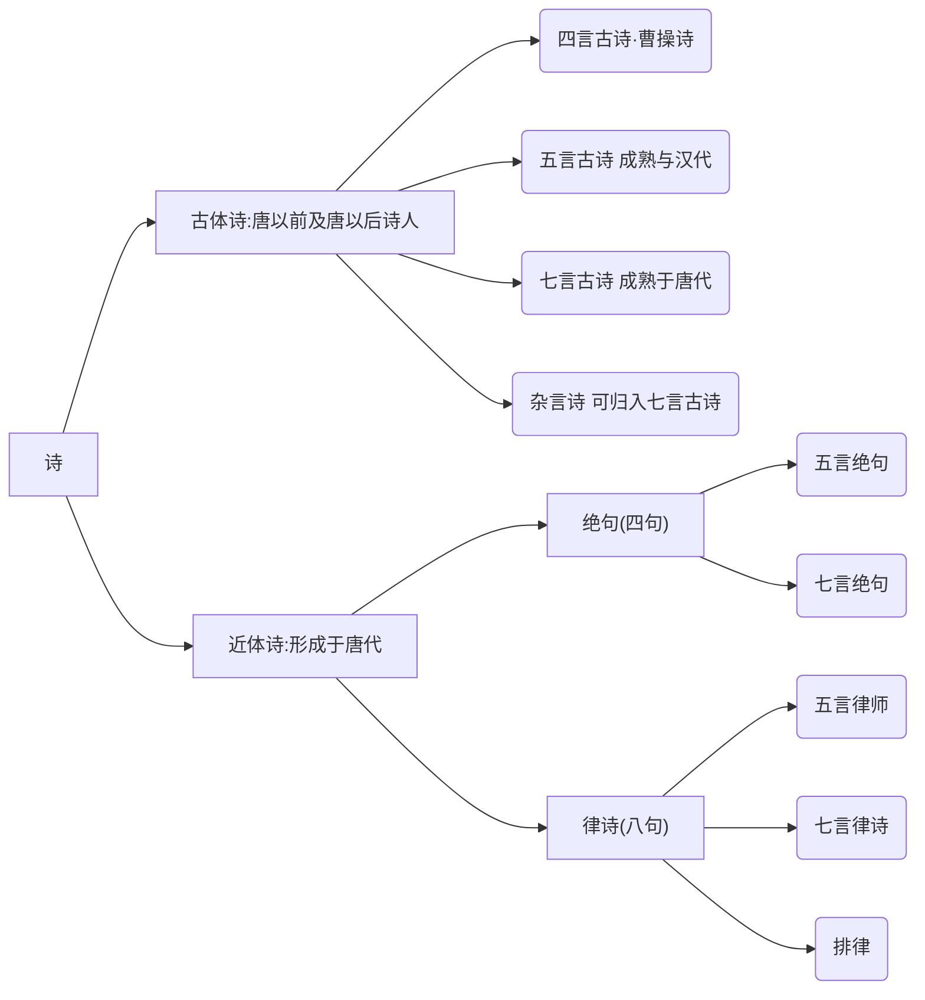
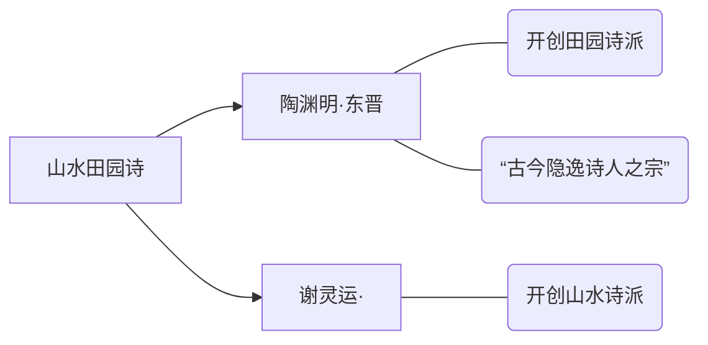
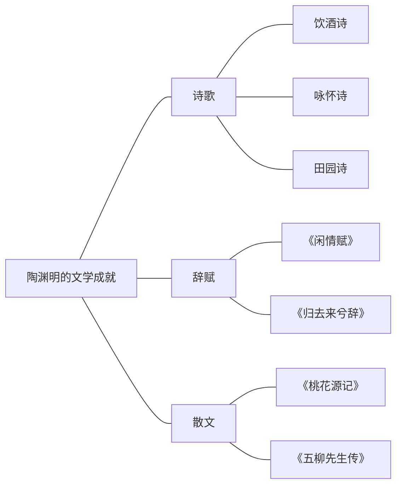
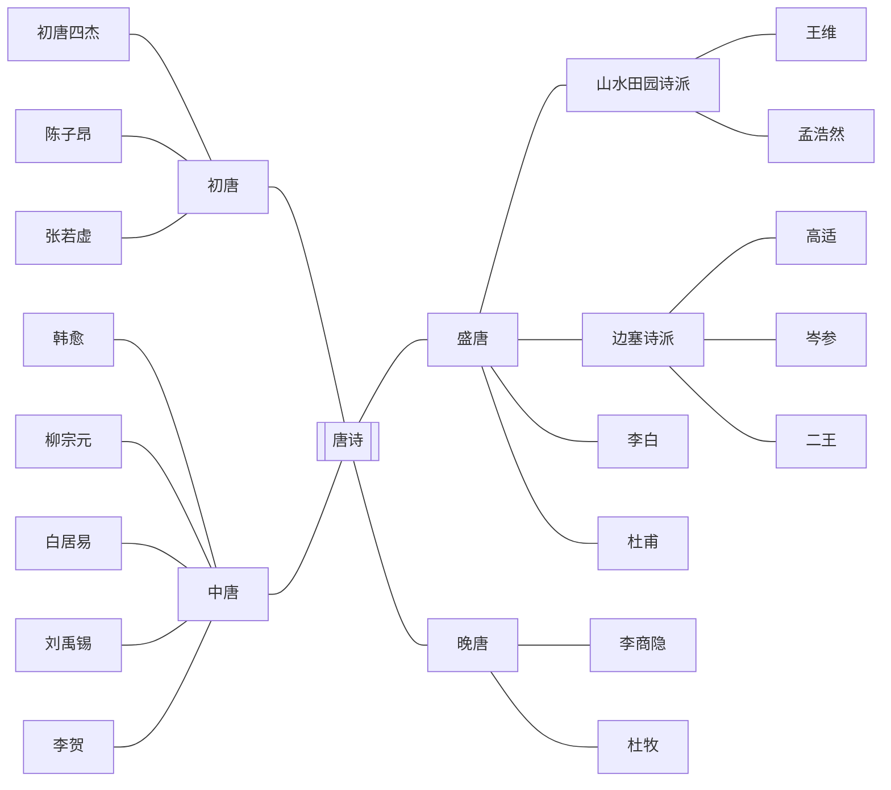

# Ⅰ. 诗

## 一. 诗概述



- 绝句[^绝句]
- 律诗[^律诗]
  共**八句**，每两句为一行
  从上往下分为 **首联 颔联 颈联 尾联**

### 1. 先秦诗歌

- 现实主义源头：《诗经》
- 浪漫主义源头：《楚辞》

#### 1.1《 诗经》风，(现实主义源头)

**现实主义源头：《诗经[^《诗经》]》**

>重点篇目
>
>- [《秦风·蒹葭》](##1.1 蒹葭)
>- 《卫风·氓》
>- 《秦风·无衣》
>- 《魏风·硕鼠》
>- 《周南·关雎》
>- 《小雅·采薇》
>- 《王风·蜀离》
>- 《小雅·鹿鸣》

##### 1.1.1 基本文学常识

- 名称演变
  最初**《诗》《诗三百》**汉朝时**《诗经》**
- 收录内容
  - 西周初年至春秋中叶
  - **共305篇**
- 价值地位
  - 我国**最早的一部诗歌总集**
  - “五经”[^五经]之一
- 四言为主，重章叠句[^重章叠句]

##### 1.1.2 诗经的“六义”

- 内容[^风] [^雅] [^颂 ]
  - 风： 各地的土风歌谣
  - 雅： 朝廷宴饮之乐
  - 颂： 宗庙祭祀的音乐
- 表现手法[^赋] [^比] [^兴]
  - 赋： 铺叙    叙述，用于写景、状物、叙事
  - 比： 比喻    使表达更加生动形象
  - 兴： 托物起兴    先说看似无关的物象，再说实际表达的意蕴内涵

##### 1.1.3 一些词的释义

- 窈窕淑女，君子好**逑**。 *逑：配偶*

##### 1.1.4 诗经的一些思想内容

1. 批判统治者的残暴与贪婪

   > 《魏风·硕鼠》

2. 表达对沉重徭役和兵役的厌恶、憎恨

   > 《王风·君子于役》

3. 对男女美好爱情与夫妻幸福婚宴的歌颂

   > 《周南·桃夭》

4. 赞美劳动者的辛劳、勤快与善良、朴质

   >《周南·芣苢》

5. 开创了“弃妇诗”的先河，控诉弱势妇女的不幸遭遇

   > 《卫风·氓》


#### 1.2 《楚辞》骚(浪漫主义源头)

>- [《离骚》](####2.1 《离骚》)
>- 《九歌·国殇》
>- 《天问》
>- 《哀郢》
>- 《湘夫人》
>- 《渔夫》

##### 1.2.1 基本文学常识

> 注:
>
> | 不同点 | 楚辞[^楚辞]                                                  | 《楚辞》[^《楚辞》]                                          |
> | ------ | ------------------------------------------------------------ | ------------------------------------------------------------ |
> | 是什么 | 楚辞，也作“楚词”，是[战国](https://baike.baidu.com/item/战国/4819?fromModule=lemma_inlink)时期[楚国](https://baike.baidu.com/item/楚国/950754?fromModule=lemma_inlink)诗人[屈原](https://baike.baidu.com/item/屈原/6109?fromModule=lemma_inlink)创作的一种新的**诗歌体裁**。 | 后期西汉刘向编辑的楚辞**作品集**，包含屈原的，和其他楚辞体裁的诗 |
> | 代表作 | 离骚，九歌，天问等                                           | 包括屈原所作的 和 后期仿照屈原所写的文学作品                 |
>
> 

- 奠基人和代表作家
  **屈原**
  - 我国历史上第一个浪漫主义诗人
  - 我国历史上第一个爱国诗人
  - “楚辞”的创立者和代表作家，开创了香草美人的传统
  - 被誉为“楚辞之祖”
- 文学价值
  中国**第一部浪漫主义诗歌总集**

##### 1.2.2 主要内容-《离骚》骚

[《离骚》](####2.1 《离骚》)

###### 1.2.2.1 文学常识

- 文学价值
  中国诗歌史上**最长的浪漫主义政治抒情诗**
- 作者
  屈原
- 题目释义
  “离”：遭遇
  “骚”：忧愁
  “离骚”：即作者遭遇忧愁而写成的诗句

###### 1.2.2.2 常见意象

| 意象                | 含义                                         |
| ------------------- | -------------------------------------------- |
| 香草[^香草]         | 比喻贤臣                                     |
| 美人[^美人]         | 比喻君主                                     |
| 香草美人[^香草美人] | 比喻忠贞贤良之士，象征高洁的人格、美好的理想 |

###### 1.2.2.3 诗

《国殇》：是一首追悼为国牺牲的将士的挽歌

> 人们常将“风”“骚”并称，用**“风”来概括《诗经》**，用**“骚”来概括《楚辞》**。**“风、骚”是中国诗歌史上现实主义和浪漫主义两大优良传统的源头**。“风骚”也因此成为文学的代名词。

### 2. 汉乐府、《乐府诗集》（合乐而歌的诗歌的总称）

>《陌上桑》
>《孔雀东南飞》
>《十五从军征》
>《东门行》
>《饮马长城窟行》
>《行行重行行》
>《青青林上柏》
>《涉江采芙蓉》
>《生年不满百》

#### 2.1 基本文学常识

#### 2.1.1 乐府及乐府诗

- 乐府，古代掌管音乐的机构，后人把这个机构所采集的诗歌都称为“乐府”。它既包括采自民间的诗歌，也包括那些文人创作的诗歌。这些诗，一般都配乐歌唱。

##### 2.1.2 汉乐府

- 汉朝的乐府诗
- 起源及特点
  汉代**乐府机关**收集、整理、保存下来的可以合乐而歌的**诗歌的总称**，后代模仿的又称为乐府诗/乐府歌辞
- 语言特点
  **语言朴素自然**，活泼生动，且时有真率稚气，局势多样，**以五言为主**
- 其诗收录在宋代**郭茂倩**所编的**《乐府诗集》**里
- 艺术特色
  叙事性，擅长通过语言和行为表现人物性格，标志着我国古代叙事诗发展到了更加成熟的阶段。

##### 2.1.3 《乐府诗集》

- 主编：郭茂倩
- 内容：辑录了**从汉魏到唐五代**的乐府诗
- 成就：现存成书最早、流行最广、收录乐府诗最完备的诗歌总集
- **乐府双壁**
  《孔雀东南飞》 + 《木兰诗》
              ↓                        ↓
        汉乐府诗            北朝民歌


##### 2.1.4 乐府诗的内容

1. 控诉统治者的腐朽与战争的残酷。
2. 对真挚爱情和美好婚姻的歌颂与向往。
3. 表现底层百姓的苦难生活。
4. 展现达官权贵之家的豪奢气象。
5. 揭露封建礼教制度的黑暗与罪恶。

### 3 《古诗十九首》

- 编者
  萧统
- 地位及评价
  - 代表**当时五言诗创作的最高成就**。
  - 后人奉之为**“五言抒情诗的典范”**
    **刘勰《文心雕龙》誉之为“五言之冠冕”**
    钟嵘《诗品》“惊心动魄，一字干金”
  - **是文人五言诗走向成熟的标志**


### 1.5 魏晋南北朝 ——文人五言诗

#### 1.5.1 建安诗歌的代表人物

第一次掀起了文人诗歌的高潮

````mermaid
graph LR
a["“三曹”"]
a-->b[曹操]-->e["诗风：慷慨悲凉"]
a-->c[曹丕]-->f["《燕歌行》最早的文人七言诗<br>《 典论·论文 》是 中国文学 批评史上最早出现的一篇文学专论"]
a-->d[曹植]
d-->g["“才高八斗”"]
d-->h["“建安之杰”"]
d-->i["“骨气奇高，词采华茂”"]
````

#### 1.5.2 陶渊明 谢灵运



陶渊明的文学成就



#### 1.5.3 南北朝民歌

>《观沧海》
>《短歌行》
>《龟虽寿》
>《白马篇》
>《归园田居》
>《移居》（两首）
>《木兰诗》
>《饮酒》（其五）
>《敕勒歌》

- 南朝民歌
  文学特征：题材狭窄（爱情）、语言清新自然、喜用双关
  代表作：《西湖 曲》
- 北朝民歌
  文学特征：题材广泛、风格粗犷豪放、语言直率
  代表作：《木兰诗》（代表了北朝民歌的最高成就，互文、双关等非常的多）

### 1.4 唐诗——诗歌的黄金时期 重武轻文 重抒情

初唐 盛唐 中唐 晚唐
重武轻文




#### 1.4.1 初唐

- **初唐四杰[^初唐四杰]**
  - 王勃：字子安，世称**“诗杰”**，初唐四杰之首，擅长五言绝句和律诗
  - 杨炯：世称“杨盈川”，多写边塞征战，想打仗
  - 卢照邻：号幽优子，想去死
  - 骆宾王：字观光，年少有才名，仕途不顺，想造反
- 陈子昂
  - 世称“诗骨”
  - 在诗歌理论上颇有建树，认为**“诗歌应该有所寄托”**。
- 张若虚的**《春江花月夜》”**。
  - 称誉
    - 《春江花月夜》被王闾运誉为**“孤篇横绝,竟为大家”**
    - 《春江花月夜》被闻一多誉为**“诗中的诗,顶峰上的顶峰”**
  - 原为乐府旧题
  - 描写了民间游子私妇的离别相思之苦

#### 1.4.2 盛唐——盛唐时期诗诗歌繁荣的顶峰

- 乐府、歌行、律诗、绝句，各体齐备;
- **现实主义、浪漫主义**相辅传扬;
- **边塞诗派、山水田园诗派**，各呈异彩。
- 中国诗坛盛极一时的“双子星”——"大李杜"[^大李杜]
- 杜甫本人被称为**诗圣**，他的诗被称为**诗史**
- **“诗狂”贺知章**。
- 两座高峰
  - **李白 **浪漫主义
    - 字太白，号青莲居士，又号谪仙人，浪漫主义诗人
    - 被称为诗仙
    - 与杜甫并称为“大李杜”
    - 诗风：**清新俊逸**
  - 杜甫 现实主义  
    - 字子美，号少陵野老，世称“杜工部”
    - 被后人誉为“诗圣”
    - 三吏三别[^三吏三别]
    - 诗风：沉郁顿挫
      早期的热情奔放、乐观坦荡
      后期悲壮凄凉，形成“沉郁顿挫”的诗风。
- 两个词派
  - 边塞诗派（高适、岑参、王昌龄、王之焕）
    - 多写边塞风光、军旅生涯、战斗场面以及战争带来的各种矛盾(离别、思乡、闺怨、厌战等)，具有**阳刚苍劲、悲壮
      雄浑、奔放豪迈、奇异峭拔、浪漫瑰丽**的风格。
    - 内容
      1. 以诗歌来反映边塞的山川景物和风土人情;
      2. 表现从军边塞、杀敌报国的意志;
      3. 讴歌边塞将士不畏辛劳、保卫边陲的战斗精神;
      4. 抒发御敌建功的愿望和安边定远的思想;
      5. 描写将士和亲人相互思念的深沉情感;
      6. 讽刺并劝谏拓土开边、穷兵黩武的统治者。
    - 王昌龄
      - 有“七绝圣手”“诗家天子”或“诗家夫子”的美誉
  - 山水田园诗派（王维、孟浩然）
    - 孟浩然
      - 山水田园派诗人
      - 世称“孟襄阳”
    - 王维
      - 字“摩诘”，世称“诗佛”
      - 苏轼:“味摩诘之诗，**诗中有画**;观摩诘之画**,画中有诗**。”

#### 1.4.3 中唐

- 中唐诗歌是盛唐诗歌的延续。这时期的作品以表现**社会动荡、人民痛苦为主流**。
- 韦应物
- 韩愈
  - 唐宋八大家之首
  - 主张“辞必己出”“惟陈言之务去”
- 孟郊
  - 字东野
  - 有“诗囚”之称
- 贾岛
  - 人称“诗奴”
- 李贺
  - 世称“诗鬼”
  - 与李白、李商隐合称“三李”
  - 作品誉为“鬼仙之辞”、“骚之苗裔”
- 元白诗派
  - 白居易在《与元九书》中提出的**“文章合为时而著，歌诗合为事而作”**
- 新乐府诗歌
  - 多反映民生疾苦
  - 元稹
    - 与白居易齐名，并称元白，同为新乐府运动倡导者
  - 白居易
    - 字乐天，号香山居士
    - 有“诗魔”和“诗王”之称
- 刘禹锡
  - 字梦得
  - 有“诗豪”之称
- 柳宗元
  - 唐宋八大家之一
  - 世称“河东先生”

#### 1.4.4 晚唐——晚唐时期的诗歌感伤气氛浓厚

- 杜牧[^小李杜]
  - 作品清丽飘逸
- 李商隐
  - 作品深婉含蓄
- 温庭筠
  - 作品绮丽香艳,代表着晚唐诗歌的最高成就。
  - “花间词派”鼻祖

### 1.5 宋诗 重文轻武   重理趣，重说理

- 特点
  以文为诗，追求平淡，好议论，重理趣
- 代表人
  - 北宋：苏轼、黄庭坚("江西诗派")，一祖三宗[^一祖三宗]
    - 欧阳修
      - 字永叔，号醉翁，晚号六一居士
      - 北宋政治家文学家
      - 谥号：文忠，故世称欧阳文忠公
      - 提出“诗穷而后工”
      - **北宋诗文革新领袖**
    - 王安石
    - 黄庭坚
      - 江西诗派的开山宗主
      - 提出“点铁成金”“夺胎换骨”
  - 
  - 南宋：杨万里(诚斋体)、陆游(南宋诗坛盟主)[^中兴四大诗人][^唐宋八大家]
    - 陆游
      - 字务观，号放翁
      - 爱国主义诗人
      - 诗风：雄浑豪放
      - 主张“功夫在诗外”
    - 杨万里
      - 号“诚斋”
    - 范成大
      - 风格“平易浅显，清新抚媚”
      - 号“石湖居士”
    - 文天祥

### 1.6 元明清诗

- 元好问
  - 金代
- 于谦
  - 明
- 郑燮(郑板桥)
  - 清
- 龚自珍
  - 清
  - 借古讽今

## 2. 诗歌赏析

### 2.1 《从军行 · 其四》

#### 2.1.1 作者

- 王昌龄(王江宁)，字少伯，河东晋阳（今山西太原)人，**盛唐**著名**边塞**诗人。
- 与高适、王之涣齐名，有**“七绝圣手” “诗家天子”**的美誉。
- 代表作有《从军行七首》《出塞》《闺怨》

#### 2.1.2 原诗

《从军行 · 其四》
青海长云暗[^暗]雪山，孤城遥望玉门关。
黄沙百战穿金甲，不破楼兰终不还。 

#### 2.1.3 赏析

**《从军行 · 其四》**

> 《从军行》是乐符《相和歌辞·平调曲》
> 旧题。**内容叙述军旅战争之事**

1. 青海长云暗[^暗]雪山，孤城遥望玉门关。

   > 译：青海上空的阴云遮暗了雪山，站在孤城遥望着远方的玉门关。

   - 情景交融，借景抒情
     - 复杂的感情:戍边将士对边防形势的关注，对自己所担负任务的**自豪感、责任感**,以及戍边生活的**孤寂、艰苦**之感，都融合在**悲壮、开阔而又迷蒙暗淡的景色**里。
   - 一、二句写景对表现戍边将士有什么作用?
     - 通过境界壮阔、环境恶劣的景物描写，**衬托**戍边将士**不畏艰难,守卫边疆**的豪情壮志。

2. 黄沙百战穿[^穿]金甲，不破楼兰[^楼兰]终不还。

   > 译：塞外身经百战磨穿了盔和甲，不打败西部的敌人誓不回还。

   - 直接抒情

   - 用典[^楼兰]

   - 主旨

     - 体现了出征将士报国御敌，以身许国的壮志。

   - 诗中“黄沙百战穿金甲”句具有高度的概括性，请作具体分析。

     - > 赏析时侧重在逐字逐词赏析
       > 注重关键词、表现手法

     - “黄沙”形象点出边塞战场的特征，“百战”极言战事之频繁，“穿金甲”是说金甲都磨穿了，形容时间之长，战斗之艰苦。短短七个字，高度概括了边地之荒凉、条件之恶劣、时间之漫长、战争之岁繁艰难。

- 小结
  全诗前两句是铺垫,是烘托，是渲染;后两句是抒情,是显志,是歌赞。景中寄情,以实代虚;情中有物，以实化虚。整首诗不仅格调高昂豪迈,蕴含深邃,而且用语也十分洗炼、精道。

---

- [^暗]: 使动用法，使······暗 或者 遮暗

- [^穿]: 磨穿

# Ⅱ. 词

## 1. 词的概述

- 词，是我国古代诗歌的一种。是为配合音乐而创作的歌辞，它始于梁代，形成于唐代而极盛于宋代。
- 词初名曲、曲子、曲子词，简称“词”，又名乐府、近体乐府、乐章、琴趣，还被称作诗余、歌曲、长短句。


- 词牌
  词牌是指填词时所用的曲调名。
  - 来源(了解)
    1. 本来是乐曲的名称。
    2. 摘取一首词中的几个字
    3. 本来就是词的题目
- 流派
  - 豪放派、婉约派
    

- 发展简史
  - 唐代:词的开端及发展期
  - 北宋:词的发展高峰(四个时期)
  - 南宋:词发展的又一高峰

## 2. 唐五代词

唐代:词的开端及发展时期

1. 民间词(敦煌曲子词)∶

   - 词的开端阶段

2. 文人词的开端:

   - 早期文人词的主要内容是描写**男女爱情**。

     > 如刘禹锡《竹枝词》，富有民歌情韵。

   - 还有一些风格苍劲意境宏大富有现实意义的**边塞词**
     >如相传盛唐李白的《菩萨蛮》及《忆秦娥》

3. 文人词的发展:

   > 中唐张志和、刘禹锡、白居易等人的词

4. 文人词的成熟:

   - 晚唐是词的成熟期
   - 题材内容依然多为**男女情爱**
   - *柔靡绮丽**逐渐成为词的主要特色
   - 晚唐词人将这一新兴的文学样式推向成熟，但是使词走上了狭窄了道路。

   > 代表词人:温庭筠，他是“花间词派”的开创者，是词史上第一个致力于填词的作家，他的词是文人词成熟的标志。

5. 五代词
   南唐后主李煜。五代词人中成就最高的，是五代词集大成者。

   - 李煜

     - 初名从嘉，字重光，号钟隐、莲峰居士，史称李后主。

     - 被誉为“千古词帝”。

     - 代表作:《虞美人·春花秋月何时了》《相见欢·无言独上西楼》《浪淘沙令·帘外雨潺潺》

     - 生平经历

       1. 圣人之相
       2. 天降皇位
       3. 南唐被攻
       4. 阶下之囚

     - 词作风格

       李煜的词以亡国被捕为界，分为前后两期

       - 前期大都描写宫廷奢华生活，男女间柔情蜜意词风**香艳柔靡**。
       - 后期全写**亡国之痛**、**故国之思**，词风**厚重沉郁**、**悲怆伤感**,这部分成就较高。形象鲜明，语言生动，在题材与意境上也**突破了晚唐五代词以写艳情为主的局面**。

## 3. 宋词

- 宋代是中国词史上的黄金时代，词作、词派众多，名家辈出，佳作如林。
- 宋词与唐诗一起成为我国古典诗歌的两朵奇葩。
- 宋朝上至皇帝大臣，下至士人妇女，都爱好词章。
- 今人唐圭璋编的《全宋词》，收录词人1330家,词作19900多首。

### 3.1 宋代词坛盛况


#### 3.1.1 北宋：词发展的高峰

- 令词为主的时期

  - 人物:晏殊、欧阳修
    - 晏殊
      - 字同叔，北宋临川人，世称“晏元献”，与儿子晏几道横行词坛，号称“大晏”“小晏”，擅长小令，多写诗酒生活和悠闲情致，风格清婉，词集为**《珠玉词》**。
    - 欧阳修
      - 欧阳修的婉约词扩大了抒情功能，像李煜那样表达个人感受;改变了审美趣味，像柳永那样**走向通俗化**，词集为**《六一词》**。
  - 内容:在词中主要反映贵族士大夫闲适自得的生活,伤感时序的愁情。

- 柳永时期

  - 开创宋慢词时代，“凡有井水饮处，即能歌柳词”

  - 柳永

    - 原名三变，字耆卿、世称柳屯田，又称柳七。

    - 成就

      是北宋婉约派代表词人

      北宋第一个专力填词的作家，也是第一位大量创作慢词的作家。

    -  代表作:《乐章集》(《雨霖铃》《望海潮》《蝶恋花》《八声甘州》等)

    - 一生多情多才不得志

- 苏轼时期

  - 开拓词的内容，提高词的意境，开豪放词风。
  - 苏轼“以诗为词”，把词看作和诗具有同样言志的作用,使它具有较以前宽广得多的社会功能。
  - “苏门四学士”(黄庭坚、秦观、晁补之、张耒)
  - 苏轼
    - 名字:字子瞻，号东坡居士
    - 成就:北宋书法家、文学家，画家，“唐宋八大家”之一。诗启宋诗新风，与黄庭坚并称“苏黄”;散文自然畅达，词开豪放一派，与辛弃疾并称为“苏辛”。
    - 代表作:《水调歌头》《定风波》
      《念奴娇·赤壁怀古》《江城子·密州出猎》
    - 一生宦海沉浮，奔走四方

- 周邦彦时期

  - 婉约词风。周邦彦精于音律，在词律方面起了规范作用,使词的语言风格**趋向典雅、含蓄**，受到文坛词人的推崇。
  - 周邦彦
    - 字美成，**号“清真居士”**
    - 多写慢词，格律谨严，语言精雅，长调善于铺叙
    - 词集为**《片玉集》**，标志着宋词艺术的成熟。
  - 秦观
    - 字少游，号“太虚”、“淮海居士”，
    - 与黄庭坚、晁补之、张耒合称“苏门四学士”
    - 他的词多写男女间的柔情蜜意，颇有感伤身世之作，风格委婉含蓄、清丽雅淡，词集为**《淮海词》**(又名《淮海居士长短句》)

#### 3.1.2 南宋：词发展的又一高峰

- 李清照
  - 号易安居士
  - 成就
    - 两宋之交著名女词人
    - 婉约词派代表人物，提出词**“别是一家”**之说，其词世称“易安体”。
  - 代表作:《如梦令》(常记溪亭日暮)《如梦令》(昨夜雨疏风骤)《武陵春·春晚》《声声慢》(寻寻觅觅)
- 辛弃疾
  - 爱国主义词作的杰出代表
- 姜夔
  - 婉约派词的代表

---

# AAA

## 篇目

### 1 蒹葭-诗经

- 蒹葭苍苍，白露为霜。所谓伊人，在水一方。

  >河边芦苇密又繁，秋深露水结成霜。意中之人在何处？就在河水那一方。

- 溯洄从之，道阻且长。溯游从之，宛在水中央。

  > 逆着流水去找她，道路险阻又太长。顺着流水去找她，仿佛在那水中央。

- 蒹葭萋萋，白露未晞。所谓伊人，在水之湄。

  >河边芦苇密又繁，清晨露水未曾干。意中之人在何处？就在河岸那一边。

- 溯洄从之，道阻且跻。溯游从之，宛在水中坻。

  >逆着流水去找她，道路险阻攀登难。顺着流水去找她，仿佛就在水中滩。

- 蒹葭采采，白露未已。所谓伊人，在水之涘。

  >河边芦苇密稠稠，早晨露水未全收。意中之人在何处？就在水边那一头。

- 溯洄从之，道阻且右。溯游从之，宛在水沚(zhi)。

  >逆着流水去找她，道路险阻曲难求。顺着流水去找她，仿佛就在水中洲。

### 2. 氓-诗经

- 氓之蚩蚩，抱布贸丝。匪来贸丝，来即我谋。送子涉淇，至于顿丘。匪我愆期，子无良媒。将子无怒，秋以为期。
- 乘彼垝垣，以望复关。**不见复关，泣涕涟涟。既见复关，载笑载言。**尔卜尔筮，体无咎言。以尔车来，以我贿迁。
- **桑之未落，其叶沃若**。于嗟鸠兮，无食桑葚！于嗟女兮，无与士耽！士之耽兮，犹可说也。女之耽兮，不可说也！
- **桑之落矣，其黄而陨**。自我徂尔，三岁食贫。淇水汤汤，渐车帷裳。女也不爽，士贰其行。士也罔极，二三其德。
- 三岁为妇，靡室劳矣。夙兴夜寐，靡有朝矣。言既遂矣，至于暴矣。兄弟不知，咥其笑矣。静言思之，躬自悼矣。
- 及尔偕老，老使我怨。淇则有岸，隰则有泮。**总角之宴，言笑晏晏，信誓旦旦，不思其反**。反是不思，亦已焉哉！

### 3 小雅·采薇-诗经(了解，只记重点)

- 采薇采薇，薇亦作止。曰归曰归，岁亦莫止。
- 靡室靡家，玁狁之故。不遑启居，玁狁之故。
- 采薇采薇，薇亦柔止。曰归曰归，心亦忧止。
- 忧心烈烈，载饥载渴。我戍未定，靡使归聘。
- 采薇采薇，薇亦刚止。曰归曰归，岁亦阳止。
- 王事靡盬，不遑启处。忧心孔疚，我行不来。
- 彼尔维何？维常之华。彼路斯何？君子之车。
- 戎车既驾，四牡业业。岂敢定居？一月三捷。
- 驾彼四牡，四牡骙骙。君子所依，小人所腓。
- 四牡翼翼，象弭鱼服。岂不日戒，玁狁孔棘。
- **昔我往矣，杨柳依依。今我来思，雨雪霏霏。**
- **行道迟迟，载渴载饥。我心伤悲，莫知我哀！**

> 全诗六章，每章八句，以一个返乡戍卒的口吻，唱出从军将士艰辛的生活和思归的情怀。

### 4. 九歌·国殇-楚辞（能背就背）

- 操吴戈兮被犀甲，车错毂兮短兵接。
- 旌蔽日兮敌若云，矢交坠兮士争先。
- 凌余阵兮躐余行，左骖殪兮右刃伤。
- 霾两轮兮絷四马，援玉枹兮击鸣鼓。
- 天时怼兮威灵怒，严杀尽兮弃原野。
- 出不入兮往不反，平原忽兮路超远。
- 带长剑兮挟秦弓，首身离兮心不惩。
- 诚既勇兮又以武，终刚强兮不可凌。
- 身既死兮神以灵，魂魄毅兮为鬼雄。

> 手拿干戈啊身穿犀皮甲，战车交错啊刀剑相砍杀。旗帜蔽日啊敌人如乌云，飞箭交坠啊士卒勇争先。犯我阵地啊践踏我队伍，左骖死去啊右骖被刀伤。埋住两轮啊绊住四匹马，手拿玉槌啊敲打响战鼓。天昏地暗啊威严神灵怒，残酷杀尽啊尸首弃原野。出征不回啊往前不复返，平原迷漫啊路途很遥远。佩带长剑啊挟着强弓弩，首身分离啊壮心不改变。实在勇敢啊富有战斗力，始终刚强啊没人能侵犯。身已死亡啊精神永不死，您的魂魄啊为鬼中英雄！

> 是一首追悼为国牺牲的将士的挽歌

### 5. 饮马长城窟行——汉乐府（都要背）

- 青青河畔草，绵绵思远道。
- 远道不可思，宿昔梦见之。
- 梦见在我傍，忽觉在他乡。
- 他乡各异县，辗转不相见。
- 枯桑知天风，海水知天寒。
- 入门各自媚，谁肯相为言。
- **客从远方来，遗我双鲤鱼。**
- **呼儿烹鲤鱼，中有尺素书。**
- 长跪读素书，书中竟何如。
- 上言加餐食，下言长相忆。

>河边春草青青，连绵不绝伸向远方，令我思念远行在外的丈夫。远在外乡的丈夫不能终日思念，但在梦里很快就能见到他。
>梦里见他在我的身旁，一觉醒来发觉他仍在他乡。他乡各有不同的地区，丈夫在他乡漂泊不能见到。
>桑树枯萎知道天风已到，海水也知道天寒的滋味。同乡的游子各自回家亲爱，有谁肯向我告诉我丈夫的讯息？
>有位客人从远方来到，送给我装有绢帛书信的鲤鱼形状的木盒。呼唤童仆打开木盒，其中有尺把长的用素帛写的信。
>恭恭敬敬地拜读丈夫用素帛写的信，信中究竟说了些什么？书信的前一部分是说要增加饭量保重身体，书信的后一部分是说经常想念。

> 表达了与丈夫别离的女主人公在家中独守”的悲苦和对丈夫的思念之情。

### 6. 十五从军征——汉乐府（都要背）

- **十五从军征，八十始得归。**
- 道逢乡里人：家中有阿谁？
- 遥看是君家，松柏冢累累。
- 兔从狗窦入，雉从梁上飞。
- 中庭生旅谷，井上生旅葵。
- 舂谷持作饭，采葵持作羹。
- 羹饭一时熟，不知饴阿谁！
- 出门东向看，泪落沾我衣。

> 刚满十五岁的少年就出去打仗，到了八十岁才回来。路遇一个乡下的邻居，问：“我家里还有什么人？”你家那个地方，现在已是松树柏树林中的一片坟墓。走到家门前看见野兔从狗洞里出进，野鸡在屋脊上飞来飞去。院子里长着野生的谷子，野生的葵菜环绕着井台。用捣掉壳的野谷来做饭，摘下葵叶来煮汤。汤和饭一会儿都做好了，却不知赠送给谁吃。走出大门向着东方张望，老泪纵横，洒落在征衣上。

>揭露了古代社会不合理的**兵役制度**对于劳动人民的残酷奴役和对于人性的损害。

### 7. 行行重行行(记重点)

- 行行重行行，与君生别离。
- 相去万余里，各在天一涯。
- 道路阻且长，会面安可知。
- **胡马依北风，越鸟巢南枝。**
- **相去日已远，衣带日已缓。**
- **浮云蔽白日，游子不顾反。**
- 思君令人老，岁月忽已晚。
- 弃捐勿复道，努力加餐饭。

> 你走啊走啊老是不停的走，就这样活生生分开了你我。从此你我之间相距千万里，我在天这头你就在天那头。路途那样艰险又那样遥远，要见面可知道是什么时候？**北马南来仍然依恋着北风，南鸟北飞筑巢还在南枝头。彼此分离的时间越长越久，衣服越发宽大人越发消瘦。飘荡游云遮住了太阳，他乡的游子不想回还。**只因为想你使我都变老了，又是一年很快地到了年关。还有许多心里话都不说了，只愿你多保重切莫受饥寒。

> 相似乱离之歌
> 前六句为第一部分,追叙初别，着重描写**路远相见之难**;后十句为第二部分，着重刻画**思妇相思之苦**。

### 8. 蒿里行——曹操（记重点）

- 关东有义士，兴兵讨群凶。
- 初期会盟津，乃心在咸阳。
- 军合力不齐，踌躇而雁行。
- 势利使人争，嗣还自相戕。
- 淮南弟称号，刻玺於北方。
- **铠甲生虮虱，万姓以死亡。**
- **白骨露於野，千里无鸡鸣。**
- 生民百遗一，念之断人肠。

> 此诗是借乐府旧题写时事，内容记述了汉末军阀混战的现实,真实、深刻地揭示了人民的苦难

### 9. 短歌行（其一）——曹操（全背）

- **对酒当歌，人生几何！**譬如朝露，去日苦多。
- 慨当以慷，忧思难忘。何以解忧？唯有杜康。
- **青青子衿，悠悠我心。**但为君故，沉吟至今。
- **呦呦鹿鸣，食野之苹。**我有嘉宾，鼓瑟吹笙。
- 明明如月，何时可掇？忧从中来，不可断绝。
- 越陌度阡，枉用相存。契阔谈讌，心念旧恩。
- **月明星稀，乌鹊南飞。绕树三匝，何枝可依？**
- **山不厌高，海不厌深。周公吐哺，天下归心。**

> - 典故：周公吐哺，比喻渴望贤才
>
> 渴望招贤纳才

### 10. 燕歌行二首·其一 ——曹丕（记重点）

- **秋风萧瑟天气凉，草木摇落露为霜。**
- 群燕辞归鹄南翔，念君客游思断肠。
- 慊慊思归恋故乡，君为淹留寄他方。
- 贱妾茕茕守空房，忧来思君不敢忘，不觉泪下沾衣裳。
- 援琴鸣弦发清商，短歌微吟不能长。
- **明月皎皎照我床，星汉西流夜未央。**
- **牵牛织女遥相望，尔独何辜限河梁。**

> 描述了征人的妻子感物伤怀，想起在外的丈夫,表达了思念之情。

### 11. 饮酒（其五）(全背)

- 结庐在人境，而无车马喧。
- 问君何能尔？心远地自偏。
- **采菊东篱下，悠然见南山。**// 无我之境
- 山气日夕佳，飞鸟相与还。
- 此中有真意，欲辨已忘言。

> 《饮酒》是一组五言古诗,共二十首,是陶渊明在弃官归隐后陆续写成的,为酒后即兴之作,是借“饮酒”的题目,写对世事人生的感慨。

### 12 从军行——杨炯（记重点）

- 烽火照西京，心中自不平。
- 牙璋辞凤阙，铁骑绕龙城。
- 雪暗凋旗画，风多杂鼓声。
- **宁为百夫长，胜作一书生。**

### 13. 咏蝉 / 在狱咏蝉——骆宾王（记重点）

- 西陆蝉声唱，南冠客思深。
- **不堪玄鬓影，来对白头吟。**
- 露重飞难进，风多响易沉。
- **无人信高洁，谁为表予心。**

### 14. 春江花月夜——张若虚（全背）

- **春江潮水连海平，海上明月共潮生**。滟滟随波千万里，何处春江无月明！
- 江流宛转绕芳甸，月照花林皆似霰；空里流霜不觉飞，汀上白沙看不见。
- 江天一色无纤尘，皎皎空中孤月轮。**江畔何人初见月？江月何年初照人？**
- 人生代代无穷已，江月年年望相似。**不知江月待何人，但见长江送流水。**
- 白云一片去悠悠，青枫浦上不胜愁。谁家今夜扁舟子？何处相思明月楼？
- **可怜楼上月裴回，应照离人妆镜台。**玉户帘中卷不去，捣衣砧上拂还来。
- 此时相望不相闻，愿逐月华流照君。鸿雁长飞光不度，鱼龙潜跃水成文。
- 昨夜闲潭梦落花，可怜春半不还家。江水流春去欲尽，江潭落月复西斜。
- 斜月沉沉藏海雾，碣石潇湘无限路。不知乘月几人归，落月摇情满江树。

### 15. 行路难（其一）——李白（全背）

- 金樽清酒斗十千，玉盘珍羞直万钱。
- 停杯投箸不能食，拔剑四顾心茫然。
- 欲渡黄河冰塞川，将登太行雪满山。
- 闲来垂钓碧溪上，忽复乘舟梦日边。
- 行路难，行路难，多歧路，今安在？
- 长风破浪会有时，直挂云帆济沧海。

### 16. 秋兴八首（其一）——杜甫(全背)

- 玉露凋伤枫树林，巫山巫峡气萧森。
- 江间波浪兼天涌，塞上风云接地阴。
- 丛菊两开他日泪，孤舟一系故园心。
- 寒衣处处催刀尺，白帝城高急暮砧。

> 诗人由深秋的衰残景象和阴沉气氛感发情怀，抒写了因战乱而常年流落他乡、不能东归中原的悲哀和对干戈不息、国家前途未卜的担忧。

### 17. 凉州词——王之涣（全背）

- 黄河远上白云间，一片孤城万仞山。
- 羌笛何须怨杨柳，春风不度玉门关。

### 18. 过故人庄——孟浩然（全背）

- 故人具鸡黍，邀我至田家。
- 绿树村边合，青山郭外斜。
- 开轩面场圃，把酒话桑麻。
- 待到重阳日，还来就菊花。

### 19. 望洞庭湖赠张丞相——孟浩然（记重点）

- 八月湖水平，涵虚混太清。
- 气蒸云梦泽，波撼岳阳城。
- **欲济无舟楫，端居耻圣明。**
- **坐观垂钓者，徒有羡鱼情。**

### 20. 山居秋暝——王维（全背）

- **空山新雨后，天气晚来秋。**
- 明月松间照，清泉石上流。
- 竹喧归浣女，莲动下渔舟。
- 随意春芳歇，王孙自可留。

### 21.酬乐天扬州初逢席上见赠——刘禹锡（全背）

- 巴山楚水凄凉地，二十三年弃置身。
- 怀旧空吟闻笛赋，到乡翻似烂柯人。
- **沉舟侧畔千帆过，病树前头万木春。**
- 今日听君歌一曲，暂凭杯酒长精神。

### 22. 秋词——刘禹锡（全背）

- 自古逢秋悲寂寥，我言秋日胜春朝。
- 晴空一鹤排云上，便引诗情到碧霄。

### 23. 乌衣巷——刘禹锡（全背）

- 朱雀桥边野草花，乌衣巷口夕阳斜。
- 旧时王谢堂前燕，飞入寻常百姓家。

### 24. 己亥杂诗(其一)——清·龚自珍

- 浩荡离愁白日斜，吟鞭东指即天涯。
- **落红不是无情物，化作春泥更护花。**

### 25. 己亥杂诗(其二百二十)——清·龚自珍

- 九州生气恃风雷，万马齐喑究可哀。
- **我劝天公重抖擞，不拘一格降人材。**

### 26. 虞美人·春花秋月何时了——南唐·李煜(全背)

- 春花秋月何时了？往事知多少。小楼昨夜又东风，故国不堪回首月明中。
- 雕栏玉砌应犹在，只是朱颜改。问君能有几多愁？恰似一江春水向东流。

### 27. 浪淘沙令·帘外雨潺潺——南唐·李煜(全背)

- 帘外雨潺潺，春意阑珊。罗衾不耐五更寒。梦里不知身是客，一晌贪欢。
- 独自莫凭栏，无限江山，别时容易见时难。流水落花春去也，天上人间。

###  28. 鹊桥仙·纤云弄巧——宋·秦观(全背)

- 纤云弄巧，飞星传恨，银汉迢迢暗度。金风玉露一相逢，便胜却人间无数。
- 柔情似水，佳期如梦，忍顾鹊桥归路。**两情若是久长时，又岂在朝朝暮暮。**

## 句子

- 落霞与孤鹜齐飞，秋水共长天一色。——《滕王阁序》

- 莫愁前路无知己，天下谁人不识君。——《别董大》高适

- 战士军前半死生，美人帐下犹歌舞。——《燕歌行》高适

- 忽如一夜春风来，千树万树梨花开。——《白雪歌送武判官归京》岑参

  > 描写的是**冬季**的景色

- 鸟宿池边树，僧敲月下门。——《题李凝幽居》贾岛

- 曾经沧海难为水，除却巫山不是云。——《离思五首·其四》元稹

- 回眸一笑百媚生，六宫粉黛无颜色。——《长恨歌》白居易

- 在天愿作比翼鸟，在地愿为连理枝。——《长恨歌》白居易

- 几处早莺争暖树，谁家新燕啄春泥。——《钱塘湖春行》白居易

- 同是天涯沦落人，相逢何必曾相识!——《琵琶行》白居易

- 可怜身上衣正单，心忧炭贱愿天寒。——《卖炭翁》白居易

- 一道残阳铺水中，半江瑟瑟半江红。——《暮江吟》白居易

- 人间四月芳菲尽，山寺桃花始盛开。——《大林寺桃花》白居易

- 一语天然万古新，豪华落尽见真淳。——《论诗三十首·其四》金·元好问

- 苟利国家生死以，岂因祸福避趋之。——《赴戍登程口占示家人》清·林则徐

- 是处红衰翠减，苒苒物华休。——《八声甘州·对潇潇暮雨洒江天》[柳永 ](https://hanyu.baidu.com/s?wd=柳永)

---

## 重点词汇翻译

- **尔来**四万八千岁 *从那时以来*——《蜀道难》

---

## 文学常识

### 1.诗相关

[^绝句]: 只有**四句**的叫绝句
[^律诗]: 有**8句**的诗叫律诗
[^四书]: **《论语》、《大学》、《中庸》、《孟子》**
[^五经]: （**诗书礼易春秋**）《诗经》、《尚书》、《礼记》、《周易/易经》、《春秋》

#### 诗经

[^《诗经》]: 最初**《诗》《诗三百》**汉朝时**《诗经》**,西周初年至春秋中叶，**共305篇**,我国最早的一部**诗歌总集**,“五经”[^五经]之一,**(现实主义源头)**
[^风]: 《诗经》**六义内容**之一，指**各地风土歌谣**，共160篇，风又分为劳动诗、征役诗、婚恋诗、怨刺诗
[^雅]: 《诗经》**六义内容**之一,指**朝廷宴饮之乐**，分为**大雅**和**小雅**；【大雅】31篇，西周早期作品，多为赞美诗，排领导马屁之类的，雍容典雅，诗味不浓；【小雅】74篇西周晚期指春秋的作品，多为怨刺诗，生动活泼，艺术价值较高
[^颂]: （了解）《诗经》**六义内容**之一，指**宗庙祭祀的音乐**，祭天祭地祭祖先，分为鲁颂4篇、商颂5篇、周颂31篇
[^赋]: 《诗经》**六义表现手法**之一，赋陈其事而直言之也，就是**铺叙**，有什么事情就说什么，没有比喻之类的东西，直言
[^比]: 《诗经》**六义表现手法**之一以彼物比此物也，即**比喻**
[^兴]: 《诗经》**六义表现手法**之一先言他物以引起所咏之词也，即**托物起兴**，比如说我喜欢那个姑娘，我不说我喜欢那个姑娘，我先说两只鸟「关关雎鸠，在河之洲」然后再「窈窕淑女，君子好逑」
[^重章叠句]: 《诗经》独有的一种方式，达到**一唱三叹**的效果

#### 楚辞

[^《楚辞》]:  后期西汉刘向编辑的楚辞**作品集**，包含屈原的，和其他楚辞体裁的诗，**(浪漫主义源头)**
[^楚辞]: 楚辞，也作“楚词”，是[战国](https://baike.baidu.com/item/战国/4819?fromModule=lemma_inlink)时期[楚国](https://baike.baidu.com/item/楚国/950754?fromModule=lemma_inlink)诗人**[屈原](https://baike.baidu.com/item/屈原/6109?fromModule=lemma_inlink)**创作的一种新的**诗歌体裁**。
[^风，骚]: 人们常将“风”“骚”并称，**用“风”来概括《诗经》**，用**“骚”来概括《楚辞》**。“风、骚”是中国诗歌史上现实主义和浪漫主义两大优良传统的源头。**“风骚”也因此成为文学的代名词**。
[^香草]: 比喻贤臣
[^美人]: 比喻君主
[^香草美人]: 比喻忠贞贤良之士，象征高洁的人格、美好的理想
[^初唐四杰]: 王勃（诗杰）、杨炯(想打仗)、卢照邻(想去死)、骆宾王(想造反)
[^大李杜]: 诗仙（李白）、诗圣（杜甫）
[^一祖三宗]: 杜甫，黄庭坚，陈师道，陈与义
[^中兴四大诗人]: 杨万里，范成大，陆游，尤袤
[^三吏三别]: 杜甫的《 [新安吏](https://baike.sogou.com/lemma/ShowInnerLink.htm?lemmaId=7542078&ss_c=ssc.citiao.link)》《 [石壕吏](https://baike.sogou.com/lemma/ShowInnerLink.htm?lemmaId=250956&ss_c=ssc.citiao.link)》《[ 潼关吏](https://baike.sogou.com/lemma/ShowInnerLink.htm?lemmaId=7589892&ss_c=ssc.citiao.link)》《 [新婚别](https://baike.sogou.com/lemma/ShowInnerLink.htm?lemmaId=67801316&ss_c=ssc.citiao.link)》《 无家别》《 垂老别》
[^唐宋八大家]: 唐代 **柳宗元 、 韩愈** 和宋代 **欧阳修 、 苏洵 、 苏轼 、 苏辙 、 王安石 、 曾巩** 八位
[^小李杜]:杜甫、李商隐

### 用典

[^楼兰]: 汉代用典，西域国名，借用典故，意指消灭侵扰唐朝边境的外敌。
