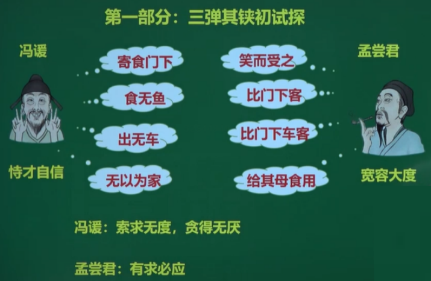

### 1.《春秋》

1. 文体：编年体
2. 地位：中国**第一部编年体**史书
3. 春秋三传
   《春秋左氏传》《春秋公羊传》《春秋谷梁传》

#### 1-1《左传》

1. 包含：
   - [《郑伯克段于鄢》](####《郑伯克段于鄢》)
   - [《鞌之战》](####《鞌之战》)
2. 别称《春秋左氏传》《左氏春秋》
3. 作者：**左丘明**（春秋末年鲁国史官）
4. 文体：**编年体**
5. **先秦时期的著作**，**先秦时期**最具文学色彩的**描写春秋时期战争的历史散文**著作
6. **记录了春秋时期**的历史史实，堪称先秦散文叙事之最，**标志**着我国**叙事散文成熟**
7. **为《春秋》做注解**的史书
8. 地位：《左传》 中国**第一部叙事详尽**、形式完备的**编年体**史书
9. 记事**线索分明，详略得当，尤其擅长描写战争**

### 《春秋》和《左传》异同

一、思想上,都偏于儒家立场。
《国语》和《左传》多站在儒家立场总结历史的经验教训,对历史事件和历史人物作出道德伦理评价,为读者提供历史的借鉴。
二、两者在体制上不同。

- 《左传》为**编年史**,主要是按时间顺序交代事件发生、发展和结果
- 《国语》是一部**国别体**，是各国史料的汇编。

三、从叙事上讲，《左传》略胜一筹。 

- 《左传》在叙事上表现出了极高的概括力和高超的艺术技巧。《左传》突破编年体的局限，用追述、补叙的方法，把很长时限中的事情集中在一起来写，造成了**情节的集中**性和**篇章的完整**性。
- 《国语》也有对历史事件因果关系的叙述，但不及《左传》完整、普遍。《国语》中许多事件的前因后果及经过都是一笔带过，而把**重点放在大段的议论文**上。

四、从记言上看。
《国语》以**记言**为主,所记多为朝聘、飨宴、讽谏、辩诘、应对之辞。它是为突出言论而叙事，采取一事多议和夹叙夹议的方式。
《左传》重在**记史**，其记言都是为其记事服务的,力求用最简省之文字将于史事有重大影响之言语记录下来。《左传》中的所记的人物语言大致可分为独白和对话两种。

五、两者在叙事过程中**都注重对人物的塑造。**
《左传》描写了形形色色的历史人物。由于它是编年体,人物的言行事迹大多分散记录在事件发生的各个年代,很少对某一人物集中描写，只有把同一人物在不同年代的事迹联系起来，才能得到一个完整的人物形象。
《国语》中有一系列大小故事穿插其中,因此表现出叙事技巧和情节构思的特点，有时也能写出鲜明生动的人物形象

### 2. 《国语》

1. 包含
   - [《召公谏厉王弭谤》](####《召公谏厉王弭谤》)
   - [《勾践灭吴》](####《勾践灭吴》)
2. 别称《春秋外传》或**《左氏外传》**
3. 体现**纵横家**的思想
4. 文体：**国别体**
5. 作者：司马迁认为作者是**左丘明**
6. 地位：**我国最早的一部国别体史书**
7. 内容：以**记言**为 主，反映儒家**尊礼重民**思想
8. 特色：中间记言，事略言详，记言为主
9. 评价：
   清代崔述在《洙泗考信录·余录》中认为《国语》一书的文章风格是“周鲁多平衍，晋楚多尖颖，吴越多恣放”

### 3. 《战国策》

- 包含
  - [《苏秦始将连横说秦》](####《苏秦始将连横说秦》)
  
  -  [《冯谖客孟尝君》](####《冯谖客孟尝君》)
- 名字演变
  - 有《国策》《国事》《短长》《长书》等名，西汉称《战国策》
- 编者：西汉 刘向
- 体例：**国别体**
- 内容：
  12国策，共33篇,主要记载战国时谋臣策士游说诸侯或互相辩论的言论和行动。
- 艺术特色：
  1. 长于说辞，**记言**重于记事。
  2. 善于写人。
  3. 善于运用寓言故事说理。
  
- 当时：养士之风(门客)

  - 战国四公子
    - (魏)信陵君    魏无忌
      仗义，能为大哥，却做不得小弟
    - (赵)平原君    赵胜
      空有好客之名，实不能赏识、利用人才
    - (楚)春申君    黄歇
      早年有雄韬伟略，无奈迷恋妇人，死于门客之手
    - (齐)孟尝君    田文
      最具领导才能，既能做大哥，又能做小弟

---

- 齐人有冯该者，贫乏不能自<u>存</u>。    **养活，生存**
- 谁习计会，能为文收<u>责</u>于薛者乎?    **债**
- 责毕收，以何<u>市</u>而反?    **购买**
- 今君有区区之薛，不拊爱<u>子</u>其民，因而贾利之。    **以...…为子**
- 孟尝君不<u>说</u>，曰:“诺，先生休矣。”    **悦，高兴**
- 齐<u>放</u>其大臣孟尝君于诸侯，诸侯先迎之者，富而兵强。    **放逐**
- 梁使三反，孟尝君<u>固辞</u>不往也。    **坚决推辞**
- 寡人不祥，<u>被</u>于宗庙之祟，沉于谄谀之臣，开罪于君!    **披，遭受**
- 愿君顾先王之宗庙，<u>姑</u>反国统万人乎!    **姑且**

---

- <u>孟尝君**怪**其疾也，**衣冠**而见之。</u>
  孟尝君对冯该回得如此迅速感到很奇怪，立即穿好衣服戴好帽子去见他。
- <u>君有区区之薛，不拊爱子其民。</u>
  现在您不过有块小小的薛邑，却不抚爱百姓，视民如子。
- <u>寡人不祥，被于宗庙之祟。</u>
  我很糊涂，遭受祖庙神灵降下的灾祸。
- <u>责收毕，以何市而反?</u>
  债款全部收回以后,用它买些什么回来?

### 文章

#### 《郑伯克段于鄢》

- **记事散文**,采用**顺叙**的叙述方式
- 选自[《左传》](####1-1《左传》)
- 内容
  记录**春秋初期**郑国王室内斗，郑庄公与其弟公叔段争夺君位而勾心斗角，最终兵戎相见的历史事实
- 主旨
  揭露当时统治阶级内部的残酷无情和虚伪奸诈的本质
- “郑伯克段于鄢”这句话最早出自《春秋》，《左传》是为春秋做注解的
- 人物形象
  - 姜氏(母)：偏狭自私，以私情干政
  - 公叔段(弟)：贪婪狂妄，愚昧无知
  - 郑庄公(兄)：阴险虚伪，狠毒于心计
  - 颍考叔(臣子)：聪明机智，真正的孝
  - 祭仲(臣子)：忠心耿耿，老成持重
- 词语解释
  - “大都不过参<u>国</u>之一"——国：国都

> - "多行不义必自毙"是郑庄公**指责其弟公叔段**的话
> - 庄公母子“遂而相见”体现统治阶级道德虚伪
> - 作者详写了**战争的起因与矛盾不断激化的经过**
> - **“多行不义必自毙”**出自这里
>
> ----
>
> - <u>亟</u>请于武公   **屡次，多次**
> - 都城<u>过</u>百雉    **超过**
> - 今京不<u>度</u>，非制也   **合规定（制度)**
> - 姜氏欲之，焉<u>辟</u>害   **通“避”，避免**
>
> ---
>
> - 1.<u>姜氏欲之，焉辟害?</u>
>   姜氏要这么做，我怎能避开这祸害呢?
> - ⒉<u>姜氏何厌之有?</u>
>   姜氏哪有满足的时候?
> - 3.<u>国不堪贰，君将若之何?</u>
>   国家不能忍受两个国君，现在您打算怎么办?
> - 4.<u>先王之制，大都不过参国之一。</u>
>   按先王的规定，大城市的城墙不能超过国都城墙三分之一。

####  《鞌之战》

- 选自[《左传》](####1-1《左传》)
- 人物：
  1. 晋
     - 韩厥：大夫
  2. 齐
     - 逢丑公：齐王的车右

>- 臧宣叔<u>逆</u>晋师，且道之。  **迎接**
>- 邰子使速以<u>徇</u>，告其仆。  **遍示**
>- 子以君师辱于敝邑，不<u>腆</u>敝赋，诘朝请见。  **厚，多**
>- 欲勇者<u>贾</u>余馀勇!   **买卖，交易**
>- 此车一人<u>殿</u>之。   **镇守**
>- <u>環</u>甲执兵，固即死也。  **穿上**
>- 右<u>援</u>袍而鼓。    **拿过来**
>- 韩厥<u>俛</u>定其右。    **同“俯”，俯身**
>
>---
>
>- <u>臧宣叔逆晋师，且道之。</u>
>  臧宣叔迎接晋军，并为他们做向导。
>- <u>不腆敝赋，诘朝请见。</u>
>  我军士兵不多，请明天早晨相见决战吧。
>- <u>不介马而驰之。</u>
>  不给马披上甲就驱马奔驰。.
>- <u>逢丑父与公易位。</u>
>  逢丑父和齐侯交换位置。
>- <u>载齐侯以免。</u>
>  载上齐侯使他免于被俘。

#### 《召公谏厉王弭谤》

- 选自[《国语》](###2. 《国语》)反应儒家尊礼重民的思想
- 人物：
  - 召公
  - 周厉王
- 主旨：
  召公“防民之口，甚于防川”这一议论，闪烁着**民本**思想的光华，周厉王听不进去，结果落了个遭流放的下场。
  这一史实表明，以民为本，从理论上解决问题并不太难，而真正付诸实践却并非易事
- 艺术特色
  比喻说理、语言精炼、详略得当，重点突出、记言为主
- 词语解释
  - “三年，乃<u>流</u>王于彘”——流：流放                                                                                                                                                                                                               

> - “防民之口，甚于防川”出自召公之口
> - “吾能弥谤矣，乃不敢言”是周厉王的话
>
> ---
>
> - 厉王虐，国人<u>谤</u>王。   **公开指责别人的过失**
> - 吾能<u>弭</u>谤矣。   **消除**
> - 为民者<u>宣</u>之使言。   **引导、疏通**
> - 耆艾<u>修</u>之。   **戒饬，警告，提醒**
> - 是以事行而不<u>悖</u>。   **逆，违背**
> - 成而行之，胡可<u>壅</u>也?   **堵塞**
>
> ---
>
> - <u>国人莫敢言，道路以目。</u>
>   国人不敢说话，在路上相见，以目示意。
> - <u>防民之口，甚于防川。</u>
>   阻塞老百姓的嘴，比阻塞河水(造成的后果)更严重。
> - <u>为民者宣之使言。</u>
>   治民者只能开导他们而让人畅所欲言。
> - <u>近臣尽规，亲戚补察。</u>
>   近侍之臣尽规劝之责，君王的同宗都能补其过失，察其是非。
> - <u>口之宣言也，善败于是乎兴。</u>
>   人们用嘴巴发表议论，政事的成败得失就能表露(体现)出来。
> - <u>行善而备败，其**所以**阜财用衣食者也。</u>
>   人们以为好的就尽力实行，以为失误的就设法预防，这是增加衣食财富的途径啊。
>   以为：...的原因,...的途径

#### 《勾践灭吴》

- 选自[《国语》](###2. 《国语》)
- 人物：

  - 越王勾践：
    一代开明圣贤的明君。他胸怀大志，不忘国耻，有胆有识，处变不惊;知人善任，**勇于自责，能屈能伸**，奋发图强;抚慰百姓，深得民心。

    - 君臣
      - 文种(大夫)
        善外交
        一个治乱之贤臣。他**耿直坦率**，忠贞自负,足智多谋，**长于辞令**。

  - 吴王夫差
    不纳忠言，听信佞臣，终于错失良机，埋下祸根。一个**有勇少谋**的昏君。他**优柔寡断,刚愎自用，骄矜自满**,

    - 君臣：

      - 伍子胥
        一个失败的忠臣。他**忠心耿耿**，力谏君主，观察敏锐，分析深刻，但**缺乏进谏之艺术**,又**遇上**惑于谗臣的**昏君**,一片苦心付之东流。

      - 伯嚭(太宰)
        贪财好色，佞臣，进献谗言
- 故事背景
  春秋末年，吴王阖闾一心想向中原地区扩展势力，可是其南面的越国也一天天强盛，使它北上争霸受到严重的牵制，吴越两国的仇怨从此就一发而不可收拾。公元前496年越王允常死，其子勾践继位，阖闾就趁着越国的国丧带领其子夫差攻打越国。然而，阖闾在这一仗受伤而死。夫差发誓报仇，在前494年又与越军打了一仗，杀得勾践只剩兵五千，退居会稽山上,此时越国面临着亡国的危险。
   
- 思想内容
  《勾践灭吴》记述的是**春秋末期** **吴越争战**的著名历史事件。越王勾践在与吴王夫差的战争中被击败后，以各种屈辱的条件向吴国求和。夫差没有听从伍子胥的忠告，却听信了被越国贿赂的太宰嚭的谗言，准许了越国的求和，使勾践获得了喘息的机会。**勾践卧薪尝胆，励精图治**，在经过了“十年生聚、十年教训”的长期准备之后，率领军队进攻吴国，吴国因此而亡。
- 文章结构

  1. 勾践同吴国求和，突出了他痛下决心、希望东山再起的一面。
  2. 勾践为打败吴国所进行的多方面的准备
  3. 勾践出征灭吴，一举获胜。
- 艺术特色

  1. 故事情节曲折生动，波澜起伏;
  2. 主人公性格鲜明，形象饱满，栩栩如生;
  3. 语言精彩传神，人物语言个性化，叙述语言精练简约、朴实无华;
  4. 详略得当，写灭吴准备详尽备至，而写灭吴之战却极为简洁，作者的写作重心一目了然。

>- 贾人夏则<u>资</u>皮。    **蓄积**
>- <u>苟</u>得闻子大夫之言，何后之有?    **如果，假如**.
>- 遂使之行<u>成</u>于吴。    **和**
>- 寡人请<u>更</u>。    **改**
>- <u>吊</u>有忧，贺有喜。    **吊唁**
>- 乃<u>致</u>其父母昆弟而誓之。   **招致，召集**
>- 三年释其<u>政</u>。    **通“征”，赋役**
>- 欲其<u>旅</u>进旅退。    **俱**
>- 进不<u>用命</u>，退则无耻。   **服从命令**
>- 果行，国人皆<u>劝</u>。   **互相勉励**
>
>---
>
>- <u>吾与之共知越国之政。</u>
>  我将和他共同管理越国的政事。
>- <u>旱则资舟，水则资车。</u>
>  天旱的时候就准备船，有大水的时候就准备车辆。
>- <u>失其利也，虽悔之，必无及已。</u>
>  如果您失去这个有利的时机，以后即使后悔也来不及了。
>   虽：即使
>- <u>夫差与之成而去之。</u>
>  吴王夫差就与越国订立了盟约而后让文种离开。
>- <u>去民之所恶，补民之不足。</u>
>  除去人民讨厌的，补充人民缺乏的。
>- <u>然后卑事夫差，宦士三百人于吴。</u>
>  然后恭卑地服侍夫差，派三百个士做吴王的仆人。
>- <u>其达士，絜其居，美其服，饱其食。</u>
>  那些明智达理之士，把他的住宅打扫干净收拾整洁(使它的住宅整洁 等...)，给他们穿漂亮的衣服(使他们的衣服漂亮)，让他们吃饱饭。
>- <u>进不用命，退则无耻;如此，则有常刑。</u>
>  前进时不服从命令，后退时没有羞耻之心;像这样，就会受到合于国家规定的刑罚。
>
>

#### 《苏秦始将连横说秦》

- 选自[《战国策》](###3. 《战国策》)
- 苏秦：渴望个人成功
- 人物介绍
  苏秦，字季子，战国时期著名的**纵横家、外交家和谋略家**。苏秦与张仪同出自鬼谷子门下，跟随鬼谷子学习纵横之术。学成后，外出游历多年，流倒而归 。随后刻苦攻读兵书，一年后游说列国，被燕文公赏识，出使赵国。苏秦到赵国后，提出合纵六国以抗秦的战略思想，并最终组建合纵联盟,任“从约长”，兼佩六国相印，使秦十五年不敢出函谷关。
- 合纵连横
  
- 思想内容
  - 本文描写了著名的纵横家苏秦游说各国，牟取功名富贵的经过。先是以连横之谋，游说秦惠王而惨败，后又经过自己发奋苦读，以合纵之谋，游说赵王而一举成功，直至成为六国之相。
  - 本文刻画了一个执著追求个人成功的说客，他追名逐利，欲求闻达。文章也描绘了苏秦两次回家的遭遇，反映了当时的世态炎凉和人情势利。
- 人生价值取向(义与利的取舍)
  - 儒家:羞于言财利，主张舍生取义，忘怀个人得失，追求品德的高尚和理想的人格。
  - 纵横家:重 利轻义，渴望个人成功，追求功名利禄，崇尚奇谋权变，因而朝三暮四。
- 艺术特色
  1. 运用**对比**手法，写苏秦得势前后，其家人不同的态度，既从侧面烘托了苏秦的人物形象，又反映出战国时代祟尚功利，淡薄亲情的炎凉世态。
  2. 文章在**人物**肖像、动作、神态的描写方面十分细致生动，如描写苏秦说秦王不行，落魄而归时的形容神态，写苏秦刻苦攻读，引锥刺股的细节，写其嫂”蛇行匍伏”的丑态，皆为传神之笔。
  3. 善于运用**铺陈排比(铺张扬厉)和夸张渲染**的艺术手法。如苏秦说秦惠王之词，内容上罗列排比，句式上多用四字句进行铺排，所述之事往往夸大其辞，务求动听，表现了战国策士纵横捭阖、铺张扬厉的文风。

>- 苏秦始将连横<u>说</u>秦惠王曰。  **劝说，游说**
>- 南有巫山、黔中之<u>限</u>。    **通“险”,险隘**
>- 今先生俨然不远千里而**庭教**之，愿以异日。   **亲自来朝廷（在朝廷）指教**
>- 由此观之，<u>恶</u>有不战者乎?     **同“乌”，何，哪。**
>- 明言章理，<u>兵甲</u>愈起。   **兵器和铠甲。泛指武器、军备、战乱**
>- 今欲并天下，凌万乘，<u>诎</u>敌国。   **同“屈”，使屈服**
>- 乃夜发书，<u>陈</u>箧数十。   **放置、陈列**
>
>---
>
>- <u>今先生俨然不远干里而庭教之，愿以异日。</u>
>  如今先生不远干里来到我秦国登庭指教，不过我希望还是改日再听您的教诲吧!
>- <u>徒处而致利，安坐而广地。</u>
>  如果无所事事却想获取利益，安居不动却要使国土扩大。
>-  <u>妻不以我为夫，嫂不以我为叔，父母不以我为子，是皆秦之罪也!</u>
>  妻子不把我当丈夫,嫂子不把我当小叔,父母不把我当儿子,这都是我苏秦的罪过。
>- <u>见说赵王于华屋之下，抵掌而谈。</u>
>  在高大华丽的宫殿里游说赵王，他们谈得很投机以致拍起掌来。
>-  <u>廷说诸侯之王，杜左右之口，天下莫之能伉。</u>
>  在各诸侯朝廷上游说君王，使各诸侯王的亲信不敢开口，天下没有谁敢与他对抗的。
>- <u>妻侧目而视，倾耳而听;嫂蛇行匍伏，四拜自跪而谢。</u>
>  妻子对他敬畏得不敢正视，侧着耳朵听他说话;而嫂子像蛇一样伏地前行，对苏秦连续跪拜四次请罪。
>- <u>嫂何前倨而后卑也?</u>
>  嫂子为什么以前那样傲慢而现在又这样卑下呢?

#### 《冯谖客孟尝君》

- 选自[《战国策》](###3. 《战国策》)
- 民本思想
- 人物介绍
  - 冯谖: 一作冯煖，读作xuan。
    恃才自信、知恩图报、深谋远虑
  - 孟尝君:
    轻财好施、谦恭礼让、宽怀大度
  - 门客群体:
    目光短浅、趋炎附势
- 故事情节
  1. 冯暖弹剑而歌
     写冯谎初为孟尝君门客时的情况。
  2. 薛地市义
     写冯谎为孟尝君“市义”的经过。
  3. 筹谋狡兔三窟
     写冯谎为孟尝君营就“三窟”的过程。
- 
- 艺术特色
  1. 鲜活的人物形象。
  2. 丰富的表现手法: **欲扬先抑**和**对比**映衬手法的运用。
  3. 一波三折的情节安排。
- 主旨
  本文记叙冯谎为巩固孟尝君的政治地位而进行的种种政治外交活动，**赞扬了策士冯暖重视民心的远见卓识和政治斗争中的果断善谋**，反映了当时权贵重视养士和士为知己报效的社会风气。
