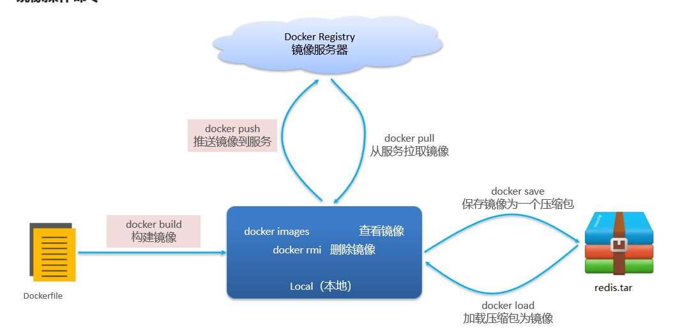
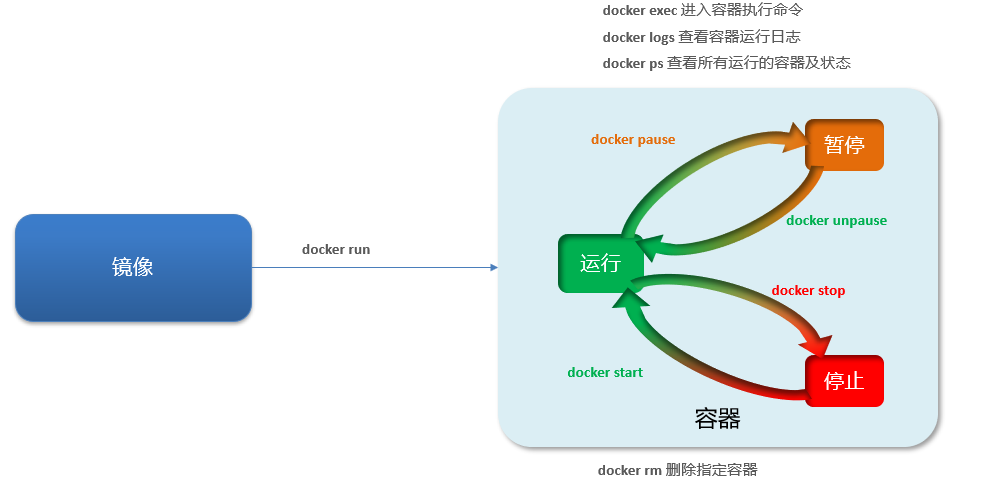
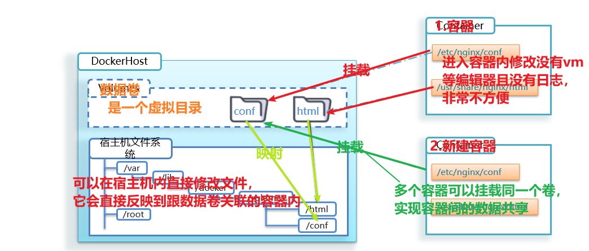

# Docker

[01-今日课程介绍3_哔哩哔哩_bilibili](https://www.bilibili.com/video/BV1LQ4y127n4?p=42&vd_source=796ed40051b301bfa3a84ba357f4828c)的自学笔记

# 一. Docker是什么

> 什么是Docker：
> - 帮助我们快速构建应用镜像、交付应用、运行应用的技术
>
> 什么是镜像：
>
> - 将应用程序及其依赖、环境、配置打包在一起就是镜像
>
> 什么是容器:
>
> - 镜像运行起来就是容器，一个镜像可以运行多个容器
>
> Docker工作流：
>
> - 构建自定义镜像或者从Docker Registry拉取镜像
> - 根据镜像创建容器，并运行

## 1. Docker解决的问题

1. **项目部署的问题**
   大型项目组件较多，运行环境也较为复杂，部署时会碰到一些**问题**：
   - 依赖关系复杂，容易出现兼容性问题
   - 开发、测试、生产环境有差异
2. **Docker解决依赖的兼容**
   - 将应用的Libs（函数库）、Deps（依赖）、配置与应用一起打包
   - 将每个应用放到一个隔离**容器**去运行，避免互相干扰
3. **Docker解决不同系统环境**
   - Docker将用户程序与所需要调用的系统(比如Ubuntu)函数库一起打包
   - Docker运行到不同操作系统时，直接基于打包的库函数，借助于操作系统的Linux内核来运行
4. **Docker解决大型项目依赖关系复杂，不同组件依赖的兼容性**
   - Docker允许开发中将应用、依赖、函数库、配置一起**打包**，形成可移植镜像
   - Docker应用运行在容器中，使用沙箱机制，相互**隔离**
5. **Docker解决开发、测试、生产环境有差异**
   - Docker镜像中包含完整运行环境，包括系统函数库，仅依赖系统的Linux内核，因此可以在任意Linux操作系统上运行

## 2. Docker是什么技术

**Docker是一个快速交付应用、运行应用的技术**

- 可以将程序及其依赖、运行环境一起**打包为一个镜像**，可以迁移到任意Linux操作系统
- 运行时利用**沙箱机制**形成隔离容器，各个应用互不干扰
- 启动、移除都可以通过一行命令完成，方便快捷

## 3.Docker与虚拟机的区别

**虚拟机**（virtual machine）是在操作系统中**模拟硬件设备**，然后运行另一个操作系统，比如在 Windows 系统里面运行 Ubuntu 系统，这样就可以运行任意的Ubuntu应用了。

| 特性     | Dockers            | 虚拟机                       |
| -------- | ------------------ | ---------------------------- |
| 性能     | 接近原生           | 性能较差                     |
| 硬盘占用 | 一般为 MB          | 一般为GB                     |
| 启动     | 秒级               | 分钟级                       |
| 本质     | 是一个系统进程     | 是在操作系统中的操作系统     |
| 量级     | 体积小、启动速度快 | 体积大、启动速度慢、性能一般 |

## 4. 镜像(Image)和容器(Container)

**镜像(Image)：将应用程序及其依赖、环境、配置打包在一起**,Docker将应用程序及其所需的依赖、函数库、环境、配置等文件<u>打包</u>在一起，称为镜像。

**容器(Container)：镜像运行起来就是容器，一个镜像可以运行多个容器**,镜像中的应用程序运行后形成的进程就是容器，只是Docker会给容器做<u>隔离</u>，对外不可见。

## 5. Docker和Docker Hub

[Docker Hub](https://hub.docker.com/): 是一个Docker镜像的托管平台。这样的平台称为Docker Registry。

l国内也有类似于Docker Hub 的公开服务，比如 [网易云镜像服务](https://c.163yun.com/hub)、[阿里云镜像库](https://cr.console.aliyun.com/)等。

## 6. Docker的CS架构

Docker是一个CS架构的程序，由两部分组成：

1. **u服务端(server)：接收命令或远程请求，操作镜像或容器**,Docker守护进程，负责处理Docker指令，管理镜像、容器等
2. **u客户端(client)：发送命令或者请求到Docker服务端**,通过命令或Rest API向Docker服务端发送指令。可以在本地或远程向服务端发送指令。

## 7. Centos7安装Docker

请参考[Centos7安装Docker.md](Centos7安装Docker.md)

# 二.Docker基本操作

## 1.镜像操作

### 1.1 镜像相关命令

| 命令   | 语法                                      | 用途                |
| ------ | ----------------------------------------- | ------------------- |
| help   | docker [命令名] --help                    | 查看帮助文档        |
| pull   | docker pull 镜像名称                      | 从镜像仓库拉取镜像  |
| push   |                                           | 推送镜像到镜像仓库  |
| images | docker images                             | 查看拉取到的镜像    |
| save   | docker save -o 保存到的位置 镜像名称:版本 | 将镜像导出为tar文件 |
| rmi    | docker rmi 镜像名称:版本                  | 删除镜像            |
| load   | docker load  -i 磁盘文件                  | 加载tar文件为镜像   |


镜像名称一般分两部分组成：``[repository]:[tag]``。

在没有指定tag时，默认是latest，代表最新版本的镜像



### 1.2案例

 #### 1.2.1案例一 从Docker Hub中拉取一个Nginx镜像并查看

> 1. 首先去镜像仓库搜索Nginx镜像，比如[Docker Hub](https://hub.docker.com/):
> 2. 根据查看到的镜像名称，拉取自己需要的镜像，通过命令：`docker pull nginx`
> 3. 通过命令：`docker images` 查看拉取到的镜像

#### 1.2.2案例二 利用docker save将nginx镜像导出磁盘，然后再通过load加载回来

>1. 利用`docker xx --help`命令查看`docker save`和`docker load`的语法
>2. 使用`docker save -o 保存到的位置 镜像名称:版本`导出镜像到磁盘 
>3. 使用`docker rmi 镜像名称:版本`删除镜像
>4. 使用`docker load 导出至磁盘的文件名`加载镜像

## 2.容器操作

### 2.1 容器相关命令

| 命令                                                         | 语法                                                         | 含义                                                         |
| ------------------------------------------------------------ | ------------------------------------------------------------ | ------------------------------------------------------------ |
| [exec](####2.2.2 进入Nginx容器，修改HTML文件内容，添加“传智教育欢迎您”) | docker exec -it 容器名称 bash                                | 进入容器执行命令，可以进入容器修改文件，但是在容器内修改文件是不推荐的 |
| logs                                                         | docker logs [-f] 容器名         (-f：持续查看日志)           | 查看容器运行日志                                             |
| ps                                                           | docker ps  [-a] (-a: 所有的)                                 | 查看所有的容器及状态(默认运行中的)                           |
| [run](####2.2.1 创建运行一个Nginx容器)                       | docker run --name 自定义容器名 -p 主机端口:容器端口 [-d] 镜像名称 | 创建并运行一个容器                                           |
| start                                                        | docker start 容器名称                                        | 启动容器(停止->运行)                                         |
| stop                                                         | docker stop 容器名称                                         | 停止容器(运行->停止)                                         |
| pause                                                        | docker pause 容器名称                                        | 暂停容器(运行->暂停)                                         |
| unpause                                                      | docker unpause 容器名称                                      | 继续容器(暂停->运行)                                         |
| rm                                                           | docker rm [-f] 容器名称 (-f 强制删除，包括运行中的)          | 删除的容器                                                   |



### 2.2容器案例

#### 2.2.1 创建运行一个Nginx容器

> 去[docker hub](https://hub.docker.com/)查看Nginx的容器运行命令
>
> `docker run --name containerName -p 80:80 -d nginx`
>
> 命令解读:
>
> | 命令段               | 含义                                                         |
> | -------------------- | ------------------------------------------------------------ |
> | docker run           | 创建并运行一个容器                                           |
> | --name 自定义容器名  | 给容器起一个名字                                             |
> | -p 宿主端口:容器端口 | 指定端口映射，冒号左侧是宿主机端口，右侧是容器端口(容器是隔离的，做映射后，客户想要访问容器，客户机的请求给服务器的端口此端口映射容器端口，相当于给隔离容器打开了一个窗(端口)) |
> | -d                   | 后台运行容器                                                 |
> | nginx                | 镜像名称，例如nginx                                          |

#### 2.2.2 进入Nginx容器，修改HTML文件内容，添加“传智教育欢迎您”

>1. 进入容器。进入我们刚刚创建的nginx容器的命令为
>     `docker exec -it mn bash `
>     命令解读
>
>   | 命令段      | 含义                                                         |
>   | ----------- | ------------------------------------------------------------ |
>   | docker exec | 进入容器内部，执行一个命令                                   |
>   | -it         | 给当前进入的容器创建一个标准输入、输出终端，允许我们与容器交互 |
>   | mn          | 要进入的容器的名称                                           |
>   | bash        | 进入容器后执行的命令，bash是一个linux终端交互命令            |
>
>2. 进入nginx的HTML所在目录 /usr/share/nginx/html
>
>   `cd /usr/share/nginx/html`
>
>3. 修改index.html的内容
>
>   `sed -i 's#Welcome to nginx#传智教育欢迎您#g' index.html`
>
>   `sed -i 's#<head>#<head><meta charset="utf-8">#g' index.html`

#### 2.2.3 redis容器练习

1. 创建并运行一个redis容器，并且支持数据持久化

   > 1. 到DockerHub搜索Redis镜像
   >
   > 2. 查看Redis镜像文档中的帮助信息
   >
   > 3. 利用docker run 命令运行一个Redis容器
   >
   >    `docker run --name mr redis -p 6379:6379 -d redis redis-server --appendonly yes`

2. 进入redis容器，并执行redis-cli客户端命令，存入num=666

   >1. 进入redis容器
   >
   >   `docker exec -it redis bash`
   >
   >2. 执行redis-cli客户端命令
   >
   >   `redis-cli`
   >
   >3. 设置数据num=666
   >
   >   `set num 666`

## 3.数据卷(容器数据管理)

#### 3.1解决什么问题？

**解决容器与数据耦合的问题**：

> 1. **不便于修改**
>    - 当我们要修改Nginx的html内容时，需要进入容器内部修改，很不方便。
> 2. **数据不可复用**
>    - 在容器内的修改对外是不可见的。所有修改对新创建的容器是不可复用的
> 3. **升级维护困难**
>    - 数据在容器内，如果要升级容器必然删除旧容器，所有数据都跟着删除了

#### 3.2 数据卷是什么 ？原理？作用？

**数据卷（volume）是一个虚拟目录**，指向宿主机文件系统中的某个目录

**原理：**



**作用：**将容器与数据分离，解耦合，方便操作容器内数据，保证数据安全

#### 3.3 操作数据卷(volume)命令

| 命令   | 语法                                          | 含义                                   |
| ------ | --------------------------------------------- | -------------------------------------- |
| volume | docker volume [[命令](#####volume后跟随命令)] | 根据命令后跟随的命令来确定下一步的操作 |

##### volume后跟随命令

| 命令    | 语法                             | 含义                                         |
| ------- | -------------------------------- | -------------------------------------------- |
| create  | docker volume creat 数据卷名称   | 创建一个volume                               |
| inspect | docker volume inspect 数据卷名称 | 显示一个或多个volume的信息(包含挂载点信息等) |
| ls      | docker volume ls                 | 列出所有的volume                             |
| prune   | docker volume prune              | 删除未使用的volume                           |
| rm      | docker volume rm 数据卷名称      | 删除一个或多个指定的volume                   |

#### 3.4 数据卷案例

运行容器时使用 -v 参数挂载数据卷

运行容器时：

*docker run* ：就是创建并运行容器
*-- name mn* ：给容器起个名字叫mn
*-v html:/root/htm* ：把html数据卷挂载到容器内的/root/html这个目录中
*-p 8080:80* ：把宿主机的8080端口映射到容器内的80端口
*nginx* ：镜像名称

>注
>
>-v 数据卷名: /容器内目录 将数据卷挂载到容器内的目录下
>
>如果容器运行时volume不存在，会自动被创建出来

##### 3.4.1 创建一个nginx容器，修改容器内的html目录内的index.html内容

1.  创建容器并挂载数据卷到容器内的HTML目录
     `docker run --name mn -v html:/usr/share/nginx/html -p 80:80 -d nginx`
2. 进入html数据卷所在位置，并修改HTML内容

    ```shell
    # 查看html数据卷的位置
    docker volume inspect html
    # 进入该目录
    cd /var/lib/docker/volumes/html/_data
    # 修改文件
    vi index.html
    ```

##### 3.4.2 创建并运行一个MySQL容器，将宿主机目录直接挂载到容器

>提示：目录挂载与数据卷挂载的语法是类似的：
>
>•-v [宿主机目录]:[容器内目录]
>
>•-v [宿主机文件]:[容器内文件]

1. 1.在将课前资料中的mysql.tar文件上传到虚拟机，通过load命令加载为镜像
   `docker load -i mysql.tar`

2. 创建目录/tmp/mysql/data

3. 创建目录/tmp/mysql/conf，将课前资料提供的hmy.cnf文件上传到/tmp/mysql/conf

4. 去DockerHub查阅资料，创建并运行MySQL容器，要求：

   1. 挂载/tmp/mysql/data到mysql容器内数据存储目录
   2. 挂载/tmp/mysql/conf/hmy.cnf到mysql容器的配置文件
   3. 设置MySQL密码

   ```shell
   $ docker run\
   	--name 容器名 \
       -e MYSQL_ROOT_PASSWORD=mysql密码 \
       -d ##后台运行 \
   	mysql:版本
   ```

docker run \
 --name mysql \
 -e MYSQL_ROOT_PASSWORD=123456 \
 -p 8083:8083 \
 -v /tmp/mysql/conf/hmy.cnf:/etc/mysql/conf.d/hmy.cnf \
 -v /tmp/mysql/data:/var/lib/mysql \
 -d \
 mysql:latest

# 三. Dockerfile自定义镜像

## 1. 镜像结构

镜像是将应用程序及其需要的系统函数库、环境、配置、依赖打包而成。

- 基础镜像（BaseImage）
  应用依赖的系统函数库、环境、配置、文件等

- 层（Layer）
  在BaseImage基础上添加安装包、依赖、配置等，每次操作都形成新的一层。

- 入口（Entrypoint)

  镜像运行入口，一般是程序启动的脚本和参数

> 镜像是分层结构，每一层称为一个Layer
>
> - BaseImage层：包含基本的系统函数库、环境变量、文件系统
> - Entrypoint：入口，是镜像中应用启动的命令
> - 其它：在BaseImage基础上添加依赖、安装程序、完成整个应用的安装和配置

## 2. Dockerfile语法

| 指令       | 说明                                         | 示例                        |
| ---------- | -------------------------------------------- | --------------------------- |
| FROM       | 指定基础镜像                                 | FROM centos:6               |
| ENV        | 设置环境变量，可在后面指令使用               | ENV key value               |
| COPY       | 拷贝本地文件到镜像的指定目录                 | COPY ./mysql-5.7.rpm /tmp   |
| RUN        | 执行Linux的shell命令，一般是安装过程的命令   | RUN yum install gcc         |
| EXPOSE     | 指定容器运行时监听的端口，是给镜像使用者看的 | EXPOSE 8080                 |
| ENTRYPOINT | 镜像中应用的启动命令，容器运行时调用         | ENTRYPOINT java -jar xx.jar |

更新详细语法说明，请参考官网文档： https://docs.docker.com/engine/reference/builder

## 3. 案例

- Dockerfile的本质是一个文件，通过指令描述镜像的构建过程
- Dockerfile的第一行必须是FROM，从一个基础镜像来构建
- 基础镜像可以是基本操作系统，如Ubuntu。也可以是其他人制作好的镜像，例如：java:8-alpine

### 3.1 基于Ubuntu镜像构建一个新镜像，运行一个java项目

Dockerfile文件内容：
```shell
# 指定基础镜像
FROM ubuntu:16.04
# FROM java:8-alpine
# ↓↓↓↓↓↓↓↓↓↓↓↓↓↓↓↓↓↓↓↓↓↓↓↓↓↓↓↓↓↓↓↓↓↓↓
# 配置环境变量，JDK的安装目录
ENV JAVA_DIR=/usr/local

# 拷贝jdk和java项目的包
COPY ./jdk8.tar.gz $JAVA_DIR/
# COPY ./docker-demo.jar /tmp/app.jar

# 安装JDK
RUN cd $JAVA_DIR \
 && tar -xf ./jdk8.tar.gz \
 && mv ./jdk1.8.0_144 ./java8

# 配置环境变量
ENV JAVA_HOME=$JAVA_DIR/java8
ENV PATH=$PATH:$JAVA_HOME/bin

# ↑↑↑↑↑↑↑↑↑↑↑↑↑↑↑↑↑↑↑↑↑↑↑↑↑↑↑↑↑↑↑↑↑↑↑
# ---java:8-alpine镜像将箭头内步骤做完了---

# 拷贝java项目的包
COPY ./docker-demo.jar /tmp/app.jar

# 暴露端口
EXPOSE 8090
# 入口，java项目的启动命令
ENTRYPOINT java -jar /tmp/app.jar
```


1. 新建一个空文件夹docker-demo

2. 拷贝课前资料中的docker-demo.jar文件到docker-demo这个目录

3. 拷贝课前资料中的jdk8.tar.gz文件到docker-demo这个目录

4. 拷贝课前资料提供的Dockerfile到docker-demo这个目录

5. 进入docker-demo

6. 运行命令

   `docker build -t 名字:版本 .`     " . 代表本目录，代表dockerfile所在的目录"
   `docker build -t javaweb:1.0 .` 构建一个镜像

    `docker run --name web -p 8090:8090 -d javaweb:1.0 `

7. 最后访问 http://192.168.88.130:8090/hello/count，其中的ip改成你的虚拟机ip

### 3.2 基于java:8-alpine镜像，将一个Java项目构建为镜像

Dockerfile文件内容：
```shell
# 指定基础镜像
FROM java:8-alpine
COPY ./docker-demo.jar /tmp/app.jar

# 暴露端口
EXPOSE 8090
# 入口，java项目的启动命令
ENTRYPOINT java -jar /tmp/app.jar
```

步骤同[3.1](###3.1 基于Ubuntu镜像构建一个新镜像，运行一个java项目)

# 四. DockerCompose

## 4.1 安装

需要安装参考[Centos7安装docker#2](Centos7安装docker.md)

## 4.2 报错 及 解决方式

### 4.2.1 docker-compose无法启动,

报错: Cannot open self /usr/local/bin/docker-compose or archive /usr/local/bin/docker-compoe.pkg - ranblogs

参考资源：[docker-compose无法启动,报错: Cannot open self /usr/local/bin/docker-compose or archive /usr/local/bin/docker-compoe.pkg - ranblogs - 博客园 (cnblogs.com)](https://www.cnblogs.com/trblog/p/14240084.html)

```shell
# 删除原来不能执行的/usr/local/bin/docker-compose
sudo rm /usr/local/bin/docker-compose

# 下载安装docker-compose
sudo curl -L "https://github.com/docker/compose/releases/download/1.27.4/docker-compose-$(uname -s)-$(uname -m)" -o /usr/local/bin/docker-compose

# 添加权限
sudo chmod +x /usr/local/bin/docker-compose

#执行: 
#docker-compose -v
# docker-compose version 1.27.4, build 40524192
```

### 4.2.2 Get https://registry-1.docker.io/v2/ 错误的解决方案

参考 [docker\] Get https://registry-1.docker.io/v2/ 错误的解决方案_mjf99999的博客-CSDN博客](https://blog.csdn.net/mjf99999/article/details/110353090)

出现此问题一般是因为镜像源在国外。网络问题导致。今天安装laradock的时候出现了。记录处理方法。把镜像源改为国内的即可

1. 编辑deamon文件。centOS 默认有此文件。[Ubuntu](https://so.csdn.net/so/search?q=Ubuntu&spm=1001.2101.3001.7020)下是没有的。创建即可
   `sudo vim /etc/docker/daemon.json`
2. 写入一下内容，国内找到两个镜像源。一个是阿里的，一个是中科院的。这里可以填写多个
   `{ "registry-mirrors":["https://6kx4zyno.mirror.aliyuncs.com","https://docker.mirrors.ustc.edu.cn/"] }`
3. 重启配置生效，我在测试的时候。没重启也生效了。保险可以重启一下
   `systemctl daemon-reload  systemctl restart docker`

## 4.3 介绍

- Docker Compose可以基于Compose文件帮我们快速的部署分布式应用，而无需手动一个个创建和运行容器！

- Compose文件是一个「文本文件」，通过指令定义集群中的每个容器如何运行。
  ```yaml
  version: "3.8"
  services:
    mysql:
      image: mysql:5.7.25
      environment:
       MYSQL_ROOT_PASSWORD: 123 
      volumes:
       - "/tmp/mysql/data:/var/lib/mysql"
       -  "/tmp/mysql/conf/hmy.cnf:/etc/mysql/conf.d/hmy.cnf"
    web:
      build: . # 从当前目录创建
      ports:
       - "8090:8090"
  ```

  •DockerCompose的详细语法参考官网：https://docs.docker.com/compose/compose-file/

**作用：**
帮助我们快速部署分布式应用，无需一个个微服务去构建镜像和部署。

## 4.4 语法

docker-compose

| 可选项  | 功能       | 语法                                                         |
| ------- | ---------- | ------------------------------------------------------------ |
| -- help | 帮助       | docker-compose --help                                        |
| up -d   | 运行 后台  | docker-compose up -d                                         |
| logs -f | 日志       | docker-compose logs -f [服务名]                              |
| restart | 重启微服务 | docker-compose restart 微服务名1 微服务名2  (eg:userservice等等) |


## 4.5 案例

将之前学习的cloud-demo微服务集群利用DockerCompose部署

1. 查看课前资料提供的cloud-demo文件夹，里面已经编写好了docker-compose文件
   ```shell
   # docker-compose 文件
   FROM java:8-alpine
   COPY ./app.jar /tmp/app.jar
   ENTRYPOINT java -jar /tmp/app.jar
   ```

2. 修改自己的cloud-demo项目，将数据库、nacos地址都命名为docker-compose中的服务名

3. 使用maven打包工具，将项目中的每个微服务都打包为app.jar
   ```xml
       <build>
           <finalName>app</finalName>
           <plugins>
               <plugin>
                   <groupId>org.springframework.boot</groupId>
                   <artifactId>spring-boot-maven-plugin</artifactId>
               </plugin>
           </plugins>
       </build>
   ```

   
